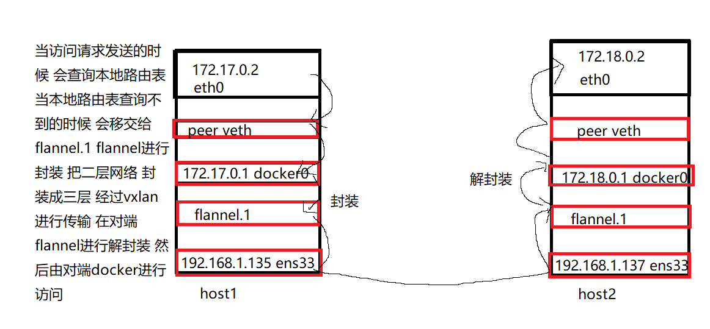

[toc]

# Docker


## Docker是什么

和内核有关的业务不适合于跑容器 

因为如果用容器跑内核相关的业务 当容器需要升级的时候 需要升级内核 一但升级内核 所有的内核都需要升级 

容器是没有内核的 

越大规模的公司 越需要容器跑业务 用来节省资源 

容器技术相对于虚拟机而言更加轻量 

红帽的云把open stack的组件全部部署在容器里面 各种组件构成了open stack

在云平台中运行容器 这样会更加轻量 

容器就是系统中的一个进程 普通的进程是无法隔离的 但是容器可以实现进程之间的隔离 

每一个容器运行的都是一个进程

容器是直接把想要的部分打包出来 而摈弃掉内核 用来节省空间 提高轻量性


## Docker的现状


docker现在已经被containerd取代 目前新版的k8s已经不支持原生的docker 

docker可能会被podman取代 

docker只是为了实现容器而发行的一种技术 是一种引擎 

docker不是容器 只是一种技术 

红帽实现容器的引擎使用的是podman 

华为的欧拉使用的是另一种引擎


## 容器的核心技术


容器是用命名空间来隔离的 namespace

容器的资源限制是用的cgroup 


## Docker核心组件 ：

docker：docker客户端 

docker-Daemon ：docker服务端

Image ：docker镜像 ，运行容器的模板 

docker-container ：docker容器

registry：docker镜像仓库 存放镜像的位置 

​	一个docker-registry可以有多个镜像仓库

​	公共的镜像仓库： dockerhub，国内的镜像站 

​	私有的镜像仓库： 

​		如果使用私有镜像 需要接私有仓库路径 

​		及那个docker镜像从镜像仓库中拉取到服务器上 然后将其运行起来 就是一个容器 


## 部署一个网站需要的步骤： 

1.安装apache/nginx 

2.修改配置文件 

3.启动服务 

4.拉取代码 /var/www/html

5.测试 

6.发布 


## 100台服务器发布相同的应用的方法：

1.将制作一个网站的步骤重复一百遍

2.ansible （自动化操作） 

3.部署到虚拟机中 虚拟机制作为镜像 基于镜像拉取虚拟机 （私有云）

4.基于容器 把这个流程做成一个容器 然后在一个平台中启动一百个容器 和虚拟机类似 

容器的操作和虚拟机相比操作没有大的区别 但是体积上比虚拟机小 架构和虚拟机类似 但是比运行在虚拟机中的系统更小


容器相对于虚拟机而言更轻量 基于Ubuntu的一个容器比较轻量 centos比较笨重 alpine很轻量只有5M

容器的操作系统一般不会用centos 


容器和虚拟机相互比较的话 轻量在操作系统上 

容器和宿主机公用一个内核 容器适合运行一些非内核操作 

而虚拟机则在内核层面操作更方便 


shell的本质就是一个应用软件 

内核是主要负责硬件调用 驱动是内核层面的内容 


操作系统组成： 内核空间 用户空间 


docker的管理是docker daemon 

kvm的管理是hypervisor


docker的底层采用了cgroup namesapce技术 

cgroup：资源限制  

namesapce：隔离


容器的进程和使用的内容在宿主机上都可以看见 使用ps可以查看 

Kata-container 把容器当作虚拟机来用 是一个开源项目 


docker不保存任何数据 持久化的数据需要保存在镜像中 对外提供服务就足够了 


镜像生成后上传到仓库中是push 拉取镜像运行docker容器是pull动作 


容器是基于镜像运行的 

一个image不对应一个容器 一个image对于多个容器 

容器在运行的时候image不能删除 如果要删除image 需要先删除image下运行的容器 

能启动的容器数量依赖宿主机的性能 

容器被stop 数据不会丢失 可以再次启动 

容器被rm 数据丢失 容器丢失 

宿主机重启 容器死亡 


docker版本 

docker-io openshift 基于docker-io 

docker-ce 17.03 17.06 17.09 18.03 18.06 18.09 19.03 20.10 社区版 

docker-ee 企业版 


运行的docker daemon就是docker引擎 

包含两个部分：docker-enqine docker-api 

docker-api 接收请求 

docker-enqine 执行动作 

所以docker daemon 作为服务端 需要做接收请求和执行动作两个需求 


yum 源自带的没有docker-ce版本 国内常用的dokcer-ce的yum源是阿里的 


docker监听在本地文件套接字中 不监听在任何端口 

监听在端口上是监听在网络套接字 

如果需要用网络上的docker 需要修改docker启动文件 让docker监听在网络套接字上  

需要修改/lib/systemd/system/docker.server 

默认情况 docker监听在本地文件 

通常情况 docker监听2375端口 


docker -H 指定docker服务端 


默认情况下 直接使用网络套接字 是一个bug 


管理众多docker集群的时候不是使用docker本机的docker来进行管理 是通过k8s来进行管理 

docker配置文件配置： 

1.docker镜像加速 

2.docker存储路径 （/var/lib/docker）

3.docker容器ip 容器网段（默认172.17.0.0/16）

4.docker输出日志 


## docker安装步骤： （centos安装）


```shell
[root@docker-1 ~]# wget -O /etc/yum.repos.d/CentOS-Base.repo https://mirrors.aliyun.com/repo/Centos-7.repo
--2022-04-14 09:15:33--  https://mirrors.aliyun.com/repo/Centos-7.repo
Resolving mirrors.aliyun.com (mirrors.aliyun.com)... 117.34.47.243, 119.96.71.240, 116.211.220.218, ...
Connecting to mirrors.aliyun.com (mirrors.aliyun.com)|117.34.47.243|:443... connected.
HTTP request sent, awaiting response... 200 OK
Length: 2523 (2.5K) [application/octet-stream]
Saving to: ‘/etc/yum.repos.d/CentOS-Base.repo’

100%[===============================================================================================>] 2,523       --.-K/s   in 0s      

2022-04-14 09:15:34 (40.4 MB/s) - ‘/etc/yum.repos.d/CentOS-Base.repo’ saved [2523/2523]

[root@docker-1 ~]# wget -O /etc/yum.repos.d/epel.repo http://mirrors.aliyun.com/repo/epel-7.repo
--2022-04-14 09:16:02--  http://mirrors.aliyun.com/repo/epel-7.repo
Resolving mirrors.aliyun.com (mirrors.aliyun.com)... 59.63.238.167, 119.96.71.244, 119.96.71.241, ...
Connecting to mirrors.aliyun.com (mirrors.aliyun.com)|59.63.238.167|:80... connected.
HTTP request sent, awaiting response... 200 OK
Length: 664 [application/octet-stream]
Saving to: ‘/etc/yum.repos.d/epel.repo’

100%[===============================================================================================>] 664         --.-K/s   in 0.003s  

2022-04-14 09:16:03 (247 KB/s) - ‘/etc/yum.repos.d/epel.repo’ saved [664/664]

[root@docker-1 ~]# yum install -y yum-utils device-mapper-persistent-data lvm2

[root@docker-1 ~]# yum-config-manager --add-repo https://mirrors.aliyun.com/docker-ce/linux/centos/docker-ce.repo
Loaded plugins: fastestmirror, langpacks
adding repo from: https://mirrors.aliyun.com/docker-ce/linux/centos/docker-ce.repo
grabbing file https://mirrors.aliyun.com/docker-ce/linux/centos/docker-ce.repo to /etc/yum.repos.d/docker-ce.repo
repo saved to /etc/yum.repos.d/docker-ce.repo

[root@docker-1 ~]# yum makecache fast 

[root@docker-1 ~]# yum -y install docker-ce
```


 


## docker管理


```shell
docker ps -a 
#查看容器是否运行 

docker run 
#运行一个容器 

docker kill 
#杀掉一个容器 

docker inspect 304c22c2cc26  
#查看容器的详细信息 

docker run -p 8080:80  
#指向本地端口:docker端口 

docker run -d 
#在后台启动容器 

docker exec -it 304c22c2cc26 /bin/bash 
#进入容器本身 

docker rm -f 
#强制删除容器

docker ps -aq | xargs docker rm -f 
#删除所有的容器 

docker ps -a | grep Exit | awk '{print $1}' | docker rm 
#删除已经退出的容器 

docker run goodsmileduck/redis-cli:latest redis-cli -h 172.17.0.3 -p 6379 info 
#可以直接在当前终端运行容器 用完退出 

docker run --rm goodsmileduck/redis-cli:latest redis-cli -h 172.17.0.3 -p 6379 info 
#可以直接在当前终端运行容器 用完退出并且删除 

docker create 
#创建一个容器

docker start 
#开启一个停止的容器

docker stop
#停止一个容器

docker kill 
#停止一个容器

docker restart 
#重启一个容器

docker rm 
#删除一个容器

docker pause 
#挂起暂停容器 

docker kill 
docker stop 
#都会删除容器
```


$@接受所有的后续参数 


虚拟机不运行的时候 会空跑 会消耗资源 

但是容器为任务而生 任务做完了之后会自动关闭 

如果不指定内存和CPU 则用多少算多少 会吃掉宿主机所有的内存和CPU

容器的生命周期是短暂的 

容器为单一任务而生 多任务会出现不必要的麻烦 


容器自己不知道什么时候退出 所以要求在容器当中运行的进程 必须在容器的前台运行 会占据一个终端 占据一个stdout 当stdout不被占用的时候 容器自己判定进程推出 当进程退出的时候容器自己判定自己退出 


PID是进程的ID


运行容器的方法： 

长任务： nginx httpd 直接放在后台运行就行 

短任务： curl 


docker run 默认加上-it参数 

docker -it 和-d 可以放在一起使用 就是把一个/bin/bash放在后台运行 

容器内的进程之后进入了容器之后才可以看见 


容器启动之后还是可以传递参数 


## 容器的资源限制：


### 内存资源限制： 

```shell
docker run -it -m 200M --memory-swap 300M ubuntu:16.04 

-m 允许分配的内存大小 

--memory-swap 允许分配的内存和swap的总大小 

--memory-swappiness 控制内存和swap的置换比例 

docker run -it -m 200M -memory-swappiness 0 progrium/stress --vm1

--vm-bytes 180M 

--vm 设置内存工作线程数 

--vm-byptes 设置单个内存工作线程使用的内存大小 
```


使用容器的时候不建议开启swap 会降低系统性能 

容器启动的时候才可以增加资源限制 启动的时候如果没有限制 则限制不住 


当容器已经运行了一个指令之后 可以直接在容器后加一个参数 

docker run -it redis-cli:latest -h 127.0.0.1 -p 6379 

docker run -it redis-cli:latest redis-cli -j 127.0.0.1 -p 6379 


首先会参考物理机的资源参考 对容器进行资源限制


### CPU资源限制： 

-c 指定CPU权重 

docker的cpu资源不是按赫兹来计算的 是按照重要性来分配的 


内存理论上是不能超分配了 实际使用的内存也不能超过宿主机使用的大小 

内存资源是不可压缩资源 只能采用复用等手段来减少内存消耗 


CPU是可压缩资源 CPU的资源是按照时间来分配的 按照时间的百分比来限制 限制容器使用CPU资源的时长

1核 = 1024的权重 

申请权重的时候 权重高的吃掉的CPU多 当权重一样的时候需要按照任务的重要性来均分CPU 

申请权重只是申请相对的重要性 不是绝对的数据 

权重只有在所有的业务都很繁忙 满负荷运行的时候才会生效 

所有繁忙业务的权重加起来 算百分比 权重高的得到的资源多 


## 镜像管理：


```shell
docker image ls 
#查看本地下载的镜像 

docker rmi -f 
#强制删除容器镜像 当容器停止的时候可以强制删除镜像 

docker pull 
#拉取镜像 但是不创建容器 

docker tag alpine hub.yutianedu.com/library/aplpine:3.7 
#制作镜像的别名 镜像ID一样 类似于制作硬链接 不能正常删除 只能强制删除 

docker push 
#推送镜像到仓库 

docker save -o alpine:3.7.tar hub.yutianedu.com/library/alpine:3.7 
#把镜像导出为一个tar包 

docker load --input alpine:3.7.tar 
#把tar包的镜像导入 
```


镜像仓库必须是一个http服务 不能推送到本地 必须要搭建一个网站来存放镜像


镜像被删除了 容器还是可以继续使用 如果有人容器占据了一个镜像 强制删除镜像只是表面删除了镜像 实际上镜像不会被删除 


当没有指定tag的时候 默认为latest 但是latest没有任何含义 人为规定是最新版本 但是没有强制规定 


### docker制作镜像：

1.获得基础镜像 

2.启动容器

3.在容器中执行相应的脚本

4.关闭容器

5.使用当前容器生成新的镜像 

6.释放容器 

在制作镜像的时候有两个方法 一个是手动做 另一个是编写dockerfile脚本来制作 


Linux文件系统： 

操作系统由用户空间和内核空间 即rootfs和bootfs 其中在系统开机的时候 会加载bootfs 当bootfs 加载结束后 卸载bootfs 挂在rootfs 


docker的文件系统： 

docker镜像的操作系统是rootfs 不包含rootfs 会使得体积轻量 

docker 容器的设计是只读不可写 

如果镜像需要写操作 则向上叠加 拥有一个单独的可写层 


拉取镜像的时候也是分层拉取 


镜像默认不能超过128层


容器在分配的时候会给一个读写层

读写层是个临时的空间


用时分配 写的时候挂载一个读写层 不占空间 用一点分配一点 用多少分配多少 按需分配 

写时复制 如果要修改原本的镜像的话 会从基础镜像中复制到读写层 然后保存到读写层中 需要做成镜像来永久保存 

容器存储满足用时分配和写时复制两个驱动 


docker存储驱动：overlay2（最流行的） 


### 制作docker镜像两种方法：


1.使用dockercommit把基础镜像制作为新容器： 

docker pull centos:7 拉取一个新的基础容器 

docker run -it centos:7 /bin/bash  进入基础容器 

yum -y install openssh-server 在容器内安装需要的服务 

docker commit -m "install sshd" 5af07e84f68a openssh:1.0 生成一个新的镜像 

docker run 运行新的镜像 

可以通过编写脚本的方式来启动服务 

可以使用一个正在up的容器为基础镜像 直接生成一个新的镜像 可以达到直接使用


2.dockerfile

```shell
FROM scratch 
#指定空白镜像 空白镜像也需要指定 

FROM centos:7  
#指定基础镜像

LABEL wangzhendong wangzhendong@qq.com 
#指定作者 

RUN yum -y install openssh-server \

&& useradd user1 \

&& echo "111" | passwd --stdin root 

&& echo "111" | passwd --stdin user1 

ADD ssh_host_rsa_key /etc/ssh/ssh_host_rsa_key

ADD ssh_host_ed25519_key /etc/ssh/ssh_host_ed25519_key

ADD ssh_host_ecdsa_key /etc/ssh/ssh_host_ecdsa_key

RUN   chmod 600 /etc/ssh/ssh_host_rsa_key

RUN   chmod 600 /etc/ssh/ssh_host_ed25519_key

RUN   chmod 600 /etc/ssh/ssh_host_ecdsa_key

CMD ["/usr/sbin/sshd","-D"]


[root@docker-1 ~]# docker build -t openssh:1.3 /docker 
#构建镜像 
```


### Dockerfile：

FROM 引入基础镜像信息 

LABEL 作者信息 

CMD 镜像启动为容器之后 默认执行的任务 

\#    注释

ENV 指定一个环境变量 会被后续的RUN使用 并在容器运行的时候保持 

EVN <key> <value> 

ADD <src> <dest> 复制指定的src到dest  src不能是绝对路径 必须是和dockerfile在同一级 或者是src所在目录和dockerfile在同一级目录 

ADD在拷贝压缩包的时候 会自动解压 而COPY不会自动解压 

COPY 可以拷贝压缩包 

WORKDIR 指定工作目录 

USER 指定用户 

WORD和USER可以在同一个dockerfile中的多个地方出现 

RUN 可以多次出现 每执行一个RUN 都会添加一个新层 

每个ADD COPY RUN一定会创建一个新层 尽量要少用这些关键字 尽量合并为同一个命令 

EXPOSE 对外申明端口 只是让别人使用的时候知道 只是一个申明 

CMD ["命令"，"选项"，"参数"] 容器启动时执行默认指令 如果用户在启动的时候传递一个任务 则CMD不会被执行 

ENTRYPOINT 配置容器启动后执行指令 不会被docker run 提供的指令进行覆盖 

每个dockerfile只有一个entrypoint会被执行 

ENTRYPOINT ["","",""] 在容器启动时执行一个指令 和CMD不一样的是 他执行的是无法被覆盖的 当ENTRYPOINT和CMD同时定义 则CMD会把ENTRYPOINT定义为一个参数；ENTRYPOINT通常是一个脚本 用于容器在运行的时候执行必要的初始化操作 比如修改配置文件 创建数据库 。。。。

当有ENTRYPOINT 的时候 CMD会被当作一个参数传输给ENTRYPOINT 

只要是ENTRYPOINT要运行一个脚本 则需要在脚本最后加上exec"$@"

VOLUME 自动挂在宿主机目录 默认挂在/var/lib/docker/volume 这样的挂载不会覆盖源目录 如果采用-v执行挂载会覆盖目标  -v 参数可以多次使用 

docker -e 向docker传递变量  


### dockerfile最佳实践：


1.尽可能让变更少的镜像层优先构建 二次构建的时候 利用镜像的缓存特性提升构建效率 

2.尽可能少使用关键字 使用一次关键字 就会创建一个新的读写层

3.尽可能清理不必要的文件 使构建之后的镜像尽可能小 


## docker数据管理和网络管理


容器支持挂载数据盘 不能挂在裸设备 

数据卷可以是文件或者目录 可以共享数据卷 对数据卷修改立马生效 对数据卷更新 不会影响镜像 数据卷会一直存在 即使容器删除 数据卷也存在 

容器启动的时候就需要挂载这个数据卷 

docker run -v /data:/usr/share/nginx/html 实现挂载操作 使用本地/data目录来覆盖/usr/share/nginx/html 

先挂载 再执行ENTRYPOINT 


容器的生命周期之内 数据卷不能卸载 删除容器的时候 数据卷不会被默认删除 

docker rm -fv 删除容器以及数据卷 


### docker的四种网络模式：


1.bridge 使用桥接网络 严格来讲是虚拟化中的NAT模式

docker0相当于是一个虚拟交换机 充当容器网关的角色 

docker的默认网络为bridge 

原理是通过iptables的snat转发实现对外访问 需要开启内核的net.ipv4.ip_forward=1 

使用iptables的dnat端口映射 实现外部访问容器 

docker run -d --dns 8.8.8.8 -p 80:80 httpd:2.4 这样的-p的行为 原理采用了dnat 自己分配端口进行映射 

docker run -d --dns 8.8.8.8 -P httpd:2.4 这样-P 原理也是采用了dnat 讲一个空闲的端口 分配给httpd容器已经被export指定了的默认端口 进行映射 

iptables -t nat -nL 查看iptables的网络策略 

两台主机的容器一般情况是不能通信的 

容器没有桥接的功能 只能做地址转换 


2.host 使用主机的网络 和宿主机共享网络地址 但是多容器需要解决冲突的问题 

```shell
docker run -it --network host busybox:latest  /bin/sh 
```


3.none 没有IP地址 只有自己一个回环网卡 

```shell
docker run -it --network none host busybox:latest /bin/sh 
```


4.用户自定义 

```shell
docker network create --driver bridge my_net 
#创建my_nat网络 

docker network inspect my_net 
#查看网络状态 

docker network create --driver bridge --subnet 172.20.16.0/24 --gateway 172.20.16.1 my_net2 
#通过定义子网和网关来创建my_net2网络 

#可以通过自定义网络来实现容器网络的隔离 
```


### 同一台主机采用不同的容器 使用不同的子网 互相通信实验：


1.给容器加两个网卡 和目标网络通信 

docker network connect my_net2 80772271292d  添加网卡到80772271292d容器


2.使用link的方式连接 

docker run -d --link 容器1：容器2  


## docker的镜像仓库搭建实验：


####  流行的公共镜像仓库：

1.hub.docker.com （可以直接使用国内代理 ）

2.quay.io --> quay.azk8s.cn（需要翻墙）

3.gcr.io --> gcr.azk8s.cn（需要翻墙）

dokcer registry 


创建私有镜像仓库需求：不一定所有的机器都可以上网 需要创建私有仓库 


#### 搭建私有镜像仓库：

| docker01 | dockder的主机     |
| -------- | ----------------- |
| docker02 | registry 私有仓库 |


```shell
[root@docker02 ~]# docker run -d -p 5000:5000 -v /opt/data/:/var/lib/registry  registry  
#搭建仓库的容器 
#(/var/lib/registry 默认存储镜像的地方 -v指定目录 目的为了做持久化)

[root@docker02 ~]# docker exec -it registry /bin/sh 
#进入容器 

/# vi /etc/docker/registry/config.yml  
 
storage：

	delete:

		enabled: true
#编辑仓库文件 允许删除镜像 否则添加之后无法删除

[root@docker01 ~]# docker tag nginx:v2.0 192.168.1.137:5000/nginx:v2.0  
#修改容器的名字为带有仓库ip的名字 

[root@docker01 ~]# vim /usr/lib/systemd/system/docker.service 
添加--insecure-registry 192.168.1.137:5000到
ExecStart=/usr/bin/dockerd -H fd://  --containerd=/run/containerd/containerd.sock --insecure-registry 192.168.1.137:5000最后 允许http协议通过 

[root@docker01 ~]# systemctl restart docker  
#重启docker服务

[root@docker01 ~]# docker push 192.168.1.137:5000/nginx:v2.0 
#推送镜像至目标仓库

[root@docker01 ~]# curl -XGET http://192.168.1.137:5000/v2/_catalog  
#查看目标仓库拥有的容器 
```

 

#### 备份容器：

```shell


[root@docker02 ~]# docker export -o registry.tar a2a01e93da9a  
#备份容器当时状态 

[root@docker02 ~]# docker import registry.tar 
#通过tar包上传镜像 
```


## Flannel实验


### 架构图



### 应用场景

主要是为了应对不通主机之间容器通信而设计的解决方案 


### 操作步骤

#### 1.docker-network节点配置etcd服务作为etcd数据库

```shell
[root@docker-network ~]# tar -zxvf etcd-v3.5.1-linux-amd64.tar.gz 解压etcd软件包 
[root@docker-network ~]# cd etcd-v3.5.1-linux-amd64/ 
[root@docker-network etcd-v3.5.1-linux-amd64]# cp -p etcd* /usr/local/bin/ 
[root@docker-network etcd-v3.5.1-linux-amd64]#mkdir /var/lib/etcd
[root@docker-network ~]# cat /usr/lib/systemd/system/etcd.service 
[Unit] 
Description=etcd_service 
[Service] 
ExecStart=/usr/local/bin/etcd --name etcd1 --data-dir /var/lib/etcd --listen-client-urls [http://192.168.0.203:2379,http://127.0.0.1:2379](http://192.168.0.203:2379,http:/127.0.0.1:2379) --advertise-client-urls [http://192.168.0.203:2379,http://127.0.0.1:2379](http://192.168.0.203:2379,http:/127.0.0.1:2379) --enable-v2 
[Install] 
WantedBy=multi-user.target  //地址为docker-network本机IP地址
[root@docker-network ~]# systemctl daemon-reload 
[root@docker-network ~]# systemctl enable etcd.service 
[root@docker-network ~]# systemctl restart etcd.service [root@docker-network ~]# netstat -tulnp |grep :2379 
[root@docker-network ~]# ETCDCTL_API=2 etcdctl --endpoints http://127.0.0.1:2379 set /coreos.com/network/config '{"Network": "172.16.0.0/16", "SubnetLen": 24, "SubnetMin": "172.16.1.0","SubnetMax": "172.16.10.0", "Backend": {"Type": "vxlan"}}'
[root@docker-network ~]# ETCDCTL_API=2 etcdctl --endpoints http://192.168.0.203:2379 get /coreos.com/network/config
[root@docker-network ~]#systemctl disable firewalld 
[root@docker-network ~]#systemctl stop firewalld 
##etcd的版本是有区别的 需要仔细查看版本
```


#### 2.docker01节点作为flannel节点 （docker02同理）

```shell
[root@docker01 ~]#tar -zxvf flannel-v0.15.1-linux-amd64.tar.gz  

[root@docker01 ~]# cp -p flanneld mk-docker-opts.sh /usr/local/bin/ 

[root@docker01 ~]# cat /usr/lib/systemd/system/flanneld.service 

[Unit] 

Description=Flanneld 

Documentation=https://github.com/coreos/flannel 

After=network.target Before=docker.service 

[Service] 

User=root 

ExecStartPost=/usr/local/bin/mk-docker-opts.sh 

ExecStart=/usr/local/bin/flanneld --etcd-endpoints=http://192.168.0.203:2379 --iface=192.168.0.209 --ip-masq=true --etcd-prefix=/coreos.com/network Restart=on-failure Type=notify 

LimitNOFILE=65536 

[Install] WantedBy=multi-user.target


[root@docker01 ~]# systemctl daemon-reload 

[root@docker01 ~]# systemctl enable flanneld.service 

[root@docker01 ~]# systemctl restart flanneld.service 

[root@docker02 ~]# ifconfig 

docker0: flags=4099<UP,BROADCAST,MULTICAST>  mtu 1500
	inet 172.16.1.1 netmask 255.255.255.0 broadcast 172.16.1.255
	inet6 fe80::42:c9ff:fec9:bb99 prefixlen 64  scopeid 0x20<link>
	ether 02:42:c9:c9:bb:99 txqueuelen 0  (Ethernet)
	RX packets 19 bytes 1484 (1.4 KiB)
	RX errors 0 dropped 0  overruns 0 frame 0
	TX packets 34 bytes 3697 (3.6 KiB)
	TX errors 0 dropped 0 overruns 0 carrier 0  collisions 0


ens33: flags=4163<UP,BROADCAST,RUNNING,MULTICAST> mtu 1500
	inet 192.168.1.137 netmask 255.255.255.0 broadcast 192.168.1.255
	inet6 fe80::dbbe:22c2:9c99:d5aa prefixlen 64  scopeid 0x20<link>
	ether 00:0c:29:12:96:08 txqueuelen 1000 (Ethernet)
	RX packets 141769 bytes 157687147 (150.3 MiB)
    RX errors 0 dropped 0  overruns 0 frame 0
	TX packets 54227 bytes 3795526 (3.6 MiB)
	TX errors 0 dropped 0 overruns 0 carrier 0  collisions 0


flannel.1: flags=4163<UP,BROADCAST,RUNNING,MULTICAST> mtu 1450
	net 172.16.1.0 netmask 255.255.255.255 broadcast 172.16.1.0
	inet6 fe80::a8df:bff:fe52:b5b0 prefixlen 64  scopeid 0x20<link>
	ether aa:df:0b:52:b5:b0 txqueuelen 0  (Ethernet)
	RX packets 20 bytes 1680 (1.6 KiB)
	RX errors 0 dropped 0  overruns 0 frame 0X packets 17 bytes 1428 (1.3 KiB)
	TX errors 0 dropped 38 overruns 0 carrier 0  collisions 0


[root@docker01 ~]# cat /run/flannel/subnet.env 

FLANNEL_NETWORK=172.16.0.0/16 

FLANNEL_SUBNET=172.16.5.1/24 

FLANNEL_MTU=1450 

FLANNEL_IPMASQ=true 


[root@docker01 ~]# cat /run/docker_opts.env 

DOCKER_OPT_BIP="--bip=172.16.5.1/24" 

DOCKER_OPT_IPMASQ="--ip-masq=false" 

DOCKER_OPT_MTU="--mtu=1450" 

DOCKER_OPTS=" --bip=172.16.5.1/24 --ip-masq=false --mtu=1450"


[root@docker01 ~]#vim /usr/lib/systemd/system/docker.service

EnvironmentFile=-/run/docker_opts.env

ExecStart=/usr/bin/dockerd $DOCKER_OPTS -H fd:// containerd=/run/containerd/containerd.sock


[root@docker01 ~]# systemctl daemon-reload 


[root@docker01 ~]# systemctl restart docker.service
```


### 原理

flannel有三种转发模式 这个实验是使用的vxlan 如果要修改的话 直接在etcd里面修改键值对 

UDP性能最差 其次差的事vxlan 是最通用的 但是网络性能衰减在20% 

host-gw网络性能最好 host-gw的原理就是去直接加路由 自动去添加明细路由 自动修改docker0网段 但是host-gw的限制要求是宿主机必须在同一个网段 如果跨网段就没办法进行通信 


calico的性能比flannel要好 calico可以跨网段 

calico的两种转发模式： bgp ipip

calico的bgp转发相当于flannel的host-gw ipip相当于vxlan 

bgp的要求：所有容器所在的宿主机 不可以跨网段 

calico的优势是自动配置转发模式 默认两种转发同时开启 

架构和flannel相同 calico可以自动判断宿主机是否跨网段 

bgp和ipip可以自动转发 

calico还可以做流量控制 

k8s官方默认推荐的网络是flannel 


openshift中使用的是OVS(openvswitch)采用了隧道协议  在容器领域 出现的频率不高 但是在openstack中使用广泛 


Flannel和calico网络配置 非docker自带网络 最主流的网络 

需求：不同容器之间互通 

相对比虚拟机的区别 ： 虚拟机可以通过上行链路进行通信 而docker没有上行链路 只能通过第三方来进行操作 

三台机器 etcd flannel flannel 

原理实现： 在安装了flannel之后 会生成一个flannel网络 容器网络通过flannel网卡之后会经过封装 封装之后会通过传输 到达对端flannel网络 然后对端flannel网络通过解封装来使得对端容器进行访问 


## harbor私有仓库实验：

harbor--->VMware中国社区 界面全是中文 有英文版 

quay-->红帽收购了quay之后 给开源了 

harbor代码托管在GitHub中 

版本：v1.9.3

harbor从1.8之前采用.cfg文件修改配置文件 1.8之后采用.yml文件来修改配置 

harbor也是由容器组成的 部署的时候也是运行容器 

### harbor组件：

registry 仓库主体 

UI 提供一个UI界面 

jobservice 执行临时任务 

redis 缓存组件 

postgres 提供数据库 

nginx 反向代理 主要由nginx来提供 

logservice 记录日志文件 

adminserver 后台管理系统 

harbor支持主从复制  可以通过jobservice自动同步到另一个harbor 

用户授权通过数据库


### 操作步骤：

#### 1.上传harbor软件包 生成自签名证书

```shell
wget https://github.com/goharbor/harbor/releases/download/v1.9.3/harbor-online-installer-v1.9.3.tgz
tar -zxvf harbor-online-installer-v1.9.3.tgz 
cp -r -p harbor /usr/local/ 
cd /usr/local/harbor 
mkdir pki
cd pki
openssl genrsa -des3 -out server.key 1024  生成自签名证书 
openssl rsa -in server.key -out server.key  去除自签名证书密码
[root@docker01 pki]# openssl req -new -key server.key -out server.csr  签发证书 
[root@docker01 pki]# openssl x509 -req -days 365 -in server.csr -signkey server.key -out server.crt  
##自签名证书做完 
```

#### 2.安装docker-compose

```shell
wget https://github.com/docker/compose/releases/download/1.25.0/docker-compose-Linux-x86_64 
chmod +x docker-compose-Linux-x86_64
mv docker-compose-Linux-x86_64 /usr/bin/docker-compose
iptables -F 
systemctl daemon-reload  
sysetmctl restart docker 
```

#### 3.修改.yml文件

```powershell
[root@kubernetes-master harbor]# cat harbor.yml 
# Configuration file of Harbor

# The IP address or hostname to access admin UI and registry service.
# DO NOT use localhost or 127.0.0.1, because Harbor needs to be accessed by external clients.
hostname: 192.168.1.145        //修改主机名

# http related config
#http:
  # port for http, default is 80. If https enabled, this port will redirect to https port
 # port: 80                    
 //注释http

# https related config
https:
  # https port for harbor, default is 443
  port: 443
  # The path of cert and key files for nginx
  certificate: /usr/local/harbor/pik/server.crt      //指定crt文件
  private_key: /usr/local/harbor/pik/server.key      // 指定key文件 

# # Uncomment following will enable tls communication between all harbor components
# internal_tls:
#   # set enabled to true means internal tls is enabled
#   enabled: true
#   # put your cert and key files on dir
#   dir: /etc/harbor/tls/internal

# Uncomment external_url if you want to enable external proxy
# And when it enabled the hostname will no longer used
# external_url: https://reg.mydomain.com:8433

# The initial password of Harbor admin
# It only works in first time to install harbor
# Remember Change the admin password from UI after launching Harbor.
harbor_admin_password: Harbor12345

# Harbor DB configuration
database:
  # The password for the root user of Harbor DB. Change this before any production use.
  password: root123
  # The maximum number of connections in the idle connection pool. If it <=0, no idle connections are retained.
  max_idle_conns: 100
  # The maximum number of open connections to the database. If it <= 0, then there is no limit on the number of open connections.
  # Note: the default number of connections is 1024 for postgres of harbor.
  max_open_conns: 900

# The default data volume
data_volume: /data

# Harbor Storage settings by default is using /data dir on local filesystem
# Uncomment storage_service setting If you want to using external storage
# storage_service:
#   # ca_bundle is the path to the custom root ca certificate, which will be injected into the truststore
#   # of registry's and chart repository's containers.  This is usually needed when the user hosts a internal storage with self signed certificate.
#   ca_bundle:

#   # storage backend, default is filesystem, options include filesystem, azure, gcs, s3, swift and oss
#   # for more info about this configuration please refer https://docs.docker.com/registry/configuration/
#   filesystem:
#     maxthreads: 100
#   # set disable to true when you want to disable registry redirect
#   redirect:
#     disabled: false

# Trivy configuration
#
# Trivy DB contains vulnerability information from NVD, Red Hat, and many other upstream vulnerability databases.
# It is downloaded by Trivy from the GitHub release page https://github.com/aquasecurity/trivy-db/releases and cached
# in the local file system. In addition, the database contains the update timestamp so Trivy can detect whether it
# should download a newer version from the Internet or use the cached one. Currently, the database is updated every
# 12 hours and published as a new release to GitHub.
trivy:
  # ignoreUnfixed The flag to display only fixed vulnerabilities
  ignore_unfixed: false
  # skipUpdate The flag to enable or disable Trivy DB downloads from GitHub
  #
  # You might want to enable this flag in test or CI/CD environments to avoid GitHub rate limiting issues.
  # If the flag is enabled you have to download the `trivy-offline.tar.gz` archive manually, extract `trivy.db` and
  # `metadata.json` files and mount them in the `/home/scanner/.cache/trivy/db` path.
  skip_update: false
  #
  # The offline_scan option prevents Trivy from sending API requests to identify dependencies.
  # Scanning JAR files and pom.xml may require Internet access for better detection, but this option tries to avoid it.
  # For example, the offline mode will not try to resolve transitive dependencies in pom.xml when the dependency doesn't
  # exist in the local repositories. It means a number of detected vulnerabilities might be fewer in offline mode.
  # It would work if all the dependencies are in local.
  # This option doesn’t affect DB download. You need to specify "skip-update" as well as "offline-scan" in an air-gapped environment.
  offline_scan: false
  #
  # insecure The flag to skip verifying registry certificate
  insecure: false
  # github_token The GitHub access token to download Trivy DB
  #
  # Anonymous downloads from GitHub are subject to the limit of 60 requests per hour. Normally such rate limit is enough
  # for production operations. If, for any reason, it's not enough, you could increase the rate limit to 5000
  # requests per hour by specifying the GitHub access token. For more details on GitHub rate limiting please consult
  # https://developer.github.com/v3/#rate-limiting
  #
  # You can create a GitHub token by following the instructions in
  # https://help.github.com/en/github/authenticating-to-github/creating-a-personal-access-token-for-the-command-line
  #
  # github_token: xxx

jobservice:
  # Maximum number of job workers in job service
  max_job_workers: 10

notification:
  # Maximum retry count for webhook job
  webhook_job_max_retry: 10

chart:
  # Change the value of absolute_url to enabled can enable absolute url in chart
  absolute_url: disabled

# Log configurations
log:
  # options are debug, info, warning, error, fatal
  level: info
  # configs for logs in local storage
  local:
    # Log files are rotated log_rotate_count times before being removed. If count is 0, old versions are removed rather than rotated.
    rotate_count: 50
    # Log files are rotated only if they grow bigger than log_rotate_size bytes. If size is followed by k, the size is assumed to be in kilobytes.
    # If the M is used, the size is in megabytes, and if G is used, the size is in gigabytes. So size 100, size 100k, size 100M and size 100G
    # are all valid.
    rotate_size: 200M
    # The directory on your host that store log
    location: /var/log/harbor

  # Uncomment following lines to enable external syslog endpoint.
  # external_endpoint:
  #   # protocol used to transmit log to external endpoint, options is tcp or udp
  #   protocol: tcp
  #   # The host of external endpoint
  #   host: localhost
  #   # Port of external endpoint
  #   port: 5140

#This attribute is for migrator to detect the version of the .cfg file, DO NOT MODIFY!
_version: 2.5.0

# Uncomment external_database if using external database.
# external_database:
#   harbor:
#     host: harbor_db_host
#     port: harbor_db_port
#     db_name: harbor_db_name
#     username: harbor_db_username
#     password: harbor_db_password
#     ssl_mode: disable
#     max_idle_conns: 2
#     max_open_conns: 0
#   notary_signer:
#     host: notary_signer_db_host
#     port: notary_signer_db_port
#     db_name: notary_signer_db_name
#     username: notary_signer_db_username
#     password: notary_signer_db_password
#     ssl_mode: disable
#   notary_server:
#     host: notary_server_db_host
#     port: notary_server_db_port
#     db_name: notary_server_db_name
#     username: notary_server_db_username
#     password: notary_server_db_password
#     ssl_mode: disable

# Uncomment external_redis if using external Redis server
# external_redis:
#   # support redis, redis+sentinel
#   # host for redis: <host_redis>:<port_redis>
#   # host for redis+sentinel:
#   #  <host_sentinel1>:<port_sentinel1>,<host_sentinel2>:<port_sentinel2>,<host_sentinel3>:<port_sentinel3>
#   host: redis:6379
#   password: 
#   # sentinel_master_set must be set to support redis+sentinel
#   #sentinel_master_set:
#   # db_index 0 is for core, it's unchangeable
#   registry_db_index: 1
#   jobservice_db_index: 2
#   chartmuseum_db_index: 3
#   trivy_db_index: 5
#   idle_timeout_seconds: 30

# Uncomment uaa for trusting the certificate of uaa instance that is hosted via self-signed cert.
# uaa:
#   ca_file: /path/to/ca

# Global proxy
# Config http proxy for components, e.g. http://my.proxy.com:3128
# Components doesn't need to connect to each others via http proxy.
# Remove component from `components` array if want disable proxy
# for it. If you want use proxy for replication, MUST enable proxy
# for core and jobservice, and set `http_proxy` and `https_proxy`.
# Add domain to the `no_proxy` field, when you want disable proxy
# for some special registry.
proxy:
  http_proxy:
  https_proxy:
  no_proxy:
  components:
    - core
    - jobservice
    - trivy

# metric:
#   enabled: false
#   port: 9090
#   path: /metrics

# Trace related config
# only can enable one trace provider(jaeger or otel) at the same time,
# and when using jaeger as provider, can only enable it with agent mode or collector mode.
# if using jaeger collector mode, uncomment endpoint and uncomment username, password if needed
# if using jaeger agetn mode uncomment agent_host and agent_port
# trace:
#   enabled: true
#   # set sample_rate to 1 if you wanna sampling 100% of trace data; set 0.5 if you wanna sampling 50% of trace data, and so forth
#   sample_rate: 1
#   # # namespace used to differenciate different harbor services
#   # namespace:
#   # # attributes is a key value dict contains user defined attributes used to initialize trace provider
#   # attributes:
#   #   application: harbor
#   # # jaeger should be 1.26 or newer.
#   # jaeger:
#   #   endpoint: http://hostname:14268/api/traces
#   #   username:
#   #   password:
#   #   agent_host: hostname
#   #   # export trace data by jaeger.thrift in compact mode
#   #   agent_port: 6831
#   # otel:
#   #   endpoint: hostname:4318
#   #   url_path: /v1/traces
#   #   compression: false
#   #   insecure: true
#   #   timeout: 10s

# enable purge _upload directories
upload_purging:
  enabled: true
  # remove files in _upload directories which exist for a period of time, default is one week.
  age: 168h
  # the interval of the purge operations
  interval: 24h
  dryrun: false
```

#### 4.运行./prepare 文件

#### 5.运行./install 

前提是安装docker-compose（docker-compose的作用是做单机容器编排）

需要做一次域名解析 写入hosts文件 

在推送镜像的时候 https是自签名证书 是一个不安全的证书 所以还是需要和http推送的时候一样 都需要放行不安全协议 

并且都需要做域名解析 

推送镜像的时候需要登录 

docker login https://hub.yutianedu.com 

镜像能不能公共读 和镜像无关 和仓库的访问规则有关 

当仓库是公开的时候 不需要登录就可以直接下载 但是不能推送 除非是项目管理员 

当仓库是私有的时候 下载镜像 需要登录


harbor支持第三方对象存储 

harbor的仓库还是使用的原生的registry 


harbor高级特性： 

默认是数据库认证 开启了数据库认证之后不能再修改了

在创建用户之后 会自动启用数据库认证 

harbor模式不提供删除的API接口 需要自己手动删除 

harbor主从复制 核心 


docker三架马车： 

docker machine 批量安装dcoker的工具 

docker swarm 和k8s一样 提供自动调度的能力 但是已经被淘汰 

docker compose 容器单机编排服务 

docker compose up -d 自动启动已经死亡的容器 

采用yml语法进行编写 


podman docker 三个容器引擎 


容器技术实现组件： docker-api containerd runc （本质上都是docker内部的组件 ）

指令下发到docker-api之后 docker-api会调用containerd 让containerd创建计算资源 但是container本身也不执行任务 containerd调用runc runc调用Cgroup namespace 来创建出一个容器 然后容器的父进程为containerd接管 名称是containerd-shim docker-network docker-volume 来负责创建容器的网络和存储 


docker的核心是containerd 包含了计算资源的创建 


容器运行时顾名思义就是要掌控容器运行的整个生命周期，以 docker 为例，其作为一个整体的系统，主要提供的功能如下：

- 制定容器镜像格式
- 构建容器镜像 docker build
- 管理容器镜像 docker images
- 管理容器实例 docker ps
- 运行容器 docker run
- 实现容器镜像共享 docker pull/pu