# docker-1 

Cgroup：容器资源限制

namespace：容器隔离

VM VS  Docer 

​    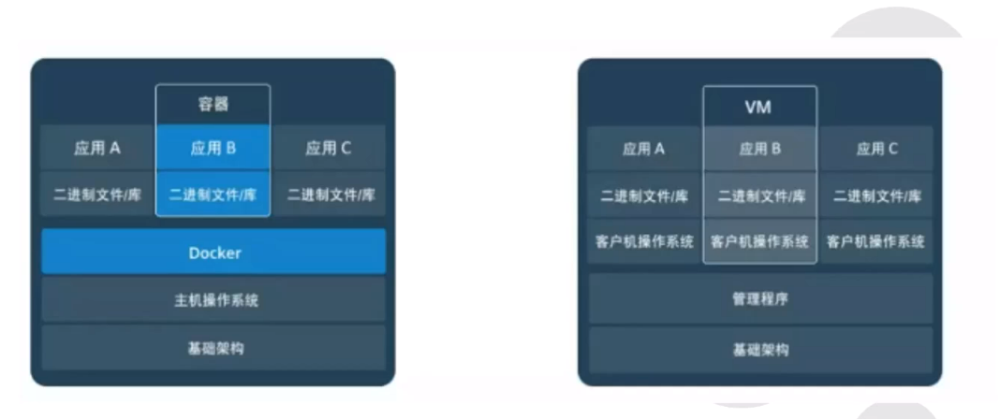

VM得优势是有个性化，可以有不同得内核

**Doker得核心组件：**

Docker客户端

DOcker Daemon：Docker服务端

Dokcer镜像 image

Docker容器  Docker Contaniner

Docker镜像仓库   registry    //类似与私有云中得镜像

架构图

Docker host ：容器得宿主机

Docker daemon：容器得进程 相当于VMM层

镜像images：运行容器的模板，hub.Dokcer.com上有很多镜像

​    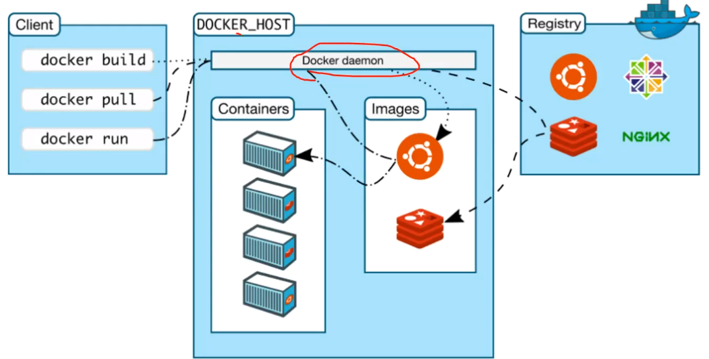

Doker镜像的命名：

mysql1:5.6    mysql是镜像的名称，5.6是镜像的版本

Dokcer registry提供镜像仓库

Docker registry提供镜像仓库服务

Docker  registry可以包含多个镜像仓库

docker-io  早期的版本，不用了

docker-ce社区版本-相当于centos

docker-ee企业版-相当于redhat

下载dokcer

developer.aliyun.com/mirror/ 阿里云镜像站

安装Dokcer

​                \# step 1: 安装必要的一些系统工具 sudo yum install -y yum-utils device-mapper-persistent-data lvm2 # Step 2: 添加软件源信息 sudo yum-config-manager --add-repo https://mirrors.aliyun.com/docker-ce/linux/centos/docker-ce.repo sudo yum makecache fast  //建立docker缓存     sudo yum -y install docker-ce # Step 4: 开启Docker服务 sudo service docker start              

默认使用外国的dockerhub速度比较慢，所以修改镜像站：

镜像加速器

使用加速器可以提升获取Docker官方镜像的速度

加速器

| 加速器地址                               |
| ---------------------------------------- |
| https://zw9ws46f.mirror.aliyuncs.com复制 |

操作文档

-   Ubuntu
-   CentOS
-   Mac
-   Windows

\1. 安装／升级Docker客户端

推荐安装1.10.0以上版本的Docker客户端，参考文档[docker-ce](https://yq.aliyun.com/articles/110806)

\2. 配置镜像加速器

针对Docker客户端版本大于 1.10.0 的用户

您可以通过修改daemon配置文件/etc/docker/daemon.json来使用加速器

 //将下面的内容写入到daemon.json

​                 sudo mkdir -p /etc/docker sudo tee /etc/docker/daemon.json <<-'EOF'    {  "registry-mirrors": ["https://zw9ws46f.mirror.aliyuncs.com"] }              

sudo systemctl daemon-reload      sudo systemctl restart docker   //重启一下docker

运行容器：

**1.拉取一个镜像**

docker pull nginx

**2.查看拉取的镜像**

[root@dokcer01 ~]# docker images

REPOSITORY   TAG       IMAGE ID       CREATED      SIZE

nginx        latest    605c77e624dd        3 days ago   141MB

名字        标签                                       三天内拉取的   大小

**3.创建docker** 

 [root@dokcer01 ~]# docker create --name web1 nginx     //创建一个容器使用镜像nginx，名字为web1，如果不制定版本，默认就是最新版

45f58c5212ebbba721a01f6e4d1ad523eaca88f868bb76ac00d77693d9a94b7c

[root@dokcer01 ~]# docker ps -a   //查看所有容器，不加a只能看到运行的容器

CONTAINER ID   IMAGE     COMMAND                  CREATED         STATUS    PORTS     NAMES

45f58c5212eb   nginx     "/docker-entrypoint.…"   4 seconds ago   Created             web1    

**4.运行 docker** 

[root@dokcer01 ~]# docker start web1   //启动容器

web1  

[root@dokcer01 ~]# docker ps           

CONTAINER ID   IMAGE     COMMAND                  CREATED         STATUS         PORTS     NAMES

45f58c5212eb   nginx     "/docker-entrypoint.…"   4 minutes ago   Up 2 minutes   80/tcp    web1

**5.拉取创建运行docker，一件三联**

 docker run -d  httpd  

一定要加后台运行，否则会占用前台进程终端就不能进行操作了，ctrl+c取消后，容器就删除了

​    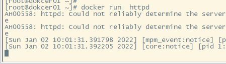

**6.删除docker**

docker rm   httpd   //需要先停止

docker rm  -f httpd    //强制删除

**8.停止容器**

docker stop web1  停止容器

容器为任务而生

服务类型容器 持续运行

工具类容器    任务完成后就结束了

**7.参数**

-d 后台运行,不加-it的话就在前台运行，前台结束之后容器就会结束

-p 端口映射  前面宿主机的端口，后面容器的端口

--name  容器的名字

--rm就是容器一旦关闭

​                 docker run -d -p 8081:80  --name web4 nginx              

**8.进入容器**

[root@dokcer01 ~]# docker exec -it web4 /bin/bash 

 i   交互式 

 -t  为容器分配一个tty终端

/bin/bash的命令，执行后会有终端，有些容器没有/bin/bash那么根本就进不去

web4 容器的名字或id

/bin/bash    使用的shell

​                root@7ed567396923:~# uname -r   //查看内核版本 3.10.0-862.el7.x86_64              

​                root@7ed567396923:~# lscpu    //cpu完全使用宿主机的 Architecture:             x86_64 CPU op-mode(s):           32-bit, 64-bit Byte Order:               Little Endian Address sizes:            45 bits physical, 48 bits virtual CPU(s):                   2 On-line CPU(s) list:      0,1 Thread(s) per core:       1 Core(s) per socket:       1 Socket(s):                2 NUMA node(s):             1 Vendor ID:                GenuineIntel CPU family:               6               

​                root@7ed567396923:~# cat /etc/issue       容器使用的是debain Debian GNU/Linux 11 \n \l              

**9.拷贝文件**  

[root@dokcer01 ~]# docker cp /etc/passwd web4:/    

将宿主机的 passwd 文件拷贝到 web4 docker的跟目录

**10.创建并进入docker** 

docker run -it centos /bin/bash

centos相关操作都可以做，例如ping

​                yum install -y httpd  [root@a5492f339e81 /]# ping baidu.com PING baidu.com (220.181.38.148) 56(84) bytes of data. 64 bytes from 220.181.38.148 (220.181.38.148): icmp_seq=1 ttl=52 time=30.0 ms 64 bytes from 220.181.38.148 (220.181.38.148): icmp_seq=2 ttl=52 time=29.7 ms ^C              

**11.删除为退出状态的容器**

docker rm $(docker ps -q -f status=exited )

docker ps -q -f status=exited ；查看所有状态为退出的容器

-f  ；过滤状态

**12.修改容器默认执行的命令**

**容器之所以能持续运行，是因为运行了命令，当命令结束以后那么容器就会结束**

**如果命令运行了服务，那么容器就一直对外提供服务，所以容器一直都不会结束**

**例如nginx默认会运行nginx服务，所以不会结束，可以将nginx容器的默认命令修改**

**[root@dokcer01 images]# docker run -it --name zby101 nginx pwd**   

**/**

**这里利用 -it 将nginx容器的默认命令改成pwd，那么zby101这个容器运行完pwd就会退出**

**所以查看zby101这个容器可以看到是退出的**

**下面利用-dit加上那么容器的默认命令就会改成/bin/bash，那么nginx这个服务就不会运行了**

**（ps：可以映射端口实验一下）**

 **docker run -dit --name zby102 nginx /bin/bash** 

# docker -2 

**一个镜像通常会给定一个默认得任务，在启动得时候没有检测到给定得任务，那么则启动默认任务**

**容器为任务而生，执行完就可以关闭了：**

**容器怎么知道任务有没有结束**

**把任务进程放到容器前台，如果结束了就知道了**

**原理：给容器分配一个终端，任务在终端中运行，监视这个终端有没有被释放**

**终端被释放了那么容器就运行结束**

**例如容器中运行了多个任务，如果某一个任务执行完了，容器退出还是不退出？**

**1.不推荐在一个容器中运行多个任务，因为任务启动时就会占据一个前台，容器就是监视这个前台是否结束**

**2.写一个脚本里面多放几个任务**

​                vim /run.sh systemc  start mysql system start httpd  nginx -g "daemon off;"         ##这个命令是将nginx在前台运行占据一个终端 此时容器中就有终端，所以容器不会退出 docker run -d  webserver:1.0 /run.sh              

问题1：为什么centos镜像命令默认是/bin/bash，但是启动得时候不加-it，只加-d那么他启动后就会退出，而nginx直接-d就可以一直运行不需要加-it

因为： centos 默认执行bin/bash命令，

直接docker run -d centos，那么创建得容器就会直接退出，是因为/bin/bash执行之后就退出了

问题2：为什么centos镜像加了 -dit 就可以持续运行呢？

难道给他一个终端 那么/bin/bash就可以持续占据前台运行？？

正常在终端敲一个/bin/bash，他就会进入这个shell，不输入exit就不会退出

所以给他一个交互式i    +/bin/bash就可以锁住一个终端了，让他一直在前台运行

**任务分为长期任务和短期任务**

[root@dokcer01 ~]# docker run  ubuntu:16.04  /bin/echo "hello word" 

**创建一个容器，执行hello word 后退出，这就属于短期任务，执行之后就退出了**

Unable to find image 'ubuntu:latest' locally

latest: Pulling from library/ubuntu

7b1a6ab2e44d: Pull complete 

Digest: sha256:626ffe58f6e7566e00254b638eb7e0f3b11d4da9675088f4781a50ae288f3322

Status: Downloaded newer image for ubuntu:latest

**hello word**

**一个服务之所以能够持续运行，是因为使用了命令comand**

**/user/sbin/sshd -D  例如SSHD服务使用了这个命令SSHD服务就能持续运行，所以这就属于长期任务**

 **docker run -d centos**   

**如果只是简单的创建一个centos没有任务的容器那么他马上停止运行**

 **docker run -d nginx**  

**如果只运行一个nginx他会持续运行，因为nginx这个容器生产出来他就自带**

**命令，就可以后台运行**

**docker run -it ubuntu /bin/bash    创建一个docker，并与其交互**

**root@0e101e6611d9:/#   ctrl +c 退出进程，此时该docker就会停止运行**

**docker run -d ubuntu /bin/bash -c "while true; do echo hello world; sleep 1;done"**

让一个ubuntu持续在后台运行 ，执行 while 死循环持续输出 hello worled 

**创建一个mysql的容器，密码设置为redhat，端口号映射为3306** 

docker run --name mydatebase -e MYSQL_ROOT_PASSWORD=redhat -d -p 3306:3306 mysql:5.7

必须要写密码 -e的参数 否则数据库没有密码创建不成功

容器的启动过程

​    

docker所有的镜像都用一个，新增的数据会写到读写层，相当于链接克隆，利用COW技术

docker的ip地址只能使用私有ip地址，利用宿主机的ip地址去上网，利用nat技术转换成宿主机的ip

​    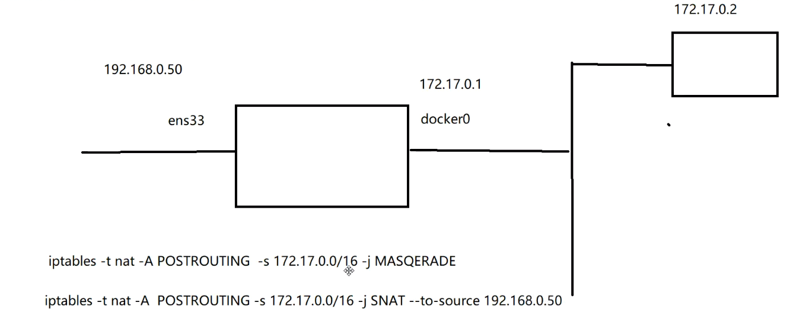

docker都是使用iptables去转换的

​    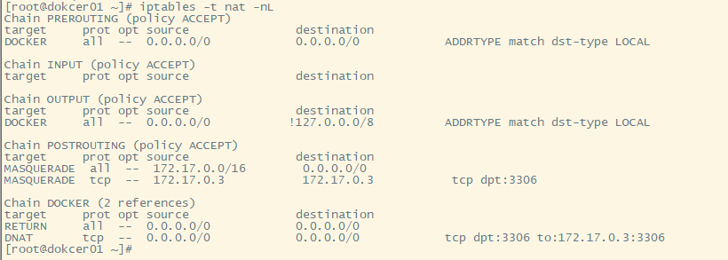

安装Docker后就会自动加载一个Docker0的网卡

容器启动一个容器都会加载一个网卡

up的容器才有veth，没有up的容器没有veth

​    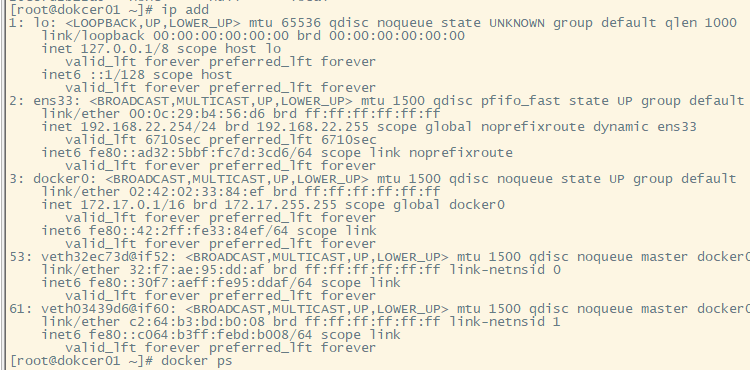

​    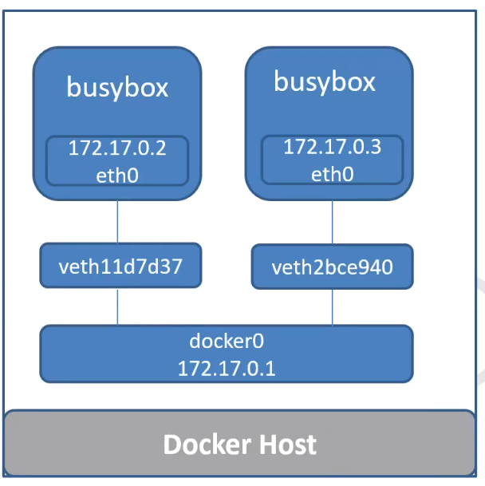

容器的大致课分为两类：

服务类容器，例如web server，database等

工具类容器，例如curl容器，redis-cli容器

通常而言，服务类容器需要长期运行，所以使用daemon后台-d的方式运行

而工具类容器通常是提供一个临时工作的环境，所以一般以 run -it的方式在前台运行

**docker的资源控制：**

Cgroup：control group 控制组做资源控制

docker run –it –m 200M –-memory-swap 300M ubuntu:16.04 

//使用ubautnu镜像创建容器，给200m内存，内存和swap的空间一共300，也就是200m内存，100m，swap空间

-m：允许分配的内存大小 

--memory-swap：允许分配的内存和swap的总大小 

--memory-swapiness：控制内存与swap置换的比例，范围0到100，0代表不适用swap

progrium/stress   ##压力测试的容器，测试容器的最高性能

​                docker run -it -m 200M --memory-swappiness 0 progrium/stress --vm 2 --vm-bytes 200M  #给容器分配200m内存，在容器中加载2个线程，一个线程占用200m内存，此时容器会停止运行 因为容器所需资源超出了给容器分配的内存 stress: info: [1] dispatching hogs: 0 cpu, 0 io, 2 vm, 0 hdd stress: dbug: [1] using backoff sleep of 6000us stress: dbug: [1] --> hogvm worker 2 [8] forked stress: dbug: [1] using backoff sleep of 3000us stress: dbug: [1] --> hogvm worker 1 [9] forked stress: dbug: [9] allocating 209715200 bytes ... stress: dbug: [9] touching bytes in strides of 4096 bytes ... stress: dbug: [8] allocating 209715200 bytes ... stress: dbug: [8] touching bytes in strides of 4096 bytes ... stress: FAIL: [1] (416) <-- worker 9 got signal 9 stress: WARN: [1] (418) now reaping child worker processes stress: dbug: [1] <-- worker 8 reaped stress: FAIL: [1] (452) failed run completed in 0s [root@dokcer01 ~]#  --vm：设置测试容器内存工作线程数  --vm-byptes：设置测试容器单个内存工作线程使用的内存大小              

​                 docker run -it -m 300M --memory-swappiness 0 progrium/stress --vm 2 --vm-bytes 100M #给容器分配300m内存，在容器中加载1个线程，一个线程占用100m内存，此时容器会在前台运行占用200m内存              

​    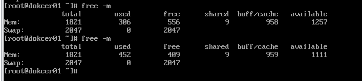

**CPU限制：**

​                docker run --name "container_A" -c 1024 ubuntu  docker run --name "container_B" -c 512 Ubuntu  选项： -c：设置容器使用cpu的权重，权重越高获得的cpu时间片越高 。-c,--cpu-shares用于设置多个容器竞争 CPU 时， 各个容器相对能分配到的 CPU 时间比例              

-c, --cpu-shares int                CPU份额(相对权重)

​      --cpus decimal                  可以使用的cpu数量

磁盘IOPS限制

​                docker run -it --device-write-bps /dev/sda:2M --name centos7 centos /bin/bash #容器在 sda的磁盘上写入速率限制到2m              

​                进入到容器后写入50m的数据，并直接oflag=direct写入到磁盘中不经过内存 [root@2852f4a6a34e /]# time dd if=/dev/zero of=/data/test1 bs=1M count=50 oflag=direct   50+0 records in 50+0 records out 52428800 bytes (52 MB, 50 MiB) copied, 25.2668 s, 2.1 MB/s real    0m25.271s      //可以看到写入的时间为25秒也就是平均2m一次 user    0m0.003s sys     0m0.019s              

bps和iops说明 • 

bps：byte per second，每秒读写的数据量 •

 iops：io per second，每秒的IO次数 

 控制容器bps和iops的参数说明 •

 --device-read-bps： 限制读某个设备的bps

 --device-write-bps：限制写某个设备的bps 

 --device-read-iops：限制读某个设备的iops

 --device-write-iops：限制写某个设备的iops

# docker -3 

**镜像管理:**

docker images      查看docker的所有镜像

REPOSITORY        TAG       IMAGE ID       CREATED        SIZE

nginx             latest    605c77e624dd   7 days ago     141MB

mysql             5.7       c20987f18b13   2 weeks ago    448MB

httpd             latest    dabbfbe0c57b   2 weeks ago    144MB

ubuntu            latest    ba6acccedd29   2 months ago   72.8MB

centos            latest    5d0da3dc9764   3 months ago   231MB

progrium/stress   latest    db646a8f4087   7 years ago    282MB

登入镜像仓库

docker login             ##登入docker hub获取私有镜像

Username: zby

Password:

删除镜像： docker rmi centos:latest 

拉取镜像： docker pull hub.dz11.com/library/mysql:5.6  

推送镜像 docker push hub.dz11.com/library/mysql:5.6 

导出镜像： docker save –o centos_6.6.tar centos:6.6 

导入镜像： docker load --input centos_6.6.tar

**镜像命名格式：**

docker registry地址 仓库名称：标签

-   例如 hub.dzll.com/op-base/openresty-php:1.11.2.4   ##私有镜像时要制定地址
-   mysql:5.6   如果不写地址那么默认从写入的镜像站里面拉取
-   ubuntu

当拉取镜像没有指定tag时，默认为latest 最新版本

复制镜像并重命名

[root@dokcer01 ~]# docker images 

REPOSITORY        TAG       IMAGE ID       CREATED        SIZE

httpd             latest    dabbfbe0c57b   2 weeks ago    144MB

[root@dokcer01 ~]# docker tag httpd  hub.yutianeedu.com/it/httpd:2.4   ##复制并重命名

[root@dokcer01 ~]# docker images 

REPOSITORY                    TAG       IMAGE ID       CREATED        SIZE

httpd                         latest    dabbfbe0c57b   2 weeks ago    144MB

hub.yutianeedu.com/it/httpd   2.4       dabbfbe0c57b   2 weeks ago    144MB

 [root@dokcer01 ~]# docker rmi hub.yutianeedu.com/it/httpd:2.4    #删除

[root@dokcer01 ~]# docker images 

REPOSITORY        TAG       IMAGE ID       CREATED        SIZE

httpd             latest    dabbfbe0c57b   2 weeks ago    144MB

**Linux文件系统简介**

linux文件系统由bootfs和rootfs组成，bootfs主要包含bootloader 和kernel，bootloader主要是引导加载kernel，当kernel被加载到内 存之后bootfs就被卸载掉了。rootfs包含的就是典型linux系统中的 /dev,/proc,/bin,/etc等标准目录

​    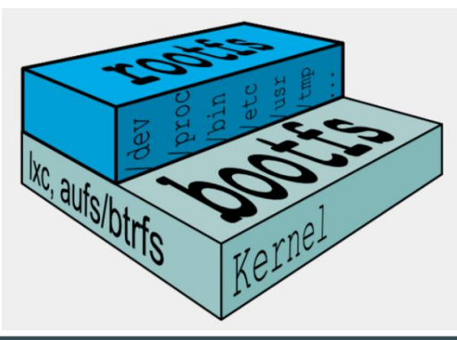

**Docker base镜像**

base镜像提供的最小安装的linux发行版

容器没有bootfs，没有kernel，只有rootfs

​    

写时复制（CoW） • 即Copy-on-Write，表示只在需要写时才去复制，针对已有文件的修改场 景。 • 多个容器使用同一个镜像时，并不会为每个容器分配一个image一样的文 件系统，

所有数据都从image读取，只有当要对文件进行写操作时，才从 Image里把要写的文件复制到自己的文件系统（目录upperdir）进行修改。类似与链接克隆虚拟机中的母盘+差分盘

所以如果使用该镜像创建了容器，那么镜像不能删除，和链接克隆虚拟机不能删除模板一样

**查看差分卷内容测试：**

 docker run -d nginx   #创建容器

 docker exec -it 1f3f5932aff7 /bin/bash   ##进入容器

root@1f3f5932aff7:/# mkdir data            ##在容器中创建目录

root@1f3f5932aff7:/# cp /etc/passwd /data/   ##复制文件到目录

 docker inspect 1f3f5932aff7   #查看容器详细信息

​    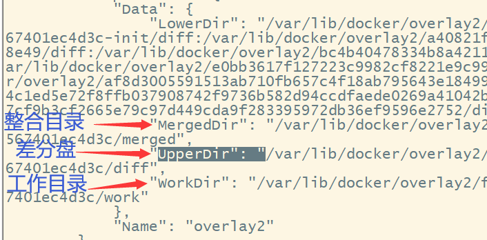

   

[root@dokcer01 ~]# cd  /var/lib/docker/overlay2/f18af5c9c05c901a4f117aac8b3baaa881e3106bf02cd2d6e0c6567401ec4d3c/diff          ##切换到差分盘目录

[root@dokcer01 diff]# ls data/        ##可以看到差分盘的数据

passwd

**用时分配（AoD）** ，即Allocate-on-Demand

启动一个容器，并不会为这个容器预分配存储空间，而是当有新文件写 入时，才按需分配空间

**镜像分层结构**

​    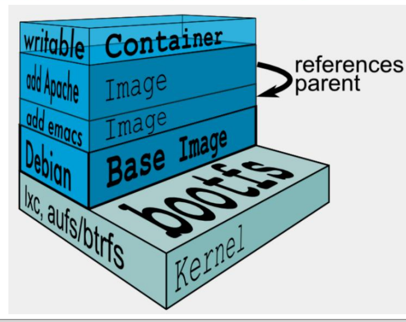

Kernel ：DOcker没有内核，Kernel使用宿主机的

Base Image基层 ：基层镜像例如Debian，centos（阉割版）

Image ：镜像层，安装的软件例如emacs命令行管理器，apache网页服务器

writable：写入层，针对镜像的修改，都存放在这层

镜像层一但创建就不能修改，

对镜像的修改都会创建新的层，不管删除还是创建，所以说时写时复制COW

**制作镜像:**

**两种方式：**

-   docker commit 
-   Docker  file

**docker commit实例：**

运行容器 • docker run –ti ubuntu:16.04  

修改容器 • apt update && apt install vim

docker commit -a "runoob.com" -m "my ubuntu" a404c6c174a2  mymysql:v1 

​                    作者            描述       容器的id       新镜像的名字

**-a :**提交的镜像作者；

**-m :**提交时的说明文字；

**-p :**在commit时，将容器暂停。

**缺陷** 

• 手动创建，容易出错，效率低及可重复性弱 

• 使用者并不知道镜像是如何创建出来的，里面是否有恶意程序，可 能存在安全隐患

**docker file 实例：**

​                mkdir /images cd  /images wget -O /images/aliyun-centos7.repo http://mirrors.aliyun.com/repo/Centos-7.repo              

​                [root@dokcer01 images]# cat Dockerfile  FROM centos:7 ADD aliyun-centos7.repo  /etc/yum.repos.d/aliyun-centos7.repo RUN rm -rf /etc/yum.repos.d/Cent*.repo && yum -y update &&yum -y install openssh-server net-tools vim-enhanced && /usr/bin/ssh-keygen -A && yum clean all RUN useradd zhangboyu && echo 123456 | passwd --stdin zhangboyu CMD ["/usr/sbin/sshd","-D"]              

ps：

FRM:基础镜像选择centos7

ADD：添加阿里云的yum源到容中

RUN执行的命令，先删除原有的所有yum源，然后更新yum源，然后安装ssh，安装vim，然后生成ssh密钥，最后删除yum的临时文件

第二个RUN是创建用户然后配置一个密码

cmd命令是开启容器时运行ssh命令，否则容器不会一直运行

**为什么run后面带这么多命令因为，****每运行一个RUN，就会让镜像多一层，镜像的容量就会增加**

​                docker build -t openssh:v1.0 .              

构建镜像  

.是当前目录的意思

-t 是构建镜像的名字

-f  dockerfile的所在的目录和名称      + docker file 使用add和copy的相对路径

docker build -t openssh:v2.0  -f /images/Dockerfile1  /images/

默认不写 -f 那么默认是在 /images/Dockerfile   

 -f, --file string             Name of the Dockerfile (Default is 'PATH/Dockerfile')

​                [root@dokcer01 images]# docker image ls REPOSITORY        TAG       IMAGE ID       CREATED        SIZE openssh           v1.0      2d5cfed8fc10   6 hours ago    547MB              

**docker file 结构：**

-   基础镜像信息         例如centos

-   -   FROM ubuntu:14.06
    -   FROM centos
    -   FROM nginx:latest

 

-   维护者信息  

-   -   **实例：MAINTAINER** Shenglin Zou       

-   镜像操作指令          例如安装httpd

-   -   **ENV**   

    -   -   指定一个环境变量，会被后续RUN指令使用，并在容器运行时保持 
        -   示例： ENV TZ "Asia/Shanghai"

    -   **ADD**    

    -   -   复制指定源内容的到容器中的目的
        -   源可以是dockerfile所在目录的一个相对路径，也可以是一个url，或者tar文件，他会自动压缩
        -   示例：ADD aliyun-mirror.repo /etc/yum.repos.d/CentOS-Base.repo 

    -   **COPY**  

    -   -   与ADD类似,区别在于当目录不存在时会自动创建
        -   示例： COPY aliyun-mirror.repo /etc/yum.repos.d/CentOS-Base.repo

    -   **WORKDIR   /data**

    -   -   容器启动时默认所在的目录
        -   实例：WORKDIR  /data

    -   **USER   zhangboyu**

    -   -   容器启动时默认使用的用户
        -   实例：USER zhangboyu

    -   **RUN** 

    -   -   RUN 或者 RUN ["命令","参数1","参数2"]
        -   每条RUN指令将在当前镜像基础上执行指定命令，并提交为新的镜像
        -   当命令较长时，可使用/换行
        -   示例： RUN ["/bin/bash","-c","echo hello"] 
        -   RUN apt install -y openssh-server

    -   **VOLUME**

    -   -   创建一个挂载点，类似于容器启动时使用的-v选项，只不过这里不能指定挂 载到宿主机的位置
        -   默认为/var/lib/docker/${文件系统名称}目录下，一般用来存放数据库和需要保持的数据
        -   示例： VOLUME /data

    -   **EXPOSE**

    -   -   告诉docker容器需要暴露的端口
        -   在启动容器时需要通过-P，docker主机会自动分配一个端口转发到指定的端 口
        -   使用-p，则可以具体指定哪个本地端口映射过来
        -   示例： EXPOSE 22 80             ##如果填写两个那么就会暴露两个

    -   **HEALTHCHECK**

    -   -   HEALTHCHECK [args] CMD <指令>
        -   用于检测容器指定的进程是否存活
        -   避免进程僵死导致容器未异常退出引起的故障
        -   示例： FROM nginx RUN apt-get update && apt-get install -y curl && rm -rf /var/lib /apt/lists/* 
        -   HEALTHCHECK --interval=5s --retries=3 --timeout=3s \ CMD curl -fs http://localhost/ || exit 1

-   容器启动时执行指令    例如运行httpd

-   -   CMD

    -   -   指定启动容器时执行的命令
        -   每个Dockerfile只能有一条CMD命令，如果指定了多条，只有最后一条会被 执行
        -   如果用户启动容器时指定了运行的命令，则会覆盖掉CMD指定的命令
        -   实例：CMD ["supervisord","-c","/etc/supervisord.conf"]

    -   ENTRYPOINT

    -   -   配置容器启动后执行的命令
        -   不会被docker run 提供的参数覆盖
        -   每个Dockerfile只能有一个ENTRYPOINT，如果指定了多个，只有最后一个被 执行
        -   示例： ENTRYPOINT ["/build.sh"]

    -   ONBUILD

    -   -   配置当所创建的镜像作为其它新创建镜像的基础镜像时，所执行的操作指令
        -   示例： 创建镜像A：
        -    ONBUILD ADD . /app/src ONBUILD RUN /usr/local/bin/pypthon-build --dir /app/src 
        -   如果基于镜像A创建新的镜像时，新的Dockerfile使用FROM A指定基础镜像 时，会自动执行ONBUILD指令内容，等价于在后面添加了两条指令： FROM A ADD . /app/src RUN /usr/local/bin/python-build --dir /app/src
        -   使用ONBUILD指令的镜像，推荐在标签中注明，如：ruby:1.9-onbuild

ENTRYPOINT和CMD都是启动容器时执行指令

但CMD指令会被用户运行容器时所制定的命令覆盖，而ENTRYPOINT不会被覆盖

所以希望用户指定的指令不把容器自身的指令覆盖时可以使用ENTRYPOINT

**总之：**

尽可能让变更少的镜像层优先构建

二次构建时，上次构建的时候会生成缓存，新增加的内容要写在docker file最下面，这样就可以利用        缓存提升构建效率

尽可能少的使用指令关键字

每使用一次指令关键字，就会创建一个新的只读层

尽可能清理不必要的文件 

使构建后的镜像尽可能的小

**EXPOSE实例：**

​                [root@dokcer01 images]# cat Dockerfile FROM centos:7 EXPOSE  22 80             暴露22和80端口              

构建镜像

​                docker build -t openssh:v5.0  .              

创建容器，使用 -P   #大P 随机端口号

​                [root@dokcer01 images]# docker run -dit -P openssh:v5.0 /bin/bash              

即可看到随机端口号了，默认创建了两个映射

​                [root@dokcer01 images]# docker ps 4d762b450392   openssh:v5.0   "/bin/bash"           2 seconds ago    Up 2 seconds    0.0.0.0:49158->22/tcp, :::49158->22/tcp, 0.0.0.0:49157->80/tcp, :::49157->80/tcp   hopeful_sinoussi              

WORK和ENV实例：

​                \# vim /images/Dockerfile  FROM centos:7  ADD aliyun-centos7.repo /etc/yum.repos.d/aliyun-centos7.repo  RUN rm -rf /etc/yum.repos.d/Cent*.repo && yum -y update && yum -y install openssh-server net-tools vim-enhanced && /usr/bin/ssh-keygen -A  RUN useradd zoushenglin && echo redhat |passwd --stdin zoushenglin  ENV TZ "Asia/Shanghai"  USER zoushenglin  WORKDIR /a （指定该参数后，后续其他位置没有指定绝对路径，以/a 作为起点）  WORKDIR b  WORKDIR c  CMD [ "/usr/sbin/sshd", "-D"]              

**构建镜像，创建容器**

​                \# docker build -t openssh:2.0 .  # docker run -it openssh:2.0 /bin/bash              

**进入容器，可以查看到所在目录 在a下的b下dec下。env查看环境变量**

​    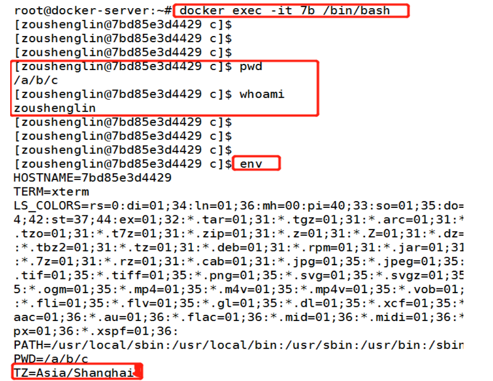

**VOLUME实例：**

​                [root@dokcer01 images]# cat Dockerfile FROM centos:7 VOLUME /data                        #创建挂载点              

构建镜像

​                docker build -t openssh:v5.0  .              

创建容器，并复制数据到挂载点

​    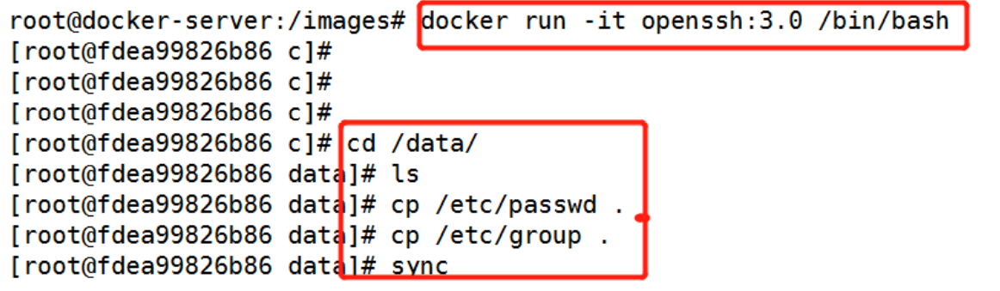

​    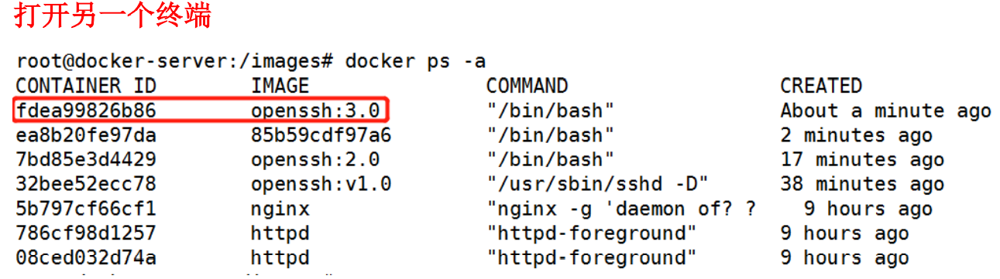

找到挂载点的宿主机目录

​    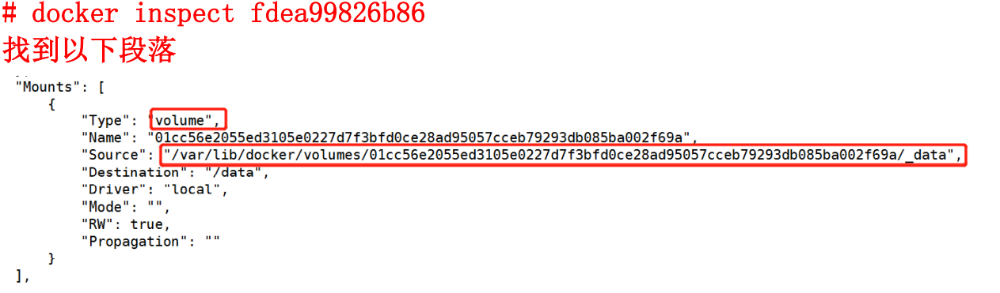

进入挂载点的宿主机目录就可以查看容器写入到挂载点的数据了

​    

​    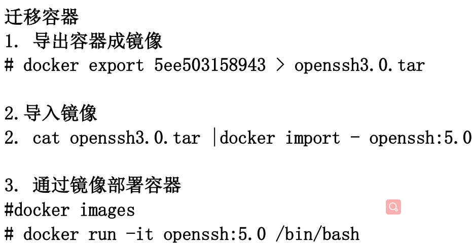

导入的镜像运行时需要给命令才能运行/bin/bash，否则会提示没有命令

因为命令在docker file 里面才有

**导入：**

docker save > nginx.tar nginx:latest

其中-o和>表示输出到文件，nginx.tar为目标文件，nginx:latest是源镜像名（name:tag）

**方法 3：把之前下载好的镜像通过 docker load -i 解压出来：**

**把 centos.tar.gz、nginx.tar.gz 镜像包上传到 xuegod63 机器的 root 目录，通过 docker load -**

**i 解压镜像**

**[root@xuegod63 ~]# docker load -i /root/nginx.tar.gz**

**[root@xuegod63 ~]# docker load -i /root/centos.tar.gz**

# docker-4 

**容器的存储：**

-   数据卷是目录或文件，而非没有格式化的磁盘（块设备） 
-   数据卷可以在容器之间共享和重用 
-   对数据卷的修改会立马生效 
-   对数据卷的更新，不会影响镜像 
-   数据卷默认会一直存在，即使容器被删除
-   即便容器背删除，数据卷中的数据也不会删除

数据卷是被设计用来持久化数据的，它的生命周期独立于容器，所以 容器被删除后，数据卷默认不会被删除

创建数据卷

在用docker run 命令的时候，使用-v标记来创建一个数据卷并挂载到容 器里

默认为/var/lib/docker/${文件系统名称}目录下，一般用来存放数据库和需要保持的数据

docker run -d --name web -v /usr/local/apache2/htdocs/ httpd:2.4

docker inspect 5ccec7c1c6c4 

​    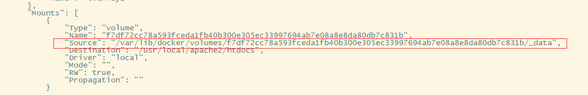

source：宿主机目录，

Destiation：容器目录

如果想指定目录

docker run -d --name web -v /opt/webapp:/usr/local/apache2/htdocs/ httpd:2.4

把本地的opt/webapp挂载到容器的xxxx目录

docker run -d --name web -v /opt/webapp/:/usr/local/apache2/htdocs/:ro httpd:2.4

：ro 只读权限，容器不能进行修改

目录共享：

​                docker run -d --name web -v /usr/local/apache2/htdocs/ httpd  ##创建容器，挂载卷 docker run -d --volumes-from web --name web2 openssh:v1.0        ##将名字为web容器的数据卷共享给web容器              

​    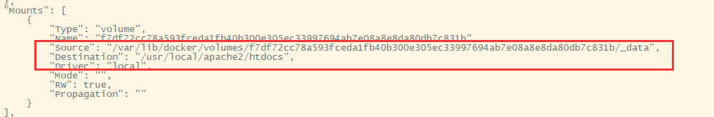

**私有仓库：**

​    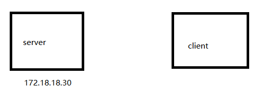

server 端

**1.下载 registry 镜像**

\# docker pull registry

**2.部署 registry 容器**

\# docker run -d -p 5000:5000 -v /opt/data/registry:/var/lib/registry registry

**3.进入 registry 容器，配置删除权限**

docker exec -it 9533 /bin/sh

​    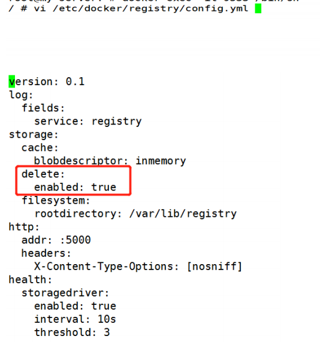

**client**

**4.在client上下载 busybox 镜像用于测试**

\# docker pull busybox 

\# docker tag busybox 172.18.18.30:5000/busybox  ##改名字要符合格式

\# docker push 172.18.18.30:5000/busybox

​    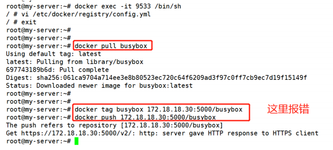

报错原因，docker仓库要使用https所以需要证书，而且必须是知名机构签名的证书，自己签名的证书不行

**解决方法修改为非加密：**

在clident上配置

 vi /usr/lib/systemd/system/docker.service 

​    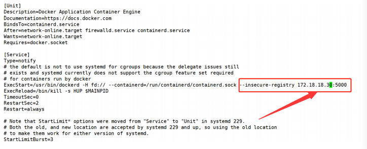

增加红色框中内容即可

​    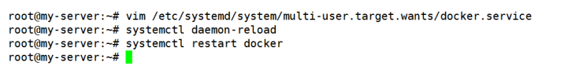

**5. 再次推送镜像**

\# docker push 172.18.18.30:5000/busybox

**6.查看镜像**

\# curl -XGET http://172.18.18.30:5000/v2/_catalog 

\# curl -XGET http://172.18.18.30:5000/v2/image_name/tags/list

**7.测试下载镜像并运行容器**

\# docker pull 172.18.18.30:5000/busybox # docker images 

\# docker run -it 172.18.18.30:5000/busybox /bin/sh

**Docker 网络管理：**

Docker有四种网络模式，

可通过docker network ls查看：

​                [root@dokcer01 ~]# docker network ls NETWORK ID     NAME      DRIVER    SCOPE 77ce79883fc7   bridge    bridge    local f7bb4b58e597   host      host      local 5609913e8db0   my_net1   bridge    local 20e8fd2b12a5   none      null      local              

** bridge**         ；桥接网络利用nat地址转换到宿主机IP地址

使用iptables的snat转发实现对外访问（需要开启内核 net.ipv4.ip_forward=1）

使用iptables的dnat端口映射实现外部访问容器

​                docker run -d --dns 8.8.8.8 -p 8080:80 -p 2022:22 --name webserver1 httpd:2.4 docker run -d --dns 8.8.8.8 -P --name webserver1 httpd:2.4              

​    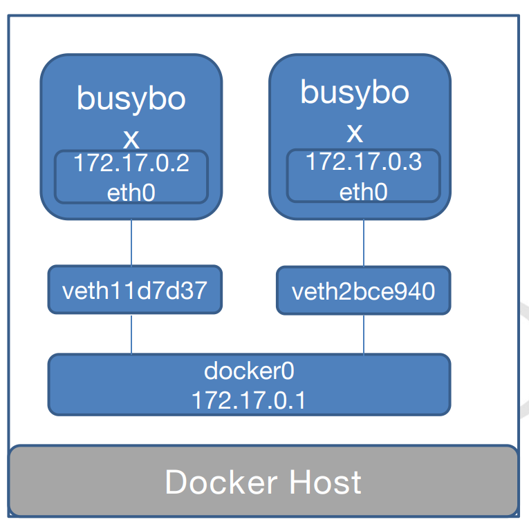

** host**             ；与宿主机共享网络地址，需要解决端口冲突问题

​                docker run -d --net host --name webserver1 httpd:2.4              

** none**            ；没有网络地址，完全隔离，用于不需要访问外部，外部也不访问

​                docker run -d --net none --name webserver1 httpd:2.4              

** 用户自定义网络**

创建my_net网络：

​                docker network create --driver bridge my_net              

查看my_net网络详细信息

​                docker network inspect my_net              

通过指定子网和网关的方式创建my_net2网络：

​                docker network create --driver bridge --subnet 172.22.16.0/24 --gateway 172.22.16.1 my_net2              

创建一个容器使用my_net2网络：

​                docker run --it --network=my_net2 busybox              

创建一个容器使用my_net2网络同时指定其ip地址：

​                docker run --it --network=my_net2 --ip=172.22.16.8 busybox              

​    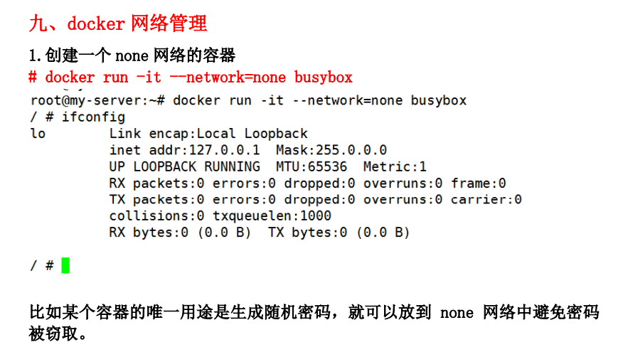

​    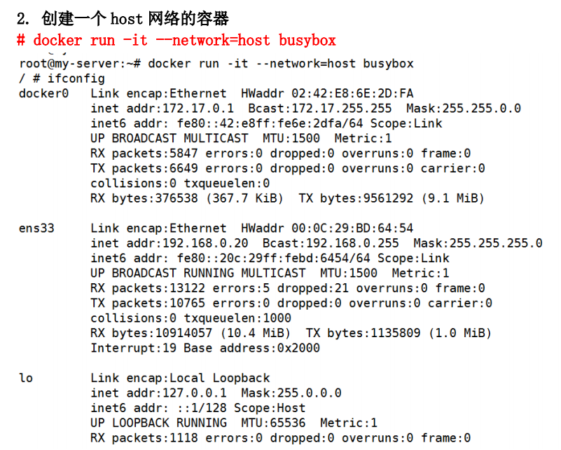

​    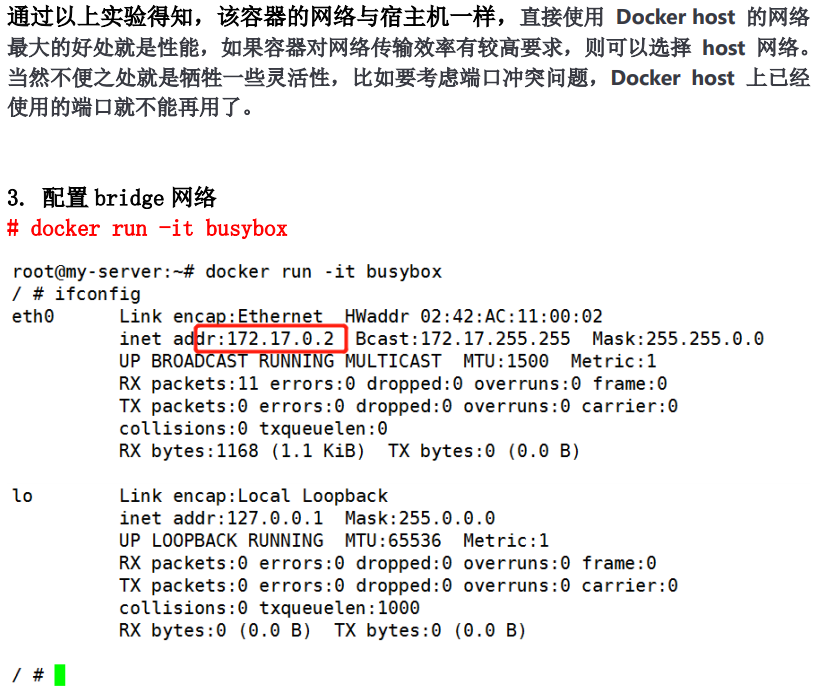

​    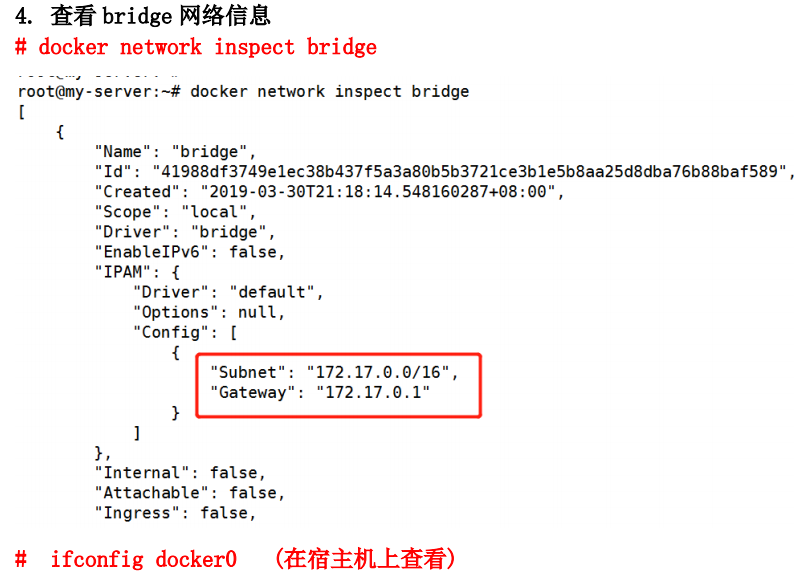

​    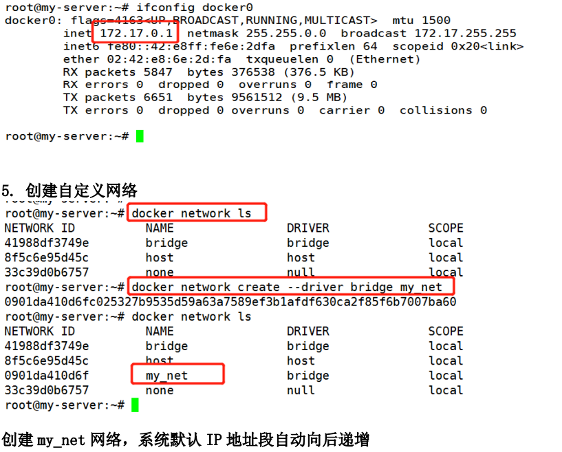

​    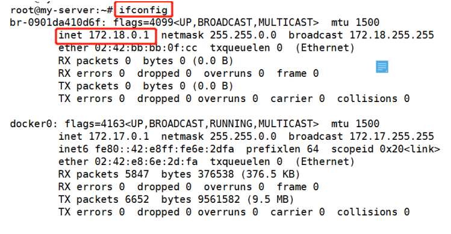

​    

​    

​    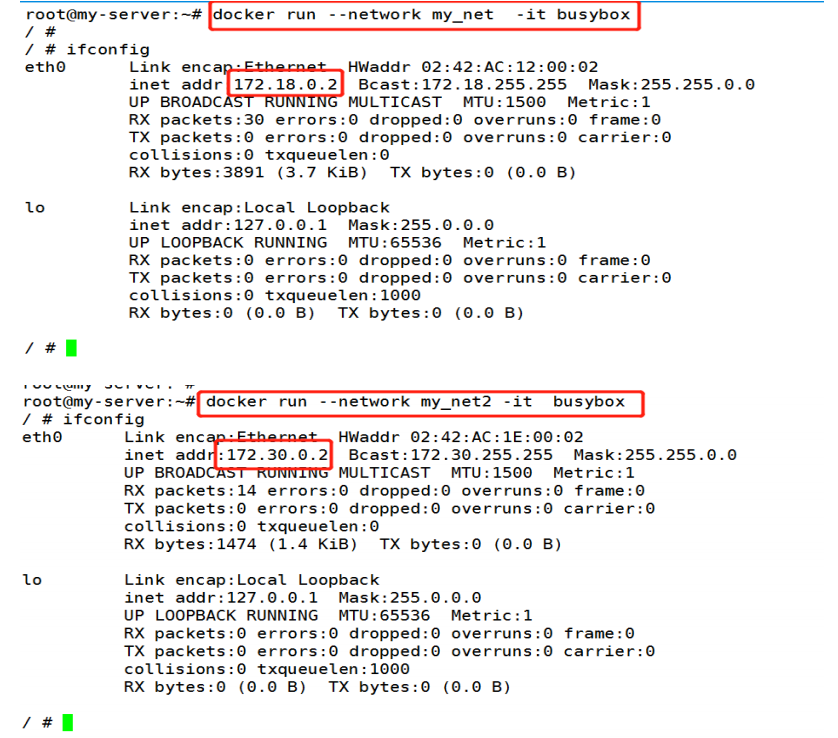

​    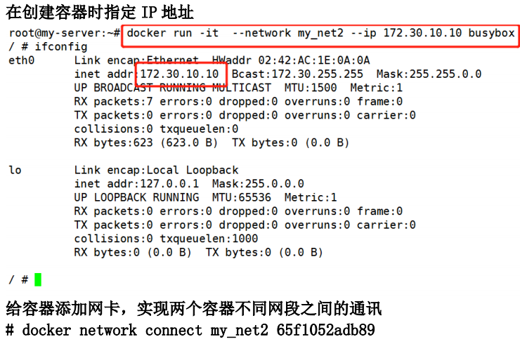

​    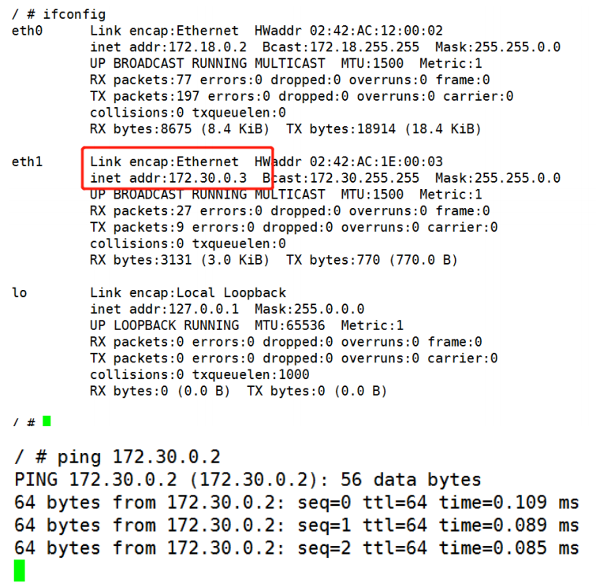

