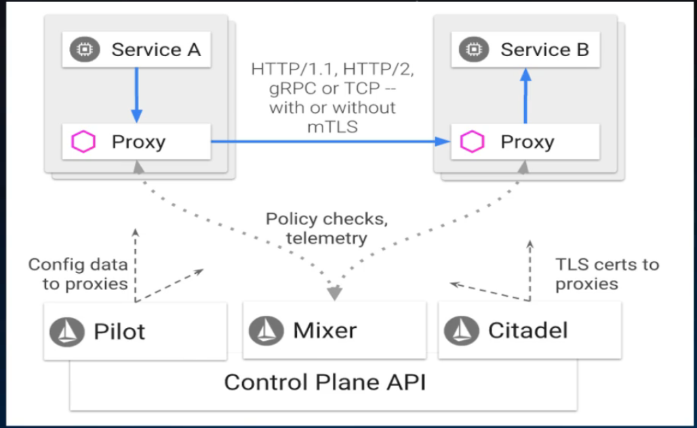
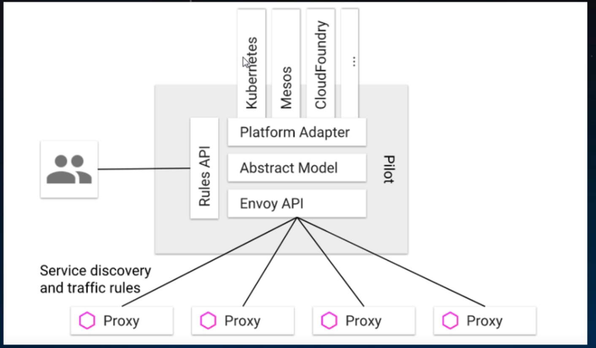
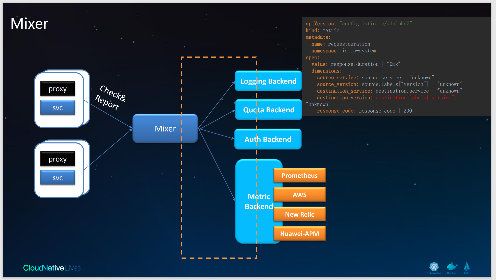
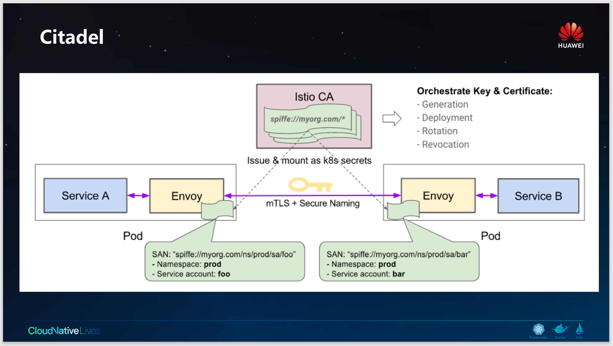
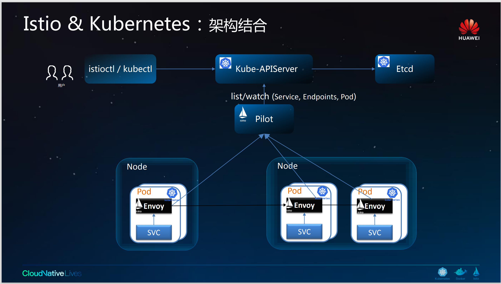

[toc]

# 1. 为什么使用Istio

Istio是一个实现服务网格的产品，Istio不是服务网格，Istio和服务网格的关系就像docker和容器的关系一样

通过负载平衡、service-to-service身 份验证、监视等方法，Istio可 以轻松地创建部署的服务网络，而服务代码中的代码更

改很少或没有更改。您可以通过在整个环境中部署-个特殊的sidecar代理来为服务添加Istio支持，该代理可以拦截微服务

之间的所有网络通信，然后使用其控制平面功能来配置和管理Istio,其中包括:

*   HTTP、gRPC、WebSocket和TCP流量的自动负载平衡。
*   使用丰富的路由规则、重试、故障转移和故障注入对流量行为进行细粒度控制。
*   支持访问控制、速率限制和配额的可插拔策略层和配置API。
*   集群内所有流量的自动度量、日志和跟踪，包括集群入口和出口。
*   在具有强大的基于身份的身份验证和授权的集群中实现安全的服务到服务通信。

# 2. Istio的核心功能

## 2.1 流量管理

Istio的简单规则配置和流量路由允许您控制服务之间的流量和API调用流。Istio简化了服务级属性(如断路器、超时和重试)

的配置，并且简化了设置重要任务(如a/B测试、金丝雀测试和按百分比划分的分阶段测试)的工作。

有了更好的流量可视性和开箱即用故障恢复功能，您可以在问题产生之前捕获问题，使调用更可靠，网络更健壮。

## 2.2 Istio架构

## 2.3 Pilot架构

## 2.4 Mixer架构

## 2.5 Citadel架构

## 2.6 Istio和Kubernetes架构结合

