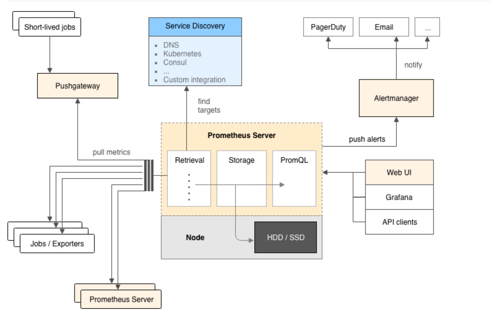
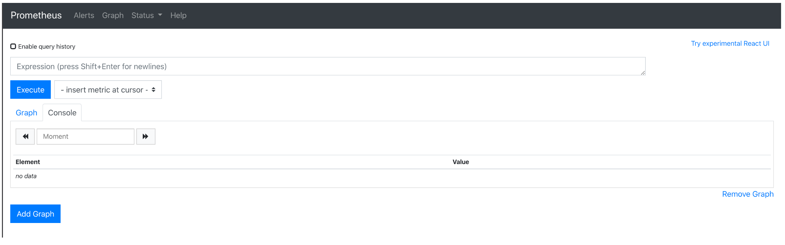
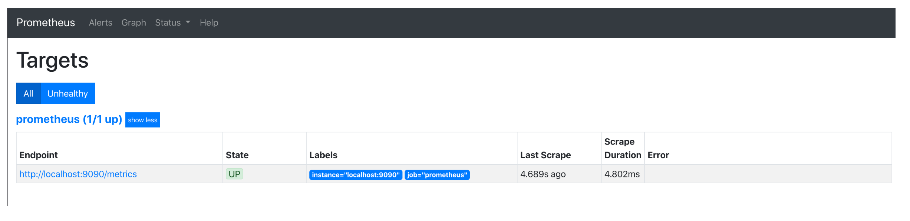
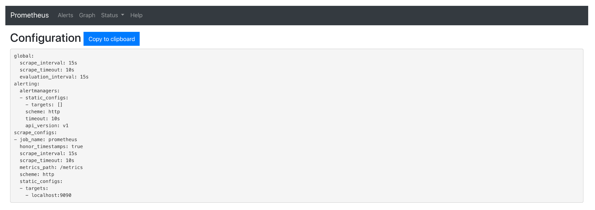
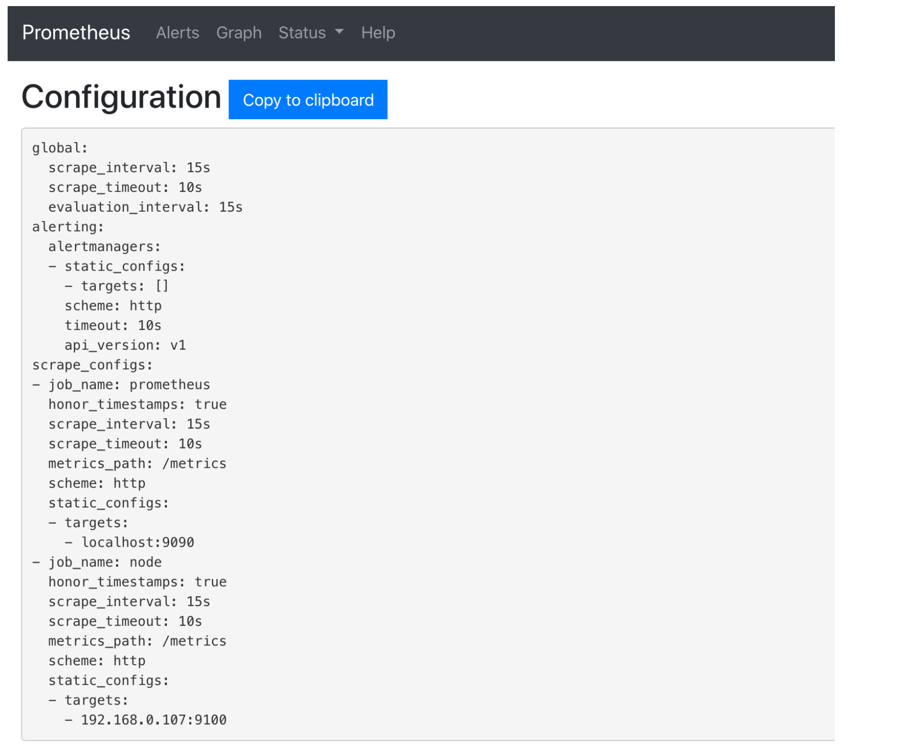
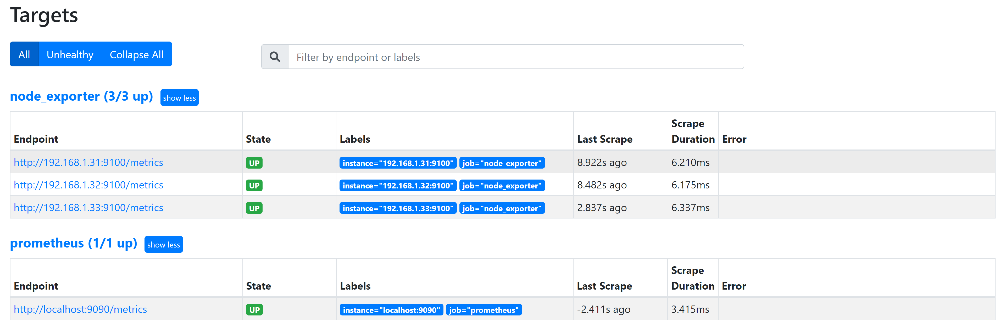
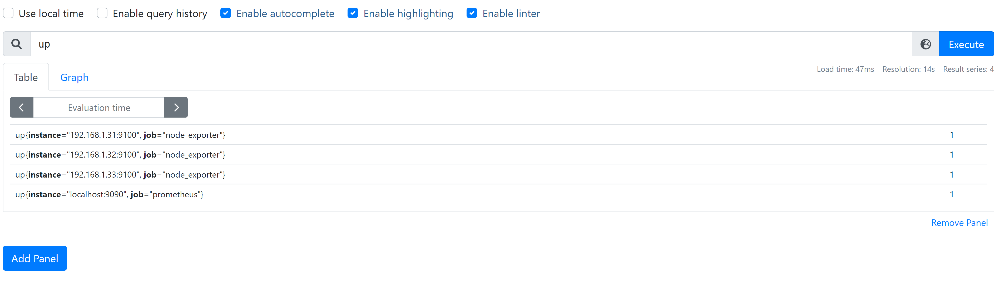
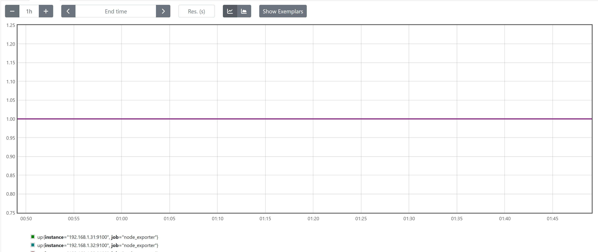

[toc]

# 简介

prometheus诞生于2012年，由SoundCloud公司开发，由灵感来源于Google的监控系统Borgmon。作为CNCF基金会的第二个成员，如今已经毕业。

prometheus号称下一代监控系统，其可以很好的兼容如openstack、kubernetes等云平台。

依托于社区开源组件，围绕着prometheus，可以构建一个完备的企业监控体系。

prometheus代码仓库：https://github.com/prometheus/prometheus

prometheus官方文档： https://prometheus.io/docs/introduction/overview/


# 社区高可用解决方案：

*   Prometheus联邦
*   灭霸 —— thanos （生产使用广泛，但是复杂度极高）
*   victoriaMetrics 


# 基础介绍：

显示出来的数据是底层数据，而不是zabbix的直观明了数据

Prometheus 是一个时序数据库

查询语法是promql，是一种类sql语法


## 监控系统的意义：


## 监控系统的目标：

*   保障业务的正常运行


### 如何判断业务是否正常运行：

*   能否打开业务（只能作为一个标准）


### 衡量业务是否正常运行的指标：

*   能否打开 
*   打开速度（并不是越快越好，而是取一个合适值）


#### 从两个方面衡量业务运行

*   基础设施

    *   USE方法
        *   U：utilization 使用率
        *   S：Saturation 饱和度
        *   E： Error 错误
            *   CPU 
                *   使用率 
                *   饱和度 负载 
            *   磁盘
                *   使用率 磁盘空间使用率 
                *   饱和度 IO
            *   网卡
                *   使用率 
                *   饱和度 负载 
                *   错误数 数据交换错误数 
            *   内存
                *   使用率 
                *   饱和度 

*   业务系统 

    *   四大黄金指标
        *   延迟 请求速度 
        *   流量 qps 上行 下行  
        *   错误 请求失败率
        *   饱和度 


# 优点

prometheus提供一个基于开源的完整监控方案，其对传统监控系统的测试和告警模型进行了彻底的颠覆，形成了基于中央化的规则计算、统一分析和告警的新模型。 相对传统的监控系统有如下几个优点：

* 易于部署： 基于golang开发，可使用二进制文件直接部署，不存在任何第三方依赖。
* 自动发现：预置openstack、kubernetes、consul等一系列的可用于自动发现监控目标的服务，可基于其自动发现特性方便完成对监控目标的管理 。
* 强大的查询语言promQL: prometheus内置一个强大的数据查询语言PromQL,通过PromQL可以实现对监控数据的查询、聚合。同时PromQL也被应用于数据可视化（如grafana）以及告警中的。
* 高效： 对于监控系统而言，大量的监控任务必然导致有大量的数据产生。 而Prometheus可以高效地处理这些数据。
可扩展： prometheus配置比较简单， 可以在每个数据中心运行独立的prometheus server, 也可以使用联邦集群，让多个prometheus实例产生一个逻辑集群，还可以在单个prometheus server处理的任务量过大的时候，通过使用功能分区和联邦集群对其扩展。
* 易于集成： 目前官方提供多种语言的客户端sdk,基于这些sdk可以快速让应用程序纳入到监控系统中，同时还可以支持与其他的监控系统集成。
* 可视化： prometheus server自带一个ui, 通过这个ui可以方便对数据进行查询和图形化展示，可以对接grafana可视化工具展示精美监控指标。


# prometheus基础架构


## 架构图




## 核心组件说明

* prometheus server：prometheus服务端，负责实现对监控数据的获取、存储以及查询展示
* exporters：prometheus采集的目标端，目标端需要安装不同的exporters以实现不同的监控数据采集。如`node_exporter`负责采集目标端的基础资源信息，`process_exporter`负责采集目标端的进程相关信息等
* alertmanager: prometheus的告警系统。我们可通过promql在prometheus server上生成告警规则，一旦告警规则被触发，就会生成一条告警信息发往alertmanager，alertmanager负责聚合这些告警信息，并通过slack、微信、钉钉等即时通讯工具向管理员发送告警。
* pushgateway：默认情况下，prometheus的数据采集是通过pull模式完成的。这种模式的一是个弊端是要求prometheus server必须要能够连接上所有的目标端。在prometheus无法直接连接目标端的场景中，这种模式就无法使用了。为了应对这种场景，引入了pushgateway。可以将目标端的数据通过push的方式推送至pushgateway，然后prometheus通过pull模式从pushgateway拉取监控数据。


# 部署

## 1. 安装prometheus

### 1.1 下载安装包

```shell
wget https://github.com/prometheus/prometheus/releases/download/v2.17.1/prometheus-2.17.1.linux-amd64.tar.gz
tar xf prometheus-2.17.1.linux-amd64.tar.gz
mv prometheus-2.17.1.linux-amd64 /usr/local/prometheus
useradd -s /sbin/nologin /usr/local/prometheus
chown prometheus.prometheus -R /usr/local/prometheus
```

### 1.2. 查看prometheus配置文件

```shell
# cat /usr/local/prometheus/prometheus.yml 
# my global config
global:
  scrape_interval:     15s # Set the scrape interval to every 15 seconds. Default is every 1 minute.
  evaluation_interval: 15s # Evaluate rules every 15 seconds. The default is every 1 minute.
  # scrape_timeout is set to the global default (10s).
# Alertmanager configuration
alerting:
  alertmanagers:
  - static_configs:
    - targets:
      # - alertmanager:9093
# Load rules once and periodically evaluate them according to the global 'evaluation_interval'.
rule_files:
  # - "first_rules.yml"
  # - "second_rules.yml"
# A scrape configuration containing exactly one endpoint to scrape:
# Here it's Prometheus itself.
scrape_configs:
  # The job name is added as a label `job=<job_name>` to any timeseries scraped from this config.
  - job_name: 'prometheus'

    # metrics_path defaults to '/metrics'
    # scheme defaults to 'http'.
    static_configs:
    - targets: ['localhost:9090']
```

### 1.2. 配置systemd启动文件

```shell
# cat /lib/systemd/system/prometheus.service 
[Unit]
Description=prometheus
After=network.target 
[Service]
User=prometheus
Group=prometheus
WorkingDirectory=/usr/local/prometheus
ExecStart=/usr/local/prometheus/prometheus --config.file=/usr/local/prometheus/prometheus.yml --web.enable-lifecycle --web.enable-admin-api --storage.tsdb.path="/data/prometheus"
[Install]
WantedBy=multi-user.target
```

* --config.file：指定prometheus的配置文件 
* --web.enable-lifecycle：开启prometheus的重载接口

### 1.3. 启动prometheus

```shell
systemctl start prometheus
systemctl enable prometheus
```

### 1.4. prometheus web ui基本介绍

prometheus默认会监听在http的9090端口上，我们可以通过web浏览器访问如下：



这是默认的graph界面。


#### 1.4.1 管理target

通过点击Status-->Targets，可以查看到其监控的目标端，目前只有一个，即prometheus自身： 



#### 1.4.2. 查看配置文件

通过点击Status-->Configuration，可以查看其当前的配置文件： 



## 2. 安装node_exporter

在前面我们说过，prometheus依赖众多的exporters来完成对目标端的数据采集。而node_exporter主要用于采集系统的基础指标，包括cpu、mem、network、disk等。

我们接下来配置一个采集目标，直接使用prometheus服务端监控身系统状态。

node_exporter仓库地址： https://github.com/prometheus/node_exporter

### 2.1. 下载安装包

当前node_exporter的最新版本是1.0.0，我这里使用0.18.1

```shell
wget https://github.com/prometheus/node_exporter/releases/download/v0.17.0/node_exporter-0.18.1.linux-amd64.tar.gz
tar xf node_exporter-0.18.1.linux-amd64.tar.gz
mv node_exporter-0.18.1.linux-amd64 /usr/local/node_exporter
```

### 2.2. 配置systemd启动文件

```shell
[Unit]
Description=node_exporter
After=network.target 

[Service]
User=prometheus
Group=prometheus
ExecStart=/usr/local/node_exporter/node_exporter
[Install]
WantedBy=multi-user.target
```

### 2.3. 启动node_exporter

```shell
systemctl start node_exporter
systemctl enable node_exporter
```

> node_exporter默认会监听在9100端口


## 3. 配置prometheus采集node_exporter数据


### 3.1 修改prometheus配置文件如下：

```shell
global:
  scrape_interval:     15s # Set the scrape interval to every 15 seconds. Default is every 1 minute.
  evaluation_interval: 15s # Evaluate rules every 15 seconds. The default is every 1 minute.
alerting:
  alertmanagers:
  - static_configs:
    - targets:
rule_files:
scrape_configs:
  - job_name: 'prometheus'
    static_configs:
    - targets: ['localhost:9090']
    
  # 新添加如下配置 添加node export的监控指标 
  - job_name: "node"
    static_configs:
    - targets: ["192.168.0.107:9100"] # 通过添加targets来添加主机 
```

### 3.2 重载prometheus

修改prometheus配置文件后，需要重载prometheus，prometheus提供一个重载接口如下：

```
curl -XPOST http://192.168.0.107:9090/-/reload
```

此时我们可以通过prometheus web ui已完成对配置文件的重载：




再次查看targets，如下：




## 3.3 监控查询

下面我们通过一个简单的查询语法来展示prometheus的监控使用。

点击Graph，进入查询页面，输入`up`执行查询操作：



可以看到有两个采集目标，状态为1，即代码监控目标正常。还可查看监控图表：




至此，完成对采集目标的管理。

# 附录


基于容器的方式安装node_exporter:

```yaml
apiVersion: extensions/v1beta1
kind: DaemonSet
metadata:
  labels:
    app: node-exporter
  name: node-exporter
spec:
  revisionHistoryLimit: 10
  selector:
    matchLabels:
      app: node-exporter
  template:
    metadata:
      labels:
        app: node-exporter
    spec:
      containers:
      - args:
        - --path.procfs=/host/proc
        - --path.sysfs=/host/sys
        - --web.listen-address=0.0.0.0:9100
        - --collector.filesystem.ignored-mount-points=^/(dev|proc|sys|var/lib/docker/.+)($|/)
        - --collector.filesystem.ignored-fs-types=^(autofs|binfmt_misc|cgroup|configfs|debugfs|devpts|devtmpfs|fusectl|hugetlbfs|mqueue|overlay|proc|procfs|pstore|rpc_pipefs|securityfs|sysfs|tracefs)$
        image: hub.dz11.com/library/node-exporter:v0.17.0
        imagePullPolicy: IfNotPresent
        livenessProbe:
          failureThreshold: 3
          httpGet:
            path: /
            port: 9100
            scheme: HTTP
          periodSeconds: 10
          successThreshold: 1
          timeoutSeconds: 1
        name: node-exporter
        ports:
        - containerPort: 9100
          hostPort: 9100
          name: metrics
          protocol: TCP
        readinessProbe:
          failureThreshold: 3
          httpGet:
            path: /
            port: 9100
            scheme: HTTP
          periodSeconds: 10
          successThreshold: 1
          timeoutSeconds: 1
        resources: {}
        volumeMounts:
        - mountPath: /host/proc
          name: proc
          readOnly: true
        - mountPath: /host/sys
          name: sys
          readOnly: true
      dnsPolicy: ClusterFirst
      hostNetwork: true
      hostPID: true
      restartPolicy: Always
      schedulerName: default-scheduler
      securityContext:
        runAsNonRoot: true
        runAsUser: 65534
      terminationGracePeriodSeconds: 30
      tolerations:
      - effect: NoSchedule
        operator: Exists
      volumes:
      - hostPath:
          path: /proc
          type: ""
        name: proc
      - hostPath:
          path: /sys
          type: ""
        name: sys
  templateGeneration: 1
  updateStrategy:
    rollingUpdate:
      maxUnavailable: 1
    type: RollingUpdate
```