[toc]

# Grafana简介

我们在《prometheus的简介与安装》当中，给大家简单的展示了prometheus的web ui。

这个ui实在是过于简陋，用于日常的promQL查询还成，用于做完整的监控页展示，就有些力不从心。

而Grafana是一款专业的支持跨平台的开源的度量分析和可视化工具，可以将prometheus采集的数据通过其可视化工具完成图表展示。

除了prometheus，grafana还支持众多的数据源，包括Graphite, influxDB, OpenTSDB, ElasticSearch, zabbix等。 

grafana的代码仓库地址：https://github.com/grafana/grafana

grfana的官方文档地址： https://grafana.com/docs/grafana/latest/


# 安装

## 1. 配置yum源
```shell
# vim /etc/yum.repos.d/grafana.repo

[grafana]
name=grafana
baseurl=https://packages.grafana.com/oss/rpm
repo_gpgcheck=1
enabled=1
gpgcheck=1
gpgkey=https://packages.grafana.com/gpg.key
sslverify=1
sslcacert=/etc/pki/tls/certs/ca-bundle.crt
```

## 2. 执行安装

```shell
yum install -y grafana
```

## 3. 启动grafana

```shell
systemctl start grafana-server
systemctl enable grafana-server
```

## 4. grafana安装文件说明

# 安装文件说明
```shell
#二进制程序文件
/usr/sbin/grafana-server

#配置文件
/etc/grafana/grafana.ini

#默认日志目录
/var/log/grafana/grafana.log

#默认数据路径
/var/lib/grafana

#默认使用的sqlite3数据库
/var/lib/grafana/grafana.db

#默认插件安装路径
/var/lib/grafana/plugins

```

# 配置

grafana默认监听在http的3000端口，安装完成后，我们即可通过web访问，首页如下：
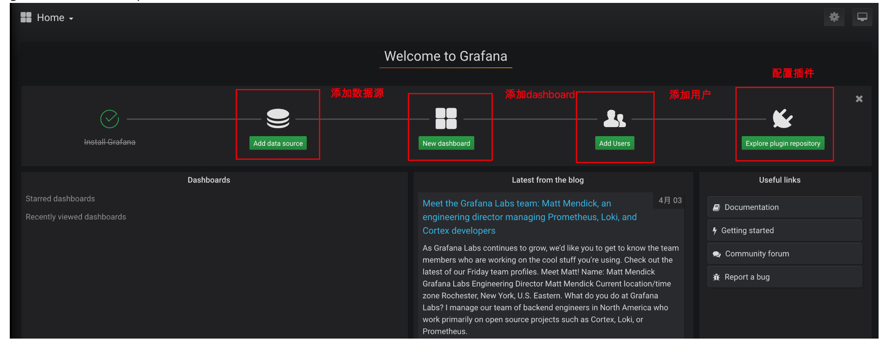

> 默认帐号： admin/admin

## 1. 添加用户

点击AddUsers，进入如下界面：
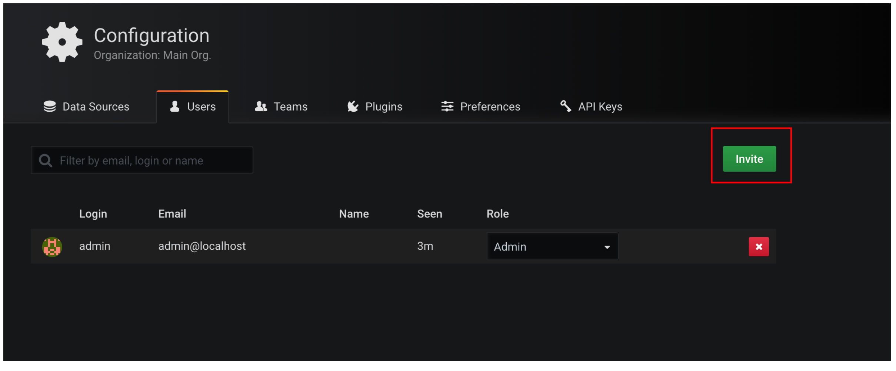

点击Invite，进入添加用户界面：

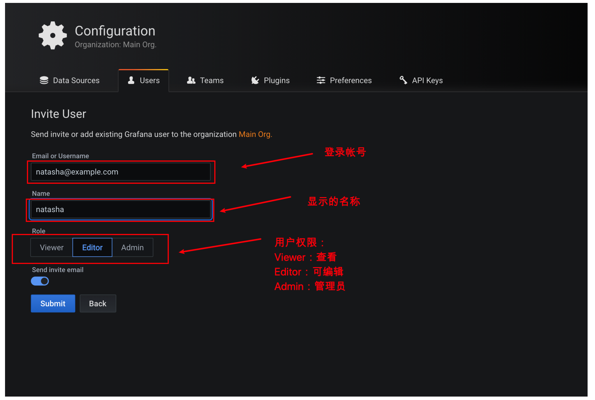

点击submit之后，grafana会尝试给用户邮箱发送邮件，邮件中会附带一个链接地址，以让用户登录grafana设置密码。

但我们这里没有为granfa配置邮箱，所以会出现报错，可以忽略。

此时会跳转至如下界面：

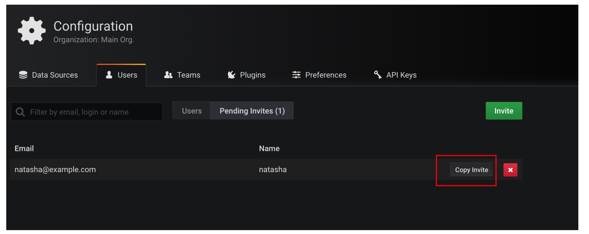

我们点击Copy Invite可复制链接，然后浏览器中打开如下：

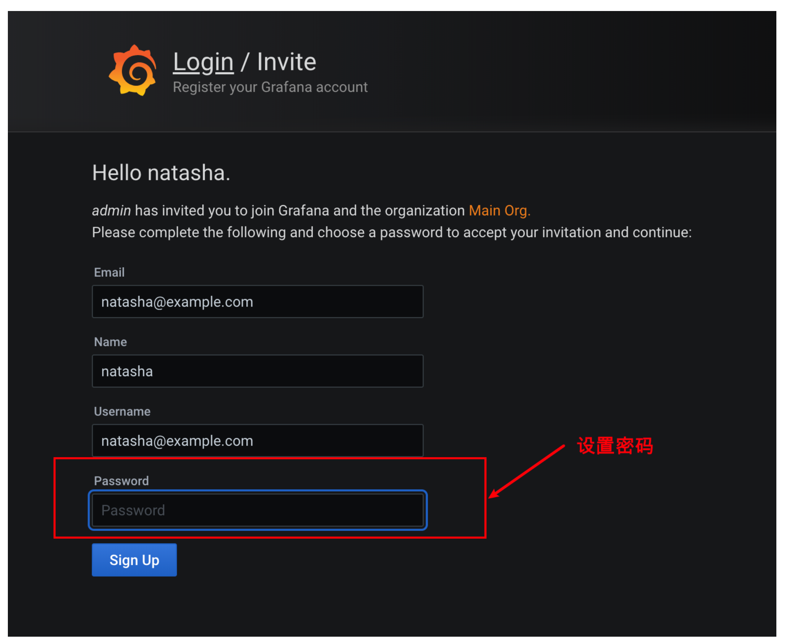

> 需要说明的是复制的链接中的地址为localhost，我们需要修改这个地址

## 2. 添加数据源

要使用grafana从prometheus中读取数据以绘图，需要将prometheus添加为grafana的数据源。

点击 add data source，进入添加数据源界面

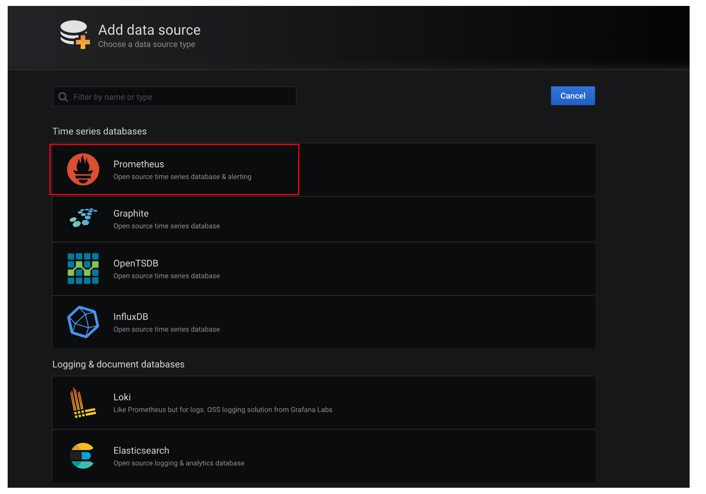

选择prometehus

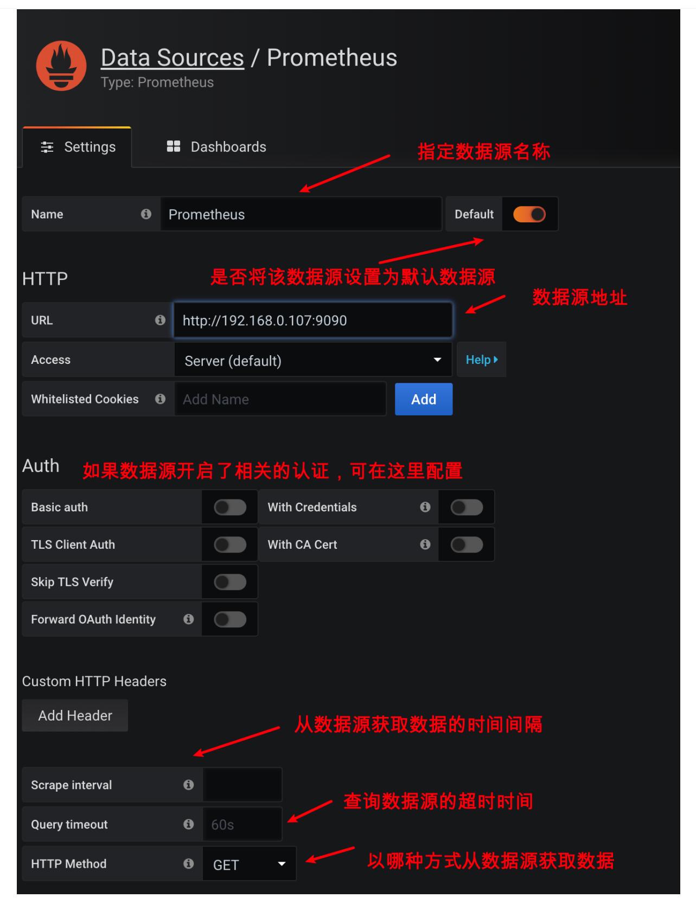

最后点击Save & Test，测试连接成功后即会保存数据源

## 3. 导入监控模板

### 3.1 查找模板

添加完数据源之后，我们即可从添加的数据源中读取数据完成绘图了。

我们在这里为了快速展示绘图效果，我们直接使用别人提供好的绘图模板导入来完成监控界面的展示。

grafana为我们提供了众多的监控展示模板，可在https://grafana.com/grafana/dashboards这里找到

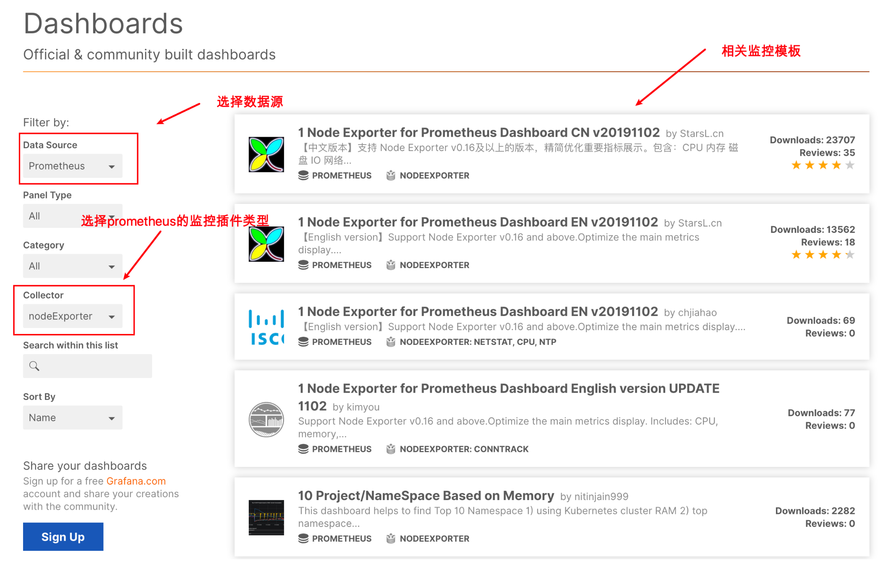

点击其中一个模板，进入其详情页：

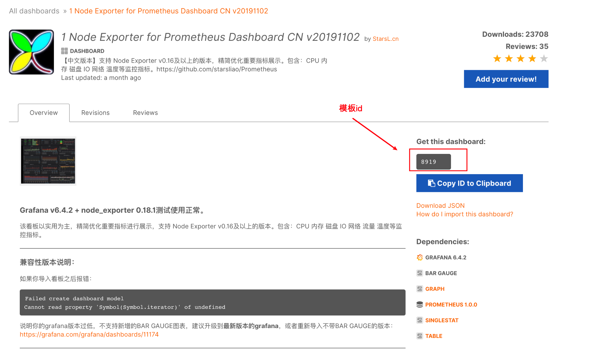

可以查看到该模板的详细信息，以及模板id，记住这个id，后面会用到。

### 3.2 导入模板

在grafana首页，添加加号，再点击import

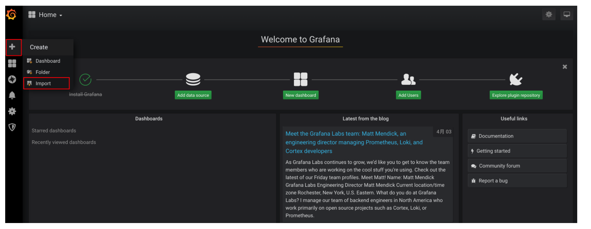

进入如下界面：

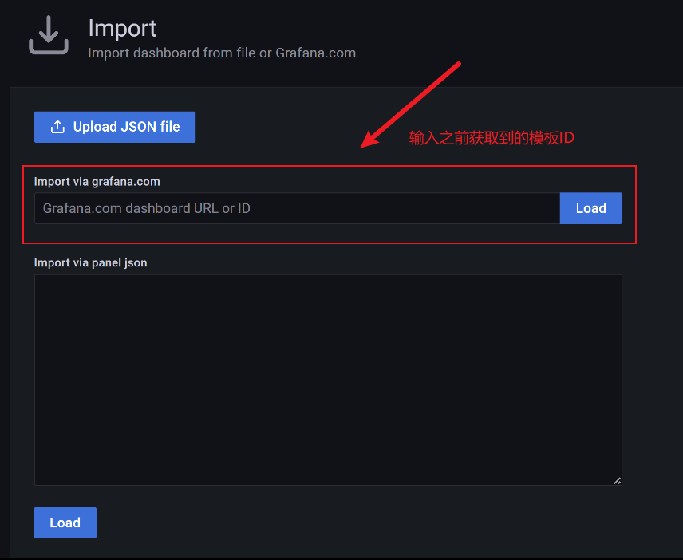

输入刚刚选择的模板id，会跳转至如下界面：

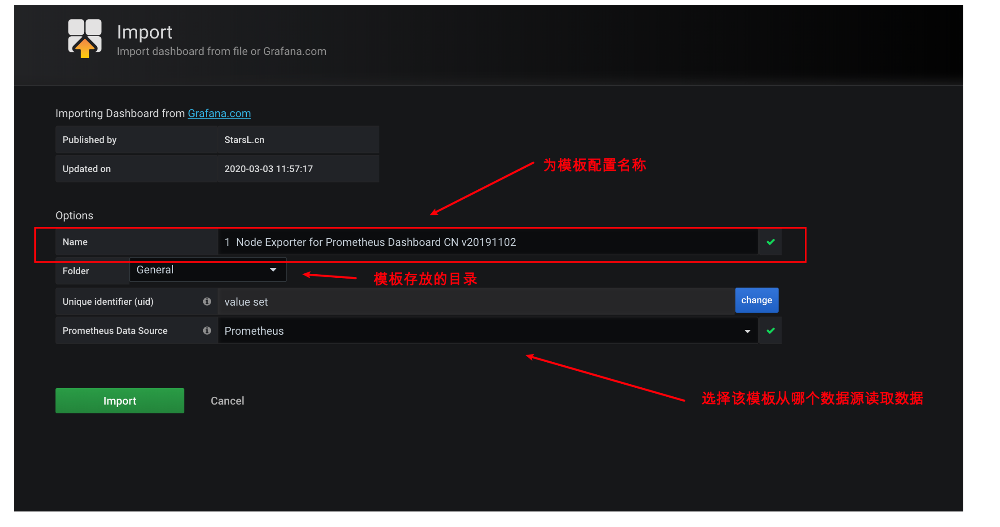

点击import完成模板导入。

## 3.3 查看效果图
可以查看到监控效果图如下：

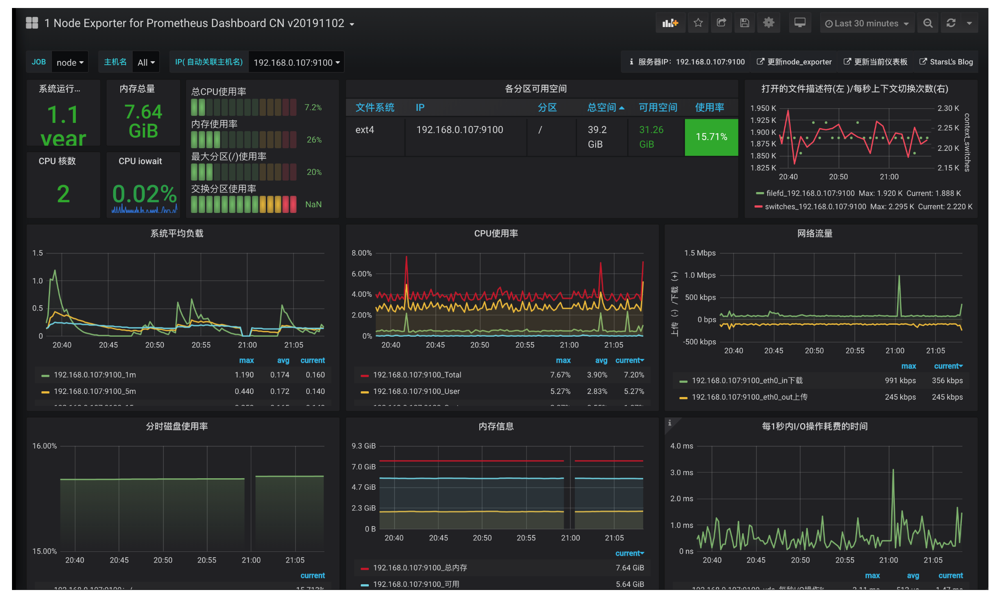


至此完成监控展示页效果。

# 附录

## grafana插件安装

可以直接参考http://docs.grafana.org/plugins/installation/

下面给出个简单的示例：

```shell
grafana-cli plugins install raintank-kubernetes-app

grafana-cli plugins install raintank-worldping-app
```

