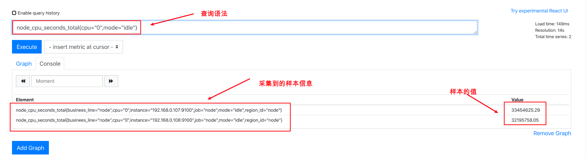
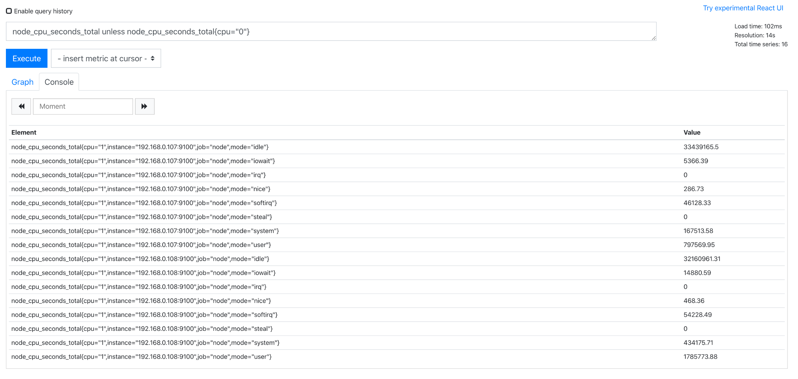
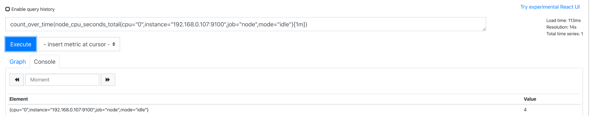

[toc]

<font size=4  />

# Prometheus数据模型


## TSDB简介

prometheus将所有采集到的数据存储到时序数据库（Time Series Database）当中，简称为TSDB。其具有以下特定：
1. 大部分的操作都是写入操作；
2. 写入操作基本都是按时间排序，顺序写入的；
3. 写操作很少写很久之前的数据，也很少更新数据；
4. 删除操作一般为区块操作（选定开始时间和结束时间，中间的区块全部删除）。
5. 读操作是十分典型的升序或者降序的顺序读
6. 支持高并发的读操作

事实上，从以上特定我们可以看出来，其非常契合监控系统的数据存储场景，这也是单prometheus节点每秒杀可以采集上百成个数据的原因所在。

## prometheus数据模型

接下来，我们来看一看prometheus采集到的数据指标长什么样子。我们在前面已经安装好了`node_exporter`。我们可以通过浏览器访问到`node_exporter`采集的指标：http://192.168.0.7:9100/metrics

可以看到返回的信息如下：

```sql
# HELP node_cpu_seconds_total Seconds the cpus spent in each mode.
# TYPE node_cpu_seconds_total counter
node_cpu_seconds_total{cpu="0",mode="idle"} 3.345415287e+07
node_cpu_seconds_total{cpu="0",mode="iowait"} 4474.43
node_cpu_seconds_total{cpu="0",mode="irq"} 0
node_cpu_seconds_total{cpu="0",mode="nice"} 287.81
node_cpu_seconds_total{cpu="0",mode="softirq"} 45594.54
node_cpu_seconds_total{cpu="0",mode="steal"} 0
node_cpu_seconds_total{cpu="0",mode="system"} 168755.09
node_cpu_seconds_total{cpu="0",mode="user"} 782695.49
node_cpu_seconds_total{cpu="1",mode="idle"} 3.34317124e+07
node_cpu_seconds_total{cpu="1",mode="iowait"} 5365.09
node_cpu_seconds_total{cpu="1",mode="irq"} 0
node_cpu_seconds_total{cpu="1",mode="nice"} 286.73
node_cpu_seconds_total{cpu="1",mode="softirq"} 46118.9
node_cpu_seconds_total{cpu="1",mode="steal"} 0
node_cpu_seconds_total{cpu="1",mode="system"} 167474.19
node_cpu_seconds_total{cpu="1",mode="user"} 797478.39
```

我这里只截取了一部分。可以看到里面分为三段：
* 第一段以`# HELP`开头，这是帮助信息，描述下面的指标的含义
* 第二段以`# TYPE`开头，用于描述指标的类型
* 第三段以`node_cpu_seconds_total`开头，这是具体的指标和值

而这些指标我们也可以通过在prometheus web ui中查询到：



## 指标

在prometheus当中，一个采集样本是由采集指标和指标的值组成。

```sql
node_cpu_seconds_total{cpu="0",mode="idle"} 3.345415287e+07
```

指标也称为metrics，在prometheus当中，其数据结构如下：
```sql
metrics_name{label_name=label_value,...}
```

其中`metrics_name`即为指标名称,其只能由ascii字符、数字、下划线以及冒号组成并且必须符合正则表达式`[a-zA-Z:][a-zA-Z0-9_:]*`。

而针对一个指标，还会有一堆的标签来描述其具体的意义。比如`node_cpu_seconds_total`这个指标表示的是cpu的总时间。那我们可能会有如下疑问：

1. 这个cpu的总时间表示的是cpu的总使用时间还是总空闲时间？
2. 这个cpu总时间表示的是哪块cpu的总时间？
3. 如果我想要获得这台机器上第0块cpu的sys所占用的时间，该怎么表示？


而标签就是用来描述这个cpu总时间的具体标示的样本信息的，比如：
```sql
node_cpu_seconds_total{cpu="1",mode="system"}
```
即代表，第1块cpu的sys所占用的cpu的这块cpu的总时间

## 指标类型

有了指标，就有指标的值，而这些值是存在类型的，比如只增不减的值，再比如瞬间变化的值。而在prometheus当中，这些类型一共有四种：

* Counter：单调递增的计数器，上面例子中的`node_cpu_seconds_total`就是这种类型。除此之外，还有比如某个url的总访问次数，某个异常发生的总次数等。
* Gauge：变化仪表盘，即瞬间变化的值，可任意上升和下降，比如内存的使用情况，温度，cpu负载，用户登录数，tcp连接数等。
* Histogram：直方图类型，可以通过该类型获取分位数，而计算分位点数据是在服务端完成的
* Summary：摘要类型，类似于直方图，计算分位点是在客户端完成的。

Counter和Gauge比较好理解，这里就不多说。

### 直方图

接下来详细的说一说直方图，按照官方的说法，

下面是一个直方图的指标示例：

```sql
# HELP prometheus_http_request_duration_seconds Histogram of latencies for HTTP requests.
# TYPE prometheus_http_request_duration_seconds histogram
prometheus_http_request_duration_seconds_bucket{handler="/",le="0.1"} 15
prometheus_http_request_duration_seconds_bucket{handler="/",le="0.2"} 15
prometheus_http_request_duration_seconds_bucket{handler="/",le="0.4"} 15
prometheus_http_request_duration_seconds_bucket{handler="/",le="1"} 15
prometheus_http_request_duration_seconds_bucket{handler="/",le="3"} 15
prometheus_http_request_duration_seconds_bucket{handler="/",le="8"} 15
prometheus_http_request_duration_seconds_bucket{handler="/",le="20"} 15
prometheus_http_request_duration_seconds_bucket{handler="/",le="60"} 15
prometheus_http_request_duration_seconds_bucket{handler="/",le="120"} 15
prometheus_http_request_duration_seconds_bucket{handler="/",le="+Inf"} 15
```
按照指标的帮助说明，我们可以知道这个指标用于统计http的响应延迟的时间， 其中
```sql
prometheus_http_request_duration_seconds_bucket{handler="/",le="0.1"} 
```
代表请求响应在0.1秒内完成的请求数有多少
```sql
prometheus_http_request_duration_seconds_bucket{handler="/",le="0.2"}
```
代表请求响应在0.2秒内完成的请求数有多少

依次类推，直至`prometheus_http_request_duration_seconds_bucket{handler="/",le="+Inf"}`代表所有的请求数。

而事实上，在prometheus中，直方图的值是累加的，也称之为累积直方图。

在绝大多数的监控系统当中，提供给我们的可能都是比如一个url的平均响应时间，而通过直方图，我们可以通过点分位计算有百分之多少的请求在多少s之后完成响应。而且还可以清晰的看到有多少的请求响应是比较慢的，从而解决长尾问题。当然也可以计算url的平均响应时间 。


而在上面的指标中，我们其实就可以看到，所有针对`/`的请求，响应基本都在0.1s内完成了。


### summary

summary与Histogram类似，只不过它直接存储的就是分位数

看一个例子：

```sql
# TYPE prometheus_sd_file_scan_duration_seconds summary
prometheus_sd_file_scan_duration_seconds{quantile="0.5"} 0.000298389
prometheus_sd_file_scan_duration_seconds{quantile="0.9"} 0.000319206
prometheus_sd_file_scan_duration_seconds{quantile="0.99"} 0.00034396
prometheus_sd_file_scan_duration_seconds_sum 1.8297038919999984
prometheus_sd_file_scan_duration_seconds_count 5953
```

quantile代表分位数。

上面示例的意思是，50%的请求都在0.000298389s这么长时间内完成，而90%的请求都在0.000319206s这么长时间内完成，而99%的请求都在0.00034396s这么长时间内完成。

而`prometheus_sd_file_scan_duration_seconds_count`代表总请求数，`prometheus_sd_file_scan_duration_seconds_sum`则代表总执行时间。

# PromQL查询语法

在前面我们详细说了prometheus的采样指标以及其值类型。但这些指标都是些原始值，要想真正为我们所用，还得经过复杂的计算。


比如在上面我们通过`node_cpu_seconds_total{cpu="1",mode="system"}`这个指标拿到了1号cpu的sys的占用的cpu总时间，可是这个指标本身对我们来讲仍没有多大意义。我们更想要知道的是，这台机器上所的cpu的使用率，该怎么办？

prometheus为我们提供了强大的promQL查询语句来解决这个问题。比如下面是一个查询cpu使用率的语法：

```sql
(1 - avg(irate(node_cpu_seconds_total{instance="192.168.0.107:9100",mode="idle"}[1m])) by (instance)) * 100
```

我们简单来分析下这个语句：
```
node_cpu_seconds_total{instance="192.168.0.107:9100",mode="idle"}
```
代表我们要查询192.168.0.107这个实例的空闲的cpu的总时间，此时返回如下：
```
node_cpu_seconds_total{cpu="0",instance="192.168.0.107:9100",job="node",mode="idle"}	33459875.35
node_cpu_seconds_total{cpu="1",instance="192.168.0.107:9100",job="node",mode="idle"}	33437436.22
```
由于`node_cpu_seconds_total`返回的是一个持续递增的值，所以这里需要使用irate()函数做增长率计算，下面是取1分钟内的空闲时间的增长率

```
irate(node_cpu_seconds_total{instance="192.168.0.107:9100",mode="idle"}[1m])
```
返回结果如下：

```
{cpu="0",instance="192.168.0.107:9100",job="node",mode="idle"}	0.9799999999503295
{cpu="1",instance="192.168.0.107:9100",job="node",mode="idle"}	0.9799999999503295
```
现在拿到了这个实例的0号cpu和1号cpu的空闲率，我们需要计算平均的空闲率，以instance这个指标做分组运算，使用avg()函数获取平均值：

```
avg(irate(node_cpu_seconds_total{instance="192.168.0.107:9100",mode="idle"}[1m])) by (instance)
```
返回如下：

```sql
{instance="192.168.0.107:9100"}	0.9803333333383004
```

这样就获得了这个实例的总cpu的平均空闲率，用1减去空闲率，就获得了使用率：

```
(1 - avg(irate(node_cpu_seconds_total{instance="192.168.0.107:9100",mode="idle"}[1m])) by (instance)) * 100
```

## 常用操作符说明

在上面的查询语法当中，我们已经使用了`-`和`*`两种操作符，除此之外，prometheus还支持更多的操作符：

### 1. 算术运算符

* `+`：加法运算
* `-`：减法运算
* `*`：乘法运算
* `/`：除法运算
* `%`：取余运算
* `^`：求幂运算

### 2. 比较运算符

* `==`：等于
* `!=`：不等于
* `>` ：大于
* `<` ：小于
* `>=`：大于等于
* `<=`：小于等于

### 3. 逻辑运算符

* and：与
* or：或
* unless：victor1 unless victor2的意思是，将victor1中包含有victor2的标签删掉

unless示例：



相当于直接过滤掉了`node_cpu_seconds_total{cpu="0"}`指标

### 4. 聚合运算

* sum()：求和
* min()：求最小值 
* max()：求最大值
* avg()：求平均值 
* count()：统计个数
* topk()：一般用于获取top榜

### 扩展

```
当=号后面加上~的时候 标签可以使用正则进行匹配
```


## 常用函数说明


在上面的查询语法当中，我们已经用到了irate()函数和avg()函数。这些函数是prometheus内置的方便查询的函数。更多的内置函数可以参考https://prometheus.io/docs/prometheus/latest/querying/functions/

### 1. count_over_time()

用于计算指定的时间内，指定指标的采样个数，其值和我们的采样频率有关。

在下面这个例子里，我们是每15s采样一样，所以一分钟的指标采样个数为4：



### 2. irate()

用于计算增长率，在上面查询cpu的使用率时，已经用过了

### 3. rate()

与irate()一样，用于计算增长率

区别：

* rate()用于计算某个时间序列范围内的每秒平均增长率，其将指定时间范围内的所有采集到的数据点做速率的平均计算。
* irate()用于计算某个时间序列范围内的某个时刻的每秒增长率。它只观测指定时间范围内的最后两个点，并计算每秒速率，属于瞬时比率。比rate()精度高。

适用场景： irate适合快速变化的计数器（counter），而rate适合缓慢变化的计数器（counter）。

### 4. predict_linear()

基于现有的数据预测未来的趋势变化

下面这个标签式是用来基于现有的磁盘增长情况计算在未来6个小时，磁盘剩余的可用空间
```
predict_linear(node_filesystem_avail_bytes[6h],3600 * 24) 
```

### 5. count()

用于统计个数

下面是两个示例：

```
# 计算所有的实例cpu核心数
count (node_cpu_seconds_total{mode="system"}) by (instance)
# 计算单个实例的
count (node_cpu_seconds_total{mode="system",instance="192.168.0.107:9100"}) by (instance)
```

### 6. topk()

用于取某一查询指标的前几名


下面这个示例用于获取所有的内存使用率比较高的两个节点
```
topk(2,node_memory_MemFree_bytes / node_memory_MemTotal_bytes  * 100 )
```


## 常用语句说明

### 1. cpu使用率

这个在前面已经说过了：

```
(1 - avg(irate(node_cpu_seconds_total{instance="192.168.0.107:9100",mode="idle"}[1m])) by (instance)) * 100
```

### 2. 内存使用率

```
(1 - (node_memory_MemAvailable_bytes{instance=~"192.168.100.10:20001"} / (node_memory_MemTotal_bytes{instance=~"192.168.100.10:20001"})))* 100
```

### 3. 磁盘使用率

```
100 - ((node_filesystem_avail_bytes{instance="192.168.0.107:9100",mountpoint="/",fstype=~"ext4|xfs"} * 100) / node_filesystem_size_bytes {instance=~"192.168.0.107:9100",mountpoint="/",fstype=~"ext4|xfs"})
```

### 4. 基于现有的磁盘使用率计算未来的某个时间点磁盘空间是否会满

下面这个表达式分为两部分，使用and连接， 前面部分用于计算所有根分区使用率大于85%的，后面部分使用predict_linear()函数基于现有的磁盘空间的增长率来计算，这些大于85%的根分区使用率的节点空间在6个小时之后是否会满

```
(1-  node_filesystem_avail_bytes{fstype=~"ext4|xfs",mountpoint="/"}
/ node_filesystem_size_bytes{fstype=~"ext4|xfs",mountpoint="/"}) * 100 >= 85     and (predict_linear(node_filesystem_avail_bytes[6h],3600 * 24) < 0)
```

### 5. 网络使用率

我们查询基本上都是围绕着指标的标签来的，我们在使用标签查询的时候，除了等式查询，还可以使用正则表达式：


下面我们使用正则表达式来查询网卡速率
```
# 下载速率
irate(node_network_receive_bytes_total{device=~"eth0|bond0|bond1"}[1m]) / 1024 * 8

# 上传速率
irate(node_network_transmit_bytes_total{device=~"eth0|bond0|bond1"}[1m]) / 1024 * 8
```

# 附录

参考：

* [《一文搞懂prometheus的直方图》](https://www.cnblogs.com/ryanyangcs/p/11309373.html)
* [《Prometheus PromSQL查询语言》](https://www.cnblogs.com/zhaojiedi1992/p/zhaojiedi_liunx_63_prometheus_promql.html)