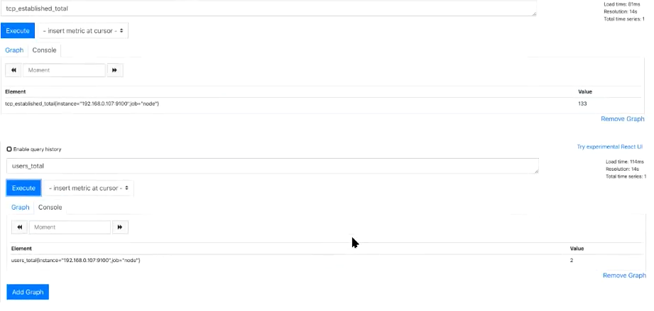
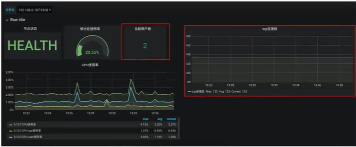

[toc]

# 简介


在使用zabbix的时候我们知道zabbix-agent除了采集其预置的指标外，还可以通过自定义监控脚本以实现自定义指标的采集。

这些自定义指标包括单个进程的内存占用、cpu占比，当前系统的登录用户数，当前系统的tcp连接数等。

node_exporter也支持自定义监控脚本。


# node_exporter自定义监控原理


实际上node_exporter读取自定义监控指标是从一个指定的目录当中读取后缀名为`.prom`的文件，以获取相关的指标及数据。如下：

```shell
cat Users_total.prom

# TYPE Users_total gauge
Users_total 2
```

说明：

* 第一行为数据类型，虽然是注释，但必须存在，用于指明metrics的数据类型
* 第二行为metrics及其值


而我们要做的，就是使用脚本生成这样一个文件，并且存放至指定目录，以便让node_exporter能够读取到即可。

# 添加自定义监控实战


添加自定义监控，我们要解决两个问题：
1. 指定自定义监控指标存放的目录，这个目录node_exporter要能够读到
2. 在这个目录下添加自定义指标文件


## 1. 指定node_exporter读到自定义指标的目录

node_exporter支持使用`--collector.textfile.directory`参数指定自定义指标的目录。

```shell
# 创建目录

mkdir /usr/local/node_exporter/custom_keys
chown prometheus.prometheus /usr/local/node_exporter/custom_keys

# 修改node_exporter启动文件
...
ExecStart=/usr/local/node_exporter/node_exporter  --collector.textfile.directory=/usr/local/node_exporter/custom_keys
...

# 重启node_exporter
systemctl daemon-reload
systemctl restart node_exporter
```

## 2. 创建自定义指标

我们这里通过脚本采集两个指标：

* 当前系统登录用户数
* 当前系统tcp连接数


我们可以通过如下方式获取到登录用户数：
```shell
who | wc -l
```

可以通过如下方式获取到tcp连接数：

```shell
netstat -an  |grep ^tcp |grep ESTABLISHED | wc -l
```


下面通过编写脚本生成`.prom`文件放到`/usr/local/node_exporter/custom_keys`目录即可：


```sh
# cat custom_keys.sh 

#!/bin/bash

# 定义生成的prom文件存放位置
customKeysDir=/usr/local/node_exporter/custom_keys

# 为脚本传参，当有多个参数时，第一个参数为metric名称，后续的参数都为生成指标脚本的参数
metric=$1
shift

# 定义指标脚本的路径及名称
customKeysScript="$customKeysDir/$metric".sh

# 定义prom文件生成的路径及名称
promFile="$customKeysDir/$metric".prom

# 判断指标脚本是否存在且可执行
if [ ! -f "$customKeysScript" ] || [ ! -x "$customKeysScript" ];then
    echo "Error: Cant find script for ${metric}. Aborting."
    exit 1
fi

# 执行指标脚本以生成指标的值
echo $customKeysScript $@
customKeysValue=`$customKeysScript $@`

# 将指标的类型，指标及其值写入prom文件
if [ -z "$customKeysValue" ];then
    echo "no results..."
    exit 0
else
    echo "# TYPE ${metric} gauge" > $promFile.$$
    echo "${metric} ${customKeysValue}" >> $promFile.$$
    mv $promFile.$$ $promFile
fi
```

定义两个指标脚本：

* 第一个用于获取当前的系统登录用户数
    ```shell
    # cat /usr/local/node_exporter/custom_keys/user_totals.sh
    
    #!/bin/bash
    
    who | wc -l
    ```
* 第二个用于获取当前的系统tcp连接数
    ```shell
    # cat /usr/local/node_exporter/custom_keys/tcp_established_total.sh 
    #!/bin/bash
    
    netstat -an |grep ^tcp | grep "ESTABLISHED" | wc -l
    
    
    # 将两个脚本添加可执行权限
    
    chmod +x /usr/local/node_exporter/custom_keys/user_totals.sh /usr/local/node_exporter/custom_keys/tcp_established_total.sh 
    ```

我们可以试着执行下脚本如下：

```shell
custom_keys.sh user_totals
custom_keys.sh tcp_established_total
```

生成的文件：

```sh
# cat tcp_established_total.prom 

# TYPE tcp_established_total gauge
tcp_established_total 133

# cat users_total.prom 

# TYPE users_total gauge
users_total 2

```

此时，我们可以在prometheus查询到相关指标：




通过grafana绘图如下：




> 我这里仅仅只是示例，事实上prometheus原生提供当前系统tcp连接数的支持，可使用`node_netstat_Tcp_CurrEstab`指标获得

## 3. 添加定时任务

上面的脚本执行一次后，会生成一次指标，要想更新指标值，需要周期性执行该脚本。

添加如下定时任务：

```shell
crontab -l
* * * * * /usr/local/node_exporter/custom_keys/custom_keys.sh user_totals
* * * * * /usr/local/node_exporter/custom_keys/custom_keys.sh tcp_established_total
```


# 附录


在kubernetes中部署node_exporter： http://www.xuyasong.com/?p=1539