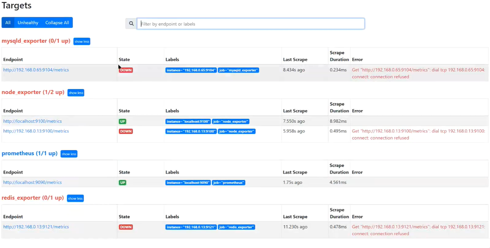

[toc]

# 简介

prometheus采集目标端数据，首先需要明确目标端是谁。而关于目标端的定义就写在prometheus的配置文件当中。

当然prometheus配置文件不仅仅定义目标端。


事实上在前面我们使用prometheus采集node_exporter数据时，已经简单的定义了一个prometheus配置文件。

本篇我们就来详细的聊一聊。


# 配置文件结构说明


prometheus配置文件分为如下6段：

* global： 定义prometheus的全局配置项， 比如采集间隔，抓取超时时间等；
* rule_files：定义报警规则文件路径，prometheus除了从目标端采集数据指标之外，还负责对指标进行计算，并推送告警信息至alertmanager，而告警规则文件就定义在这里；
* scrape_configs: 指定抓取目标端的配置，所有关于目标端的抓取策略都定义在这里，这也是整个prometheus配置的核心；
* alerting: 指定prometheus告警信息推送到的alertmanager实例的地址；
* remote_write: prometheus可以将数据写入到远端存储，这里指定要写入的后端的存储的api地址；
* remote_read: prometheus可以从其他的prometheus中读取数据并保存在自己的存储当中，这里指定要读取数据的api地址。


## global

```yaml
global:

 scrape_interval: 15s  # 抓取目标的频率，默认为1m
 evaluation_interval: 15s  # 评估规则的频率，默认为1m
 scrap_timeout: 10s # 抓取目标的超时时间，默认为10s
 
```

## rule_files

```yaml
rule_files:
  - rules/*_rules.yml    # 指定rule告警规则文件路径
```

## alerting

```yaml
# 用于配置alertmanager的地址
alerting:
  alertmanagers:
  - static_configs:
    - targets:
      # - alertmanager:9093
```


## scrape_configs

scrape_configs的配置结构：

```yaml
scrape_configs:
  - job_name: <job_name>  # 指定抓取任务的名称
    scrape_interval: <duration> # 默认使用全局配置
    scrape_timeout: <duration>  # 默认使用全局配置
    metrics_path：/metrics  # 指定抓取目标的url路径，默认为/metrics
    # honor_labels控制prometheus如何处理已经存在于已抓取数据中的标签与prometheus将附加到服务端的标签的冲突；
    # 比如默认情况下，prometheus会为抓取的目标加上"job"和"instance"标签。但是如果我们抓取的目标值正好自带的也有这两个标签，那么此时，prometheus应该用目标自带的标签覆盖prometheus加上的标签，还是忽略掉目标自带的标签？
    # 如果设置为true，则保留目标自带的标签而忽略prometheus加上的标签；
    # 如果设置为false，则保留prometheus加上的标签，而将目标自带的标签重命名为"exported_<original-label>"，例如"exported_instance"
    # 默认为false
    honor_labels: false
    schema: http    # 指定采集目标端所使用的协议，http或https，默认为http
    params: # 指定可选的http url参数
      [<string>: [<string>,...]]
    
    # 如果被抓取端需要basic_auth的认证，在这里指定用户名和密码
    basic_auth:
      username: <string>
      password: <string>
      password_file: <string>   # 指定密码文件的路径，与password配置项互斥
    
    # 如果被抓取端使用token认证，则在这里指定token
    bearer_token: <secret>
    
    # 也可以通过如下方式指定token_file的路径
    bearer_token_file: /path/to /bearer/token/file
    
    # 如果使用tls认证，则在这里指定tls认证配置
    tls_config:
      ca_file: /path/to/ca  # 指定ca证书路径
      insecure_skip_verify: true    # 不验证ca证书的安全性
    
    # 代理url
    proxy_url: <string>
    
    # 配置服务发现，prometheus支持多种服务发现类型，如file,consul,kubernetes等
    
    file_sd_configs:
      - <file_sd_config>
      - ...
    
    consul_sd_configs:
      - <consul_sd_config>
      - ...
      
    kubernetes_sd_configs:
      - <kubernetes_sd_config>
      - ...
    ...
```

### 静态配置

下面是一个静态配置示例：

```yaml
scrape_configs:
  # The job name is added as a label `job=<job_name>` to any timeseries scraped from this config.
  - job_name: 'prometheus'

    # metrics_path defaults to '/metrics'
    # scheme defaults to 'http'.

    static_configs:
    - targets: ['localhost:9090']
    
  - job_name: "node"
    static_configs:
    - targets:
      - "192.168.0.107:9100"
      - "192.168.0.108:9100"
      labels:
        idc: "wh"
```

此时，结果如下：




### 动态配置

#### 基于文件的动态服务发现

```yaml
scrape_configs:
  # The job name is added as a label `job=<job_name>` to any timeseries scraped from this config.
  - job_name: 'prometheus'

    # metrics_path defaults to '/metrics'
    # scheme defaults to 'http'.

    static_configs:
    - targets: ['localhost:9090']
    
  - job_name: "node"
    file_sd_configs:
    # 每隔一分钟自动重载配置文件
    - refresh_interval: 1m
      files: 
      - "/usr/local/prometheus/conf/node*.yml"
```

/usr/local/prometheus/conf/node-dist.yml配置如下：

```yaml
- targets:
  - "192.168.0.107:9100"
  - "192.168.0.108:9100"
  labels:
    idc: wh
```

这个效果跟上面静态配置的效果其实是一样的，只不过修改node-dist.yml文件后，每隔一分钟会自动生效，而不需要手动去重载prometheus。

# 附录

参考： 

* [《prometheus配置文件》](https://www.cnblogs.com/zhaojiedi1992/p/zhaojiedi_liunx_60_prometheus_config.html)

