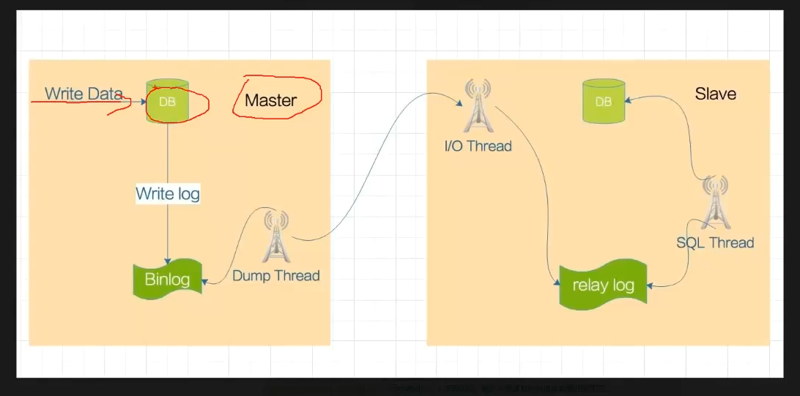

# MariaDB


## 数据库的类型


### 关系型数据库

*   数据是结构化的 
*   多张表之间通过一些字段建立关联关系
*   存储内容是数据表 


#### 层级结构： 

库 --> 表 --> 行 --> 列 --> 列头(字段) 

 

#### 常见关系型数据库软件：

*   MySQL

*   MariaDB

*   oracle 


## 基本步骤：

### 1. 部署

1.  使用yum源进行安装
2.  安装结束之后初始化数据库 

```shell
[root@node3 yum.repos.d]# mariadb-secure-installation
```


### 2. 连接

```shell
[root@node3 yum.repos.d]# mysql 
Welcome to the MariaDB monitor.  Commands end with ; or \g.
Your MariaDB connection id is 4
Server version: 10.6.7-MariaDB MariaDB Server

Copyright (c) 2000, 2018, Oracle, MariaDB Corporation Ab and others.

Type 'help;' or '\h' for help. Type '\c' to clear the current input statement.

MariaDB [(none)]> 
```


如果需要远程登陆数据库，需要创建用户密码，并且关闭防火墙


默认监听3306


本机执行mysql的时候会再/var/lib/mysql下有一个本地套接字，不需要做认证 账号就是root，使用root的权限进行连接 


### 3. 基本操作


#### 数据库操作


列出数据库

```mysql
MariaDB [(none)]> show databases ; 
+--------------------+
| Database           |
+--------------------+
| information_schema |
| mysql              |
| performance_schema |
| sys                |
| test               |
+--------------------+
5 rows in set (0.001 sec)
#内嵌的 sys、performance_schema、mysql、information_schema库是自带的库，test库是自带的库
```

删除数据库

```mysql

MariaDB [(none)]> drop database test ; 
Query OK, 0 rows affected (0.002 sec)

MariaDB [(none)]> show databases ; 
+--------------------+
| Database           |
+--------------------+
| information_schema |
| mysql              |
| performance_schema |
| sys                |
+--------------------+
4 rows in set (0.000 sec)
```

创建数据库

```mysql
MariaDB [(none)]> create database test1 ; 
Query OK, 1 row affected (0.000 sec)

MariaDB [(none)]> show databases ; 
+--------------------+
| Database           |
+--------------------+
| information_schema |
| mysql              |
| performance_schema |
| sys                |
| test1              |
+--------------------+
5 rows in set (0.000 sec)
```

选择需要操作的数据库

```mysql
MariaDB [(none)]> use mysql 
Reading table information for completion of table and column names
You can turn off this feature to get a quicker startup with -A

Database changed
MariaDB [mysql]> 
```


查看数据库中的所有数据表

```mysql
MariaDB [mysql]> show tables ; 
+---------------------------+
| Tables_in_mysql           |
+---------------------------+
| column_stats              |
| columns_priv              |
| db                        |
| event                     |
| func                      |
| general_log               |
| global_priv               |
| gtid_slave_pos            |
| help_category             |
| help_keyword              |
| help_relation             |
| help_topic                |
| index_stats               |
| innodb_index_stats        |
| innodb_table_stats        |
| plugin                    |
| proc                      |
| procs_priv                |
| proxies_priv              |
| roles_mapping             |
| servers                   |
| slow_log                  |
| table_stats               |
| tables_priv               |
| time_zone                 |
| time_zone_leap_second     |
| time_zone_name            |
| time_zone_transition      |
| time_zone_transition_type |
| transaction_registry      |
| user                      |
+---------------------------+
31 rows in set (0.000 sec)

MariaDB [mysql]> 
```


#### 数据表操作

 

查看数据库中的表 

```mysql
MariaDB [mysql]> show tables ; 
+---------------------------+
| Tables_in_mysql           |
+---------------------------+
| column_stats              |
| columns_priv              |
| db                        |
| event                     |
| func                      |
| general_log               |
| global_priv               |
| gtid_slave_pos            |
| help_category             |
| help_keyword              |
| help_relation             |
| help_topic                |
| index_stats               |
| innodb_index_stats        |
| innodb_table_stats        |
| plugin                    |
| proc                      |
| procs_priv                |
| proxies_priv              |
| roles_mapping             |
| servers                   |
| slow_log                  |
| table_stats               |
| tables_priv               |
| time_zone                 |
| time_zone_leap_second     |
| time_zone_name            |
| time_zone_transition      |
| time_zone_transition_type |
| transaction_registry      |
| user                      |
+---------------------------+
31 rows in set (0.000 sec)

MariaDB [mysql]> 
#user表中记录了所有的账户和密码 
```


## MySQL基本管理


### 用户管理


用户名@‘192.168.0.%’

例如：admin@‘%’

%通配符 可以代表0.0.0.0 代表所有 

natasha@'10.%.%.%'和natasha@'192.168.%.%'是两个不同的账号 


创建用户并授权 

1.  创建、删除用户

```mysql
#创建用户
MariaDB [mysql]> create user 'admin'@'%' identified by '123456' ; 
Query OK, 0 rows affected (0.000 sec)

MariaDB [mysql]> flush privileges ; 
Query OK, 0 rows affected (0.000 sec)

#删除用户
MariaDB [mysql]> drop user admin@'%' ; 
Query OK, 0 rows affected (0.000 sec)

MariaDB [mysql]> flush privileges ; 
Query OK, 0 rows affected (0.000 sec)

#修改用户密码
MariaDB [mysql]> set password for admin@'192.168.1.143'= password('123') ; 
Query OK, 0 rows affected (0.000 sec)

MariaDB [mysql]> flush privileges ; 
Query OK, 0 rows affected (0.000 sec)
```


2.  用户授权

```mysql
MariaDB [mysql]> grant all on *.*  to  admin@'192.168.1.%'  ; 
Query OK, 0 rows affected (0.000 sec)
#all 代表的权限类型 
#*.*  代表操作的库下的表 
#admin@'192.168.1.%' 代表用户

#赋予用户能给别的用户授权的权限
MariaDB [mysql]> grant all on *.*  to  admin@'192.168.1.%' with grant option ; 

#查看用户赋予的权限
MariaDB [(none)]> show grants  for admin@'192.168.1.%' ; 
+-------------------------------------------------------------------------------------------------------------------------+
| Grants for admin@192.168.1.%                                                                                            |
+-------------------------------------------------------------------------------------------------------------------------+
| GRANT ALL PRIVILEGES ON *.* TO `admin`@`192.168.1.%` IDENTIFIED BY PASSWORD '*6BB4837EB74329105EE4568DDA7DC67ED2CA2AD9' |
+-------------------------------------------------------------------------------------------------------------------------+
1 row in set (0.000 sec)

MariaDB [(none)]> 
```


### 数据表管理


#### 建表 

```mysql
CREATE TABLE IF NOT EXISTS `student`(	
   `id` INT UNSIGNED AUTO_INCREMENT,	
   `name` VARCHAR(100) NOT NULL,		
   `gender` TINYINT NOT NULL,			
   `age` INT UNSIGNED,					
   `class` TINYINT UNSIGNED           
   PRIMARY KEY ( `id` )                
)DEFAULT CHARSET=utf8;					
```

```mysql
CREATE TABLE IF NOT EXISTS `student`(	#定义表名 
   `id` INT UNSIGNED AUTO_INCREMENT,	#表列
   `name` VARCHAR(100) NOT NULL,		#表列
   `gender` TINYINT NOT NULL,			#表列
   `age` INT UNSIGNED,					#表列
   `class` TINYINT UNSIGNED             #表列
   PRIMARY KEY ( `id` )                 #定义主键
)DEFAULT CHARSET=utf8;					#定义编码类型
```


#### 查询

查询表字段

```mysql 
MariaDB [school]> show columns from  runoob_tbl ;    
+-----------------+------------------+------+-----+---------+----------------+
| Field           | Type             | Null | Key | Default | Extra          |
+-----------------+------------------+------+-----+---------+----------------+
| runoob_id       | int(10) unsigned | NO   | PRI | NULL    | auto_increment |
| runoob_title    | varchar(100)     | NO   |     | NULL    |                |
| runoob_author   | varchar(40)      | NO   |     | NULL    |                |
| submission_date | date             | YES  |     | NULL    |                |
+-----------------+------------------+------+-----+---------+----------------+
4 rows in set (0.001 sec)
```


查询建表语句

```mysql
MariaDB [school]> show create table runoob_tbl ; 
+------------+--------------------------------------------------------------------------------------------------------------------------------------------------------------------------------------------------------------------------------------------------------------------------------+
| Table      | Create Table                                                                                                                                                                                                                                                                   |
+------------+--------------------------------------------------------------------------------------------------------------------------------------------------------------------------------------------------------------------------------------------------------------------------------+
| runoob_tbl | CREATE TABLE `runoob_tbl` (
  `runoob_id` int(10) unsigned NOT NULL AUTO_INCREMENT,
  `runoob_title` varchar(100) NOT NULL,
  `runoob_author` varchar(40) NOT NULL,
  `submission_date` date DEFAULT NULL,
  PRIMARY KEY (`runoob_id`)
) ENGINE=InnoDB DEFAULT CHARSET=utf8mb3 |
+------------+--------------------------------------------------------------------------------------------------------------------------------------------------------------------------------------------------------------------------------------------------------------------------------+
1 row in set (0.000 sec)

MariaDB [school]> 
```


#### 修改

增加表列

```mysql 
MariaDB [school]> alter table runoob_tbl add course INT ; 
Query OK, 0 rows affected (0.004 sec)
Records: 0  Duplicates: 0  Warnings: 0

MariaDB [school]> show columns from runoob_tbl ; 
+-----------------+------------------+------+-----+---------+----------------+
| Field           | Type             | Null | Key | Default | Extra          |
+-----------------+------------------+------+-----+---------+----------------+
| runoob_id       | int(10) unsigned | NO   | PRI | NULL    | auto_increment |
| runoob_title    | varchar(100)     | NO   |     | NULL    |                |
| runoob_author   | varchar(40)      | NO   |     | NULL    |                |
| submission_date | date             | YES  |     | NULL    |                |
| course          | int(11)          | YES  |     | NULL    |                |
+-----------------+------------------+------+-----+---------+----------------+
5 rows in set (0.001 sec)
```


#### 插入数据

```mysql
#插入数据的时候需要对应数据类型
MariaDB [school]> INSERT INTO  runoob_tbl (runoob_id,runoob_title,runoob_author,submission_date,course) VALUES (1,"WANG","LIU",'2020-10-15',3) ;                 
Query OK, 1 row affected (0.000 sec)

#查看插入的数据
MariaDB [school]> select * from runoob_tbl ; 
+-----------+--------------+---------------+-----------------+--------+
| runoob_id | runoob_title | runoob_author | submission_date | course |
+-----------+--------------+---------------+-----------------+--------+
|         1 | WANG         | LIU           | 2020-10-15      |      3 |
+-----------+--------------+---------------+-----------------+--------+
1 row in set (0.000 sec)
```


#### 删除数据

```mysql
#删除表中的全部数据
MariaDB [school]> DELETE FROM runoob_tbl ;
Query OK, 1 rows affected (0.000 sec)

#删除表中runoob_id=1的一行的数据
MariaDB [school]> DELETE FROM runoob_tbl where runoob_id=1 ;
Query OK, 3 rows affected (0.12 sec)
```


## MariaDB的主从复制


### 架构图





#### 一主多从/一主一从


#### 多主一从


#### 级联复制


#### 双主复制

理论上跟主从一样，但是两个MySQL服务器互做对方的从，任何一方有变更，都会复制对方的数据到自己的数据库。双主适用于写压力比较大的业务场景，或者 DBA 做维护需要主从切换的场景，通过双主架构避免了重复搭建从库的麻烦。（主从相互授权连接，读取对方binlog日志并更新到本地数据库的过程；只要对方数据改变，自己就跟着改变）


### 数据主从写入过程

在写入之前，必须开启binlog日志，当一个数据写入到master-DB之后，会将写入数据的过程记录到binlog中，然后在master节点上开启一个dump-thread进程，由dume-thread对binlog日志进行读取，然后传递到slave-DB节点中的IO-thread进程，在slave-DB节点中会开启一个relay-log日志，IO-thread进程会将他在Dump-thread获取到的内容写入到relay-log，然后被sql-thread进程进行读取，最终被写入到slave-DB中，至此完成一此数据主从复制操作


### 扩展

* 级联主从的时候，会在slave节点上同样开启一个dump-thread进程和binlog日志，并且和master节点一样做相同操作 

* 正常情况下，master节点中的数据在写入到binlog中之后，就会显示数据写入完成，尽管slave节点还没有完全同步成功，但是依旧显示写入完成，此时如果master节点故障，但是数据又没有同步完成的情况，就会产生数据丢失 


### 半同步复制


#### 应用场景

用于解决slave节点永远比master节点接收数据慢一步而造成的数据丢失，因此需要确保最少一台slave节点和master节点数据一致


#### 同步原理

在半同步的时候master会监视slave，当slave中的任意一台数据写入成功，master才会返回给客户端数据写入成功，这样可以解决掉前端显示数据写入成功，但是突如其来的业务终止导致数据丢失，如果使用半同步复制的话，当master节点突然挂了，前端直接会显示数据没有写入成功


### MHA

可以实现主从复制，主从切换，主节点挂了之后，会将slave提升为主节点，规模一主两从，需要两个slave判定master是否故障，其中一个slave和master是半同步复制，会让数据最完整的一个节点提升为master


### 主从复制配置


#### 配置文件

通常不写在my.cnf中，在my.cnf.d目录中有一个server.cnf通常用来配置服务端，mysql-clients.cnf通常用来配置客户端 

```shell
#主库server.cnf配置文件
[mysqld]
character-set-server=utf8
collation-server=utf8_general_ci	#创建数据库的字符集
server_id=143						#一组主从中的id必须是唯一值 
log-bin=mysql-bin					#开启binlog二进制日志，并且指定二进制前缀为mysql-bin
lower_case_table_names=1			#不区分表名大小写
binlog-format=ROW					#二进制日志格式类型
log-slave-updates=True				#slave更新是否记录日志
sync-master-info=1					#值为1确保信息不会丢失
slave-parallel-threads=3			#同时启动多少个复制进程，最多与要复制的数据库数量相等即可
binlog-checksum=CRC32				#校验码
master-verify-checksum=1			#启动主服务器校验
slave-sql-verify-checksum=1			#启动从服务器校验

#主库server.cnf配置(可复制)
[mysqld]
character-set-server=utf8
collation-server=utf8_general_ci
server_id=143
log-bin=mysql-bin
lower_case_table_names=1
binlog-format=ROW
log-slave-updates=True
sync-master-info=1
slave-parallel-threads=3
binlog-checksum=CRC32
master-verify-checksum=1
slave-sql-verify-checksum=1

#从库server.cnf配置
[mysqld]
character-set-server=utf8
collation-server=utf8_general_ci	#创建数据库的字符集
server_id=144						#
relay_log=relay-bin					##开启relay-log二进制日志，并且指定二进制前缀为mysql-bin
lower_case_table_names=1

#从库server.cnf配置(可复制)
[mysqld]
character-set-server=utf8
collation-server=utf8_general_ci
server_id=144
relay_log=relay-bin
lower_case_table_names=1
```


#### 数据库配置

```mysql
#master节点赋权
[root@node3 my.cnf.d]# mysql 
Welcome to the MariaDB monitor.  Commands end with ; or \g.
Your MariaDB connection id is 4
Server version: 10.6.7-MariaDB-log MariaDB Server

Copyright (c) 2000, 2018, Oracle, MariaDB Corporation Ab and others.

Type 'help;' or '\h' for help. Type '\c' to clear the current input statement.

MariaDB [(none)]> grant all on *.* to repl@'%' identified by 'replpass' ; 

#查看master节点日志状态
MariaDB [(none)]> show master status ; 
+------------------+----------+--------------+------------------+
| File             | Position | Binlog_Do_DB | Binlog_Ignore_DB |
+------------------+----------+--------------+------------------+
| mysql-bin.000003 |      502 |              |                  |
+------------------+----------+--------------+------------------+
1 row in set (0.000 sec)

MariaDB [(none)]> select binlog_gtid_pos('mysql-bin.000003',502) ; 
+-----------------------------------------+
| binlog_gtid_pos('mysql-bin.000003',502) |
+-----------------------------------------+
| 0-143-1                                 |
+-----------------------------------------+
1 row in set (0.001 sec)

#从节点赋权
MariaDB [(none)]> set global gtid_slave_pos='0-143-1' ; 
Query OK, 0 rows affected (0.004 sec)

MariaDB [(none)]> change master to master_host='192.168.1.143',master_user='repl',master_password='replpass',master_use_gtid=slave_pos;  
Query OK, 0 rows affected (0.005 sec)

MariaDB [(none)]> start slave ; 
Query OK, 0 rows affected (0.004 sec)

MariaDB [(none)]> show slave status \G ; 
*************************** 1. row ***************************
                Slave_IO_State: Waiting for master to send event
                   Master_Host: 192.168.1.143
                   Master_User: repl
                   Master_Port: 3306
                 Connect_Retry: 60
               Master_Log_File: mysql-bin.000003
           Read_Master_Log_Pos: 502
                Relay_Log_File: relay-bin.000002
                 Relay_Log_Pos: 670
         Relay_Master_Log_File: mysql-bin.000003
              Slave_IO_Running: Yes
             Slave_SQL_Running: Yes
               Replicate_Do_DB: 
           Replicate_Ignore_DB: 
            Replicate_Do_Table: 
        Replicate_Ignore_Table: 
       Replicate_Wild_Do_Table: 
   Replicate_Wild_Ignore_Table: 
                    Last_Errno: 0
                    Last_Error: 
                  Skip_Counter: 0
           Exec_Master_Log_Pos: 502
               Relay_Log_Space: 973
               Until_Condition: None
                Until_Log_File: 
                 Until_Log_Pos: 0
            Master_SSL_Allowed: No
            Master_SSL_CA_File: 
            Master_SSL_CA_Path: 
               Master_SSL_Cert: 
             Master_SSL_Cipher: 
                Master_SSL_Key: 
         Seconds_Behind_Master: 0
 Master_SSL_Verify_Server_Cert: No
                 Last_IO_Errno: 0
                 Last_IO_Error: 
                Last_SQL_Errno: 0
                Last_SQL_Error: 
   Replicate_Ignore_Server_Ids: 
              Master_Server_Id: 143
                Master_SSL_Crl: 
            Master_SSL_Crlpath: 
                    Using_Gtid: Slave_Pos
                   Gtid_IO_Pos: 0-143-1
       Replicate_Do_Domain_Ids: 
   Replicate_Ignore_Domain_Ids: 
                 Parallel_Mode: optimistic
                     SQL_Delay: 0
           SQL_Remaining_Delay: NULL
       Slave_SQL_Running_State: Slave has read all relay log; waiting for more updates
              Slave_DDL_Groups: 0
Slave_Non_Transactional_Groups: 0
    Slave_Transactional_Groups: 0
1 row in set (0.000 sec)

ERROR: No query specified

##在开启主从复制之前，需要两个数据库的数据保持一致 
[root@node3 ~]# mysqldump  --all-databases > all_databases.sql    #备份数据

[root@node4 ~]# mysql 
Welcome to the MariaDB monitor.  Commands end with ; or \g.
Your MariaDB connection id is 12
Server version: 10.6.7-MariaDB MariaDB Server

Copyright (c) 2000, 2018, Oracle, MariaDB Corporation Ab and others.

Type 'help;' or '\h' for help. Type '\c' to clear the current input statement.

MariaDB [(none)]> stop slave ; 
Query OK, 0 rows affected (0.003 sec)

MariaDB [(none)]> source all_databases.sql    #导入node3的数据

MariaDB [(none)]> start slave ; 
Query OK, 0 rows affected (0.002 sec)

MariaDB [(none)]> show slave status \G ; 
*************************** 1. row ***************************
                Slave_IO_State: Waiting for master to send event
                   Master_Host: 192.168.1.143
                   Master_User: repl
                   Master_Port: 3306
                 Connect_Retry: 60
               Master_Log_File: mysql-bin.000003
           Read_Master_Log_Pos: 502
                Relay_Log_File: relay-bin.000002
                 Relay_Log_Pos: 670
         Relay_Master_Log_File: mysql-bin.000003
              Slave_IO_Running: Yes
             Slave_SQL_Running: Yes
               Replicate_Do_DB: 
           Replicate_Ignore_DB: 
            Replicate_Do_Table: 
        Replicate_Ignore_Table: 
       Replicate_Wild_Do_Table: 
   Replicate_Wild_Ignore_Table: 
                    Last_Errno: 0
                    Last_Error: 
                  Skip_Counter: 0
           Exec_Master_Log_Pos: 502
               Relay_Log_Space: 973
               Until_Condition: None
                Until_Log_File: 
                 Until_Log_Pos: 0
            Master_SSL_Allowed: No
            Master_SSL_CA_File: 
            Master_SSL_CA_Path: 
               Master_SSL_Cert: 
             Master_SSL_Cipher: 
                Master_SSL_Key: 
         Seconds_Behind_Master: 0
 Master_SSL_Verify_Server_Cert: No
                 Last_IO_Errno: 0
                 Last_IO_Error: 
                Last_SQL_Errno: 0
                Last_SQL_Error: 
   Replicate_Ignore_Server_Ids: 
              Master_Server_Id: 143
                Master_SSL_Crl: 
            Master_SSL_Crlpath: 
                    Using_Gtid: Slave_Pos
                   Gtid_IO_Pos: 0-143-1
       Replicate_Do_Domain_Ids: 
   Replicate_Ignore_Domain_Ids: 
                 Parallel_Mode: optimistic
                     SQL_Delay: 0
           SQL_Remaining_Delay: NULL
       Slave_SQL_Running_State: Slave has read all relay log; waiting for more updates
              Slave_DDL_Groups: 0
Slave_Non_Transactional_Groups: 0
    Slave_Transactional_Groups: 0
1 row in set (0.000 sec)

ERROR: No query specified
```


