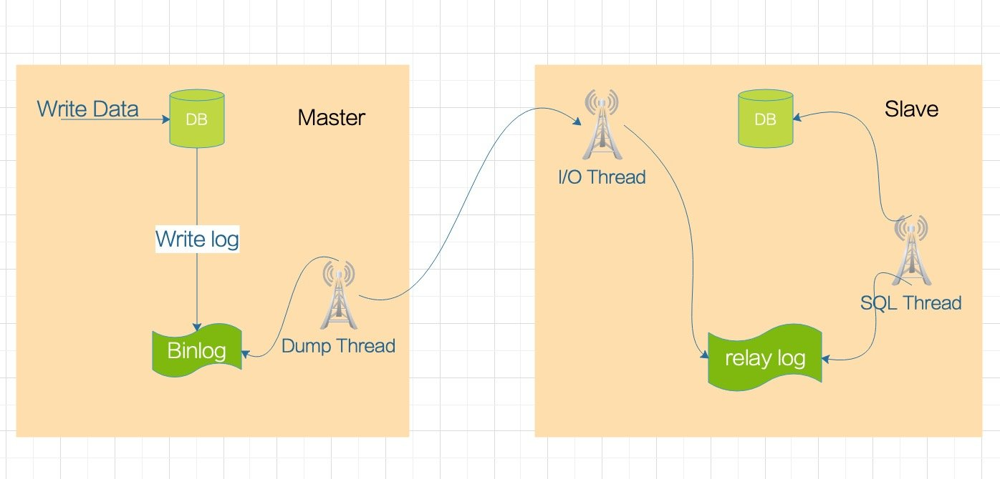

# Mariadb 基本配置


# 安装

配置yum源：

```Ini
# MariaDB 10.6 CentOS repository list - created 2021-12-20 15:31 UTC
# https://mariadb.org/download/
[mariadb]
name = MariaDB
baseurl = https://mirrors.ustc.edu.cn/mariadb/yum/10.6/centos7-amd64
gpgkey=https://mirrors.ustc.edu.cn/mariadb/yum/RPM-GPG-KEY-MariaDB
gpgcheck=1
```

>   repo文件可从这里取到： [Download MariaDB Server - MariaDB.org](https://mariadb.org/download/?t=repo-config&d=CentOS+7+(x86_64)&v=10.6&r_m=xtom_hk)，然后将地址修改到中科大地址

安装：

```Bash
yum install -y MariaDB-server
```

启动：

```Bash
systemctl enable mariadb --now
```

创建管理员帐号：

```Bash
MariaDB [(none)]> grant all on *.* to 'admin'@'%' identified by 'Abc_123456' with grant option;
Query OK, 0 rows affected (0.042 sec)

MariaDB [(none)]> quit
Bye
```

禁用root：

```Bash
mariadb-secure-installation  # 按提示操作即可
```

# 配置

常用配置说明 ：

[MariaDB/MySQL配置文件my.cnf详解 - SegmentFault 思否](https://segmentfault.com/a/1190000021408999)

# 基本使用

[MySQL 管理 | 菜鸟教程 (runoob.com)](https://www.runoob.com/mysql/mysql-administration.html)

创建数据库：

```Go
create database test character set utf8mb4 collate 'utf8mb4_general_ci';
```

创建数据表：

```mysql
create table if not exists student(
  id int not null auto_increment comment '主键自增id',
  name char(10) not null comment '姓名',
  province char(6) not null comment '省',
  city char(10) not null comment '城市',
  addr varchar(100) default '' comment '地址',
  score float not null default 0 comment '成绩',
  enrollment date not null comment '入学时间',
  primary key(id),unique key idx_name(name),
  key idx_location(province,city)
) default charset=utf8mb4 comment '学员基本信息';
```

插入数据：

```mysql
insert into student(name,province,city,enrollment) values
('张三','北京','北京','2021-03-05'),
('李四','河南','郑州','2021-04-05'),
('王五','湖北','武汉','2021-05-05');
```


# Maridb主从配置

主从复制原理篇： 

https://www.cnblogs.com/rickiyang/p/13856388.html

[附录1：Maridb组从复制原理](C:\Users\WangZhenDong\Desktop\Typora笔记\互联网架构\高性能web实战\附录1：Mariadb主从复制原理.md)



master节点配置文件：

```Ini
# /etc/my.cnf.d/server.cnf
[mysqld]
character-set-server=utf8
collation-server=utf8_general_ci
server_id = 131    #  一组主从组里的每个id必须是唯一值。推荐用ip位数
log-bin= mysql-bin # 二进制日志，后面指定存放位置。如果只是指定名字，默认存放在/var/lib/mysql下
lower_case_table_names=1 # 不区分大小写
binlog-format=ROW    # 二进制日志文件格式
log-slave-updates=True    # slave更新是否记入日志
sync-master-info=1    # 值为1确保信息不会丢失
slave-parallel-threads=3 #同时启动多少个复制线程，最多与要复制的数据库数量相等即可
binlog-checksum=CRC32    # 效验码
master-verify-checksum=1    # 启动主服务器效验
slave-sql-verify-checksum=1   # 启动从服务器效验
```

slave节点配置文件：

```Ini
# /etc/my.cnf.d/server.cnf
[mysqld]
character-set-server=utf8
collation-server=utf8_general_ci
server_id=132
log-bin= mysql-bin #log-bin是二进制文件
relay_log = relay-bin    # 中继日志, 后面指定存放位置。如果只是指定名字，默认存放在/var/lib/mysql下
lower_case_table_names=1
```

重启master和slave：

```Bash
systemctl restart mariadb
```

master上的配置：

```Bash
MariaDB [(none)]> grant replication slave, replication client on *.* to 'repl'@'%' identified by 'replpass';
Query OK, 0 rows affected (0.022 sec)

MariaDB [(none)]> show master status;
+------------------+----------+--------------+------------------+
| File             | Position | Binlog_Do_DB | Binlog_Ignore_DB |
+------------------+----------+--------------+------------------+
| mysql-bin.000002 |     1625 |              |                  |
+------------------+----------+--------------+------------------+
1 row in set (0.012 sec)

MariaDB [(none)]> select binlog_gtid_pos('mysql-bin.000002', 1625);
+-------------------------------------------+
| binlog_gtid_pos('mysql-bin.000002', 1625) |
+-------------------------------------------+
| 0-131-6                                   |
+-------------------------------------------+
1 row in set (0.011 sec)
```

slave上的配置：

```Bash
MariaDB [(none)]> set global gtid_slave_pos='0-131-6';
Query OK, 0 rows affected, 1 warning (0.243 sec)

MariaDB [(none)]> change master to master_host='10.1.56.85',master_user='repl',master_password='replpass',master_use_gtid=slave_pos;
Query OK, 0 rows affected (0.546 sec)

MariaDB [(none)]> start slave;
Query OK, 0 rows affected (0.147 sec)
```

验证slave状态：

```Bash
MariaDB [(none)]> show slave status\G
*************************** 1. row ***************************
                Slave_IO_State: Waiting for master to send event
                   Master_Host: 192.168.129.147
                   Master_User: repl
                   Master_Port: 3306
                 Connect_Retry: 60
               Master_Log_File: mysql-bin.000002
           Read_Master_Log_Pos: 1956
                Relay_Log_File: relay-bin.000002
                 Relay_Log_Pos: 1001
         Relay_Master_Log_File: mysql-bin.000002
              Slave_IO_Running: Yes
             Slave_SQL_Running: Yes
             ...
```

gtid的介绍： https://blog.csdn.net/HD243608836/article/details/109578131