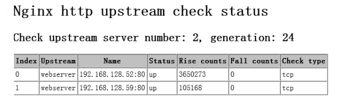

nginx官方网站：[nginx.org](http://nginx.org)

# 安装nginx

## 1. 安装nginx

```YAML
#安装相关软件包 
yum -y groupinstall "Development Tools" 
groupadd -g 500 www
useradd -u 500 -M -s /sbin/nologin www
tar xzvf nginx-1.21.2.tar.gz 
cd nginx-1.21.2 
./configure  --prefix=/usr/local/nginx \
--user=www --group=www \
--with-stream \
--with-http_ssl_module \
--with-http_stub_status_module \
--with-http_addition_module \
--with-http_gzip_static_module \
--with-pcre=../pcre-8.45 \ # 需要提前下载好模块包
--add-module=../nginx_upstream_check_module \ # 需要提前下载好模块包
--add-module=../nginx_ajp_module \ # 需要提前下载好模块包
--add-module=../ngx_cache_purge # 需要提前下载好模块包
make && make install 
```

## 2. 安装淘宝开源的tengine

tengine 官方地址：http://tengine.taobao.org/download.html

```YAML
# 安装
./configure --prefix=/usr/local/nginx
            --with-pcre=/root/pcre-8.45 \
            --group=nginx --user=nginx \
            --with-http_stub_status_module \
            --with-http_ssl_module \
            --with-stream \
            --with-http_realip_module \
            --add-modules=modules/ngx_http_upstream_check_module

make && make install
```

## 3. 平滑升级

```Bash
#按照原来的配置进行重配置，如果要加上新的模块，也可以一并加上

./configure --prefix=/usr/local/nginx
            --with-pcre=/root/pcre-8.45 \
            --group=nginx --user=nginx \
            --with-http_stub_status_module \
            --with-http_ssl_module \
            --with-stream \
            --with-http_realip_module \
            --add-modules=modules/ngx_http_upstream_check_module
make    #不要make install

#编译完，在objs目录下有个nginx可执行文件，将其cp到/usr/local/nginx/sbin/目录中

mv /usr/local/nginx/sbin/nginx /usr/local/nginx/sbin/nginx.old    #备份原文件

cp ./objs/nginx /usr/local/nginx/sbin/    #cp新文件

#检测nginx配置文件

nginx -t

#执行以下命令，让nginx把nginx.pid改成nginx.pid.oldbin 跟着启动新的nginx

kill -USR2 `cat /usr/local/nginx/logs/nginx.pid`

#退出旧的nginx

kill -QUIT `cat /usr/local/nginx/logs/nginx.pid.oldbin`

升级完成
```

## 4. nginx的启停操作

```Bash
# 启动服务：

/usr/local/nginx/sbin/nginx

# 重载配置：

killall -s HUP nginx

nginx -s reload

# 退出进程：

killall -s QUIT nginx
```

nginx支持的几种信号：

-   TERM,INT    快速关闭
-   QUIT        从容关闭
-   HUP        平滑重启，重载配置
-   USR1        重新打开日志文件，用于日志切割
-   USR2        平滑升级可执行程序
-   WINCH    从容关闭工作进程

# 基本配置

## 1. 全局配置

全局生效，主要设置nginx的启动用户/组，启动的工作进程数量，Nginx的PID路径，日志路径等。

```Bash
user nginx nginx;    #运行用户和组

error_log logs/error.log;    #错误日志文件的位置

pid logs/nginx.pid;            #PID文件的位置

worker_processes  1;   #定义nginx启动的工作进程数，建议与cpu核心数相同

worker_cpu_affinity auto;   #定义cpu的姻亲关系

worker_rlimit_nofile  65535;  #定义nginx允许打开的最大文件描述符
```

## 2. I/O事件配置

```Bash
events {
  use epoll; #使用epoll模型
  worker_connections 4096; #每进程处理4096个连接
}
```

## 3. HTTP配置

http块是Nginx服务器配置中的重要部分，缓存、代理和日志格式定义等绝大多数功能和第三方模块都可以在这设置，http块可以包含多个server块，而一个server块中又可以包含多个location块，server块可以配置文件引入、MIME-Type定义、日志自定义、是否启用sendfile、连接超时时间和单个链接的请求上限等。

```Bash
http {

  #文件扩展名与文件类型映射表
  include mime.types; 
  
  #默认文件类型
  default_typeapplication/octet-stream;
  
  #定义日志格式
  log_format main '$remote_addr - $remote_user [$time_local] "$request" '
  '$status $body_bytes_sent "$http_referer" '
  '"$http_user_agent" "$http_x_forwarded_for" '; 
  
  #访问日志位置
  access_log logs/access.log main;
  
  #用户空间与内核空间的缓冲区  
  sendfile on; 
  
  #连接保持超时   
  keepalive_timeout 65; 
  
  #启用压缩  
  gzip    on;
  
  #在http响应头中隐藏nginx版本 
  server_tokens off; 
  
  #服务器名字的hash表大小 
  server_names_hash_bucket_size 128;
  
  #客户端请求的头部缓冲区大小 
  client_header_buffer_size 32k;
  
  #设定客户端请求的最大的头部缓冲区大小 
  large_client_header_buffers 4 64k;
  
  #设定客户端上传文件大小 
  client_max_body_size 8m; 
  
  #开启目录列表访问，合适下载服务器，默认关闭。 
  autoindex on;
  
  #防止网络阻塞 
  tcp_nopush on; 
  tcp_nodelay on;
}
```

## 4. web服务的监听配置

```Bash
server { 
  #监听地址及端口,默认解析地址 
  listen 80 default_server; 

  #网站名称 
  server_name www.yanruogu.com

 #网页的默认字符集 
  charset utf-8;

  #根目录配置 
  location / {
  #网页根目录的位置 
  root html;
  #默认首页 
  index index.html index.php; 
  }

  #定义错误优雅显示
  error_page 500 501 502 503 504 [http://err.tmall.com/error2.html;](http://err.tmall.com/error2.html;)
  error_page 400 403 404 405 408 410 411 412 413 414 [http://err.tmall.com/error1.html;](http://err.tmall.com/error1.html;)

  #错误页面配置 
  location = /50x.html { 
    root html;
  }

  #访问位置为/status
  location ~ /status { 
    #打开状态统计功能 
    stub_status on;
    #关闭此位置的日志记录 
    access_log off; 
  }

}
```

>   打开nginx的访问状态统计必须启用--with-http_stub_status_module模块

## 5. 用户认证配置

这里使用htpasswd工具所生成的用户名密码作为用户认证的来源

```Bash
htpasswd -cd /usr/local/nginx/conf/.auth admin

htpasswd -d /usr/local/nginx/conf/.auth breeze 

vim /usr/local/nginx/conf/vhost/www.conf 

server { 

  listen   80; 

  server_name [www.andy.com](http://www.andy.com); 

  index  index.html index.htm; 

  root /www; 

  location / { 

  auth_basic "test"; 

  auth_basic_user_file /usr/local/nginx/conf/.auth; 

  }

}
```

## 6. 配置https

生成自签名证书：

```Bash
# 建立存放https证书的目录 

mkdir -pv /usr/local/nginx/conf/.sslkey 

# 生成网站私钥文件 

cd /usr/local/nginx/conf/.sslkey 

openssl genrsa -out https.key 1024 

# 生存网站证书文件,需要注意的是在生成的过程中需要输入一些信息根据自己的需要输入,但Common Name 项输入的必须是访问网站的FQDN 

openssl req -new -x509 -key https.key -out https.crt 

# 为了安全起见,将存放证书的目录权限设置为400 

chmod -R 400 /usr/local/nginx/conf/.sslkey 
```

修改nginx配置文件如下：

```Bash
server { 

  listen   443; 

  server_name www.breezey.top

  index  index.html index.htm; 

  root /www; 

  ssl                 on; 

  ssl_protocols       SSLv3 TLSv1 TLSv1.1 TLSv1.2; 

  ssl_ciphers         AES128-SHA:AES256-SHA:RC4-SHA:DES-CBC3-SHA:RC4-MD5; 

  ssl_certificate     /usr/local/nginx/conf/.sslkey/https.crt; 

  ssl_certificate_key /usr/local/nginx/conf/.sslkey/https.key; 

  ssl_session_cache   shared:SSL:10m; 

  ssl_session_timeout 10m; 

}
```


# nginx负载均衡算法

-   **轮询（默认）**：每个请求按时间顺序逐一分配到不同的后端服务器，如果后端服务器down掉，能自动剔除
-   **ip_hash**：每个请求按访问IP的hash结果分配，这样每个访客固定访问一个后端服务器，可解决session共享的问题
-   **least_conn**： 最少连接
-   **fair(第三方)**：按后端服务器的响应时间来分配请求，响应时间短的优先分配
-   **url_hash(第三方)**：按访问url的hash结果来分配请求，使每个url定向到同一个后端服务器，后端服务器为缓存时比较有效
-   **sticky**：会话粘性。参考：http://www.ttlsa.com/nginx/nginx-modules-nginx-sticky-module/

# 负载均衡配置示例

## 1. 安装健康检查模块

nginx_upstream_check_module用于配置nginx对后端server的主动检查

```Bash
git clone https://github.com/yaoweibin/nginx_upstream_check_module
patch -p1 < nginx_upstream_check_module/check_1.20.1+.patch
./configure --add-module=./nginx_upstream_check_module
```

>   如果使用tengine，则不需要单独下载该模块，在tengine的源码目录的modules目录中存放有该模块

## 2. 配置文件

```Bash
http {
    upstream myserver {
        ip_hash;
        server 192.168.1.1:80 weight=1 max_fails=2 fail_timeout=30s;        
server 192.168.1.3:80 weight=1 max_fails=2 fail_timeout=30s down;
        server 192.168.1.4:80 weight=1 max_fails=2 fail_timeout=30s backup;
        check interval=3000 rise=2 fall=5 timeout=1000 type=http;
        check_http_send "GET / HTTP/1.0\r\n\r\n";
        check_http_expect_alive http_2xx http_3xx;
    }

    upstream cluster2 {
        server 192.168.0.3:80;
        server 192.168.0.4:80;
        check interval=3000 rise=2 fall=5 timeout=1000 type=http;
        check_keepalive_requests 100;
        check_http_send "GET / HTTP/1.1\r\nConnection: keep-alive\r\n\r\n";
        check_http_expect_alive http_2xx http_3xx;
    }    
    server {
        listen 80;
        location / {
            proxy_pass http://myserver           #将请求转发给upstream中定义好的服务器
            proxy_next_upstream http_502 http_504 error timeout invalid_header;    #如果后端的服务器返回502、504、执行超时等错误，自动将请求转发到upstream负载均衡池中的另一台服务器
            proxy_set_header Host $host;
            proxy_set_header X-Real-IP $remote_addr;    #检测客户端真实IP
            proxy_set_header X-Forwarded-For $remote_addr;    #将客户端请求的IP返回给后端服务器
            proxy_set_header X-Forwarded-For $proxy_add_x_forwarded_for;     #将客户端请求的IP返回给后端服务器     
            proxy_set_header X-Forwarded-Proto $scheme;    #将前端请求的协议加入到头部，转发至后端，如果反向代理的后端为https应用，则很有用。
            #proxy_pass_header X-Forwarded-Proto;    #如果该nginx作为反向代理后端的web应用，而该nginx前端还有反向代理时，如果要将上游服务器配置的$scheme透传到最后端的web应用，则需要在中间代理层使用该项配置以将前端的$scheme传递到后端。
            proxy_pass_request_headers on;
        } 
        location /2 {
            proxy_pass http://cluster2;
        }
        location /status {
            check_status;
            access_log   off;
            allow SOME.IP.ADD.RESS;
            deny all;
        }
    }
}
```

## 3. 配置参数说明

-   weight: 默认为1，weight越大，负载的权重就越大

-   max_fails: 允许请求失败的次数，默认为1，当超过最大次数时，返回proxy_next_upstream模块定义的错误

-   fail_timeout: max_fails次失败后，暂停的时间

-   down: 表示当前的server暂时不参与负载

-   backup：当其他所有非backup机器down或者忙的时候，请求backup机器，所以这台机器压力会最轻

-   check：

    -   interval：向后端发送的健康检查包的间隔。
    -   fall(fall_count): 如果连续失败次数达到fall_count，服务器就被认为是down。
    -   rise(rise_count): 如果连续成功次数达到rise_count，服务器就被认为是up。
    -   timeout: 后端健康请求的超时时间。
    -   default_down: 设定初始时服务器的状态，如果是true，就说明默认是down的，如果是false，就是up的。默认值是true，也就是一开始服务器认为是不可用，要等健康检查包达到一定成功次数以后才会被认为是健康的。
    -   type：健康检查包的类型，现在支持以下多种类型
    -   tcp：简单的tcp连接，如果连接成功，就说明后端正常。
    -   ssl_hello：发送一个初始的SSL hello包并接受服务器的SSL hello包。
    -   http：发送HTTP请求，通过后端的回复包的状态来判断后端是否存活。
    -   mysql: 向mysql服务器连接，通过接收服务器的greeting包来判断后端是否存活。
    -   ajp：向后端发送AJP协议的Cping包，通过接收Cpong包来判断后端是否存活。
    -   port: 指定后端服务器的检查端口。你可以指定不同于真实服务的后端服务器的端口，比如后端提供的是443端口的应用，你可以去检查80端口的状态来判断后端健康状况。默认是0，表示跟后端server提供真实服务的端口一样。该选项出现于Tengine-1.4.0。

    默认值：

```Bash
interval=3000 fall=5 rise=2 timeout=1000 default_down=true type=tcp
```

-   check_keepalive_requests：配置一个连接发送的请求数，默认值为1，表示完成一次请求后即关闭连接
-   check_http_send：配置http健康检查包发送的请求内容，当采用长连接进行健康检查时，需在该指令中添加keep-alive请求头，如："GET / HTTP/1.1\r\nConnection: keep-alive\r\n\r\n"。同时，请求uri的size不宜过大，确保可以在1个interval内传输完成，否则会被健康检查模块视为后端服务器或网络异常。默认值为："GET / HTTP/1.0\r\n\r\n"
-   check_http_expect_alive：指定http回复的成功状态，默认值为http_2xx | http_3xx
-   check_shm_size：所有的后端服务器健康检查状态都存于共享内存中，该指令可以设置共享内存的大小。默认是1M，如果你有1千台以上的服务器并在配置的时候出现了错误，就可能需要扩大该内存的大小。需要配置在http块中
-   check_status：需要配置在location块中。用于显示服务器的健康状态页面。有三个选项，分别为html，csv，json。默认类型是html。

## 4. 负载均衡状态



-   server number是后端服务器的数量，
-   generation是Nginx reload的次数。
-   Index是服务器的索引，
-   Upstream是在配置中upstream的名称，
-   Name是服务器IP，
-   Status是服务器的状态，
-   Rise是服务器连续检查成功的次数，
-   Fall是连续检查失败的次数，
-   Check type是检查的方式，
-   Check port是后端专门为健康检查设置的端口。

# 利用反向代理实现读写分离

配置示例：

```Bash
upstream rwsplit {
  server 192.168.1.1;
  server 192.168.1.2;

}

server {

  location / {
    proxy_pass http://rwsplit
    if ($request_method = "PUT") {
      proxy_pass http://192.168.1.1
    }
  }

}
```