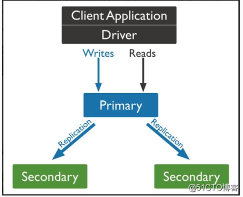
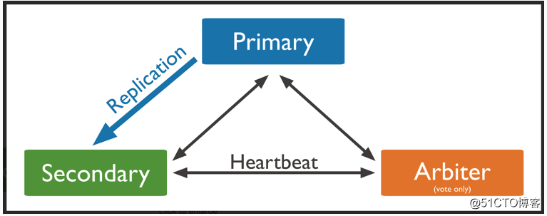
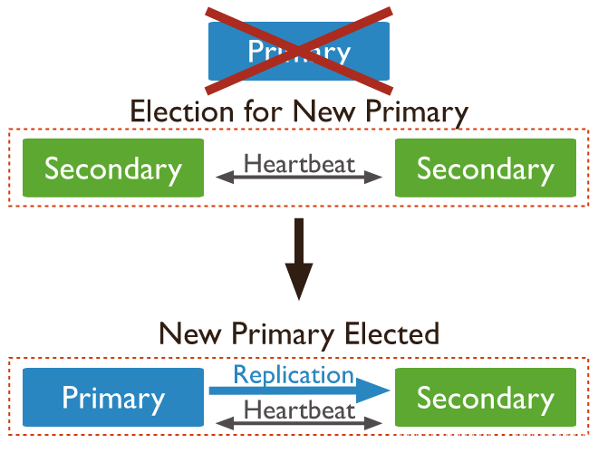

# mongoDB简介

MongoDB是一个介于关系数据库和非关系数据库之间的产品，是非关系数据库当中功能最丰富，最像关系数据库的，它是一个面向集合的，模式自由的文档型数据库。

-   面向集合：意思是数据被分组存储在数据集中，被称为一个集合。类似于关系数据库的的表，不同的是它不需要定义任何模式。
-   模式自由：集合里面没有列和行的概念。{"name":"mongo"} {"age”：25} 这两个记录就可以存在同一个集合里面。
-   文档型：意思是存储的数据是键-值对的集合，键是字符串，值可以是数据类型集合里的任意类型，包括数组和文档，每个文档相当于关系数据库中的一条记录。

MongoDB特性：

-   面向集合存储，易于存储对象类型的数据。
-   模式自由
-   支持动态查询
-   支持完全索引，包含内部对象
-   支持复制和故障恢复
-   使用高效的二进制数据存储，包括大型对象（如视频等）
-   自动处理碎片，以支持云计算层次的扩展性
-   文件存储格式为BSON（一种JSON的扩展）

# MongoDB安装

```
# /etc/yum.repos.d/mongodb.repo
[mongodb-org]
name=MongoDB Repository
baseurl=https://mirrors.tuna.tsinghua.edu.cn/mongodb/yum/el$releasever/
gpgcheck=0
enabled=1

yum install -y mongodb-org-server mongodb-org
```

启动：

```
mongod -f /etc/mongod.conf
```

mongodb的配置文件示例：

```YAML
systemLog:
   # verbosity: 0  #日志等级，0-5，默认0
   # quiet: false  #限制日志输出，
   # traceAllExceptions: true  #详细错误日志
   # syslogFacility: user #记录到操作系统的日志级别，指定的值必须是操作系统支持的，并且要以--syslog启动
   path: /var/log/mongo.log  #日志路径。
   logAppend: false #启动时，日志追加在已有日志文件内还是备份旧日志后，创建新文件记录日志, 默认false
   logRotate: rename #rename/reopen。rename，重命名旧日志文件，创建新文件记录；reopen，重新打开旧日志记录，需logAppend为true
   destination: file #日志输出方式。file/syslog,如果是file，需指定path，默认是输出到标准输出流中
   timeStampFormat: iso8601-local #日志日期格式。ctime/iso8601-utc/iso8601-local, 默认iso8601-local
   # component: #各组件的日志级别
   #    accessControl:
   #       verbosity: <int>
   #    command:
   #       verbosity: <int>

processManagement:
   fork: true #以守护进程运行 默认false
   # pidFilePath: <string> #PID 文件位置

net:
   port: 27017 #监听端口，默认27017
   bindIp: 127.0.0.1 #绑定监听的ip，deb和rpm包里有默认的配置文件(/etc/mongod.conf)里面默认配置为127.0.0.1,若不限制IP，务必确保认证安全，多个Ip用逗号分隔
   maxIncomingConnections: 65536 #最大连接数，可接受的连接数还受限于操作系统配置的最大连接数
   wireObjectCheck: true #校验客户端的请求，防止错误的或无效BSON插入,多层文档嵌套的对象会有轻微性能影响,默认true
   ipv6: false #是否启用ipv6,3.0以上版本始终开启
   unixDomainSocket: #unix socket监听，仅适用于基于unix的系统
      enabled: false #默认true
      pathPrefix: /tmp #路径前缀，默认/temp
      filePermissions: 0700 #文件权限 默认0700
   http: #警告 确保生产环境禁用HTTP status接口、REST API以及JSON API以防止数据暴露和漏洞攻击
      enabled: false #是否启用HTTP接口、启用会增加网络暴露。3.2版本后停止使用HTTP interface
      JSONPEnabled: false #JSONP的HTTP接口
      RESTInterfaceEnabled: false #REST API接口
   # ssl: #估计用不到，所以没有自己看
   #    sslOnNormalPorts: <boolean>  # deprecated since 2.6
   #    mode: <string>
   #    PEMKeyFile: <string>
   #    PEMKeyPassword: <string>
   #    clusterFile: <string>
   #    clusterPassword: <string>
   #    CAFile: <string>
   #    CRLFile: <string>
   #    allowConnectionsWithoutCertificates: <boolean>
   #    allowInvalidCertificates: <boolean>
   #    allowInvalidHostnames: <boolean>
   #    disabledProtocols: <string>
   #    FIPSMode: <boolean>

security:
   authorization: enabled # enabled/disabled #开启客户端认证
   javascriptEnabled:  true #启用或禁用服务器端JavaScript执行
   # keyFile: <string> #密钥路径
   # clusterAuthMode: <string> #集群认证方式
   # enableEncryption: <boolean>
   # encryptionCipherMode: <string>
   # encryptionKeyFile: <string>
   # kmip:
   #    keyIdentifier: <string>
   #    rotateMasterKey: <boolean>
   #    serverName: <string>
   #    port: <string>
   #    clientCertificateFile: <string>
   #    clientCertificatePassword: <string>
   #    serverCAFile: <string>
   # sasl:
   #    hostName: <string>
   #    serviceName: <string>
   #    saslauthdSocketPath: <string>
   

# setParameter: #设置参数
#    <parameter1>: <value1>
#    <parameter2>: <value2>

storage:
   dbPath: /data/mongo #数据库，默认/data/db,如果使用软件包管理安装的查看/etc/mongod.conf
   indexBuildRetry: true #重启时，重建不完整的索引
   # repairPath: <string>  #--repair操作时的临时工作目录，默认为dbPath下的一个_tmp_repairDatabase_<num>的目录
   journal: 
      enabled: true #启动journal,64位系统默认开启，32位默认关闭
      # commitIntervalMs: <num> #journal操作的最大时间间隔，默认100或30
   directoryPerDB: false #使用单独的目录来存储每个数据库的数据,默认false,如果需要更改，要备份数据，删除掉dbPath下的文件，重建后导入数据
   # syncPeriodSecs: 60 #使用fsync来将数据写入磁盘的延迟时间量,建议使用默认值
   engine: wiredTiger #存储引擎，mmapv1/wiredTiger/inMemory 默认wiredTiger
   # mmapv1:
   #    preallocDataFiles: <boolean>
   #    nsSize: <int>
   #    quota:
   #       enforced: <boolean>
   #       maxFilesPerDB: <int>
   #    smallFiles: <boolean>
   #    journal:
   #       debugFlags: <int>
   #       commitIntervalMs: <num>
   # wiredTiger:
   #    engineConfig:
   #       cacheSizeGB: <number>  #缓存大小
   #       journalCompressor: <string> #数据压缩格式 none/snappy/zlib
   #       directoryForIndexes: <boolean> #将索引和集合存储在单独的子目录下，默认false
   #    collectionConfig:
   #       blockCompressor: <string> #集合数据压缩格式 
   #    indexConfig:
   #       prefixCompression: <boolean> #启用索引的前缀压缩
   # inMemory:
   #    engineConfig:
   #       inMemorySizeGB: <number>
 
operationProfiling: #性能分析
   slowOpThresholdMs: 100 #认定为查询速度缓慢的时间阈值，超过该时间的查询即为缓慢查询，会被记录到日志中, 默认100
   mode: off #operationProfiling模式 off/slowOp/all 默认off

# replication: #复制集相关
#    oplogSizeMB: <int>
#    replSetName: <string>
#    secondaryIndexPrefetch: <string>
#    enableMajorityReadConcern: <boolean>
# sharding: #集群分片相关
#    clusterRole: <string>
#    archiveMovedChunks: <boolean>

# auditLog:
#    destination: <string>
#    format: <string>
#    path: <string>
#    filter: <string>

# snmp:
#    subagent: <boolean> #当设置为true，SNMP作为代理运行
#    master: <boolean> #当设置为true，SNMP作为主服务器运行

# basisTech:
#    rootDirectory: <string>
```


# MongoDB基本使用

参考： https://www.runoob.com/mongodb


# 用户角色

MongoDB安装完成后，数据库 admin 中没有任何用户账户。此时，MongoDB 向从本地主机发起的连接提供完整的数据库管理权限。因此配置 MongoDB 新实例时，首先需要创建用户管理员账户和数据库管理员账户：

-   用户管理员账户可在 admin 和其他数据库中创建用户账户。
-   数据库管理员账户，用于管理数据库、集群、复制和 MongoDB 其他方面的超级用户。

用户管理员账户和数据库管理员账户都是在数据库 admin 中创建的。在 MongoDB 服务器中启用身份验证后，要以用户管理员或数据库管理员的身份连接到服务器，必须向 admin 数据库验证身份，您还需在每个数据库中创建用户账户，让这些用户能够访问该数据库。

MongoDB中的用户角色：

-   数据库用户角色：read、readWrite;
-   数据库管理角色：dbAdmin、dbOwner、userAdmin；
-   集群管理角色：clusterAdmin、clusterManager、clusterMonitor、hostManager；
-   备份恢复角色：backup、restore；
-   所有数据库角色：readAnyDatabase、readWriteAnyDatabase、userAdminAnyDatabase、dbAdminAnyDatabase
-   超级用户角色：root
-   内部角色：__system

一些角色的功能说明：

-   read：允许用户读取指定数据库；
-   readWrite：允许用户读写指定数据库；
-   dbAdmin：允许用户在指定数据库中执行管理函数，如索引创建、删除，查看统计或访问system.profile；
-   userAdmin：允许用户向system.users集合写入，可以找指定数据库里创建、删除和管理用户；
-   readWriteAnyDatabase：只在admin数据库中可用，赋予用户所有数据库的读写权限；
-   readAnyDatabase：只在admin数据库中可用，赋予用户所有数据库的读权限；
-   dbAdminAnyDatabase：只在admin数据库中可用，赋予用户所有数据库的dbAdmin权限；
-   clusterAdmin：只在admin数据库中可用，赋予用户所有分片和复制集相关函数的管理权限；
-   userAdminAnyDatabase：只在admin数据库中可用，赋予用户所有数据库的userAdmin权限；
-   root：只在admin数据库中可用。超级账号，超级权限；

# 创建用户

## 创建用户管理员账户

1.  创建用户

```Bash
use admin; 
db.createUser({
  user: "admin",
  pwd: "admin",
  roles: [
  {role: "userAdminAnyDatabase",db: "admin"}
  ]
}
)
```

1.  启用认证

修改/etc/mongod.conf，内容如下：

```Bash
security: 
  authorization: enabled
```

1.  重启mongo后，需要验证：

```Bash
use admin;
db.auth("admin","admin")
```

也可以通过如下方式直接验证：

```Bash
mongo -uadmin -padmin --authenticationDatabase admin
```

## 创建数据库管理员账户

在admin数据库中创建一个数据库管理员账户，为其赋予以下权限，以使其能够访问系统中的所有数据库、创建新的数据库以及管理MongoDB集群和副本集

```Bash
use admin;
db.createUser({
  user: "dbadmin",
  pwd: "dbadmin",
  roles: ["readWriteAnyDatabase","dbAdminAnyDatabase","clusterAdmin"]
})
```

## 创建超级管理员账户

```Bash
use admin;
db.createUser({
  user: "root",
  pwd: "root",
  roles: ["root"]
})
```

## 创建普通用户

用户管理员可以创建用户，但不具备操作数据库的权限；我们可以使用用户管理员在指定的数据库中创建普通用户，并为其赋予针对该数据库的增删改查权限。

```Bash
use test;
db.createUser({
    user: "bernie",
    pwd: "bernie",
    roles: [{role: "readWrite",db: "test"}]
})
```

此时可通过该用户访问test数据库：

```Bash
mongo -ubernie -pbernie --authenticationDatabase test
```

再来看另一个示例：

```Bash
db.createUser({
    user:"natasha",
    pwd:"123456",
    customData:{   # 自定义数据
        name:'natasha',
        email:'natasha@example.com',
        age:18,
    },
    roles:[
        {role:"readWrite",db:"db01"},
        {role:"readWrite",db:"db02"},
        {role: "dbAdmin"}
        'read'// 对其他数据库有只读权限，对db001、db002是读写权限
    ]
})
```

# 查看用户

```Bash
show users;
db.system.users.find()
db.runCommand(usersInfo: "username")
```

# 删除用户

```Bash
use admin 
db.dropUser("test")
```

# 修改用户

## 修改密码

```Bash
# 修改密码
use admin
db.changeUserPassword("username", "xxx")

# 修改密码和用户信息
db.runCommand(
    {
        updateUser:"username",
        pwd:"xxx",
        customData:{title:"xxx"}
    }
)
```

## 修改用户权限

```Bash
db.grantRolesToUser("natasha",[{role: "readWrite", db: "saturn"}])  # 为用户natasha追加权限
db.updateUser("natasha",{roles: [{role: "readWrite",db: "saturn"},{role: "readWrite",db: "runoob"}]}) # 替换原有的权限
db.revokeRolesFromUser("natasha",[{role: "readWrite", db: "saturn"}])
```


# 副本集简介

-   副本集在mongodb中是是一组 mongod保持相同的数据集过程，副本集提供冗余和高可用性，并且是所有生产部署的基础。
-   复制提供冗余并增加数据可用性，在不同数据库服务器上具有多个数据副本，复制可以提供一个级别的单一数据库服务器丢失的容错能力。
-   副本集可以支撑更高的读操作，因为客户端可以向不同的服务器发送读取操作，可以配置在不同的数据中心用作遭难恢复或者报告，备份。
-   副本集成员最多50个，只有7个成员可以参与选举投票，多中心容灾能力，自动恢复，滚动式升级服务

副本集至少需要3个成员，可以是一主两从，也可以是一主一从一仲裁节点





如果主节点挂掉，两个从节点会重新选举，找到一个从节点，将其提升为主：



# 副本集部署

创建KeyFile：

```Bash
mkdir -p /data/mongo
openssl rand -base64 666 > /data/mongo/mongodb.key
chmod 400 /data/mongo/mongodb.key
chown mongod.mongod -R /data/mongo
```

修改mongodb配置文件：

```Bash
systemLog:
  destination: file
  logAppend: true
  path: /var/log/mongodb/mongod.log
storage:
  dbPath: /var/lib/mongo
  journal:
    enabled: true
processManagement:
  fork: true  # fork and run in background
  pidFilePath: /var/run/mongodb/mongod.pid  # location of pidfile
  timeZoneInfo: /usr/share/zoneinfo
net:
  port: 27017
  bindIp: 0.0.0.0  # Enter 0.0.0.0,:: to bind to all IPv4 and IPv6 addresses or, alternatively, use the net.bindIpAll setting.
security:
  authorization: enabled
  keyFile: "/data/mongo/mongodb.key"
  clusterAuthMode: "keyFile"
replication:
  replSetName: "rs0"
  oplogSizeMB: 5000
```

重启mongodb：

```Bash
systemctl restart mongod
```

配置一主两从副本集：

```Bash
use admin; 
cfg={
   _id : "rs0",
   members: [
      { _id: 0, host: "10.1.56.85:27017" },
      { _id: 1, host: "10.1.56.86:27017" },
      { _id: 2, host: "10.1.56.87:27017" }
   ]
}

rs.initiate(cfg)
```

配置一主一从一仲裁副本集：

```Bash
use admin; 
cfg= {
   _id : "rs0",
   members: [
      { _id: 0, host: "10.1.56.85:27017", priority: 2},
      { _id: 1, host: "10.1.56.86:27017", priority: 1},
      { _id: 2, host: "10.1.56.87:27017", arbiterOnly: true }
   ]
}

rs.initiate(cfg)
```

# 副本集管理

## 查看副本集

```Bash
# 查看配置
rs.config()

# 查看副本集状态： 
rs.status()

# 查看master
rs.isMaster()
```

## 管理副本集成员

### 删除成员

1.  在要删除的成员实例上停止数据库实例

```Bash
# 登录至指定节点停止实例
rs0:SECONDARY> use admin;
switched to db admin
rs0:SECONDARY> db.shutdownServer()
server should be down...
```

1.  在master上执行删除操作

```Bash
rs0:PRIMARY> rs.remove("10.1.56.85:27017")
{
        "ok" : 1,
        "$clusterTime" : {
                "clusterTime" : Timestamp(1641217135, 1),
                "signature" : {
                        "hash" : BinData(0,"nhyPvAHXJmE62L0LvIC3J8hAQl8="),
                        "keyId" : NumberLong("7048958896664215556")
                }
        },
        "operationTime" : Timestamp(1641217135, 1)
}
```

1.  检查集群是否正常删除

```Bash
rs.status()
```

### 添加成员

1.  启动mongo并修改相应配置

```Bash
# /etc/mongod.conf配置文件
security:
  authorization: enabled
  clusterAuthMode: "keyFile"
  keyFile: "/data/mongo/mongodb.key"

replication:
  replSetName: "rs0"
  oplogSizeMB: 5000
  
# 如果之前有数据，记得清理
rm -rf /var/lib/mongo/*

# 启动mongo
systemctl start mongod
```

1.  添加成员至副本集

```Bash
# 在主节点执行以下操作
rs0:PRIMARY> rs.add({host: "10.1.56.85:27017", priority: 0, votes: 0})
{
        "ok" : 1,
        "$clusterTime" : {
                "clusterTime" : Timestamp(1641217386, 1),
                "signature" : {
                        "hash" : BinData(0,"KLr++3ulixdXPfZhFFAqMhuZuuM="),
                        "keyId" : NumberLong("7048958896664215556")
                }
        },
        "operationTime" : Timestamp(1641217386, 1)
}
```

1.  重新配置优先级

    一旦新加入的成员已经过渡到 SECONDARY状态，如果需要的话，使用rs.reconfig()更新新添加的成员priority和votes

```Bash
rs0:PRIMARY> var cfg=rs.conf();
rs0:PRIMARY> cfg.members[2].priority = 1
1
rs0:PRIMARY> cfg.members[2].votes = 1
1
rs0:PRIMARY> rs.reconfig(cfg)
{
        "ok" : 1,
        "$clusterTime" : {
                "clusterTime" : Timestamp(1641217534, 1),
                "signature" : {
                        "hash" : BinData(0,"lj6U6EcieJCS5xJ/eAokxptiNfA="),
                        "keyId" : NumberLong("7048958896664215556")
                }
        },
        "operationTime" : Timestamp(1641217534, 1)
}
以上配置完成后，可以再次通过rs.status()查看集群状态
```

# 附录

执行rs.conf()时抛如下异常：

```Bash
rs0:PRIMARY> rs.conf()
uncaught exception: Error: Could not retrieve replica set config: {
        "ok" : 0,
        "errmsg" : "not authorized on admin to execute command { replSetGetConfig: 1.0, lsid: { id: UUID(\"4a7cd439-f949-41dc-acef-2838267a908a\") }, $clusterTime: { clusterTime: Timestamp(1641214558, 1), signature: { hash: BinData(0, D8E6570EDE34381A0866EB5600A32747FE4BD4DB), keyId: 7048958896664215556 } }, $db: \"admin\" }",
        "code" : 13,
        "codeName" : "Unauthorized",
        "$clusterTime" : {
                "clusterTime" : Timestamp(1641214701, 2),
                "signature" : {
                        "hash" : BinData(0,"y18DwhtkerhqWMwPKLy2m8JXsdk="),
                        "keyId" : NumberLong("7048958896664215556")
                }
        },
        "operationTime" : Timestamp(1641214701, 2)
} :
rs.conf@src/mongo/shell/utils.js:1713:11
@(shell):1:1
```

原因：

当前用户权限不够，需要超级管理员权限：

```Bash
use admin
db.grantRolesToUser("admin",[{role: "root", db: "admin"}])
```