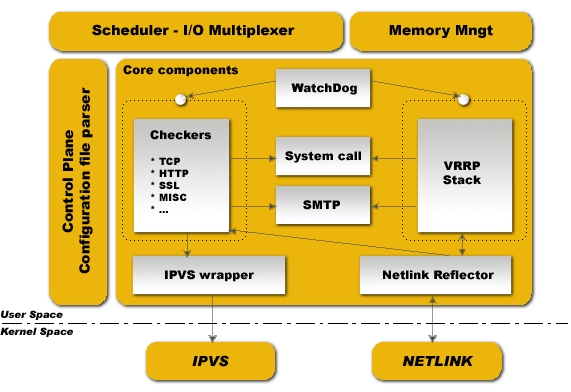

# Keepalived 定义

Keepalived 是一个基于VRRP协议来实现的LVS服务高可用方案，可以利用其来避免单点故障。

一个LVS服务会有2台服务器运行Keepalived，一台为主服务器（MASTER），一台为备份服务器（BACKUP），但是对外表现为一个虚拟IP，主服务器会发送特定的消息给备份服务器，当备份服务器收不到这个消息的时候，即主服务器宕机的时候， 备份服务器就会接管虚拟IP，继续提供服务，从而保证了高可用性。Keepalived通过VRRP协议实现主备切换。


# VRRP 协议

## 简介

在现实的网络环境中，两台需要通信的主机大多数情况下并没有直接的物理连接。对于这样的情况，它们之间路由怎样选择？主机如何选定到达目的主机的下一跳路由，这个问题通常的解决方法有二种：

-   在主机上使用动态路由协议(RIP、OSPF等)
-   在主机上配置静态路由

很明显，在主机上配置动态路由是非常不切实际的，因为管理、维护成本以及是否支持等诸多问题。配置静态路由就变得十分流行，但路由器(或者说默认网关default gateway)却经常成为单点故障。

VRRP的目的就是为了解决静态路由单点故障问题，VRRP通过竞选(election)协议来动态的将路由任务交给LAN中虚拟路由器中的某台VRRP路由器。

## 工作机制

在一个VRRP虚拟路由器中，有多台物理的VRRP路由器，但是这多台的物理的机器并不能同时工作，而是由一台称为MASTER的路由器负责路由工作，其它的都是BACKUP。

MASTER并非一成不变，VRRP让每个VRRP路由器参与竞选，最终获胜的就是MASTER。

MASTER拥有一些特权，比如，拥有虚拟路由器的IP地址，我们的主机就是用这个IP地址作为静态路由的。拥有特权的MASTER要负责转发发送给网关地址的包和响应ARP请求。

VRRP通过竞选协议来实现虚拟路由器的功能，所有的协议报文都是通过IP多播(multicast)包(多播地址224.0.0.18)形式发送的。虚拟路由器由VRID(范围0-255)和一组IP地址组成，对外表现为一个虚拟的MAC地址。所以，在一个虚拟路由器中，不管谁是MASTER，对外都是相同的MAC和IP(称之为VIP)。客户端主机并不需要因为MASTER的改变而修改自己的路由配置，对客户端来说，这种主从的切换是透明的。

在一个虚拟路由器中，只有作为MASTER的VRRP路由器会一直发送VRRP通告信息(VRRPAdvertisement message)，BACKUP不会抢占MASTER，除非它的优先级(priority)更高。当MASTER不可用时(BACKUP收不到通告信息)， 多台BACKUP中优先级最高的这台会被抢占为MASTER。这种抢占是非常快速的(<1s)，以保证服务的连续性。由于安全性考虑，VRRP包使用了加密协议进行加密。

## 工作流程

### 1. 初始化

路由器启动时，如果路由器的优先级是255(最高优先级，路由器拥有路由器地址)，要发送VRRP通告信息，并发送广播ARP。信息通告路由器IP地址对应的MAC地址为路由虚拟MAC，设置通告信息定时器准备定时发送VRRP通告信息，转为MASTER状态；否则进入BACKUP状态，设置定时器检查定时检查是否收到MASTER的通告信息。

### 2. Master

-   设置定时通告定时器；
-   用VRRP虚拟MAC地址响应路由器IP地址的ARP请求；
-   转发目的MAC是VRRP虚拟MAC的数据包；
-   如果是虚拟路由器IP的拥有者，将接受目的地址是虚拟路由器IP的数据包，否则丢弃；
-   当收到shutdown的事件时删除定时通告定时器，发送优先权级为0的通告包，转初始化状态；
-   如果定时通告定时器超时时，发送VRRP通告信息；
-   收到VRRP通告信息时，如果优先权为0，发送VRRP通告信息；否则判断数据的优先级是否高于本机，或相等而且实际IP地址大于本地实际IP，设置定时通告定时器，复位主机超时定时器，转BACKUP状态；否则的话，丢弃该通告包；

### 3. Backup

-   设置主机超时定时器；
-   不能响应针对虚拟路由器IP的ARP请求信息；
-   丢弃所有目的MAC地址是虚拟路由器MAC地址的数据包；
-   不接受目的是虚拟路由器IP的所有数据包；
-   当收到shutdown的事件时删除主机超时定时器，转初始化状态；
-   主机超时定时器超时的时候，发送VRRP通告信息，广播ARP地址信息，转MASTER状态；
-   收到VRRP通告信息时，如果优先权为0，表示进入MASTER选举；否则判断数据的优先级是否高于本机，如果高的话承认MASTER有效，复位主机超时定时器；否则的话，丢弃该通告包；

## ARP查询处理

当内部主机通过ARP查询虚拟路由器IP地址对应的MAC地址时，MASTER路由器回复的MAC地址为虚拟的VRRP的MAC地址，而不是实际网卡的 MAC地址，这样在路由器切换时让内网机器觉察不到；而在路由器重新启动时，不能主动发送本机网卡的实际MAC地址。如果虚拟路由器开启了ARP代理 (proxy_arp)功能，代理的ARP回应也回应VRRP虚拟MAC地址

# keepalived组成

keepalived主要有三个模块：

-   core：keepalived的核心，负责主进程的启动、维护以及全局配置文件的加载和解析
-   check：负责健康检查，包括常见的各种检查方式
-   vrrp：用于实现vrrp协议




# 安装

```Bash
wget https://breezey-public.oss-cn-zhangjiakou.aliyuncs.com/softwares/linux/mall/keepalived-2.2.4.tar.gz
tar xf keepalived-2.2.4
cd keepalived-2.2.4
./configure --prefix=/usr/local/keepalived --sysconf=/etc
make && make install
```

# 配置说明

## 全局模块定义

```Bash
! Configuration File for keepalived

global_defs {
   notification_email {
     acassen@firewall.loc
     failover@firewall.loc
     sysadmin@firewall.loc
   }
   notification_email_from Alexandre.Cassen@firewall.loc
   smtp_server 192.168.200.1
   smtp_connect_timeout 30
   router_id LVS_DEVEL
   vrrp_skip_check_adv_addr
   vrrp_strict
   vrrp_garp_interval 0
   vrrp_gna_interval 0
}
```

配置项说明：

-   notification_email：指定当keepalived出现问题时，发送邮件给哪些用户
-   notification_emai_from：发送邮件时，邮件的来源地址
-   smtp_server <DOMAIN|IP> [<PORT>]：smtp服务器的地址或域名。默认端口为25。如：smtp_server [smtp.felix.com](http://smtp.felix.com) 25
-   smtp_connect_timeout：指定smtp服务器连接的超时时间。单位是秒
-   router_id：指定标识该机器的route_id
-   vrrp_garp_interval ：在一个接口发送的两个免费ARP之间的延迟。可以精确到毫秒级（0.001表示1ms）。默认是0
-   vrrp_skip_check_adv_addr：默认keepalived检查收到的VRRP通告中的所有地址，设置此命令的意思是，如果通告与接收的上一个通告来自相同的master路由器，则不执行检查(跳过检查)。
-   vrrp_strict：严格遵守VRRP协议。如果有以下情况，建议关闭该配置项，否则keepalived无法地正常启动：
    -   没有VIP地址
    -   使用单播
    -   在VRRP版本2中有IPv6地址

## VRRPD配置

VRRPD配置包括如下子块：

-   vrrp_script
-   vrrp_sync_group
-   garp_group
-   vrrp_instance

### vrrp_script配置

添加一个周期性执行的脚本用于做健康检查。下面是一个配置示例：

```Bash
vrrp_script chk_haproxy {
  script "/opt/check_haproxy.sh"
  interval 2
  weight 2
}
```

配置说明：

-   scrip "/path/to/somewhere"：指定要执行的脚本的路径
-   interval <INTEGER>：指定脚本执行的间隔。单位是秒。默认为1s。
-   timeout <INTEGER>：指定在多少秒后，脚本被认为执行失败。
-   weight <-254 --- 254>：调整优先级。默认为2：
    -   如果脚本执行成功(退出状态码为0)，weight大于0，则priority增加。
    -   如果脚本执行失败(退出状态码为非0)，weight小于0，则priority减少。
    -   其他情况下，priority不变
-   rise <INTEGER>：执行成功多少次才认为是成功。
-   fall <INTEGER>：执行失败多少次才认为失败。
-   user <USERNAME> [GROUPNAME]：运行脚本的用户和组。
-   init_fail：假设脚本初始状态是失败状态。

### vrrp_instance配置

vrrp_instance用来定义对外提供服务的VIP区域及其相关属性。下面是一个配置示例

```Bash
vrrp_instance VI_1 {
    state MASTER
    interface eth0
    mcast_src_ip 192.168.100.1
    virtual_router_id 51
    priority 100
    advert_int 1
    authentication {
        auth_type PASS
        auth_pass 12345678
    }
    virtual_ipaddress {
        10.210.214.253/24 brd 10.210.214.255 dev eth0
        192.168.1.11/24 brd 192.168.1.255 dev eth1
    }
    virtual_routes {
        172.16.0.0/12 via 10.210.214.1
        192.168.1.0/24 via 192.168.1.1 dev eth1
        default via 202.102.152.1
    }
    track_script {
        chk_haproxy 
    }
    nopreempt
    preempt_delay 300
    debug
    notify_master <STRING>|<QUOTED-STRING>
    notify_backup <STRING>|<QUOTED-STRING>
    notify_fault <STRING>|<QUOTED-STRING>
    notify <STRING>|<QUOTED-STRING>
    smtp_alert
}
```

配置项说明：

-   state MASTER|BACKUP：指定该keepalived节点的初始状态。
-   interface eth0：vrrp实例绑定的接口，用于发送VRRP包。
-   track_script：指定vrrp_script中配置的脚本名称
-   mcast_src_ip <IPADDR>：指定发送组播数据包的源IP地址。默认是绑定VRRP实例的接口的主IP地址。
-   unicast_src_ip <IPADDR>：指定发送单薄数据包的源IP地址。默认是绑定VRRP实例的接口的主IP地址。
-   unicast_peer：采用单播的方式发送VRRP通告，指定单播邻居的IP地址。示例：

```Bash
unicats_peer {
  192.168.100.2
  192.168.100.3
}
```

-   virtual_router_id 51：指定VRRP实例ID，范围是0-255.
-   priority 100：指定优先级，优先级高的将成为MASTER。
-   advert_int 1：指定发送VRRP通告的间隔。单位是秒。
-   authentication：配置主备节点之间的认证信息
-   virtual_ipaddr： 配置vip地址，示例：

```Bash
virtual_ipaddress {
  <IPADDR>/<MASK> brd <IPADDR> dev <STRING> scope <SCOPE> label <LABEL>
  192.168.200.17/24 dev eth1
  192.168.200.18/24 dev eth2 label eth2:1
}
```

-   nopreempt：设置为不抢占。默认是抢占的，当高优先级的机器恢复后，会抢占低优先级的机器成为MASTER，而不抢占，则允许低优先级的机器继续成为MASTER，即使高优先级的机器已经上线。如果要使用这个功能，则初始化状态必须为BACKUP。
-   preempt_delay：设置抢占延迟。单位是秒，范围是0---1000，默认是0.发现低优先级的MASTER后多少秒开始抢占。

**配置通知**：

Keepalived在发生状态转换时，可以调用脚本执行相应的操作。常用的选项如下：

-   notify_master：当当前节点成为master时，通知脚本执行任务
-   notify_backup:当当前节点成为backup时，通知脚本执行任务
-   notify_fault：当当前节点出现故障，执行的任务;
-   notify_stop：当当前节点keepalived停止时，执行的任务
-   notify表示只要状态切换都会调用的脚本，并且该脚本是在以上脚本执行之后再调用的，另外，如果使用notify时，还会自动传入以下四个参数：
    -   $1 = "GROUP"|"INSTANCE"
    -   $2 = name of the group or instance
    -   $3 = target state of transition ("MASTER"|"BACKUP"|"FAULT")
    -   $4 = priority value

下面是一个示例：

```Bash
    notify_master "/notify_master.sh"
    notify_backup "/notify_backup.sh"
    notify_fault "/notify_fault.sh"
    notify "/notify.sh"
```

notify.sh脚本示例：

```Bash
#!/bin/bash

TYPE=$1
NAME=$2
STATE=$3
case $STATE in
        "MASTER") echo "`date +"%F %T"` notify $1 $2 MASTER..." >>/tmp/fdm.txt
                  ;;
        "BACKUP") echo "`date +"%F %T"` notify $1 $2 BACKUP..." >>/tmp/fdm.txt
                  ;;
        "FAULT")  echo "`date +"%F %T"` notify $1 $2 FAULT..." >>/tmp/fdm.txt
                  exit 0
                  ;;
        *)        echo "`date +"%F %T"` NO TYPE:$1 $2" >>/tmp/fdm.txt
                  exit 1
                  ;;
esac
```

### vrrp_sync_group配置

vrrp_sync_group用来定义vrrp_intance组，使得这个组内成员动作一致。举个例子来说明一下其功能： 两个vrrp_instance同属于一个vrrp_sync_group，那么其中一个vrrp_instance发生故障切换时，另一个vrrp_instance也会跟着切换（即使这个instance没有发生故障）。

```Bash
vrrp_sync_group VG_1 {

  group {
    VI_1 
    VI_2
    ...
  }

  notify_master /path/to_master.sh
  notify_backup /path/to_backup.sh
  notify_fault "/path/fault.sh VG_1"
  notify /path/notify.sh
  smtp_alert
}
```

## LVS配置

```Bash
virtual_server IP Port {
    delay_loop <INT>
    lb_algo rr|wrr|lc|wlc|lblc|sh|dh
    lb_kind NAT|DR|TUN
    persistence_timeout <INT>
    persistence_granularity <NETMASK>
    protocol TCP
    ha_suspend
    virtualhost <STRING>
    alpha
    omega
    quorum <INT>
    hysteresis <INT>
    quorum_up <STRING>|<QUOTED-STRING>
    quorum_down <STRING>|<QUOTED-STRING>
    sorry_server <IPADDR> <PORT>
    real_server <IPADDR> <PORT> {
        weight <INT>
        inhibit_on_failure
        notify_up <STRING>|<QUOTED-STRING>
        notify_down <STRING>|<QUOTED-STRING>
        # HTTP_GET|SSL_GET|TCP_CHECK|SMTP_CHECK|MISC_CHECK
        HTTP_GET|SSL_GET {
            url {
                path <STRING>
                # Digest computed with genhash
                digest <STRING>
                status_code <INT>
            }
            connect_port <PORT>
            connect_timeout <INT>
            nb_get_retry <INT>
            delay_before_retry <INT>
        }
    }
}
```

常用配置项：

-   delay_loop     #延迟轮询时间（单位秒）。
-   lb_algo         #后端调度算法（load balancing algorithm）。
-   lb_kind         #LVS调度类型NAT/DR/TUN。
-   virtualhost     #用来给HTTP_GET和SSL_GET配置请求header的。
-   sorry_server     #当所有real server宕掉时，sorry server顶替。
-   real_server     #真正提供服务的服务器。
-   weight             #权重。
-   notify_up/down     #当real server宕掉或启动时执行的脚本。

**健康检查的方式：**

-   path             #请求real serserver上的路径。
-   digest/status_code     #分别表示用genhash算出的结果和http状态码。
-   connect_port         #检查端口，通则认为服务器正常。
-   connect_timeout,nb_get_retry,delay_before_retry    #分别表示超时时长、重试次数，下次重试的时间延迟。

# 附录

参考： https://blog.csdn.net/mofiu/article/details/76644012


# Nginx+Keepalived实例： 


keepalived主节点配置示例：

```Bash
# cat /etc/keepalived/keepalived.conf
! Configuration File for keepalived

global_defs {
   notification_email {
     acassen@firewall.loc
     failover@firewall.loc
     sysadmin@firewall.loc
   }
   notification_email_from Alexandre.Cassen@firewall.loc
   smtp_server 192.168.200.1
   smtp_connect_timeout 30
   router_id LVS_DEVEL
   vrrp_skip_check_adv_addr
   #vrrp_strict
   vrrp_garp_interval 0
   vrrp_gna_interval 0
}

vrrp_script chk_nginx {
   script "/usr/local/keepalived/bin/chk_nginx.sh"
   weight 2
   interval 2
}
vrrp_instance VI_1 {
    state MASTER
    interface bond0
    virtual_router_id 233
    priority 100
    advert_int 1
    track_script {
      chk_nginx
    }
    authentication {
        auth_type PASS
        auth_pass 1111
    }
    virtual_ipaddress {
       10.1.56.233
    }
}
```

keepalived从节点配置示例：

```Bash
! Configuration File for keepalived

global_defs {
   notification_email {
     acassen@firewall.loc
     failover@firewall.loc
     sysadmin@firewall.loc
   }
   notification_email_from Alexandre.Cassen@firewall.loc
   smtp_server 192.168.200.1
   smtp_connect_timeout 30
   router_id LVS_DEVEL
   vrrp_skip_check_adv_addr
   #vrrp_strict
   vrrp_garp_interval 0
   vrrp_gna_interval 0
}

vrrp_script chk_nginx {
   script "/usr/local/keepalived/bin/chk_nginx.sh"
   weight 2
   interval 2
}
vrrp_instance VI_1 {
    state BACKUP
    interface bond0
    virtual_router_id 233
    priority 99
    advert_int 1
    track_script {
      chk_nginx
    }
    authentication {
        auth_type PASS
        auth_pass 1111
    }
    virtual_ipaddress {
       10.1.56.233
    }
}
```

检测脚本：

```Bash
# cat /usr/local/keepalived/bin/chk_nginx.sh 
#!/bin/bash
Port=`netstat -tnpl |grep -E "\b80\b" | wc -l`
if [ $Port -eq 0 ];then
        killall keepalived
fi
```

重启keepalived：

```Bash
systemctl restart keepalived 
```