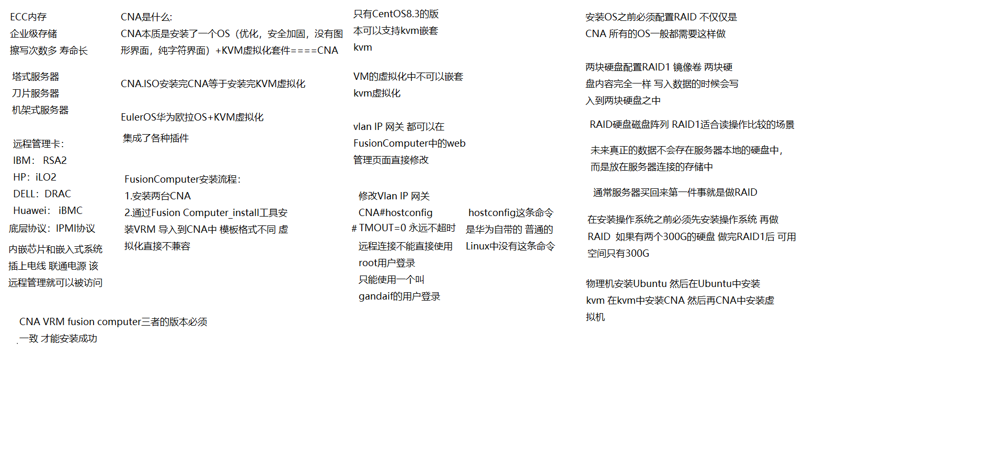
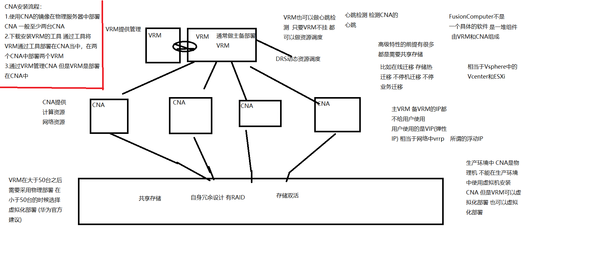
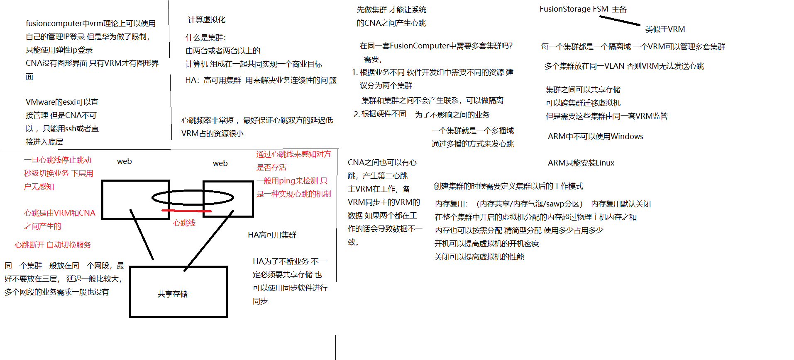
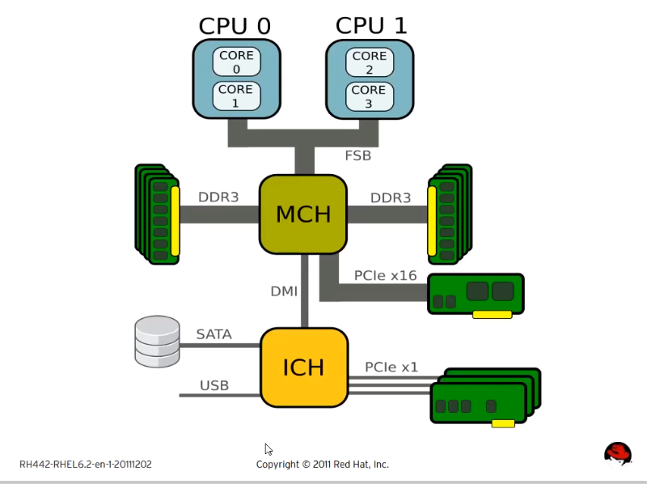
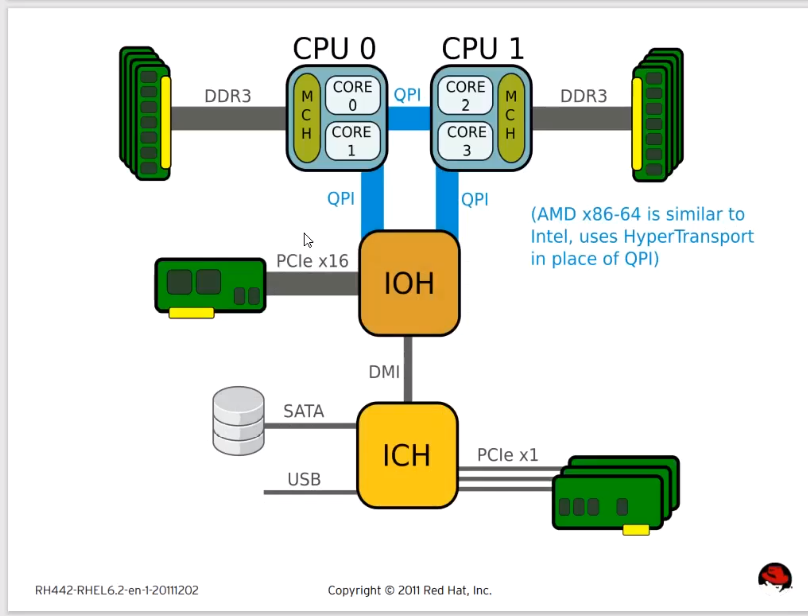

# FusionComputer

## CNA安装

## CNA和VRM之间的关系

## HA心跳

## NUMA架构

### UMA

#### 什么是UMA架构

一致性内存访问  在NUMA出来之前的一个架构

### NUMA

#### 什么是NUMA：

类似于NUMA亲和性 

NUMA：非一致性内存访问 

CPU和内存交换数据通过FSB（前端总线）必须通过这个地方

结果这个FSB成为了技术瓶颈

现在的CPU和内存交换数据先在NUMA node中交换 当资源不够用的时候

会通过一个叫QPI(数据快速通道互联)的地方来交换资源 

支不支持NUMA看主板生产的时候是不是支持 

lscpu这条命令可以在Linux中看见是不是支持NUMA结构 

FSB被QPI取代 NUMA 使用的顺序是按照算法来均衡的 

