[toc]

# FusionAccess

## 桌面云的需求：

1.  数据安全 

2.  运营维护 

3.  灵活度

 

PC利旧：

*   在更新桌面云之前可以先利用自己的旧电脑 

 

## 桌面云场景：

*   普通办公

*   安全办公
*   云工作站
*   呼叫中心
*   公用终端
*   分支机构
*   DaaS
*   移动办公

 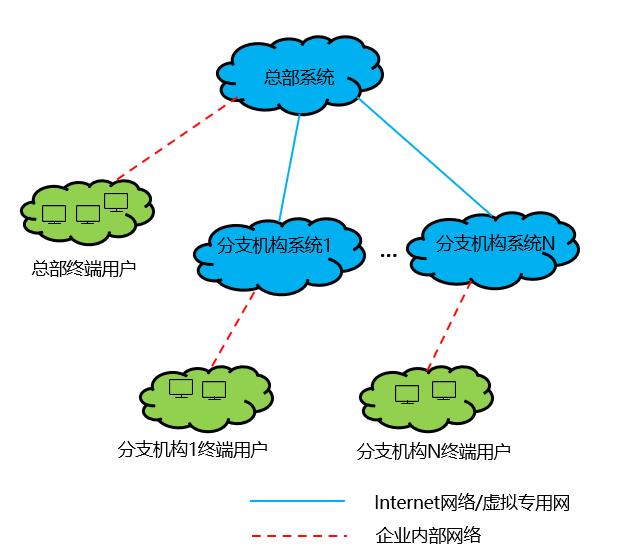

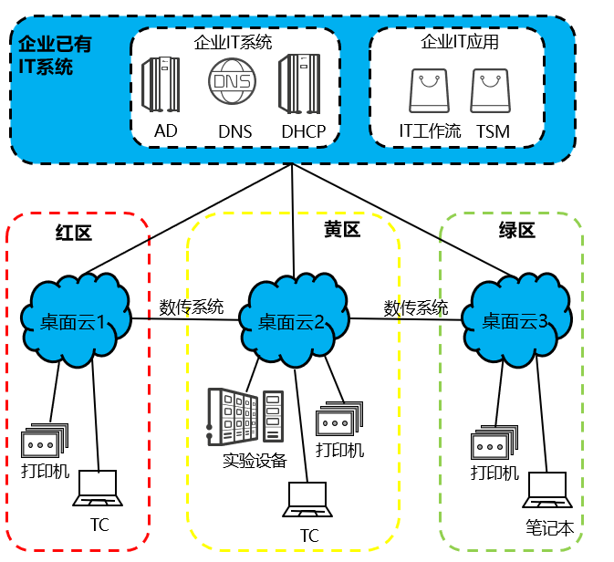

## 桌面云现状

桌面云的性能跟发放虚拟机的性能有关 

开发视角来看 桌面云更加复杂 

桌面云的外设还不成熟 

国产的桌面云的解决方案基本上适配国内的情况 

公司上桌面云 节省了桌面维护的成本 数据丢失的情况解决 发放主机速度变快 

提升IT效率 保护数据信息安全

GPU卡 瘦终端下显卡 GPU直通模式 

做3D渲染的时候可以用

可以多台虚拟机共享一个GPU卡 

SRIOV直通模式 

 

## 桌面云逻辑架构定位

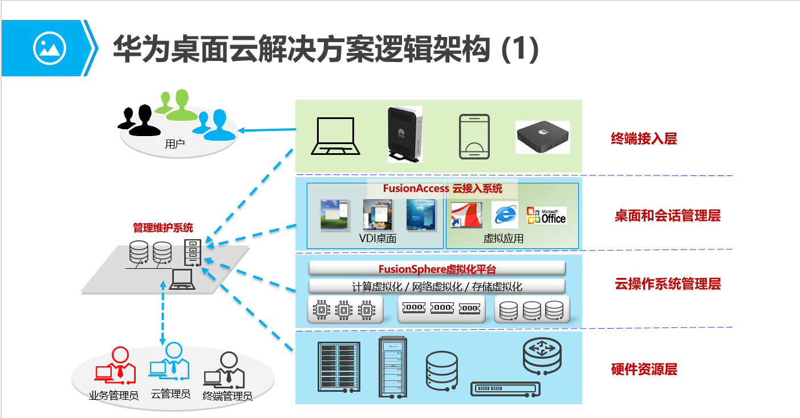

 

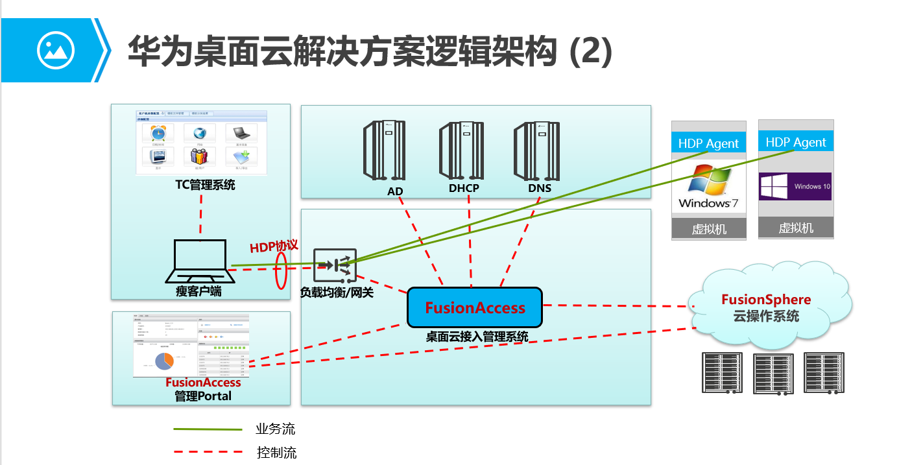

## FusionAccess在FusionSphere套件中的定位

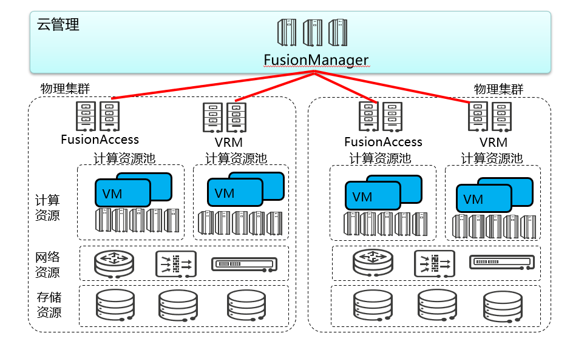

## 什么是VDI

华为的桌面云的解决方案是FusionAccess 简称VDI（虚拟桌面软件架构）

FusionAccess必须依赖虚拟化 

-   利用持久性 VDI，用户每次都会连接到同一桌面，并且能够根据需要对桌面进行个性化设置，这是因为，即使重置连接，更改也会保存下来。换言之，持久性     VDI 环境中的桌面的行为方式与个人物理桌面完全相同。 
-   相比之下，使用非持久性 VDI时，用户将连接到通用桌面并且任何更改都不会保存下来。这种 VDI     通常更简单且费用更低，因为不需要在会话之间维护自定义桌面。非持久性 VDI     通常用于拥有大量任务型员工的企业，或拥有众多执行有限的重复性任务且不需要自定义桌面的员工的企业。

 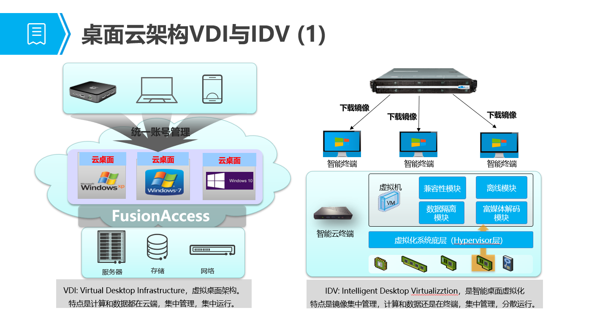

 

 

## 全球最好的桌面云解决方案： 

*   思杰：
    *   XenDesktop
    *   Xenserver

*   VMware：
    *   VIEW 
    *   Vcenter 

*   华为：
    *   fusionAccess 
    *   fusion computer

*   深信服桌面云：底层KVM

 

## FusionAccess资源实现

FusionAccess本身并不提供资源 资源是用于FusionComputer中所有的管理都是在FusionAccess中管理 不需要在底层管理 

FusionAccess在第一次安装的时候需要对接FusionComputer

底层是由FusionComputer来支持虚拟化 

## 桌面云底层详细架构

### 桌面云硬件架构

### 桌面云的软件实现

#### 软件架构图 

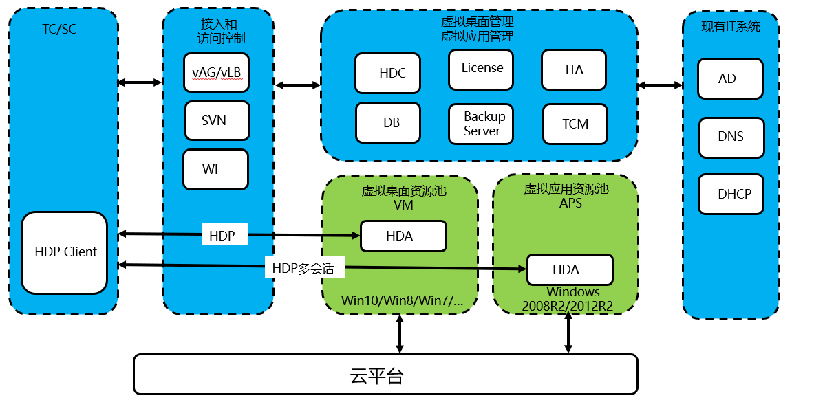

#### 组件介绍

| **组件**    | **英文名称**               | **中文名称**               |
| ----------- | -------------------------- | -------------------------- |
| HDC         | Huawei  Desktop Controller | 华为桌面控制器             |
| LIC         | License                    | 授权管理                   |
| ITA         | IT  Adapter                | IT资源适配管理             |
| DB          | Data  Base                 | 一种关系数据库             |
| AUS         | App Update Server          | 应用升级服务器             |
| TCM         | Thin  Client Management    | 瘦客户端管理               |
| vLB         | Virtual  Load Balance      | 虚拟负载均衡               |
| vAG         | Virtual  Access Gateway    | 虚拟接入网关               |
| SVN         | Security  VPN              | 华为安全网关与负载均衡产品 |
| WI          | Web  Interface             | 用户门户接口               |
| HDA         | HDP  Agent                 | HDP代理                    |
| HDP  Client | HDP  Client                | HDP客户端                  |
| APS         | Application  Server        | 应用服务器                 |
| TC          | Thin  Client               | 瘦客户端                   |
| SC          | Soft  Client               | 软客户端                   |

 

## 桌面云传输协议HDP

HDA 每个虚拟机中都要安装一个HDA代理 这个HDA的代理是基于HDP协议 

通过网络来访问这个服务 然后通过服务来管理整个桌面 

HDP全称Huawei Desktop Protocol，是华为自研开发的新一代虚拟桌面传输协议，通过HDP协议可以实现客户端TC远程访问虚拟桌面。

协议的优化决定了桌面云的性能 

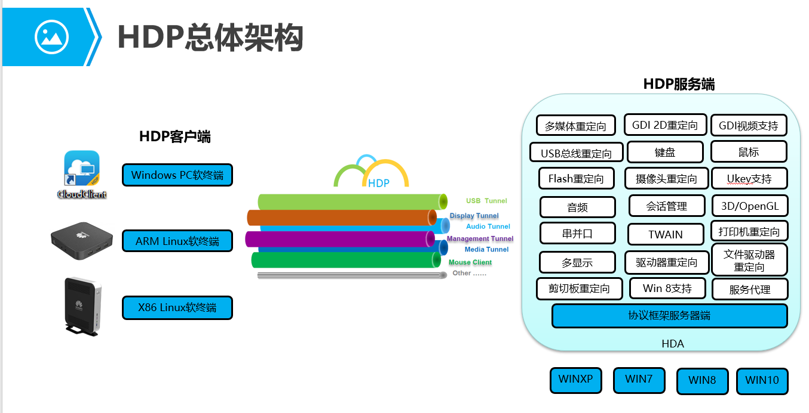

### 常见厂商桌面协议：

*   思杰的桌面协议：ICA协议 
*   专门用于多媒体的：HDX协议
*   VMware的协议：PCOIP协议
*   KVM的协议：SPICE协议 
*   微软的协议 ：RDP协议 RemouteFX是增强版

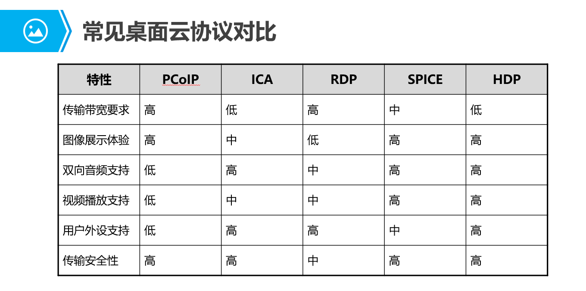

HDA是安装在要发放的虚拟机中

用户通过走HDP协议来访问虚拟机上的HDA 来使用虚拟机 

## 时间同步

在华为云桌面FusionAccess中，时间一致性同步是必不可少的一环，时钟同步是桌面云系统稳定运行的必备条件，如果时钟不同步，会导致桌面云系统管理混乱，时钟同步保证桌面云系统时钟、虚拟机时钟一致。

### 解决方案

*   当客户无提供外部时钟源，华为提供AD时，推荐采用AD通过管理平面从FusionCompute的主、备VRM所对应主机同步时间的方案
*   当由客户提供稳定的时钟源时，不管AD组件由客户提供还是华为提供，采用客户提供外部时钟源同步方案。

## 网关和负载均衡部署方案

### 功能介绍

*   负载均衡器可通过vLB实现该功能，用于将用户的HTTP(S)请求分配到不同的WI，能够自动对WI进行健康检查，确保所有的用户请求都能分配到可用的WI。

*   网关可通过vAG实现该功能，用于业务接入（桌面协议HDP的接入）和自助维护接入，对客户端的接入进行加密保护，提高系统的安全性。

### 部署规模

#### 500台以内

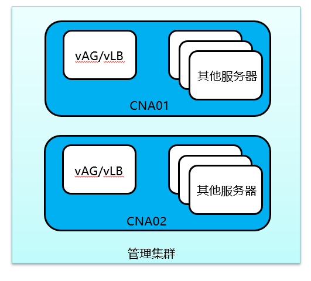

#### 500~1000台

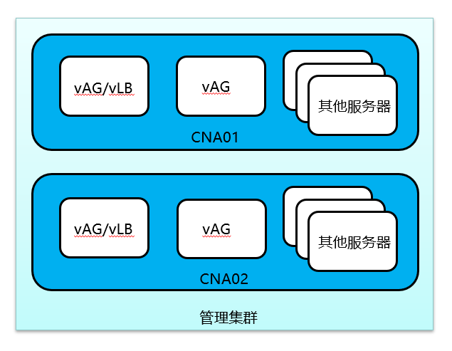

#### 1000~2000台

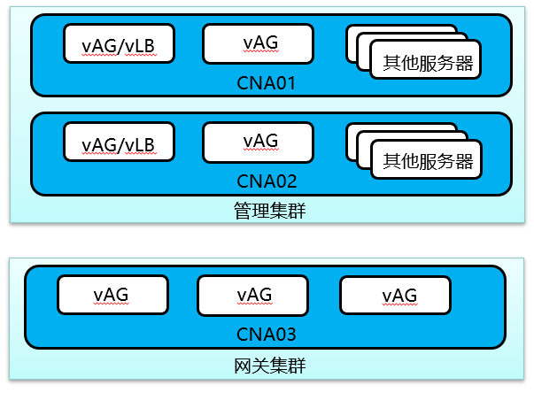

#### 2000~3500台

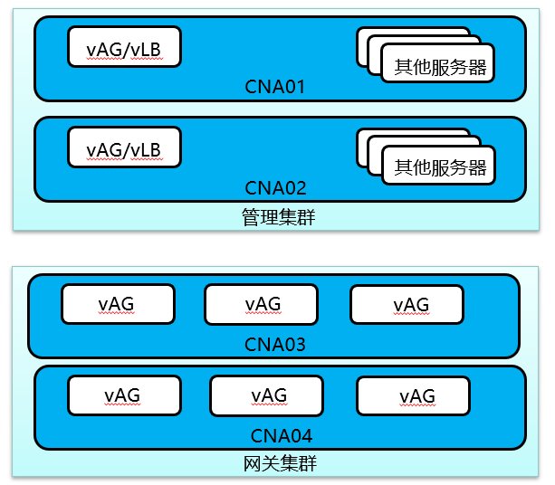

#### 3500~5000台

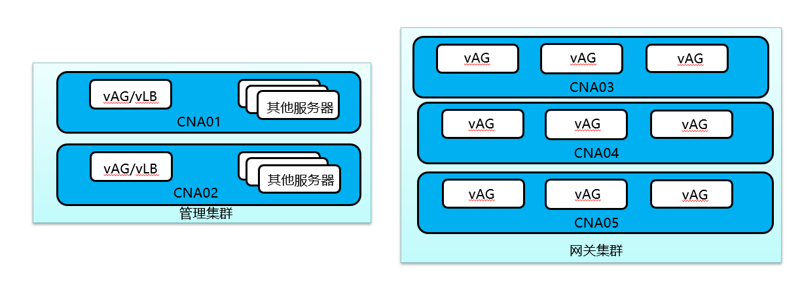

## 桌面云外围部署（AD节点）

### 相关组件

*   AD：活动目录 微软打造的身份认证系统 

*   DHCP：动态主机配置协议 

*   DNS： 域名名称系统 解决计算机名和IP对应关系 
    *   正向解析：把计算机名转换为IP地址 
    *   反向解析：讲IP地址转换为计算机名

### 相关实现

#### Windows

通过Windows server 来直接配置AD域、DNS、DHCP等功能 

#### Linux

通过openLDAP来实现类AD管理

### AD简介

AD：活动目录 微软打造的身份认证系统 

把系统加入AD认证系统中 让AD统一管理 

本地和加入系统中有同一个用户 本地的优先级更高 

不需要在别的机器上建立账号 只需要在AD中创建账号 

 

修改本地的管理员的密码 并且不会告知用户 让用户只使用AD中的账号来登录win10 这样就可以通过AD策略来管理win10 比如发放桌面 限制磁盘 

 

客户端访问的时候 客户端不需要加入AD 

### AD节点搭建实验步骤

1.  安装一台Windows2012作为AD服务器 安装Windows10作为测试 

2.  给AD服务器配置IP地址 子网掩码 网关 关闭防火墙 修改计算机名

3.  添加Windows组件 

    ​	在服务器管理中 添加角色和功能 

    ​	AD域服务 DNS 远程桌面 DHCP勾上 持续默认设置 直到安装

*   配置AD：

    ​	将服务器提升为域控制器 

    ​	添加新林 添加根域名

    ​	设置密码（如果域控出问题了才会用上）

    ​	在配置AD域的时候暂时不需要配置DNS 一直到安装AD

*   配置DHCP：

    ​	一直下一步 然后完成

    ​	点击管理-DHCP 创建一个作用域

    ​	IP地址租约期：租给你的时间之后 会回收 等需要使用的时候再申请 

    ​	DHCP服务器每接上一台PC 每一个PC都会被分配一个IP地址 避免IP浪费

    ​	配置网关 DNS 

    ​	如果有多个网段 需要建立多个作用域 

    ​	目前只是分配到了IP 还没有加域

*   配置DNS：

    ​	点击右键DNS管理器

    ​	正常情况下 需要手动添加IP和域名的解析 

    ​	相当于在底层实现了nslookup 一个域名

    ​	只要将Win10或者其他的客户端加入AD win10的计算机名和IP地址自动加入DNS中

    ​	如果用户修改了IP或者计算机名 这个记录也会更新到DNS中 不需要人工写入

*   配置AD：

    ​	打开AD的用户和计算机 

    ​	创建用户 加入组 

    ​	Domain Admins 域管理员组 

    ​	Administrator 超级管理员组 相当于root组

    ​	普通的AD域中的账号 可以把一台win10加入域中 

    ​	一般都是专门建一个用户来加域 

4.  客户端配置 

    ​	通过DHCP获取IP地址 DNS等 

    ​	加入AD域 在修改计算机名的地方 加域 

    ​	使用AD域中的账号来登录 这样可以方便控制 

### AD管理

#### OU：组织单位

类似组 但是比组更大 

新建一个组织单位 这个单位中可以创建用户 创建组 

OU下可以有子OU 

OU的策略可以继承 子OU的优先级高 

 

#### GPO：组策略对象

AD中有一个组策略管理 

可以看到创建的组织架构 

##### 编辑策略 ：

*   计算机策略 ：应用在计算机上的策略 不管哪个用户登录 都继承

*   用户策略：应用在用户上 不管登录哪个计算机 都继承策略

策略优先级以拒绝优先

编辑策略不支持搜索 

##### 在Windows中测试组策略

cmd中gpupdata /force强制刷新策略

##### 针对对象 

组策略可以针对OU 可以针对计算机 可以针对用户 可以针对组

