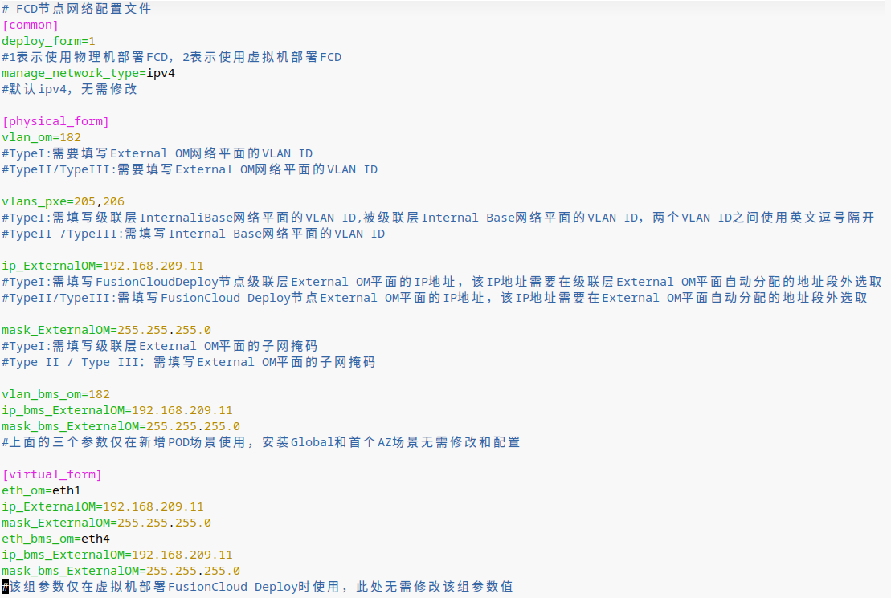
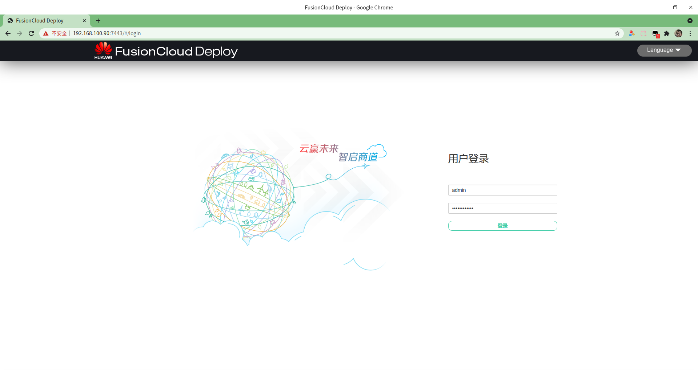

Cloud Stack

1.FusionCloud

环境搭建参照这个文档

 

**1.1 使用FusionCloudDeploy 部署OpenStack**

可以使用iso安装在物理服务器或者安装在虚拟机中

磁盘至少300G，否则会报错，TimeZone也需要设置

SSH 用户：fusionclouddeploy/IaaS@OS-CLOUD9!

```
FCD:~ # cd /opt/FusionCloudDeploy/fcdscript/
FCD:/opt/FusionCloudDeploy/fcdscript # vim fcd_config.ini 
```

 



 

```
FCD:~ # sh /opt/FusionCloudDeploy/fcdscript/config_fcd_net.sh
```

https://xxxx:7443

默认帐号：admin，默认密码：cnp200@HW



新建工程，工程类型选择:部署工程，填写相关参数

CSDR：云服务器的容灾，异地主备

CSHA：云服务器的高可用，同城主备

VHA：云硬盘的高可用，存储双活

管理面跨AZ高可用：异地主备部署管理虚拟机及关键云服务

 

**管理存储使用FusionStorage融合部署的方法**：

管理存储选择IP-SAN存储

使用OceanStor eStor 仿真模拟器来提供IP-SAN存储，部署过程即可到达CPS界面

1.手动部署FSM到Controller本地硬盘

2.进入FSM，配置fusionstorage存储池

3.在openstack（CPS服务，在控制节点本地硬盘中，OS）中对接fusionstorage

4.继续安装openstack，管理虚拟机将会安装到fusionstorage中

管理虚拟机和业务虚拟机都可以安装在fusionstorage，而不需要单独购买一套IP-SAN存储

虚拟化类型：BMS:裸金属

基础云服务，默认即可 高级云服务根据需要选择，一般勾选ebackup用来备份业务虚拟机

云服务管理面数据自动备份，即在底层启用一个计划任务来备份管理数据到本地

填写LLD(Low Level Design)模板

软件包：将软件包上传到depoly系统的/home/pkg目录下，然后开始校验软件包

 1.1设备信息

设备型号：逻辑分组，便于管理

POD名称：type2和type3一样

设备用途：first_node节点会自动安装DHCP、PXE、NTP 等服务，默认地址为172.28.0.8/20 并设置VLAN24，防止与其他DHCP服务器冲突

指定部署组建：manager_fsm-FusionStorage管理节点、fsa-FusionStorage存储节点代理、vbs-FusionStorage写入节点、osd-FusionStorage磁盘进程，openstack_om-OpenStack管理组建

业务主机组：kvm、bsm(裸金属)，名称一样意味着将来放在一个主机组里面

网络逻辑主机组：根据设备型号自动生成

是否为元数据节点：1-是、0-否

External_OM:  OpenStack Management ，openstack对接fusionstorage、FusionComputer、VMWare、 KVM 等平面

External_API: 对外的接口，可以是个公网地址

某些场景，External_OM需要和External_API通信，控制节点有External_API地址，计算节点不需要External_API地址


Internal_Base：对内地址，默认为172.28.0.0/20，FS的后端存储网络，Host-only的网络，不需要与那个平面通信

 

云内部服务走Internal_Base、云内部用户走External_OM、云外部用户走External_API


physnet1：虚拟交换机，上行链路为Nic0、Nic1，External_OM、External_API、Internal_Base都是这个虚拟交换机下的三个端口组，其中，Internal_Base是自动创建的，使用这个端口的的数据包经过物理交换机时会打上24的vlan标签，虚拟机使用其他两个端口组的话，数据包经过虚拟交换机会被打上相应的vlan标签

表格填写完成之后，上传表格，校验软件包、服务器之后开始安装。

统一入口：OC域名后缀，根据LLD表格中填写的内容生成，例：https://oc.demo.com:31943  admin/Hawei12#$


默认90天试用


**点击：进入系统，即可进入统一访问入口界面**


**1.2 CPS:Cloud Provisioning Service 云装配服务**

安装OpenStack用，超级管理员用，底层的修改都在这里进行


角色管理


某一个角色是三节点部署：负载均衡

某一个角色是两节点部署：主备部署


**1.5 Service OM:Openstack ManageMent 管理中心**

开源OpenStack中，admin用户干的事情，上传镜像、创建主机集合、创建规格、创建外部网络


上传镜像


服务化能力：如果为裸机安装系统，则选择不支持，其他为支持

类型：对接的虚拟化类型，kvm只能选择kvm支持的镜像格式，vmware只能选择vmware支持的镜像格式

名称：操作系统名称-版本号

适用操作系统：根据镜像选择

最小磁盘、最小内存必须选择，根据镜像的磁盘容量设置，比如：centos-7.2 镜像模板中，磁盘总共25G，那么这里就必须大于25G

磁盘类型选择：Linux选择virtio，Windows最好不要选择virtio

虚拟机快速发放：发放出来的虚拟机是连接克隆，一般不勾

UEFI启动：磁盘超过2T勾选

Cloud init：自定义系统信息

在线变更规格：热添加资源


创建主机集合


选择主机组


默认已经有个一个主机组


添加计算机


创建多个主机组：

Inter CPU       HostGroup1、AMD CPU       HostGroup2

CPU型  CPUHost、内存型 MemHost、IO型 IOHost

标签管理：将主机组与标签关联，将来发放云主机选择标签，即可发放到对应的主机组中


 


非常消耗CPU的，发放云主机时选择与CPUHost关联的标签

创建规格

类型：虚拟机、裸金属服务器

启动源：本地、云硬盘

名称：m1.web1


关键：标签，添加上一步添加的标签


与AZ绑定


创建外部网络


外部网络


group：即出口网络，如果有两个出口网络，可以创建两个


创建子网


开启DHCP，公网的地址池，VLAN要在交换机上配置


**1.3 ManageOne SC:ServerCenter-运营中心**

**链接在生成的LLD文件里面**


租户超级管理员，默认的为bss_admin


（1）创建租户


 


创建租户，双因子认证：两种认证方式


创建用户（vdcadmin）--租户管理员


将用户关联到租户，设置为租户管理员，创建配额

本级配额：本级可以使用总配额的资源


分配外部网络


（2）费率管理


用户：vdcadmin身份进入


 


（1）创建私有网络VPC，创建安全组


 


创建安全组，业务员只能使用安全组，不能创建


（2）创建审批流程，审批


（3）创建产品，发布产品，关联审批流程


锁定之后，业务员只能按照这个参数申请云主机


创建审批流程，在发布产品时，可以选择是否审批，在哪里可以创建审批流程


上线产品


（4）创建VDC业务员（vdcuser）


可自定义每一层的审批人，也可以关联到现有OA审批系统

用户：vdcuser


 


（1）申请云主机


 


提交审批


使用审批流程中的审批人登陆进行审批


正在创建云主机


创建成功


（2）申请云硬盘


将云硬盘挂载给云主机


 admin----> CEO

 bss_admin---- CTO

 vdcadmin --- 租户管理员 部门负责人

 vdcuser---  租户业务员，员工

可以创建5层VDC

**1.4 Manage OC:OperationCenter-运维中心**

查看告警情况


设置报表


 


设置远程通知方式


 


创建通知方式(短信、邮箱)、创建用户、用户组、通知模板

管理节点的OM网络，ssh 用户：fsp/Huawei@CLOUD8  root/Huawei@CLOUD8!

Controller01:～#source set_env		//加载环境变量

1

FusionSphere123

Controller01:～#cinder list 

**1.6 FusionCare 健康检查**


 


巡检结果


快捷菜单


 

 

 

 

 

 

 

 

 

 

 

 

 

 

 

 

 

 

 

 

 

 

 

 

 

 

 

 

 

 

 

 

 

 

 

 