# FusionComuter

 

IaaS   Infrastructure as a Service    基础架构即服务

PaaS   Platform as a server    平台即服务 docker容器  K8S

SaaS   Software as a Service      软件即服务 网易云音乐，百度网盘

虚拟化优势：提高服务器利用率、提升管理效率

虚拟化行业老大：VMware

云计算行业老大：AWS(亚马逊)

开源虚拟化： XEN  KVM

VMware虚拟化解决方案： VMware vSphere

华为虚拟化解决方案： Fusion vSphere

VRM:Virtual Resource Management 虚拟资源管理

CNA:Computer Node Agent 计算节点代理

FusionComputer 6.1 之前 SUSE Enterprise Linux 11 X64

FusionComputer 6.1(包括6.1)  EulerOS 欧拉OS  Opne Euler

FusionComputer 6.3 之前 XEN

FusionComputer 6.3(包括6.3) KVM

CentOS:Community Enterprise Operation System

KVM:Kernel-based Virtual Machine

VMM: Virtual Machine Monitor  虚拟机监视器

各厂商服务器远程管理口都基于Intel IPMI 2.0开源标准

基板管理控制器(Baseboard Manager Controller)

Intel IPMI

IBM   RSA

HP   iLO

DELL   DRAC

HUAWEI iBMC

当CNA数量超过50台，VRM物理部署，否则虚拟化部署

热迁移  在线迁移  不停业务 迁移的是内存中的数据

冷迁移 停止业务迁移

FusionCompute安装流程：安装两台CNA、使用fusionCompute Tools将VRM部署到CNA中、使用VRM管理CNA和集群

在Hypervisor上进行着计算虚拟化、存储虚拟化、网络虚拟化

XEN虚拟化

需要升级内核，kernel-xen内核;

内核不能直接与虚拟机交流，需要通过domain0这个特殊的虚拟机。

KVM虚拟化

直接使用内核，不需要专门内核;

虚拟机就是一个系统进程，可以直接使用原有内核机制;

更加轻量;

接近裸机90%性能。

红帽收购KVM

Citrix——XEN——CloudStack

RHEL——KVM——OpenStack

阿里巴巴的云系统:飞天-自研

为什么KVM击败了XEN

XEN需要升级内核，维护一套内核，进来的数据包需要Domain0来处理;

KVM更加轻量，通过内核模块实现，一个VM就是一个进程;

XEN被Citrix收购，支持CloudStack、KVM被红帽收购，支持OpenStack。

OpenStack社区更加流行，有更多厂商支持。

基于内核的虚拟机

glusterfs

ceph

ansible

X86 ISA中有19条敏感指令不是特权指令，因此x86无法使用经典的虚拟化技术完全虚


 https://blog.csdn.net/gui951753/article/details/81507924

**半虚拟化**

VT-X  虚拟机只能安装linux，不能安装windows，因为需要修改虚拟机内核以支持虚拟化

**完全虚拟化**

**硬件辅助虚拟化**

Intel VT-X  

AMD  AMD-V(BIOS中开启，开启就是硬件辅助虚拟化，不开就是完全虚拟化)

如果是Linux，则自带virtIO驱动，如果是windows ，则需要额外安装virtio驱动

在硬件辅助虚拟化环境中安装半虚拟化驱动来提升IO性能

virtIO drivers

如何判断服务器是否支持硬件辅助虚拟化

\#lscpu

\#cat /proc/cpuinfo | grep vmx Intel

\#cat /proc/cpuinfo | grep svm AMD

只有XEN有Domain0，跟硬件辅助虚拟化和硬件半虚拟化无关，KVM也有半虚拟化(需要驱动支持 PV Drive)和硬件辅助虚拟化，无需Domain0。

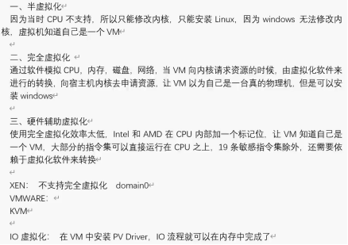

 

vcpus:插槽数*核数*线程数 #2*10*2=80 vcpus

内存复用:默认是内存*150%可用

内存复用与NUMA不能同时开启

 

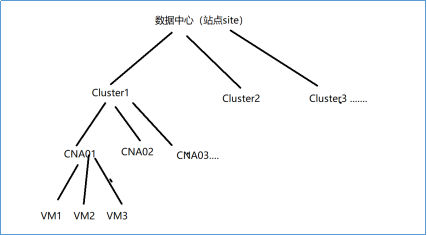

 

票数解决方案防止脑裂

什么是集群

由两台或者两台以上的主机，共同完成一个商业目标，根据业务不同，集群分为

HA 高可用集群

LBC  负载均衡集群  HPC  高性能集群

为什么需要多个集群

根据业务、根据组织架构、根据硬件

…………

如果VRM物理部署，手动创建集群以及分布式虚拟交换机

VRM虚拟化部署

自动建立了一个ManagementCluster集群

20台服务器

2台服务器用于安装管理虚拟机，放在一个单独的集群中，其他服务器单独创建一个集群

用于安装业务虚拟机

fusionstorage 华为分布式存储  FSM  DNS  AD  DHCP

同一个模板部署出来的虚拟机

什么是HA

什么是DRS 分布式资源调度  动态资源调度

DPM： 动态电源管理

BMC

**计算虚拟化**

创建集群

**2.1.主机内存复用** **#面试必考**

(1)：开启可以提高虚拟机开机密度，默认150%。

(2)：关闭提高虚拟机性能。

内存共享  COW： 写时复制  Copy on write

同一个模板部署的虚拟机可使用此功能

内存置换：swap分区

内存气泡

 

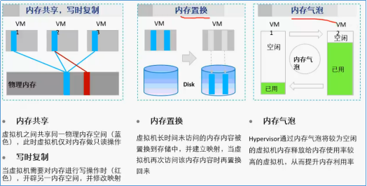

 

**2.2.虚拟机启动策略**

(1)负载均衡：开机时，可以让虚拟机均衡的运行在集群的主机上。

(2)自动分配：减少VRM的计算压力。

**2.3.虚拟机NUMA结构自动调整**

NUMA架构：

 

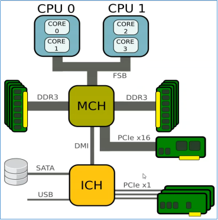

 

FSB:前端总线，会出现性能瓶颈

NUMA架构如下图：

QPI：快速通道互联

 


 

NUMA：非一致性内存访问

(1)：虚拟机运行时会自动感知NUMA架构，让虚拟机尽量运行在一个NUMA Node中。

(2)：与内存复用功能互斥，也会带来更多的开销。

 


 

**2.4.开启故障与响应策略**

(1)：主机故障处理策略

(2)：数据存储故障处理策略

不处理：如果出现间歇性故障，不处理更合适。

HA：如果出现故障，HA更合适。

Windows虚拟机蓝屏处理策略：利用虚拟机Tools功能来充当心跳检测机制，来检测的状态，一旦CNA检测不到Tools心跳，就认为虚拟机蓝屏，通过宿主机将虚拟机强制重启。即通过KVM命令强制重启虚拟机

\#virsh destory xxx

**2.5.接入控制策略**

允许故障的数目：在规划时需要预留30%的资源以防止集群中有主机故障保证所有的虚拟机都能正常运行。

**2.6.群体性故障**

在2个小时内如果出现多个主机故障只处理前两个故障的主机。

**2.7.启用计算资源调度**

DRS

根据CPU和内存的使用情况在集群中进行虚拟机迁移，来达到均衡的目的。

**2.8.电源管理**

根据集群的负载情况，如果负载低，就把所有的主机迁移到一部分主机上，把剩余的主机关机，来降低功耗，当业务负载高，则自动开机，将虚拟机迁移到新开机的主机，来达到负载均衡。

**2.9.开启IMC机制**

开启Intel的兼容性，使得不同批次的服务器在同一个集群中继续工作，降低高配的服务器性能。

DRS:分布式资源调度

DPM:分布式电源管理

不同厂商的服务器，如果CPU指令集一样，是可以放在同一个集群的

虚拟机内存不能跨主机

为什么要创建多个集群？

服务器硬件配置、根据部门来管理、根据业务场景web+sql   mail+oa+erp、根据集群规则

清除VRM信息:在CNA节点中

\#echo > /etc/vna-api/vrminfo  

\#systemctl restart vna-api

**存储虚拟化**

华为OceanStro系列，四块保险盘做RAID1

BBU: 后备电池单元

 

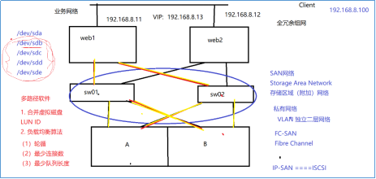

 

一、配置存储流程

\1. 创建硬盘域

\2. 创建存储池

\3. 创建LUN

\4. 创建LUN组，并加LUN加入LUN组

\5. 创建主机

\6. 创建主机组，将主机加入主机组

\7. 创建映射，将LUN组映射给主机组

\8. 给主机添加启动器

（1）如果是FC-SAN，则只需要开机，主机的光纤卡WWPN就可以在存储上看到了，将WWPN添加给主机即可

（2）如果是IP-SAN，则需要给存储的业务接口（比如H0口）配置规划的IP地址

（4）如果是IP-SAN，则需要在windows的ISCSI发起程序中，添加目标器地址（存储业务接口IP），如果连接成功，则主机的IQN会在存储上可以看到

（5）在存储上host001上添加windows主机的IQN或者WWPN

\9. 在windows主机上扫描新磁盘，初始化，分区，格式化，写入数据

**3.1.raid技术** 

RAID： 廉价冗余独立磁盘阵列 Redundant Array of Independent Disks

RAID0  条带化  >=2 块以上的硬盘


 

RAID5 校验数据在专门的一块校验盘中，可使用总数为SUM-1，重构时，写入的数据优先级高于重构数据。

 


 

RAID6 需要磁盘数量>=4 可以坏任意一块盘

 


 

4快盘做RAID10或者RAID5，那个性能更好？

 


 

顺序大IO RAID5 视频监控，数据备份

随机小IO RAID10 12306买票，如果使用RAID5，会频繁更改校验数据，开销大

VMware磁盘格式：vmdk

HUAWEI磁盘模式：vhd

KVM磁盘格式：qcow2

**3.2.磁盘配置模式**

精简模式：创建完，不进行初始化，没有填0，使用时，写多少数据就填多少个0；

优点：按需分配，不占用未使用空间；

缺点：性能差，等到全部填完0之后与普通模式性能一样。

普通模式：创建完磁盘后，不管是否写入数据，全部用0填充；

优点：性能好；

缺点：创建速度慢。

普通延迟置零：创建完磁盘后，不用0填充，待第一次写入数据时，则全部用0填充；

优点：创建时不占用磁盘性能，待使用时性能好；

缺点：第一次写入数据慢。

**3.3.华为两种改变磁盘配置模式方法**

vmware可以直接吧精简卷转换为普通卷，不能回转

华为不能直接转换，需要通过克隆虚拟机或者迁移数据存储实现转换

磁盘类型：

普通：只能给一个主虚拟机使用，磁盘模式和磁盘配置模式可以根据共享存储类型来选择

共享：可以给多个虚拟机使用，磁盘配置模式只能选择“普通模式”，不支持在线扩容。

**3.4.磁盘模式**

从属：快照全拍

独立-持久：快照不拍数据盘

独立-非持久：类似于还原卡

差分盘

a.安装好OS、APP，配置好系统，可以正常使用

b.关机，更改磁盘为独立-非持久

c.开机，写入数据

d.关机，开机，测试数据是否还在(重启数据不丢失，关机电源才丢失数据)

\1. 安装完操作系统，安装好软件并配置，已经可以正常使用了

\2. 关机，并修改磁盘模式为独立-非持久

\3. 开机会产生一个差分磁盘文件，从此新写入的数据将会写入到该磁盘中，如果是读旧数据，将通过指针读到源盘

\5. 当将虚拟机关机后，CNA删除差分盘，下次开机重新生成差分盘

当前CNA01上有个虚拟机，磁盘模式为从属

 


 

配置文件在其正在运行的CNA下/etc/libvirt/qemu 目录下，打开xxx.xml配置文件可以找到其磁盘的目录

 

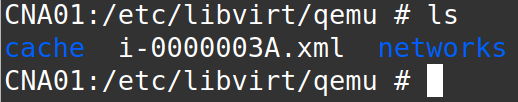

 

\# vim i-0000003A.xml

其磁盘位置位于 /POME/datastore_5/vol/vol_46462437-eb4c-4936-95e9-70941975d819

这个目录下，磁盘名称为 vol_46462437-eb4c-4936-95e9-70941975d819.img

 

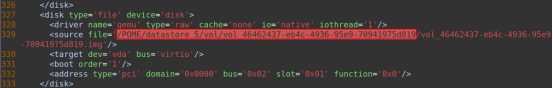

 

此磁盘文件位于共享存储上，可打开目录查看

\#cd /POME/datastore_5/vol/vol_46462437-eb4c-4936-95e9-70941975d819

 


 

\#ll -h #查看文件大小为40G

\#du -sh #实际使用9.0G,因为是精简配置

 


 

现在更改虚拟机磁盘模式为 独立-非持久

 


 

此时打开虚拟机配置文件，查看磁盘所在位置，可以看到，此时的目录和磁盘名称都和原来的不同了/POME/datastore_5/vol/vol_61351902-15a9-4d14-b1a9-3e56799f5a65/vol_61351902-15a9-4d14-b1a9-3e56799f5a65.img

 

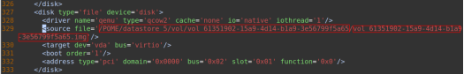

 

查看一下磁盘文件大小

\#ll -h #可以看到，只有46M

\#du -sh #这就是差分盘

 


 

现在在虚拟机生成一些数据，在来看这个磁盘大小

 


 

可以看到，磁盘由46M变成166M，因为现在写的数据都在这个差分盘中，现在关闭虚拟机，然后开机(重启无效)，那么差分盘就会重新生成，如下：

/POME/datastore_5/vol/vol_ae557a31-a6c4-40a9-ba18-610cb3813eb6/vol_ae557a31-a6c4-40a9-ba18-610cb3813eb6.img

 


 

此时大小就回归刚刚创建的大小了

 


 

现在吧磁盘类型改为从属，看看磁盘是不是母盘

 


 

查看磁盘名称，和第一次查看时的名称和目录一致

/POME/datastore_5/vol/vol_46462437-eb4c-4936-95e9-70941975d819/vol_46462437-eb4c-4936-95e9-70941975d819.img

 


 

磁盘大小一致，这就是差分盘

 

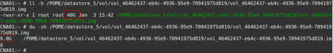

 

**3.5.快照**

裸设备做快照：COW

带文件系统的虚拟机：ROW

脏数据：在内存中发生变化还没有写回磁盘的数据

赃页：Dirty 在/proc/meninfo中可查看到

\#watch -n 1 ‘cat proc/meninfo | grep Dirty’ #查看1s内脏数据

\#sync #刷脏页

脏数据必须回收，否则会丢数据

当应用程序在写数据到硬盘时，先写入到内存缓存中，默认30S后会写入硬盘？

查看系统IO状态：#iostat -x 1 #查看1s内IO状态

内存快照： 创建快照时，将内存及磁盘中的数据都进行保存，速度慢，安全性高

一致性快照：创建快照时，CNA会通知tools将内存数据强制刷到硬盘中，再对硬盘数据进行快照，速度快，也不会丢失数据，如果还原快照，虚拟机是关机状态，不是开机状态。

就是Tools执行#sync命令。

COW：Copy on Write 写时复制。写前拷贝

下面是以前的老方法：

\#pvcreate /dev/sdb1 #将分区做成物理卷

 


 

\#vgcreate vg0 /dev/sdb1 #创建物理卷组

 

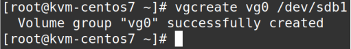

 

\#lvcreate -L 10G -n date vg0 #从vg0中分10G做逻辑卷date

 

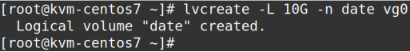

 

\# mkfs.ext4 /dev/vg0/date #格式化卷组date为ext4格式

 


 


\#mount /dev/vg0/date /video #挂载到/video下

 

复制一些文件进去

 


 

\#dd if=/dev/zero of=/video/test1 bs=1M count=200 #创建两个文件

 


 

可以看到，真正的占用了这么多空间

 


 

可以看到，此时物理卷组vg0分配了10G空间出去

 


 

\# lvcreate -L 128M -s -n snap1 /dev/vg0/date #创建128M的快照空间，也就是COW空间，这个空间也是从vg0划分出来的

\#vgdisplay #查看物理卷组

 


 

[root@kvm-centos7 ~]# lvdisplay

--- Logical volume ---

LV Path         /dev/vg0/date

LV Name         date

VG Name         vg0

LV UUID         foCiKD-ojdb-0DcK-iCwP-uRoc-nH2Q-joObIE

LV Write Access     read/write

LV Creation host, time kvm-centos7, 2021-01-04 17:56:19 +0800

LV snapshot status   source of

snap1 [active]

LV Status        available

\# open         1

LV Size         10.00 GiB

Current LE       2560

Segments        1

Allocation       inherit

Read ahead sectors   auto

\- currently set to   8192

Block device      253:3

--- Logical volume ---

LV Path         /dev/vg0/snap1

LV Name         snap1

VG Name         vg0

LV UUID         eyPN50-B247-vGdR-eebm-AOTR-7rsR-7LTWPM

LV Write Access     read/write

LV Creation host, time kvm-centos7, 2021-01-04 18:19:57 +0800

LV snapshot status   active destination for date

LV Status        available

\# open         0

LV Size         10.00 GiB

Current LE       2560

COW-table size     128.00 MiB #COW空间

COW-table LE      32

Allocated to snapshot  0.01% #此次快照只用到了0.01%的空间

Snapshot chunk size   4.00 KiB

Segments        1

Allocation       inherit

Read ahead sectors   auto

\- currently set to   8192

Block device      253:6

\#mount /dev/vg0/snap1 /snap1/ #将snap1挂载

\#df -h #可以看到，刚才snap1使用了128M的0.01%，在这里依然显示使用了576M

 


 

\#ls #可以看到，这两个目录下的文件夹一致

 


 

\# rm -f /video/test1&&sync #删除/video下的test1并刷新数据到磁盘

\#ls /video #此目录下的test1没有了

\#ls /snap1 #此目录下的test1还在

 


 

\#df -h #可以看到，/video确实小了200M

 


 

\# dd if=/dev/zero of=/video/test3 bs=1M count=64 #新生成一个文件

此时COW里面已经没有test3文件了，他还是在/video文件夹下

 


 

\#lvdisplay #此时COW区域占用50%，这是刚才生成的tset3文件覆盖的数据块跑到COW这里来了，而不是覆盖文件跑到这里来，新的test3还是写在了/video，只是覆盖前的数据跑到COW了

 


 

一个文件有多个数据块，文件可以有很多指针，但是数据块只有一个指针

COW区域可以存放文件，但是一般给COW区域设置只读权限，不能写

此时删掉/video下的test2，重新生成一个128M的tset4，因为COW只有128M，所以COW坏了，lvdisplay查看此时COW的状态为 INACTIVE

 


 

系统已经将它卸载了，手动挂载也挂不上去了，这就是以前的老方法，不知道这个COW区域要设置多大才能保证COW不被损坏

 


 

如何保证COW不被破坏掉？

\#vim /etc/lvm/lvm.conf #lvm的配置文件

 


 

翻译：snapshot有个autoextend，它是用来自动扩展快照的，当snapshot_autoextend_threshold值为100时，即关闭自动扩展功能

 


 

翻译：当snapshot_autoextend_threshold值为70， snapshot_autoextend_percent 值为20时，意味着当snapshot大小达到总空间的70%时，自动扩展20%的空间。

snapshot_autoextend_threshold=100意味着不扩展

snapshot_autoextend_threshold不能低于50%

如果卷组的空间用不完，他就可以一直扩大

当做了快照之后，不删除数据，新写入的文件的数据块也会复制到COW区域。

从性能来讲，会影响写性能，但是对读性能没影响,不还原快照是不会读COW区域的。

新建快照之后，上一次快照创建的COW就变成只读了，新创建的快照又会生成新的COW。

还原快照后，快照还在，也就是拍快照前的数据的指针还在COW区域，所以快照可以拐弯。

索引是以块为单位的,删除COW快照和源卷没有关系，因为所有数据都是写在源卷的。

面试Q：做了快照之后，性能会有什么样的变化？

A：新能逐步回升。

现在的方法：COW和LUN共用一个存储，可以设置告警阈值，比如存储超过80%告警。

ROW：Redirect On Write 写时重定向

此时一个虚拟机在CNA01上运行，没有快照，到CNA01上查看配置文件

 


 

\# vim /etc/libvirt/qemu/i-0000003E.xml #编辑虚拟机配置文件

 


 

这就是虚拟机的磁盘目录，进入目录查看一下磁盘文件

 


 

\#ll -h /POME/datastore_5/vol/vol_b91d83b5-ccdb-40b0-bd6a-a1880088d1bb/vol_b91d83b5-ccdb-40b0-bd6a-a1880088d1bb.img #查看文件占用空间

 


 

此时，目录下只有这一个基础磁盘，啥都没干，创建个快照snap

 


 

再来查看磁盘目录，此时多了一个3M的文件，这就是这次创建快照的磁盘，即ROW区域

 


 

在虚拟机写入一些数据再来查看ROW区域的大小

模拟一个100M的数据

 


 

\# ll -h /POME/datastore_5/vol/vol_b91d83b5-ccdb-40b0-bd6a-a1880088d1bb/vol_857fed41-2cac-4d08-bfd0-05f60b89985d.img

\#此时ROW区域增加了100M的大小，因为ROW快照的数据都是写在ROW区域的

 


 

现在再次创建快照：snap2

 


 

再来查看磁盘目录，又新增一个ROW区域

 


 

继续模拟写入100M数据

 


 

数据写在了第二个快照中，基础磁盘和第一个ROW区域没有变化

 


 

若此时删除快照2，那么快照1的ROW会是什么样的变化？

 


 


 

此时，快照2会和快照1合并，如下图：磁盘只有两个了，但是快照1创建的ROW变大了，这就是快照2的ROW区域和快照1的ROW区域合并了，所以变大了。

 


 

因为只是删除快照，没有还原，所以创建快照2时创建的文件还在，没有删除

 


 

如果此时还原快照1，那么在创建快照1之后创建的数据全都没了，如下：

先还原快照1

 


 

恢复快照会关闭虚拟机，影响业务

 


 

还原之后，在这个快照创建之后的数据就没了

 


 

此时快照1创建的ROW中的数据也没了

 


 

从性能来讲，会影响读性能，但是对写性能没影响,不还原快照是不会丢数据的

NAS： 文件级共享

SAN:  块级别共享

NAS  非结构化数据  图像 视频 语音 文件 abd.doc  abc.wmv

NAS 大数据平台 ISO文件  松耦合

CIFS 两台windows之间互访，使用CIFS协议共享

NFS 两台Linux之间互访，使用NFS协议共享

NAS的文件系统在存储上

SAN的文件系统在业务主机上

**3.6.热迁移**

热插拔：取决于操作系统和虚拟化支持不支持

**3.6.1.虚拟机热迁移**

类似于ROW原理

前提条件：迁移的两台CNA都可以访问到同一台存储

开始迁移，内存生成一个内存位图区，类似于差分盘，内存位图区有个索引指向原来的内存在哪里，通过内存位图区记录原来的数据在哪里，新增的数据在哪里，新增的数据写在内存位图区中，旧的内存变成只读状态，将旧的内存迁移到另一台CNA，完成之后会阻塞上层业务下发，大概1s，在这期间将内存位图区迁移到另一台CNA。

内存双写：迁移的同时，在两台CNA的内存位图区同时写入新增的数据，旧数据迁移完成之后将数据合并之后，两台CNA的内存位图区将会释放。

迁移的同时，还会将虚拟机的配置文件一并迁移走。

热迁移条件限制：

不支持跨FusionStorage Block存储资源之间进行迁移

不支持已挂载“共享”类型的磁盘和连接克隆虚拟机的磁盘

不支持已挂载的总线类型为“IDE”的磁盘

跨集群迁移：同一套VRM管理的多个集群是可以使用同一套存储的。

不同VRM管理的集群不可以使用同一套存储，否则会触发存储的锁机制导致存储异常，不可用。

DRS HA只作用于一个集群、 手动迁移可以跨集群

跨集群热迁移前提条件：两个集群的配置要相同，不如一个开了内存复用，一个没开、 IMC模式要相同，CPU不兼容。

冷迁移没有这么多限制。

**3.6.2.存储热迁移**

热迁移首先使用写时重定向，将虚拟机数据写入目的存储的一个差异磁盘，这样，原磁盘文件就变成只读的。

将源卷的所有的数据块依次读取出来并合并到目标端的差异磁盘中，等数据合并完成后，目的端的差分磁盘就拥有虚拟磁盘的所有最新数据。

去除目的端快照对源卷的依赖，将差分磁盘修改为动态磁盘，这样，目的端磁盘文件可以独立运行。

**3.7.光纤交换机**

全球被博科垄断

WWNN:全球唯一节点号

WWPN：全球唯一端口号

接口数量、级联、长度都需要License

缺省管理IP：10.77.77.77 username：admin password:password

华为光交：所有接口都在一个ZONE里，默认全通

博科光交：所有接口都在一个ZONE里，默认全不同通

划分zone之前需要规划好，web和telnet都可配置，config只能同时激活一个，大zone,小zone

根据端口划分zone

优点：

缺点：不能随便插拔接口

根据WWPN号划分zone

优点：接口可随便插拔

缺点：第一次配需要一个一个找光纤卡的WWPN号，如果光纤卡坏了需要重新划分zone，未来维护很难

可使用alias别名标记接口的wwpn，创建zone时可使用别名创建，便于维护

 

博科交换机命令

 

查看

chassisshow #查看设备序列号

portshow

portstatsshow

portlogshow #查看各端口的工作状态

sfpshow #查看各端口上的模块

i #查看进程

 

时间

date #查看时间

date  0629231518 #更改时间为2018年6月29日 15:18

 

管理ip

ipaddrshow #查看ip地址

ipaddrset #更改ip地址

 

zone配置

alicreate  "Host01","wwpn号“    也可以写"1,1" #端口号：前面的数字代表Domain ID,后面的数字代表端口号

alicreate  "Host02","wwpn号“

alicreate  "storage01","WWPN号"

\#创建别名，端口的 wwpn号/端口号    ==>>    对应别名"Host01" 、"storage01"                     

*WWN：HBA卡的标识；WWPN：光模块端口的标识；WWNN：节点的标识

一般情况只会用到WWPN

 

zonecreate  "zone01","Host01;storage01"

zonecreate  "zone02","Host01;storage01"

\#创建zone，将别名加入zone

 

cfgcreate  "cfg01,"zone01,zone02"

\#创建配置文件cfg，将zone加入cfg

 

zoneshow #查看zone信息

cfgshow #查看配置信息

 

cfgenable  cfg01 #激活配置 cfg01

cfgsave #保存配置

 

cfgclear #清空所有配置

 

设置Domain ID

switchdisable #禁用交换机

configure #设置Domain ID

switchenable #激活交换机

 

switchshow

fabricshow #查看Domain ID

 

\## 级联配置

PS：

1、级联license（Fabric license）

2、主端和从端设备Domain ID不能相同

3、将从端cfg清空

 

连上光纤线，执行switchshow，端口显示E-port表示级联成功

此时主端zone和cfg会同步给从端

 

licenseshow #查看交换机所有license

 

\## 端口聚合

 

ISL Trunking

 

PS:

1、Trunking许可（Trunking license）

2、端口必须为E-port

3、端口配置必须一样

 

命令：

switchtrunk 1 #开启交换机Trunking功能

portcfgtrunkport  "端口号" #将端口加入Trunking

trunkshow #查看Trunking状态

 

switchtrunk 0 #关闭交换机Trunking功能

**3.8. QoS**

**计算QoS**

 


 

份额：高、中、低、自定义

预留：最低分配这么多，优先级最高

限制:最高分配这么多，

首先要满足预留值，还有资源空闲的情况下，根据份额比例来进行分配，但不得超过上限

存储QoS：设置磁盘I/O上限

衡量存储性能，一般有两个重要指标

（1）带宽  300MB/s  500MB/s  大文件 顺序大IO

（2）IOPS  Input/Output Per Sec IO 数量 随机小IO

网络QoS

发送，接受流量整形

**3.9.DRS规则**

互斥虚拟机

聚集虚拟机

虚拟机到主机

DRS：动态资源调度

DPM：动态电源管理

优先级顺序：电源管理---高级调度规则---负载均衡

**3.10. Tools**

安装并启动Tools后，用户无需做任何操作，Tools即可提供以下功能：

为虚拟机提供高性能的磁盘I/O和网络I/O功能

为虚拟机提供虚拟硬件监控功能

获取虚拟机指定网卡IP信息

获取虚拟机内部各CPU利用率、内存利用率

获取虚拟机内各个磁盘/分区的空间使用信息

为虚拟机提供高级功能

在线调整虚拟机的CPU规格

创建虚拟机快照

虚拟机蓝屏检测

虚拟机与主机时钟同步

虚拟机网卡的高级功能，如QoS

自动升级虚拟机的驱动程序，如Tools驱动

**3.11 . 安全组**

安全组是配置在虚拟机的网卡上的，默认拒绝所有进来的流量，相当于防火墙

ping协议：ICMP

**3.12 .VNC** 

VNC server 由虚拟机所在的宿主机提供    服务器端

VRM提供了VNCviewer  客户端

**网络虚拟化**

每个上行链路可以创建一台虚拟交换机、每台虚拟交换机可以由多条上行链路组成、一条上行链路只能属于一台虚拟交换机


 


 


 

**4.1.基础**

VLAN的划分：把接口加入到不同的VLAN、不同VLAN就是不同的广播域、vlan可以跨交换机创建。

不同VLAN直接广播隔离，不能互访通信

VLAN的优点

组网更加灵活，不受地域限制

隔离广播域，增强了网络安全性能

以太网帧的TAG，也称为802.1Q，其中PRI字段，3bit，称为8012.1p，用于QoS。


 


 


 


 

双网卡绑定：常用 0 1 4 6

 


 


如果是VRM物理部署，则没有默认的虚拟交换机和端口组

如果是VRM虚拟化部署，则默认会创建虚拟交换机和端口组，用于VRM自身用

SRIOV: Single Root IO Virtualization

SRIOV直通模式，需要网卡支持

优点： 减少中间内核开销，提升性能

缺点： 不支持虚拟机热迁移

**4.1.管理平面**

VRM连接CNA使用，访问VRM时使用，也用于心跳网络

**4.3.存储平面**

用于CNA主机连接存储的网络

**4.4.业务平面**

用于访问业务虚拟机的网络

端口组：

中继：可以选择多个vlan，一般用来嵌套，比如：虚拟机里面安装虚拟机

普通：只能选择一个vlan

DHCP隔离：端口组隔离DHCP请求

IP与MAC绑定：防止ARP欺骗，防止有人吧MAC地址更改

填充TCP校验和：需要TCP校验，会影响性能，但是可以保证数据的完整性。

发送，接受流量整形：即QoS

广播抑制：限制每秒发送的广播数量，防止广播报文攻击

**4.5.Vims心跳**

\1. 虚拟机热迁移流量

\2. 虚拟化SAN存储心跳流量管理

开了之后添加存储会失败。


**一、理论实验结合**

**1. 安装KVM环境**

此部分参考官方文档

 

，喜欢的可以参考官方文档，直接到第2章。

**1.1. 准备工作**

推荐使用ubuntu18.04安装到物理机上，centos也可以，本文就以ubuntu18.04和centos7.5为例说明搭建Fusion系列套件环境的方法。

首先准备工具:ubuntu18.04安装镜像，在http://mirrors.ustc.edu.cn/，下载安装镜像

喜欢用centos的也可以选择centos系统，这里使用centos7.5为例说明搭建KVM

阿里镜像源也可以下载到镜像：https://mirrors.aliyun.com/ubuntu-releases/18.04/ubuntu-18.04.5-desktop-amd64.iso


8G U盘一个、性能强劲的一台计算机、软件Ventory,这是一款无需导入镜像即可启动的启动盘，只需将镜像拷贝进U盘，开机使用U盘启动，选择相应的镜像即可安装系统。

https://www.ventoy.net/en/download.html 打开此链接，选择windows版本下载。

这是官方的蓝奏链接：https://www.lanzous.com/b01bd54gb#vtoy

可以去这里下载，官网的是在github，速度有点慢。

 


 

 


 

解压之后，打开软件

 


 

选择相应的U盘，记得备份数据

 


 

现在就可以吧安装镜像拷贝到U盘了

 


 

开机使用U盘启动，选择相应的镜像，开始安装系统

 


 

rufus

官网：http://rufus.ie/ 其下载链接为github，速度慢

 


 

https://306t.com/file/2880435-296150572 可以去这里下载

设置相关参数，点击“开始”

 


 

使用ISO镜像写入

 


 

进度条跑完即可安装系统

 


 

**1.1. 安装操作系统**

**1.1.1. 安装ubuntu18.04**

选择简体中文，开始安装ubuntu

 


 

点击继续

 


 

选择最小化安装

 


 

一般来说，如果你磁盘中有windows分区，这里会有一个选项是两个都存在，这里选择清除整个磁盘，按照自己的需求来，是双系统还是单系统，手动分区，如果想要自动分区，选择第一个即可。

 


 

选择继续

 


 

新建分区表

 


 

新建boot分区，给4096M，交换分区是内存的1.5~2倍。

 


 

剩下的给/即可。

 


 

点击“开始安装”

 


 

点击“继续”

 


 

时区选择上海

 


 

设置相应的参数

 


 

完成之后，点击“现在重启”

 


 

现在拔出U盘，按下回车键重启

 


 

重启之后，回车，输入密码进行登陆

 


 

一路前进

 


 

点击右上角，更换输入法

 


 

打开火狐浏览器，搜索ubuntu18.04的国内源

 


 

复制清华源

 


 

更换系统的镜像源，在桌面上右键，打开终端

 


 

\# $sudo vi /etc/apt/sources.list #编辑镜像源  输入密码开始编辑

使用dd 删除所有行，使用insert或者 i 进入编辑模式，使用shift+insert或者

ctrl+shift+v 粘贴刚才的镜像源，按下esc，推出编辑模式，按下“：” 输入wq!进行保存并退出

 


 

\##为什么要更换源？因为官方的速度是在太慢了。

$sudo passwd root #设置root密码  

 


 

$su - #切换到root用户

 


 

\#apt-get update && apt-get upgrade -y   #更新软件包  时间较长

 


 

\#reboot #重启服务器

 


 

\#apt-get install vim -y       #安装vim编辑器，个人比较喜欢

 


 

\#apt-get install net-tools -y #安装网卡查看工具，命令ifconfig

 


 

**1.1.2. 安装centos7.0**

点击“开启虚拟机”，开始安装虚拟机，然后回车

 


 

选择“中文”，点击“继续”

 


 

选择“语言支持”

 


 

选择“English”,并勾选相应的语言，点击“完成”

 


 

选择“安装位置”

 


 

点击“完成”

 


 

选择“软件选择”

 


 

选择“带GUI的服务器”单击“完成”

 


 

选择“KDUMP”，将其关闭，单击“完成”

 


 


 

选择“NETWORK”配置网络

 


 

将按钮设置为“开启”，设置主机名

 


 

点击“配置”将“可用时自动连接到这个网络”构上，点击“保存”，单击左上角的“完成”

 


 

点击“开始安装”

 


 

设置root密码

 


 

创建新用户

 


 

所以密码若提示“弱密码”，点击完成需要点击两次方可生效

等待进度条跑完，点击“重启”

 


 

点击“许可信息”

 


 

勾选“同意许可协议”

 


 

点击“完成配置”

 


 

进系统之后，使用root登陆

 


 


 

进去之后直接下一步下一步即可。

打开终端

 


 

\#vim /etc/hostname   #更改主机名

\#bash   #使得生效

 


 

**1.2. 安装配置KVM**

**1.2.1. ubuntu18.04**

命令：#apt-get install qemu qemu-kvm libvirt-bin bridge-utils virt-manager -y

\#安装KVM的软件包,完成之后重启计算机，使得安装的软件包生效。

 


 

将管理器固定到dock，便于使用，或者使用命令：#virt-manager 打开管理器

 


 

双击QEMU/KVM，打开连接详情，点击“网络接口”，点击“+” 新建一个网桥

 


 

设置参数

 


 

\## 有的是笔记本，这里的网卡名称可能不是ens3这种的，而是wlp2s0这样的名称，名称保持默认就好，启动模式选择onboot。

设置ipv4的参数

 


 

激活网桥

 


 

新建存储网络

 


 

设置相应的参数

 


使用隔离的网络

 


创建镜像目录和虚拟机磁盘目录

 


其中，iso存放安装镜像，fdisk存放虚拟机磁盘文件

 


 

在QEMU中添加这两个目录

 


 

选择目录路径

 


 

结果是这个样子

 


 

\##遇到的问题：网卡都是，提示有线或者无线未托管，使用下面方法解决

 


 

将这里改为 true ，然后重启Network-Manager

 


 

\#systemctl restart NetworkManager   #重启

即可看到网络正常

 


 

**1.2.2. centos7.0**

使用阿里yum仓库

\#wget -O /etc/yum.repos.d/CentOS-Base.repo http://mirrors.aliyun.com/repo/Centos-7.repo

 


 

\#yum makecache #生成缓存

 


 

！！！重点 使用安装光盘配置yum仓库 ###重点

\#mount /dev/cdrom /media #挂载镜像

 


 

\#cd /etc/yum.repos.d

\#touch dvd.repo #名称可以随意，但后缀必须是.repo

\#vim dvd.repo

 


 

输入以下参数

[dvd] #仓库名，和文件名无关

name=centos #仓库描述，随便写

baseurl=file:///media #必须这么写

\#file://--url链接  /media--绝对路径

gpgcheck=0

 


 

移动所有文件到其他目录，只留dvd.repo，这里做了个备份

 


 

\#yum list all #查看系统中的所有包

\#yum groupinstall  “Virtualization” 

阿里yum仓库

 


 

本地yum仓库

 


 

输入“y” 确认安装

 


 

也可以使用：#yum groupinstall  “Virtualzation” -y安装kvm

安装完成之后重启计算机

配置网桥

\#cd /etc/sysconfig/network-scripts/ #进入网卡配置目录

\#cp ifcfg-eth0 ifcfg-br0 #复制网卡配置文件

\#vim ifcfg-br0 #编辑网卡配置

 


 

TYPE=Bridge

DEFROUTE=yes

NAME=br0

ONBOOT=yes

DEVICE=br0

IPADDR=192.168.100.1

NETMASK=255.255.255.0

GATEWAY=192.168.100.1

DNS1=192.168.100.1

DELAY=0

 


 

\#vim ifcfg-eth0

TYPE=Ethernet

DEFROUTE=yes

NAME=eth0

UUID=fe76b016-e8a6-461d-ae6e-0a7697899b6a

DEVICE=eth0

ONBOOT=yes

BRIDGE=br0

 


 

完成之后重启网卡,网桥即配置完成。也可以按照ubuntu18.04那样，使用图形界面创建网桥

\#service network restart #重启网卡

 


 

可以看到br0存在了

 


 

 

**1. FusionComputer**

gandalf默认密码：IaaS@OS-CLOUD9!

root默认密码：IaaS@OS-CLOUD8!

WEB登陆默认密码：IaaS@PORTAL-CLOUD8!

**1.1 搭建FusionComputer**

**1.1.1 KVM环境**

准备工具:FusionComputer_CNA_6.3.1.iso、FusionComputer_VRM_6.3.1.iso

打开控制台命令：hostconfig

新建虚拟机

 


 

设置参数，CPU=3，MEN>4096

 


 

新建磁盘

 


 

选择磁盘

 


 

选择“在安装前自定义配置”

 


 

这里如果选择VirtIO的话，会提升性能，但是后面扫描存储没有本地磁盘，

如果安装镜像想放在本地磁盘，这里的磁盘格式选择SATA即可。

 


 

然后添加3快网卡，前两个网络源选择br1，后两个选择storage,设备型号选择e1000

 


 

cpu型号设置为：host-passthrough, 这个要手动敲，意思是直通模式，将来安装的虚拟机cpu型号就和你本地物理机一样

 


 

点击“开始安装”

 


 

下面的步骤就和安装CNA一样了，这里不再展示

 


 

同样的方法安装CNA02和VRM，VRM的资源配置建议为：cpu=4，MEN>3072

所有组件安装完成，打开浏览器，输入VRM的管理地址，接下来需要手动创建集群，将CNA加入到集群中，创建端口组，创建存储。

**1.1.2 物理服务器**

准备工具：FusionComputer_CNA_6.3.1.iso、FusionComputer_VRM_6.3.1.zip、FusionComputer_Installer.zip

**1.1.2.1 配置RAID**

服务器开机，按照提示，使用”Ctrl+R”进入raid卡的bios

 


 

使用F2，来配置raid

 


 

第一个选择框来选择raid的级别，raid卡会自动根据磁盘数量现实可以配置的raid级别,有的raid卡之支持几种raid级别

 


 

选中磁盘，按下空格选中，VD Size会显示当前raid级别下磁盘可用空间

 


 

选择“OK”

 


 

此时可以看到，创建了一个Disk Group 0，raid级别是raid1，虚拟磁盘大小 278GB，有一块空闲磁盘

 


 

选中虚拟磁盘，按下“F2”，有开始初始化和快速初始化

 


 

这里选择“Fast Init”,选择“YES”

 


 

初始化完成

 


 

按“ESC”退出，选择“OK”

 


 

按”Ctrl+Alt+Del”重启服务器

 


 


 

**1.1.2.2 批量部署CNA**

服务器设置网卡启动，打开Installer安装工具

 


 

根据自己需要，选择相应的安装模式

典型安装：所有权限集中在一个管理员

自定义安装：三权分立，即有管理员，审计员，安全员

 


 

选择CNA安装包的位置，点击“开始检测”，软件会自动解压安装包

 


 

点击“下一步”

 


 

填写相应的信息，注意网络中一定要关闭其他DHCP服务器，否则会配置失败

 


 

服务器上电，设置网卡启动

 


 


 

此时一台服务器已经显示到这里


 


 

由于是实验环境，就以一台做演示，选择服务器，点击“开始安装”


 

此时在服务器上也可以看到状态


 


 

此时安装完成，点击“下一步”


 

点击确定


 

点击“完成”


 

点击“确定”


 

登陆测试


 

root密码:IaaS@OS-CLOUD8!

至此，批量安装CNA完毕。

**1.1.2.3 导入VRM**

登陆服务器IBMC口，设置光驱启动，点开控制台，挂载光驱


 

安装完成之后打开安装工具，选择安装VRM，下一步，将VRM.zip放置在Installer文件夹下


 

填写VRM的相关信息


 

填写CNA的相关信息，开始安装VRM


 

过程如下


 


 


 


 


 


 


 


 


 


 


 


 


 


打开VRM管理地址，更改默认密码，物理安装完成。

 


 

**1.2 存储多路径**

准备工具:VMwareworkstation 16、Server2012、CentOS7.0、WIndows和Linux主机多路径软件，estor仿真镜像

**1.2.1 安装estor存储仿真环境**

点击“创建虚拟机”

 


 

选择“自定义”，单击“下一步”

 


 

兼容性选择“Workstation 10.x”,单击“下一步”

 


 

选择“稍后安装操作系统”，单击“下一步”

 


 

选择“Linux”,版本选择“SUSE Linuxv Enterprise 11 64位”

 


 

自定义一个好听得名字，单击“下一步”

 


 

选择“BIOS”，单击“下一步”

 


 

选择1个处理器4核心，单击“下一步”，

！！！！！！！！！！！！！！！！！！！！！！！！我这里是用虚拟机演示，正常不会出现下面的警告

 


 

内存设置为 8192 ，单击“下一步”

 


 

网卡设置为“仅主机模式”，单击“下一步”

 


 

I/O控制器默认就好。单击“下一步”

 


 

磁盘类型选择“SCSI”，单击“下一步”

 


 

选择“现有磁盘”，单击“下一步”

 


 

单击“浏览”找到磁盘文件

 


 

此文件为网盘下载下来的压缩包解压得到的文件

 


 

选择此文件后，单击“下一步”

 


 

选择“保持现有格式”

 


 

选择“自定义硬件”

 


 

单击下面的“移除”，移除CD/DVD、声卡、打印机、USB控制器

 


 


 


 


 


 

单击下面的“添加”，额外添加5快网卡

 


 

将新加的网卡模式改成“仅主机模式”

 


 

单击下面的“关闭”

 


 

单击“完成”

 


 

选择“编辑虚拟机”

 


 

点击下面的“添加”，单击”下一步”

 


 

保持默认。单击“下一步”

 


 

保持默认。单击“下一步”

 


 

设置“340G”空间，将虚拟磁盘文件存储为单个文件，单击“下一步”

 


 

保持默认。单击“完成”

 


 

单击下面的“确定”

 


 

创建完成的虚拟机应该是这个样子的

 


 

点击“开启虚拟机”，开始安装虚拟机，根据自己环境设置相应的参数

 


 

输入用户名：admin 密码：Admin@storage  

！！！注意，是可能，不一定出现：如果CPU为AMD的，可能会出现这样的情况，此时输入：minisystem，然后出入exit，按 y 确定，此时会重启，等待一段时间之后重新输入用户名和密码即可

 


 

更改默认密码，输入的新密码可以等了WEB页面，到此仿真机就安装完成

 


 

**1.2.2 配置存储**

打开浏览器，输入estor_1配置的地址加上端口号8088，浏览器推荐火狐

 


 


 

关闭提示

 


 

选择“设置”，点击“基本信息”


 

修改时间

 


 

点击“确定”

 


 

查看首页信息得知，这个仿真环境为5000 序列号最后一位为5 导入的license必须和这两个参数相同，否则会报错

 


 

选择“设置”，点击“License管理”

 


 


 

选择相应的license并导入

 


 

导入成功


 

点击“激活”来激活license


 

此时，仿真机环境配置完成


 

选择“资源分配”，点击“创建硬盘域”，默认即可，点击“确定”


 

同样的位置创建存储池


 

创建LUN，不能多余5G，否则会报错


 

创建LUN组,将创建的LUN移到左边


 

创建主机


 

加入到主机祖


 

创建映射


 

到此就创建LUN，为Server2012和CentOS连接

选择“资源分配”，点击“端口”，为网卡添加IP


 


 

设置相应的ip

 


 

完成之后

 


**1.2.3 WIndows多路径**

打开Server 2012，搜索ISCSI，弹出下面这个，打开第一个

 


 

点击“是”

 


 

输入业务ip,点击“快速连接”，看到“已连接”之后点击“完成”即可

 


 

点击确定即可挂载存储

 


 

此时查看存储上主机的启动器即可看到连接成功

 


 

将启动器与主机关联

 


 

打开 运行 输入 diskmgmt.msc 打开磁盘管理，点击“操作”，选择“重新扫描磁盘”


 

即可看到新增的磁盘

 


 

新建磁盘分区，一直下一步就可以了

 


 

看到磁盘已经创建好，可以使用了

 


 

打开文件管理，即可看到新磁盘

 


 

连接两个IP地址

 


 

在存储上关联启动器

 


 

可以看到，有两快未配置的磁盘

 


 

安装WIndows主机多路径软件

 


 


 


 

重启之后即可看到只有一块磁盘


 


 

**1.2.4 Linux多路径**

主机多路径


 

如果两边都写，就会导致文件系统脑裂，数据不一致

集群控制主端能挂载，从端不会挂载，只有当主端故障时，从端才会接管

需要格式化成集群级文件系统（带锁机制），可以保证数据的一致性

同一个LUN不要同时共享给多台主机，除非他们是集群关系

存储端口设置不同的网段


 

这里以CentOS7.0为例进行展示，首先测试网络连通性

 


 

\#iscsiadm -m discovery -t st -p 172.16.201.20 #发起一个链接器

\#iscsiadm -m discovery -t st -p 172.16.202.20 #发起一个链接器

 


 

\#iscsiadm -m node -l #

 


 

在存储上，主机与启动器关联

 


 

\#lsblk #查看磁盘情况，可与看到，有两块5G的磁盘

 


 

SFTP上传RHEL多路径软件

 


 

\#unzip /home/yzh/OceanStor_UltraPath_21.5.0_RHEL.zip #解压

 


 

\# bash install.sh #开始安装

 


 

按“Y”重启系统

 


 

\#lsblk #此时看到只有一块磁盘了

 


 

\#upadmin show path #查看

 


 

\#upadmin show xxx   #查看xxx

\#fdisk /dev/sdb #对磁盘进行格式化

 


 

\#mkfs.ext4 /dev/sdb1 #格式化成ext4格式

 


 

\#mkdir /linux #创建挂载目录

\#mount /dev/sdb1 /linux #对磁盘进行挂载

\#lsblk #查看磁盘

 


 

**1.3 配置存储**

**1.3.1 SAN**

登陆FusionComputer，查看CNA的iqn号并记录

 


 

**2.2.1.1.centos系统**

创建一台centos7.5虚拟机，添加一块磁盘用来做SAN存储，配置好yum源，开始下面步骤。

\#lsblk #由于虚拟机是在kvm中安装，系统盘是virtual格式，所以这里可以看到系统盘是vda，新加的磁盘是sata格式，所以有一块100G的磁盘，sda

 


 

\#fdisk /dev/sda #注意磁盘名，可能是sdb

\#n #新建一个分区

\#p #创建一个主分区

\#1 #从第一个分区开始

\#回车 #默认从2048扇区开始

\#回车 #默认从最后的扇区结束

\#w #保存并退出

 


 


 

\#systemctl disable firewalld #开机不启动防火墙

\#systemctl stop firewalld #关闭防火墙

A方案：目前对接FC有问题

\#yum install targetcli -y #安装target服务

\#systemctl enable targetclid #开机自动启动

\#systemctl start targetclid #启动target服务

\#systemctl status targetclid #查看服务状态

 


 

\#targetcli #开始配置

/> /backstores/block create storage1 /dev/sda

\#给/dev/sda取一个别名storage1，分区必须存在，没有格式化，没有挂载

/> iscsi/ create iqn.2020-12.com.kvm-cent7:disk1

\#创建一个iqn，格式：iqn.xxxx-xx.com.xxx:xxx,真正的存储会自动创建

/> /iscsi/iqn.2020-12.com.kvm-cent7:disk1/tpg1/acls create iqn.2017-01.com.huawei:52:54:00:43:bb:ec-159

/> /iscsi/iqn.2020-12.com.kvm-cent7:disk1/tpg1/acls create iqn.2017-01.com.huawei:52:54:00:e8:2c:e2-160

\#为iqn设置cal规则，只让允许iqn连接存储，如果不设置就是所有设备都可以连接，如果有多个iqn就设置多次

/> /iscsi/iqn.2020-12.com.kvm-cent7:disk1/tpg1/luns create /backstores/block/storage1

\#将创建的iqn和storage1关联，后面服务端连接此iqn后会得到storage1这个设备

 


 

/>/iscsi/iqn.2020-12.com.kvm-cent7:disk1/tpg1/portals create 192.168.122.101

\#设置监听的地址，这个地址为kvm-centos用来做存储的地址

 


 

\#saveconfig

\#exit

 


 

B方案：可以对接FC

\#rpm -q epel-release #查看epel-release包是否安装

 


 

\#wget -O /etc/yum.repos.d/CentOS-Base.repo http://mirrors.aliyun.com/repo/Centos-7.repo #更换yum源为阿里的

\# yum install -y epel-release #安装epel-releasr包

 


 

\#yum install -y scsi-target-utils #安装scsi-target-utils

 


 


 

\#systemctl start tgtd.service && systemctl enable tgtd.service

\#systemctl disable firewalld && systemctl stop firewalld

 


 

\# vim /etc/tgt/targets.conf

在其行末添加以下内容

<target iqn.2020-12.com.yzh:fusioncomputer>  #iqn名字可任意

backing-store /dev/sda1         #刚才划分的分区

initiator-address 192.168.122.0/24  #限定 允许访问的客户端地址段或具体IP

</target>

 


 

\# systemctl restart tgtd.service #重启服务

\# systemctl status tgtd.service #查看服务状态

 


 

[root@kvm-centos7 ~]# tgt-admin --show

Target 1: iqn.2020-12.com.yzh:fusioncomputer

System information:

Driver: iscsi

State: ready

I_T nexus information:

LUN information:

LUN: 0

Type: controller

SCSI ID: IET   00010000

SCSI SN: beaf10

Size: 0 MB, Block size: 1  

Online: Yes

Removable media: No

Prevent removal: No

Readonly: No

SWP: No

Thin-provisioning: No

Backing store type: null

Backing store path: None

Backing store flags:

Account information:

ACL information:

192.168.122.0/24

**2.2.1.2.ubuntu系统**

创建一台ubuntu18.04虚拟机，配置好apt源，添加一块磁盘，开始下面步骤。

\#lsblk

 


 

\#fdisk /dev/sdb #注意磁盘名

\#n #新建一个分区

\#p #创建一个主分区

\#1 #从第一个分区开始

\#回车 #从默认扇区开始

\#回车 #从默认的扇区结束

\#w #保存并退出

 


 

\#lsblk

 


 

\#apt-get install -y tgt #安装服务

 


 

\# vim /etc/tgt/conf.d/fusioncomputer.conf #fusioncomputer.conf为此次创建的文件，可以自定义名称

 


 

<target iqn.202012.yzh.hcia.fusioncomputer> #自定义iqn的名称，格式要正确

backing-store /dev/sdb1   #刚才划分的分区

initiator-name  iqn.2017-01.com.huawei:52:54:00:43:bb:ec-159

initiator-name  iqn.2017-01.com.huawei:52:54:00:e8:2c:e2-160  #CNA的iqn，可以在web页面查询到

</target>

 


 

\# systemctl restart tgt #重启

\# systemctl enable tgt #开机自启

 


 

\#tgtadm --mode target --op show

root@kvm-ubuntu:~# tgtadm --mode target --op show

Target 1: iqn.202012.yzh.hcia.fusioncomputer

System information:

Driver: iscsi

State: ready

I_T nexus information:

LUN information:

LUN: 0

Type: controller

SCSI ID: IET   00010000

SCSI SN: beaf10

Size: 0 MB, Block size: 1

Online: Yes

Removable media: No

Prevent removal: No

Readonly: No

SWP: No

Thin-provisioning: No

Backing store type: null

Backing store path: None

Backing store flags:

LUN: 1

Type: disk

SCSI ID: IET   00010001

SCSI SN: beaf11

Size: 536871 MB, Block size: 512

Online: Yes

Removable media: No

Prevent removal: No

Readonly: No

SWP: No

Thin-provisioning: No

Backing store type: rdwr

Backing store path: /dev/sdb

Backing store flags:

Account information:

ACL information:

ALL

iqn.2017-01.com.huawei:52:54:00:43:bb:ec-159

iqn.2017-01.com.huawei:52:54:00:e8:2c:e2-160

root@kvm-ubuntu:~#

**1.3.2 NAS**

使用 #apt-get install nfs-kernel-server -y #安装nfs服务

 


 

\#mkdir -p /home/yzh/nfs #新建共享目录

 


 

\#vim /etc/exports   #编辑文件

在末行添加下面的参数

/home/yzh/nfs *(rw,sync,no_subtree_check,no_root_squash)

 


 

重启nfs服务并加入开机启动项

\#systemctl start nfs-kernel-server.service

\#systemctl enable nfs-kernel-server.service

 


 

然后在FusionComputer对接存储，选择NAS存储，填写IP地址对接。

**1.3.3 对接存储**

登陆FC，点击“存储”

 


 

点击“存储资源”，选择**IP SAN**，填写相应的信息，勾选“关联主机”，单击“确定”

 


 

\#重要的是存储IP，一定要填对

选择“集群”，点击“确定”

 


 

**添加NAS存储**

 


 

添加完成

 


 

扫描存储设备

 


 

扫描结果

 


 

**添加IP SAN数据存储**

 


 

根据存储类型选择相应的使用方式

 


 

\#底层正在吧SAN存储映射的LUN格式化成集群级文件系统并挂载，只需格式化一边即可

华为的集群级文件系统：VIMS   Virtual Image File System

本质为：ocfs2  (oracle file system V2)  oracle集群级文件系统

VMware集群级文件系统：VMFS5

锁机制:维护文件系统的一致性

锁类型：文件级锁、数据库级字段锁

**添加NAS数据存储**

 


 

**添加本地存储**

 


 

至此，所有存储添加完成

 


 

**1.4 安装系统**

准备工具:jre-windows-x64.exe

创建虚拟机，参数根据环境填写

 


 

创建完成会自动开机

 


 

有三种方式挂载镜像，挂载本地镜像，需要安装jre环境以及FusionComputer插件

 


 

安装这个插件

 


 

此时就可以挂载镜像

 


 

使用文件方式，需要上传镜像文件到FC的存储里面，这里上传镜像到SAN存储上面

 


 

挂载镜像

 


 

修改启动方式为光驱

 


 

强制重启虚拟机

 


 

使用VNC登陆

 


 

开始安装操作系统

 


 

点击“现在安装”

 


 

输入激活码，点击“下一步” TVNTG-VFJQ3-FQXFP-DVCP6-D3VJ8

 


 

选择带GUI的服务器，点击“下一步”

 


 

选择“接受许可条款”，单击“下一步”

 


 

选择“自定义安装”

 


 

点击“加载驱动程序” #WIndows安装时需要加载Virto驱动，否则找不到磁盘

 


 

单击“下一步”开始安装

 


 

等待完成会自动重启

 


 

开机之后，设置密码，要符合复杂度要求，包含数字，字母，符号，单击“完成”

 


 

点击右上角的“ctrl+alt+delete”，输入密码，然后回车即可进入系统

 


 

**1.5 挂载Tools**

准备工具:CentOS系统安装镜像

**1.5.1 Windows**

挂载Tools

 


 

此时就可以正常安装Tools

 


 

重启即可

 


 

**1.5.2 Linux**

现在linux基本都是最小化安装，没有图形界面，安装tools需要命令行安装，这里就以红帽系”最小化安装”演示linux系统安装华为Tools的步骤

可以看到，最小化安装的centos，没有安装tools，没有获取到ip地址，使用ssh连接虚拟机，开始操作，如果没有ip，可以在在vnc界面操作，就是有点难受，自己决定。

 


 

没有在vrm界面安装光驱，手动安装之后在来看

 


 

现在在来看

 


 

有东西了，开始挂载镜像

\#mount /dev/cdrom /media #挂载cdrom到/media 挂载点

\# rpm -ivh /media/Packages/gzip-1.5-7.el7.x86_64.rpm #安装gzip包

\##此包也可不装，这里安装保险一点

 


 

\#rpm -ivh /media/Packages/bzip2-1.0.6-12.el7.x86_64.rpm #安装bzip2包

 


 

\#umount /dev/cdrom #卸载

 


 

此时，在vrm界面卸载光驱，点击挂载tools

\#mount /dev/cdrom /media/ #挂载cdrom到/media

\#mkdir -p /home/tools #新建文件夹，也可不建

\#cp /media/vmtools-2.5.0.142.tar.bz2 /home/tools/ #复制tools到系统

 

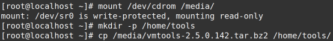

 

\#tar -jxvf /home/tools/vmtools-2.5.0.142.tar.bz2 #解压tools包

\#cd /home/tools/vmtools #切换到解压的目录

\#./install #安装

\#reboot #重启

 

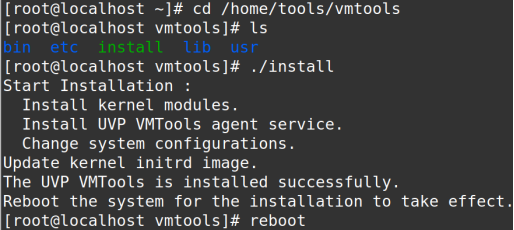

 

此时tools安装成功，获取到ip地址

 

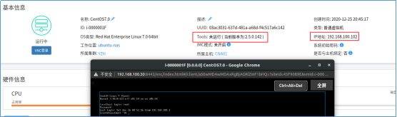

 

硬件信息也成功获取

 


 

**1.6 制作模板**

**1.6.1 Windows**

此处以Server2012为例

运行>sysprep

 

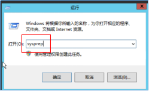

 

以管理员身份运行

 

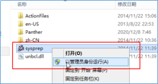

 

勾选>通用，关机选项选择>关机。然后确定

 


 

完成之后会自动关机

 


 

在虚拟机概要里面，选择更多操作>模板>转换为模板或者克隆为模板。这里选择转换

 

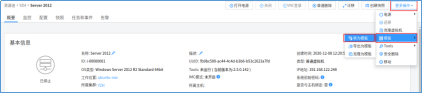

确定即可

 


 

此时即可在虚拟机模板看到模板

 


 

**1.6.2 Linux**

A:使用sys-unconfig封装

\# vim /etc/sysconfig/network-scripts/ifcfg-eth0

注释 MAC地址，UUID，打开DHCP

 


 \# vim /etc/hostname

修改主机名为：localhost.localdomain


 \#rm -rf /etc/ssh/ssh_host_*

删除ssh密钥，注意不要删错吧配置文件删了，重启sshd服务或者关机开机之后会重新生成随机的ssh密钥。

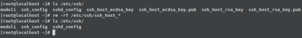

\#sys-unconfig #类似windows的 sysprep

将虚拟机转换为模板即可

B:手动封装

[root@localhost ~]# touch /.unconfig gured

[root@localhost ~]# rm -rf /etc/ssh/ssh_host_*

[root@localhost ~]# vim /etc/sysconfig/network-scripts/ifcfg-eth0

[root@localhost ~]# rm -rf /etc/udev/rules.d/70_*

[root@localhost ~]# rm -rf /var/log/*

[root@localhost ~]# hostname

localhost.localdomain

[root@localhost ~]# poweroff

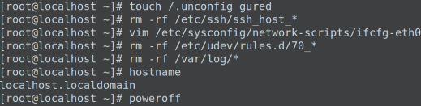

将虚拟机转换为模板即可

**1.7 备份VRM**

自动备份目录：/var/backup

手动备份目录：/var/backup/manual

配置FTP服务，备份VRM配置信息

CentOS

[root@SAN ~]# yum install -y vsftpd

[root@SAN ~]# systemctl start vsftpd

[root@SAN ~]# systemctl enable vsftpd

 

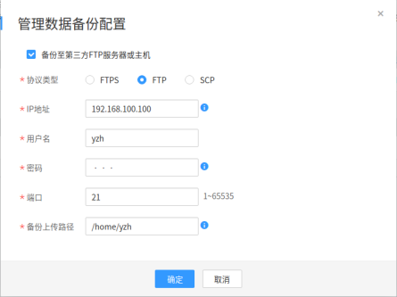

 

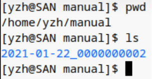

 

这种备份方式为linux中的定时任务，其配置文件可以在下面的目录进行修改

grep -ir ‘0 2’ /etc：根据内容搜索文件

VRM:~ # vim /etc/crontab #VRM中所有的定时任务配置文件

 


 

脚本位置：/opt/galax/ge_backup/bin/cronBackupUpload

**1.8 存储解关联失败解决方案**

```
存储与主机的关联异常中断，在卷被删除后，数据库中残留存储的数据未成功删除，导致无法在FusionCompute系统中删除对应数据存储信息。
解决方案： 
使用PuTTY登录VRM主节点。
 通过浮动IP地址，使用gandalf帐号登录，并切换至root帐号。
 执行以下命令，登录VRM数据库。
    #psql -U galax vrm
默认密码为“SingleLOUD!1”。
执行以下命令，查询该数据存储的ds_index信息。
   select ds_index from tbl_vs_datastore where ds_name='数据存储名称';
#不能上翻键调出，错误只能重新输入
其中数据存储名称为FusionCompute系统中对应数据存储的名称，查询到的回显信息示例如下：
根据查询到的ds_index信息，执行以下命令查询其tbl_vs_volume数据表中的卷状态。
    select vol_id,vol_status,ds_index from tbl_vs_volume where ds_index=ID;
#不能上翻键调出，错误只能重新输入,输入错误可使用“ctrl+删除”删除输入的错误
    其中ID为步骤 3查询到的ds_index取值。
    回显信息如下图所示：
查看该存储内文件信息：VRM=》select * from tbl_vs_file;
删除该磁盘内所有文件：VRM=》delete from tbl_vs_volume where ds_index=4;
在FC页面中解关联或消除该数据存储。
```

 

```
根因:
删除数据存储时，应遵循：先在FC中解关联或销毁数据存储，再在存储中接触映射，删除lun的操作顺序。
先删除存储中的lun将导致VRM报错，不能正常解关联或销毁数据存储
解决方案：
  在VRM数据库中删除对应数据存储信息，再解关联对应数据存储
```

**1.9 VRM admin密码忘记修改**

```
1. 登录vrm节点 主备环境使用浮动ip登录， 先使用gandalf登录后切换为root
“gandalf”用户的默认密码为“IaaS@OS-CLOUD9!”，“root”用户的默认密码为“IaaS@OS-CLOUD8!”
2、登录数据库 ;
       psql -U galax -W 'SingleLOUD!1'  vrm; (注：SingleLOUD!1为默认密码)
3、还原admin 密码； 默认：IaaS @PORTAL-CLOUD8!
     update sm.tbl_user set password='ed1a53af6f94d460ae36d39157e84d8bw+MJmGLcUz02' where user_id='7026';
4、 重启vrm服务； 
     service vrmd restart；
5、服务重启完成后使用默认密码登录。
```

 

 