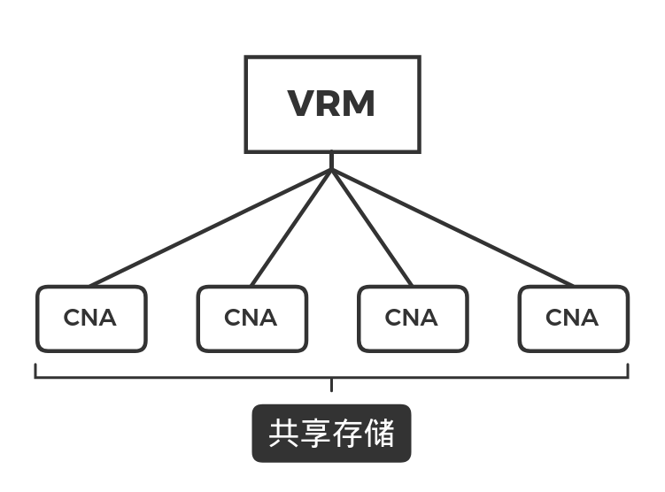

[toc]

# FusionCompute架构

FusionSphere套件：

* FusionCompute
* UItraVR
* FusionManager 

> **区别：**
> FusionSphere是一个整体套件，其中包含了FusionCompute虚拟化产品
> FusionCompute是华为的企业级别虚拟化解决方案，他不是一个单独的软件，是一堆软件的集合，其中就包含了CNA和VRM

## FusionCompute的架构

### 版本详解

FusionCompute V100R006C50SPC100 --> FusionCompute 6.5.1 

* V: Version 

* R: Rlease 

从FusionCompute 8.0.1开始，推出了FusionCompute 8.0 for ARM版本

ARM版本只能使用在ARM架构的CPU上，如果需要判断CPU架构，可以使用`uname -r` 

市面上常见的AMD和Inter的CPU都是x86架构

### VRM (virtual resource manager )

当我们通过http://访问网页的时候，开始的登陆界面是由VRM提供的，VRM是用来管理CNA的

VRM通常作为管理端来进行使用，主要用来管理CNA,用来监控CNA的。

当VRM故障的时候，我们无法使用由VRM提供的高级特性，比如DRS动态资源调度。为了防止VRM故障，我们会为VRM做主备

VRM会与CNA之间建立心跳，由心跳来监控CNA的存活状态，依此来对CNA进行自动化调度

#### VIP

我们在访问VRM页面的时候，会输入一个IP,当我们有两个VRM的时候，我们也会有两个IP地址，这样就会造成使用者的一个冲突，所以我们可以创建一个浮动IP(VIP)来作为中间人进行访问。 

例如：

* VRM1：192.168.22.11 
* VRM2：192.168.22.12 
* VIP：192.168.22.10 

用户在访问的时候，只需要去访问VIP的地址就可以，相当于是数据通信中的VRRP，也就是浮动IP

所谓浮动IP,也就是当VRM1故障的时候，链路会自动切换到VRM2的IP上，从而不影响我们业务的访问。 

### CNA (compute node agent)

CNA是用来提供计算资源和网络资源的

CNA在生产环境中只能使用物理部署

### 共享存储

共享存储是一种每个CNA都可以访问的一种共享的存储，使用共享存储可以让集群环境提高冗余性，当其中的一个CNA故障的时候，集群环境会通过DRS动态资源调度特性来进行自动故障迁移。可以把CNA中的虚拟机安装在共享存储中，这样的可以让虚拟机变得可迁移

存储设备本身是带有冗余设计，因此存储设备本身是比较安全的，如果实在担心数据安全性，可以进行存储双活设计

