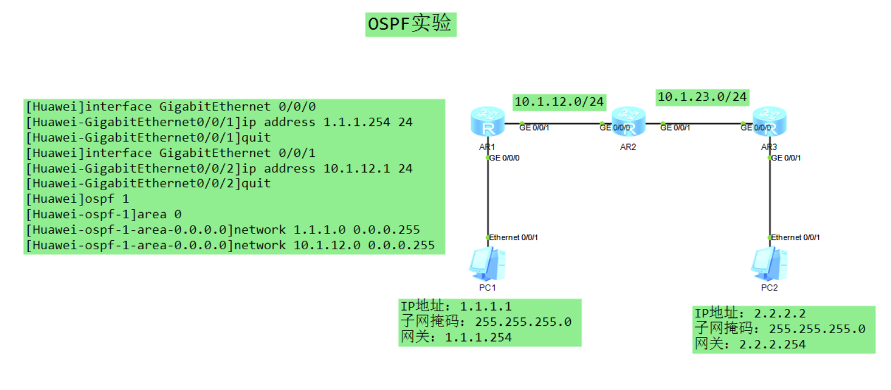

# 基础OSPF实验





## 注意：

network宣告的时候 是宣告相邻的两个网段


## 操作命令

```powershell
interface GigabitEthernet 0/0/1
ip address 192.168.1.1 30
quit
interface GigabitEthernet 0/0/2
ip address 192.168.2.1 24
quit
ospf 1
area 0
network 192.168.1.0 0.0.0.3
network 192.168.2.0 0.0.0.255
```

