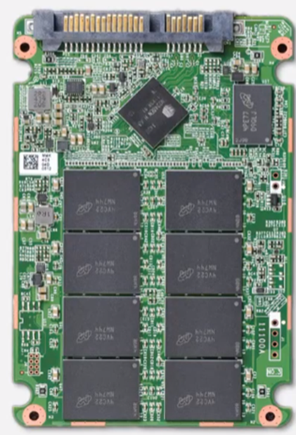
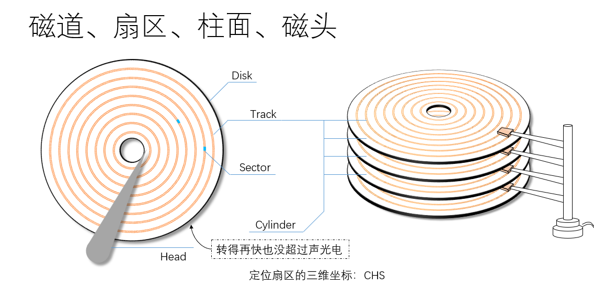

[toc]

# 存储基础

## 存储要求：

1.  数据安全 

2.  数据容量

3.  高性能 

 

## 存储的定义：

### 狭义的存储： 

*   光盘 
*   硬盘 
*   DVD 
*   U盘 

### 广义的存储： 

*   存储硬件系统 
*   存储软件 
*   存储网络 
*   存储解决方案

## 存储类型

### 盘控一体

低端设备一般都是盘控一体 因为节约成本 

盘控一体的可以扩容 扩硬盘框

### 盘控分离

控制框中所有的模块都可以热插拔

风扇模块 电源模块 

IO模块：把外部的数据写入硬盘的时候 通过IO模块来写入硬盘 接收和发送数据

设备越高端 IO模块扩展性越好 电源模块越多 

控制模块：高端设备一个控制框可以有四个控制模块 可以坏三个 最低端的也有两个 

BBU模块：解决突然断电的情况 断电之后 内存的数据就没了 紧急地把内存中的数据写入硬盘中 可以做到四个中坏一个 也可以直接数据写硬盘 不写内存 

 

### 硬盘分类

NL-SAS 

SSD

SAS

SATA

3.5寸和2.5寸 

硬盘框： 硬盘单元 级联模块 电源模块（主备做冗余）

 

SAS接口： 级联接口 

 

U：高度单位 机架上会用U为单位 

 

### 硬盘类型：

#### 机械硬盘（HDD）

##### 功能类型：

*   企业级 
*   桌面级 

##### 盘径：

*   5.25 
*   3.5 
*   2.5 
*   1.8 

##### 接口类型：

*   ATA/IDE  
*   SATA  
*   SCSI  
*   SAS  
*   FC  

##### 接口介绍：

###### 串行接口：

 串行接口是指数据一位位地顺序传送，其特点是通信线路简单，只要一对传输线就可以实现双向通信，并可以利用电话线，从而大大降低了成本，特别适用于远距离通信，但传送速度较慢(115kbps~230kbps)；

###### 并行接口：

当频率过大时，容易产生干扰
并行接口是指数据的各位同时进行传送，其特点是传输速度快(1Mbps)，但当传输距离较远、位数又多时，导致了通信线路复杂且成本提高；

接口的类型会限制硬盘的传输速率 

###### SATA：串行

 ATA的升级，SATA 6G（3.0），6G的速率需要除以10，从1.0时代到现在的3.0时代 ，SATA接口的前身是ATA接口 

MSATA接口：笔记本电脑接口 

并行： 传输速率慢 会出现传输的瓶颈 

###### SAS： 串行

SAS接口：传输更快 最高达到12Gb/s （前身是SCSI接口）

SAS是串行的SCSI接口

SAS接口可以兼容SATA接口

###### SCSI：并行

早期打印机是SCSI接口 

SCSI传输也比较慢 传输带宽是300MB/s 

##### SAS和SATA的区别

SATA：便宜 容易坏 对于企业而言 性能差 

转速：7200RPM 

SAS：构造不同 转速：10000RPM 15000RPM 

 优点：可靠性好 不容易损坏 

 缺点：性能一般

#### 固态硬盘（SSD）

固态硬盘没有活动的组件 所以叫固态硬盘 

##### SSD的特点：

*   使用闪存的技术存储信息，数据传输速度比HDD块 
*   内部没有机器结构，耗电量少，散热小，噪音小 
*   SSD的使用寿命长

##### SSD缺点： 

*   寿命较短 ：固态硬盘由于采用了闪存作为存储介质，其有限的擦写次数是一大硬伤。而机械硬盘是将数据记录在磁层上，理论上可以经受无数次的读写操作而不会有磁失效的危险，显然闪存做不到这种程度

*   数据丢失不可恢复：这是由于固态内部结构导致数据分散存储各个闪存之中，删除了就无法恢复了。

*   成本昂贵：例如1T空间容量，固态硬盘售价上千元，而机械硬盘仅要300元左右，价格相差3到4倍。

##### 接口类型：

*   SAS
*   m.2
*   SATA

##### 接口介绍：

*   m.2接口：SSD的出现 需要m.2接口来支持 速率为3.5GB/s，现存m.2的SSD是最快的

### 其他存储

*   DAS 直连附加存储 

*   FAS 网络化存储 
    *   NAS 网络附加存储 
    *   SAN 存储区域网络 

 

| 存储类型       | 概述                                                         | 优点                                                         | 缺点                                                         |
| -------------- | ------------------------------------------------------------ | ------------------------------------------------------------ | ------------------------------------------------------------ |
| SAN-块级存储   | 如同本地磁盘一般的裸设备存储，主机接管FS，分为IP-SAN和FC-SAN | 对FS以及元数据操作多，对于在本地需要频繁访问的场景提供高性能 | 自己管理数据，部署和修复略微复杂                             |
| NAS-文件级存储 | 如同共享目录一般的存储空间，存储接管FS以及提供NFS/CIFS服务   | 有网络文件系统，避免FS不同引起的不兼容，易用                 | 客户端工作主要集中在存储，在并发量大的时候性能差             |
| OBS-对象级存储 | 如同网盘后端，将文件视为对象，并且匹配唯一标识，元数据和主数据单独管理，并且主数据按照特定规则进行组合拆分存储 | 元数据和主数据分离，存储规模可扩展性强，规模大，软件对接方便 | 对人而言不算便捷，只能对应标识进行上传和下载，修改文件需要下载后在本地修改并上传 |

## 机械硬盘的组成：

### 组成部分

*   盘片：Disk
*   磁道：track
*   扇区：sector
*   柱面：cylinder
*   磁头：head 

定位一个扇区只需要CHS 也就是需要cylinder head sector 

  

一个扇区为512个字节

平均等待时间：为盘片旋转一周所需的时间的一半

例：硬盘转速为专6000R/Min，所以得出盘面转一圈的时间为60S*1000/6000=10MS，所以平均等待时间为：10MS/2=5MS。所以，平均访问时间=5MS+5MS=10MS。

### 影响机械硬盘的因素： 

*   转速 
*   寻道速度 
*   单碟容量 
*   接口速度 

### 什么是IOPS

IOPS 衡量硬盘每秒传输数据次数 

IOPS=1000ms/（寻道时间+旋转延迟+数据传输时间）

### 什么是传输带宽

传输带宽 指单位时间内成功传输的数据量 单位一般是MB/s 

### 传输带宽和IOPS的区别

IOPS就像外卖员一个小时内能送多少外卖。主要用于小IO。看重次数。

带宽就像外卖员一小时能送多少斤外卖。主要用于大IO,看重数据量。

 

 

NAS使用远程环境实验 ：

基本流程： 了解网络拓扑>配置存储>创建主机直接使用

 

登录跳板机-> 访问存储端WEB管理界面->创建文件系统->创建共享->创建逻辑端口->访问虚拟化共享平台->部署虚拟主机->直接访问或挂载共享业务地址

 

 

单盘的性能不够的话 采用多盘协同工作

可用性不足就额外添加冗余盘

 

同批次 同样型号 相同大小 完全一致的两块硬盘 一起损坏的几率会较高 

 

URE：不可恢复的读取错误

每一千万亿比特 会有一个比特是错误的 

 

 

 

 

 

 