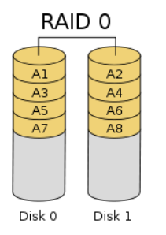
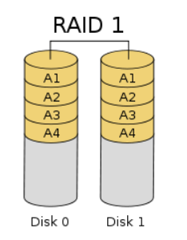
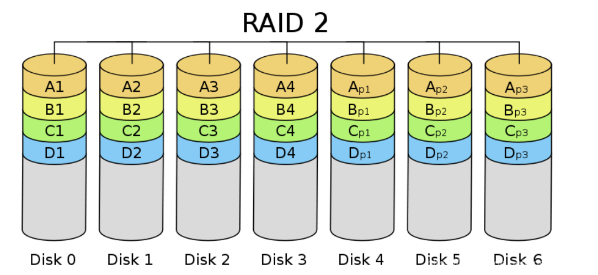
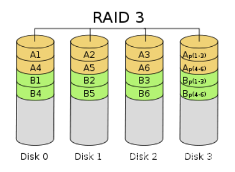
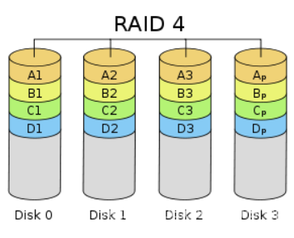
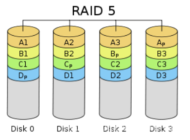
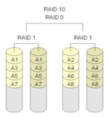
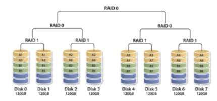
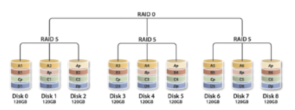
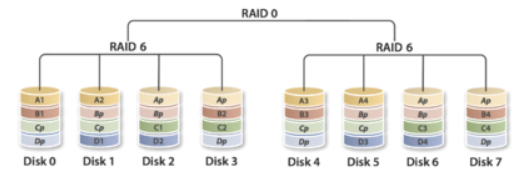

[toc]

# RAID

硬盘直接插接口可以直接被读取 

经过RAID卡之后只能看见逻辑硬盘 不能直接看见硬盘 

RAID卡开启直通模式之后 可以直接接硬盘 不需要做RAID 

当RAID不开启直通模式之后 必须要配置RAID 

 

分布式存储一般采用3副本的模式 

当服务器需要做分布式存储的时候 分布式存储自带三副本模式的备份 这时服务器在安装操作系统的时候不需要把系统盘作为RAID1 会造成资源浪费 只有做成RAID 0 才能被读取 如果不做RAID则不能被读取数据 

 

 

RAID 独立的磁盘冗余阵列 

 

硬盘是计算机发展的瓶颈

RAID是为了解决性能问题和冗余问题 

 

RAID通常使用两块以上的磁盘组成逻辑磁盘来提供容错和性能 

 

RAID可以只有一块硬盘 但是应用场景有限 不提升性能和容错 

 

条带： 硬盘中单个或者多个扇区构成一个条带 是组成分条的元素 

分条：同一硬盘阵列中的多个硬盘驱动器上相同位置的条带 

 

实现RAID有两种方式 

软件RAID 硬件RAID

## 传统RAID：

### RAID级别一览表

| **级别** | **性能**               | **容错** | **可用容量** | **磁盘数** | **适用场景**                       |
| -------- | ---------------------- | -------- | ------------ | ---------- | ---------------------------------- |
| RAID 0   | RW≈All                 | 0        | 全部         | ≥2 *       | 完全忽略可靠性的场合，个人用户     |
| RAID 1   | R≥1*，W≤1              | 1/2      | 单盘         | =2 *       | 存储少量重要数据，如数据库等       |
| RAID 5   | R≈N-1，W≤N-1           | 1        | N-1          | ≥3         | 顺序大IO较多的业务，读多写少为优   |
| RAID 6   | R≈N-2，W≤N-2           | 2        | N-2          | ≥4         | 以顺序大IO为主的重要业务，随机不适 |
| RAID 10  | RW=R0成员，并发=R1成员 | 1/2      | 1/2          | ≥4 *       | 需兼顾可靠性和性能的业务，如数据库 |
| RAID 50  | RW≈(R5成员-1) × R0成员 | R0       | N–R0         | ≥6         | RAID 5扩大规模                     |
| RAID 60  | RW≈(R6成员-2) × R0成员 | 2×R0     | N–2×R0       | ≥8         | RAID 6扩大规模                     |

### RAID 0：条带卷

条带化的磁盘阵列 

 RAID0 是把多块硬盘做成逻辑的一块盘

把数据切片来存储 

RAID0提升性能 最大的问题是不冗余 数据不安全

 

 

### RAID 1：镜像卷

磁盘由两块组成 

只能是二的倍数的块数 

提供了冗余 

但是性能收到了影响 

一般的操作系统安装在RAID1中 

操作性能不会需要太多的性能 

一般的业务也不会用RAID1 

可用空间只有一半 

 

 

### RAID 2： 海明码校验

### RAID 3：XOR异或运算

采用XOR

RAID3：同时解决了RAID1和RAID0 

带奇偶校验的条带化磁盘阵列00000

必须大于三块磁盘组成 

RAID信息存在RAID卡和硬盘中 如果其中的一个坏了 可以从另外一个里面读取RAID信息 采用了异或运算 

相同为0(假) 相异为1(真) 

可用空间是N-1 有一个盘是校验盘 

 

 

### RAID 4：有专用块级校验的数据条带

### RAID 5：平均分布的带奇偶的校验的条带化

RAID5：

打破了校验盘是瓶颈的问题 

所有的盘都可以是校验盘 

应用场景： 顺序大IO读写场景 >64k一个IO的场景 备份业务 视频监控业务等 

优缺点： 

写惩罚： 一次写操作 会带来额外的读操作 每一次写入的重构 会让校验盘进行一次重构操作 

当需要修改的数据量大于20% 的时候 不适合RAID5 

 

 

 

 

### RAID 6：DP双校验/P+Q校验

RAID6：

有两个校验盘 需要四块或者四块以上的盘组成 

可用空间是N-2

DP双校验就是采用异或运算双校验方法 

P+Q采用的是一种GF运算 由厂商定义好算法 

 

 

### RAID 10

RAID10 

RAID1和RAID0的合集，两个RAID综合起来的

最少四块盘 

两块盘做成RAID1 然后两个RAID1做成RAID0 

应用场景：

数据库OLAP 

数据库OLTP 联机事务处理 交易性系统 随机小IO数据 

适合随机小IO场景 比如数据库 <64k的数据一般为小IO数据 

 

### RAID 100 

### RAID 50 

### RAID 60

## RAID2.0+：块级虚拟化

把条带切块 切成CK 每个CK可以组成CKG 

把每个CKG再组RAID

 

当某一块硬盘发生故障的时候 故障硬盘所属的CKG的所有成员都可以参加数据重构 

 

华为的RAID2.0+就是把CKG切分为更小的extent

extent还可以切分为grain 

 

块级虚拟化技术+将数据分布到存储系统中的所有硬盘中 充分发挥出存储系统读写的能力 性能比传统的RAID更好 负载更加均衡 