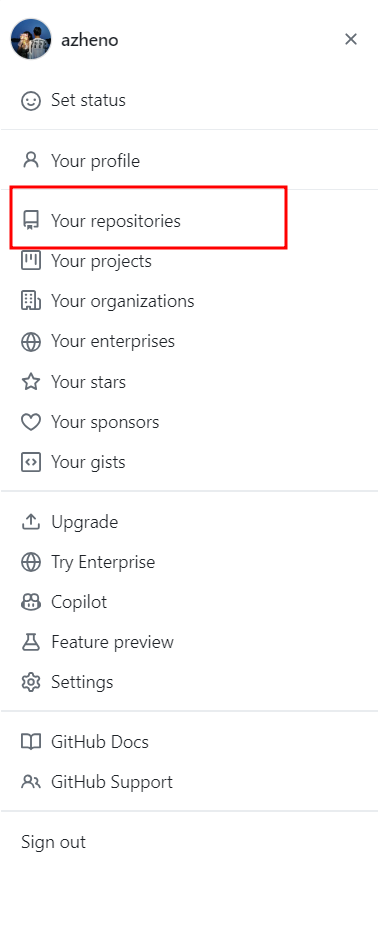
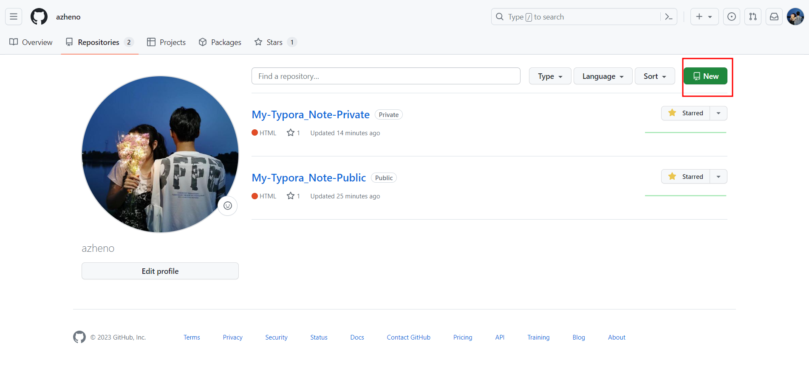
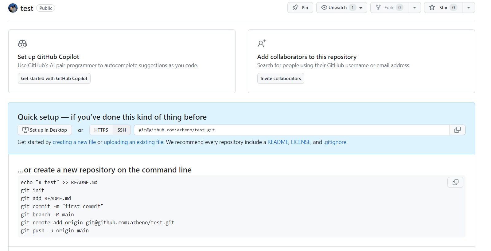
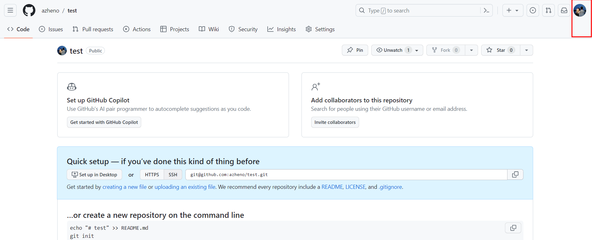
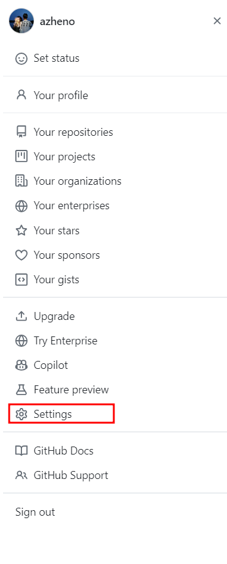
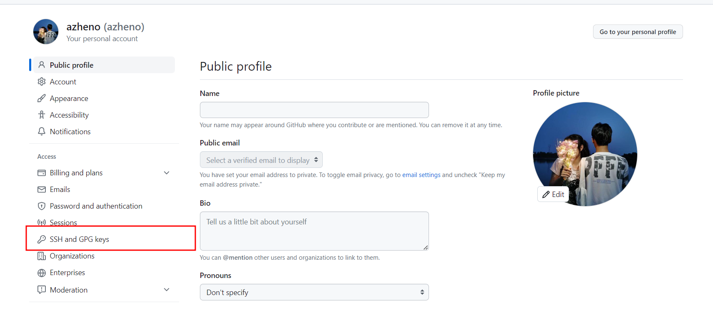
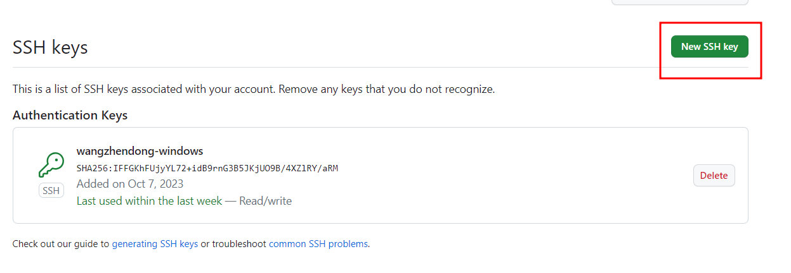
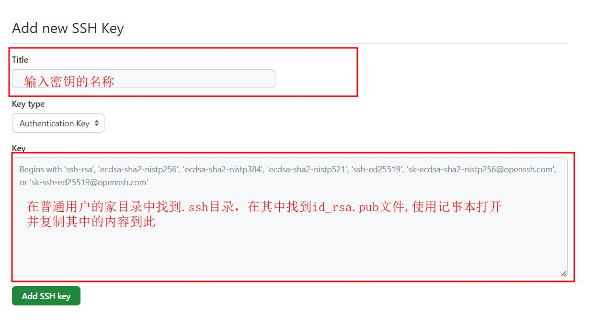
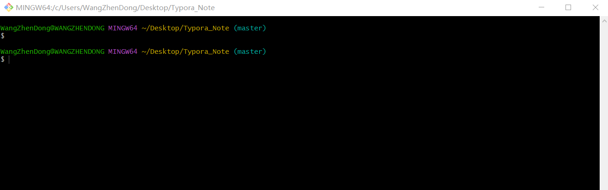
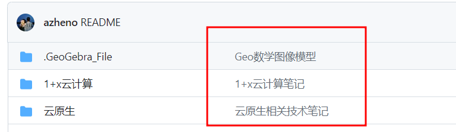

[toc]


# Git


## 对接Git仓库


### 1. 在github中创建一个repos


#### 点击头像


#### 选择your repositories 



#### 找到New，点击




#### 填写并选择对应信息，完成后点击创建


>   不要点击 Add a README file 的选项，后续可能因为结构不匹配而产生别的问题，如果需要README.md文件，可以在写项目的时候自己写上

#### 创建完成后得到如下图




### 2. 配置ssh密钥


#### 打开git bash 输入命令

```shell
ssh-keygen -t rsa -C "your github e-mail address: <xxxxx@xxxxx.com>" 
```


#### 点击头像 找到settings





#### 找到SSH and GPG keys




#### 点击New SSH key 创建新的密钥



#### 输入需要创建密钥的信息，点击创建



### 3. 上传项目


#### 在需要上传项目的目录中打开git bash，并准备上传





#### 初始化项目

```shell
git init  # 初始化需要上传的项目，初始化结束之后会生成一个.git目录
```

>   第一次上传需要填写用户名和邮箱 

```shell
git config --global user.email "xxxx@xxxx.com"  # 填写github的邮箱
git config --global user.name "xxxx" 	# 填写github的用户名
```


#### 将需要上传的项目添加进缓冲区

```shell
git add .  # .的含义是将当前目录中的全部内容都添加进入缓冲区 
		   # . 可以被替换为任意一个路径
```

>   **PS** : git的原理是先将项目添加进入缓冲区，然后通过分支比对来判断是否修改过，进而再次上传覆盖原先操作，以达到版本控制的效果，因此add的操作并不是上传到了github仓库中，只是上传到了缓冲区中而已 


#### 为上传的项目给一个上传说明

```shell
git commit -m "xxxxx" # 其中xxxx为说明信息，也就是在github中项目名后面的解释内容
```



#### 关联github仓库

```shell
git remote add xxxx xxx@xxxx.git  # 其中第一个需要填写的内容是仓库的别名，第二个填写内容跟是仓库的git地址或者是ssh地址
```

>   注意：第一次关联的时候推荐使用ssh地址，以免出现问题


#### 上传项目

```shell
git push -u xxxx master  # 其中需要填写的内容是你的仓库别名，master为默认分支的名称，第一次上传的时候需要添加-u选项，以免出现意外
```


>   注意： 
>
>   在重复上传的时候，需要精确到自己修改的最小一级的目录以此来保证自己修改的真实性，以免系统识别不到修改
