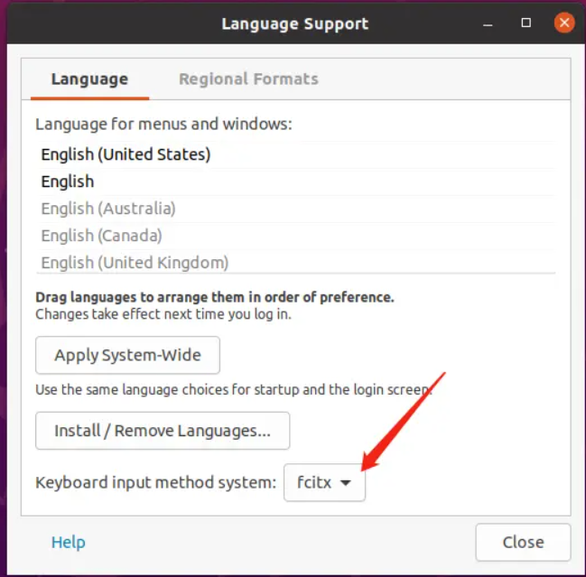
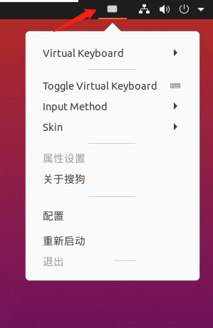
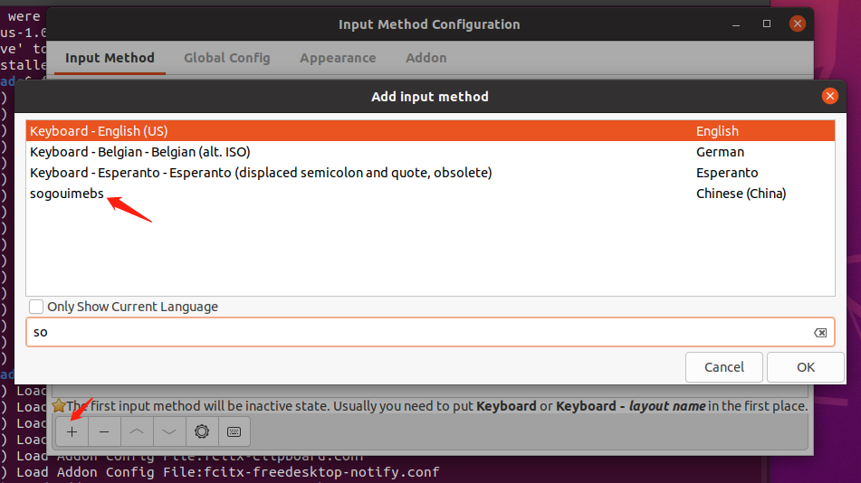

# 步骤


## 1.  安装fcitx

```shell
sudo apt update
sudo apt install fcitx   
```


## 2. 


## 3. 



## 4.设置fcitx开机自启

```shell
sudo cp /usr/share/applications/fcitx.desktop /etc/xdg/autostart/
```


## 5.卸载ibus框架

```shell
sudo apt purge ibus
```


## 6.安装

```shell
sudo dpkg -i sogo.deb 
```


## 7.安装依赖

```shell
sudo apt install libqt5qml5 libqt5quick5 libqt5quickwidgets5 qml-module-qtquick2
sudo apt install libgsettings-qt1
reboot 
```


## 8.



## 9.

