# 安装系统时无法读取到硬盘

记一次安装系统时无法读到硬盘的故障处理以及方案 

## 依赖软件 

存放在../.依赖软件/RST_V19.1.0.1001_PV .zip

## 背景：

在执行重装dell笔记本电脑系统的时候，进入到了windows安装程序却发现无法识别到硬盘，期初是以为U盘启动项制作问题，但是换了WePE之后发现仍然不行 

## 解决方案：

[原文连接](https://rog.asus.com.cn/support/faq/1044458)

1. 请先下载**Intel Rapid Storage Technology (IRST)****驱动程序**，[下载连结](https://dlcdnets.asus.com/pub/ASUS/GamingNB/FX507ZE/RST_V19.1.0.1001_PV.zip)。
2. 下载完成后，鼠标右键点击**[RST_V19.1.0.1001_PV]****压缩文件**并选择**[****全部解压缩****]**。
   
    **注**: 以下版本号码与图片仅供示意参考，当您点击上述的下载连结时，将会自动下载最新版本的驱动程序。
    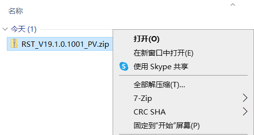
3. 选择**[****浏览****]**并点选**[****提取****]**。
    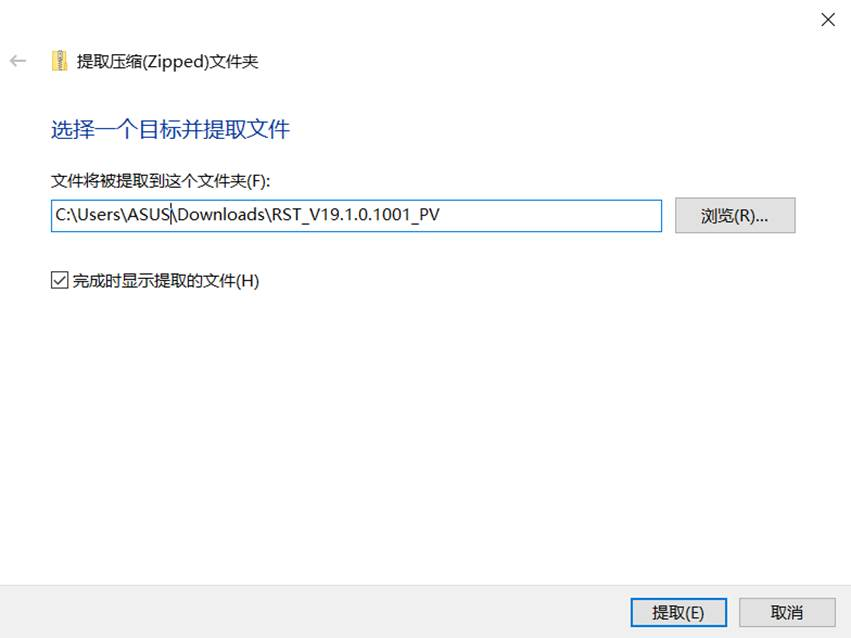

 

1. 解压缩完成后，请将解压缩后的文件夹**(RST_V19.1.0.1001_PV)**整个复制到U盘。
    如果您的Windows 11/10安装媒体也是使用U盘，请将此文件夹复制到Windows 11/10安装媒体的U盘。
    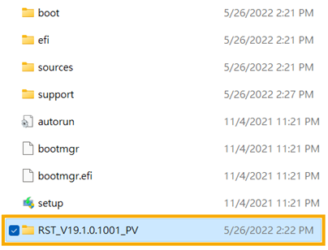

 

**安装****Intel Rapid Storage Technology (IRST)****驱动程序**

1. 将包含Windows 11/10安装媒体及Intel Rapid Storage Technology (IRST)驱动程序**(RST_V19.1.0.1001_PV****文件夹****)**的U盘连接至计算机。(如果您是用Windows 11/10光盘进行安装，请将光盘与上述档案所放置的U盘一并插入计算机)
   
    **注**: 以下版本号码与图片仅供示意参考，当您点击上述的下载连结时，将会自动下载最新版本的驱动程序。
2. 再次进行Windows 11/10安装流程，了解更多[如何通过安装媒体安装Windows 11/10](https://www.asus.com.cn/support/FAQ/1039507/)。
3. 在**您要在哪里安装****Windows**的画面找不到任何磁盘驱动器时，请点选**[****加载驱动程序****]**①。
    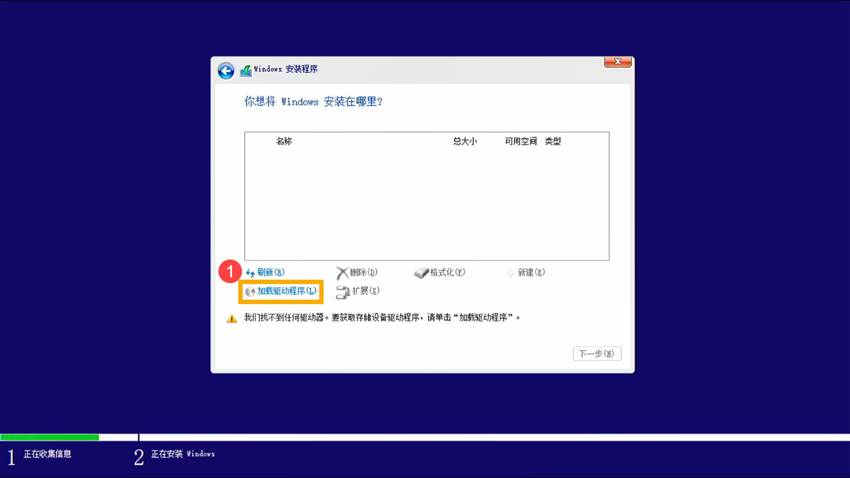
4. 点选**[****确定****]**②。
    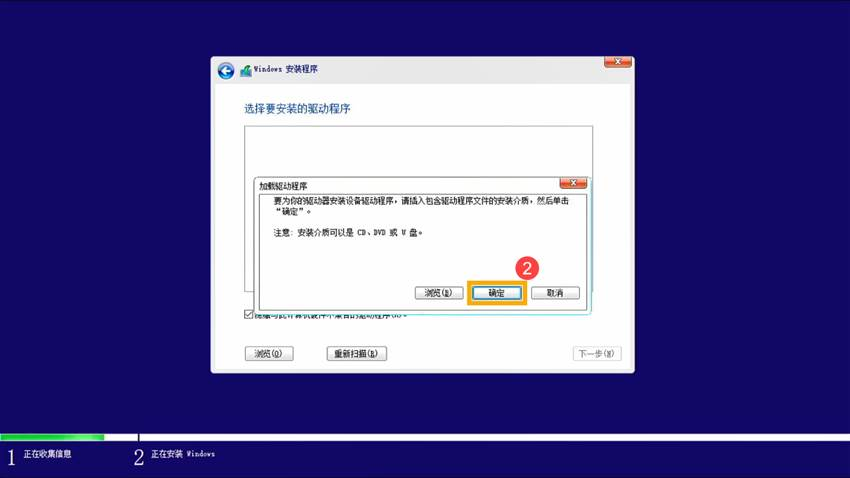
5. 点击**[****确定****]**③。
    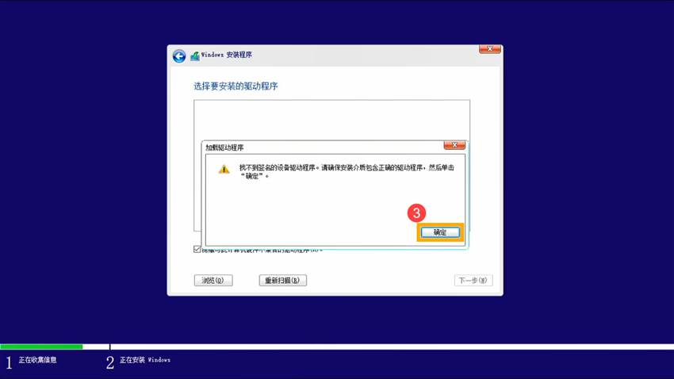
6. 点选**[****浏览****]**④，找到**[RST_V19.1.0.1001_PV]**文件夹⑤，然后点选**[****确定****]**⑥。
    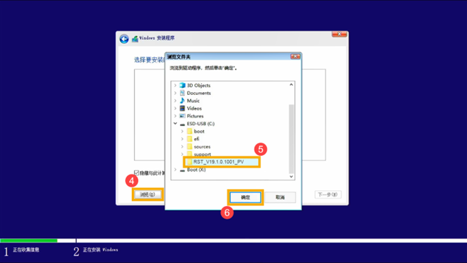
7. 选择**[Intel RST VMD Controller 9A08 (TGL) ]**⑦，然后点选**[****下一步****]**⑧将会开始安装驱动程序。
    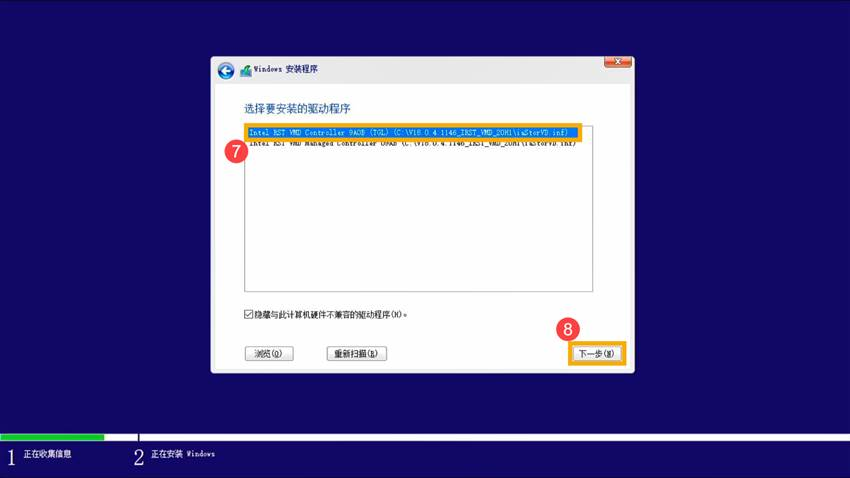
8. 驱动程序安装完成后，磁盘驱动器即可正常显示。
    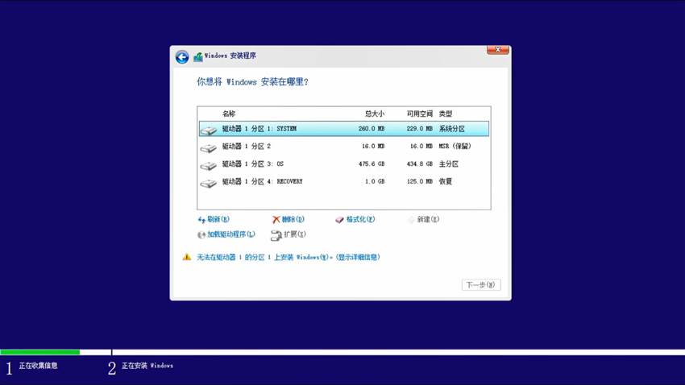

若是以上方法仍无法解决您的问题，你可以参考以下 **关闭****Intel Volume Management Device (VMD)****技术** 以继续安装Windows。

 

**关闭****Intel Volume Management Device (VMD)****技术**

**注**: 关闭VMD技术将会导致您的计算机无法使用RAID磁盘阵列。

1. 请先将您的计算机进入BIOS设置画面。在计算机未开机时，先**按住键盘上的****[F2]****键********不放**，然后再单击**电源键**即可进入BIOS设置画面。了解更多[如何进入BIOS设置画面](https://www.asus.com/cn/support/FAQ/1008829/)。
2. 进入BIOS设置画面后，单击键盘上的**[F7]****键**，或是您也可以点选画面上的**[Advanced Mode]**①。
    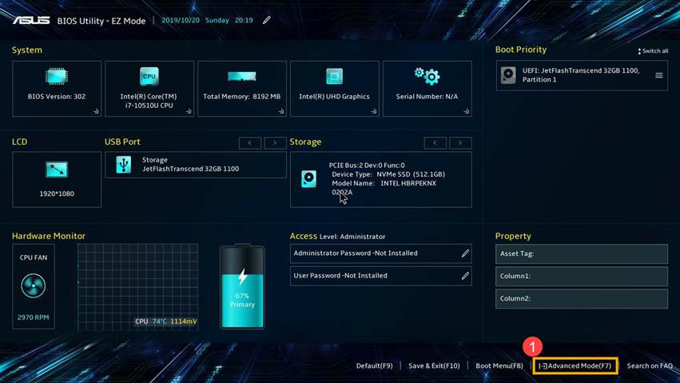

1. 进入**[Advanced]**页面②，然后点选**[VMD setup menu]**③。
    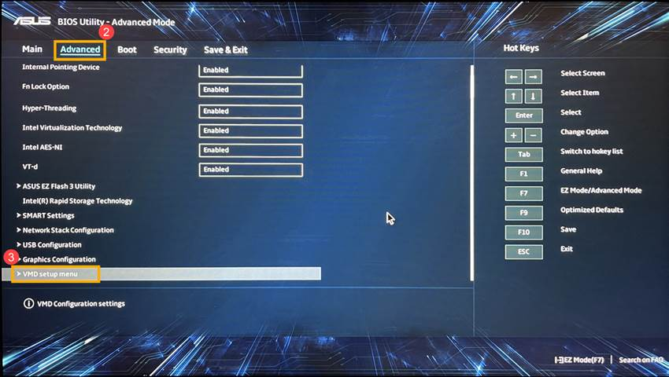

1. 选择**[Enable VMD controller]**④，然后选择**[Disabled]**⑤。
    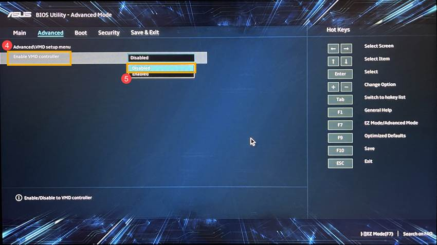

1. 点选**[Ok]**⑥即可关闭Intel Volume Management Device (VMD)技术。
    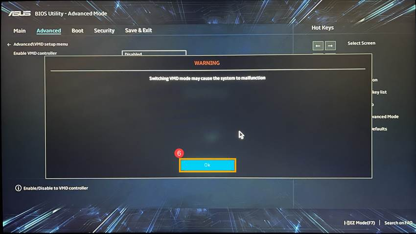

1. 保存设置并离开。单击键盘上的**[F10]****键**，然后点选**[Ok]**⑦，计算机将会重新启动。随后您即可在Windows 11/10安装过程中找到本机使用的磁盘驱动器，了解更多[如何通过安装媒体安装Windows 11/10](https://www.asus.com/cn/support/FAQ/1039507/)。
    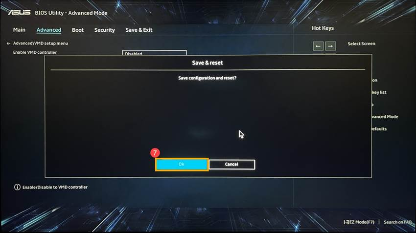

 

