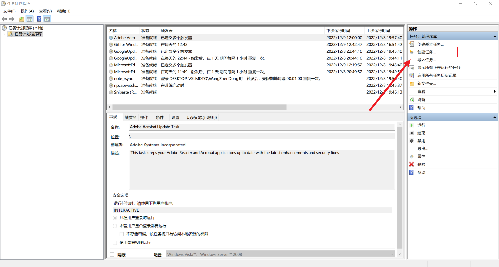
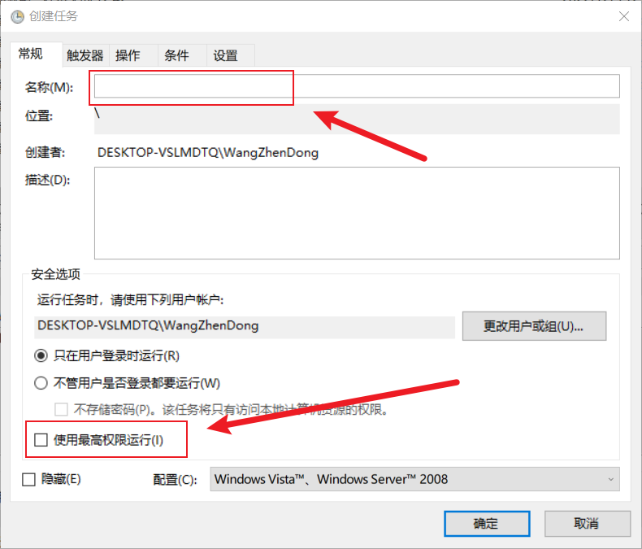
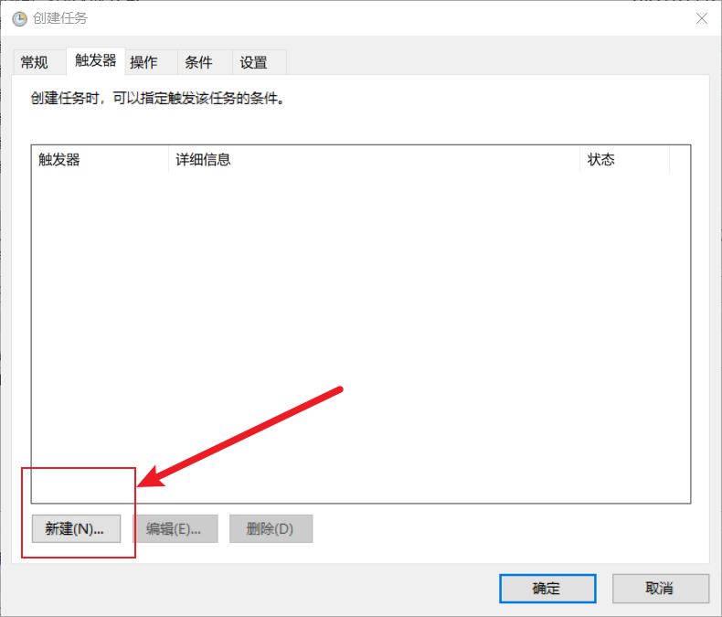
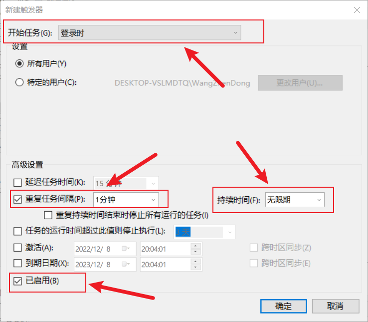

# 笔记同步教程


## 使用原理： 

将Windows端笔记向U盘中进行实时同步，再由硬盘中的数据向另一台电脑中同步以达到离线跨设备实时同步的功能

U盘插上，编写笔记，即可进行每分钟同步


## Windows端


### 功能介绍

本教程用于离线笔记同步

需要硬件： U盘一个

需要软件： fastcopy、typora


### 具体原理：

使用fastcopy软件对笔记文件向U盘中进行同步，fastcopy自带命令行同步功能，可以编写自动化脚本。 


### 1. 编写脚本

本功能使用bat脚本，以及vbs脚本，以此来控制文件的同步和挂后台的操作。 

实现脚本如下： 

```powershell
# typora_note_rsync.bat: 控制了同步功能
if exist Z:\ "D:\FastCopy\FastCopy.exe" /cmd=sync /force_close   "C:\Users\WangZhenDong\Desktop\Typora_Note" /to="Z:\Typora"

# start_no_cmd.vbs：控制了弹窗功能
set ws=WScript.CreateObject("WScript.Shell")
ws.Run "D:\Note_rsync\typora_note_rsync.bat",0
```


### 2. 使用Windows原生计划任务来控制分钟级同步


#### 1）首先创建任务




#### 2）填写任务名称和设置管理员权限




#### 3）新建触发器




#### 4）设置计划任务登录时作为触发器，从登录开始每隔一分钟重复一次计划。



至此 windows端向U盘中自动同步文件成功。 


## Linux端

