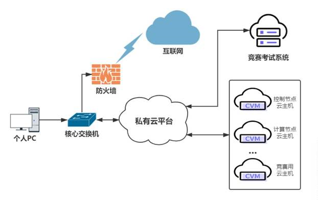
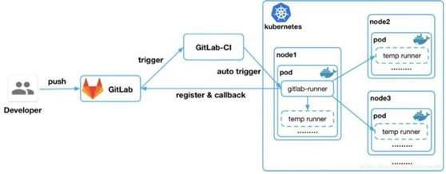

[toc]


# 2022 年全国职业院校技能大赛高职组云计算赛项


## 【赛程名称】云计算赛项第一场-私有云


某企业拟使用 OpenStack 搭建一个企业云平台，以实现资源池化弹性管理、企业应用集  中管理、统一安全认证和授权等管理。 

系统架构如图 1 所示，IP 地址规划如表 1 所示。 




| 设备名称                  | 主机名     | 接口     | IP地址         | 说明   |
| ------------------------- | ---------- | -------- | -------------- | ------ |
| 云服务器1                 | Controller | eth0     | 172.129.x.0/24 | Vlan x |
| eth1                      | 自定义     | 自行创建 |                |        |
| 云服务器2                 | Compute    | eth0     | 172.129.x.0/24 | Vlan x |
| eth1                      | 自定义     | 自行创建 |                |        |
| 云服务器3  ...  云服务器n | 自定义     | eth0     | 172.129.x.0/24 |        |
| PC-1                      |            | 本地连接 | 172.24.16.0/24 | PC使用 |

说明： 

1.   竞赛使用集群模式进行，比赛时给每个参赛队提供独立的租户与用户，各用户的资源  配额相同，选手通过用户名与密码登录竞赛用私有云平台，创建云主机进行相应答题； 

2.   表中的 x 为工位号；在进行 OpenStack 搭建时的第二块网卡地址根据题意自行创建； 

3.   根据图表给出的信息，检查硬件连线及网络设备配置，确保网络连接正常； 
4.    考试所需要的账号资源、竞赛资源包与附件均会在考位信息表与设备确认单中给出； 
5.   竞赛过程中，为确保服务器的安全，请自行修改服务器密码；在考试系统提交信息时，  请确认自己的 IP 地址，用户名和密码。 


### 【任务 **1**】私有云服务搭建**[10** 分**]** 

### 【适用平台】私有云


#### 【题目 1】基础环境配置[0.5 分]

使用提供的用户名密码，登录提供的 OpenStack 私有云平台，在当前租户下，使用  CentOS7.9 镜像，创建两台云主机，云主机类型使用 4vCPU/12G/100G_50G 类型。当前租户  下默认存在一张网卡，自行创建第二张网卡并连接至 controller 和 compute 节点（第二张网  卡的网段为 10.10.X.0/24，X 为工位号，不需要创建路由）。自行检查安全组策略，以确保  网络正常通信与 ssh 连接，然后按以下要求配置服务器： 

（1）设置控制节点主机名为 controller，设置计算节点主机名为 compute； 

（2）修改 hosts 文件将 IP 地址映射为主机名； 

完成后提交控制节点的用户名、密码和 IP 地址到答题框。


-   [ ] 1.查看控制节点名字为 controller 正确计 0.2 分 
-   [ ] 2.查看 hosts 文件中有正确的主机名和 IP 映射计 0.2 分 
-   [ ] 3.控制节点正确使用两块网卡计 0.1 分 

```shell
#controller 
hostnamectl set-hostname controller 

#compute 
hostnamectl set-hostname compute 

#all 
cat >> /etc/hosts << EOF 
172.129.12.10  controller 
172.129.12.20 compute
EOF
```


#### 【题目 2】Yum 源配置[0.5 分] 

使用提供的 http 服务地址，在 http 服务下，存在 centos7.9 和 iaas 的网络 yum 源，使用  该 http 源作为安装 iaas 平台的网络源。分别设置 controller  节点和 compute 节点的 yum 源文  件 http.repo。完成后提交控制节点的用户名、密码和 IP 地址到答题框。 


-   [ ]   1.查看/etc/yum.repos.d/http.repo 文件，有正确的 baseurl 路径，计 0.5  分 

```shell
#直接删除默认源
rm -rf /etc/yum.repos.d/*

#创建http类型的yum源
cat > /etc/yum.repos.d/http.repo <<EOF
[centos]
name=centos
baseurl=http://10.18.4.46/centos
gpgcheck=0
enabled=1
[iaas]
name=iaas
baseurl=http://10.18.4.46/iaas/iaas-repo
gpgcheck=0
enabled=1
EOF

#可以通过来验证源的配置是否正确
yum makecache
```


####  【题目 3】配置无秘钥 ssh[0.5 分] 

配置 controller 节点可以无秘钥访问 compute 节点，配置完成后，尝试 ssh 连接 compute  节点的 hostname 进行测试。完成后提交 controller 节点的用户名、密码和 IP 地址到答题框。 


-   [ ]   1.查看控制节点允许计算节点无秘钥登录计 0.5 分 

```shell
#all node
#生成密钥，回显默认全部回车即可
ssh-keygen

#传输密钥
ssh-copy-id controller
ssh-copy-id compute

#测试尝试连接compute
ssh compute
```


#### 【题目 4】基础安装[0.5 分]  

  在控制节点和计算节点上分别安装 openstack-iaas  软件包，根据表 2 配置两个节点脚本  文件中的基本变量（配置脚本文件为/etc/openstack/openrc.sh）。  

| 服务名称         | 变量               | 参数/密码 |
| ---------------- | ------------------ | --------- |
| Mysql            | root               | 000000    |
| Keystone         | 000000             |           |
| Glance           | 000000             |           |
| Nova             | 000000             |           |
| Neutron          | 000000             |           |
| Heat             | 000000             |           |
| Zun              | 000000             |           |
| Keystone         | DOMAIN_NAME        | demo      |
| Admin            | 000000             |           |
| Rabbit           | 000000             |           |
| Glance           | 000000             |           |
| Nova             | 000000             |           |
| Neutron          | 000000             |           |
| Heat             | 000000             |           |
| Zun              | 000000             |           |
| Neutron          | Metadata           | 000000    |
| External Network | enp9s0（外网卡名） |           |

  完成后提交控制节点的用户名、密码和 IP 地址到答题框。  


-   [ ]   1.检查环境变量文件配置正确计 0.5 分  

```shell
###0.提前准备
#分区
#在 compute 节点上利用空白分区划分 2个 20G 分区作为cinder与swift的存储
#划分1个5G的硬盘做为manila1的存储，见题目11
#划分1个5G的硬盘做为cinder扩展磁盘，见题目12
#分区也可以使用fdisk
    parted /dev/vdb
    (parted) mklabel gpt
    (parted) mkpart a 0% 40%  
    (parted) mkpart b 40% 80%  
    (parted) mkpart c 80% 90% 
     (parted) mkpart d 90% 100% 
    (parted) quit 

###1.安装openstack-iaas来生成openrc.sh与脚本
yum -y install openstack-iaas

###2.编辑环境变量，简化脚本
#使用vi底行模式，正则表达式如下
:%s@##.@@g	#删除文件中开头##的所在行
:%s@#@@g		#删除文件中开头的#
:g@^$@d		#删除文件中所有的空行
:$s/PASS=/PASS=000000/g  #快速配置文件中个服务组件的password

#环境变量文件示例
HOST_IP=10.18.4.100			#controller ip address，按照实际环境来
HOST_PASS=000000
HOST_NAME=controller
HOST_IP_NODE=10.18.4.200		#compute ip address，按照实际环境来
HOST_PASS_NODE=000000
HOST_NAME_NODE=compute
network_segment_IP=10.24.1.0/24		
RABBIT_USER=openstack
RABBIT_PASS=000000
DB_PASS=000000
DOMAIN_NAME=demo
ADMIN_PASS=000000
DEMO_PASS=000000
KEYSTONE_DBPASS=000000
GLANCE_DBPASS=000000
GLANCE_PASS=000000
PLACEMENT_DBPASS=000000
PLACEMENT_PASS=000000
NOVA_DBPASS=000000
NOVA_PASS=000000
NEUTRON_DBPASS=000000
NEUTRON_PASS=000000
METADATA_SECRET=000000
INTERFACE_NAME=ens34
Physical_NAME=provider
minvlan=1
maxvlan=200
CINDER_DBPASS=000000
CINDER_PASS=000000
BLOCK_DISK=sdb1
SWIFT_PASS=000000
OBJECT_DISK=sdb2
STORAGE_LOCAL_NET_IP=10.18.4.200 	#compute IP
TROVE_DBPASS=000000
TROVE_PASS=000000
HEAT_DBPASS=000000
HEAT_PASS=000000
CEILOMETER_DBPASS=000000
CEILOMETER_PASS=000000
AODH_DBPASS=000000
AODH_PASS=000000
ZUN_DBPASS=000000
ZUN_PASS=000000
KURYR_PASS=000000
OCTAVIA_DBPASS=000000
OCTAVIA_PASS=000000
MANILA_DBPASS=000000
MANILA_PASS=000000
SHARE_DISK=sdb3				    #manila—Disk
CLOUDKITTY_DBPASS=000000
CLOUDKITTY_PASS=000000
BARBICAN_DBPASS=000000
BARBICAN_PASS=000000

###首先执行初始化包###
(all node)
iaas-pre-host.sh

###3.controller node执行
iaas-install-mysql.sh && iaas-install-keystone.sh && iaas-install-glance.sh && iaas-install-placement.sh && iaas-install-nova-controller.sh && iaas-install-neutron-controller.sh && iaas-install-dashboard.sh   &&  iaas-install-cinder-controller.sh && iaas-install-swift-controller.sh  && iaas-install-heat.sh && iaas-install-manila-controller.sh && iaas-install-cloudkitty.sh

###4.compute node 执行
#提示：当控制节点在部署脚本的时候，计算节点也别闲着，可以为其安装相应的包
cat /usr/local/bin/iaas-*compute.sh | grep yum 

#然后将如上罗列出来的内容全部安装后，等待controller节点的脚本执行后，执行如下内容
iaas-install-nova-compute.sh  && iaas-install-neutron-compute.sh && iaas-install-cinder-compute.sh && iaas-install-swift-compute.sh && iaas-install-manila-compute.sh 

```


#### 【题目 5】数据库安装与调优[0.5 分]  

在 controller 节点上使用 iaas-install-mysql.sh 脚本安装 Mariadb、Memcached、RabbitMQ  等服务。安装服务完毕后，修改/etc/my.cnf 文件，完成下列要求：  

1.   设置数据库支持大小写；  

2.   设置数据库缓存 innodb 表的索引，数据，插入数据时的缓冲为 4G；  
3.   设置数据库的 log buffer 为 64MB；  

4.   设置数据库的 redo log 大小为 256MB；  

5.   设置数据库的 redo log 文件组为 2。  

  完成后提交控制节点的用户名、密码和 IP 地址到答题框。  


-   [ ]   1.检查数据库配置正确计 0.5 分  

```shell
#可以快速定位参数
mysql -uroot -p000000
MariaDB [(none)]>  show variables like 'innodb_log%';

vim /etc/my.cnf
#数据库支持大小写
lower_case_table_names =1
#数据库缓存
innodb_buffer_pool_size = 4G
#数据库的log buffer即redo日志缓冲
innodb_log_buffer_size = 64MB
#设置数据库的redo log即redo日志大小
innodb_log_file_size = 256MB
#数据库的redo log文件组即redo日志的个数配置
innodb_log_files_in_group = 2
```


#### 【题目 6】Keystone 服务安装与使用[0.5 分]

在 controller 节点上使用 iaas-install-keystone.sh 脚本安装 Keystone 服务。安装完成后，  使用相关命令，创建用户 chinaskill，密码为 000000。完成后提交控制节点的用户名、密码  和 IP 地址到答题框。   


-   [ ] 1.检查 keystone 服务安装正确计 0.2 分  
-   [ ] 2.检查 chinaskill 用户创建正确计 0.3 分

```shell
#导入环境变量
source /etc/keystone/admin-openrc.sh 
#创建用户
openstack user create --password 000000 chinaskill
```


#### 【题目 7】Glance 安装与使用[0.5 分]

在 controller 节点上使用 iaas-install-glance.sh 脚本安装 glance 服务。使用命令将提供  的 cirros-0.3.4-x86_64-disk.img 镜像（该镜像在 HTTP 服务中，可自行下载）上传至平台，  命名为 cirros，并设置最小启动需要的硬盘为 10G，最小启动需要的内存为 1G。完成后提交  控制节点的用户名、密码和 IP 地址到答题框。  


-   [ ] 1.检查 glance 服务安装正确计 0.1 分  

-   [ ] 2.检查 cirros 镜像最小启动硬盘与内存配置正确计 0.4 分

```shell
#下载镜像
curl -O http://10.18.4.100/cirros-0.3.4-x86_64-disk.img

#创建符合要求的镜像
openstack image create --min-disk 10 --min-ram 1 --file cirros-0.3.3-x86_64-disk.img  cirros
```


#### 【题目 8】Nova 安装与优化[0.5 分]

在 controller 节点和 compute 节点上分别使用 iaas-install-placement.sh 脚本、  iaas-install-nova -controller.sh 脚本、iaas-install-nova-compute.sh 脚本安装 Nova 服务。安装完  成后，请修改 nova 相关配置文件，解决因等待时间过长而导致虚拟机启动超时从而获取不  到 IP 地址而报错失败的问题。配置完成后提交 controller 点的用户名、密码和 IP 地址到答题框。  


-   [ ] 1.检查 nova 服务解决超时问题配置正确计 0.5  分  

```shell
#关键字是
cat /etc/nova/nova.conf |grep vif_plugging_is_fatal
vif_plugging_is_fatal=false

#重启nova-*
systemctl restart openstack-nova*
```


#### 【题目 9】Neutron 安装[0.5 分]

使用提供的脚本 iaas-install-neutron-controller.sh 和 iaas-install-neutron-compute.sh，在  controller 和 compute 节点上安装 neutron 服务。完成后提交控制节点的用户名、密码和 IP  地址到答题框。  


-   [ ] 1.检查 neutron 服务安装正确计 0.2 分  
-   [ ] 2.检查 neutron 服务的 linuxbridge 网桥服务启动正确计 0.3 分

```shell
# 默认已经结束
```


#### 【题目 10】Doshboard 安装[0.5 分]

在controller节点上使用iaas-install-dashboad.sh脚本安装dashboad服务。安装完成后，  将 Dashboard 中的 Djingo 数据修改为存储在文件中（此种修改解决了 ALL-in-one 快照在其  他云平台 Dashboard 不能访问的问题）。完成后提交控制节点的用户名、密码和 IP 地址到  答题框。  


-   [ ] 1.检查 Dashboard 服务安装正确计 0.2  分  
-   [ ] 2.检查 Dashboard 服务中 Djingo 数据修改为存储在文件中配置正确计 0.3 分
```shell
#根据题意找线索，是关于django的数据，这个单词他写错了，就检索出来所有关于他的配置
#会发现有一行
#SESSION_ENGINE = 'django.contrib.sessions.backends.cache'存在cache里，改一改就行。

cat /etc/openstack-dashboard/local_settings |grep django
SESSION_ENGINE = 'django.contrib.sessions.backends.file'

#重启服务生效配置
systemctl restart httpd
```


#### 【题目 11】Swift 安装[0.5 分]

在 控 制 节 点 和 计 算 节 点 上 分 别 使 用 iaas-install-swift-controller.sh 和  iaas-install-swift-compute.sh 脚本安装 Swift 服务。安装完成后，使用命令创建一个名叫  examcontainer 的容器，将 cirros-0.3.4-x86_64-disk.img 镜像上传到 examcontainer 容器中，并  设置分段存放，每一段大小为 10M。完成后提交控制节点的用户名、密码和 IP 地址到答题框。  


-   [ ] 1.检查 swift 服务安装正确计 0.3 分  2.分段上传 cirros 镜像正确计 0.2 分  
```shell
#通过命令行创建容器
openstack container create examcontainer
openstack container list

#下载镜像
curl -O http://10.18.4.46/cirros-0.3.4-x86_64-disk.img

#swfit切片上传cirros
swift upload examcontainer -S 10000000 cirros-0.3.4-x86_64-disk.img
swift stat examcontainer cirros-0.3.4-x8664-disk.img
```


####  【题目 12】Cinder 创建硬盘[0.5 分]

在 控 制 节 点 和 计 算 节 点 分 别 使 用 iaas-install-cinder-controller.sh 、  iaas-install-cinder-compute.sh 脚本安装 Cinder 服务，请在计算节点，对块存储进行扩容操作，  即在计算节点再分出一个 5G 的分区，加入到 cinder 块存储的后端存储中去。完成后提交计  算节点的用户名、密码和 IP 地址到答题框。  


-   [ ]   1.检查 cinder 后端存储扩容成功计 0.5 分  
```shell
#创建物理卷
pvcreate /dev/vdb4

#扩展cinder-volume卷组
vgextend cinder-volumes /dev/vdb4

#验证
[root@compute ~]# vgdisplay
```


####  【题目 13】Manila 服务安装与使用[0.5 分]

在 控 制 和 计 算 节 点 上 分 别 使 用 iaas-install-manila-controller.sh和iaas-install-manila-compute.sh 脚本安装 manila 服务。安装服务后创建 default_share_type 共享  类型（不使用驱动程序支持），接着创建一个大小为 2G 的共享存储名为 share01 并开放  share01 目录对 OpenStack 管理网段使用权限。最后提交控制节点的用户名、密码和 IP 地址到答题框。  


-   [ ] 1.检查 share01 共享存储正确创建并赋予权限计 0.5 分  
```shell
#创建不适用驱动程序支持的default_share_type共享类型
manila type-create default_share_type False

#创建共享卷
manila create NFS 2 --name share01

#开放share01目录对OpenStack管理网段使用权限
manila access-allow share01 ip 10.18.4.0/24 --access-level rw

#验证
manila type-list
manila list
```


####  【题目 14】Barbican 服务安装与使用[0.5 分]

使用 iaas-install-barbican.sh 脚本安装 barbican 服务，安装服务完毕后，使用 openstack  命令创建一个名为 secret01 的密钥，创建完成后提交控制节点的用户名、密码和 IP 地址到  答题框。  


-   [ ] 1.检查 secret01 密钥创建正确计 0.5 分  
```shell
#导入环境变量
source /etc/keystone/admin-openrc.sh 

#创建密钥
openstack secret store --name secret01 --payload secretkey 
```


#### 【题目 15】Cloudkitty 服务安装与使用[1 分]

使用 iaas-install-cloudkitty.sh 脚本安装 cloudkitty 服务，安装完毕后，启用 hashmap 评级  模块，接着创建 volume_thresholds 组，创建服务匹配规则 volume.size，并设置每 GB 的价  格为 0.01。接下来对应大量数据设置应用折扣，在组 volume_thresholds 中创建阈值，设置  若超过 50GB 的阈值，应用 2%的折扣（0.98）。设置完成后提交控制节点的用户名、密码  和 IP 地址到答题框。  


-   [ ]  1.检查 hashmap 评级模块启用成功计 0.2  分  

-   [ ]  2.检查服务匹配规则 volume.size 创建成功 0.8 分  
```shell
#0.启用hashmap
[root@controller ~]# openstack rating module enable hashmap 

#1.创建hashmap service
[root@controller ~]# openstack rating  hashmap service create volume.size 
+--------+--------------------------------------+
| Name   | Service ID                           |
+--------+--------------------------------------+
| volume.size | 09da4a8b-b849-4715-a8e3-7cd12dfcf46e |
+--------+--------------------------------------+

#2.创建hashmap service group
[root@controller ~]# openstack rating hashmap group create  volume_thresholds 
openstack rating hashmap group create  volume_thresholds 
+-------------------+--------------------------------------+
| Name              | Group ID                             |
+-------------------+--------------------------------------+
| volume_thresholds | 8b3dfe73-5efb-46ab-a93b-dc9519063ed6 |
+-------------------+--------------------------------------+

#3.创建volume单价
[root@controller ~]# openstack rating hashmap mapping create   -s  09da4a8b-b849-4715-a8e3-7cd12dfcf46e -g 8b3dfe73-5efb-46ab-a93b-dc9519063ed6  -t flat -c 0.01  

#4.创建service rule
[root@controller ~]# openstack rating hashmap threshold create   -s  09da4a8b-b849-4715-a8e3-7cd12dfcf46e -g 8b3dfe73-5efb-46ab-a93b-dc9519063ed6  -t rate 50 0.98

```


####  【题目 16】OpenStack 平台内存优化[0.5 分]

搭建完 OpenStack 平台后，关闭系统的内存共享，打开透明大页。完成后提交控制节点的用户名、密码和 IP 地址到答题框。


-   [ ] 1.检查系统内存优化成功计 0.5 分 
```shell
#关闭系统的内存共享
echo 'never' > /sys/kernel/mm/transparent_hugepage/defrag
#验证
cat /sys/kernel/mm/transparent_hugepage/defrag
always madvise [never]
```


#### 【题目 17】修改文件句柄数[0.5 分]

Linux 服务器大并发时，往往需要预先调优 Linux 参数。默认情况下，Linux 最大文件  句柄数为 1024 个。当你的服务器在大并发达到极限时，就会报出“too many open files”。  创建一台云主机，修改相关配置，将控制节点的最大文件句柄数永久修改为 65535。配置完  成后提交 controller 点的用户名、密码和 IP 地址到答题框。 


-   [ ] 1.检查配置 linux 系统句柄数为 65535 成功计 0.5 分 
```shell
#临时生效
ulimit -n 65535

#永久生效
cat >> /etc/security/limits.conf <<EOF
* soft nofile 65535
* hard nofile 65535
EOF
```


####  【题目 18】Linux 系统调优-防止 SYN 攻击[1  分]

修改 controller 节点的相关配置文件，开启 SYN cookie，防止 SYN 洪水攻击。完成后  提交 controller 节点的用户名、密码和 IP 地址到答题框。 


-   [ ] 1.检查开启 SYN cookie 配置计 1 分 
```shell
#默认的SYN相关配置
sysctl -a | grep _syn
	net.ipv4.tcp_max_syn_backlog = 512
	net.ipv4.tcp_syn_retries = 6
	net.ipv4.tcp_synack_retries = 5
	net.ipv4.tcp_syncookies = 1

#参数释义
tcp_max_syn_backlog是SYN队列的长度，加大SYN队列长度可以容纳更多等待连接的网络连接数。 tcp_syncookies是一个开关，是否打开SYN Cookie 功能，该功能可以防止部分SYN攻击。 tcp_synack_retries和tcp_syn_retries定义SYN 的重试连接次数，将默认的参数减小来控制SYN连接次数的尽量少。

#虽然默认是开启的，但是需要把配置添加到如下文件中
echo 'net.ipv4.tcp_syncookies = 1' >> /etc/sysctl.conf 

#生效配置
sysctl -p
```


###  【任务 2】私有云服务运维[10 分]

### 【适用平台】私有云


####  【题目 1】OpenStack 开放镜像权限[0.5 分]

使 用 OpenStack 私 有 云 平 台 ， 在 OpenStack 平 台 的 admin 项 目 中 使 用  cirros-0.3.4-x86_64-disk.img 镜像文件创建名为 glance-cirros 的镜像，通过 OpenStack 命令将  glance-cirros 镜像指定 demo 项目进行共享使用。配置完成后提交 controller 点的用户名、密  码和 IP 地址到答题框。 

  


-   [ ]  1.检查 glance-cirros 镜像权限开放正确计 0.5 分 
```shell
# 创建租户和用户 以便用于开放镜像权限，根据题目要求来做，如果题目没有要求可以不需要创建新的租户和用户
[root@controller ~]# source /etc/keystone/admin-openrc.sh
[root@controller ~]# openstack project create --domain demo deyA
[root@controller ~]# openstack user create --domain demo  --password 123456 userA
[root@controller ~]# openstack role add --project deyA --user userA user
[root@controller ~]# openstack project create --domain demo deyB
[root@controller ~]# openstack user create --domain demo  --password 123456 userB
[root@controller ~]# openstack role add --project deyB --user userB user
[root@controller ~]# source /etc/keystone/admin-openrc.sh 
[root@controller ~]# openstack project list
+----------------------------------+---------+
| ID                               | Name    |
+----------------------------------+---------+
| 0dd87985eb314fed828e6888aed4880d | demo    |
| 525075abb84e4e088dfe3adc4da61e72 | depB    |
| 55b50cbb4dd4459b873cb15a8b03db43 | admin   |
| a184a157399043c2a40abc52df0459a2 | service |
| df58511d2c914690b48e89f1e512ae6b | depA    |
+----------------------------------+---------+
[root@controller ~]# openstack user list
+----------------------------------+-------------------+
| ID                               | Name              |
+----------------------------------+-------------------+
| 0f8782af6a654d77b587e25a32f91f28 | cinder            |
| 1ab30f77400448eba6b2d47e55084540 | demo              |
| 2550fa93b1fe4cb582f1f46353b836d8 | ceilometer        |
| 2d2a345336184b1ebbdf022f710084e8 | neutron           |
| 48b816f9db9541b4bd9ca49ad453574c | glance            |
| 4c989a43a75c477bb4f9b7566cde6028 | userA             |
| 765a16c99d7d42a4b69ff941f7791b54 | aodh              |
| 788efa329f324b91a431ad56cd7b9a14 | nova              |
| 7ecae98d16d54483b964c9c2548fd7bc | swift             |
| 8a33fc3342154a3ca264ae7b918648ba | userB             |
| 962612a3e7784df38d0c98fea1f30320 | heat              |
| 9ee4731c00c24f659b8790be6b77bc8a | admin             |
| d6fdd1e5e1a348e0b6c5b8c7f33ba5fa | placement         |
| d957a578fed2452ab91bc651f2f1fb97 | heat_domain_admin |
| e91070fa751e49689963b566db999bee | gnocchi           |
+----------------------------------+-------------------+

#上传镜像并且创建glance镜像
[root@controller ~]# curl -O  http://mirrors.douxuedu.com/competition/cirros-0.3.4-x86_64-disk.img
[root@controller ~]# glance image-create --name cirros --disk-format qcow2 --container-format bare --progress < cirros-0.3.4-x86_64-disk.img 
[=============================>] 100%
+------------------+--------------------------------------+
| Property         | Value                                |
+------------------+--------------------------------------+
| checksum         | ee1eca47dc88f4879d8a229cc70a07c6     |
| container_format | bare                                 |
| created_at       | 2022-02-10T05:31:48Z                 |
| disk_format      | qcow2                                |
| id               | 1fa9cbfe-392f-437e-ad18-f00987415b15 |
| min_disk         | 0                                    |
| min_ram          | 0                                    |
| name             | cirros                               |
| owner            | 55b50cbb4dd4459b873cb15a8b03db43     |
| protected        | False                                |
| size             | 13287936                             |
| status           | active                               |
| tags             | []                                   |
| updated_at       | 2022-02-10T05:31:49Z                 |
| virtual_size     | None                                 |
| visibility       | shared                               |
+------------------+--------------------------------------+

#配置镜像权限，命令格式为glance member-create <image id> <project id>
[root@controller ~]# glance member-create 1fa9cbfe-392f-437e-ad18-f00987415b15 df58511d2c914690b48e89f1e512ae6b
+--------------------------------------+----------------------------------+---------+
| Image ID                             | Member ID                        | Status  |
+--------------------------------------+----------------------------------+---------+
| 1fa9cbfe-392f-437e-ad18-f00987415b15 | df58511d2c914690b48e89f1e512ae6b | pending |
+--------------------------------------+----------------------------------+---------+

#激活镜像权限，使权限变为accepted
[root@openstack ~]# glance member-update 1fa9cbfe-392f-437e-ad18-f00987415b15 df58511d2c914690b48e89f1e512ae6b accepted
+--------------------------------------+----------------------------------+----------+
| Image ID                             | Member ID                        | Status   |
+--------------------------------------+----------------------------------+----------+
| 1fa9cbfe-392f-437e-ad18-f00987415b15 | df58511d2c914690b48e89f1e512ae6b | accepted |
+--------------------------------------+----------------------------------+----------+
```


####  【题目 2】OpenStack 消息队列调优[0.5 分]

OpenStack 各服务内部通信都是通过 RPC 来交互，各 agent 都需要去连接 RabbitMQ；  随着各服务 agent 增多，MQ 的连接数会随之增多，最终可能会到达上限，成为瓶颈。使用  自行搭建的OpenStack私有云平台，分别通过用户级别、系统级别、配置文件来设置RabbitMQ  服务的最大连接数为 10240，配置完成后提交修改节点的用户名、密码和 IP 地址到答题框。  


-   [ ] 1.检查 rabbitmq 服务最大连接数正确计 0.5 分  
```shell
#编辑/etc/sysctl.conf配置文件：
[root@controller ~]# vi /etc/sysctl.conf
fs.file-max=10240
#在sysctl.conf文件的最下方添加一行fs.file-max=10240


#修改完毕后保存退出并生效配置，命令如下：
[root@controller ~]# sysctl -p
fs.file-max = 10240

#用户级别修改，编辑/etc/security/limits.conf配置文件，具体命令如下：


[root@controller ~]# vi /etc/security/limits.conf
openstack  soft     nofile  10240
openstack  hard     nofile  10240
#在配置文件的最后添加两行内容如上
#修改完之后，保存退出。

#修改RabbitMQ服务的Service配置文件rabbitmq-server.service，具体命令如下：
[root@controller ~]# vi /usr/lib/systemd/system/rabbitmq-server.service

#在[Service]下添加一行参数如下：
LimitNOFILE=10240

#编辑完之后保存退出，重启RabbitMQ服务，命令如下：
[root@controller ~]# systemctl daemon-reload
[root@controller ~]# systemctl restart rabbitmq-server

#重启完毕后，查看RabbitMQ的最大连接数，命令如下：
[root@controller ~]# rabbitmqctl status
Status of node rabbit@openstack
...忽略输出...
 {file_descriptors,
     [{total_limit,10140},
      {total_used,53},
      {sockets_limit,9124},
      {sockets_used,51}]},
```


####  【题目 3】OpenStack Glance 镜像压缩[0.5 分]

使 用 自 行 搭 建 的 OpenStack 平 台 。 在 HTTP 服 务 中 存 在 一 个 镜 像 为  CentOS7.5-compress.qcow2 的镜像，请使用 qemu 相关命令，对该镜像进行压缩，压缩后的  镜像命名为 chinaskill-js-compress.qcow2 并存放在/root 目录下。完成后提交 controller 点的用  户名、密码和 IP 地址到答题框。


-   [ ] 1.检查镜像压缩正确计 0.5 分  
```shell
# 上传镜像，并查看镜像大小
[root@controller ~]# curl -O http://mirrors.douxuedu.com/competition/CentOS7.5-compress.qcow2
[root@controller ~]# du -sh CentOS7.5-compress.qcow2
892M  CentOS7.5-compress.qcow2

#镜像压缩并查看大小
[root@controller ~]# qemu-img convert -c -O qcow2 CentOS7.5-compress.qcow2 CentOS7.5-compress2.qcow2
[root@controller ~]# du -sh CentOS7.5-compress2.qcow2 
405M  CentOS7.5-compress2.qcow2
```


####  【题目 4】glance 对接 cinder 后端存储[0.5 分]

在自行搭建的OpenStack 平台中修改相关参数，使glance 可以使用cinder 作为后端存储，  将镜像存储于 cinder 卷中。使用 cirros-0.3.4-x86_64-disk.img 文件创建 cirros-image 镜像存储  于 cirros-cinder 卷中，通过 cirros-image 镜像使用 cinder 卷启动盘的方式进行创建虚拟机。  完成后提交修改节点的用户名、密码和 IP 地址到答题框。

  

-   [ ] 1.检查修改 glance 后端存储为 cinder 正确计 0.5 分  
```shell
```


####  【题目 5】OpenStack Heat 运维：创建容器[0.5 分]

在 自 行 搭 建 的 OpenStack 私 有 云 平 台 上 ， 在 /root 目 录 下 编 写 Heat 模 板  create_container.yaml，要求执行 yaml 文件可以创建名为 heat-swift 的容器。完成后提交控制  节点的用户名、密码和 IP 地址到答题框。（在提交信息前请准备好 yaml 模板执行的环境）  


-   [ ] 1.执行 heat 模板文件成功创建容器计 0.5 分  
```shell
```


#### 【题目 6】OpenStack Nova 清除缓存[0.5 分]

在 OpenStack 平台的一台计算节点创建虚拟机，若是第一次在该节点创建次虚拟机，会  先将镜像文件复制到该计算节点目录/var/lib/nova/instances/_base。长期下来，该目录会占用  比较大的磁盘空间而要清理。可以通过修改 nova 的配置文件来自动清理该缓存目录，即在  该节点没有使用某镜像启动的云主机，那么这个镜像在过一定的时间后会被自动删除。配置  完成后提交改动节点的用户名、密码和 IP 地址到答题框。  


-   [ ] 1.检查 nova 配置自动清理缓存文件正确计 0.5  分  
```shell
vim /etc/nova/nova.conf 
remove_unused_base_images=true
```


####  【题目 7】Redis 一主二从三哨兵模式[1 分]

使用提供的 OpenStack 私有云平台，申请三台 CentOS7.9 系统的云主机，使用提供的  http 源，在三个节点自行安装 Redis 服务并启动，配置 Redis 的访问需要密码，密码设置为  123456。然后将这三个 Redis 节点配置为 Redis 的一主二从三哨兵架构，即一个 Redis 主节  点，两个从节点，三个节点均为哨兵节点。配置完成后提交 Redis 主节点的用户名、密码和  IP 地址到答题框。  


-   [ ]   1.检查 redis 主从集群部署正确计 0.5 分  

-   [ ]   2.检查 redis 集群部署为哨兵节点正确计 0.5 分  


```shell
```


####  【题目 8】Redis 服务调优-AOF[1 分]

使用上一题安装的 Redis 服务。在 Redis 中，AOF 配置为以三种不同的方式在磁盘上执  行 write 或者 fsync。假设当前 Redis 压力过大，请配置 Redis 不执行 fsync。除此之外，避免  AOF 文件过大，Redis 会进行 AOF 重写，生成缩小的 AOF 文件。请修改配置，让 AOF 重  写时，不进行 fsync 操作。配置完成后提交 Redis 节点的用户名、密码和 IP 地址到答题框。  


-   [ ]   1.检查配置 redis 不执行 fsync 正确计 0.5 分、  

-   [ ]   2.检查配置 redis 进行 AOF 重写不执行 fsync 正确计 0.5 分  


```shell
```


 

####  【题目 9】应用部署：堡垒机部署[0.5 分]  

使用提供的 OpenStack 平台申请一台 CentOS7.9 的云主机，使用提供的软件包安装  JumpServer 堡垒机服务，并配置使用该堡垒机对接自己安装的 controller 和 compute 节点。  完成后提交 JumpServer 节点的用户名、密码和 IP 地址到答题框。  


-   [ ] 1.检查堡垒机部署正确计 0.5 分  

>   查看详细文档[OpenStack平台对接堡垒机.md](./独立实验/OpenStack平台对接堡垒机.md)


####  【题目 10】skywalking 服务部署与应用[1 分]

使用提供的 OpenStack 私有云平台，申请一台 centos7.9 系统的云主机，使用提供的软  件包安装 Elasticsearch 服务和 skywalking 服务，将 skywalking 的 UI 访问端口修改为 8888。  接下来再申请一台CentOS7.9 的云主机，用于搭建gpmall 商城应用，并配置SkyWalking Agent，  将 gpmall 的 jar 包放置探针并启动。安装与配置完成后提交 skywalking 节点的用户名、密码  和 IP 地址到答题框。  

-   [ ]   1.检查 skywalking 服务部署正确计 1 分  

>   查看详细文档[SkyWalking服务应用.md](./独立实验/SkyWalking服务应用.md)


####  【题目 11】Linux 内核优化[1 分]  

在使用 Linux 服务器的时候，TCP 协议规定，对于已经建立的连接，网络双方要进行四  次挥手才能成功断开连接，如果缺少了其中某个步骤，将会使连接处于假死状态，连接本身  占用的资源不会被释放。因为服务器程序要同时管理大量连接，所以很有必要保证无用的连  接完全断开，否则大量僵死的连接会浪费许多服务器资源。创建一台 CentOS7.9 云主机，修  改相应的配置文件，分别开启 SYN Cookies；允许将 TIME-WAIT sockets 重新用于新的 TCP  连接；开启 TCP 连接中 TIME-WAIT sockets 的快速回收；修改系統默认的 TIMEOUT 时间  为 30。完成后提交修改节点的用户名、密码和 IP 地址到答题框。  


-   [ ]   1.检查内核优化正确计 1 分  
```shell
```


####  【题目 12】排错：Glance 服务排错[1 分]

使用赛项提供的 chinaskill-error1 镜像启动云主机，flavor 使用 4vcpu/12G 内存/100G 硬 盘。启动后存在错误的私有云平台，错误现象为查看不到 image 列表，试根据错误信息排查  云平台错误，使云平台可以查询到 image 信息。完成后提交云主机节点的用户名、密码和 IP  地址到答题框。  

-   [ ]   1.检查错误镜像 glance 服务启动正确计 1 分  

```shell
```


####  【题目 13】排错：数据库排错[1.5 分]

使用赛项提供的排错镜像 chinaskill-error2 创建一台云主机（云主机的登录用户名为 root，  密码为 000000），该云主机中存在错误的数据库服务，错误现象为数据库服务无法启动。  请将数据库服务修复并启动，将数据库的密码修改为 chinaskill123。修复完成后提交该云主  机的用户名、密码和 IP 地址到答题框。  

-   [ ]   1.检查错误镜像数据库服务启动正确计 1.5 分  

```shell
```


###  【任务 3】私有云运维开发[10 分]

###  【适用平台】私有云 

####  【题目 1】Ansible 服务部署：部署 MariaDB 集群[2 分]  

使用 OpenStack 私有云平台，创建 4 台系统为 centos7.9 的云主机，其中一台作为 Ansible  的母机并命名为 ansible，另外三台云主机命名为 node1、node2、node3；使用这一台母机，  编写 Ansible 脚本（在/root 目录下创建 example 目录作为 Ansible 工作目录，部署的入口文  件 命 名 为 cscc_install.yaml ） ， 对 其 他 三 台 云 主 机 进 行 安 装 高 可 用 数 据 库 集 群  （MariaDB_Galera_cluster，数据库密码设置为 123456）的操作（所需的安装包在 HTTP 服  务中）。完成后提交 Ansible 节点的用户名、密码和 IP 地址到答题框。（考试系统会连接到  你的 Ansible 节点，去执行 Ansible 脚本，请准备好 Ansible 运行环境，以便考试系统访问）  


-   [ ] 1.执行 yaml 文件正确计 0.5 分  
-   [ ] 2.检查数据库集群部署正确计 1 分  
-   [ ] 3.检查数据库集群数量为 3 正确计 0.5 分  

```shell
```


####  【题目 2】Ansible 服务部署：部署 ELK 集群服务[2 分]

使用赛项提供的 OpenStack 私有云平台，创建三台 CentOS7.9 系统的云主机分别命名为  elk-1、elk-2 和 elk-3，Ansible 主机可以使用上一题的环境。要求 Ansible 节点编写剧本，执  行 Ansible 剧本可以在这三个节点部署 ELK 集群服务（在/root 目录下创建 install_elk 目录作  为 ansible 工作目录，部署的入口文件命名为 install_elk.yaml）。具体要求为三个节点均安装  Elasticserach 服务并配置为 Elasticserach 集群；kibana 安装在第一个节点；Logstash 安装在  第二个节点。（需要用到的软件包在 HTTP 服务下）完成后提交 ansible 节点的用户名、密  码和 IP 地址到答题框。（考试系统会连接到 ansible 节点，执行 ansible 脚本，准备好环境，  以便考试系统访问）  


-   [ ] 1.执行 yaml 文件正确计 0.5 分  
-   [ ] 2.检查 ELK 服务部署正确计 1.5 分  

```shell

```


####  【题目 3】Python 运维开发：基于 OpenStack Restful API  实现镜像上传[1 分]

使用 OpenStack all-in-one 镜像，创建 OpenStack Python  运维开发环境。云主机的用户/  密码为：“root/Abc@1234”，OpenStack 的域名/账号/密码为：“demo/admin/000000”。  提示说明：python 脚本文件头建议加入“#encoding:utf-8”避免编码错误；测试脚本代  码用 python3 命令执行与测试。  

在 controller 节点的/root 目录下创建 api_image_manager.py 脚本，编写 python 代码对接  OpenStack API，完成镜像的创建与上传。创建之前查询是否存在“同名镜像”，如果存在  先删除该镜像。  

（1）创建镜像：要求在 OpenStack 私有云平台中上传镜像 cirros-0.3.4-x86_64-disk.img

-   名字为 cirros001
-   disk_format 为 qcow2
-   container_format为 bare。  

（2）查询镜像：查询 cirros001 的详细信息，并以 json 格式文本输出到控制台。  

完成后提交 OpenStack Python  运维开发环境 Controller 节点的 IP 地址，用户名和密码提 交。  

  

-   [ ] 1.执行 api_image_manager.py 脚本,成功创建镜像，计 0.5 分  
-   [ ] 2.检查镜像状态正确，计 0.5 分  

```shell
```


####  【题目 4】Python 运维开发：基于 Openstack Python SDK 实现云主机创建[1 分]  

使 用 已 建 好 的 OpenStack Python  运 维 开 发 环 境 ， 在 /root 目 录 下 创 建  sdk_server_manager.py 脚本，使用 python-openstacksdk Python  模块，完成云主机的创建和查  询。创建之前查询是否存在“同名云主机”，如果存在先删除该镜像。  

（1）创建 1 台云主机：云主机信息如下：  

-   云主机名称如下：server001   
-   镜像文件：cirros-0.3.4-x86_64-disk.img  
-   云主机类型：m1.tiny  
-   网络等必要信息自己补充。  


  （2）查询云主机：查询云主机 server001 的详细信息，并以 json 格式文本输出到控制台。  

  完成后提交 OpenStack Python  运维开发环境 Controller 节点的 IP 地址，用户名和密码提交。  


-   [ ]   1.执行 sdk_server_manager.py 脚本,成功创建云主机，计 0.5 分  
-   [ ]   2.检查创建的云主机状态正确，计 0.5 分  

```shell
```


####  【题目 5】Python 运维开发：云主机类型管理的命令行工具开发[2  分]  

使用已建好的 OpenStack Python  运维开发环境，在/root 目录下创建 flavor_manager.py  脚本，完成云主机类型的管理，flavor_manager.py 程序支持命令行参数执行。  提示说明：Python 标准库 argparse 模块，可以提供命令行参数的解析。  要求如下：  

（1）程序支持根据命令行参数，创建 1 个多云主机类型。返回 response。  位置参数“create”，表示创建；  

-   参数“-n”支持指定 flavor 名称，数据类型为字符串类型； 
-   参数“-m”支持指定内存大小，数据类型为 int，单位 M；  
-   参数“-v”支持指定虚拟 cpu 个数，数据类型为 int；  
-   参数“-d”支持磁盘大小，内存大小类型为 int，单位 G；  
-   参数“-id”支持指定 ID，类型为字符串。  

参考运行实例：  

```shell
python3 flavor_manager.py create -n flavor_small -m 1024 -v 1 -d 10 -id 100000 
```


（2）程序支持查询目前 admin 账号下所有的云主机类型。  

-   位置参数“getall”，表示查询所有云主机类型；  
-   查询结果，以 json 格式输出到控制台。  

参考执行实例如下：   

```shell
python3 flavor_manager.py getall  
```


（3）支持查询给定具体名称的云主机类型查询。  

-   位置参数“get”，表示查询 1 个云主机类型； 
-   参数“-id”支持指定 ID 查询，类型为 string。  
-   控制台以 json 格式输出创建结果。  

  参考执行实例如下：  

```shell
python3 flavor_manager.py  get -id 100000
```


（4）支持删除指定的 ID 云主机类型。  

-   位置参数“delete”，表示删除一个云主机类型； 
-   参数“-id”支持指定 ID 查询，返回 response，控制台输出 response。  

参考执行实例如下：  

```shell
python3 flavor_manager.py  delete -id 100001  
```


-   [ ]   1.执行 flavor_manager.py 脚本，指定 create 和配置参数，成功创建 1 个云主机类型，计 0.5 分；  

-   [ ]   2.执行 flavor_manager.py 脚本，指定 getall 参数，成功查询所有云主机类型，计 0.5 分；  

-   [ ]   3.执行 flavor_manager.py 脚本，指定 get 和配置参数，成功查询具体名称的云主机类型，计  0.5 分；  

-   [ ]   4.执行 flavor_manager.py 脚本，指定 delete 和配置参数，成功删除指定 ID 云主机类型，计  0.5 分。  

```shell
```


####  【题目 6】Python 运维开发：用户管理的命令行工具开发[2 分]  

使用已建好的 OpenStack Python  运维开发环境，在/root 目录下创建 user_manager.py 脚  本，完成用户管理功能开发，user_manager.py 程序支持命令行带参数执行。  提示说明：Python 标准库 argparse 模块，可以提供命令行参数的解析。  


（1）程序支持根据命令行参数，创建 1 个用户。  

-   位置参数“create”，表示创建；  
-   参数“-i 或--input”，格式为 json 格式文本用户数据。  
-   查询结果，以 json 格式输出到控制台。  

  参考执行实例如下：  

```shell
python3 user_manager.py create  --input '{  "name": "user01", "password":  "000000",  "description":  "description" } '  
```


（2）支持查询给定具体名称的用户查询。  位置参数“get”，表示查询 1 个用户；  

-   参数“-n 或 --name”支持指定名称查询，类型为 string。 
-   参数“-o 或 output”支持查询该用户信息输出到文件，格式为 json 格式。  

参考执行实例如下：  

```shell
python3 user_manager.py get  --name user01-o user.json
```


（3）程序支持查询目前 admin 账号下所有的用户。  

-   位置参数“getall”，表示查询所有用户；  
-   参数“-o 或--output”支持输出到文件，格式为 yaml  格式。  

参考执行实例如下：  

```shell
python3 user_manager.py getall -o openstack_all_user.yaml 
```


（4）支持删除指定的名称的用户。  

-   位置参数“delete”，表示删除一个用户；
-   返回 response，通过控制台输出。 
-   参数“-n 或--name”支持指定名称查询，类型为 string。  

参考执行实例如下：  

```shell
python3 user_manager.py delete  -name user01  
```


-   [ ] 1.执行 user_manager.py 脚本，指定 create 和配置参数，成功创建 1 个用户，计 0.5 分；  
-   [ ] 2.执行 user_manager.py 脚本，指定 get 和配置参数，成功查询具体名称的用户，计 0.5 分；  
-   [ ] 3.执行 user_manager.py 脚本，指定 getall 和配置参数，成功查询 admin 账号下的所有用户，  计 0.5 分；  
-   [ ] 4.执行 user_manager.py 脚本，指定 delete 和配置参数，成功删除指定名称的用户，计 0.5 分。  

```shell
```


## 【赛程名称】云计算赛项第二场-容器云


说明：完成本任务需要两台安装了 CentOS7.9 操作系统的云主机：master 和 node。  Chinaskill_ Cloud_ PaaS.iso镜像包中有本次容器云部署所需的所有文件，运维所需的文件见附件。  

某公司技术部产品开发上线周期长，客户的需求经常得不到及时响应。引入 CICD  (Continuous  Integration 持续集成、Continuous Delivery 持续交付) 成了公司的当务之急，研  发团队决定搭建基于 Kubernetes 的 CICD 环境，希望基于这个平台来实现 DevOps 的部分流  程，来减轻开发、部署、运维的负担。  

为了能够让公司开发的 web 应用系统产品能够基于服务器的性能、可靠性、高可用性  与方便维护，研发部决定使用微服务架构，实现基于 Kubernetes 的容器化部署。  


节点规划如表 1所示。 

| 节点角色             | 主机名 | vcpus | 内存 | 磁盘 |
| -------------------- | ------ | ----- | ---- | ---- |
| Master、Harbor、CICD | master | 8     | 12G  | 100G |
| Worker Node          | node   | 8     | 8G   | 100G |


### 【任务 1】容器云平台搭建[5分]
### 【适用平台】私有云


#### 【题目 1】平台部署--部署容器云平台[1.5 分]  

登录 OpenStack 私有云平台，使用 CentOS7.9 镜像创建两台云主机，使用 kubeeasy 工具  完成 Kubernetes  1.22.1 集群的搭建。然后使用 nginx 镜像在 default 命名空间下创建一个名为  exam 的 Pod，并为该 Pod 设置环境变量 exam，其值为 2022。  

完成后提交 master 节点的用户名、密码和 IP 到答题框。  


-   [ ] 1.Kubernetes集群部署成功得 1分；  

-   [ ]   2.Pod创建成功且环境变量设置正确得 0.5分。  

```shell
curl -O http://10.18.4.46/chinaskills_cloud_paas_v2.0.2.iso
mount chinaskills_cloud_paas_v2.0.2.iso /mnt
cp -rvf /mnt/* /opt
cp /opt/kubeeasy /usr/bin
kubeeasy --help

#[install dependencies package cluster]
  kubeeasy install dependencies \
  --host 10.18.4.10,10.18.4.11 \
  --user root \
  --password 000000 \
  --offline-file /opt/dependencies/base-rpms.tar.gz

#[install k8s cluster offline]
  kubeeasy install kubernetes \
  --master 10.18.4.10 \
  --worker 10.18.4.11  \
  --user root \
  --password 000000 \
  --version 1.22.1 \
  --offline-file /opt/kubernetes.tar.gz
  
# 基础创建
kubectl run exam --image nginx:latest --env="exam=2022" --image-pull-policy='IfNotPresent'
```


#### 【题目 2】平台部署--部署 Istio 服务网格[0.5 分]

在 Kubernetes 集群上完成 Istio 服务网格环境的安装，然后新建命名空间 exam，为该命  名空间开启自动注入 Sidecar。  

完成后提交 master 节点的用户名、密码和 IP 到答题框。  


-   [ ] 
      1.Istio 所有组件运行成功得 0.3 分；  

-   [ ]   2.命名空间 exam 自动注入成功得 0.2 分。  

```shell
kubeeasy add --istio istio

#创建exam命名空间
kubectl create ns exam
#通过为命名空间打标签来实现自动注入
kubect label ns exam istio-injection=enabled
```


#### 【题目 3】平台部署--部署 KubeVirt 虚拟化[1 分]

在 Kubernetes 集群上完成 KubeVirt 虚拟化环境的安装。  完成后提交 master 节点的用户名、密码和 IP 到答题框。  


-   [ ] 1.KubeVirt 所有组件运行成功得 1 分。  

```shell
kubeeasy add --virt kubevirt
```


#### 【题目 4】平台部署--部署 Harbor 仓库及 Helm 包管理工具[1 分]

在 master 节点上完成 Harbor 镜像仓库及 Helm 包管理工具的部署。然后使用 nginx 镜像  自定义一个 Chart，Deployment 名称为 nginx，副本数为 1，然后将该 Chart 部署到 default  命名空间下，Release 名称为 web。  

完成后提交 master 节点的用户名、密码和 IP 到答题框。  


-   [ ] 1.Harbor 仓库部署成功得 0.5 分；  
-   [ ] 2.Helm 工具安装成功得 0.2 分； 
-   [ ] 3.Chart 包部署成功得 0.3 分。  

```shell
#[add harbor]
kubeeasy add --registry harbor

#使用helm工具创建nginx项目
helm create nginx
rm -rf  nginx/templates/*

#创建deployment模板
kubectl create deployment nginx -oyaml --image=nginx:latest --replicas=1  --dry-run --port=80 > /root/nginx/templates/deployment.yaml

cat > /root/nginx/templates/deployment <<EOF
apiVersion: apps/v1
kind: Deployment
metadata:
  labels:
    app: nginx
  name: nginx
spec:
  replicas: 1
  selector:
    matchLabels:
      app: nginx
  template:
    metadata:
      labels:
        app: nginx
    spec:
      containers:
      - name: nginx
        image: nginx:latest
        imagePullPolicy: IfNotPresent
        ports:
        - containerPort: 80
EOF

#创建helm应用的文档简介
cat > /root/nginx/templates/NOTES.txt <<EOF
name: nginx
EOF

#部署以Release为web命名的helm任务
cd /root
helm install web nginx
helm uninstall web 

```


####  【题目 5】集群管理--备份 ETCD 数据[1分]  

Kubernetes 使用 ETCD 来存储集群的实时运行数据，为防止服务器宕机导致 Kubernetes  集群数据丢失，请将 Kubernetes 集群数据备份到/root/etcd.db 中。  完成后提交 master 节点的 IP 地址、用户名和密码到答题框。 


-   [ ]   1.etcdctl 工具安装成功得 0.2 分；  

-   [ ]   2.ETCD 数据备份成功得 0.8 分。  

```shell
#查看etcd集群成员列表
ETCDCTL_API=3 /usr/local/bin/etcdctl \
 --cacert=/etc/kubernetes/pki/etcd/ca.crt \
 --cert=/etc/kubernetes/pki/etcd/server.crt \
 --key=/etc/kubernetes/pki/etcd/server.key \
 --endpoints="https://127.0.0.1:2379"  member list

#查看etcd端点状态
ETCDCTL_API=3 /usr/local/bin/etcdctl \
 --cacert=/etc/kubernetes/pki/etcd/ca.crt \
 --cert=/etc/kubernetes/pki/etcd/server.crt \
 --key=/etc/kubernetes/pki/etcd/server.key \
 --endpoints="https://127.0.0.1:2379"  endpoint status   

#基础格式
ETCDCTL_API=3 etcdctl \
--cacert="${CACERT}" --cert="${CERT}" --key="${KEY}" \
--endpoints=${ENDPOINTS} \
snapshot save /root/etcd.db

ETCDCTL_API=3 /usr/local/bin/etcdctl \
 --cacert=/etc/kubernetes/pki/etcd/ca.crt \
 --cert=/etc/kubernetes/pki/etcd/server.crt \
 --key=/etc/kubernetes/pki/etcd/server.key \
 --endpoints="https://127.0.0.1:2379" snapshot save /root/etcd.db

```


###  【任务 2】容器云应用部署：Docker Compose 编排部署[7.0 分]

### 【适用平台】私有云


Hyperf 是一个高性能、高灵活性的渐进式 PHP  协程框架，内置协程服务器及大量常用  的组件，性能较传统基于 PHP-FPM 的框架有质的提升，提供超高性能的同时，也保持着极  其灵活的可扩展性。请根据要求完成数据库服务 MariaDB、缓存服务 Redis、微服务 Hyperf  及前端服务 Nginx 按照要求进行容器化。  


#### 【题目 1】容器化 MariaDB 服务[1 分]

编写Dockerfile文件构建hyperf-mariadb:v1.0镜像，具体要求如下：（需要用到的软件包：  Hyperf.tar.gz）  

（1）基础镜像：centos:7.9.2009；  

（2）完成 MariaDB 服务的安装；  

（3）声明端口：3306；  

（4）设置数据库 root  用户的密码为 root； 

（5）将提供的数据库文件 hyperf_admin.sql 导入数据库；  

（6）设置服务开机自启。  

完成后构建镜像，并提交 master 节点的用户名、密码和 IP 地址到答题框。


-   [ ] 1.镜像构建成功得 0.5 分；  
-   [ ] 2.数据库安装且导入数据成功得 0.5 分。  

```shell
```


#### 【题目 2】容器化 Redis 服务[1 分]  

编写 Dockerfile 文件构建 hyperf-redis:v1.0 镜像，具体要求如下：（需要用到的软件包： Hyperf.tar.gz）  

（1）基础镜像：centos:7.9.2009；  

（2）安装 Redis 服务；  

（3）关闭保护模式； 

（4）声明端口：6379； 

（5）设置服务开机自启。  

完成后构建镜像，并提交 master 节点的用户名、密码和 IP 地址到答题框。  


-   [ ]   1.镜像构建成功的 0.5 分；  

-   [ ]   2.Redis 服务安装成功且配置正确得 0.5 分。  

```shell
```


#### 【题目 3】容器化 Nginx 服务[0.5 分]

编写 Dockerfile 文件构建 hyperf-nginx:v1.0 镜像，具体要求如下：（需要用到的软件包：  Hyperf.tar.gz）  

（1）基础镜像：centos:7.9.2009；  

（2）安装 nginx 服务；  

（3）声明端口：80；  

（4）设置服务开机自启。  

完成后构建镜像，并提交 master 节点的用户名、密码和 IP 地址到答题框。 


-   [ ]   1.镜像构建成功得 0.3 分；  

-   [ ]   2.Nginx 安装成功且配置正确得 0.2 分。  

```shell
```


#### 【题目 4】容器化 Hyperf 服务[1 分]

编写 Dockerfile 文件构建 hyperf-service:v1.0 镜像，具体要求如下：（需要用到的软件包： Hyperf.tar.gz）  

（1）基础镜像：centos:7.9.2009；  

（2）安装 PHP  及扩展；  

（3）使用源码编译安装 Swoole。  

完成后构建镜像，并提交 master 节点的用户名、密码和 IP 地址到答题框。


-   [ ]   1.镜像构建成功得 0.5 分；  

-   [ ]   2.PHP 安装成功得 0.2 分；  

-   [ ]   3.Swoole 安装成功得 0.3 分。  

```shell
```


####  【题目 5】编排部署 Hyperf 框架[3.5 分]  

编写/root/hyperf/project/docker-compose.yaml 文件，具体要求如下：  

（1）容器 1 名称：hyperf-mysql；镜像：hyperf-mariadb:v1.0；端口映射：3306:3306；  

（2）容器 2 名称：hyperf-redis；镜像：hyperf-redis:v1.0；  

（3）容器 3 名称：hyperf-ui；镜像：hyperf-nginx:v1.0；端口映射：80:8081；  

（4）容器 4 名称：hyperf-service；镜像：hyperf-service:v1.0。  

完成后编排部署 Hyperf 框架，并提交 master 节点的用户名、密码和 IP 地址到答题框。  


-   [ ]   1.docker-compose.yaml 文件编排成功得 1.5 分；  

-   [ ]   2.8081 端口访问服务成功得 1 分；  

-   [ ]   3.Hyperf-service 连接数据库和 Redis 成功得 1 分。  

```shell
```


###  【任务 3】容器云应用部署：基于Kubernetes构建CICD[8.0分]

### 【适用平台】私有云

该公司决定采用 Kubernetes + GitLab CI 来构建 CICD 环境，以缩短新功能开发上线周  期，及时满足客户的需求，实现 DevOps 的部分流程，来减轻部署运维的负担，实现可视化  容器生命周期管理、应用发布和版本迭代更新，请完成 GitLab CI + Kubernetes 的 CICD 环  境部署（构建持续集成所需要的所有软件包在软件包 CICD-Runner.tar.gz 中）。CICD 应用系  统架构如下：  




#### 【题目 1】安装 GitLab 环境[1  分]

在Kubernetes 集群中新建命名空间gitlab-ci，将GitLab 部署到该命名空间下，Deployment  和 Service 名称均为 gitlab，以 NodePort 方式将 80 端口对外暴露为 30880，设置 GitLab 服务  root 用户的密码为 admin@123，将项目包 demo-2048.tar.gz 导入到 GitLab 中并命名为  demo-2048。  

完成后提交 master 节点的用户名、密码和 IP 地址到答题框。（需要用到的软件包路径  CICD-Runner.tar.gz）  


-   [ ]   1.GitLab 部署正确且能正常访问得 0.5 分；  

-   [ ]   2.项目导入成功得 0.5 分。  

```shell
```


####  【题目 2】部署 GitLab Runner[2 分]  

将 GitLab Runner  部署到 gitlab-ci 命名空间下，Release 名称为 gitlab-runner，为 GitLab  Runner 创建持久化构建缓存目录/home/gitlab-runner/ci-build-cache 以加速构建速度，并将其  注册到 GitLab 中。  

完成后提交 master 节点的用户名、密码和 IP 地址到答题框。（需要用到的软件包路径  CICD-Runner.tar.gz）  


-   [ ]   1.GitLab Runner部署成功得 0.5分；  

-   [ ]   2.GitLab Runner注册成功得 0.5分；  

-   [ ]   3.GitLab Runner持久化配置成功得 1分。  

```shell
```


#### 【题目 3】配置 GitLab[1.5 分]

将 Kubernetes 集群添加到 demo-2048 项目中，并命名为 kubernetes-agent，项目命名空间选择 gitlab-ci。  

完成后提交 master 节点的用户名、密码和 IP 地址到答题框。（需要用到的软件包路径  CICD-Runner.tar.gz）  


-   [ ]   1.GitLab Agent安装成功得 1分；  

-   [ ]   2.Kubernetes连接成功得 0.5分。  

```shell
```


#### 【题目 4】构建 CICD[3.5 分]

编写流水线脚本.gitlab-ci.yml 触发自动构建，具体要求如下：  

（1）基于镜像 maven:3.6-jdk-8 构建项目的 drone 分支；  

（2）构建镜像的名称：demo:latest；  

（3）将镜像推送到 Harbor 仓库 demo 项目中； 

（4）将 demo-2048 应用自动发布到 Kubernetes 集群 gitlab-ci 命名空间下。  

完成后提交 master 节点的用户名、密码和 IP 地址到答题框。（需要用到的软件包路径  CICD-Runner.tar.gz）  


-   [ ]   1.项目变异成功得 0.5分；  

-   [ ]   2.镜像构建成功得 1分； 

-   [ ]   3.服务发布成功得 1分；  

-   [ ]   4.服务能正常访问得 1分。  

```shell
```


###  【任务 4】容器云服务运维：Kubernetes 基于容器的运维[6 分]

###  【适用平台】私有云  


####  【题目 1】Pod 管理--创建 Pod[0.5 分]  

在 default 命名空间下使用 nginx:latest 镜像创建一个 QoS 类为 Guaranteed 的 Pod，名称  为 qos-demo。  

完成后提交 master 节点的 IP 地址、用户名和密码到答题框。  


-   [ ]   1.Pod 创建成功得 0.2 分；  

-   [ ]   2.Pod QoS 类型为 Guaranteed 得 0.3 分。  

```shell
```


####  【题目 2】安全管理--配置 Pod 安全上下文[0.5 分]  

使用 busybox 镜像启动一个名为 context-demo 的 Pod，为该 Pod 配置安全上下文，要求  容器内以用户 1000 和用户组 3000 来运行所有进程，并在启动时执行“sleep 1h”命令。  完成后提交 master 节点的 IP 地址、用户名和密码到答题框。  


-   [ ]   1.Pod 安全上下午配置正确得 0.5  分。  

```shell
```


####  【题目 3】CRD 管理--创建自定义资源类型[0.5 分]

在 Kubernetes 集群中自定义一种资源类型 Student，API 为 stable.example.com/v1，单数  形式为 student，复数形式为 students，简写为 stu，作用域为命名空间级，然后在 default 命  名空间下创建一个名为 exam 的 Student 对象。  

完成后提交 master 节点的 IP 地址、用户名和密码到答题框。  


-   [ ]   1.资源类型 Student 定义成功的 0.3 分；  

-   [ ]   2.exam 创建成功得 0.2 分。  

```shell
```


####  【题目 4】解析管理--添加主机别名到 Pod[0.5 分]

使用 nginx 镜像在 default 命名空间下创建一个名为 nginx 的 Pod，并在 Pod 的/etc/hosts  中添加 IP 地址 127.0.0.1 与 chinaskills 的解析。  

完成后提交 master 节点的 IP 地址、用户名和密码到答题框。  


-   [ ]   1.自定义解析配置正确得 0.5 分。  

```shell
```


####  【题目 5】HPA 管理--创建 HPA 规则[1  分]

默认情况下 HPA 是无法调整伸缩灵敏度的，但不同的业务场景对伸缩灵敏度的要求不  一样。要求在 default 命名空间下使用 nginx 镜像创建一个名为 web 的 deployment，自定义  HPA 的伸缩灵敏度，为该 deployment 创建一个名为 web 的 HPA，扩容时立即新增当前 9 倍  数量的副本数，时间窗口为 5s，伸缩范围为 1--1000。例如一开始只有 1 个 Pod，当 CPU 使  用率超过 80%时，Pod 数量变化趋势为：1 → 10 → 100 → 1000。  完成后提交 master 节点的 IP 地址、用户名和密码到答题框。  


-   [ ]   1.HPA 创建成功得 0.2 分；  

-   [ ]   2.HPA 伸缩策略配置正确得 0.8  分。  

```shell
```


####  【题目 6】节点亲和性管理--创建硬限制规则的 Pod[0.5 分]

在 default 命名空间下使用 nginx 镜像运行一个 Pod，名称为 nginx，要求使用  requiredDuringSchedulingIgnoredDuringExecution 策略将 Pod 调度到具有“disktype=ssd”标  签的节点。  

完成后提交 master 节点的用户名、密码和 IP 到答题框。 


-   [ ]   1.Pod 调度策略配置正确得 0.5  分。  

```shell
```


####  【题目 7】网络策略管理--创建 Pod 网络策略[0.5 分]

创建一个网络策略 network-exam，要求只有 internal 命名空间下的 Pod 可以通过 TCP  协议的 8080 端口访问到 mysql 命名空间下的 Pod。  

完成后提交 master 节点的 IP、用户名和密码到答题框。 


-   [ ] 1.网络策略创建成功得 0.2 分；  

-   [ ] 2.规则配置正确得 0.3 分。  

```shell
```


####  【题目 8】驱逐机制管理--配置节点压力驱逐[0.5 分]

设置kubelet 数据存储在/apps/data/kubelet 目录下，并设置当kubelet 的存储空间不足5%，  或者当容器运行时文件系统可用存储空间不足 5%时开始驱逐 Pod。  

完成后提交 master 节点的 IP 地址、用户名和密码到答题框。  


-   [ ]   1.节点压力驱逐配置正确得 0.5 分。  

```shell
```


####  【题目 9】流量管理--创建 Ingress Gateway[0.5 分]

使用提供的软件包 ServiceMesh.tar.gz 将 Bookinfo 应用部署到 default 命名空间下，使用  Istio Gateway  可以实现应用程序从外部访问，请为 Bookinfo 应用创建一个名为  bookinfo-gateway 的网关，指定所有 HTTP 流量通过 80 端口流入网格，然后将网关绑定到虚  拟服务 bookinfo 上。  

完成后提交 master 节点的 IP 地址、用户名和密码到答题框。  


-   [ ] 1.Bookinfo 应用部署成功得 0.2 分；  

-   [ ] 2.Bookinfo 能通过网关访问得 0.3 分。  

```shell
```


####  【题目 10】服务网格--创建基于用户身份的路由[0.5 分]

创建一个名为 reviews 路由，要求来自名为 Jason 的用户的所有流量将被路由到服务  reviews:v2。  

完成后提交 master 节点的用户名、密码和 IP 到答题框。  


-   [ ] 1.路由创建成功得 0.2 分；  

-   [ ] 2.用户限制正确得 0.3 分。  

```shell
```


####  【题目 11】服务网格--创建请求路由[0.5 分]

在default 命名空间下创建一个名为reviews-route 的虚拟服务，默认情况下，所有的HTTP  流量都会被路由到标签为 version:v1 的 reviews 服务的 Pod 上。此外，路径以/wpcatalog/或  /consumercatalog/开头的 HTTP 请求将被重写为/newcatalog，并被发送到标签为 version:v2 的  Pod 上。  

完成后提交 master 节点的 IP 地址、用户名和密码到答题框。  


-   [ ] 1.请求路由创建成功得 0.2 分；  

-   [ ] 2.路由策略配置正确得 0.3 分。  

```shell
```


###  【任务 5】容器云服务运维：Kubernetes 基于虚拟机的运维[4.0 分]  

###  【适用平台】私有云  

####  【题目 1】VM 管理--创建 VM[0.5 分]  

使用镜像 fedora-virt:v1.0 在 default 命名空间下创建一台 vm，名称为 vm-fedora，内存为1G。

完成后提交 master 节点的 IP 地址、用户名和密码到答题框。 


-   [ ] 1.VM 创建成功得 0.3 分；  

-   [ ]   2.VM 配置正确得 0.2 分。  

```shell
```


#### 【题目 2】存储与卷--创建 emptyDisk 卷[1 分]

使用镜像 fedora-virt:v1.0 在 default 命名空间下创建一台 vmi，名称为 vmi-fedora，并使  用 emptyDisk 卷为 vmi 挂载一块 2G 的磁盘。  

完成后提交 master 节点的 IP 地址、用户名和密码到答题框。 


-   [ ]   1.VMI 创建成功得 0.4 分；  

-   [ ]   2.卷挂载成功得 0.6 分。  

```shell
```


#### 【题目 3】KubeVirt 运维--创建 VMI[1.5 分]  

将提供的镜像 exam.qcow2 转换为 docker 镜像 exam:v1.0，然后使用镜像 exam:v1.0 镜像  在 default 命名空间下创建一台 vmi，名称为 exam，将虚拟机的 80 端口以 NodePort 的方式  对外暴露为 30082，并使用数据源在启动时将 VM 的主机名初始化为 exam。  

完成后提交 master 节点的 IP 地址、用户名和密码到答题框。  

  

-   [ ]   1.qcow2 镜像转化成功得 0.3 分；  

-   [ ]   2.VMI 创建成功得 0.3 分；  

-   [ ]   3.端口暴露成功得 0.3 分；  

-   [ ]   4.服务能正常访问得 0.4 分；

-   [ ]   5.主机名初始化成功得 0.2 分。  

```shell
```


#### 【题目 4】KubeVirt 运维--启用快照[1 分]

KubeVirt 支持对 VM 进行快照，请启用 KubeVirt 快照管理功能：  

完成后提交 master 节点的 IP 地址、用户名和密码到答题框。  


-   [ ]   1.快照功能启用成功得 1 分。  

```shell
```


###  【任务 6】容器云运维开发：Kubernetes APIs 运维开发[10 分]

###  【适用平台】私有云


####  【题目 1】Python 运维开发：基于 Kubernetes Restful  API 实现 Deployment 创建[2 分]  

在提供的 OpenStack 私有云平台上，使用 k8s-python-dev 镜像创建 1 台云主机，云主机类型使用 4vCPU/12G 内存/100G 硬盘。该主机中已经默认安装了所需的开发环境，登录默  认账号密码为“root/1DaoYun@2022”。使用 Kubernetes  Restful API 库，在/root 目录下，创建 api_deployment_manager.py  文件，  

要求编写 python 代码，代码实现以下任务：  

（1）编写 Python 程序实现 Deployment 资源的创建。Deployment 配置信息如下。如果同名 Deployment 存在，先删除再创建。  

（2）创建完成后，查询该 Deployment 的详细信息，执行结果控制台输出，以 yaml 格式展示。  

创建 Deployment 的 yaml 的配置如下：  

```yaml
apiVersion: apps/v1
kind: Deployment
metadata:
  name: nginx-deployment
  labels:
    app: nginx
spec:
  replicas: 3
  selector:
    matchLabels:
      app: nginx
  template:
    metadata:
    labels:
      app: nginx
    spec:
      containers:
      - name: nginx
        image: nginx:1.15.4
        ports:
        - containerPort: 80
```


-   [ ]   1.执行 api_deployment_manager.py 脚本，成功创建 deployment 资源，计 1 分；  
-   [ ]   2.检查创建的 deployment 资源，配置信息无误计 1 分。  

```shell
```


#### 【题目 2】Python运维开发：基于 Kubernetes Python  SDK 实现 Job 创建[1 分]

在前面已建好的 Kubernetes 开发环境云平台上。使用 Kubernetes python SDK 的“kubernetes”Python 库，在/root 目录下，创建 sdk_job_manager.py 文件，要求编写 python 代码，代码实现以下任务：  

（1）编写 Python 程序实现 Job 资源的创建。Job 配置信息如下。如果同名 Job 存在，  先删除再创建。  

（2）创建完成后，查询该 Job 的详细信息，执行结果控制台输出，以 json 格式展示。  

 Job 创建 yaml 的信息如下：

```yaml
apiVersion: batch/v1
kind: Job
metadata:
  name: pi
spec:
  template:
    spec:
      containers:
      - name: pi
        image: perl
        command: ["perl", "-Mbignum=bpi", "-wle", "print bpi(2000)"]
      restartPolicy: Never
  backoffLimit: 4
```


  

-   [ ] 1.执行 sdk_job_manager.py 脚本，成功创建 job 资源，计 0.5 分；  
-   [ ] 2.查询 job 资源，配置信息无误，计 0.5 分。 

```shell
```


 

####  【题目 3】Python 运维开发：Pod 资源的 Restful APIs HTTP 服务封装[3 分]


编写 Python 程序实现 Pod 资源管理程序，将 Pod 资源管理的封装成 Web 服务。  在/root 目录下创建pod_server.py 程序，实现Pod 的增删查改等Web 访问操作。http.server  的 host 为 localhost，端口 8889；程序内部实现 Kubernetes 认证。  提示说明：Python 标准库 http.server 模块，提供了 HTTP Server 请求封装。  需要实现的 Restful API  接口如下：  

GET /pod/{name} ，查询指定名称{name}的 Pod；Response 的 Body 以 json 格式输出。  

POST /pod/{yamlfilename} 创建 yaml 文件名称为{yamlfilename}的 Pod；Response 的  Body 以 json 格式。  

编码完成后，“手工下载”文件服务器主目录所有*.yaml 文件到 root 目录下，“手动执  行”所编写 pod_server.py 程序，提交答案进行检测。  


-   [ ]   1.HTTP 服务成功启动，计 1 分；  

-   [ ]   2.发起指定参数的 GET 查询 Pod 请求，成功查询指定名称的 pod 服务，计 1 分；  
-   [ ]   3.发起指定参数的 POST 创建 Pod 请求，成功创建 Pod 服务，计 1 分。  

```shell
```


#### 【题目 4】Python 运维开发：Service 资源 Restful APIs HTTP 服务封装[4 分]

编写 Python 程序实现 Service 资源管理程序，将 Service 资源管理的封装成 Web 服务。  在/root 目录下创建 service_server.py 程序，实现 Service 的增删查改等 Web 访问操作。  http.server 的 host 为 localhost，端口 8888；程序内部实现 Kubernetes 认证。  提示说明：Python 标准库 http.server 模块，提供了 HTTP Server 请求封装。  需要实现的 Restful API  接口如下：  

GET /services/{name}，查询指定名称{name}的 Service；Response 的 Body 以 json 格式  输出。  

POST /services/{yamlfilename} 创建 yaml 文件名称为{yamlfilename}的 Service；  Response 的 Body 以 json 格式，（手工将文件服务器主目录所有*.yaml 文件下载到 root 目录  下）。  

DELETE /services/{name}；删除指定名称的 Service；Response 的 Body 以 json 格式。  编码完成后，自己手动执行提供 Web HTTP 服务的 service_server.py 程序，提交答案进行检测。  


-   [ ]   1.HTTP 服务成功启动，计 1 分；  

-   [ ]   2.发起指定参数的 POST 创建 service 请求，成功创建 service 资源，计 1 分；

-   [ ]   3.发起指定参数的 GET 查询 service 请求，成功查询指定名称的 Service，计 1 分； 

-   [ ]   4.发起指定参数的 DELETE 删除 service 请求，成功删除指定名称的 Service，计 1 分。  

```shell
```


## 【赛程名称】云计算赛项第三场-公有云


###  【任务 1】公有云服务搭建[10 分]  

### 【适用平台】华为云  


#### 【题目 1】私有网络管理[0.5 分]  

在公有云中完成虚拟私有云的创建，具体要求如下：  

（1）在上海一区域进行创建操作；  

（2）创建一个名为 intnetX 的内部网络：IP  地址为 172.16.0.0/16；  

（3）创建子网名称为 intnetX-server：IP 地址为 172.16.1.0/24;  

（4）创建子网名称为 intnetX-mysql：IP 地址为 172.16.2.0/24;  

完成创建后，提交当前的 AK（SecretId）、SK（SecretKey）和 intnetX 网络的 ID 到答  题框。  


-   [ ] 1.查看 vpc 名字为 intnetX 正确计 0.1 分  

-   [ ] 2.查看子网名为 intnetX-server 和子网网段正确计 0.2 分  

-   [ ] 3.查看子网名为 intnetX-mysql 和子网网段正确计 0.2 分  

```shell
```


#### 【题目 2】云实例管理[0.5 分]  

登录华为云平台，创建两台云实例，具体要求如下： 

（1）计费模式：按需计费；  

（2）地域：上海一；  

（3）CPU 架构：x86 计算；  

（4）规格：c7.xlarge.2；  

（5）镜像：CentOS 7.5 64 位；  

（6）系统盘：高 IO 50G  硬盘；  

（7）公网带宽：按带宽计费，5Mbps；  

（8）实例名称：ChinaSkill-node-1、ChinaSkill-node-2；  

（9）登录方式：使用密码登录，密码自定义。  

创建完成后，提交当前的 AK（SecretId）、SK（SecretKey）和 ChinaSkill-node-1 的实例 ID 到答题框。  


-   [ ] 1.查看云实例使用的类型是否正确计 0.2 分  

-   [ ] 2.查看云实例使用的云硬盘是否正确计 0.3 分  

```shell
```


####  【题目 3】数据库管理[0.5 分]  

使用 intnetX-mysql 网络创建两台 chinaskill-sql-1 和 chinaskill-sql-2 云服务器，使用提供  的压缩文件 rocketchat-cloud.tar.gz 中的软件包源，在 chinaskill-sql-1 和 chinaskill-sql-2 中部  署 MongoDB 数据库服务。配置完成后提交连接 chinaskill-sql-1 节点的用户名、密码和公网  IP 地址到答题框。  


-   [ ] 1.查看数据库安装正确计 0.5 分  

```shell
```


####  【题目 4】主从数据库[1 分]  

在 chinaskill-sql-1 和 chinaskill-sql-2 云服务器中配置 MongoDB 主从数据库，配置  MongoDB 集群名称为 rs 并完成集群设置。完成后提交连接 chinaskill-sql-1 节点的用户名、密码和公网 IP 地址到答题框。  


-   [ ] 1.查看 mongo 数据库 rs 集群状态正确计 1 分  

```shell
```


#### 【题目 5】node 环境管理[0.5 分]  

使用提供的压缩文件rocketchat-cloud.tar.gz 中软件包源，在ChinaSkill-node-1 部署nodejs，  根据所提供的 rocket.chat 所需要求安装 nodejs 对应版本。配置完成后提交连接  ChinaSkill-node-1 节点的用户名、密码和公网 IP 地址到答题框。  


-   [ ] 1.查看 node 版本为 v12.16.1 正确计 0.5 分  

```shell
```


####  【题目 6】安全组管理[0.5 分]  

创建一个安全组，具体要求如下：  

（1）名称：intnetX-security；  

（2）允许策略：只放行源地址为 172.16.1.0/24 访问 27017 端口；  

（3）允许策略：只放行源地址为 172.16.1.0/24 使用 ping 命令访问；  

（4）关联实例：将 intnetX-security 安全组关联至所创建的数据库中；  

创建完成后，提交当前的 AK（SecretId）、SK（SecretKey）和安全组 ID 到答题框。  


-   [ ] 1.查看安全组是否被创建计 0.1 分  

-   [ ] 2.查看安全组 tcp 策略是否按要求创建计 0.2 分  

-   [ ] 3.查看安全组 icmp 策略是否按要求创建计 0.2 分  

```shell
```


#### 【题目 7】RocketChat 上云[0.5 分]  

使用 http 服务器提供的压缩文件 rocketchat-cloud.tar.gz 中的 RocketChat 软件包，在  ChinaSkill-node-1 中部署 RocketChat 的 Web 服务。使用 chinaskill-sql-1 的 MongoDB 为后端  数据库，设置 RocketChat 服务访问端口为 3000。完成 Rocketchat 系统上云后，将  ChinaSkill-node-1 节点的用户名、密码和公网 IP 地址到答题框。  


-   [ ] 1.查看 RocketChat 服务正常计 0.2 分  

-   [ ] 2.查看前端页面是否正常返回计 0.3 分  

```shell
```


####  【题目 8】NAT 网关[0.5 分]  

创建一个公网 NAT 网关，具体配置如下：  

（1）名称为：kcloud-nat；  

（2）虚拟私有云：intnetX；  

（3）子网：intnetX-server；  

（4）规则：内部子网地址访问外网；  

（5）设置 Chinaskill-node-1 云服务器 3000 端口转换为外部 3000 服务端口。  

创建完成后提交当前的 AK（SecretId）、SK（SecretKey）和 NAT 网关的 ID 到答题框。  


-   [ ] 1.查看虚拟私有云中是否存在访问外网 NAT 策略计 0.5 分  

```shell
```


####  【题目 9】云备份[0.5 分]  

创建一个云服务器备份存储库名为 server_backup，容量为 100G。将 ChinaSkill-node-1云服务器制作镜像文件 chinaskill-image。

完成后，将当前的 AK（SecretId）、SK（SecretKey）  和存储库 ID 到答题框。  


-   [ ] 1.查看云服务器备份是否正确计 0.5 分  

```shell
```


#### 【题目 10】负载均衡器[0.5 分]  

创建一个负载均衡器 chinaskill-elb，将 ChinaSkill-node-1 和 ChinaSkill-node-2 加入负载  均衡的后端。设置一个可用的公网服务 IP，服务端口为 3000。配置监听器，监听 3000 端口。  对浮动公共 IP 进行 Web 访问测试。


完成后，提交当前的 AK（SecretId）、SK（SecretKey）  和负载均衡器的 ID 到答题框。  


-   [ ] 1.查看负载均衡器参数是否正确计 0.5 分  

```shell
```


#### 【题目 11】弹性伸缩管理[0.5 分]  

新建一个启动配置，具体要求如下：  

（1）启动配置名称：template-exam；  

（2）计费模式：按量计费；  

（3）地域：上海一；  

（4）镜像：chinaskill-image；  

（5）登录方式：使用密码登录，密码自定义。  

创建一个伸缩组，具体要求如下：  

（1）名称：as-exam；  

（2）最小伸缩数：1；起始实例数：1；最大伸缩数：5；  

（3）启动配置：template-exam；  

（4）使用负载均衡：chinaskill-elb；  

（5）移出策略：移出最旧的实例。  

为伸缩组 as-exam 新建告警触发策略，具体要求如下：  

（1）如果实例的内存利用率在 5 分钟内的最大值小于 40%，且连续发生 3 次。则实例  数减少 1 台。冷却 60 秒；  

（2）如果实例的内存利用率在 5 分钟内的最大值大于 80%，且连续发生 3 次。则实例  数增加 1 台。冷却 60 秒；  

（3）如果实例的 CPU 利用率在 5 分钟内的最大值小于 40%，且连续发生 3 次。则实例  数减少 1 台。冷却 60 秒；  

（4）如果实例的 CPU 利用率在 5 分钟内的平均值大于等于 80%，且连续发生 3 次。则  实例数增加 1 台。冷却 60 秒。  

创建完成后提交当前的 AK（SecretId）、SK（SecretKey）和伸缩组的实例 ID 到答题框。  


-   [ ] 1.查看弹性伸缩参数是否正确计 0.5 分  

```shell
```


#### 【题目 12】公有云安全：入侵检测系统[2 分]  

在公有云上的主机时刻面临被攻击的危险，除了可以购买云安全服务，还可以自行部署  安全服务。在华为云上创建一个 X86 架构的云主机，镜像使用 CentOS7.9。使用提供的  makechk.tar.gz 包安装 chkrootkit 入侵检测工具，安装完毕后使用 chkrootkit 工具扫描系统，  并将扫描结果保存到/var/log/chkrootkit/chkrootkit.log，根据扫描的结果，修复漏洞。

操作完成后，提交该云主机的用户名、密码和公网 IP 到答题框。  


-   [ ] 1.查看扫描结果正常计 1 分  

-   [ ] 2.查看扫描结果告警计 1 分  

```shell
```


#### 【题目 13】公有云安全：日志分析服务[2 分]

安全在公有云服务中占很大的比重，而日志分析服务可以很有效的分析日志规避部分风  险。请在华为云上创建一个 X86 架构的云主机，镜像使用 CentOS7.9。自行配置 YUM 源安  装 Docker 服务，然后使用提供的 sepb_elk_latest.tar 镜像安装 ELK 服务，安装完成后，进行  添加数据操作，将 ELK 监控目标节点所需安装的 RPM 安装包下载到本地云主机的/root 目  录下。

完成后提交 ELK 云主机的用户名、密码和公网 IP 到答题框。  


-   [ ] 1.查看 elk 服务正常计 1 分  

-   [ ] 2.查看 RPM 安装包正确计 1 分  

```shell
```


###  【任务 2】公有云服务运维[10 分]  

### 【适用平台】华为云  

#### 【题目 1】云容器引擎[0.5 分]  

创建一个 x86 架构集群，具体要求如下：  

（1）集群名称：kcloud；  

（2）集群版本：v1.21；  

（3）地域：上海一；  

（4）集群管理规模：50 节点；  

（5）控制节点数：3；  

（6）节点使用子网：intnetX-server；  

（7）Pod 实例上限：64；  

（8）容器网段：10.10.0.0/16。  

节点配置信息要求如下：  

（1）节点名称：kcloud-server；  

（2）节点规格：c6s.xlarge.2  

（3）节点：EulerOS 2.9  

创建完成后提交当前的 AK（SecretId）、SK（SecretKey）和集群的 ID 到答题框。  


-   [ ] 1.查看云容器是否被正确创建 cce.0.kcloud.v1.21.10.10.0.0/16  计 0.5 分  

```shell
```


####  【题目 2】云容器管理[0.5 分]  

使用插件管理在 kcloud 容器集群中安装 dashboard 可视化监控界面。完成后，提交  dashboard 访问地址到答题框。  


-   [ ] 1.查看 dashboard 首页，有 Kubernetes Dashboard 返回计 0.5 分  

```shell
```


####  【题目 3】使用 kubectl 操作集群[0.5 分]  

在 kcloud 集群中安装 kubectl 命令，使用 kubectl 命令管理 kcloud 集群。完成后提交连  接 kcloud 集群节点的用户名、密码和公网 IP 地址到答题框。  


-   [ ] 1.使用 kubectl 命令查询集群是否正确计 0.5 分  

```shell
```


#### 【题目 4】安装 helm[0.5 分]  

使用提供的 helm 软件包（软件包为 helm-v3.3.0-linux-amd64.tar.gz 在 http 服务下），在  kcloud 集群中安装 helm 服务。完成后提交连接 kcloud 集群节点的用户名、密码和公网 IP  地址到答题框。  


-   [ ] 1.查看 helm 是否被正确安装，查看 helm 版本是否为 v3.3.0 计 0.5 分  

```shell
```


#### 【题目 5】云硬盘存储卷[0.5 分]  

购买云硬盘存储卷，具体配置如下：  

（1）名称为：ckloud-disk；  

（2）集群：kcloud；  

（3）容量：30G；  

（4）类型：高 I/O；  

完成后提交连接 kcloud 集群节点的用户名、密码和公网 IP 地址到答题框。  


-   [ ] 1.查看集群中存储卷 ckloud-disk 信息是否正确计 0.5 分  

```shell
```


#### 【题目 6】多容器 Pod 管理[0.5 分]  

在 kcloud 集群节点/root 目录下编写 YAML 文件 mu-pod.yaml，具体要求如下：  


（1）Pod 名称：mu-pod；  

（2）命名空间：default；  

（3）Pod 包含两个容器：  

容器 1 名称：containers01；镜像：nginx；容器端口：80；  

容器 2 名称：containers02；镜像：tomcat；容器端口：8080；  

（4）拉取策略：IfNotPresent。  


完成后使用该 YAML 文件创建 Pod，并提交 master 节点的用户名、密码和 IP 到答题框。  


-   [ ] 1.查看 pod 状态信息正确计 0.2 分  

-   [ ] 2.查看 pod 详细信息 container 信息正确计 0.3 分  

```shell
```


#### 【题目 7】Namespace 管理[0.5 分]  

在 kcloud 集群节点/root 目录下编写 YAML 文件 my-namespace.yaml，具体要求如下：  

（1）Namespace 名称：test。  

完成后使用该 YAML 文件创建 Namespace，并提交 master 节点的用户名、密码和 IP 到答题框。 


-   [ ] 1.查看 namespace 正确计 0.5 分  

```shell
```


#### 【题目 8】Secrets 管理--Opaque[0.5 分]  

在 master 节点/root 目录下编写 YAML 文件 secret.yaml，具体要求如下：  

（1）Secret 名称：mysecret；  

（2）命名空间：default；  

（3）类型：Opaque；  

（4）username: YWRtaW4=；password:  MWYyZDFlMmU2N2Rm。 

完成后使用该 YAML 文件创建 Secret，并提交 master 节点的用户名、密码和 IP 到答题  框。  

-   [ ] 1.查看 mysecret 设置正确计 0.5 分  

```shell
```


#### 【题目 9】使用 helm 模板[0.5 分]  

使用赛项提供的 mychart-0.1.0.tgz 模板包（在 http 服务下），修改模板代码使外部可通  过节点地址进行访问。在模板市场中上传我的模板 mychart，在 kcloud 集群中安装名为 nginx  的模板实例。

完成后提交连接 kcloud 集群节点的用户名、密码和公网 IP 地址到答题框。  

-   [ ] 1.查看 mychart 访问模式正确计 0.5 分  

```shell
```


#### 【题目 10】helm 应用部署 mariadb 搭建[0.5 分]  

根据提供的 chart 包 mariadb-7.3.14.tgz 部署 mariadb 服务，修改 mariadb 使用 NodePort  模式对其进行访问，设置外部访问端口为 32334，并设置 mariadb 数据库 root 用户密码为  chinaskill。完成后提交连接 kcloud 集群节点的用户名、密码和公网 IP 地址到答题框。  


-   [ ] 1.查看数据库访问端口验证数据库正确计 0.5 分  

```shell
```


#### 【题目 11】helm 应用部署 mariadb 应用[1 分]  

  在 k8s 集群中创建 mariadb 命名空间，根据提供的 chart 包 mariadb-7.3.14.tgz 修改其配  置，使用 NodePort 模式对其进行访问，创建数据库 chinaskill，创建对其拥有远程访问权限  的用户 chinaskillroot，密码为 chinaskillpassword。通过 helm 使用修改后的 chart 包部署在  mariadb 命名空间中，服务名为 mariadb。完成后提交连接 kcloud 集群节点的用户名、密码  和公网 IP 地址到答题框。  


-   [ ] 1.查看数据库访问端口验证数据库正确计 1 分  

```shell
```


#### 【题目 12】wordpress 应用部署[1 分]  

根据提供的 chart 包 wordpress-13.0.23.tgz 部署 wordpress 服务，根据 chart 包中内容创建  wordpress 所需要的 pv，并修改其访问模式为 NodePort。使用修改后的 chart 包创建 wordpress  服务。完成后提交连接 kcloud 集群节点的用户名、密码和公网 IP 地址到答题框。  


-   [ ] 1.查看 wordpress 前端页面是否正确计 1 分  

```shell
```


#### 【题目 13】chartmuseum 仓库部署[1 分]  

在 k8s 集群中创建 chartmuseum 命名空间，编写 yaml 文件在 chartmuseum 命名空间中  使用 chartmuseum:latest 镜像创建本地私有 chart 仓库，设置其仓库存储目录为宿主机的  /data/charts 目录。编写 service.yaml 文件，为 chart 私有仓库创建 Service 访问策略，定义其  为 ClusterIP 访问模式。编写完成后启动 chartmuseum 服务。提交连接 kcloud 集群节点的用  户名、密码和公网 IP 地址到答题框。  


-   [ ]   1.检测 chartmuseum 服务反馈是否正确计 1 分  

```shell
```


#### 【题目 14】私有仓库管理[2 分]  

在 master 节点添加搭建的本地私有 chart 仓库源，name 为 chartmuseum，并上传  wordpress-13.0.23.tgz 包至 chartmuseum 私有仓库中。可以使用本地仓库 chart 源部署应用。  完成后提交连接 kcloud 集群节点的用户名、密码和公网 IP 地址到答题框。 


-   [ ] 1.检测 chartmuseum 仓库源中存在 wordpress-13.0.23 计 2 分  

```shell
```


### 【任务 3】公有云运维开发[10 分]

### 【适用平台】华为云


#### 【题目 1】Python 运维开发：华为云 Python 运行环境准备[1 分]  

通过华为云控制台，选择北京四区域，创建一台 x86 架构，“按需计费”的 2 核，4G，  系统盘 50G 的云实例，实例名为 chinaskill2022，选择镜像为 CentOS 7.9 64bit(40GB)，分配  独立的公网 IP，带宽选择按使用流量计费 5M。登录此云服务器，安装 Python3.68 运行环境，  并安装华为云旧版 SDK、新版(v3.0) Python  SDK 中弹性云服务、虚拟私有云、镜像服务、  容器云引擎的 python 库。  

完成后提交“chinaskill2022 开发运行环境云主机”的用户名、密码和 IP 地址到答题框。


-   [ ]   1.检查云主机开发环境，正确计 1 分。  

```shell
```


#### 【题目 2】Python 运维开发：实现容器集群创建[1 分]  

基于在 Huawei Cloud  API 的云容器引擎 CCE Python 模块，使用以下信息，在/root 目录  下手动编写 cce_cluser.yaml 文件。  

云 服 务 器 的 /root/ 目 录 下 编 写 cce_cluster_manager.py 文 件 ， 编 码 实 现 读 取  cce_cluser.yaml，创建“按需计费”的 CCE 容器引擎集群（Cluster），创建后根据名称查询  该集群（Cluster）的详细信息，通过控制台以 json 格式输出该集群的信息。  创建 CCE 集群的信息如下：  

CCE 名称 chinaskillscce2022；  

按需计费；集群版本：v1.21；  

集群规模：节点数 50；  

网络模式：VPC 网络；  

其他必要信息不限。  

完成后提交“chinaskill2022 开发运行环境云主机”的用户名、密码和 IP 地址到答题框。 


-   [ ]  1.指定配置信息，执行 cce_cluster_manager.py 脚本，集群创建成功，计 1 分。  

```shell
```


#### 【题目 3】Python 运维开发：ECS 云主机管理的命令行工具开发[4 分]  

使用已建好的运维开发环境，在/root/目录下创建 ecs_manager.py 脚本，完成 ECS 云主  机管理，ecs_manager.py 程序支持命令行参数执行。  提示说明：华为云主机支持安装所需 Python 库。提交前答案前，需安装所开发程序所  依赖的 Python 库。  

（1）程序支持根据命令行参数，创建 1 个云主机。  位置参数“create”，表示创建；  

参数“-i 或--input”，格式为 json 格式文本的云主机的名称、镜像名称 2 个信息。其他  参数同上述开发环境云主机一致。  

创建待成功，再返回查询该云主机的信息，结果以 json 格式输出到控制台。  参考执行实例如下：  

python3 ecs_manager.py create  --input '{ "name": " chinaskill001", "imagename": "CentOS  7.9  64bit"} '  

（2）支持查询给定具体名称的 ECS 云主机查询。  位置参数“get”，表示查询 ECS；  

参数“-n 或 --name”支持指定名称 ECS 查询，类型为 string。  参数“-o 或 --output”支持查询该 ECS 信息输出到文件，格式为 json 格式。  参考执行实例如下：  

python3 ecs_manager.py get --name  chinaskill001-o chinaskill001.json  

（3）程序支持查询目前区域账号下所有的 ECS 云主机。  位置参数“getall”，表示查询所有 ECS 云主机；  参数“-o 或--output”支持输出到文件，格式为 yaml  格式。  参考执行实例如下：  

python3 ecs_manager.py getall -o huawei_all_ecs.yaml 

（4）支持删除指定的名称的云主机。  

位置参数“delete”，表示删除一个 ECS 云主机；返回 response，通过控制台输出。  参数“-n 或--name”支持指定名称查询，类型为 string。  参考执行实例如下：  

python3 ecs_manager.py delete --name  chinaskill001  

完成后提交“chinaskill2022 开发运行环境云主机”的用户名、密码和 IP 地址到答题框。


-   [ ] 1.执行 ecs_manager.py 脚本，指定 create 和配置参数，成功创建 1 台云主机，计 1 分； 
-   [ ] 2.执行 ecs_manager.py 脚本，指定 get 和配置参数，成功查询具体名称云主机，计 1 分；  
-   [ ] 3.执行 ecs_manager.py 脚本，指定 getall 和配置参数，成功查询目前区域账号下所有的  云主机，计 1 分；  
-   [ ] 4.执行 ecs_manager.py 脚本，指定 delete 和配置参数，成功删除指定的云主机，计 1 分。  

```shell
```


#### 【题目 4】Python 运维开发：ECS 云主机管理与监控的 Restful APIs HTTP  服务封装[4 分]  

云服务器的/root/目录下编写 huawei_ecs_server.py 文件编写 Python 程序实现华为 ECS  云主机管理与云主机操作系统性能远程监控。所有的资源申请区域为“华北-北京四”，所  有服务封装成 Restful APIs 方式，host 为 127.0.0.1，端口 8888，供外部检测。  提示说明：华为云主机支持安装所需 Python 库。提交前答案前，需安装程序所依赖的  Python 库。  

具体要求：  

（1）POST /ecs/server 创建云主机，需要等待成功该云主机后，返回查询该云主机信息。  Request 传输的数据为 application/json，json 包含 2 个必备信息，名称、镜像名称。  json 数据格式案例如下：  

{  "name": " cloud001", "imagename": "CentOS 7.9 64bit"}  其他必备参数与开发环境云主机一致。Response 的 Body 以 json 格式，返回所创建成功的主机详细信息。  

（2）GET /ecs/server/{name}查询云主机；Response 的 Body 以 yaml 格式。 

（3）GET /ecs/server/{name}/os 查询所指定 ID 云主机的操作系统信息；Response 的 json  格式返回。返回格式要求如下：  

os_release:操作系统的版本系统;  

cpu_util:CPU 使用率%;  

mem_util:内存使用率%;  

disk_util:磁盘使用率%。  

（4）DELETE /ecs/server/{name}删除云主机；Response 的 Body 以 json 格式。  

编码完成后，自己手动执行提供 Web HTTP 服务的 huawei_ecs_server.py 程序。  

完成后提交“chinaskill2022 开发运行环境云主机”的用户名、密码和 IP 地址到答题框。  


-   [ ] 1.执行 huawei_ecs_server.py 脚本，端口成功启动，计 0.5 分； 
-   [ ] 2.发起指定参数的 POST 创建 ECS 请求，成功创建云主机，计 1 分； 
-   [ ] 3.发起指定参数的 GET 查询 ECS 请求，成功查询云主机，计 1 分； 
-   [ ] 4.发起指定参数的 GET 查询 ECS OS 请求，成功查询云主机的操作系统信息，计 1 分；
-   [ ] 5.发起指定参数的 DELET 删除 ECS 请求，成功删除指定云主机，计 0.5 分。  

```shell
```


