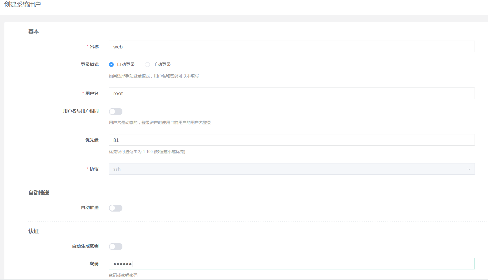
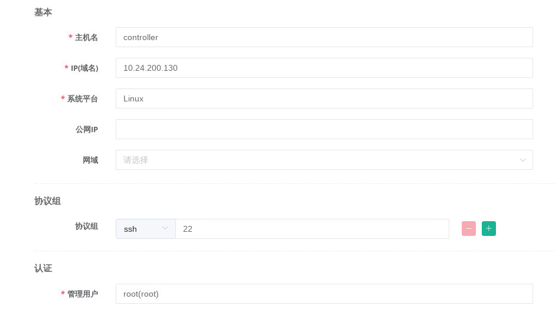
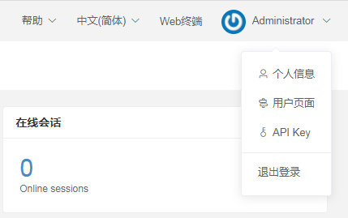
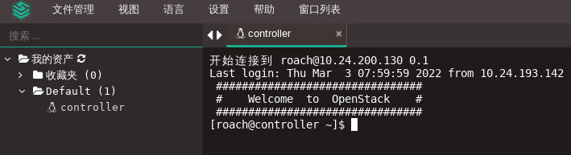

## OpenStack平台对接堡垒机[OpenStack平台对接堡垒机.mp4](https://fdfs.douxuedu.com/group1/M00/00/4A/wKggBmIq2U-EGbDDAAAAAJ9vS-0861.mp4)

### 案例准备

#### 1. 规划节点

节点规划见表1。

表1 节点规划

| **IP**        | **主机名** | **节点**                 |
| :------------ | :--------- | :----------------------- |
| 10.24.200.130 | controller | OpenStack Controller节点 |
| 10.24.193.142 | jumpserver | OpenStack堡垒机节点      |
| 10.24.194.189 | desktop    | centos-desktop-base节点  |

#### 2.基础准备

使用云主机搭建的OpenStack平台作为实验节点。并申请一台云主机作为堡垒机节点，搭建堡垒机服务。该案例主要是实现堡垒机对OpenStack节点主机的跳转。

### 案例实施

#### 部署堡垒机

（1）修改主机名

远程连接堡垒机节点，修改节点的主机名为jumpserver，修改主机名后，执行bash命令 或者刷新页面以生效新主机名，如下所示：

```
[root@jumpserver ~]# hostnamectl set-hostname jumpserver
```

（2）关闭防火墙与SELinux

将节点的防火墙与SELinux关闭，并设置永久关闭SELinux，命令如下：

```shell
[root@jumpserver ~]# setenforce 0
[root@jumpserver ~]# sed  -i  s#SELINUX=enforcing#SELINUX=disabled#   /etc/selinux/config
[root@jumpserver ~]# iptables -F
[root@jumpserver ~]# iptables -X
[root@jumpserver ~]# iptables -Z
[root@jumpserver ~]# /usr/sbin/iptables-save
```

（3）配置本地Yum源

使用提供的软件包配置Yum源，通过地址将jumpserver.tar.gz软件包下载至Jumpserver节点的/root目录下。

```shell
[root@jumpserver ~]# curl -O http://mirrors.douxuedu.com/competition/jumpserver.tar.gz
```

解压软件包jumpserver.tar.gz至/root目录下，命令如下：

```shell
[root@jumpserver ~]# tar -zxvf jumpserver.tar.gz -C /opt/
[root@jumpserver ~]# ls /opt/
compose  config  docker  docker.service  images  jumpserver-repo  static.env
```

将默认Yum源移至其他目录，创建本地Yum源文件，命令及文件内容如下：

```shell
[root@jumpserver ~]# mv /etc/yum.repos.d/* /media/
[root@jumpserver ~]# cat >> /etc/yum.repos.d/jumpserver.repo << EOF
[jumpserver]
name=jumpserver
baseurl=file:///opt/jumpserver-repo
gpgcheck=0
enabled=1
EOF
[root@jumpserver ~]# yum repolist
repo id		repo name		status
jumpserver	jumpserver		2
```

（4）安装依赖环境

安装Python数据库，命令如下：

```shell
[root@jumpserver ~]# yum install python2 -y
```

安装配置Docker环境，命令如下：

```shell
[root@jumpserver ~]# cp -rf /opt/docker/* /usr/bin/
[root@jumpserver ~]# chmod 775 /usr/bin/docker*
[root@jumpserver ~]# cp -rf /opt/docker.service /etc/systemd/system/
[root@jumpserver ~]# chmod 755 /etc/systemd/system/docker.service
[root@jumpserver ~]# systemctl daemon-reload
[root@jumpserver ~]# systemctl enable docker --now
```

验证服务状态，命令如下：

```shell
[root@jumpserver ~]# docker --version
Docker version 18.06.3-ce, build d7080c1
[root@jumpserver ~]# docker-compose --version
docker-compose version 1.27.4, build 40524192
```

（5）安装Jumpserver服务

加载Jumpserver服务组件镜像，命令如下：

```shell
[root@jumpserver ~]# cd /opt/images/
[root@jumpserver images]# sh load.sh
```

创建Jumpserver服务组件目录，命令如下：

```shell
[root@jumpserver images]# mkdir -p /opt/jumpserver/{core,koko,lion,mysql,nginx,redis}
[root@jumpserver images]# cp -rf /opt/config /opt/jumpserver/
```

生效环境变量static.env，使用所提供的脚本up.sh启动Jumpserver服务，命令如下：

```shell
[root@jumpserver images]# cd /opt/compose/
[root@jumpserver compose]# source /opt/static.env
[root@jumpserver compose]# sh up.sh                  
Creating network "jms_net" with driver "bridge"
Creating jms_mysql ... done
Creating jms_redis ... done
Creating jms_core  ... done
Creating jms_celery ... done
Creating jms_luna   ... done
Creating jms_lion   ... done
Creating jms_lina   ... done
Creating jms_nginx  ... done
Creating jms_koko   ... done
```

使用谷歌浏览器访问http://10.24.193.142，Jumpserver Web登录（admin/admin），如图1所示：


图1 Web登录

登录成功后，会提示设置新密码，如图2所示：


图2 修改密码

登录平台后，单击页面右上角下拉菜单切换中文字符设置，如图3所示：


图3 登录成功

至此Jumpserver安装完成。

（6）管理资产

使用管理员admin用户登录Jumpserver管理平台，单击左侧导航栏，展开“资产管理”项目，选择“管理用户”，单击右侧“创建”按钮，如图4所示：


图4 管理用户

创建远程连接用户，用户名为root密码为“Abc@1234”，单击“提交”按钮进行创建，如图5所示：


图5 创建管理用户

选择“系统用户”，单击右侧“创建”按钮，创建系统用户，选择主机协议“SSH”，设置用户名root，密码为服务器SSH密码并单击“提交”按钮，如图6所示：


图6 创建系统用户

单击左侧导航栏，展开“资产管理”项目，选择“资产列表”，单击右侧“创建”按钮，如图7所示：


图7 管理资产

创建资产，将云平台主机（controller）加入资产内，如图8、图9所示：


图8 创建资产controller


图9 创建成功

（7）资产授权

单击左侧导航栏，展开“权限管理”项目，选择“资产授权”，单击右侧“创建”按钮，创建资产授权规则，如图10所示：


图10 创建资产授权规则

（8）测试连接

单击右上角管理员用户下拉菜单，选择“用户界面”，如图11所示：


图11 创建资产授权规则

如果未出现Default项目下的资产主机，单击收藏夹后“刷新”按钮进行刷新，如图12所示：


图12 查看资产

单击左侧导航栏，选择“Web终端”进入远程连接页面，如图13所示：


图13 进入远程连接终端

单击左侧Default，展开文件夹，单击controller主机，右侧成功连接主机，如图14所示：


图14 测试连接

至此OpenStack对接堡垒机案例操作成功。