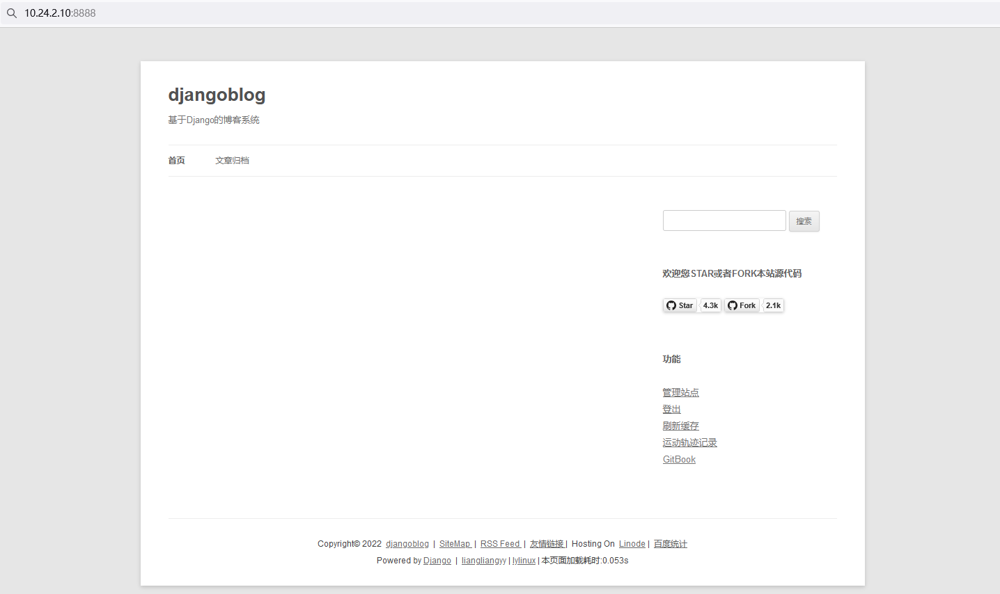

### 案例分析[基于docker-compose +Django编排部署博客系统.mp4](https://fdfs.douxuedu.com/group1/M00/00/4A/wKggBmIq5wmENlRHAAAAAO-GNtQ398.mp4)

#### 1. 规划节点

节点规划，见表1。

表1 节点规划

| IP         | 主机名 | 节点               |
| :--------- | :----- | :----------------- |
| 10.24.2.17 | master | docker-compose节点 |

#### 2. 基础准备

Docker和Docker Compose已安装完成，将提供的软件包DjangoBlog.tar.gz上传至master节点/root目录下并解压。

### 案例实施

#### 1. 基础环境准备

##### （1）导入软件包

下载并解压软件包：

```shell
[root@master ~]# wget http://mirrors.douxuedu.com/competition/DjangoBlog.tar.gz
[root@master ~]# tar -xf DjangoBlog.tar.gz
[root@master ~]# ll DjangoBlog
total 229260
drwxr-xr-x 4 root root       219 Jan 10 01:48 accounts
drwxr-xr-x 3 root root        60 Jan 10 01:48 bin
drwxr-xr-x 6 root root       301 Jan 10 01:49 blog
-rw------- 1 root root 211696640 Jan 12 16:49 CentOS_7.9.2009.tar
drwxr-xr-x 9 root root       105 Jan 10 01:50 collectedstatic
drwxr-xr-x 4 root root       190 Jan 10 01:50 comments
drwxr-xr-x 2 root root       292 Jan 10 01:50 djangoblog
-rw-r--r-- 1 root root       808 Jan  7 15:34 manage.py
-rw-r--r-- 1 root root      1090 Jan  7 09:58 nginx.conf
drwxr-xr-x 4 root root       197 Jan 10 01:50 oauth
drwxr-xr-x 3 root root       138 Jan 10 01:50 owntracks
-rw-r--r-- 1 root root  22994617 Jan  7 15:35 Python-3.6.5.tgz
drwxr-xr-x 2 root root      4096 Jan 10 01:50 Python-pip
-rw-r--r-- 1 root root       493 Jan  7 15:35 requirements.txt
drwxr-xr-x 4 root root       191 Jan 10 01:50 servermanager
-rw-r--r-- 1 root root     32061 Jan 12 00:40 sqlfile.sql
drwxr-xr-x 9 root root       113 Jan 10 01:50 templates
drwxr-xr-x 6 root root     16384 Jan 10 01:52 yum
```

导入CentOS:7.9.2009镜像：

```shell
[root@master ~]# docker load -i DjangoBlog/CentOS_7.9.2009.tar 
Loaded image: centos:centos7.9.2009
```

##### （2）启动Kubernetes集群

初始化Kubernetes集群：

```shell
[root@master ~]# init-cluster
```

查看集群状态：

```shell
[root@master ~]# kubectl cluster-info
Kubernetes control plane is running at https://apiserver.cluster.local:6443
CoreDNS is running at https://apiserver.cluster.local:6443/api/v1/namespaces/kube-system/services/kube-dns:dns/proxy

To further debug and diagnose cluster problems, use 'kubectl cluster-info dump'.
```

#### 2. 容器化部署Memcached

##### （1）编写Dockerfile

编写yum源配置文件：

```shell
[root@master ~]# cd DjangoBlog/
[root@master DjangoBlog]# vi local.repo 
[yum]
name=yum
baseurl=file:///root/yum
gpgcheck=0
enabled=1
```

编写Dockerfile：

```shell
[root@master DjangoBlog]# vi Dockerfile-memcached
FROM centos:centos7.9.2009
MAINTAINER Chinaskills
RUN rm -rf /etc/yum.repos.d/*
COPY local.repo /etc/yum.repos.d/
COPY yum /root/yum
RUN yum install libevent libevent-devel -y
RUN yum install memcached -y
EXPOSE 11211
ENTRYPOINT /usr/bin/memcached -u root
```

##### （2）构建镜像

构建镜像：

```shell
[root@master DjangoBlog]# docker build -t blog-memcached:v1.0 -f Dockerfile-memcached .
Sending build context to Docker daemon    606MB
Step 1/9 : FROM centos:centos7.9.2009
 ---> eeb6ee3f44bd
Step 2/9 : MAINTAINER Chinaskills
 ---> Using cache
 ---> 815a4a5f2242
Step 3/9 : RUN rm -rf /etc/yum.repos.d/*
 ---> Using cache
 ---> 6afa0315cb5b
Step 4/9 : COPY local.repo /etc/yum.repos.d/
 ---> Using cache
 ---> 140618900604
Step 5/9 : COPY yum /root/yum
 ---> Using cache
 ---> ad30591b1d15
Step 6/9 : RUN yum install libevent libevent-devel -y
 ---> Using cache
 ---> 8299be2cb3bf
Step 7/9 : RUN yum install memcached -y
 ---> Using cache
 ---> 439f91db606c
Step 8/9 : EXPOSE 11211
 ---> Using cache
 ---> c56ab6056bac
Step 9/9 : ENTRYPOINT /usr/bin/memcached -u root
 ---> Using cache
 ---> 9945bb68cac2
Successfully built 9945bb68cac2
Successfully tagged blog-memcached:v1.0
```

#### 3. 容器化部署MariaDB

##### （1）编写Dockerfile

编写数据库初始化脚本：

```shell
[root@master DjangoBlog]# vi mysql_init.sh 
#!/bin/bash
mysql_install_db --user=root
mysqld_safe --user=root &
sleep 8
mysqladmin -u root password 'root'
mysql -uroot -proot -e "grant all on *.* to 'root'@'%' identified by 'root';flush privileges;"
mysql -uroot -proot -e "create database djangoblog;use djangoblog;source /opt/sqlfile.sql;"
```

编写Dockerfile文件：

```shell
[root@master DjangoBlog]# vi Dockerfile-mariadb 
FROM centos:centos7.9.2009
MAINTAINER Chinaskills
RUN rm -rf /etc/yum.repos.d/*
COPY local.repo /etc/yum.repos.d/
COPY yum /root/yum
ENV LC_ALL en_US.UTF-8
RUN yum -y install mariadb-server
COPY mysql_init.sh /opt/
COPY sqlfile.sql /opt
RUN bash /opt/mysql_init.sh
EXPOSE 3306
CMD ["mysqld_safe","--user=root"]
```

##### （2）构建镜像

构建镜像：

```shell
[root@master DjangoBlog]# docker build -t blog-mysql:v1.0 -f Dockerfile-mariadb .
Sending build context to Docker daemon    606MB
Step 1/12 : FROM centos:centos7.9.2009
 ---> eeb6ee3f44bd
Step 2/12 : MAINTAINER Chinaskills
 ---> Using cache
 ---> 815a4a5f2242
Step 3/12 : RUN rm -rf /etc/yum.repos.d/*
 ---> Using cache
 ---> 6afa0315cb5b
Step 4/12 : COPY local.repo /etc/yum.repos.d/
 ---> Using cache
 ---> 140618900604
Step 5/12 : COPY yum /root/yum
 ---> Using cache
 ---> ad30591b1d15
Step 6/12 : ENV LC_ALL en_US.UTF-8
 ---> Using cache
 ---> 026865489eec
Step 7/12 : RUN yum -y install mariadb-server
 ---> Using cache
 ---> c691328d736e
Step 8/12 : COPY mysql_init.sh /opt/
 ---> Using cache
 ---> 34b4926a933f
Step 9/12 : COPY sqlfile.sql /opt
 ---> Using cache
 ---> ad9022ea65b5
Step 10/12 : RUN bash /opt/mysql_init.sh
 ---> Using cache
 ---> c5aee98993f5
Step 11/12 : EXPOSE 3306
 ---> Using cache
 ---> 0a4e28e2bcdb
Step 12/12 : CMD ["mysqld_safe","--user=root"]
 ---> Using cache
 ---> 387f6dcb21bb
Successfully built 387f6dcb21bb
Successfully tagged blog-mysql:v1.0
```

#### 4. 容器化部署前端服务

##### （1）编写Dockerfile

编写Dockerfile:

```shell
[root@master DjangoBlog]# vi Dockerfile-nginx 
FROM centos:centos7.9.2009
MAINTAINER Chinaskills
RUN rm -rf /etc/yum.repos.d/*
COPY local.repo /etc/yum.repos.d/
COPY yum /root/yum
RUN yum -y install nginx
ADD nginx.conf /etc/nginx/nginx.conf
RUN /bin/bash -c 'echo init ok'
EXPOSE 80
CMD ["nginx","-g","daemon off;"]
```

##### （2）构建镜像

构建镜像：

```shell
[root@master DjangoBlog]# docker build -t blog-nginx:v1.0 -f Dockerfile-nginx .
Sending build context to Docker daemon    602MB
Step 1/10 : FROM centos:centos7.9.2009
 ---> eeb6ee3f44bd
Step 2/10 : MAINTAINER Chinaskills
 ---> Using cache
 ---> 815a4a5f2242
Step 3/10 : RUN rm -rf /etc/yum.repos.d/*
 ---> Using cache
 ---> 6afa0315cb5b
Step 4/10 : COPY local.repo /etc/yum.repos.d/
 ---> Using cache
 ---> 140618900604
Step 5/10 : COPY yum /root/yum
 ---> Using cache
 ---> ad30591b1d15
Step 6/10 : RUN yum -y install nginx
 ---> Using cache
 ---> 3bc6b5e4df75
Step 7/10 : ADD nginx.conf /etc/nginx/nginx.conf
 ---> Using cache
 ---> fb38e7925da7
Step 8/10 : RUN /bin/bash -c 'echo init ok'
 ---> Using cache
 ---> ee92e1773b71
Step 9/10 : EXPOSE 80
 ---> Using cache
 ---> 2decccbccd9c
Step 10/10 : CMD ["nginx","-g","daemon off;"]
 ---> Using cache
 ---> 5d7be5d9469e
Successfully built 5d7be5d9469e
Successfully tagged blog-nginx:v1.0
```

#### 5. 容器化部署博客系统

##### （1）编写Dockerfile

编写Dockerfile

```shell
[root@master DjangoBlog]# vi Dockerfile-blog
FROM centos:centos7.9.2009
MAINTAINER Chinaskills
RUN rm -rfv /etc/yum.repos.d/*
COPY local.repo /etc/yum.repos.d/
COPY yum /root/yum
RUN yum install -y make openssl-devel bzip2-devel expat-devel gdbm-devel readline-devel sqlite-devel gcc gcc-devel python-devel mysql-devel
COPY Python-3.6.5.tgz /opt
RUN tar -zxvf /opt/Python-3.6.5.tgz
RUN mv Python-3.6.5 /usr/local
RUN cd /usr/local/Python-3.6.5/ && ./configure && make && make install
RUN ln -s /usr/local/python3/bin/python3 /usr/bin/python3
RUN ln -s /usr/local/python3/bin/pip3 /usr/bin/pip3
ADD requirements.txt requirements.txt
COPY Python-pip /opt
RUN pip3 install --upgrade pip --no-index --find-links=/opt
RUN pip3 install -r requirements.txt --no-index --find-links=/opt
RUN pip3 install gunicorn[gevent] --no-index --find-links=/opt
RUN pip3 cache purge
RUN mkdir -p /code/djangoBlog
ADD . /code/djangoBlog/
RUN chmod +x /code/djangoBlog/bin/docker_start.sh
ENTRYPOINT ["/code/djangoBlog/bin/docker_start.sh"]
```

##### （2）构建镜像

构建镜像：

```shell
[root@master DjangoBlog]# docker build -t blog-service:v1.0 -f Dockerfile-blog .
Sending build context to Docker daemon  813.6MB
Step 1/22 : FROM centos:centos7.9.2009
 ---> eeb6ee3f44bd
Step 2/22 : MAINTAINER Chinaskills
 ---> Using cache
 ---> 815a4a5f2242
Step 3/22 : RUN rm -rfv /etc/yum.repos.d/*
 ---> Using cache
 ---> df5e97651f07
Step 4/22 : COPY local.repo /etc/yum.repos.d/
 ---> Using cache
 ---> 5298caa9d188
Step 5/22 : COPY yum /root/yum
 ---> Using cache
 ---> 14dfec50f5fe
Step 6/22 : RUN yum install -y make openssl-devel bzip2-devel expat-devel gdbm-devel readline-devel sqlite-devel gcc gcc-devel python-devel mysql-devel
 ---> Using cache
 ---> 353a069506ac
Step 7/22 : COPY Python-3.6.5.tgz /opt
 ---> Using cache
 ---> 40c96717fe6e
Step 8/22 : RUN tar -zxvf /opt/Python-3.6.5.tgz
 ---> Using cache
 ---> 4ef942409499
Step 9/22 : RUN mv Python-3.6.5 /usr/local
 ---> Using cache
 ---> efd5b09e9357
Step 10/22 : RUN cd /usr/local/Python-3.6.5/ && ./configure && make && make install
 ---> Using cache
 ---> e2e5e2a6655e
Step 11/22 : RUN ln -s /usr/local/python3/bin/python3 /usr/bin/python3
 ---> Using cache
 ---> 5f8b69775493
Step 12/22 : RUN ln -s /usr/local/python3/bin/pip3 /usr/bin/pip3
 ---> Using cache
 ---> 67d7f52d161b
Step 13/22 : ADD requirements.txt requirements.txt
 ---> Using cache
 ---> f97574de7b0d
Step 14/22 : COPY Python-pip /opt
 ---> Using cache
 ---> 951fc0487f4a
Step 15/22 : RUN pip3 install --upgrade pip --no-index --find-links=/opt
 ---> Using cache
 ---> 04d166c02033
Step 16/22 : RUN pip3 install -r requirements.txt --no-index --find-links=/opt
 ---> Using cache
 ---> b2cf9dc57d52
Step 17/22 : RUN pip3 install gunicorn[gevent] --no-index --find-links=/opt
 ---> Using cache
 ---> 56116a3d4c59
Step 18/22 : RUN pip3 cache purge
 ---> Using cache
 ---> 65be1f06e0fb
Step 19/22 : RUN mkdir -p /code/djangoBlog
 ---> Using cache
 ---> 92634eb552ee
Step 20/22 : ADD . /code/djangoBlog/
 ---> Using cache
 ---> 94cbf96a41cf
Step 21/22 : RUN chmod +x /code/djangoBlog/bin/docker_start.sh
 ---> Using cache
 ---> 1c263f74eff1
Step 22/22 : ENTRYPOINT ["/code/djangoBlog/bin/docker_start.sh"]
 ---> Using cache
 ---> 21355b648ae1
Successfully built 21355b648ae1
Successfully tagged blog-service:v1.0
```

#### 6. 编排部署DjangoBlog

##### （1）编写docker-compose.yaml

编写docker-compose.yaml编排文件：

```shell
[root@k8s-master-node1 DjangoBlog]# vi docker-compose.yaml 
version: '3'
services:
  memcached:
    restart: always
    image: blog-memcached:v1.0
    container_name: blog-memcached
    ports:
      - "11211:11211"
  db:
    image: blog-mysql:v1.0
    restart: always
    environment:
      - MYSQL_DATABASE=djangoblog
      - MYSQL_ROOT_PASSWORD=root
    ports:
      - 3306:3306
    depends_on:
      - memcached
    container_name: blog-mysql
  djangoblog:
    image: blog-service:v1.0
    restart: always
    ports:
      - "8000:8000"
    environment:
      - DJANGO_MYSQL_DATABASE=djangoblog
      - DJANGO_MYSQL_USER=root
      - DJANGO_MYSQL_PASSWORD=root
      - DJANGO_MYSQL_HOST=db
      - DJANGO_MYSQL_PORT=3306
      - DJANGO_MEMCACHED_LOCATION=memcached:11211
    volumes:
      - ./collectedstatic:/code/djangoBlog/collectedstatic
    links:
      - db
      - memcached
    depends_on:
      - db
    container_name: blog-service
  nginx:
    restart: always
    image: blog-nginx:v1.0
    volumes:
      - ./collectedstatic:/code/djangoblog/collectedstatic
    ports:
      - "8888:80"
      - "443:443"
    links:
      - djangoblog:djangoblog
    container_name: blog-nginx
```

##### （2）部署服务

部署服务：

```shell
[root@k8s-master-node1 DjangoBlog]# docker-compose up -d
[+] Running 5/5
 ⠿ Network djangoblog_default   Created                          0.2s
 ⠿ Container blog-memcached    Started                           1.9s
 ⠿ Container blog-mysql         Started                           3.3s
 ⠿ Container blog-service        Started                           7.7s
 ⠿ Container blog-nginx         Started                            8.4s
```

查看服务：


图1

在浏览器上通过http://IP:8888访问服务，如图所示：


图2

登录系统（admin/123456），如图所示：


图3

点击“管理站点”，如图所示：


图4