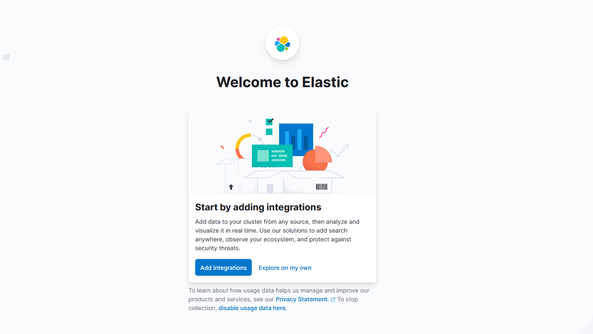

### 案例分析[基于Helm3工具实现服务发布.mp4](https://fdfs.douxuedu.com/group1/M00/00/4B/wKggBmIq6zaEVRUkAAAAALi_2V4004.mp4)

#### 1. 规划节点

节点规划，见表1。

表1 节点规划

| IP        | 主机名 | 节点               |
| :-------- | :----- | :----------------- |
| 10.24.2.5 | master | master、worker节点 |

#### 2. 基础准备

Kubernetes v1.22集群已部署完成。将提供的软件包Helm.tar.gz上传至master节点/root目录下并解压。

### 案例实施

##### （1）基础环境准备

解压软件包并导入镜像：

```shell
[root@master ~]# wget http://mirrors.douxuedu.com/competition/Helm.tar.gz
[root@master ~]# tar -xf Helm.tar.gz
[root@master ~]# ll Helm
total 1114848
drwxr-xr-x 5 root root         57 Jan 27 11:14 efk
-rw-r--r-- 1 root root 1141603479 Feb 10 09:26 images.tar
[root@master ~]# docker load -i Helm/images.tar
```

启动Kubernetes集群：

```shell
[root@master ~]# init-cluster
```

查看Helm版本：

```shell
[root@master ~]# helm version
version.BuildInfo{Version:"v3.7.1", GitCommit:"1d11fcb5d3f3bf00dbe6fe31b8412839a96b3dc4", GitTreeState:"clean", GoVersion:"go1.16.9"}
```

##### （2）定义chart

一个chart包就是一个文件夹的集合，文件夹名称就是chart包的名称，比如创建一个mychart的chart包：

```shell
[root@master ~]# helm create mychart
Creating mychart
```

chart基本元素释义如下：

```shell
[root@master ~]# tree mychart/
mychart/
├── charts    	             #可选:本chart依赖的其他chart；
├── Chart.yaml             #必选:描述chart相关信息，包括名称、描述等信息；
├── templates              #必选:作用于kubernetes资源的yaml模版；
│   ├── deployment.yaml   # deployment的yaml模版，发布应用的基本元素；
│   ├── _helpers.tpl        #用于定义一些可重用的模板片断；
│   ├── hpa.yaml          #用于生成hpa的yaml模版；
│   ├── ingress.yaml       #用于生成ingress的yaml模版；
│   ├── NOTES.txt        #必选:用于介绍chart部署后的一些信息；
│   ├── serviceaccount.yaml  #用于生成serviceaccount资源的yaml模版
│   ├── service.yaml        #用于生成service资源的yaml模版；
│   └── tests               #helm的测试钩子
│       └── test-connection.yaml
└── values.yaml           #必选:用于存储要渲染至templates/下模版文件中的值
```

##### （3）自定义YAML文件

删除templates目录下面所有文件：

```shell
[root@master ~]# rm -rfv mychart/templates/*
```

自定义Deployment模板文件：

```shell
[root@master ~]# vi mychart/templates/deployment.yaml
apiVersion: apps/v1
kind: Deployment
metadata:
  creationTimestamp: null
  labels:
    app: nginx
  name: nginx
spec:
  replicas: 1
  selector:
    matchLabels:
      app: nginx
  strategy: {}
  template:
    metadata:
      creationTimestamp: null
      labels:
        app: nginx
    spec:
      containers:
      - image: nginx
        imagePullPolicy: IfNotPresent
        name: nginx
        resources: {}
status: {}
```

Helm提供了语法检查工具，其作用类似nginx -t，会对chart的格式或者一些信息进行自检，并返回检查结果，在发布前，进行语法检查是很好的选择。检查chart：

```shell
[root@master ~]# helm lint mychart
==> Linting mychart
[INFO] Chart.yaml: icon is recommended

1 chart(s) linted, 0 chart(s) failed
```

实际上现在就是一个可安装的chart包了，通过helm install命令来进行安装：

```shell
[root@master ~]# helm install web mychart
NAME: web
LAST DEPLOYED: Tue Jan 25 15:24:51 2022
NAMESPACE: default
STATUS: deployed
REVISION: 1
TEST SUITE: None
```

可以看到资源对象已经创建了，这样部署与直接使用“kubectl apply”部署差别不大。

查看release：

```shell
[root@master ~]# helm list
NAME    NAMESPACE       REVISION        UPDATED                                 STATUS          CHART           APP VERSION
web     default         1               2022-01-25 17:24:51.115137421 +0800 CST deployed        mychart-0.1.0   1.16.0
```

校验部署状态：

```shell
[root@master ~]# helm status web
NAME: web
LAST DEPLOYED: Tue Jan 25 15:24:51 2022
NAMESPACE: default
STATUS: deployed
REVISION: 1
TEST SUITE: None
```

查看Pod：

```shell
[root@master ~]# kubectl get pods
NAME                 READY   STATUS    RESTARTS   AGE
nginx-6799fc88d8-ns99r   1/1       Running     0            79s
```

使用如下命令可以看到实际的模板被渲染过后的资源文件：

```shell
[root@master ~]# helm get manifest web
﹉（“﹉”请学生自行手打，不要复制）
# Source: mychart/templates/deployment.yaml
apiVersion: apps/v1
kind: Deployment
metadata:
  creationTimestamp: null
  labels:
    app: nginx
  name: nginx
spec:
  replicas: 1
  selector:
    matchLabels:
      app: nginx
  strategy: {}
  template:
    metadata:
      creationTimestamp: null
      labels:
        app: nginx
    spec:
      containers:
      - image: nginx
        imagePullPolicy: IfNotPresent
        name: nginx
        resources: {}
status: {}
```

删除当前release：

```shell
[root@master ~]# helm delete web
release "web" uninstalled
```

#### 2. 定义模板

##### （1）创建模板

可以看到上面我们定义的Service和Deployment的名字是固定的，但往往这并不是一种很好的做法，可以通过插入release的名称来生成资源的名称，这就需要用到Chart的模板定义方法了。

Helm hart模板使用的是Go语言模板编写而成，并添加了Sprig库中的50多个附件模板函数以及一些其他特殊函数。

编辑Deployment模板：

```yaml
[root@master ~]# vi mychart/templates/deployment.yaml
apiVersion: apps/v1
kind: Deployment
metadata:
  creationTimestamp: null
  labels:
    chart: {{ .Chart.Name }}
    app: {{ .Release.Name }}
  name: {{ .Release.Name }}
spec:
  replicas: {{ .Values.replicas}}
  selector:
    matchLabels:
      app: {{ .Values.label }}
  strategy: {}
  template:
    metadata:
      creationTimestamp: null
      labels:
        app: {{ .Values.label }}
    spec:
      containers:
      - image: {{ .Values.image }}:{{ .Values.imageTag }}
        imagePullPolicy: {{ .Values.pullPolicy }}
        name: {{ .Release.Name }}
        resources: {}
status: {}
```

这里将资源名称替换成了{{ .Release.Name }}，其中包含在{{ }}之中的就是模板指令，{{ .Release.Name }}将release的名称注入到模板中来，这样最终生成的资源名称就是以release的名称开头的了。这里的Release模板对象属于Helm内置的一种对象。

编辑传入变量的values.yaml：

```yaml
[root@master ~]# vi mychart/values.yaml 
replicas: 3
image: nginx
pullPolicy: IfNotPresent
imageTag: 1.17
label: nginx
```

##### （2）调试

Helm提供了–dry-run --debug这个可选参数，在执行helm install的时候带上这两个参数就可以把对应的values值和生成的最终的资源清单文件打印出来，而不会真正的去部署一个release实例，比如调试上面创建的chart包：

```yaml
[root@master ~]# helm install web01 --dry-run mychart/
NAME: web01
LAST DEPLOYED: Tue Feb 15 16:32:17 2022
NAMESPACE: default
STATUS: pending-install
REVISION: 1
TEST SUITE: None
HOOKS:
MANIFEST:
﹉（“﹉”请学生自行手打，不要复制）
# Source: mychart/templates/deployment.yaml
apiVersion: apps/v1
kind: Deployment
metadata:
  creationTimestamp: null
  labels:
    chart: mychart
    app: web01
  name: web01
spec:
  replicas: 3
  selector:
    matchLabels:
      app: nginx
  strategy: {}
  template:
    metadata:
      creationTimestamp: null
      labels:
        app: nginx
    spec:
      containers:
      - image: nginx:1.17
        imagePullPolicy: IfNotPresent
        name: web01
        resources: {}
status: {}
```

调试过程无报错就可以进行安装了：

```yaml
[root@master ~]# helm install web01 mychart/
NAME: web01
LAST DEPLOYED: Tue Jan 25 17:28:59 2022
NAMESPACE: default
STATUS: deployed
REVISION: 1
TEST SUITE: None
```

查看Pod：

```shell
[root@master ~]# kubectl get pods
NAME                READY   STATUS    RESTARTS   AGE
web-76f5f6d7f5-gc62p   1/1        Running    0            15s
web-76f5f6d7f5-l5w5b   1/1        Running    0            15s
web-76f5f6d7f5-zjfkm   1/1        Running    0            15s
```

##### （3）内置对象

刚刚使用{{.Release.Name}}将release的名称插入到模板中。这里的Release就是Helm的内置对象，下面是一些常用的内置对象：

● Release.Name：release名称；

● Release.Time：release的时间；

● Release.Namespace：release的namespace（如果清单未覆盖）；

● Release.Service：release服务的名称（始终是Tiller）；

● Release.Revision：此release的修订版本号，从1开始累加；

● Release.IsUpgrade：如果当前操作是升级或回滚，则将其设置为true；

● Release.IsInstall：如果当前操作是安装，则设置为true。

上面这些值可用于任何顶级模板，要注意内置对象始终以大写字母开头。这也符合Go的命名约定。

##### （4）更新

此时如果想更新配置就比较方便了，比如将nginx镜像的版本换成1.18：

```shell
[root@master ~]# vi mychart/values.yaml 
replicas: 3
image: nginx
pullPolicy: IfNotPresent
imageTag: 1.18
label: nginx
[root@master ~]# helm upgrade web01 mychart
Release "web01" has been upgraded. Happy Helming!
NAME: web01
LAST DEPLOYED: Tue Jan 25 17:29:48 2022
NAMESPACE: default
STATUS: deployed
REVISION: 2
TEST SUITE: None
```

删除release：

```shell
[root@guorui ~]# helm delete web01
```

##### （5）Values

Values对象是为Chart模板提供值，这个对象的值有4个来源：

● chart包中的values.yaml文件

● 父chart包的values.yaml文件

● 通过helm install或helm upgrade的-f或者–values参数传入的自定义的yaml文件

● 通过–set参数传入的值

chart的values.yaml提供的值可以被用户提供的values文件覆盖，而该文件同样可以被–set提供的参数所覆盖。

例如新建一个应用，副本数只有1个：

```
[root@master ~]# helm install web02 --set replicas=1 mychart
NAME: web02
LAST DEPLOYED: Tue Jan 25 15:42:07 2022
NAMESPACE: default
STATUS: deployed
REVISION: 1
TEST SUITE: None
```

查看Pod：

```shell
[root@guorui ~]# kubectl get pods
NAME                  READY   STATUS    RESTARTS   AGE
web02-844599bd88-g7c5d   1/1       Running     0           16s
```

对于–set传入配置参数，Helm官方对于不同的配置类型给出了不同的写法，如下：

表2

| YAML文件写法                             | set写法                                         |
| :--------------------------------------- | :---------------------------------------------- |
| name: value                              | –set name=value                                 |
| a: b c: d                                | –set a=b,c=d                                    |
| outer: inner: value                      | –set outer.inner=value                          |
| name: - a - b - c                        | –set name={a, b, c}                             |
| servers: - port: 80                      | –set servers[0].port=80                         |
| servers: - port: 80 host: example        | –set servers[0].port=80,servers[0].host=example |
| name: “value1,value2”                    | –set name=value1,value2                         |
| nodeSelector: kubernetes.io/role: master | –set nodeSelector.“kubernetes.io/role”=master   |

删除release：

```shell
[root@master Helm]# helm delete web02
```

#### 3. Chart的管道与函数

##### （1）模板函数

模块实质上就是将值传给模板引擎进行渲染，这些信息都是直接传入模板引擎中进行渲染的，有的时候需要转换一下这些数据才进行渲染，模板引擎支持对拿到数据进行二次处理，这就需要使用到Go模板语言中的一些其他用法。

例如给标签（labels）加双引号，修改Deployment模板template字段：

```shell
[root@master ~]# vi mychart/templates/deployment.yaml
……
  template:
    metadata:
      creationTimestamp: null
      labels:
        app: {{ quote .Values.label }}
……
```

调试查看结果：

```shell
[root@master ~]# helm install web03 --dry-run mychart
……
  template:
    metadata:
      creationTimestamp: null
      labels:
        app: "nginx"
……
```

可以看到标签“nginx”被加上了一个双引号。

##### （2）管道

模板语言除了提供了丰富的内置函数之外，其另一个强大的功能就是管道的概念。和UNIX中一样，管道也通常称为Pipeline，是一个组合在一起的一系列模板命令的工具，以紧凑地表达一系列转换。简单来说，管道是可以按顺序完成一系列操作的一种方法。

比如使用管道重写上面的Deployment模板：

```shell
[root@master ~]# vi mychart/templates/deployment.yaml
……
  template:
    metadata:
      creationTimestamp: null
      labels:
        app: {{ .Values.label | quote }}
……
```

调试查看运行结果：

```shell
[root@master ~]# helm install web03 --dry-run mychart
……
  template:
    metadata:
      creationTimestamp: null
      labels:
        app: "nginx"
……
```

可以看到标签“nginx”同样被加上了一个双引号，效果和之前一样。

##### （3）default函数

default函数（default DEFAULT_VALUE GIVEN_VALUE）允许在模板内部指定默认值，以防止该值被忽略掉了。

例如新加一个值：test: demotest，修改Deployment模板template字段：

```
[root@master ~]# vi mychart/templates/deployment.yaml
……
  template:
    metadata:
      creationTimestamp: null
      labels:
        app: {{ quote .Values.label }}
        test: {{ default "demotest" .Values.test }}
……
```

调试查看运行结果：

```
[root@master ~]# helm install web03 --dry-run mychart/
……
  template:
    metadata:
      creationTimestamp: null
      labels:
        app: "nginx"
        test: demotest
……
```

可以看到，定义的test: demotest已经生效。

因为没有在values.yaml中定义test的值，所以默认其值为demotest。如果在values.yaml中定义了，其值就以values.yaml中的值为准。

例如在values.yaml中把test的值定义为123456：

```
[root@master ~]# vi mychart/values.yaml 
replicas: 3
image: nginx
pullPolicy: IfNotPresent
imageTag: 1.18
label: nginx
test: 123456
```

调试查看运行结果：

```
[root@master ~]# helm install web03 --dry-run mychart/
……
  template:
    metadata:
      creationTimestamp: null
      labels:
        app: "nginx"
        test: 123456
……
```

可以看到test的值被渲染成了123456。

#### 4. 流程控制

模板函数和管道是通过转换信息并将其插入到YAML文件中。有时候需要添加一些比插入字符串更复杂一些的模板逻辑，这就需要使用到模板语言中提供的控制结构了。

控制流程为提供了控制模板生成流程的一种能力，Helm的模板语言提供了以下几种流程控制：

● if/else条件块

● with指定范围

● range循环块

除此之外，它还提供了一些声明和使用命名模板段的操作：

● define在模板中声明一个新的命名模板

● template导入一个命名模板

● block声明了一种特殊的可填写的模板区域

##### （1）if

if/else块是用于在模板中有条件地包含文本块的方法，条件块的基本结构如下：

```
{{ if PIPELINE }}
  # Do something
{{ else if OTHER PIPELINE }}
  # Do something else
{{ else }}
  # Default case
{{ end }}
```

当然要使用条件块就得判断条件是否为真，如果值为下面的几种情况，则管道的结果为 false：

● 一个布尔类型的假

● 一个数字0

● 一个空的字符串

● 一个nil（空或null）

● 一个空的集合（map、slice、tuple、dict、array）

除了上面的这些情况外，其他所有条件都为真。

例如判断test的值来赋予一个新的值，修改Deployment模板template字段：

```
[root@master ~]# vi mychart/templates/deployment.yaml
……
  template:
    metadata:
      creationTimestamp: null
      labels:
        app: {{ quote .Values.label }}
        {{- if eq .Values.test "devops"}}
        devops: k8s
        {{- else }}
        devops: docker
        {{- end }}
……
```

修改values.yaml中test的值，

```
[root@master ~]# vi mychart/values.yaml 
replicas: 3
image: nginx
pullPolicy: IfNotPresent
imageTag: 1.18
label: nginx
test: devops
```

调试查看运行结果：

```
[root@master ~]# helm install web03 --dry-run mychart/
……
  template:
    metadata:
      creationTimestamp: null
      labels:
        app: "nginx"
        devops: k8s
……
```

可以看到，根据values的值，可以判断赋予devops这个字段的值。

其中运算符eq是判断是否相等的操作，除此之外，还有 ne、 lt、 gt、 and、 or等运算符。

其中渲染出来会有多余的空行，这是因为当模板引擎运行时，会将控制指令删除，所有之前占的位置也就空白了，所以需要使用{undefined{- if …}} 的方式消除此空行。

##### （2）with

with用来控制变量作用域。{{ .Release.xxx }}或者{{ .Values.xxx }}中的.就是表示对当前范围的引用，.Values就是告诉模板在当前范围中查找Values对象的值。而with语句就可以来控制变量的作用域范围，其语法和一个简单的if语句比较类似：

```
{{ with PIPELINE }}
# restricted scope
{{ end }}
```

例如添加一个标签，修改values.yaml文件：

```
[root@master ~]# vi mychart/values.yaml 
replicas: 3
image: nginx
pullPolicy: IfNotPresent
imageTag: 1.18
label: nginx
test: devops
nodeSelector:
  team: chongqing
  gpu: ok
```

在Deployment模板中containers字段前面加入if判断内容：

```
[root@master ~]# vi mychart/templates/deployment.yaml
……
    spec:
      {{- if .Values.nodeSelector }}
      nodeSelector:
        team: {{ .Values.nodeSelector.team }}
        gpu: {{ .Values.nodeSelector.gpu }}
      {{- end }}
      containers:
……
```

调试查看运行结果：

```
[root@master ~]# helm install web03 --dry-run mychart/
……
    spec:
      nodeSelector:
        team: chongqing
        gpu: ok
      containers:
……
```

可以看到渲染的YAML文件中加入了指定的内容。

修改Deployment模板中containers字段前的内容，改为使用with：

```
[root@master ~]# vi mychart/templates/deployment.yaml
……
    spec:
      {{- with .Values.nodeSelector }}
      nodeSelector:
        team: {{ .team }}
        gpu: {{ .gpu }}
      {{- end }}
      containers:
……
```

调试查看运行结果：

```
[root@master ~]# helm install web03 --dry-run mychart/
……
    spec:
      nodeSelector:
        team: chongqing
        gpu: ok
      containers:
……
```

可以看到效果和之前一致。

这种方式还不够简化，要指定key值，可以用toYaml函数来处理，修改Deployment模板：

```
[root@master ~]# vi mychart/templates/deployment.yaml
……
    spec:
      {{- with .Values.nodeSelector }}
      nodeSelector:
        {{- toYaml . | nindent 8 }}
      {{- end }}
      containers:
……
```

再次调试运行：

```
[root@master ~]# helm install web03 --dry-run mychart/
```

运行得到的结果和前面一样。其中with是一个循环构造，使用.Values.nodeSelector中的值将其转换为YAML。 toYaml之后的点是循环中.Values.nodeSelector的当前值。使用nindent 8是因为用toYaml函数得到的值都是顶格，需要缩进8个字符，保持语法正确，并且每缩进一行都需要换行。

##### （3）range

在Helm模板语言中，range用于进行循环操作。

在values.yaml文件中添加上一个变量列表：

```
[root@master ~]# vi mychart/values.yaml 
replicas: 3
image: nginx
pullPolicy: IfNotPresent
imageTag: 1.18
label: nginx
test: devops
nodeSelector:
  team: chongqing
  gpu: ok
ceshi:
  - 1
  - 2
  - 3
```

在templates目录下面新建一个configmap.yaml文件：

```
[root@master ~]# vi mychart/templates/configmap.yaml
apiVersion: v1
kind: ConfigMap
metadata:
  name: {{ .Release.Name }}
data:
  test: |
  {{- range .Values.ceshi }}
    {{ . }}
  {{- end }}
```

调试运行查看结果：

```
[root@master ~]# helm install web03 --dry-run mychart/
……
data:
  test: |
    1
    2
    3
……
```

可以看到被渲染的YAML文件中加入了指定的内容。

#### 5. 打包chart

##### （1）打包chart

使用helm package命令打包chart：

```
[root@master ~]# helm package mychart/
Successfully packaged chart and saved it to: /root/mychart-0.1.0.tgz
```

查看chart包：

```
[root@master ~]# ls
Helm  Helm.tar.gz  mychart  mychart-0.1.0.tgz
```

#### 6. 部署EFK日志收集系统

##### （1）部署Elasticsearch

部署Elasticsearch：

```
[root@master ~]# cd Helm/
[root@master Helm]# helm install elasticsearch efk/elasticsearch/
NAME: elasticsearch
LAST DEPLOYED: Thu Jan 27 10:57:52 2022
NAMESPACE: default
STATUS: deployed
REVISION: 1
NOTES:
1. Watch all cluster members come up.
  $ kubectl get pods --namespace=default -l app=elasticsearch-master -w2. Test cluster health using Helm test.
  $ helm --namespace=default test elasticsearch
```

查看release：

```
[root@master Helm]# helm list
NAME            NAMESPACE       REVISION        UPDATED                                 STATUS          CHART                   APP VERSION
elasticsearch   default         1               2022-01-27 10:57:52.575082785 +0800 CST deployed        elasticsearch-7.16.3    7.16.3
```

查看Pod：

```
[root@master Helm]# kubectl get pods
NAME               READY   STATUS    RESTARTS   AGE
elasticsearch-master-0   1/1       Running     0           81s
```

##### （2）部署FileBeat

部署FileBeat：

```
[root@master Helm]# helm install filebeat efk/filebeat/
NAME: filebeat
LAST DEPLOYED: Thu Jan 27 11:00:27 2022
NAMESPACE: default
STATUS: deployed
REVISION: 1
TEST SUITE: None
NOTES:
1. Watch all containers come up.
  $ kubectl get pods --namespace=default -l app=filebeat-filebeat -w
```

查看release：

```
[root@master Helm]# helm list
NAME            NAMESPACE       REVISION        UPDATED                                 STATUS          CHART                   APP VERSION
elasticsearch   default         1               2022-01-27 10:57:52.575082785 +0800 CST deployed        elasticsearch-7.16.3    7.16.3     
filebeat        default         1               2022-01-27 11:00:27.643251833 +0800 CST deployed        filebeat-7.16.3         7.16.3  
```

查看Pod：

```
[root@master Helm]# kubectl get pods
NAME                READY   STATUS    RESTARTS   AGE
elasticsearch-master-0    1/1       Running     0            3m59s
filebeat-filebeat-fdwfv    1/1       Running     0            83s
filebeat-filebeat-mg5gh   1/1       Running     0            84s
```

##### （3）部署Kibana

部署Kinaba：

```
[root@master Helm]# helm install kibana efk/kibana/
NAME: kibana
LAST DEPLOYED: Thu Jan 27 11:02:20 2022
NAMESPACE: default
STATUS: deployed
REVISION: 1
TEST SUITE: None
```

查看release：

```
[root@master Helm]# helm list
NAME            NAMESPACE       REVISION        UPDATED                                 STATUS          CHART                   APP VERSION
elasticsearch   default         1               2022-01-27 10:57:52.575082785 +0800 CST deployed        elasticsearch-7.16.3    7.16.3     
filebeat        default         1               2022-01-27 11:00:27.643251833 +0800 CST deployed        filebeat-7.16.3         7.16.3     
kibana          default         1               2022-01-27 11:02:20.810746584 +0800 CST deployed        kibana-7.16.3           7.16.3
```

查看Pod：

```
[root@master efk]# kubectl get pods
NAME                      READY   STATUS    RESTARTS   AGE
elasticsearch-master-0          1/1       Running     0           4m44s
filebeat-filebeat-c6b5m         1/1       Running     0           4m40s
kibana-kibana-fc976c796-zfnq2   1/1       Running     0          4m36s
```

##### （4）访问EFK

查看Service：

```
[root@master efk]# kubectl get svc
NAME      TYPE       CLUSTER-IP      EXTERNAL-IP    PORT(S)     AGE
elasticsearch-master            NodePort    10.96.103.3     <none>        9200:1870/TCP,9300:19112/TCP   5m24s
elasticsearch-master-headless   ClusterIP   None            <none>        9200/TCP,9300/TCP              5m24s
kibana-kibana                   NodePort    10.96.110.131   <none>        5601:16269/TCP                 5m17s
kubernetes                      ClusterIP   10.96.0.1       <none>        443/TCP                        6h7m
```

可以看到Kinaba对外暴露的NodePort端口为16269，通过http://master:16269访问Kibana，如图所示：


图1

点击“Explore on my own”，如图所示：


图2

点击“Try sample data”，如图所示：


图3

选择样例数据中的任意一个，如选择“Sample eCommerce orders”，然后点击“Add data”，耐心等待数据添加结束，数据添加完成后如图所示：


图4

点击“View data”→“Dashboard”，可以看到一些样例数据的内容展现，如图所示：


图5