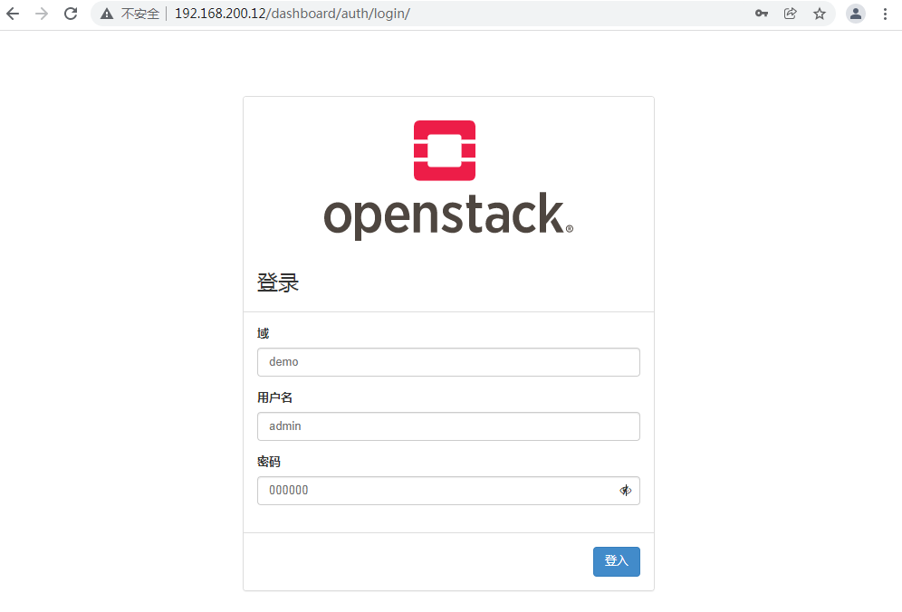
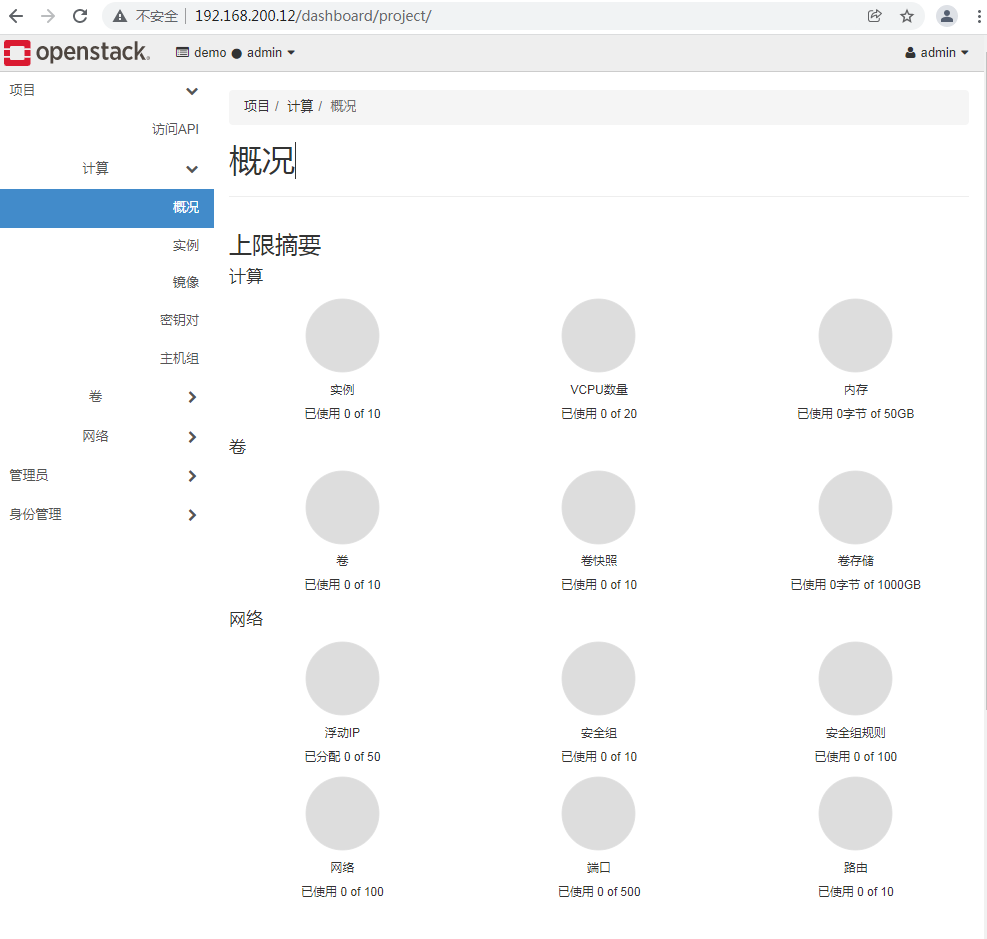
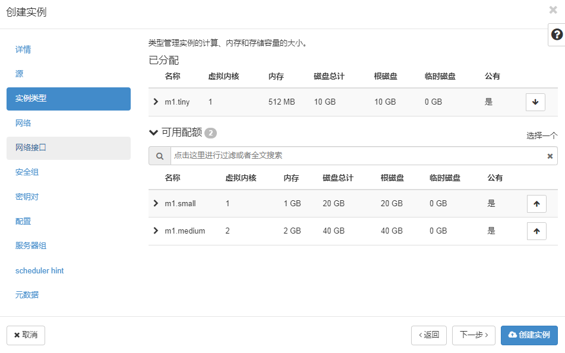

[toc]


## 案例：OpenStack基础平台部署[openstack基础平台部署案例.mp4](https://fdfs.douxuedu.com/group1/M00/00/4B/wKggBmIrGCWEF_TFAAAAANExw9A795.mp4)

### 案例准备

#### 1. 规划节点

节点规划见表1。

表1 节点规划

| **IP**         | **主机名** | **节点** |
| :------------- | :--------- | :------- |
| 192.168.200.12 | Controller | 控制节点 |
| 192.168.200.21 | Compute    | 计算节点 |

#### 2. 基础准备

在物理服务器上安装好的OpenStack云平台中使用CentOS7.9镜像申请两台云主机，云主机类型为4vcpu、8G内存、100G磁盘及50G临时磁盘；需要给云主机两个网络接口，网络接口1设置为外部网络，作为云主机通信和管理使用，网络接口2设置为内部网络，主要为云主机提供一个网卡设备。创建云主机结果如图1所示。


图1 创建云主机

### 案例实施

#### 1. 环境配置

（1）配置主机名

主机密码默认为Abc@1234，使用Linux命令修改节点主机名。

```shell
[root@controller ~]# hostnamectl set-hostname controller
[root@controller ~]# hostname
controller
[root@compute ~]# hostnamectl set-hostname compute
[root@compute ~]# hostname
compute
```

修改完成后，点击浏览器“刷新”按钮刷新页面，以生效新主机名。

（2）配置域名解析

使用vi命令在controller节点与compute节点的/etc/hosts文件添加如下内容，添加完成后输入:wq保存文件内容退出。

```shell
[root@controller ~]# vi /etc/hosts
…
192.168.200.12 controller
192.168.200.21 compute

[root@compute ~]# vi /etc/hosts
…
192.168.200.12 controller
192.168.200.21 compute
```

对应的IP地址根据申请的云主机实际IP地址填写。

（3）配置yum环境

将OpenStack云平台部署的iso文件通过curl命令下载到controller节点的/root目录下。在/opt目录生成centos7-2009和iaas-train目录，将安装镜像文件内容复制到centos7-2009和iaas目录中。

```shell
[root@controller ~]#curl -O http://mirrors.douxuedu.com/competition/chinaskills_cloud_iaas_v2.0.1.iso
[root@controller ~]# curl -O http://mirrors.douxuedu.com/competition/CentOS-7-x86_64-DVD-2009.iso
[root@controller ~]# mkdir /opt/{centos7-2009,iaas}
[root@controller ~]# mount /root/CentOS-7-x86_64-DVD-2009.iso /mnt/
mount: /dev/loop0 is write-protected, mounting read-only
[root@controller ~]# cp -r /mnt/* /opt/centos7-2009/
[root@controller ~]# umount /mnt/
[root@controller ~]# mount /root/chinaskills_cloud_iaas_v2.0.1.iso /mnt/
mount: /dev/loop0 is write-protected, mounting read-only
[root@controller ~]# cp -r /mnt/* /opt/iaas/
[root@controller ~]# umount /mnt/
```

配置controller节点Yum安装源文件yum.repo，指向本地文件目录路径。

```shell
[root@controller ~]# mv /etc/yum.repos.d/* /media/
[root@controller ~]# cat << EOF > /etc/yum.repos.d/yum.repo
[centos]
name=centos7-2009
baseurl=file:///opt/centos7-2009
gpgcheck=0
enabled=1
[openstack]
name=openstack-train
baseurl=file:///opt/iaas/iaas-repo
gpgcheck=0
enabled=1
EOF
[root@controller ~]# yum clean all && yum repolist
…
repo id            repo name                        status
centos            centos7-2009                      4,070
openstack         openstack-train                     953
repolist: 5,023
```

在controller节点使用Yum安装vsftpd服务，并将/opt目录下的文件共享出去。

```shell
[root@controller ~]# yum install -y vsftpd
…
Installed:
  vsftpd.x86_64 0:3.0.2-28.el7                                                               
Complete!
[root@controller ~]# echo "anon_root=/opt" >> /etc/vsftpd/vsftpd.conf 
[root@controller ~]# systemctl start vsftpd
[root@controller ~]# systemctl enable vsftpd
```

配置compute节点Yum安装源文件yum.repo，指向controller节点的共享文件目录路径。

```shell
[root@compute ~]# mv /etc/yum.repos.d/* /media/
[root@compute ~]# cat << EOF > /etc/yum.repos.d/yum.repo
[centos]	
name=centos7-2009
baseurl=ftp://controller/centos7-2009
gpgcheck=0
enabled=1
[openstack]
name=openstack-train
baseurl=ftp://controller/iaas/iaas-repo
gpgcheck=0
enabled=1
EOF
[root@compute ~]# yum clean all && yum repolist
…
repo id            repo name                        status
centos            centos7-2009                      4,070
openstack         openstack-train                     953
repolist: 5,023
```

（4）划分分区

在compute节点上的临时磁盘vdb中划分两个9G的分区。

```shell
[root@compute ~]# lsblk 
NAME   MAJ:MIN RM SIZE RO TYPE MOUNTPOINT
vda    253:0    0  40G  0 disk 
└─vda1 253:1    0  40G  0 part /
vdb    253:16   0  20G  0 disk 
vdc    253:32   0   1M  0 disk 
 [root@compute ~]# fdisk /dev/vdb
Welcome to fdisk (util-linux 2.23.2).

Changes will remain in memory only, until you decide to write them.
Be careful before using the write command.

Device does not contain a recognized partition table
Building a new DOS disklabel with disk identifier 0x64513eb0.

Command (m for help): n
Partition type:
   p   primary (0 primary, 0 extended, 4 free)
   e   extended
Select (default p): p
Partition number (1-4, default 1): 
First sector (2048-41943039, default 2048): 
Using default value 2048
Last sector, +sectors or +size{K,M,G} (2048-41943039, default 41943039): +9G
Partition 1 of type Linux and of size 9 GiB is set

Command (m for help): n
Partition type:
   p   primary (1 primary, 0 extended, 3 free)
   e   extended
Select (default p): p
Partition number (2-4, default 2): 
First sector (18876416-41943039, default 18876416): 
Using default value 18876416
Last sector, +sectors or +size{K,M,G} (18876416-41943039, default 41943039): +9G
Partition 2 of type Linux and of size 9 GiB is set

Command (m for help): p

Disk /dev/vdb: 21.5 GB, 21474836480 bytes, 41943040 sectors
Units = sectors of 1 * 512 = 512 bytes
Sector size (logical/physical): 512 bytes / 512 bytes
I/O size (minimum/optimal): 512 bytes / 512 bytes
Disk label type: dos
Disk identifier: 0x64513eb0

   Device Boot      Start         End      Blocks   Id  System
/dev/vdb1            2048    18876415     9437184   83  Linux
/dev/vdb2        18876416    37750783     9437184   83  Linux

Command (m for help): w
The partition table has been altered!

Calling ioctl() to re-read partition table.
Syncing disks.
[root@compute ~]# lsblk 
NAME   MAJ:MIN RM SIZE RO TYPE MOUNTPOINT
vda    253:0    0  40G  0 disk 
└─vda1 253:1    0  40G  0 part /
vdb    253:16   0  20G  0 disk 
├─vdb1 253:17   0   9G  0 part 
└─vdb2 253:18   0   9G  0 part 
vdc    253:32   0   1M  0 disk
```

#### 2. OpenStack云平台部署

完成基础环境部署后，就可以开始部署安装OpenStack云平台。

（1）配置环境变量

在controller节点和compute节点安装OpenStack云平台的安装脚本软件包。

```shell
[root@controller ~]# yum install -y openstack-iaas
…
Installed:
  openstack-train.x86_64 0:v1.0.2-1.el7                                                      
Complete!

[root@compute ~]# yum install -y openstack-iaas
…
Installed:
  openstack-train.x86_64 0:v1.0.2-1.el7                                                      
Complete!
```

在controller节点和compute节点配置环境变量文件/etc/openstack/openrc.sh，按“i”键进入openrc.sh编辑模式：

```shell
[root@controller ~]# vi /etc/openstack/openrc.sh 
```

脚本修改以下内容，配置完按ESC键输入:

```shell
:%s/^.\{1\}//
```

删除每行前1个字符，再按ESC键输入:wq保存退出 ：

```shell
HOST_IP=192.168.200.12
HOST_PASS=Abc@1234           #controller节点root用户密码
HOST_NAME=controller
HOST_IP_NODE=192.168.200.21
HOST_PASS_NODE=Abc@1234      #compute节点root用户密码
HOST_NAME_NODE=compute
network_segment_IP=192.168.200.0/24
RABBIT_USER=openstack
RABBIT_PASS=000000
DB_PASS=000000
DOMAIN_NAME=demo
ADMIN_PASS=000000
DEMO_PASS=000000
KEYSTONE_DBPASS=000000
GLANCE_DBPASS=000000
GLANCE_PASS=000000
PLACEMENT_DBPASS=000000
PLACEMENT_PASS=000000
NOVA_DBPASS=000000
NOVA_PASS=000000
NEUTRON_DBPASS=000000
NEUTRON_PASS=000000
METADATA_SECRET=000000
INTERFACE_NAME=eth1      #云主机第二张网卡名称
Physical_NAME=provider
minvlan=1
maxvlan=1000
CINDER_DBPASS=000000
CINDER_PASS=000000
BLOCK_DISK=vdb1          #compute节点第一个分区名称
SWIFT_PASS=000000
OBJECT_DISK=vdb2          #compute节点第二个分区名称
STORAGE_LOCAL_NET_IP=192.168.200.21
```

（2）部署OpenStack云平台基础环境

在controller节点和compute节点都执行脚本iaas-pre-host.sh部署OpenStack云平台基础环境。完成后使用reboot命令重启虚拟机以生效配置。

```shell
[root@controller ~]# iaas-pre-host.sh
[root@compute ~]# iaas-pre-host.sh
```

（3）部署Mariadb数据库及Rabbit消息队列服务

在controller节点执行脚本部署Mariadb数据库及Rabbit消息队列服务。

```shell
[root@controller ~]# iaas-install-mysql.sh
```

（4）部署Keystone服务

在controller节点执行脚本部署Keystone服务。

```shell
[root@controller ~]# iaas-install-keystone.sh
```

（5）部署Glance服务

在controller节点执行脚本部署Glance服务。

```shell
[root@controller ~]# iaas-install-glance.sh
```

（6）部署Nova服务

在controller节点执行脚本部署Nova组件的控制服务。

```shell
[root@controller ~]# iaas-install-placement.sh
[root@controller ~]# iaas-install-nova-controller.sh
```

执行完上面的脚本后，在compute节点执行脚本部署Nova组件的计算服务，这样就将compute节点的CPU、内存及磁盘资源添加到OpenStack云平台的资源池中了。

```shell
[root@compute ~]# iaas-install-nova-compute.sh
```

（7）部署Neutron服务

在controller节点执行脚本部署Neutron组件的控制服务。

```shell
[root@controller ~]# iaas-install-neutron-controller.sh
```

在compute节点执行脚本部署Neutron组件的计算服务。

```shell
[root@compute ~]# iaas-install-neutron-compute.sh
```

（8）部署Dashboard服务

在controller节点执行脚本部署Dashboard组件服务。

```shell
[root@controller ~]# iaas-install-dashboard.sh
```

安装完成后，使用Google浏览器访问OpenStack云平台，访问地址为：http://192.168.100.10/dashboard，domain为demo，用户名为admin，密码为000000。结果如图2和图3所示。


图2 OpenStack云平台dashboard访问1


图3 OpenStack云平台dashboard访问2

（9）部署Cinder服务

在controller节点执行脚本部署Cinder组件的控制服务。

```shell
[root@controller ~]# iaas-install-cinder-controller.sh
```

controller节点脚本执行完成后，在compute节点执行脚本部署Cinder组件的计算服务。

```shell
[root@compute ~]# iaas-install-cinder-compute.sh
```

（10）部署Swift服务

在controller节点执行脚本部署Swift组件的控制服务。

```shell
[root@controller ~]# iaas-install-swift-controller.sh
```

controller节点脚本执行完成后，在compute节点执行脚本部署Swift组件的计算服务。

```shell
[root@compute ~]# iaas-install-swift-compute.sh
```

#### 3. 创建cirros云主机

（1）上传镜像

在controller节点下载镜像并上传cirros镜像。

```
[root@controller ~]# curl -O http://mirrors.douxuedu.com/competition/cirros-0.3.4-x86_64-disk.img
[root@controller ~]# source /etc/keystone/admin-openrc.sh
[root@controller ~]# glance image-create --name cirros --disk-format qcow2 --container-format bare < /opt/iaas/images/cirros-0.3.4-x86_64-disk.img 
+------------------+--------------------------------------------------------------------+
| Property         | Value                                                              |
+------------------+--------------------------------------------------------------------+
| checksum         | ee1eca47dc88f4879d8a229cc70a07c6                                   |
| container_format | bare                                                               |
| created_at       | 2022-02-16T02:58:23Z                                               |
| disk_format      | qcow2                                                              |
| id               | 76ce1b38-b1fa-465c-947f-288ea4760761                               |
| min_disk         | 0                                                                  |
| min_ram          | 0                                                                  |
| name             | cirros                                                             |
| os_hash_algo     | sha512                                                             |
| os_hash_value    | 1b03ca1bc3fafe448b90583c12f367949f8b0e665685979d95b004e48574b953316799e23240f4f7        |
|                  | 39d1b5eb4c4ca24d38fdc6f4f9d8247a2bc64db25d6bbdb2                   |
| os_hidden        | False                                                              |
| owner            | 1ac0739939db4dc78bf42802ba0205e9                                   |
| protected        | False                                                              |
| size             | 13287936                                                           |
| status           | active                                                             |
| tags             | []                                                                 |
| updated_at       | 2022-02-16T02:58:24Z                                               |
| virtual_size     | Not available                                                      |
| visibility       | shared                                                             |
+------------------+--------------------------------------------------------------------+
```

（2）创建网络

在controller节点使用OpenStack相关命令创建一个net网络。

```shell
[root@controller ~]# source /etc/keystone/admin-openrc.sh
[root@controller ~]# openstack network create net --mtu 1350
[root@controller ~]# openstack subnet create --network net --subnet-range 10.0.0.0/24 --gateway 10.0.0.1 subnet
```

（3）创建云主机

登录Dashboard页面，在左侧菜单栏中选择“项目→计算→实例”，单击“创建实例”按钮，输入实例名称cirros，默认可用域为nova，数量为1，单击“下一步”按钮，创建步骤如图4所示。


图4虚拟机创建1

选择已共享的cirros镜像，选择不创建新卷，单击“下一步”按钮，创建步骤如图5所示。


图5虚拟机创建2

选择m1.tiny实例类型，单击“下一步”按钮，创建步骤如图6所示。


图6虚拟机创建3

选择net为虚拟机的网络，这样最后单击“创建实例”按钮就可以完成虚拟机创建，创建步骤如图7所示。


图7虚拟机创建4

等虚拟机创建完成后，可以看到虚拟机状态为“运行”，如图8所示。只要求创建cirros的云主机不报错，不要求创建后的cirros云主机可以使用CRT连接。


图8 cirros虚拟机运行