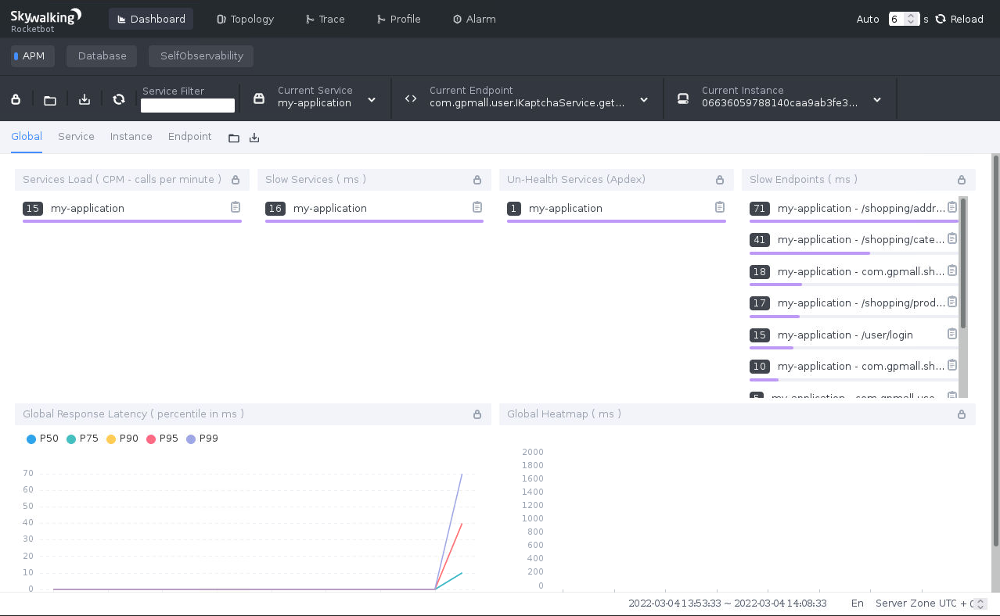

## 案例描述[OpenStack私有云应用部署案例.mp4](https://fdfs.douxuedu.com/group1/M00/00/4A/wKggBmIq3G2EBjsUAAAAAJx_lsE175.mp4)

本案例共讲述了Elasticsearch服务的搭建，以及搭建SkyWalking对应用商城利用探针方式进行检测。具体如下：

（1）搭建Elasticsearch服务；

（2）搭建SkyWalking OAP服务；

（3）搭建SkyWalking UI服务；

（4）搭建并启动应用商城服务，并配置 SkyWalking Agent。

## 案例：SkyWalking服务应用

### 案例准备

#### 1. 规划节点

节点规划见表1。

表1 节点规划

| **IP**        | **主机名** | **节点**                |
| :------------ | :--------- | :---------------------- |
| 10.24.194.203 | node-1     | Skywalking实验节点      |
| 10.24.193.168 | mall       | 商城搭建节点            |
| 10.24.193.169 | desktop    | centos-desktop-base节点 |

#### 2. 基础准备

登录物理OpenStack平台，使用CentOS 7.9镜像创建两台云主机，云主机类型使用4VCPU/8GB内存/40GB硬盘。创建后的云主机作为本次案例的实验节点。

### 案例实施

#### 1. 部署Elasticsearch服务

（1）修改主机名，修改主机名后，执行bash命令 或者刷新页面以生效新主机名。

```shell
[root@node-1 ~]# hostnamectl set-hostname node-1
[root@node-1 ~]# hostnamectl 
   Static hostname: node-1
         Icon name: computer-vm
           Chassis: vm
        Machine ID: cc2c86fe566741e6a2ff6d399c5d5daa
           Boot ID: 6c32a0c1d29e4f30929422c8032239ca
    Virtualization: kvm
  Operating System: CentOS Linux 7 (Core)
       CPE OS Name: cpe:/o:centos:centos:7
            Kernel: Linux 3.10.0-1160.el7.x86_64
      Architecture: x86-64
```

（2）将提供的elasticsearch-7.17.0-linux-x86_64.tar.gz软件包下载到此节点并解压到/opt目录，进入解压后的目录并创建data目录：

```shell
[root@node-1 ~]# curl -O http://mirrors.douxuedu.com/competition/elasticsearch-7.17.0-linux-x86_64.tar.gz
[root@node-1 ~]# tar -zxvf elasticsearch-7.17.0-linux-x86_64.tar.gz -C /opt
[root@node-1 ~]# cd /opt/elasticsearch-7.17.0/
[root@node-1 elasticsearch-7.17.0]# mkdir data
```

（3）修改Elasticsearch配置，在文件最后添加如下几行内容，按“i”建进入编辑模式进行配置，按ESC键输入:wq保存退出。

```shell
[root@node-1 elasticsearch-7.17.0]# vi config/elasticsearch.yml
…
cluster.name: my-application
node.name: node-1
path.data: /opt/elasticsearch-7.17.0/data
path.logs: /opt/elasticsearch-7.17.0/logs
network.host: 0.0.0.0
cluster.initial_master_nodes: ["node-1"]
http.cors.enabled: true
http.cors.allow-origin: "*"
http.cors.allow-headers: Authorization,X-Requested-With,Content-Length,Content-Type
```

（4）创建Elasticsearch启动用户，并设置属组及权限：

```shell
[root@node-1 elasticsearch-7.17.0]# groupadd elsearch
[root@node-1 elasticsearch-7.17.0]# useradd elsearch -g elsearch -p elasticsearch
[root@node-1 elasticsearch-7.17.0]# chown -R elsearch:elsearch /opt/elasticsearch-7.17.0
```

（5）修改资源限制及内核配置，添加如下内容：

```shell
[root@node-1 elasticsearch-7.17.0]# vi /etc/security/limits.conf
…
* hard    nofile           65536
* soft    nofile           65536
[root@node-1 elasticsearch-7.17.0]# vi /etc/sysctl.conf
vm.max_map_count=262144
[root@node-1 elasticsearch-7.17.0]# sysctl -p
[root@node-1 elasticsearch-7.17.0]# reboot
```

重启后等待一段时间后刷新页面点击重新连接。

（6）启动Elasticsearch服务：

```shell
[root@node-1 ~]# cd /opt/elasticsearch-7.17.0/
[root@node-1 elasticsearch-7.17.0]# su elsearch
[elsearch@node-1 elasticsearch-7.17.0]$ ./bin/elasticsearch -d
```

（7）查询端口，存在9200则成功启动：

```shell
[root@node-1 elasticsearch-7.17.0]$ netstat -ntpl
Active Internet connections (only servers)
Proto Recv-Q Send-Q Local Address           Foreign Address     State    PID/Program name  tcp        0      0 0.0.0.0:22              0.0.0.0:*           LISTEN      1081/sshd      tcp        0      0 127.0.0.1:25            0.0.0.0:*           LISTEN      1041/master    tcp        0      0 0.0.0.0:111             0.0.0.0:*           LISTEN      610/rpcbind   
tcp6       0      0 :::9300                 :::*                LISTEN      2261/java     
tcp6       0      0 :::22                   :::*                LISTEN      1081/sshd     
tcp6       0      0 ::1:25                  :::*                LISTEN      1041/master   
tcp6       0      0 :::111                  :::*                LISTEN      610/rpcbind   
tcp6       0      0 :::9200                 :::*                LISTEN      2261/java
```

（8）切换至带有桌面的虚拟机环境中，使用浏览器访问10.24.193.154:9200，如图1所示：


图1 Elasticsearch服务访问

#### 2. 部署SkyWalking OAP服务

（1）将提供的jdk-8u144-linux-x64.tar.gz软件包下载至node-1节点/root/目录中，并配置jdk如下所示：

```shell
[elsearch@node-1 elasticsearch-7.17.0]$ exit
[root@node-1 elasticsearch-7.17.0]# cd
[root@node-1 ~]# curl -O http://mirrors.douxuedu.com/competition/jdk-8u144-linux-x64.tar.gz
[root@node-1 ~]# tar -zxvf jdk-8u144-linux-x64.tar.gz -C /usr/local/
```

修改profile环境变量文件，代码如下所示：

```shell
[root@node-1 ~]# vi /etc/profile
export JAVA_HOME=/usr/local/jdk1.8.0_144
export CLASSPATH=.:${JAVA_HOME}/jre/lib/rt.jar:${JAVA_HOME}/lib/dt.jar:${JAVA_HOME}/lib/tools.jar
export PATH=$PATH:${JAVA_HOME}/bin
[root@node-1 ~]# source /etc/profile
[root@node-1 ~]# java -version
java version "1.8.0_144"
Java(TM) SE Runtime Environment (build 1.8.0_144-b01)
Java HotSpot(TM) 64-Bit Server VM (build 25.144-b01, mixed mode)
```

（2）将提供的apache-skywalking-apm-es7-8.0.0.tar.gz软件包下载至node-1节点上并解压到/opt目录下：

```shell
[root@node-1 ~]# curl -O http://mirrors.douxuedu.com/competition/apache-skywalking-apm-es7-8.0.0.tar.gz
[root@node-1 ~]# tar -zxvf apache-skywalking-apm-es7-8.0.0.tar.gz -C /opt
```

（3）进入解压后目录，修改OAP配置文件：

```shell
[root@node-1 ~]# cd /opt/apache-skywalking-apm-bin-es7/
[root@node-1 apache-skywalking-apm-bin-es7]# vi config/application.yml
…
#集群配置使用单机版
cluster:
  selector: ${SW_CLUSTER:standalone}
  standalone:
…
#数据库使用elasticsearch7
storage:
  selector: ${SW_STORAGE:elasticsearch7}
…
  elasticsearch7:
    nameSpace: ${SW_NAMESPACE:""}
    clusterNodes: ${SW_STORAGE_ES_CLUSTER_NODES:10.24.194.203:9200}
…
```

（4）启动OAP服务，查询端口，存在11800与12800则成功启动：

```shell
[root@node-1 apache-skywalking-apm-bin-es7]# ./bin/oapService.sh 
SkyWalking OAP started successfully!
[root@node-1 apache-skywalking-apm-bin-es7]# netstat -ntpl
Active Internet connections (only servers)
Proto Recv-Q Send-Q Local Address           Foreign Address    State     PID/Program name 
tcp        0      0 0.0.0.0:22              0.0.0.0:*          LISTEN      1081/sshd     
tcp        0      0 127.0.0.1:25            0.0.0.0:*          LISTEN      1041/master   
tcp        0      0 0.0.0.0:111             0.0.0.0:*          LISTEN      610/rpcbind   
tcp6       0      0 :::9300                 :::*               LISTEN      2261/java     
tcp6       0      0 :::22                   :::*               LISTEN      1081/sshd     
tcp6       0      0 :::11800                :::*               LISTEN      2416/java     
tcp6       0      0 ::1:25                  :::*               LISTEN      1041/master   
tcp6       0      0 :::12800                :::*               LISTEN      2416/java     
tcp6       0      0 :::111                  :::*               LISTEN      610/rpcbind   
tcp6       0      0 :::9200                 :::*               LISTEN      2261/java
```

#### 3. 部署SkyWalking UI服务

（1）由于SkyWalking UI的默认地址是8080，与很多中间件可能存在冲突，修改一下：

```shell
[root@node-1 apache-skywalking-apm-bin-es7]# vi webapp/webapp.yml
…
server:
  port: 8888
…
```

（2）启动SkyWalking UI服务：

```shell
[root@node-1 apache-skywalking-apm-bin-es7]# ./bin/webappService.sh 
SkyWalking Web Application started successfully!
```

（3）查看端口，存在8888则成功启动：

```shell
[root@node-1 apache-skywalking-apm-bin-es7]# netstat -ntpl
Active Internet connections (only servers)
Proto Recv-Q Send-Q Local Address           Foreign Address     State    PID/Program name 
tcp        0      0 0.0.0.0:22              0.0.0.0:*           LISTEN      1081/sshd     
tcp        0      0 127.0.0.1:25            0.0.0.0:*           LISTEN      1041/master   
tcp        0      0 0.0.0.0:111             0.0.0.0:*           LISTEN      610/rpcbind   
tcp6       0      0 :::9300                 :::*                LISTEN      2261/java     
tcp6       0      0 :::22                   :::*                LISTEN      1081/sshd     
tcp6       0      0 :::8888                 :::*                LISTEN      3133/java     
tcp6       0      0 :::11800                :::*                LISTEN      2416/java     
tcp6       0      0 ::1:25                  :::*                LISTEN      1041/master   
tcp6       0      0 :::12800                :::*                LISTEN      2416/java     
tcp6       0      0 :::111                  :::*                LISTEN      610/rpcbind   
tcp6       0      0 :::9200                 :::*                LISTEN      2261/java
```

（4）切换带有桌面的虚拟机环境，使用火狐浏览器访问10.24.194.203:8888，此时访问页面无数据，如图2所示：


图2 访问SkyWalking UI服务

#### 4. 搭建并启动应用商城服务

切换至提供mall节点，搭建并启动应用商城服务，并配置SkyWalking Agent

（1）修改mall节点主机名，修改主机名后，执行bash命令或者刷新斗学网页面以生效新主机名。

```shell
[root@localhost ~]# hostnamectl set-hostname mall
[root@mall ~]# hostnamectl 
   Static hostname: mall
         Icon name: computer-vm
           Chassis: vm
        Machine ID: cc2c86fe566741e6a2ff6d399c5d5daa
           Boot ID: 51559d155ec14aafad2411ca8b85db42
    Virtualization: kvm
  Operating System: CentOS Linux 7 (Core)
       CPE OS Name: cpe:/o:centos:centos:7
            Kernel: Linux 3.10.0-1160.el7.x86_64
      Architecture: x86-64
```

修改/etc/hosts配置文件如下：

```shell
[root@mall ~]# vi /etc/hosts
127.0.0.1   localhost localhost.localdomain localhost4 localhost4.localdomain4
::1         localhost localhost.localdomain localhost6 localhost6.localdomain6

10.24.193.168 mall
```

（2）配置本地Yum源

将提供的gpmall包下载到服务器的/root目录下并解压gpmall.tar.gz，配置本地local.repo文件，具体代码如下所示：

```shell
[root@mall ~]# curl -O http://mirrors.douxuedu.com/competition/gpmall.tar.gz
[root@mall ~]# tar -zxvf gpmall.tar.gz
[root@mall ~]# mv /etc/yum.repos.d/* /media/
[root@mall ~]# cd gpmall/
[root@mall gpmall]# tar -zxvf gpmall-repo.tar.gz -C  /root/
[root@mall ~]# vi /etc/yum.repos.d/local.repo 
[mall]
name=mall
baseurl=file:///root/gpmall-repo
gpgcheck=0
enabled=1
```

（3）安装基础服务

安装基础服务，包括Java JDK环境、数据库、Redis、Nginx等，安装基础服务的命令具体如下。

① 安装Java环境

```shell
[root@mall ~]# yum install  -y java-1.8.0-openjdk java-1.8.0-openjdk-devel  
...  
[root@mall ~]# java  -version  
openjdk version  "1.8.0_322"  
OpenJDK Runtime  Environment (build 1.8.0_322-b06)  
OpenJDK 64-Bit Server  VM (build 25.322-b06, mixed mode)  
```

② 安装Redis缓存服务

```shell
[root@mall ~]# yum install  redis -y  
```

③ 安装Nginx服务

```shell
[root@mall ~]# yum  install nginx -y  
```

④ 安装MariaDB数据库

```shell
[root@mall ~]# yum  install mariadb mariadb-server -y  
```

安装ZooKeeper服务，将提供的zookeeper-3.4.14.tar.gz解压，命令如下：

```shell
[root@mall gpmall]# tar -zxvf zookeeper-3.4.14.tar.gz -C /root/
```

进入到zookeeper-3.4.14/conf目录下，将zoo_sample.cfg文件重命名为zoo.cfg，命令如下：

```shell
[root@mall gpmall]# cd /root/zookeeper-3.4.14/conf/
[root@mall conf]# mv zoo_sample.cfg zoo.cfg
```

进入到zookeeper-3.4.14/bin目录下，启动ZooKeeper服务，命令如下：

```shell
[root@mall conf]# cd ../bin
[root@mall bin]# ./zkServer.sh start
ZooKeeper JMX enabled by default
Using config: /root/zookeeper-3.4.14/bin/../conf/zoo.cfg
Starting zookeeper ... STARTED
```

查看ZooKeeper状态，命令如下：

```shell
[root@mall bin]# ./zkServer.sh status
ZooKeeper JMX enabled by default
Using config: /root/zookeeper-3.4.14/bin/../conf/zoo.cfg
Mode: standalone
```

安装Kafka服务，将提供的kafka_2.11-1.1.1.tgz解压至/root目录下，命令如下：

```shell
[root@mall bin]# tar -zxvf /root/gpmall/kafka_2.11-1.1.1.tgz -C /root
```

进入到kafka_2.11-1.1.1/bin目录下，启动Kafka服务，命令如下：

```shell
[root@mall bin]# cd /root/kafka_2.11-1.1.1/bin/
[root@mall bin]# ./kafka-server-start.sh -daemon ../config/server.properties
```

使用jps或者netstat -ntpl命令查看Kafka是否成功启动，命令如下：

```shell
[root@mall bin]# jps
6039 Kafka
1722 QuorumPeerMain
6126 Jps
[root@mall bin]# netstat -ntpl
Active Internet connections (only servers)
Proto Recv-Q Send-Q Local Address           Foreign Address     State    PID/Program name 
tcp        0      0 0.0.0.0:22              0.0.0.0:*           LISTEN      1008/sshd     
tcp        0      0 127.0.0.1:25            0.0.0.0:*           LISTEN      887/master   
tcp6       0      0 :::9092                 :::*                LISTEN      6039/java     
tcp6       0      0 :::46949                :::*                LISTEN      6039/java     
tcp6       0      0 :::2181                 :::*                LISTEN      1722/java     
tcp6       0      0 :::48677                :::*                LISTEN      1722/java     
tcp6       0      0 :::22                   :::*                LISTEN      1008/sshd     
tcp6       0      0 ::1:25                  :::*                LISTEN      887/mast 
```

运行结果查看到Kafka服务和9092端口，说明Kafka服务已启动。

（4）启动服务

① 启动数据库并配置

修改数据库配置文件并启动MariaDB数据库，设置root用户密码为123456，并创建gpmall数据库，将提供的gpmall.sql导入。

修改/etc/my.cnf文件，添加字段如下所示：

```shell
[root@mall bin]# cd
[root@mall ~]# vi /etc/my.cnf
[mysqld]
…
init_connect='SET collation_connection = utf8_unicode_ci'
init_connect='SET NAMES utf8'
character-set-server=utf8
collation-server=utf8_unicode_ci
skip-character-set-client-handshake
```

启动数据库命令如下。

```shell
[root@mall ~]#  systemctl start mariadb  
```

设置root用户的密码为123456并登录。

```shell
[root@mall ~]# mysqladmin -uroot password 123456
[root@mall ~]# mysql -uroot -p123456
Welcome to the MariaDB monitor.  Commands end with ; or \g.
Your MariaDB connection id is 3
Server version: 5.5.68-MariaDB MariaDB Server

Copyright (c) 2000, 2018, Oracle, MariaDB Corporation Ab and others.

Type 'help;' or '\h' for help. Type '\c' to clear the current input statement.

MariaDB [(none)]>
```

设置root用户的权限，命令如下：

```shell
MariaDB [(none)]> grant all privileges on *.* to root@localhost identified by '123456' with grant option;
Query OK, 0 rows affected (0.001 sec)

MariaDB [(none)]> grant all privileges on *.* to root@"%" identified by '123456' with grant option;
Query OK, 0 rows affected (0.001 sec)
```

创建数据库gpmall并导入/root/gpmall/目录中的gpmall.sql文件。

```shell
MariaDB [(none)]> create database gpmall;
Query OK, 1 row affected (0.00 sec)
MariaDB [(none)]> use gpmall;
MariaDB [gpmall]> source /root/gpmall/gpmall.sql
```

退出数据库并设置开机自启。

```shell
MariaDB [gpmall]> exit
Bye 
[root@mall ~]# systemctl enable mariadb
Created symlink from /etc/systemd/system/mysql.service to /usr/lib/systemd/system/mariadb.service.
Created symlink from /etc/systemd/system/mysqld.service to /usr/lib/systemd/system/mariadb.service.
Created symlink from /etc/systemd/system/multi-user.target.wants/mariadb.service to /usr/lib/systemd/system/mariadb.service.
```

② 启动Redis服务

修改Redis配置文件，编辑/etc/redis.conf文件。

将bind 127.0.0.1这一行注释掉；将protected-mode yes 改为 protected-mode no。

启动Redis服务命令如下。

```shell
[root@mall ~]# vi /etc/redis.conf
…
#bind 127.0.0.1
protected-mode no
…
[root@mall ~]# systemctl start redis
[root@mall ~]# systemctl enable redis
Created symlink from /etc/systemd/system/multi-user.target.wants/redis.service to /usr/lib/systemd/system/redis.service.
```

③ 启动Nginx服务

启动Nginx服务命令如下。

```shell
[root@mall ~]# systemctl start nginx
[root@mall ~]# systemctl enable nginx
Created symlink from /etc/systemd/system/multi-user.target.wants/nginx.service to /usr/lib/systemd/system/nginx.service.
```

（5）应用系统部署

使用提供gpmall-shopping-0.0.1-SNAPSHOT.jar、gpmall-user-0.0.1-SNAPSHOT.jar、shopping-provider-0.0.1-SNAPSHOT.jar、user-provider-0.0.1-SNAPSHOT.jar 、dist这5个包部署应用系统，其中4个jar包为后端服务包，dist为前端包。（包在gpmall目录下）

① 全局变量配置

修改/etc/hosts文件，修改项目全局配置文件如下（原有的172.128.11.42 mall映射删除）：

```shell
[root@mall ~]# cat /etc/hosts
127.0.0.1   localhost localhost.localdomain localhost4 localhost4.localdomain4
::1         localhost localhost.localdomain localhost6 localhost6.localdomain6
10.24.193.168 kafka.mall
10.24.193.168 mysql.mall
10.24.193.168 redis.mall
10.24.193.168 zookeeper.mall
```

② 部署前端

清空默认项目路径下的文件，将dist目录下的文件，复制到Nginx默认项目路径（文件在gpmall目录下）。

```shell
[root@mall ~]# rm -rf /usr/share/nginx/html/*
[root@mall ~]# cp -rvf gpmall/dist/* /usr/share/nginx/html/
```

修改Nginx配置文件/etc/nginx/nginx.conf，添加映射如下所示：

```ini
[root@mall ~]# vi /etc/nginx/nginx.conf
…
    server {
        listen       80;
        listen       [::]:80;
        server_name  _;
        root         /usr/share/nginx/html;

        # Load configuration files for the default server block.
        include /etc/nginx/default.d/*.conf;
         
        location / {
        root   /usr/share/nginx/html;
        index  index.html index.htm;
        }
        location /user {
            proxy_pass http://127.0.0.1:8082;
        }

        location /shopping {
            proxy_pass http://127.0.0.1:8081;
        }

        location /cashier {
            proxy_pass http://127.0.0.1:8083;
        }

        error_page 404 /404.html;
…
```

重启Nginx服务，命令如下：

```shell
[root@mall ~]# systemctl restart nginx
```

到此，前端部署完毕。

③ 部署后端

将node-1节点的/opt/apache-skywalking-apm-bin-es7目录下的agent目录复制到mall节点下(密码为Abc@1234)：

```shell
[root@mall ~]# scp -r 10.24.194.203:/opt/apache-skywalking-apm-bin-es7/agent /root
```

修改SkyWalking agent配置文件：

```shell
[root@mall ~]# vi agent/config/agent.config
…
agent.service_name=${SW_AGENT_NAME:my-application}
agent.sample_n_per_3_secs=${SW_AGENT_SAMPLE:1}
…
collector.backend_service=${SW_AGENT_COLLECTOR_BACKEND_SERVICES:10.24.194.203:11800}
…
```

采样率修改：agent.sample_n_per_3_secs配置说明：

在访问量较少时，链路全量收集不会对系统带来太大负担，能够完整的观测到系统的运行状况。但是在访问量较大时，全量的链路收集，对链路收集的客户端（agent探针）、服务端（SkyWalking OAP）、存储器（例如说Elastcsearch）都会带来较大的性能开销，甚至会影响应用的正常运行。在访问量级较大的情况下，往往会选择抽样采样，只收集部分链路信息。SkyWalking Agent在agent/config/agent.config 配置文件中，定义了agent.sample_n_per_3_secs配置项，设置每3秒可收集的链路数据的数量。

将gpmall软件包中提供的4个jar包，放置探针并启动，通过设置启动参数的方式检测系统，启动命令如下：

```shell
[root@mall ~]# nohup java -javaagent:/root/agent/skywalking-agent.jar  -jar gpmall/shopping-provider-0.0.1-SNAPSHOT.jar &
[1] 20086
[root@mall ~]# nohup: ignoring input and appending output to ‘nohup.out’

[root@mall ~]# nohup java -javaagent:/root/agent/skywalking-agent.jar  -jar gpmall/user-provider-0.0.1-SNAPSHOT.jar &
[2] 20132
[root@mall ~]# nohup: ignoring input and appending output to ‘nohup.out’

[root@mall ~]# nohup java -javaagent:/root/agent/skywalking-agent.jar  -jar gpmall/gpmall-shopping-0.0.1-SNAPSHOT.jar &
[3] 20177
[root@mall ~]# nohup: ignoring input and appending output to ‘nohup.out’

[root@mall ~]# nohup java -javaagent:/root/agent/skywalking-agent.jar  -jar gpmall/gpmall-user-0.0.1-SNAPSHOT.jar &
[4] 20281
[root@mall ~]# nohup: ignoring input and appending output to ‘nohup.out’
# httpd访问网络配置
[root@mall ~]# setsebool -P httpd_can_network_connect 1
```

按照顺序运行4个jar包后，至此后端服务部署完毕。

④ 网站访问

打开浏览器，在地址栏中输入http://10.24.193.168，访问界面，如图3所示。


图3 商城首页

单击右上角“头像”，进行登录操作，使用用户名/密码为test/test进行登录，如图4所示。


图4 登录界面

登录后，可进行购买商品操作，单击首页“地平线8号”旅行箱图片，如图5所示。


图5 商品页面

进入购买界面，单击“现在购买”按钮，进行购买商品操作，如图6所示。


图6 购买界面

单机完“现在购买”按钮，跳转到提交订单界面，如图7所示。

)

图7 订单界面

至此，单机部署应用系统完成。

（6）再次访问SkyWalking UI，点击右上角的自动按钮（Auto），发现已有数据产生，如图8与图9所示：



图8 访问SkyWalking UI


如图9 拓扑展示