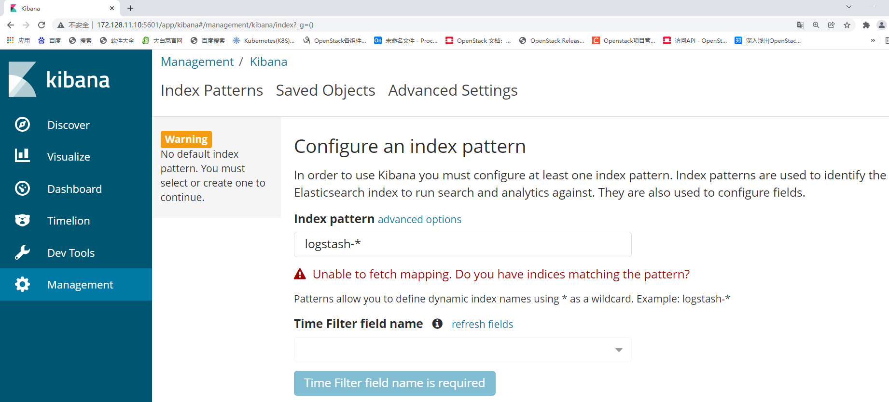
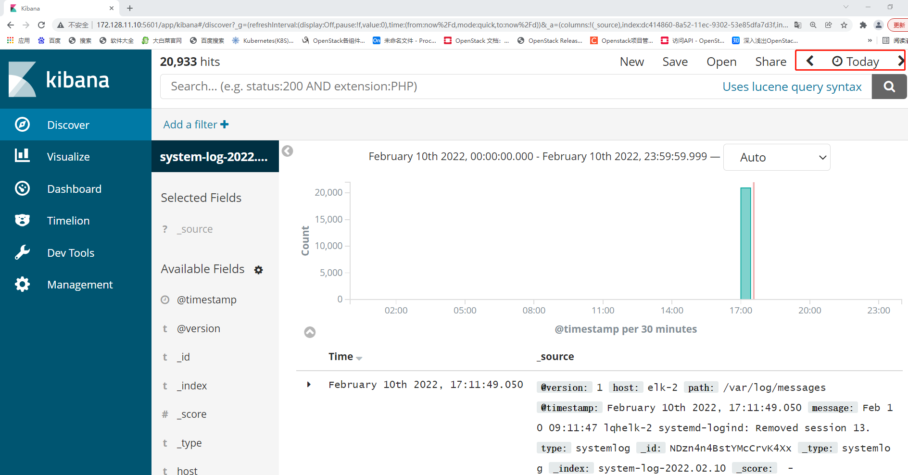

## 案例：ELK日志分析系统部署[Linux系统集群部署应用案例.mp4](https://fdfs.douxuedu.com/group1/M00/00/4A/wKggBmIq3nCEFufJAAAAAPc9nnU424.mp4)

### 案例准备

#### 1. 规划节点

节点规划见表1。

表1 节点规划

| **IP**        | **主机名** | **节点**               |
| :------------ | :--------- | :--------------------- |
| 172.128.11.10 | elk-1      | Elasticsearch/Kibana   |
| 172.128.11.17 | elk-2      | Elasticsearch/Logstash |
| 172.128.11.11 | elk-3      | Elasticsearch          |

#### 2. 基础准备

根据云平台所分配三台CentOS 7.9系统云主机和一台带有图形化页面云主机。使用所分配的云主机作为本次案例的实验节点。

### 案例实施

#### 1. 基础环境配置

（1）三台主机修改主机名

访问第一个节点elk-1节点：

```shell
[root@lqhelk-1 ~]# hostnamectl set-hostname elk-1
[root@lqhelk-1 ~]# bash 
[root@elk-1 ~]# hostnamectl 
   Static hostname: elk-1
         Icon name: computer-vm
           Chassis: vm
        Machine ID: cc2c86fe566741e6a2ff6d399c5d5daa
           Boot ID: 4786f596058f424db58406c8c1b9c635
    Virtualization: kvm
  Operating System: CentOS Linux 7 (Core)
       CPE OS Name: cpe:/o:centos:centos:7
            Kernel: Linux 3.10.0-1160.el7.x86_64
      Architecture: x86-64
```

访问第二个节点elk-2节点：

```shell
[root@lqhelk-2 ~]# hostnamectl  set-hostname elk-2
[root@lqhelk-2 ~]# bash 
[root@elk-2 ~]# hostnamectl  
   Static hostname: elk-2
         Icon name: computer-vm
           Chassis: vm
        Machine ID: cc2c86fe566741e6a2ff6d399c5d5daa
           Boot ID: 17e276b0811d4a01907ab8424a16a072
    Virtualization: kvm
  Operating System: CentOS Linux 7 (Core)
       CPE OS Name: cpe:/o:centos:centos:7
            Kernel: Linux 3.10.0-1160.el7.x86_64
      Architecture: x86-64
```

访问第三个节点elk-3节点：

```shell
[root@lqhelk-3 ~]# hostnamectl  set-hostname elk-3
[root@lqhelk-3 ~]# bash 
[root@elk-3 ~]# hostnamectl  
   Static hostname: elk-3
         Icon name: computer-vm
           Chassis: vm
        Machine ID: cc2c86fe566741e6a2ff6d399c5d5daa
           Boot ID: 07d416916e744daa8a96163a93fcf34a
    Virtualization: kvm
  Operating System: CentOS Linux 7 (Core)
       CPE OS Name: cpe:/o:centos:centos:7
            Kernel: Linux 3.10.0-1160.el7.x86_64
      Architecture: x86-64
```

（2）三台主机配置主机名映射（以第一台节点为例，三个节点都要配置）

```shell
[root@elk-1 ~]# vi /etc/hosts
127.0.0.1   localhost localhost.localdomain localhost4 localhost4.localdomain4
::1         localhost localhost.localdomain localhost6 localhost6.localdomain6
172.128.11.10 elk-1
172.128.11.17 elk-2
172.128.11.11 elk-3
```

（3）三台主机安装JDK环境（以第一台节点为例）

将CentOS7.9 ISO下载至本地，使用CentOS7.9镜像配置YUM源，部署ELK环境需要jdk1.8以上的JDK版本软件环境，我们本次实验使用的是opnejdk1.8，可直接使用本地源进行安装（三个节点均安装）。

```shell
[root@elk-1 ~]# curl -O http://mirrors.douxuedu.com/competition/CentOS-7-x86_64-DVD-2009.iso
[root@elk-1 ~]# mv /etc/yum.repos.d/* /media/
[root@elk-1 ~]# mkdir  /opt/centos-2009
[root@elk-1 ~]# vi /etc/yum.repos.d/local.repo
[centos]
name=centos
baseurl=file:///opt/centos-2009
gpgcheck=0
enabled=1
[root@elk-1 ~]# mount CentOS-7-x86_64-DVD-2009.iso  /mnt/
mount: /dev/loop0 is write-protected, mounting read-only
[root@elk-1 ~]# cp -rvf /mnt/* /opt/centos-2009
[root@elk-1 ~]# umount /mnt/
[root@elk-1 ~]# yum install -y java-1.8.0-openjdk java-1.8.0-openjdk-devel
......
Installed:
  java-1.8.0-openjdk.x86_64 1:1.8.0.262.b10-1.el7                 java-1.8.0-openjdk-devel.x86_64 1:1.8.0.262.b10-1.el7                

Dependency Installed:
  alsa-lib.x86_64 0:1.1.8-1.el7                                 atk.x86_64 0:2.28.1-2.el7                                              
  avahi-libs.x86_64 0:0.6.31-20.el7                             cairo.x86_64 0:1.15.12-4.el

Complete!
[root@elk-1 ~]# java -version
openjdk version "1.8.0_262"
OpenJDK Runtime Environment (build 1.8.0_262-b10)
OpenJDK 64-Bit Server VM (build 25.262-b10, mixed mode)
```

#### 2. 部署Elasticserach

（1）三台主机安装Elasticserach（以第一台主机为例）

将提供的elasticsearch-6.0.0.rpm包分别下载至三台主机的/root目录下，并使用命令进行安装（三台主机均安装）。

```shell
[root@elk-1 ~]# curl -O http://mirrors.douxuedu.com/competition/elasticsearch-6.0.0.rpm
[root@elk-1 ~]# ll
total 27332
-rw-------. 1 root root     6880 Oct 30  2020 anaconda-ks.cfg
-rw-r--r--. 1 root root 27970243 Nov 27 02:52 elasticsearch-6.
0.0.rpm
-rw-------. 1 root root     6587 Oct 30  2020 original-ks.cfg
[root@elk-1 ~]# rpm -ivh elasticsearch-6.0.0.rpm 
warning: elasticsearch-6.0.0.rpm: Header V4 RSA/SHA512 Signature, key ID d88e42b4: NOKEY
Preparing...                          ################################# [100%]
Creating elasticsearch group... OK
Creating elasticsearch user... OK
Updating / installing...
   1:elasticsearch-0:6.0.0-1          ################################# [100%]
### NOT starting on installation, please execute the following statements to configure elasticsearch service to start automatically using systemd
 sudo systemctl daemon-reload
 sudo systemctl enable elasticsearch.service
### You can start elasticsearch service by executing
 sudo systemctl start elasticsearch.service
```

（2）三台主机分别配置Elasticserach

配置elasticsearch的配置文件，配置文件在/etc/elasticsearch/elasticsearch.yml。

elk-1节点：

```shell
[root@elk-1 ~]# vi /etc/elasticsearch/elasticsearch.yml
cluster.name: ELK          //取消注释，配置elasticsearch集群名称
node.name: elk-1         //配置节点名，默认随机指定一个name列表中名字，该列表在Elasticserach的jar包中config文件夹里name.txt文件中
node.master: true        //添加指定该节点是否有资格被选举成为node
node.data: false      //添加指定该节点是否有资格被选举成为node，Elasticserach是默认集群中的第一台机器为master，如果这台机挂了就会重新选举master，其他两节点为false。
network.host: 172.128.11.10    //设置绑定的ip地址，可以是ipv4或ipv6的，默认为0.0.0.0。
http.port: 9200           //启动的Elasticserach对外访问的http端口，默认9200
discovery.zen.ping.unicast.hosts: ["elk-1","elk-2","elk-3"]   //设置集群中master节点的初始列表，可以通过这些节点来自动发现新加入集群的节点。
```

elk-2节点（参数说明不再详细写出）：

```shell
[root@elk-2 ~]# vi /etc/elasticsearch/elasticsearch.yml
cluster.name: ELK
node.name: elk-2
node.master: false
node.data: true
network.host: 172.128.11.17
http.port: 9200
discovery.zen.ping.unicast.hosts: ["elk-1","elk-2","elk-3"]
```

elk-3节点（参数说明不再详细写出）：

```shell
[root@elk-3 ~]# vi /etc/elasticsearch/elasticsearch.yml
cluster.name: ELK
node.name: elk-3
node.master: false
node.data: true
network.host: 172.128.11.11
http.port: 9200
discovery.zen.ping.unicast.hosts: ["elk-1","elk-2","elk-3"]
```

（3）三台主机启动服务（以第一台节点为例）

使用命令启动服务，并设置开机自启，最后使用命令查看进行及端口号（三台主机均查询）。

```shell
[root@elk-1 ~]# systemctl start elasticsearch
[root@elk-1 ~]# systemctl  enable elasticsearch
[root@elk-1 ~]# ps -ef |grep elasticsearch
elastic+ 15943     1 90 07:46 ?        00:00:11 /bin/java -Xms1g -Xmx1g -XX:+UseConcMarkSweepGC -XX:CMSInitiatingOccupancyFraction=75 -XX:+UseCMSInitiatingOccupancyOnly -XX:+AlwaysPreTouch -server -Xss1m -Djava.awt.headless=true -Dfile.encoding=UTF-8 -Djna.nosys=true -XX:-OmitStackTraceInFastThrow -Dio.netty.noUnsafe=true -Dio.netty.noKeySetOptimization=true -Dio.netty.recycler.maxCapacityPerThread=0 -Dlog4j.shutdownHookEnabled=false -Dlog4j2.disable.jmx=true -XX:+HeapDumpOnOutOfMemoryError -XX:HeapDumpPath=/var/lib/elasticsearch -Des.path.home=/usr/share/elasticsearch -Des.path.conf=/etc/elasticsearch -cp /usr/share/elasticsearch/lib/* org.elasticsearch.bootstrap.Elasticsearch -p /var/run/elasticsearch/elasticsearch.pid --quiet
root     16023 15676  0 07:47 pts/0    00:00:00 grep --color=auto elasticsearch
[root@elk-1 ~]# netstat -ntpl
Active Internet connections (only servers)
Proto Recv-Q Send-Q Local Address        Foreign Address    State       PID/Program name 
tcp        0      0 0.0.0.0:22           0.0.0.0:*          LISTEN      1268/sshd         
tcp        0      0 127.0.0.1:25         0.0.0.0:*          LISTEN      1139/master       
tcp        0      0 0.0.0.0:111          0.0.0.0:*          LISTEN      565/rpcbind       
tcp6       0      0 172.128.11.10:9300   :::*               LISTEN      15943/java       
tcp6       0      0 :::22                :::*               LISTEN      1268/sshd         
tcp6       0      0 ::1:25               :::*               LISTEN      1139/master       
tcp6       0      0 :::111               :::*               LISTEN      565/rpcbind       
tcp6       0      0 172.128.11.10:9200   :::*               LISTEN      15943/java
```

三台主机如果有进程存在或者能够发现9200和9300端口暴露，则服务启动成功。

（4）检查集群状态

elk-1节点：

```shell
[root@elk-1 ~]# curl '172.128.11.10:9200/_cluster/health?pretty'
{
  "cluster_name" : "ELK",   //集群名称
  "status" : "green",   //集群健康状态，green为健康，yellow或者red则是集群有问题
  "timed_out" : false   //是否超时,
  "number_of_nodes" : 3,   //集群中节点数
  "number_of_data_nodes" : 2,   //集群中data节点数量
  "active_primary_shards" : 0,
  "active_shards" : 0,
  "relocating_shards" : 0,
  "initializing_shards" : 0,
  "unassigned_shards" : 0,
  "delayed_unassigned_shards" : 0,
  "number_of_pending_tasks" : 0,
  "number_of_in_flight_fetch" : 0,
  "task_max_waiting_in_queue_millis" : 0,
  "active_shards_percent_as_number" : 100.0
}
```

#### 3. 部署Kibana

（1）第一台主机安装kibana

将提供的kibana-6.0.0-x86_64.rpm包下载至第一台主机的/root目录下，其他主机无需下载，并使用命令进行安装。

```shell
[root@elk-1 ~]# curl -O http://mirrors.douxuedu.com/competition/kibana-6.0.0-x86_64.rpm
[root@elk-1 ~]# rpm -ivh kibana-6.0.0-x86_64.rpm 
warning: kibana-6.0.0-x86_64.rpm: Header V4 RSA/SHA512 Signature, key ID d88e42b4: NOKEY
Preparing...                          ################################# [100%]
Updating / installing...
   1:kibana-6.0.0-1                   ################################# [100%]
```

（2）配置Kibana

配置kibana的配置文件，配置文件在/etc/kibana/kibana.yml，在配置文件增加或修改以下内容：

```shell
[root@elk-1 ~]# cat /etc/kibana/kibana.yml |grep -v ^#
server.port: 5601       
server.host: 172.128.11.10   
elasticsearch.url: "http://172.128.11.10:9200"
```

（3）启动Kibana

```shell
[root@elk-1 ~]# systemctl  start kibana
[root@elk-1 ~]# systemctl  enable  kibana
Created symlink from /etc/systemd/system/multi-user.target.wants/kibana.service to /etc/systemd/system/kibana.service.
[root@elk-1 ~]# ps -ef |grep kibana
kibana   16141     1  9 08:26 ?        00:00:03 /usr/share/kibana/bin/../node/bin/node --no-warnings /usr/share/kibana/bin/../src/cli -c /etc/kibana/kibana.yml
root     16192 15676  0 08:27 pts/0    00:00:00 grep --color=auto kibana
[root@elk-1 ~]# netstat  -ntpl
Active Internet connections (only servers)
Proto Recv-Q Send-Q Local Address        Foreign Address   State       PID/Program name   
tcp        0      0 0.0.0.0:22           0.0.0.0:*         LISTEN      1268/sshd         
tcp        0      0 127.0.0.1:25         0.0.0.0:*         LISTEN      1139/master       
tcp        0      0 172.128.11.10:5601   0.0.0.0:*         LISTEN      16141/node         
tcp        0      0 0.0.0.0:111          0.0.0.0:*         LISTEN      565/rpcbind       
tcp6       0      0 172.128.11.10:9300   :::*              LISTEN      15943/java         
tcp6       0      0 :::22                :::*              LISTEN      1268/sshd         
tcp6       0      0 ::1:25               :::*              LISTEN      1139/master       
tcp6       0      0 :::111               :::*              LISTEN      565/rpcbind       
tcp6       0      0 172.128.11.10:9200   :::*              LISTEN      15943/java 
```

启动后如果有进程或者能够发现5601端口暴露则服务启动成功，并可以通过浏览器访问地址http://172.128.11.10:5601/，能够看到如图1所示的页面。


图1

#### 4. 部署Logstash

（1）安装Logstash

将提供的logstash-6.0.0.rpm包下载到第二台主机的/root目录下，其他主机无需下载，并使用命令进行安装。

```shell
[root@elk-2 ~]# curl -O http://mirrors.douxuedu.com/competition/logstash-6.0.0.rpm
[root@elk-2 ~]# ll
total 137968
-rw-------. 1 root root      6880 Oct 30  2020 anaconda-ks.cfg
-rw-r--r--. 1 root root  27970243 Feb 10 07:06 elasticsearch-6.0.0.rpm
-rw-r--r--. 1 root root 113288712 Feb 10 08:49 logstash-6.0.0.rpm
-rw-------. 1 root root      6587 Oct 30  2020 original-ks.cfg
[root@elk-2 ~]# rpm -ivh logstash-6.0.0.rpm 
warning: logstash-6.0.0.rpm: Header V4 RSA/SHA512 Signature, key ID d88e42b4: NOKEY
Preparing...                          ################################# [100%]
Updating / installing...
   1:logstash-1:6.0.0-1               ################################# [100%]
Using provided startup.options file: /etc/logstash/startup.options
Successfully created system startup script for Logstash
```

（2）配置Logstash

配置/etc/logstash/logstash.yml，修改增加第190行如下：

```shell
[root@elk-2 ~]# vi /etc/logstash/logstash.yml
http.host: "172.128.11.17"  //第二台主机名称
```

配置logstash收集syslog日志：

```shell
[root@elk-2 ~]# vi /etc/logstash/conf.d/syslog.conf
input {
    file {
        path => "/var/log/messages"
        type => "systemlog"
        start_position => "beginning"
        stat_interval => "3"
    }
}
output {
    if [type] == "systemlog" {
        elasticsearch {
            hosts => ["172.128.11.10:9200"]   
 #这里的地址为第一台主机地址
            index => "system-log-%{+YYYY.MM.dd}"
        }
    }
}
```

检测配置文件是否错误：

```shell
[root@elk-2 ~]# chmod  644 /var/log/messages    //给这个文件赋权限，如果不给权限，则无法读取日志
[root@elk-2 ~]# ln -s /usr/share/logstash/bin/logstash /usr/bin
[root@elk-2 ~]# logstash --path.settings /etc/logstash/ -f /etc/logstash/conf.d/syslog.conf --config.test_and_exit
Sending Logstash's logs to /var/log/logstash which is now configured via log4j2.properties
Configuration OK      //结果显示OK则证明没问题
```

参数说明：

● --path.settings 用于指定logstash的配置文件所在的目录。

● -f 指定需要被检测的配置文件的路径。

● --config.test_and_exit 指定检测完之后就退出，不然就会直接启动了。

（3）启动Logstash

```shell
[root@elk-2 ~]# systemctl start logstash
[root@elk-2 ~]# ps -ef |grep logstash
logstash 17891     1 99 09:06 ?        00:00:18 /bin/java -XX:+UseParNewGC -XX:+UseConcMarkSweepGC -XX:CMSInitiatingOccupancyFraction=75 -XX:+UseCMSInitiatingOccupancyOnly -XX:+DisableExplicitGC -Djava.awt.headless=true -Dfile.encoding=UTF-8 -XX:+HeapDumpOnOutOfMemoryError -Xmx1g -Xms256m -Xss2048k -Djffi.boot.library.path=/usr/share/logstash/vendor/jruby/lib/jni -Xbootclasspath/a:/usr/share/logstash/vendor/jruby/lib/jruby.jar -classpath : -Djruby.home=/usr/share/logstash/vendor/jruby -Djruby.lib=/usr/share/logstash/vendor/jruby/lib -Djruby.script=jruby -Djruby.shell=/bin/sh org.jruby.Main /usr/share/logstash/lib/bootstrap/environment.rb logstash/runner.rb --path.settings /etc/logstash
root     17927 15677  0 09:06 pts/0    00:00:00 grep --color=auto logstash
[root@elk-2 ~]# netstat -lnpt
Active Internet connections (only servers)
Proto Recv-Q Send-Q Local Address        Foreign Address     State       PID/Program name 
tcp        0      0 0.0.0.0:22           0.0.0.0:*           LISTEN      1273/sshd       
tcp        0      0 127.0.0.1:25         0.0.0.0:*           LISTEN      1084/master     
tcp        0      0 0.0.0.0:111          0.0.0.0:*           LISTEN      580/rpcbind     
tcp6       0      0 172.128.11.17:9200   :::*                LISTEN      15918/java       
tcp6       0      0 172.128.11.17:9300   :::*                LISTEN      15918/java       
tcp6       0      0 :::22                :::*                LISTEN      1273/sshd       
tcp6       0      0 ::1:25               :::*                LISTEN      1084/master     
tcp6       0      0 :::111               :::*                LISTEN      580/rpcbind 
```

如果启动服务后，有进程但是没有9600端口，是因为权限问题，之前我们以root的身份在终端启动过logstash，所以产生的相关文件的属组属主都是root，解决方法如下：

```shell
[root@elk-2 ~]# ll /var/lib/logstash/
total 0
drwxr-xr-x. 2 root root 6 Feb 10 09:00 dead_letter_queue
drwxr-xr-x. 2 root root 6 Feb 10 09:00 queue
[root@elk-2 ~]# chown -R logstash /var/lib/logstash/
[root@elk-2 ~]# ll /var/lib/logstash/
total 0
drwxr-xr-x. 2 logstash root 6 Feb 10 09:00 dead_letter_queue
drwxr-xr-x. 2 logstash root 6 Feb 10 09:00 queue
[root@elk-2 ~]# systemctl restart logstash
[root@elk-2 ~]# netstat -lnpt
Active Internet connections (only servers)
Proto Recv-Q Send-Q Local Address        Foreign Address    State       PID/Program nam   
tcp        0      0 0.0.0.0:22           0.0.0.0:*          LISTEN      1273/sshd         
tcp        0      0 127.0.0.1:25         0.0.0.0:*          LISTEN      1084/master       
tcp        0      0 0.0.0.0:111          0.0.0.0:*          LISTEN      580/rpcbind       
tcp6       0      0 172.128.11.17:9200   :::*               LISTEN      15918/java       
tcp6       0      0 172.128.11.17:9300   :::*               LISTEN      15918/java       
tcp6       0      0 :::22                :::*               LISTEN      1273/sshd         
tcp6       0      0 ::1:25               :::*               LISTEN      1084/master       
tcp6       0      0 172.128.11.17:9600   :::*               LISTEN      18724/java       
tcp6       0      0 :::111               :::*               LISTEN      580/rpcbind
```

启动完毕后，让syslog产生日志，用第三台主机登录elk-2机器，登录后退出。

```shell
[root@elk-3 ~]# ssh elk-2
The authenticity of host 'elk-2 (172.128.11.17)' can't be established.
ECDSA key fingerprint is SHA256:nJT1L6Cz5MvNxC/ib2Rk+WN6Q/a3E3yi/67VwVOjt5k.
ECDSA key fingerprint is MD5:10:0c:b0:88:e6:03:76:cb:53:0b:ea:97:5e:b7:8f:10.
Are you sure you want to continue connecting (yes/no)? yes
Warning: Permanently added 'elk-2,172.128.11.17' (ECDSA) to the list of known hosts.
root@elk-2's password:  //输入密码Abc@1234
Last login: Thu Feb 10 01:34:28 2022 from 192.168.0.112
[root@elk-2 ~]# 
[root@elk-2 ~]# logout
Connection to elk-2 closed.
```

#### 5. Kibana检索日志

（1）Kibana上查看日志

之前部署kibana完成后，还没有检索日志。现在logstash部署完成，我们回到第一台主机上查看日志索引，执行命令如下：

```shell
[root@elk-1 ~]# curl '172.128.11.17:9200/_cat/indices?v'
health status index                 uuid                   pri rep docs.count docs.deleted store.size pri.store.size
green  open   system-log-2022.02.10 E6kpwHcdRmy8iO42S3zlTg   5   1      20933            0      7.9mb          3.9mb
green  open   .kibana               OdfKD6JFTx-pPwfJNZtpLA   1   1          1            0      7.3kb          3.6kb
```

获取\删除指定索引详细信息：

```shell
[root@elk-1 ~]# curl -XGET/DELETE '172.128.11.17:9200/system-log-2022.02.10?pretty'     //此处的system-log-2022.02.10是上面步骤查看出的日志索引名称
{
  "system-log-2022.02.10" : {
    "aliases" : { },
    "mappings" : {
      "systemlog" : {
        "properties" : {
          "@timestamp" : {
            "type" : "date"
          },
          "@version" : {
            "type" : "text",
            "fields" : {
              "keyword" : {
                "type" : "keyword",
                "ignore_above" : 256
              }
            }
          },
          "host" : {
            "type" : "text",
            "fields" : {
              "keyword" : {
                "type" : "keyword",
                "ignore_above" : 256
              }
            }
          },
          "message" : {
            "type" : "text",
            "fields" : {
              "keyword" : {
                "type" : "keyword",
                "ignore_above" : 256
              }
            }
          },
          "path" : {
            "type" : "text",
            "fields" : {
              "keyword" : {
                "type" : "keyword",
                "ignore_above" : 256
              }
            }
          },
          "type" : {
            "type" : "text",
            "fields" : {
              "keyword" : {
                "type" : "keyword",
                "ignore_above" : 256
              }
            }
          }
        }
      }
    },
    "settings" : {
      "index" : {
        "creation_date" : "1644484128903",
        "number_of_shards" : "5",
        "number_of_replicas" : "1",
        "uuid" : "E6kpwHcdRmy8iO42S3zlTg",
        "version" : {
          "created" : "6000099"
        },
        "provided_name" : "system-log-2022.02.10"
      }
    }
  }
}
```

（2）Web页面配置

浏览器访问172.128.11.10:5601，到kibana上配置，索引的目录为:system-log-2022.02.10，修改完成后点击“Create”按钮，如图2所示。


图2

配置完成后，点击左上角的“Discover”，进入“Discover”页面后如果出现以下提示，则是代表无法查找到日志信息，如图3所示：


图3

这种情况一般是时间的问题，可以点击右上角切换成查看当天的日志信息，如图4所示：


图4

更改完成后，可以看到，Kibana服务已经成功检索主机的日志信息，并反馈在页面。