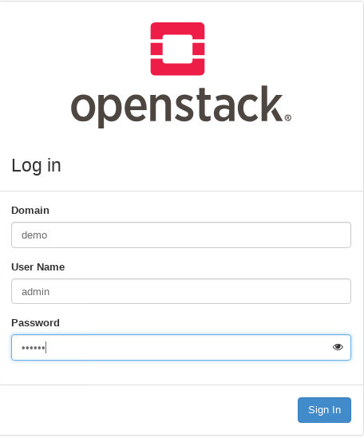

### 案例准备[Nova服务.mp4](https://fdfs.douxuedu.com/group1/M00/00/4A/wKggBmIqs46EV1nqAAAAAOvFslU058.mp4)

#### 1. 规划节点

节点规划见表1。

表1 节点规划

| **IP**        | **主机名** | **节点**      |
| :------------ | :--------- | :------------ |
| 10.24.195.113 | controller | IaaS-allinone |

#### 2. 基础准备

使用Centos7.9云主机搭建的OpenStack平台作为实验节点。

### 案例实施

#### 1. 创建flavor类型

flavor类型为OpenStack在创建云主机时需要提供的云主机大小类型，云主机的资源大小可使用不同的flavor类型来进行定义。

（1）创建flavor类型

```
[root@controller ~]# openstack help  flavor create 
usage: openstack flavor create [-h] [-f {json,shell,table,value,yaml}]
                               [-c COLUMN] [--max-width <integer>]
                               [--fit-width] [--print-empty] [--noindent]
                               [--prefix PREFIX] [--id <id>] [--ram <size-mb>]
                               [--disk <size-gb>] [--ephemeral <size-gb>]
                               [--swap <size-mb>] [--vcpus <vcpus>]
                               [--rxtx-factor <factor>] [--public | --private]
                               [--property <key=value>] [--project <project>]
                               [--project-domain <project-domain>]
                               <flavor-name>

Create new flavor
```

使用命令创建一个flavor，10G的硬盘大小，512M内存，1颗vCPU，ID为10，名称为centos。命令如下：

```
[root@controller ~]# source /etc/keystone/admin-openrc.sh
[root@controller ~]# openstack flavor create --disk 10 --ram 512  --vcpus 1 --id 10 centos
+------------------------------+--------+
| Field                        | Value  |
+------------------------------+--------+
| OS-FLV-DISABLED:disabled     | False  |
| OS-FLV-EXT-DATA:ephemeral    | 0      |
| disk                         | 10     |
| id                           | 10     |
| name                         | centos |
| os-flavor-access:is_public  | True   |
| properties                   |        |
| ram                          | 512    |
| rxtx_factor                  | 1.0    |
| swap                         |        |
| vcpus                        | 1      |
+------------------------------+--------+
```

（2）查看flavor类型

使用“openstack flavor list”命令查看flavor类型列表，命令如下：

```
 [root@controller ~]# openstack flavor list 
+----+-----------+------+------+-----------+-------+-----------+
| ID | Name      |  RAM | Disk | Ephemeral | VCPUs | Is Public |
+----+-----------+------+------+-----------+-------+-----------+
| 1  | m1.tiny   |  512 |   10 |         0 |     1 | True      |
| 10 | centos    |  512 |   10 |         0 |     1 | True      |
| 2  | m1.small  | 1024 |   20 |         0 |     1 | True      |
| 3  | m1.medium | 2048 |   40 |         0 |     2 | True      |
+----+-----------+------+------+-----------+-------+-----------+
```

也可以使用“openstack flavor show”命令查看具体的flavor类型的详细信息。命令格式如下：

```
[root@controller ~]# openstack help flavor show
usage: openstack flavor show [-h] [-f {json,shell,table,value,yaml}]
                             [-c COLUMN] [--max-width <integer>] [--fit-width]
                             [--print-empty] [--noindent] [--prefix PREFIX]
                             <flavor>
```

通过命令查看创建的“centos”的flavor类型详细信息。命令如下：

```
[root@controller ~]# openstack flavor show centos
+-----------------------------+--------+
| Field                       | Value  |
+-----------------------------+--------+
| OS-FLV-DISABLED:disabled    | False  |
| OS-FLV-EXT-DATA:ephemeral   | 0      |
| access_project_ids          | None   |
| disk                        | 10     |
| id                          | 10     |
| name                        | centos |
| os-flavor-access:is_public | True   |
| properties                  |        |
| ram                         | 512    |
| rxtx_factor                 | 1.0    |
| swap                        |        |
| vcpus                       | 1      |
+-----------------------------+--------+
```

#### 2. 访问安全组

访问安全组为是OpenStack提供给云主机的一个访问策略控制组，通过安全组中的策略可以控制云主机的出入访问规则。

（1）查看访问安全组

使用命令“openstack security group list”可以查看当前所创建的访问安全组列表。命令如下：

```
[root@controller ~]#openstack security group list
+--------------------------------------+---------+------------------------+----------------------------------+------+
| ID                                   | Name    | Description            | Project                          | Tags |
+--------------------------------------+---------+------------------------+----------------------------------+------+
| 896ce430-21f8-4673-8110-afce97e43715 | default | Default security group | 1776912d52a7444d8b2d09eb86e8d1d9 | []   |
+--------------------------------------+---------+------------------------+----------------------------------+------+
```

“default”为OpenStack平台自带的安全组，通过命令可以查看安全组中的安全规则，命令如下：

```
[root@controller ~]#  openstack  security group rule list default
+--------------------------------------+-------------+-----------+-----------+------------+--------------------------------------+
| ID                                   | IP Protocol | Ethertype | IP Range  | Port Range | Remote Security Group                |
+--------------------------------------+-------------+-----------+-----------+------------+--------------------------------------+
| 1e6c27ff-b456-4d2a-a64d-51197fea048e | None        | IPv4      | 0.0.0.0/0 |            | 896ce430-21f8-4673-8110-afce97e43715 |
| 699e2744-e926-4bb4-9e4f-54885f669bc5 | None        | IPv6      | ::/0      |            | None                                 |
| 7aa363c8-5df3-4ce3-a775-9e453f086c87 | None        | IPv6      | ::/0      |            | 896ce430-21f8-4673-8110-afce97e43715 |
| bb08b786-09f4-44f3-a030-71b189a0f84f | None        | IPv4      | 0.0.0.0/0 |            | None                                 |
+--------------------------------------+-------------+-----------+-----------+------------+--------------------------------------+
```

在安全规则的列表中，不能看出每条规则的具体策略，通过使用命令“openstack security group rule show”查看任意规则的详细信息。命令如下：

```
[root@controller ~]# openstack  security group rule show 7aa363c8-5df3-4ce3-a775-9e453f086c87
+-------------------+-------------------------------------------------------------------+
| Field             | Value                                                             |
+-------------------+-------------------------------------------------------------------+
| created_at        | 2022-02-10T03:21:40Z                                              |
| description       | None                                                              |
| direction         | ingress                                                           |
| ether_type        | IPv6                                                              |
| id                | 7aa363c8-5df3-4ce3-a775-9e453f086c87                              |
| location          | cloud='', project.domain_id=, project.domain_name='000000', project.id='1776912d52a7444d8b2d09eb86e8d1d9', project.name='admin', region_name='', zone= |
| name              | None                                                              |
| port_range_max    | None                                                              |
| port_range_min    | None                                                              |
| project_id        | 1776912d52a7444d8b2d09eb86e8d1d9                                  |
| protocol          | None                                                              |
| remote_group_id   | 896ce430-21f8-4673-8110-afce97e43715                              |
| remote_ip_prefix  | ::/0                                                              |
| revision_number   | 0                                                                 |
| security_group_id | 896ce430-21f8-4673-8110-afce97e43715                              |
| tags              | []                                                                |
| updated_at        | 2022-02-10T03:21:40Z                                              |
+-------------------+-------------------------------------------------------------------+
```

（2）创建访问安全组

创建一个新的安全组，命令格式如下：

```
[root@controller ~]# openstack help security group create 
usage: openstack security group create [-h] [-f {json,shell,table,value,yaml}]
                                       [-c COLUMN] [--max-width <integer>]
                                       [--fit-width] [--print-empty]
                                       [--noindent] [--prefix PREFIX]
                                       [--description <description>]
                                       [--project <project>]
                                       [--project-domain <project-domain>]
                                       <name>
```

使用命令创建新的安全组规则，命令如下：

```
[root@controller ~]# openstack security group create test
+-----------------+---------------------------------------------------------------------+
| Field           | Value                                                               |
+-----------------+---------------------------------------------------------------------+
| created_at      | 2022-02-10T03:25:18Z                                                |
| description     | test                                                                |
| id              | 96373f68-be50-4819-b9a6-8fc8d3e9dc0a                                |
| location        | cloud='', project.domain_id=, project.domain_name='000000', project.id='1776912d52a7444d8b2d09eb86e8d1d9', project.name='admin', region_name='', zone= |
| name            | test                                                                |
| project_id      | 1776912d52a7444d8b2d09eb86e8d1d9                                    |
| revision_number | 1                                                                   |
| rules           | created_at='2022-02-10T03:25:18Z', direction='egress', ethertype='IPv4', id='2bbc98ad-4784-419d-b815-4ee2c6c75b54', updated_at='2022-02-10T03:25:18Z'  |
|                 | created_at='2022-02-10T03:25:19Z', direction='egress', ethertype='IPv6', id='70fcb5e0-fd86-461e-84a4-2a83b4b90730', updated_at='2022-02-10T03:25:19Z'  |
| tags            | []                                                                  |
| updated_at      | 2022-02-10T03:25:18Z                                                |
+-----------------+---------------------------------------------------------------------+
```

（3）删除访问安全组

可以使用命令删除不需要使用的访问安全组，命令如下：

```
[root@controller ~]# openstack security group delete test
[root@controller ~]# openstack security group list
+--------------------------------------+---------+------------------------+----------------------------------+------+
| ID                                   | Name    | Description            | Project                          | Tags |
+--------------------------------------+---------+------------------------+----------------------------------+------+
| 896ce430-21f8-4673-8110-afce97e43715 | default | Default security group | 1776912d52a7444d8b2d09eb86e8d1d9 | []   |
+--------------------------------------+---------+------------------------+----------------------------------+------+
```

（4）添加安全规则

在默认安全组中添加三条需要使用的访问规则，使用“openstack security group rule create”命令，命令格式如下：

```
[root@controller ~]# openstack  help security group rule create 
usage: openstack security group rule create [-h]
                                            [-f {json,shell,table,value,yaml}]
                                            [-c COLUMN]
                                            [--max-width <integer>]
                                            [--fit-width] [--print-empty]
                                            [--noindent] [--prefix PREFIX]
                                            [--remote-ip <ip-address> | --remote-group <group>]
                                            [--description <description>]
                                            [--dst-port <port-range>]
                                            [--icmp-type <icmp-type>]
                                            [--icmp-code <icmp-code>]
                                            [--protocol <protocol>]
                                            [--ingress | --egress]
                                            [--ethertype <ethertype>]
                                            [--project <project>]
                                            [--project-domain <project-domain>]
                                            <group>
```

在“defualt”安全组中添加一条策略，从入口方向放行所有ICMP规则，命令如下：

```
[root@controller ~]# openstack security group rule create --protocol icmp --ingress  default
+-------------------+-------------------------------------------------------------------+
| Field             | Value                                                             |
+-------------------+-------------------------------------------------------------------+
| created_at        | 2022-02-10T04:47:42Z                                              |
| description       |                                                                   |
| direction         | ingress                                                           |
| ether_type        | IPv4                                                              |
| id                | 61014f36-5c20-46ce-b779-7d0c7458e691                              |
| location          | cloud='', project.domain_id=, project.domain_name='000000', project.id='1776912d52a7444d8b2d09eb86e8d1d9', project.name='admin', region_name='', zone= |
| name              | None                                                              |
| port_range_max    | None                                                              |
| port_range_min    | None                                                              |
| project_id        | 1776912d52a7444d8b2d09eb86e8d1d9                                  |
| protocol          | icmp                                                              |
| remote_group_id   | None                                                              |
| remote_ip_prefix  | 0.0.0.0/0                                                         |
| revision_number   | 0                                                                 |
| security_group_id | 896ce430-21f8-4673-8110-afce97e43715                              |
| tags              | []                                                                |
| updated_at        | 2022-02-10T04:47:42Z                                              |
+-------------------+-------------------------------------------------------------------+
```

在“defualt”安全组中添加一条策略，从入口方向放行所有TCP规则，命令如下：

```
[root@controller ~]# openstack security group rule create --protocol tcp --ingress  default
+-------------------+-------------------------------------------------------------------+
| Field             | Value                                                             |
+-------------------+-------------------------------------------------------------------+
| created_at        | 2022-02-10T04:47:59Z                                              |
| description       |                                                                   |
| direction         | ingress                                                           |
| ether_type        | IPv4                                                              |
| id                | 03ace6cf-ec1a-42a9-a754-c21fe887d1c0                              |
| location          | cloud='', project.domain_id=, project.domain_name='000000', project.id='1776912d52a7444d8b2d09eb86e8d1d9', project.name='admin', region_name='', zone= |
| name              | None                                                              |
| port_range_max    | None                                                              |
| port_range_min    | None                                                              |
| project_id        | 1776912d52a7444d8b2d09eb86e8d1d9                                  |
| protocol          | tcp                                                               |
| remote_group_id   | None                                                              |
| remote_ip_prefix  | 0.0.0.0/0                                                         |
| revision_number   | 0                                                                 |
| security_group_id | 896ce430-21f8-4673-8110-afce97e43715                              |
| tags              | []                                                                |
| updated_at        | 2022-02-10T04:47:59Z                                              |
+-------------------+-------------------------------------------------------------------+
```

在“defualt”安全组中添加一条策略，从入口方向放行所有UDP规则，命令如下：

```
[root@controller ~]# openstack security group rule create --protocol udp --ingress  default
+-------------------+-------------------------------------------------------------------+
| Field             | Value                                                             |
+-------------------+-------------------------------------------------------------------+
| created_at        | 2022-02-10T04:48:22Z                                              |
| description       |                                                                   |
| direction         | ingress                                                           |
| ether_type        | IPv4                                                              |
| id                | 9ec501e5-2c16-4d89-8a15-57a16a8fe3cd                              |
| location          | cloud='', project.domain_id=, project.domain_name='000000', project.id='1776912d52a7444d8b2d09eb86e8d1d9', project.name='admin', region_name='', zone= |
| name              | None                                                              |
| port_range_max    | None                                                              |
| port_range_min    | None                                                              |
| project_id        | 1776912d52a7444d8b2d09eb86e8d1d9                                  |
| protocol          | udp                                                               |
| remote_group_id   | None                                                              |
| remote_ip_prefix  | 0.0.0.0/0                                                         |
| revision_number   | 0                                                                 |
| security_group_id | 896ce430-21f8-4673-8110-afce97e43715                              |
| tags              | []                                                                |
| updated_at        | 2022-02-10T04:48:22Z                                              |
+-------------------+-------------------------------------------------------------------+
```

查看“default”安全组中所有的规则列表信息，命令如下：

```
[root@controller ~]# openstack security group rule list default
+--------------------------------------+--------------+-----------+-----------+------------+--------------------------------------+
| ID                                   | IP Protocol  | Ethertype | IP Range  | Port Range | Remote Security Group                |
+--------------------------------------+--------------+-----------+-----------+------------+--------------------------------------+
| 03ace6cf-ec1a-42a9-a754-c21fe887d1c0 | tcp         | IPv4      | 0.0.0.0/0 |            | None                                 |
| 1e6c27ff-b456-4d2a-a64d-51197fea048e | None         | IPv4      | 0.0.0.0/0 |            | 896ce430-21f8-4673-8110-afce97e43715 |
| 61014f36-5c20-46ce-b779-7d0c7458e691 | icmp         | IPv4      | 0.0.0.0/0 |            | None                                 |
| 699e2744-e926-4bb4-9e4f-54885f669bc5 | None         | IPv6      | ::/0      |            | None                                 |
| 7aa363c8-5df3-4ce3-a775-9e453f086c87 | None         | IPv6      | ::/0      |            | 896ce430-21f8-4673-8110-afce97e43715 |
| 9ec501e5-2c16-4d89-8a15-57a16a8fe3cd | udp         | IPv4      | 0.0.0.0/0 |            | None                                 |
| bb08b786-09f4-44f3-a030-71b189a0f84f | None         | IPv4      | 0.0.0.0/0 |            | None                                 |
+--------------------------------------+--------------+-----------+-----------+------------+--------------------------------------+
```

#### 3. 启动虚拟机

（1）查询可用镜像

上传镜像，使用“openstack image list”命令查看当前可用镜像列表。命令如下：

```
[root@controller ~]# curl -O http://mirrors.douxuedu.com/newcloud/cirros-0.3.4-x86_64-disk.img
[root@controller ~]# glance image-create --name cirros-0.3.4 --disk-format qcow2 --container-format bare --progress < cirros-0.3.4-x86_64-disk.img
…
[root@controller ~]# openstack image list
+--------------------------------------+--------------+---------+
| ID                                   | Name         | Status  |
+--------------------------------------+--------------+---------+
| 32a2513c-e5ba-438b-a5ee-63c35c03b284 | cirros-0.3.4 | active |
+--------------------------------------+--------------+---------+
```

使用“openstack flavor list”命令查看可用的类型。命令如下：

```
[root@controller ~]# openstack flavor list
+----+-----------+------+------+-----------+-------+-----------+
| ID | Name      |  RAM | Disk | Ephemeral | VCPUs | Is Public |
+----+-----------+------+------+-----------+-------+-----------+
| 1  | m1.tiny   |  512 |   10 |         0 |     1 | True      |
| 10 | centos    | 1024 |   10 |         0 |     2 | True      |
| 2  | m1.small  | 1024 |   20 |         0 |     1 | True      |
| 3  | m1.medium | 2048 |   40 |         0 |     2 | True      |
+----+-----------+------+------+-----------+-------+-----------+
```

（2）创建网络和子网

使用“openstack network create ”命令创建网络息。命令如下：

```
[root@controller ~]# openstack network create --provider-network-type vlan --provider-physical-network provider network-vlan --provider-segment 200
+---------------------------+-----------------------------------------------------------+
| Field                     | Value                                                     |
+---------------------------+-----------------------------------------------------------+
| admin_state_up            | UP                                                        |
| availability_zone_hints   |                                                           |
| availability_zones        |                                                           |
| created_at                | 2022-02-10T05:02:18Z                                      |
| description               |                                                           |
| dns_domain                | None                                                      |
| id                        | cccedc78-027d-40e9-afbd-708154923ca6                      |
| ipv4_address_scope        | None                                                      |
| ipv6_address_scope        | None                                                      |
| is_default                | False                                                     |
| is_vlan_transparent       | None                                                      |
| location                  | cloud='', project.domain_id=, project.domain_name='000000', project.id='1776912d52a7444d8b2d09eb86e8d1d9', project.name='admin', region_name='', zone= |
| mtu                       | 1500                                                      |
| name                      | network-vlan                                             |
| port_security_enabled     | True                                                      |
| project_id                | 1776912d52a7444d8b2d09eb86e8d1d9                          |
| provider:network_type     | vlan                                                      |
| provider:physical_network | provider                                                  |
| provider:segmentation_id  | 200                                                       |
| qos_policy_id             | None                                                      |
| revision_number           | 1                                                         |
| router:external          | Internal                                                  |
| segments                  | None                                                      |
| shared                    | False                                                     |
| status                    | ACTIVE                                                    |
| subnets                   |                                                           | 
| tags                      |                                                           |
| updated_at                | 2022-02-10T05:02:18Z                                      |
+---------------------------+-----------------------------------------------------------+
```

使用“openstack subnet create”创建子网。命令如下：

```
[root@controller ~]# openstack subnet list
[root@controller ~]# openstack subnet create  --network network-vlan  --allocation-pool start=192.168.200.100,end=192.168.200.200 --gateway 192.168.200.1 --subnet-range 192.168.200.0/24  subnet-vlan
+-------------------+-------------------------------------------------------------------+
| Field             | Value                                                             |
+-------------------+-------------------------------------------------------------------+
| allocation_pools  | 192.168.200.100-192.168.200.200                                   |
| cidr              | 192.168.200.0/24                                                  |
| created_at        | 2022-02-10T05:03:52Z                                              |
| description       |                                                                   |
| dns_nameservers   |                                                                   |
| enable_dhcp       | True                                                              |
| gateway_ip        | 192.168.200.1                                                     |
| host_routes       |                                                                   |
| id                | 69c14fff-de95-440a-bc8e-fe9f43e4b424                              |
| ip_version        | 4                                                                 |
| ipv6_address_mode | None                                                              |
| ipv6_ra_mode      | None                                                              |
| location          | cloud='', project.domain_id=, project.domain_name='000000', project.id='1776912d52a7444d8b2d09eb86e8d1d9', project.name='admin', region_name='', zone= |
| name              | subnet-vlan                                                       |
| network_id        | cccedc78-027d-40e9-afbd-708154923ca6                              |
| prefix_length     | None                                                              |
| project_id        | 1776912d52a7444d8b2d09eb86e8d1d9                                  |
| revision_number   | 0                                                                 |
| segment_id        | None                                                              |
| service_types     |                                                                   |
| subnetpool_id     | None                                                              |
| tags              |                                                                   |
| updated_at        | 2022-02-10T05:03:52Z                                              |
+-------------------+-------------------------------------------------------------------+
```

（3）修改OpenStack平台

修改Nova服务配置文件，设置参数“virt_type=qemu”。命令参数如下：

```
[root@controller ~]# crudini --set /etc/nova/nova.conf libvirt virt_type qemu
[root@controller ~]# systemctl restart openstack-nova-compute
```

（4）启动云主机

使用“openstack server create”命令创建云主机，其命令格式如下：

```
[root@controller ~]# openstack help server create
usage: openstack server create [-h] [-f {json,shell,table,value,yaml}]
                               [-c COLUMN] [--max-width <integer>]
                               [--fit-width] [--print-empty] [--noindent]
                               [--prefix PREFIX]
                               (--image <image> | --volume <volume>) --flavor
                               <flavor> [--security-group <security-group>]
                               [--key-name <key-name>]
                               [--property <key=value>]
                               [--file <dest-filename=source-filename>]
                               [--user-data <user-data>]
                               [--availability-zone <zone-name>]
                               [--block-device-mapping <dev-name=mapping>]
                               [--nic <net-id=net-uuid,v4-fixed-ip=ip-addr,v6-fixed-ip=ip-addr,port-id=port-uuid,auto,none>]
                               [--network <network>] [--port <port>]
                               [--hint <key=value>]
                               [--config-drive <config-drive-volume>|True]
                               [--min <count>] [--max <count>] [--wait]
                               <server-name>
```

通过命令创建云主机，使用cirros镜像，flavor为1核vCPU、512M内存、10G硬盘，使用network-vlan网络。云主机名为“cirros-test”创建命令如下：

```
[root@controller ~]# openstack server create --image cirros-0.3.4 --flavor 10 --network network-vlan cirros-test
+-------------------------------------+-------------------------------------------------+
| Field                               | Value                                           |
+-------------------------------------+-------------------------------------------------+
| OS-DCF:diskConfig                   | MANUAL                                          |
| OS-EXT-AZ:availability_zone         |                                                 |
| OS-EXT-SRV-ATTR:host                | None                                            |
| OS-EXT-SRV-ATTR:hypervisor_hostname | None                                            |
| OS-EXT-SRV-ATTR:instance_name       |                                                 |
| OS-EXT-STS:power_state              | NOSTATE                                         |
| OS-EXT-STS:task_state               | scheduling                                      |
| OS-EXT-STS:vm_state                 | building                                        |
| OS-SRV-USG:launched_at              | None                                            |
| OS-SRV-USG:terminated_at            | None                                            |
| accessIPv4                          |                                                 |
| accessIPv6                          |                                                 |
| addresses                           |                                                 |
| adminPass                           | 3QV3njyWpTnk                                    |
| config_drive                        |                                                 |
| created                             | 2022-03-01T07:08:26Z                            |
| flavor                              | centos (10)                                     |
| hostId                              |                                                 |
| id                                  | d152e1e5-7ff2-4f4e-9a1f-4133d8c4d6fe            |
| image                               | cirros-0.3.4 (84a1ae85-7638-4d77-b5ae-7257b522bd13) |
| key_name                            | None                                            |
| name                                | cirros-test                                     |
| progress                            | 0                                               |
| project_id                          | 84b07b58499c419d9bb3c6de945abc21                |
| properties                          |                                                 |
| security_groups                     | name='default'                                  |
| status                              | BUILD                                           |
| updated                             | 2022-03-01T07:08:27Z                            |
| user_id                             | 641a71d3af054cf29e99cef1c6f7e534                |
| volumes_attached                    |                                                 |
+-------------------------------------+-------------------------------------------------+
```

#### 4. 管理虚拟机

（1）查看虚拟机

使用“openstack server list”命令查看虚拟机列表信息，使用命令如下：

```
[root@controller ~]# openstack server list
+--------------------------------------+-------------+--------+------------------------------+--------------+--------+
| ID                                   | Name        | Status | Networks                     | Image        | Flavor |
+--------------------------------------+-------------+--------+------------------------------+--------------+--------+
| d152e1e5-7ff2-4f4e-9a1f-4133d8c4d6fe | cirros-test | ACTIVE | network-vlan=192.168.200.187 | cirros-0.3.4 | centos |
+--------------------------------------+-------------+--------+------------------------------+--------------+--------+
```

使用命令可以查看虚拟机的具体信息，包括使用的安全组、flavor以及网络信息，通过命令“openstack server show”进行查看。命令如下：

```
[root@controller ~]# openstack server show cirros-test
+-------------------------------------+-------------------------------------------------+
| Field                               | Value                                           |
+-------------------------------------+-------------------------------------------------+
| OS-DCF:diskConfig                   | MANUAL                                          |
| OS-EXT-AZ:availability_zone         | nova                                            |
| OS-EXT-SRV-ATTR:host                | controller                                      |
| OS-EXT-SRV-ATTR:hypervisor_hostname | controller                                      |
| OS-EXT-SRV-ATTR:instance_name       | instance-00000001                               |
| OS-EXT-STS:power_state              | Running                                         |
| OS-EXT-STS:task_state               | None                                            |
| OS-EXT-STS:vm_state                 | active                                          |
| OS-SRV-USG:launched_at              | 2022-03-01T07:08:42.000000                      |
| OS-SRV-USG:terminated_at            | None                                            |
| accessIPv4                          |                                                 |
| accessIPv6                          |                                                 |
| addresses                           | network-vlan=192.168.200.187                    |
| config_drive                        |                                                 |
| created                             | 2022-03-01T07:08:26Z                            |
| flavor                              | centos (10)                                     |
| hostId                              | 3f5e51b24503c97ac5e8033e5552e14e990f49f7e5583898f5b7329c |
| id                                  | d152e1e5-7ff2-4f4e-9a1f-4133d8c4d6fe            |
| image                               | cirros-0.3.4 (84a1ae85-7638-4d77-b5ae-7257b522bd13)      |
| key_name                            | None                                            |
| name                                | cirros-test                                     |
| progress                            | 0                                               |
| project_id                          | 84b07b58499c419d9bb3c6de945abc21                |
| properties                          |                                                 |
| security_groups                     | name='default'                                  |
| status                              | ACTIVE                                          |
| updated                             | 2022-03-01T07:08:42Z                            |
| user_id                             | 641a71d3af054cf29e99cef1c6f7e534                |
| volumes_attached                    |                                                 |
+-------------------------------------+-------------------------------------------------+
```

（2）操作虚拟机

可以通过命令操作虚拟机，对虚拟机进行关机、开机、重启等操作。关闭虚拟机操作，命令如下：

```
[root@controller ~]# openstack server stop cirros-test
[root@controller ~]# openstack server list
+--------------------------------------+-------------+---------+-------------------------------+--------------+--------+
| ID                                   | Name        | Status  | Networks                      | Image        | Flavor |
+--------------------------------------+-------------+---------+-------------------------------+--------------+--------+
| 7e424f14-eed1-44f5-a29a-0b64749cbc4d | cirros-test | SHUTOFF | network-vlan=192.168.200.187 | cirros-0.3.4 | centos |
+--------------------------------------+-------------+---------+-------------------------------+--------------+--------+
```

通过命令操作虚拟机，对虚拟机进行开机操作，命令如下：

```
[root@controller ~]# openstack server start cirros-test
[root@controller ~]# openstack server list
+--------------------------------------+-------------+--------+------------------------------+--------------+--------+
| ID                                   | Name        | Status | Networks                     | Image        | Flavor |
+--------------------------------------+-------------+--------+------------------------------+--------------+--------+
| 7e424f14-eed1-44f5-a29a-0b64749cbc4d | cirros-test | ACTIVE | network-vlan=192.168.200.187 | cirros-0.3.4 | centos |
+--------------------------------------+-------------+--------+------------------------------+--------------+--------+
```

通过命令操作虚拟机，对虚拟机进行重启操作，命令如下：

```
[root@controller ~]# openstack server reboot cirros-test
[root@controller ~]# openstack server list
+--------------------------------------+-------------+--------+-------------------------------+--------------+--------+
| ID                                   | Name        | Status | Networks                      | Image        | Flavor |
+--------------------------------------+-------------+--------+-------------------------------+--------------+--------+
| 7e424f14-eed1-44f5-a29a-0b64749cbc4d | cirros-test | ACTIVE | network-vlan=192.168.200.187 | cirros-0.3.4 | centos |
+--------------------------------------+-------------+--------+-------------------------------+--------------+--------+
```

#### 5. 云主机调整类型大小

（1）修改配置文件

修改controller节点nova.conf配置文件，添加调整类型大小的参数，controller节点设置参数如下所示：

```
[root@controller ~]# crudini --set /etc/nova/nova.conf DEFAULT allow_resize_to_same_host True
[root@controller ~]# crudini --set /etc/nova/nova.conf DEFAULT scheduler_default_filters RetryFilter,AvailabilityZoneFilter,ComputeFilter,ComputeCapabilitiesFilter,ImagePropertiesFilter,ServerGroupAntiAffinityFilter,ServerGroupAffinityFilter
```

修改完配置文件后重启相关服务。命令如下所示：

```
[root@controller ~]#systemctl restart openstack-nova*
```

（2）创建云主机类型

现有云主机硬盘和内存不满足使用，需要对现有云主机进行资源扩容，将内存扩容至1G，硬盘扩容至15G大小，类型名称为“centos1”首先创建一个新的云主机类型满足扩容资源的需求。通过命令创建新云主机类型，命令如下所示：

```
[root@controller ~]#  openstack flavor create --disk 15 --ram 1024 --vcpus 2 centos1
+-----------------------------+---------------------------------------+
| Field                       | Value                                 |
+-----------------------------+---------------------------------------+
| OS-FLV-DISABLED:disabled    | False                                 |
| OS-FLV-EXT-DATA:ephemeral   | 0                                     |
| disk                        | 15                                    |
| id                          | a99a75ba-5afb-448b-bfc8-6bc656471476  |
| name                        | centos1                               |
| os-flavor-access:is_public | True                                  |
| properties                  |                                       |
| ram                         | 1024                                  |
| rxtx_factor                 | 1.0                                   |
| swap                        |                                       |
| vcpus                       | 2                                     |
+-----------------------------+--------------------------------------+
```

查看当前云主机类型列表，命令如下：

[root@controller ~]# openstack flavor list

```
[root@controller ~]# openstack flavor list
+------------------------------------+---------+-----+-----+---------+-----+----------+
| ID                                 |Name     | RAM |Disk |Ephemeral|VCPUs|Is Public |
+------------------------------------+---------+-----+-----+---------+-----+----------+
| 1                                  | m1.tiny | 512 |  10 |       0 |   1 | True     |
| 10                                 | centos  | 512 |  10 |       0 |   1 | True     |
| 2                                  | m1.small|1024 |  20 |       0 |   1 | True     |
| 3                                  |m1.medium|2048 |  40 |       0 |   2 | True     |
|a99a75ba-5afb-448b-bfc8-6bc656471476|centos1  |1024 |  15 |       0 |   2 | True     |
+------------------------------------+---------+-----+-----+---------+-----+----------+
```

（3）调整云主机类型

查看云主机列表，通过命令查看云主机列表。命令如下：

```
[root@controller ~]# openstack server list
+--------------------------------------+-------------+--------+------------------------------+--------------+--------+
| ID                                   | Name        | Status | Networks                     | Image        | Flavor |
+--------------------------------------+-------------+--------+------------------------------+--------------+--------+
| 7e424f14-eed1-44f5-a29a-0b64749cbc4d | cirros-test | ACTIVE | network-vlan=192.168.200.187 | cirros-0.3.4 | centos |
+--------------------------------------+-------------+--------+------------------------------+--------------+--------+
```

使用命令“openstack server resize”调整云主机类型，命令格式如下：

```
[root@controller ~]# openstack help server resize  
usage: openstack server resize [-h] [--flavor <flavor> | --confirm | --revert]
                               [--wait]
                               <server>

  <server>           Server (name or ID)

optional arguments:
  -h, --help         show this help message and exit
  --flavor <flavor>  Resize server to specified flavor
  --confirm          Confirm server resize is complete
  --revert           Restore server state before resize
  --wait             Wait for resize to complete
```

修改dashboard配置文件：

```
[root@controller ~]# vi /etc/openstack-dashboard/local_settings
…
SESSION_ENGINE = 'django.contrib.sessions.backends.file'
…
[root@controller ~]# systemctl restart httpd memcached
```

使用命令调整云主机“cirros-test”类型为centos1，使用–wait参数，在命令执行后，调整云主机需要一定时间，添加–wait参数后会在确认时回馈“complete”。命令如下所示：

```
[root@controller ~]# openstack server resize --flavor centos1 --wait cirros-test
Complete
[root@controller ~]# openstack server list
+--------------------------------------+-------------+---------------+------------------------------+--------------+---------+
| ID                                   | Name        | Status        | Networks                     | Image        | Flavor  |
+--------------------------------------+-------------+---------------+------------------------------+--------------+---------+
| d152e1e5-7ff2-4f4e-9a1f-4133d8c4d6fe | cirros-test | VERIFY_RESIZE | network-vlan=192.168.200.187 | cirros-0.3.4 | centos1 |
+--------------------------------------+-------------+---------------+------------------------------+--------------+---------+
```

此时为待确定状态，登录OpenStack平台，如图1所示：



图1 登录openstack平台

单击右上角设置，选择简体中文，单击“保存”按钮，如图2所示：


图2 设置中文

在左侧导航栏选择“项目→计算→实例”，在实例最后的动作下拉菜单中选择“确认 调整大小/迁移”，如图3与图4所示：


图3 确认调整大小/迁移


图4 调整成功

在命令执行完毕后，通过命令查看云主机列表信息。命令如下：

```
[root@controller ~]# openstack server list
+--------------------------------------+-------------+--------+------------------------------+--------------+---------+
| ID                                   | Name        | Status | Networks                     | Image        | Flavor  |
+--------------------------------------+-------------+--------+------------------------------+--------------+---------+
| d152e1e5-7ff2-4f4e-9a1f-4133d8c4d6fe | cirros-test | ACTIVE | network-vlan=192.168.200.187 | cirros-0.3.4 | centos1 |
+--------------------------------------+-------------+--------+------------------------------+--------------+---------+
```