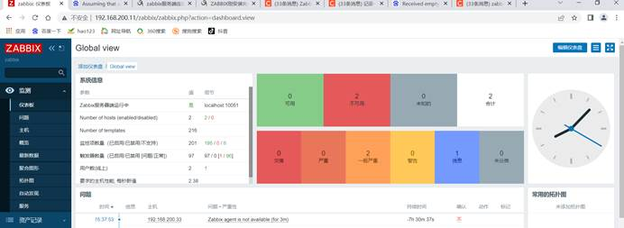
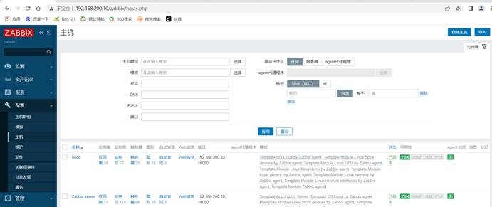
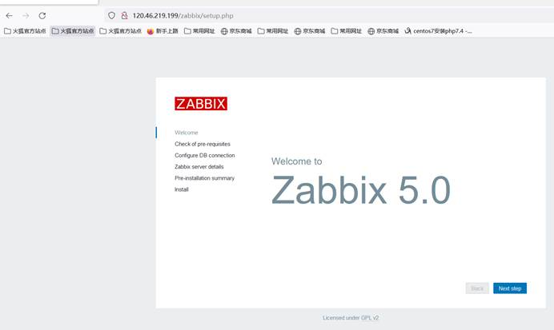
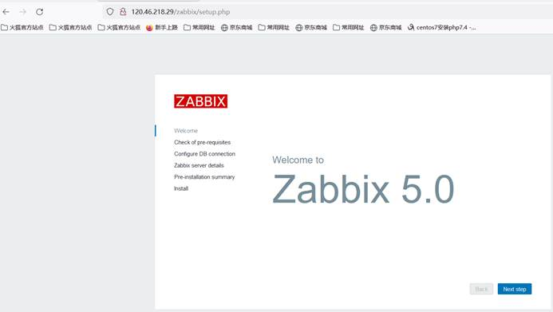
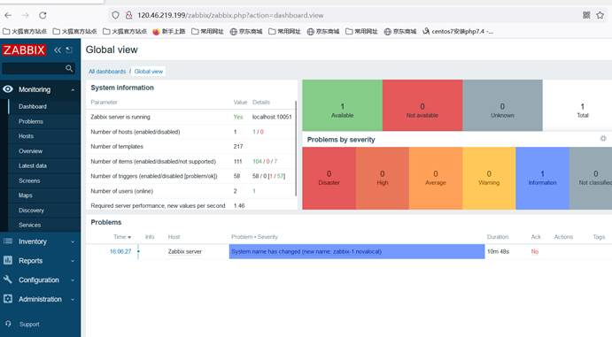

# C场次题目：企业级应用的自动化部署和运维

 

 


 

### 虚拟机与环境规划

 

| 设备名称  | 主机名  | 接口 | IP地址                                    | 角色                         |
| --------- | ------- | ---- | ----------------------------------------- | ---------------------------- |
| 云服务器1 | master2 | eth0 | 公网IP:********  私网IP:192.168.100.14/24 | Prometheus，grafana，ansible |
| 云服务器2 | slave1  | eth0 | 公网IP:********  私网IP:192.168.100.15/24 | agent                        |
| 云服务器3 | slave2  | eth0 | 公网IP:********  私网IP:192.168.100.16/24 | agent                        |

 

1.   上表中的公网IP以自己云主机显示为准，每个人的公网IP不同。使用第三方软件远程连接云主机，使用公网IP连接。

2.   华为云中云主机名字已命好，直接使用对应名字的云主机即可。

 

 

## 任务 1 企业级应用的自动化部署（17 分）


### 1.ansible自动化运维工具的安装。

请使用提供的软件包在master2节点安装ansible，安装完成后使用ansible --version命令验证是否安装成功。为所有节点添加test用户，设置用户密码为000000，为test用户设置免密sudo，配置ssh免密登录，使master2节点能够免密登录所有节点的test用户。请将ansible --version 命令和返回结果粘贴到答题框。【3分】

评分检测：ansible –version&& ansible 2.8.19

完整答案：

```shell
```


  [root@admin-1 ~]# ansible --version   ansible 2.8.19   config file  = /etc/ansible/ansible.cfg   configured  module search path = [u'/root/.ansible/plugins/modules',  u'/usr/share/ansible/plugins/modules']   ansible  python module location = /usr/lib/python2.7/site-packages/ansible   executable  location = /usr/bin/ansible   python  version = 2.7.5 (default, Apr 11 2018, 07:36:10) [GCC 4.8.5 20150623 (Red Hat  4.8.5-28)]     

### 2.ansible自动化运维工具的初始化。

请创建/root/ansible目录作为工作目录,在该目录内创建ansible.cfg文件并完成以下配置，清单文件位置为/root/ansible/inventory,登录用户为test，登录时不需要输入密码，设置并行主机数量为2。允许test用户免密提权到root。

请将ansible.cfg文件内容提交到答题框。【3分】

评分检测：remote_user= test&& forks = 2&& become_user=root

```shell
```


完整答案：

  [root@admin-1  ansible]# cat ansible.cfg   [defaults]  ask_pass   = flase  inventory   = ./inventory  remote_user=  test  forks = 2   [privilege_escalation]  become=True  become_method=sudo  become_user=root  become_ask_pass=False  

### 3.主机清单的编写。【2分】

编写主机清单文件，创建master2用户组，master2用户组内添加master2主机，创建node用户组，node组内添加slave1和slave2主机，主机名不得使用IP地址。

请完成后执行ansible all -m ping 和 ansible all -a "id" 命令并将返回结果提交到答题框。【2分】

评分检测：slave2 | SUCCESS&& slave1 | SUCCESS&& slave2 | CHANGED | rc=0&& slave1 | CHANGED | rc=0

```shell
```


完整答案：

  [root@admin-1  ansible]# cat inventory   [master2]  master2  [node]  slave1  slave2  [root@admin-1  ansible]# ansible all -m ping   [WARNING]:  Found both group and host with same name: master2     slave2 |  SUCCESS => {    "ansible_facts": {        "discovered_interpreter_python": "/usr/bin/python"    },     "changed": false,     "ping": "pong"  }  slave1 |  SUCCESS => {    "ansible_facts": {        "discovered_interpreter_python": "/usr/bin/python"    },     "changed": false,     "ping": "pong"  }  master2 |  SUCCESS => {    "ansible_facts": {        "discovered_interpreter_python": "/usr/bin/python"    },     "changed": false,     "ping": "pong"  }  [root@admin-1  ansible]# ansible all -a   "id"       [WARNING]:  Found both group and host with same name: master2     slave2 |  CHANGED | rc=0 >>  uid=0(root)  gid=0(root) groups=0(root)     slave1 |  CHANGED | rc=0 >>  uid=0(root)  gid=0(root) groups=0(root)  master2 |  CHANGED | rc=0 >>  uid=0(root) gid=0(root)  groups=0(root)  

### 4.使用自动化工具对master2节点进行初始化。

请编写prometheus.yml控制master2主机组，使用对应模块将selinux临时状态设置为disabled，将selinux的开机启动状态也设置为disabled。请使用ansible对应模块安装时间同步服务，使用文本编辑模块将该服务的作用域设置为0.0.0.0/0，并设置状态为启动和开机自动启动。首先将提供的prometheus-2.37.0.linux-amd64.tar.gz使用文件拷贝模块将该压缩包拷贝到目标主机的/usr/local/下，使用shell模块解压该压缩包。

请将prometheus.yml文件中的内容提交到答题框。【4分】

评分检测：state: disabled&& allow 0.0.0.0/0&& src: /root/prometheus-2.37.0.linux-amd64.tar.gz&& shell: tar -zxf /usr/local/prometheus-2.37.0.linux-amd64.tar.gz -C /usr/local

```shell
```


完整答案：

  [root@admin-1 ansible]# cat  prometheus.yml   - name: prometheus   hosts: master2   tasks:     - name: test1      selinux:       state: disabled     - name: yum      yum:       name: chrony       state: present     - name: copy      copy:       content: "allow 0.0.0.0/0"       dest: /etc/chrony.conf      - name: server       service:       name: chronyd       enabled: yes       state: started     - name: copy      copy:        src:  /root/prometheus-2.37.0.linux-amd64.tar.gz       dest: /usr/local/     - name: shell       shell:   tar -zxf /usr/local/prometheus-2.37.0.linux-amd64.tar.gz -C /usr/local     

 

### 5.使用自动化运维工具完成企业级应用的部署。

编写prometheus.yml.j2模板文件，将所有node节点信息添加到该文件中，但是被管节点的主机名信息必须使用变量IP地址可以手动输入。完成后请创建node_exporter.yml文件，编写第一个play，将该play命名为node，该play控制的主机组为node，使用ansible模块将node_exporter-1.3.1.linux-amd64.tar.gz发送到node主机组的/usr/local/下，使用一个shell模块解压该压缩包，并启动该服务。随后编写第二个play，将第二个play命名为master2，第二个play控制master2节点，首先使用ansible模块将prometheus.yml.j2文件传输到master2节点，然后使用script模块将prometheus启动。使用对应模块将grafana-8.1.2-1.x86_64.rpm包发送到被控节点的/mnt/目录下，然后使用对应模块将该软件包安装，安装完成后设置grafana服务启动并设置开机自动启动。使用浏览器登录prometheus查看prometheus是否成功监控所有node节点。

请将prometheus.yml.j2文件的内容、node_exporter.yml文件内容提交到答题框。【5分】

评分检测：job_name: "{{hostvars['slave1']['inventory_hostname']}}"&& job_name: "{{hostvars['slave2']['inventory_hostname']}}"&& hosts: node&& hosts: master2

```shell
```


完整答案：

  [root@admin-1 ansible]# cat  /root/prometheus.yml.j2   # my global config  global:   scrape_interval: 15s # Set the scrape  interval to every 15 seconds. Default is every 1 minute.   evaluation_interval: 15s # Evaluate rules  every 15 seconds. The default is every 1 minute.   # scrape_timeout is set to the global  default (10s).     # Alertmanager configuration  alerting:   alertmanagers:    - static_configs:      - targets:       # - alertmanager:9093     # Load rules once and  periodically evaluate them according to the global 'evaluation_interval'.  rule_files:   # - "first_rules.yml"   # - "second_rules.yml"     # A scrape configuration  containing exactly one endpoint to scrape:  # Here it's Prometheus itself.  scrape_configs:   # The job name is added as a label  `job=<job_name>` to any timeseries scraped from this config.   - job_name: "prometheus"       # metrics_path defaults to '/metrics'    # scheme defaults to 'http'.       static_configs:     - targets: ["localhost:9090"]   - job_name: "{{hostvars['slave1']['inventory_hostname']}}"    static_configs:     - targets: ['192.168.100.15:9100']   - job_name: "{{ hostvars['slave2']['inventory_hostname']  }}"    static_configs:     - targets: ['192.168.100.16:9100']     [root@admin-1 ansible]# cat  node_exporter.yml   - name: node   hosts: node   tasks:     - name: copy     copy:       src:  /root/node_exporter-1.3.1.linux-amd64.tar.gz      dest: /usr/lcoal/    - name: shell     shell:   "{{item}}"     loop:      - tar -zxf  /usr/lcoal/node_exporter-1.3.1.linux-amd64.tar.gz -C /usr/lcoal/      - nohup   /usr/lcoal/node_exporter-1.3.1.linux-amd64/node_exporter &  - name: master2   hosts: master2   tasks:     - name: temp     template:      src: /root/prometheus.yml.j2      dest:  /usr/local/prometheus-2.37.0.linux-amd64/prometheus.yml    - name: script     script: /usr/bin/nohup  /usr/local/prometheus-2.37.0.linux-amd64/prometheus  --config.file=/usr/local/prometheus-2.37.0.linux-amd64/prometheus.yml &     register: test    - debug:      var: test       - name: copy     copy:      src: /root/grafana-8.1.2-1.x86_64.rpm      dest: /mnt/grafana-8.1.2-1.x86_64.rpm    - name: yum     yum:       name: /mnt/grafana-8.1.2-1.x86_64.rpm      state: present    - name: service     service:        name: grafana-server       state: started       enabled: yes    


## 任务2  企业级应用的运维（12分）


### 1.使用prometheus监控mysqld服务

将提供的mysqld_exporter-0.14.0.linux-amd64.tar.gz 发送到agent虚拟机 /usr/local/ 目录下解压并安装mariadb服务。进入mariadb数据库中创建mysqld_monitor用户并授权，然后创建mariadb配置文件，内容为数据库用户名密码。启动mysqld_exporter组件确保9104端口启动。回到prometheus节点修改prometheus.yml文件并添加mysql被监控信息。重启prometheus，随后web界面刷新并查看mysqld被控信息。

请将以上操作的命令及返回结果提交到答题框。【3分】

评分检测：tar &&yum install -y mariadb&& grant && static_configs:

```shell
```


完整答案：

[root@agent ~]# tar -zxvf mysqld_exporter-0.14.0.linux-amd64.tar.gz -C /usr/local/

mysqld_exporter-0.14.0.linux-amd64/

mysqld_exporter-0.14.0.linux-amd64/LICENSE

mysqld_exporter-0.14.0.linux-amd64/NOTICE

mysqld_exporter-0.14.0.linux-amd64/mysqld_exporter

[root@agent ~]# mv /usr/local/mysqld_exporter-0.14.0.linux-amd64/ /usr/local/mysqld_exporter

安装mariadb数据库

[root@agent ~]# yum install -y mariadb\*

[root@agent ~]# systemctl start mariadb

 [root@agent ~]# systemctl enable mariadb

Created symlink from /etc/systemd/system/multi-user.target.wants/mariadb.service to /usr/lib/systemd/system/mariadb.service.

[root@agent ~]# mysql

Welcome to the MariaDB monitor. Commands end with ; or \g.

Your MariaDB connection id is 2

Server version: 5.5.68-MariaDB MariaDB Server

 

Copyright (c) 2000, 2018, Oracle, MariaDB Corporation Ab and others.

 

Type 'help;' or '\h' for help. Type '\c' to clear the current input statement.

 

MariaDB [(none)]> grant select,replication client,process on *.* to 'mysql_monitor'@'localhost' identified by '123'; //创建mysql_monitor用户 并授权

Query OK, 0 rows affected (0.00 sec)

 

MariaDB [(none)]> flush privileges; //刷新

Query OK, 0 rows affected (0.00 sec)

 

MariaDB [(none)]>

 

创建一个mariadb配置文件 协商链接的用户名与密码 （和上面的一致）

[root@agent ~]# vi /usr/local/mysqld_exporter/.my.cnf

[root@agent ~]# cat /usr/local/mysqld_exporter/.my.cnf 

[client]

user=mysql_monitor

password=123

 

启动msyqld_exporter组件

[root@agent ~]# nohup /usr/local/mysqld_exporter/mysqld_exporter --config.my-cnf=/usr/local/mysqld_exporter/.my.cnf 

nohup: 忽略输入并把输出追加到"nohup.out"

[root@agent ~]# netstat -ntlp

Active Internet connections (only servers)

Proto Recv-Q Send-Q Local Address      Foreign Address     State    PID/Program name  

tcp    0   0 0.0.0.0:3306      0.0.0.0:*        LISTEN   19040/mysqld    

tcp    0   0 0.0.0.0:22       0.0.0.0:*        LISTEN   1055/sshd      

tcp    0   0 127.0.0.1:25      0.0.0.0:*        LISTEN   1517/master2     

tcp6    0   0 :::9100         :::*          LISTEN   11095/node_exporter 

tcp6    0   0 :::9104         :::*          LISTEN   19114/mysqld_export 

tcp6    0   0 :::22          :::*          LISTEN   1055/sshd      

tcp6    0   0 ::1:25         :::*          LISTEN    1517/master2     

 

 

回到prometheus节点修改prometheus.yml文件 添加

\- job_name: "mariadb"

  static_configs:

   \- targets: ['192.168.100.14:9104']

~

重启prometheus

[root@prometheus prometheus]# ps -ef | grep prometheus

root   11186 10962 0 10:14 pts/0  00:00:00 ./prometheus --config.file=/usr/local/prometheus/prometheus.yml

root   11202 10962 0 10:28 pts/0  00:00:00 grep --color=auto prometheus

[root@prometheus prometheus]# kill -9 11186

[root@prometheus prometheus]# 

[1]+ 已杀死        ./prometheus --config.file="/usr/local/prometheus/prometheus.yml"

[root@prometheus prometheus]# /usr/local/prometheus/prometheus --config.file=/usr/local/prometheus/prometheus.yml &


### 2.安装alertmanager报警组件


将提供的alertmanager-0.21.0.linux-amd64.tar.gz上传到prometheus节点 /usr/local/ 目录下并解压，创建软连接alertmanager-0.23.0.linux-amd64/ alertmanager。创建service启动文件名为alertmanager.service，然后启动alertmanager查看9093端口。在prometheus.yml配置文件中添加alertmanager信息并重新启动prometheus服务，在agent上停止node_exporter服务。到web界面中查看警报管理器状态是否正常和agent状态是否异常。

请将alertmanager.service添加的内容提交到答题框。【3分】

评分检测：ExecStart=/usr/local/alertmanager/alertmanager&&--config.file=/usr/local/alertmanager/alertmanager.yml

```shell
```


完整答案：

tar zxvf alertmanager-0.21.0.linux-amd64.tar.gz -C /usr/local/
 mv alertmanager-0.22.2.linux-amd64 /usr/local/alertmanager

cd /usr/local/alertmanager

进入systemd目录

cd /usr/lib/systemd/system

创建文件

vim alertmanager.service

 添加如下内容

[Unit]

Description=https://prometheus.io

 

[Service]

Restart=on-failure

ExecStart=/usr/local/alertmanager/alertmanager --config.file=/usr/local/alertmanager/alertmanager.yml

 

[Install]            

WantedBy=multi-user.target

生效系统systemd文件

systemctl daemon-reload

启动和停止服务命令

\# 启动

systemctl start alertmanager.service

\# 停止

systemctl stop alertmanager.service

\# 进入解压后的文件夹

cd /data/prometheus/alertmanager/alertmanager-0.22.2.linux-amd64

\# 前台启动

./alertmanager --config.file=alertmanager.yml

 

\# 后台启动alertmanager，并且重定向输入日志到当前目录的alertmanager.out

nohup ./alertmanager --config.file=alertmanager.yml >> /data/prometheus/alertmanager/alertmanager-0.22.2.linux-amd64/alertmanager.out 2>&1 &


### 3.alertmanager告警邮件文件编写


Prometheus虚拟机 /usr/local/akertmanager/ 中存在着一个alertmanager.yml文件，请根据提供的地址和模板编写告警所发送到的email邮箱地址信息。

将配置文件中编写的内容提交到答题框。【3分】

评分检测： alertmanager.yml &&receiver: 'email'&& severity: 'warning'

```shell
```


完整答案：

[root@prometheus alertmanager]# pwd

/usr/local/alertmanager

 

[root@prometheus alertmanager]# vim alertmanager.yml

global:

 resolve_timeout: 5m

 smtp_smarthost: 'smtp.163.com:465'

 smtp_from: 'xxxxxxxxx@163.com'

 smtp_auth_username: 'xxxxxxxxx@163.com'

 smtp_auth_password: 'xxxxxxxxx'  # 16位qq邮箱授权码作为密码

 smtp_require_tls: false

 

route:

 group_by: ['alertname']

 group_wait: 10s

 group_interval: 10s

 repeat_interval: 1h

 receiver: 'email'  # 选用邮箱告警发送

 

receivers:

\- name: 'email'

 email_configs:

 \- to: 'xxxxxxxxx@163.com'

 

inhibit_rules:

 \- source_match:

   severity: 'critical'

  target_match:

   severity: 'warning'

equal: ['alertname', 'dev', 'instance']


### 4.alertmanager告警规则编写


在prometheus虚拟机的prometheus路径下存在一个 /rules目录，目录下有一个node_rules.yml文件。请根据提供信息仿照模板编写：

 1.内存大于50%报警规则；

 2.cpu资源利用率大于75%报警规则；

 3.主机磁盘每秒读取数据>50MB%报警规则；

部门名称可为工位号。

请将配置文件内容提交到答题框。【3分】

 

评分检测：HostOutOfMemory &&> Host high CPU load && expr: sum by (instance) (rate(node_disk_read_bytes_total[2m])) / 1024 / 1024 > 50

```shell
```


完整答案：

内存大于50%报警规则；

 \- alert: HostOutOfMemory

  expr: node_memory_MemAvailable_bytes / node_memory_MemTotal_bytes * 100 < 50

  for: 5m

  labels:

   severity: warning

  annotations:

   summary: Host out of memory (instance {{ $labels.instance }})

   description: “Node memory is filling up (< 10% left)\n VALUE = {{ $value }}\n LABELS: {{ $labels }}”

cpu资源利用率大于75%报警规则；

 

\- alert: HostHighCpuLoad

  expr: 100 - (avg by(instance) (rate(node_cpu_seconds_total{mode="idle"}[5m])) * 100) > 75

  for: 5m

  labels:

   severity: warning

  annotations:

   summary: Host high CPU load (instance {{ $labels.instance }})

   description: CPU load is > 80%\n VALUE = {{ $value }}\n LABELS: {{ $labels }}

主机磁盘每秒读取数据>50MB%报警规则；

\- alert: HostUnusualDiskReadRate

  expr: sum by (instance) (rate(node_disk_read_bytes_total[2m])) / 1024 / 1024 > 50

  for: 5m

  labels:

   severity: warning

  annotations:

   summary: Host unusual disk read rate (instance {{ $labels.instance }})

   description: Disk is probably reading too much data (> 50 MB/s)\n VALUE = {{ $value }}\n LABELS: {{ $labels }}


## 任务3 企业级微服务运维（13分）

| 设备名称  | 主机名       | 接口 | IP地址                                    | 角色   |
| --------- | ------------ | ---- | ----------------------------------------- | ------ |
| 云服务器1 | zabbix1      | eth0 | 公网IP:********  私网IP:192.168.100.17/24 | server |
| 云服务器2 | zabbix2      | eth0 | 公网IP:********  私网IP:192.168.100.18/24 | server |
| 云服务器3 | zabbix_db    | eth0 | 公网IP:********  私网IP:192.168.100.19/24 | DB     |
| 云服务器4 | zabbix_agent | eth0 | 公网IP:********  私网IP:192.168.100.20/24 | agent  |

1.   上表中的公网IP以自己云主机显示为准，每个人的公网IP不同。使用第三方软件远程连接云主机，使用公网IP连接。

2.   华为云中云主机名字已命好，直接使用对应名字的云主机即可。

公司在原有的系统集群监控方案中一直使用的是单节点server的zabbix的监控方案但是在使用过程中经常出现server节点宕机等相关问题，公司给技术部下达了解决该问题的通知。经过公司技术部的技术研讨决定使用zabbix+keealived的解决方案决定使用数据库分离以及双节点server的方式去解决该问题。请根据技术部的技术指标完成下列操作。


### 1.完成zabbix 5.0 LTS版本的安装


本次zabbix集群决定使用4台主机去实现该功能分别为两台server一台DB服务一台agent服务请按照要求将zabbix搭建完成。

将两台server节点的主页截图黏贴至答题框。【3分】

 



 

### 2.完成keepalived的高可用配置

 根据要求完成keepalived的安装与配置要求keepalivedip为10结尾，绑定外网网卡、密码为000000、router_id为100、master节点权重100，backup节点权重80，同时修改相应zabbix监控配置项将所有监控项目引入此ip做到高可用配置。

完成操作后将主页登录界面提交至答题框。【6分】



### 3.编写状态切换脚本


在keepalived中编写状态切换脚本（check_zabbix_server），监控zabbix-server是否正常工作，并可在主机出现故障后迅速切换到backup节点提供服务。

编写完成后将脚本内容提交至答题框。【4分】

评分检测：smtp_serve&& smtp_connect_timeout&&script "/usr/bin/killall -0 zabbix_server"


完整答案：

 

解题步骤：

1、 配置yum源跟ftp（zabbix-1节点）

将提供的soft-repo.tar包上传至/opt目录下并解压。

  [root@zabbix-1 opt]# ls  soft-repo.tar.gz  [root@zabbix-1 opt]# tar zxvf soft-repo.tar.gz  [root@zabbix-1 soft-repo]# mkdir /home/repo  [root@zabbix-1 soft-repo]# mv /etc/yum.repos.d/*  /home/repo/  [root@zabbix-1 soft-repo]# cat  /etc/yum.repos.d/local.repo   [soft]  name=soft  baseurl=file:///opt/soft-repo  enabled=1  gpgcheck=0  [root@zabbix-1 soft-repo]# yum repolist  Loaded plugins: fastestmirror  Determining fastest mirrors  soft                                                       | 2.9 kB 00:00:00     soft/primary_db                                                  | 122 kB 00:00:00     repo id                               repo name                             status  soft                                soft                               158  repolist: 158  [root@zabbix-1 soft-repo]# yum install vsftpd -y  [root@zabbix-1 soft-repo]# sed -i  '$aanon_root=/opt/' /etc/vsftpd/vsftpd.conf  [root@zabbix-1 soft-repo]# systemctl start vsftpd  && systemctl enable vsftpd  Created symlink from  /etc/systemd/system/multi-user.target.wants/vsftpd.service to  /usr/lib/systemd/system/vsftpd.service.  

其他节点的配置

  [root@zabbix-1 opt]# ls  [root@zabbix-1-9a0d ~]# mkdir /home/repo  [root@zabbix-1-9a0d ~]# mv /etc/yum.repos.d/*  /home/repo/  [root@zabbix-agent ~]# mkdir /home/repo  [root@zabbix-agent ~]# mv /etc/yum.repos.d/*  /home/repo/  [root@zabbix-agent ~]# cat /etc/yum.repos.d/local.repo    [soft]  name=soft  baseurl=ftp://192.168.0.11/soft-repo  #ftp节点ip  enabled=1  gpgcheck=0  Loading mirror speeds from cached hostfile  repo id                               repo name                             status  soft                                soft                               158  repolist: 158  [root@zabbix-agent ~]#  

2、 安装zabbix服务

  [root@zabbix-1 opt]# ls  [root@zabbix-1-9a0d ~]# mkdir /home/repo  [root@zabbix-1-9a0d ~]# mv /etc/yum.repos.d/*  /home/repo/  [root@zabbix-agent ~]# mkdir /home/repo  [root@zabbix-agent ~]# mv /etc/yum.repos.d/*  /home/repo/  [root@zabbix-agent ~]# cat  /etc/yum.repos.d/local.repo   [soft]  name=soft  baseurl=ftp://192.168.0.11/soft-repo  #ftp节点ip  enabled=1  gpgcheck=0  Loading mirror speeds from cached hostfile  repo id                               repo name                             status  soft                                soft                               158  repolist: 158  

在zabbix-server节点

  [root@zabbix-1 opt]# yum install  zabbix-server-mysql zabbix-agen -y  

在mysql节点

  [root@zabbix-1 opt]# yum install  zabbix-server-mysql zabbix-agen -y  [root@zabbix-db ~]# [root@zabbix-db ~]# yum install  maraidb mariadb-server -y  [root@zabbix-db ~]# systemctl start mariadb  && systemctl enable mariadb  Created symlink from /etc/systemd/system/multi-user.target.wants/mariadb.service  to /usr/lib/systemd/system/mariadb.service.  [root@zabbix-db ~]# zcat  /usr/share/doc/zabbix-server-mysql*/create.sql.gz | mysql -uzabbix -p Zabbix  #导入数据库表  [root@zabbix-db ~]# mysql -uroot  Welcome to the MariaDB monitor. Commands end with ; or \g.  Your MariaDB connection id is 3  Server version: 10.8.4-MariaDB MariaDB Server     Copyright (c) 2000, 2018, Oracle, MariaDB  Corporation Ab and others.     Type 'help;' or '\h' for help. Type '\c' to clear  the current input statement.     MariaDB [(none)]> create database zabbix  character set utf8 collate utf8_bin;  Query OK, 1 row affected (0.000 sec)     MariaDB [(none)]> create user zabbix@localhost  identified by '000000';  Query OK, 0 rows affected (0.001 sec)     MariaDB [(none)]> grant all privileges on *.* to  'zabbix'@'%' identified by '000000';;  Query OK, 0 rows affected (0.002 sec)     MariaDB [(none)]> quit;  Bye  [root@zabbix-db ~]# zcat  /usr/share/doc/zabbix-server-mysql*/create.sql.gz | mysql -uzabbix -p zabbix  Enter password:   [root@zabbix-db ~]# mysql -uroot  Welcome to the MariaDB monitor. Commands end with ; or \g.  Your MariaDB connection id is 7  Server version: 10.8.4-MariaDB MariaDB Server     Copyright (c) 2000, 2018, Oracle, MariaDB  Corporation Ab and others.     Type 'help;' or '\h' for help. Type '\c' to clear  the current input statement.     MariaDB [(none)]> use zabbix;  Reading table information for completion of table  and column names  You can turn off this feature to get a quicker  startup with -A     Database changed  MariaDB [zabbix]> show tables;  +----------------------------+  | Tables_in_zabbix      |  +----------------------------+  | acknowledges        |  | actions          |  | alerts           |  | application_discovery   |  | application_prototype   |  | application_template    |  | applications        |  | auditlog          |  | auditlog_details      |  | autoreg_host        |  | conditions         |  | config           |  | config_autoreg_tls     |  | corr_condition       |  | corr_condition_group    |  | corr_condition_tag     |  | corr_condition_tagpair   |  | corr_condition_tagvalue  |  | corr_operation       |  | correlation        |  | dashboard         |  | dashboard_user       |  | dashboard_usrgrp      |  | dbversion         |  | dchecks          |  | dhosts           |  | drules           |  | dservices         |  | escalations        |  | event_recovery       |  | event_suppress       |  | event_tag         |  | events           |  | expressions        |  | functions         |  | globalmacro        |  | globalvars         |  | graph_discovery      |  | graph_theme        |  | graphs           |  | graphs_items        |  | group_discovery      |  | group_prototype      |  | history          |  | history_log          |  | history_str        |  | history_text        |  | history_uint        |  | host_discovery       |  | host_inventory       |  | host_tag          |  | hostmacro         |  | hosts           |  | hosts_groups        |  | hosts_templates      |  | housekeeper        |  | hstgrp           |  | httpstep          |  | httpstep_field       |  | httpstepitem        |  | httptest          |  | httptest_field       |  | httptestitem        |  | icon_map          |  | icon_mapping        |  | ids            |  | images           |  | interface         |  | interface_discovery    |  | interface_snmp       |  | item_application_prototype |  | item_condition       |  | item_discovery       |  | item_preproc        |  | item_rtdata        |  | items           |  | items_applications     |  | lld_macro_path       |  | lld_override        |  | lld_override_condition   |  | lld_override_opdiscover  |  | lld_override_operation   |  | lld_override_ophistory   |  | lld_override_opinventory  |  | lld_override_opperiod   |  | lld_override_opseverity  |  | lld_override_opstatus   |  | lld_override_optag     |  | lld_override_optemplate  |  | lld_override_optrends   |  | maintenance_tag      |  | maintenances        |  | maintenances_groups    |  | maintenances_hosts     |  | maintenances_windows    |  | mappings          |  | media           |  | media_type         |  | media_type_message     |  | media_type_param      |  | module           |  | opcommand         |  | opcommand_grp       |  | opcommand_hst       |  | opconditions        |  | operations         |  | opgroup          |  | opinventory        |  | opmessage         |  | opmessage_grp       |  | opmessage_usr       |  | optemplate         |  | problem          |  | problem_tag        |  | profiles          |  | proxy_autoreg_host     |  | proxy_dhistory       |  | proxy_history       |  | regexps           |  | rights           |  | screen_user        |  | screen_usrgrp       |  | screens          |  | screens_items       |  | scripts          |  | service_alarms       |  | services           |  | services_links       |  | services_times       |  | sessions          |  | slides           |  | slideshow_user       |  | slideshow_usrgrp      |  | slideshows         |  | sysmap_element_trigger   |  | sysmap_element_url     |  | sysmap_shape        |  | sysmap_url         |  | sysmap_user        |  | sysmap_usrgrp       |  | sysmaps          |  | sysmaps_elements      |  | sysmaps_link_triggers   |  | sysmaps_links       |  | tag_filter         |  | task            |  | task_acknowledge      |  | task_check_now       |  | task_close_problem     |  | task_data         |  | task_remote_command    |  | task_remote_command_result |  | task_result        |  | timeperiods        |  | trends           |  | trends_uint        |  | trigger_depends      |  | trigger_discovery     |  | trigger_tag        |  | triggers          |  | users           |  | users_groups        |  | usrgrp           |  | valuemaps         |  | widget           |  | widget_field        |  +----------------------------+  166 rows in set (0.000 sec)     MariaDB [zabbix]>  

配置zabbix-server

 

  #修改/etc/opt/rh/rh-php72/php-fpm.d/zabbix.conf  php_value[date.timezone] = Asia/Shanghai  #修改/etc/zabbix/zabbix_server.conf  DBPassword=000000#数据远程访问密码  DBHost=192.168.0.13 #数据库节点IP  [root@zabbix-1 yum.repos.d]# systemctl restart  zabbix-server zabbix-agent httpd rh-php72-php-fpm  [root@zabbix-1 yum.repos.d]# systemctl enable  zabbix-server zabbix-agent httpd rh-php72-php-fpm  





公网ip可以访问到主页



3、 安装以及配置keepalived(两个server 节点安装)

  [root@zabbix-1 yum.repos.d]# yum install keepalived  -y  [root@zabbix-1   yum.repos.d]# systemctl start keepalived && systemctl enable  keepalived  Created symlink from /etc/systemd/system/multi-user.target.wants/keepalived.service  to /usr/lib/systemd/system/keepalived.service.  [root@zabbix-1 yum.repos.d]# systemctl status  keepalived  ● keepalived.service - LVS and  VRRP High Availability Monitor    Loaded:  loaded (/usr/lib/systemd/system/keepalived.service; enabled; vendor preset:  disabled)    Active:  active (running) since Sat 2022-09-03 08:31:18 UTC; 18s ago   Main PID:  21478 (keepalived)    CGroup:  /system.slice/keepalived.service        ├─21478  /usr/sbin/keepalived -D        ├─21479  /usr/sbin/keepalived -D        └─21480  /usr/sbin/keepalived -D     Sep 03 08:31:25 zabbix-1.novalocal  Keepalived_healthcheckers[21479]: Timeout connecting server  [192.168.200.2]:1358.  Sep 03 08:31:25 zabbix-1.novalocal Keepalived_healthcheckers[21479]:  Timeout connecting server [192.168.200.4]:1358.  Sep 03 08:31:25 zabbix-1.novalocal  Keepalived_healthcheckers[21479]: Timeout connecting server  [192.168.200.5]:1358.  Sep 03 08:31:27 zabbix-1.novalocal  Keepalived_healthcheckers[21479]: Timeout connecting server  [192.168.200.3]:1358.  Sep 03 08:31:27 zabbix-1.novalocal  Keepalived_healthcheckers[21479]: Timeout connecting server  [192.168.201.100]:443.  Sep 03 08:31:31 zabbix-1.novalocal  Keepalived_healthcheckers[21479]: Timeout connecting server  [192.168.200.2]:1358.  Sep 03 08:31:31 zabbix-1.novalocal  Keepalived_healthcheckers[21479]: Timeout connecting server  [192.168.200.4]:1358.  Sep 03 08:31:31 zabbix-1.novalocal  Keepalived_healthcheckers[21479]: Timeout connecting server  [192.168.200.5]:1358.  Sep 03 08:31:33 zabbix-1.novalocal  Keepalived_healthcheckers[21479]: Timeout connecting server  [192.168.200.3]:1358.  Sep 03 08:31:33 zabbix-1.novalocal  Keepalived_healthcheckers[21479]: Timeout connecting server  [192.168.201.100]:443.  

更改配置文件

  #zabbix-server-1节点  [root@zabbix-1 ~]#  cat /etc/keepalived/keepalived.conf   ! Configuration File  for keepalived     global_defs {    notification_email {     acassen@firewall.loc     failover@firewall.loc     sysadmin@firewall.loc    }    notification_email_from  Alexandre.Cassen@firewall.loc    smtp_server 192.168.200.1    smtp_connect_timeout 30    router_id 192.168.0.11 #zabbix-server-2节点设置为节点ip    vrrp_skip_check_adv_addr    vrrp_strict    vrrp_garp_interval 0    vrrp_gna_interval 0  }     vrrp_instance VI_1 {    state MASTER2    interface eth0    virtual_router_id 51    priority 100 #zabbix-server-2节点设置为80    advert_int 1    authentication {      auth_type PASS      auth_pass 000000    }    virtual_ipaddress {      192.168.0.10 dev eth0 label eth0:0    }  }     virtual_server  192.168.200.100 443 {    delay_loop 6    lb_algo rr    lb_kind NAT    persistence_timeout 50    protocol TCP       real_server 192.168.201.100 443 {      weight 1      SSL_GET {        url {         path /         digest  ff20ad2481f97b1754ef3e12ecd3a9cc        }        url {         path /mrtg/         digest  9b3a0c85a887a256d6939da88aabd8cd        }        connect_timeout 3         nb_get_retry 3        delay_before_retry 3      }    }  }     virtual_server  10.10.10.2 1358 {    delay_loop 6    lb_algo rr     lb_kind NAT    persistence_timeout 50    protocol TCP       sorry_server 192.168.200.300 1358       real_server 192.168.200.2 1358 {      weight 1      HTTP_GET {        url {          path /testurl/test.jsp         digest  640205b7b0fc66c1ea91c463fac6334d        }        url {          path /testurl2/test.jsp         digest  640205b7b0fc66c1ea91c463fac6334d        }        url {          path /testurl3/test.jsp         digest  640205b7b0fc66c1ea91c463fac6334d        }        connect_timeout 3        nb_get_retry 3        delay_before_retry 3      }    }       real_server 192.168.200.3 1358 {      weight 1      HTTP_GET {        url {          path /testurl/test.jsp         digest  640205b7b0fc66c1ea91c463fac6334c        }        url {          path /testurl2/test.jsp         digest  640205b7b0fc66c1ea91c463fac6334c        }        connect_timeout 3        nb_get_retry 3        delay_before_retry 3      }    }  }     virtual_server  10.10.10.3 1358 {    delay_loop 3    lb_algo rr     lb_kind NAT    persistence_timeout 50    protocol TCP       real_server 192.168.200.4 1358 {      weight 1      HTTP_GET {        url {          path /testurl/test.jsp         digest  640205b7b0fc66c1ea91c463fac6334d        }        url {          path /testurl2/test.jsp         digest  640205b7b0fc66c1ea91c463fac6334d        }        url {          path /testurl3/test.jsp         digest  640205b7b0fc66c1ea91c463fac6334d        }        connect_timeout 3        nb_get_retry 3        delay_before_retry 3      }    }       real_server 192.168.200.5 1358 {      weight 1      HTTP_GET {        url {          path /testurl/test.jsp         digest  640205b7b0fc66c1ea91c463fac6334d        }        url {          path /testurl2/test.jsp         digest  640205b7b0fc66c1ea91c463fac6334d        }        url {          path /testurl3/test.jsp         digest  640205b7b0fc66c1ea91c463fac6334d        }        connect_timeout 3        nb_get_retry 3        delay_before_retry 3      }    }  }  #zabbix-server2节点按照上述配置修改  [root@zabbix-server-1 ~]# hostname -I  192.168.0.11 192.168.0.10  [root@zabbix-server-2 ~]# hostname -I  192.168.0.12  

Zabbix-agent节点

  [root@zabbix-agent ~]# yum install zabbix-agent -y  [root@zabbix-agent ~]# vi  /etc/zabbix/zabbix_agentd.conf  #将Server=192.168.0.10 keeplive节点ip  #同时将两个server节点SourceIP更改为keepalived ip  [root@zabbix-agent ~]# systemctl start zabbix-agent  [root@zabbix-agent ~]# systemctl status  zabbix-agent  ● zabbix-agent.service - Zabbix  Agent    Loaded:  loaded (/usr/lib/systemd/system/zabbix-agent.service; disabled; vendor  preset: disabled)    Active:  active (running) since Sat 2022-09-03 10:22:32 UTC; 4s ago   Process:  19561 ExecStart=/usr/sbin/zabbix_agentd -c $CONFFILE (code=exited,  status=0/SUCCESS)   Main PID:  19563 (zabbix_agentd)    CGroup:  /system.slice/zabbix-agent.service        ├─19563  /usr/sbin/zabbix_agentd -c /etc/zabbix/zabbix_agentd.conf        ├─19564  /usr/sbin/zabbix_agentd: collector [idle 1 sec]        ├─19565  /usr/sbin/zabbix_agentd: listener #1 [waiting for connection]        ├─19566  /usr/sbin/zabbix_agentd: listener #2 [waiting for connection]        ├─19567  /usr/sbin/zabbix_agentd: listener #3 [waiting for connection]        └─19568  /usr/sbin/zabbix_agentd: active checks #1 [idle 1 sec]     Sep 03 10:22:32 zabbix-agent.novalocal systemd[1]:  Starting Zabbix Agent...  Sep 03 10:22:32 zabbix-agent.novalocal systemd[1]:  Started Zabbix Agent.  [root@zabbix-agent ~]#  

完成上述操作后添加主机，添加主机后会报错需要修改两个server节点的配置

  #编辑/etc/zabbix/zabbix_server.conf文件  [root@zabbix-server-1 zabbix]# cat /etc/zabbix/zabbix_server.conf  |grep 192  SourceIP=192.168.0.10  DBHost=192.168.0.13  #    Example:  StatsAllowedIP=127.0.0.1,192.168.1.0/24,::1,2001:db8::/32,zabbix.example.com  StatsAllowedIP=127.0.0.1,192.168.0.10  [root@zabbix-server-1 zabbix]# systemctl restart  zabbix-server  

稍等一会后


4、 添加切换脚本

编辑keepalived配置文件（两台服务器同时操作）

  #在global_defs配置下添加  [root@zabbix-server-1  zabbix]# cat /etc/keepalived/keepalived.conf   ! Configuration File  for keepalived     global_defs {    notification_email {     acassen@firewall.loc     failover@firewall.loc     sysadmin@firewall.loc    }    notification_email_from  Alexandre.Cassen@firewall.loc    smtp_server 192.168.200.1    smtp_connect_timeout 30    router_id 192.168.0.11    vrrp_skip_check_adv_addr  #  vrrp_strict    vrrp_garp_interval 0    vrrp_gna_interval 0  }  vrrp_script  check_zabbix_server{  script  "/usr/bin/killall -0 zabbix_server"  interval 1  weight -30  fa112  rise 2  timeout 2  3  }  vrrp_instance VI_1 {    state MASTER2  interface eth0  [root@zabbix-server-1 zabbix]# systemctl restart  zabbix-server  

添加完成后重启服务即可

 