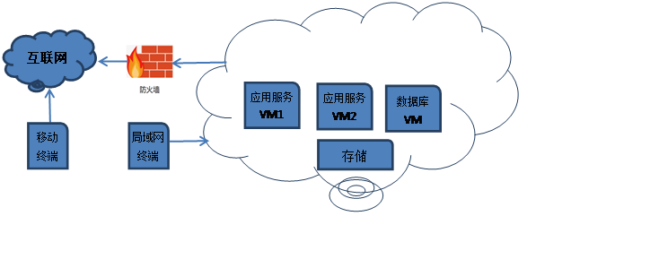

# A场次题目：OpenStack 平台部署与运维

**业务场景：**


某企业拟使用OpenStack搭建一个企业云平台，用于部署各类企业应用对外对内服务。云平台可实现IT资源池化、弹性分配、集中管理、性能优化以及统一安全认证等。系统结构如下图：



企业云平台的搭建使用竞赛平台提供的两台云服务器，配置如下表：

上表 IP地址规划


| 设备名称  | 主机名                   | 接口 | IP地址                                    |
| --------- | ------------------------ | ---- | ----------------------------------------- |
| 云服务器1 | controller               | eth0 | 公网IP:********  私网IP:192.168.100.10/24 |
| eth1      | 私网IP:192.168.200.10/24 |      |                                           |
| 云服务器2 | compute                  | eth0 | 公网IP:********  私网IP:192.168.100.30/24 |
| eth1      | 私网IP:192.168.200.30/24 |      |                                           |

 

**说明：**

1.选手自行检查工位pc机硬件及网络是否正常；

2.竞赛使用集群模式进行，给每个参赛队提供华为云账号和密码及考试系统的账号和密码。选手通过用户名与密码分别登录华为云和考试系统；

3.考试用到的软件包都在云主机/opt下。

  4.上表中的公网IP以自己云主机显示为准，每个人的公网IP不同。使用第三方软件远程连接云主机，使用公网IP连接。


 

## 任务 1私有云平台环境初始化（5 分）


### 1．初始化操作系统

控制节点主机名为controller，计算节点主机名为compute，修改hosts文件将IP地址映射为主机名，使用一条命令关闭firewalld并设置开机不自动启动，设置SELinux为Permissive 模式并用getenforce命令查看。


-   [ ] 请请将以上命令和返回结果提交到答题框。 【2分】


评分检测：systemctl stop firewalld && systemctl disable firewalld &&permissive


```shell
# 完整答案：

# 设置主机名
[root@controller ~]# hostnamectl set-hostname controller
[root@compute ~]# hostnamectl set-hostname compute

# 配置hosts映射
[root@controller ~]# vi /etc/hosts
127.0.0.1  localhost localhost.localdomain localhost4 localhost4.localdomain4
::1     localhost localhost.localdomain localhost6 localhost6.localdomain6
192.168.100.10  controller
192.168.100.30  compute
[root@controller ~]# scp /etc/hosts compute:/etc/hosts

# 关闭防火墙并设置selinux为Permissive
[root@controller ~]# systemctl stop firewalld && systemctl disable firewalld
[root@controller ~]# setenforce 0
```


### 2．挂载安装光盘镜像

将提供的CentOS-7-x86_64-DVD-1804.iso和bricsskills_cloud_iaas.iso光盘镜像复制到controller节点 /root目录下，然后在 /opt目录下使用命令创建 /centos目录和 /iaas目录，并将镜像文件centOS-7-x86_64-DVD-1804.iso挂载到 /centos目录下，将镜像文件bricsskills_cloud_iaas.iso挂载到 /iaas目录下。


-   [ ] 请请将以上命令及返回结果返回到答题框。【1分】


评分检测：mkdir && mount


```shell
#完整答案：

# 创建目录
[root@controller ~]# mkdir /opt/centos /opt/iaas

# 进行挂载
[root@controller ~]# mount -o loop bricsskills_cloud_iaas.iso /opt/iaas/
mount: /dev/loop0 is write-protected, mounting read-only
[root@controller ~]# mount -o loop CentOS-7-x86_64-DVD-1804.iso /opt/centos/
mount: /dev/loop1 is write-protected, mounting read-only
```


 

3．设置yum源

将controller节点和compute节点原有的yum源移动到/home目录， 为controller节点创建本地yum源，yum源文件名为local.repo；为compute节点创建ftp源，yum源文件名为ftp.repo，其中ftp服务器地址为controller节点,配置ftp源时不要写IP地址。


-   [ ] 请使用cat命令将两个节点的yum源文件内容提交到答题框。【0.5分】


评分检测： [file:///opt/centos](file:///opt/centos) && [file:///opt/iaas/iaas-repo](file:///opt/iaas/iaas-repo) && [ftp://controller/centos](ftp://controller/centos) && [ftp://controller/iaas/iaas-repo](ftp://controller/iaas/iaas-repo) 


```shell
完整答案：

# 拷贝至/home目录
[root@controller ~]# mv /etc/yum.repos.d/* /home/
[root@compute ~]# mv /etc/yum.repos.d/* /home/

# 配置controller 本地yum源
[root@controller ~]# vi /etc/yum.repos.d/local.repo
[centos]
name=centos
baseurl=file:///opt/centos
gpgcheck=0
enabled=1
[iaas]
name=iaas
baseurl=file:///opt/iaas/iaas-repo
gpgcheck=0
enabled=1

# 配置compute ftp源
[root@compute ~]# vi /etc/yum.repos.d/ftp.repo
[centos]
name=centos
baseurl=ftp://controller/centos
gpgcheck=0
enabled=1
[iaas]
name=iaas
baseurl=ftp://controller/iaas/iaas-repo
gpgcheck=0
enabled=1
```


### 4．搭建文件共享服务器

在Controller节点上安装vsftp服务并设置开机自启动，将/opt目录设为共享，然后重启服务生效。


-   [ ] 请将vsftp配置文件中修改的行提交到答题框。【0.5分】

    

评分检测：anon_root=/opt


```shell
#完整答案：

# 安装vsftpd 
[root@controller ~]# yum install -y vsftpd

# 启动并设置开机自启动
[root@controller ~]# systemctl start vsftpd && systemctl enable vsftpd
Created symlink from /etc/systemd/system/multi-user.target.wants/vsftpd.service to /usr/lib/systemd/system/vsftpd.service.

# 配置/opt目录进行共享并重启服务
[root@controller ~]# vi /etc/vsftpd/vsftpd.conf 
anon_root=/opt
[root@controller ~]# systemctl restart vsftpd
```


 

### 5．系统调优-脏数据回写

Linux系统内存中会存在脏数据，一般系统默认脏数据30秒后会回写磁盘，修改系统配置文件，要求将回写磁盘的时间临时调整为60秒。


-   [ ] 请使用sysctl  -p命令将结果提交到答题框。【1分】


评分检测：vm.dirty_ratio = 60


```shell
#完整答案：

# 进行配置
[root@controller ~]# vi /etc/sysctl.conf 
vm.dirty_ratio = 60

# 进行查看
[root@controller ~]# sysctl -p
vm.dirty_ratio = 60
```


## 任务2 OpenStack搭建任务（10分）


| 服务名称 | 变量        | 参数/密码      |
| -------- | ----------- | -------------- |
| Mysql    | root        | （以实际为准） |
| Keystone | 000000      |                |
| Glance   | 000000      |                |
| Nova     | 000000      |                |
| Neutron  | 000000      |                |
| Heat     | 000000      |                |
| Zun      | 000000      |                |
| Keystone | DOMAIN_NAME | demo           |
| Admin    | 000000      |                |
| Rabbit   | 000000      |                |
| Glance   | 000000      |                |
| Nova     | 000000      |                |
| Neutron  | 000000      |                |
| Heat     | 000000      |                |
| Zun      | 000000      |                |
| Neutron  | Metadata    | 000000         |

 

### 1. 修改变量文件

在控制节点和计算节点上分别安装iaas-xiandian软件包，修改配置脚本文件中基本变量（配置脚本文件为/etc/xiandian/openrc.sh）。修改完成后使用命令生效该变量文件，并然后执行echo $INTERFACE_IP命令。


-   [ ] 请将echo  $INTERFACE_IP命令的返回结果提交到答题框。【0.5分】


评分检测：192.168.100.10


```shell
#完整答案：

# 进行安装
[root@controller ~]# yum install -y iaas-xiandian
[root@compute ~]# yum -y install iaas-xiandian

# 进行配置
[root@controller ~]# cat /etc/xiandian/openrc.sh | grep -Ev "^$|#"
HOST_IP=192.168.100.10
HOST_PASS=yin984984.
HOST_NAME=controller
HOST_IP_NODE=192.168.100.30
HOST_PASS_NODE=yin984984.
HOST_NAME_NODE=compute
network_segment_IP=192.168.100.0/24
RABBIT_USER=openstack
RABBIT_PASS=000000
DB_PASS=000000
DOMAIN_NAME=demo
ADMIN_PASS=000000
DEMO_PASS=000000
KEYSTONE_DBPASS=000000
GLANCE_DBPASS=000000
GLANCE_PASS=000000
NOVA_DBPASS=000000
NOVA_PASS=000000
NEUTRON_DBPASS=000000
NEUTRON_PASS=000000
METADATA_SECRET=000000
INTERFACE_IP=192.168.100.10
INTERFACE_NAME=eth1
Physical_NAME=provider
minvlan=101
maxvlan=200
CINDER_DBPASS=000000
CINDER_PASS=000000
BLOCK_DISK=vdb1
SWIFT_PASS=000000
OBJECT_DISK=vdb2
STORAGE_LOCAL_NET_IP=192.168.100.30
HEAT_DBPASS=000000
HEAT_PASS=000000
ZUN_DBPASS=000000
ZUN_PASS=000000
KURYR_DBPASS=000000
KURYR_PASS=000000
CEILOMETER_DBPASS=000000
CEILOMETER_PASS=000000
AODH_DBPASS=000000
AODH_PASS=000000
BARBICAN_DBPASS=000000
BARBICAN_PASS=000000
[root@controller ~]# scp /etc/xiandian/openrc.sh compute:/etc/xiandian/openrc.sh
[root@compute ~]# vi /etc/xiandian/openrc.sh
修改内容如下
INTERFACE_IP=192.168.100.30

# 使用echo命令进行操作
[root@controller ~]# source /etc/xiandian/openrc.sh
[root@controller ~]# echo $INTERFACE_IP
192.168.100.10
```


### 2. controller节点和compute节点分别执行iaas-pre-host.sh脚本,并重启云主机。


-   [ ] 请将执行sh文件的命令提交到答题框。【1分】

    

评分检测：[root@controller ~]# iaas-pre-host.sh&&[root@compute ~]# iaas-pre-host.sh

```shell
#完整答案：
[root@controller ~]# iaas-pre-host.sh
[root@compute ~]# iaas-pre-host.sh
[root@controller ~]# reboot
[root@compute ~]# reboot
```


### 3. 搭建数据库组件

执行iaas-install-mysql.sh脚本，在 controller 节点会自行安装 mariadb、memcached、rabbitmq 等服务和完成相关配置。执行完成后修改配置文件将memcached最大连接数修改为2048。


-   [ ] 请将memcached文件中的内容提交到答题框。【1分】


评分检测：MAXCONN="2048"

```shell
#完整答案：

# 执行mysql脚本前 我们需要执行pre脚本，然后执行mysql脚本
[root@controller ~]# iaas-install-mysql.sh

# 配置memcached 最大连接数
[root@controller ~]# vi /etc/sysconfig/memcached 
PORT="11211"
USER="memcached"
MAXCONN="2048"
CACHESIZE="64"
OPTIONS="-l 127.0.0.1,::1,controller"

# 进行查看
[root@controller ~]# ps aux | grep memcached
memcach+ 22173 0.0 0.0 443040 2184 ?    Ssl 03:12  0:00 /usr/bin/memcached -p 11211 -u memcached -m 64 -c 2048 -l 127.0.0.1,::1,controller
```


  

### 4.搭建认证服务组件

执行iaas-install-keystone.sh脚本，在 controller节点上会自行安装keystone 服务和完成相关配置。完成后使用openstack命令查看当前用户列表。


-   [ ] 请将openstack查看用户列表的命令和返回结果提交到答题框。【1分】


评分检测：openstack user list

```shell
#完整答案：

# 执行keystone脚本
[root@controller ~]# iaas-install-keystone.sh 
[root@controller ~]# source  /etc/keystone/admin-openrc.sh
[root@controller ~]# openstack user list
```


### 5.搭建镜像服务组件

执行 iaas-install-glance.sh脚本，在 controller 节点会自行安装 glance服务和完成相关配置。完成后使用openstack 命令将cirros-0.3.4-x86_64-disk.img上传到controller节点的 /root目录下，并命名为cirros。


-   [ ] 请将镜像上传的操作命令和返回结果提交到答题框。【1分】


评分检测：openstack image create --container-format bare --disk-format qcow2 --file cirros-0.3.4-x86_64-disk.img cirros


```shell
#完整答案：

# 执行脚本
[root@controller ~]# iaas-install-glance.sh 

# 创建镜像
[root@controller ~]# openstack image create --container-format bare --disk-format qcow2 --file cirros-0.3.4-x86_64-disk.img cirros
+------------------+------------------------------------------------------+
| Field      | Value                        |
+------------------+------------------------------------------------------+
| checksum     | ee1eca47dc88f4879d8a229cc70a07c6           |
| container_format | bare                         |
| created_at    | 2022-08-30T05:05:18Z                 |
| disk_format   | qcow2                        |
| file       | /v2/images/6110e9d5-bee5-4a68-b557-49a0d703112d/file |
| id        | 6110e9d5-bee5-4a68-b557-49a0d703112d         |
| min_disk     | 0                          |
| min_ram     | 0                          |
| name       | cirros                        |
| owner      | d596c2fb499944f4b0dc29e1d975eb35           |
| protected    | False                        |
| schema      | /v2/schemas/image                  |
| size       | 13287936                       |
| status      | active                        |
| tags       |                           |
| updated_at    | 2022-08-30T05:05:18Z                 |
| virtual_size   | None                         |
| visibility    | shared                        |
+------------------+------------------------------------------------------+
```


 

### 6.搭建计算服务组件

在controller 节点和compute 节点分别执行iaas-install-nova-controller.sh 和iaas-install-nova-compute.sh脚本，会自行安装 nova服务和完成相关配置。然后使用命令列出能提供计算资源的节点。


-   [ ] 请将列出计算资源的命令提交到答题框。【1.5分】


评分检测：nova service-list


```shell
#完整答案：

# 执行脚本
[root@controller ~]# iaas-install-nova-controller.sh  
[root@compute ~]# iaas-install-nova-compute.sh 

# 列出计算资源节点
[root@controller ~]# nova service-list
+--------------------------------------+------------------+------------+----------+---------+-------+----------------------------+-----------------+-------------+
| Id                  | Binary      | Host    | Zone   | Status | State | Updated_at         | Disabled Reason | Forced down |
+--------------------------------------+------------------+------------+----------+---------+-------+----------------------------+-----------------+-------------+
| d5013ec5-83e0-4805-8e7b-bf386165f4ca | nova-consoleauth | controller | internal | enabled | up  | 2022-08-30T05:10:10.000000 | -        | False    |
| 8e75ab10-7f9f-4f18-a359-d0495417132f | nova-scheduler  | controller | internal | enabled | up  | 2022-08-30T05:10:12.000000 | -        | False    |
| 4b19c307-b2aa-4d1b-90a6-beb8542832ab | nova-conductor  | controller | internal | enabled | up  | 2022-08-30T05:10:12.000000 | -        | False    |
| 0f8395c1-4638-4650-a1b0-3896ad5e4003 | nova-compute   | compute  | nova   | enabled | up  | 2022-08-30T05:10:08.000000 | -        | False    |
+--------------------------------------+------------------+------------+----------+---------+-------+----------------------------+-----------------+-------------+
```


### 7.搭建网络组件并初始化网络

在controller 节点和compute 节点分别执行iaas-install-neutron-controller.sh和iaas-install-neutron-compute.sh脚本，会自行安装 neutron 服务并完成配置。创建云主机外部网络 ext-net，子网为 ext-subnet，云主机浮动 IP 可用网段为 192.168.10.100~192.168.10.200，网关为 192.168.10.1。创建云主机内部网络int-net1，子网为int-subnet1，云主机子网 IP 可用网段为10.0.0.100~10.0.0.200，网关为 10.0.0.1；创建云主机内部网络 int-net2，子网为 int-subnet2，云主机子网IP 可用网段为 10.0.1.100 ~ 10.0.1.200，网关为 10.0.1.1。添加名为 ext-router 的路由器，添加网关在 ext-net 网络，添加内部端口到 int-net1 网络，完成内部网络int-net1 和外部网络的连通。


-   [ ] 请使用openstack命令完成以上任务，完成后将命令和返回结果提交到答题框。【4分】


评分检测：openstack subnet create --ip-version 4 --gateway 192.168.100.1 --allocation-pool start=192.168.100.100,end=192.168.100.300 --network eab755e3-acfd-4408-b4f4-383cc8aec3a6 --subnet-range 192.168.100.0/24 ext-subnet&& openstack subnet create --ip-version 4 --gateway 10.0.1.1 --allocation-pool start=10.0.1.100,end=10.0.1.200 --network eba225c2-c425-4dfc-bab2-4c1d3f81590a --subnet-range 10.0.1.0/24 int-subnet2&& openstack router add subnet ext-router


```shell
#完整答案：

# 执行脚本
[root@controller ~]# iaas-install-neutron-controller.sh 
[root@compute ~]# iaas-install-neutron-compute.sh  

# 创建网络
[root@controller ~]# openstack network create --external ext-net
[root@controller ~]# openstack network create int-net1
[root@controller ~]# openstack network create int-net2

# 创建子网
[root@controller ~]# openstack subnet create --ip-version 4 --gateway 192.168.100.1 --allocation-pool start=192.168.100.100,end=192.168.100.300 --network eab755e3-acfd-4408-b4f4-383cc8aec3a6 --subnet-range 192.168.100.0/24 ext-subnet    
[root@controller ~]# openstack subnet create --ip-version 4 --gateway 10.0.0.1 --allocation-pool start=10.0.0.100,end=10.0.0.200 --network 2ea2a2a8-bd10-401d-85bd-ec8fb07519fe --subnet-range 10.0.0.0/24 int-subnet1    
[root@controller ~]# openstack subnet create --ip-version 4 --gateway 10.0.1.1 --allocation-pool start=10.0.1.100,end=10.0.1.200 --network eba225c2-c425-4dfc-bab2-4c1d3f81590a --subnet-range 10.0.1.0/24 int-subnet2

# 创建路由并添加网络
[root@controller ~]# openstack router create ext-router
[root@controller ~]# openstack router set --external-gateway ext-net ext-router
[root@controller ~]# openstack router add subnet ext-router 9022c709-f983-4059-b5ca-a5d77ba8466f
```


### 8.搭建图形化界面

执行 iaas-install-dashboard.sh脚本，在 controller 节点会自行安装 dashboard 服务并完成配置。请修改nova配置文件，使之能通过公网IP访问dashboard首页信息。


-   [ ] 请将nova配置文件修改的行提交到答题框。【1分】


评分检测：novncproxy_base_url


```shell
#完整答案：

# 执行脚本
[root@controller ~]# iaas-install-dashboard.sh 
[root@compute ~]# vi /etc/nova/nova.conf
修改内容如下
novncproxy_base_url = http://119.3.157.253:6080/vnc_auto.html
```


## 任务3 OpenStack运维任务（10分）

某公司构建了一套内部私有云系统，这套私有云系统将为公司内部提供计算服务。你将作为该私有云的维护人员，请完成以下运维工作。

 

### 1.用户管理

在 keystone 中创建shop项目添加描述为你的座位号，完成后使用openstack命令禁用该项目，然后使用openstack命令查看该项目的详细信息。


-   [ ] 请请将以上所有命令和返回结果提交到答题框。【1分】


评分检测：openstack project create --domain demo --description&& openstack project show  shop


```shell
#完整答案：
[root@controller ~]# openstack project create --domain demo --description xxxx shop
+-------------+----------------------------------+
| Field    | Value              |
+-------------+----------------------------------+
| description | xxxx               |
| domain_id  | 0fce10d03455465284d815d6844df5d9 |
| enabled   | True               |
| id     | f9f75900aaed4fe6a87d8de50ef2b8fe |
| is_domain  | False              |
| name    | gjbs               |
| parent_id  | 0fce10d03455465284d815d6844df5d9 |
| tags    | []                |
+-------------+----------------------------------+
[root@controller ~]# openstack project set --disable  shop
[root@controller ~]# openstack project show  shop
+-------------+----------------------------------+
| Field    | Value              |
+-------------+----------------------------------+
| description | xxxx               |
| domain_id  | 0fce10d03455465284d815d6844df5d9 |
| enabled   | False               |
| id     | f9f75900aaed4fe6a87d8de50ef2b8fe |
| is_domain  | False              |
| name    | gjbs               |
| parent_id  | 0fce10d03455465284d815d6844df5d9 |
| tags    | []                |
+-------------+----------------------------------+
```


### 2.服务查询

使用命令列出服务目录和端点，查看glance服务的端点。


-   [ ] 请将以上命令和返回结果提交到答题框。【1分】


评分检测：openstack catalog list


```shell
#完整答案：

[root@controller ~]# openstack catalog list
+-----------+-----------+-----------------------------------------+
| Name   | Type   | Endpoints                |
+-----------+-----------+-----------------------------------------+
| keystone | identity | RegionOne                |
|      |      |  public: http://controller:5000/v3   |
|      |      | RegionOne                |
|      |      |  admin: http://controller:35357/v3   |
|      |      | RegionOne                |
|      |      |  internal: http://controller:5000/v3  |
|      |      |                     |
| nova   | compute  | RegionOne                |
|      |      |  internal: http://controller:8774/v2.1 |
|      |      | RegionOne                |
|      |      |  public: http://controller:8774/v2.1  |
|      |      | RegionOne                |
|      |      |  admin: http://controller:8774/v2.1  |
|      |      |                     |
| glance  | image   | RegionOne                |
|      |      |  public: http://controller:9292    |
|      |      | RegionOne                |
|      |      |  internal: http://controller:9292   |
|      |      | RegionOne                |
|      |      |  admin: http://controller:9292     |
|      |      |                     |
| placement | placement | RegionOne                |
|      |      |  admin: http://controller:8778     |
|      |      | RegionOne                |
|      |      |  public: http://controller:8778    |
|      |      | RegionOne                |
|      |      |  internal: http://controller:8778   |
|      |      |                     |
| neutron  | network  | RegionOne                |
|      |      |  admin: http://controller:9696     |
|      |      | RegionOne                |
|      |      |  internal: http://controller:9696   |
|      |      | RegionOne                |
|      |      |  public: http://controller:9696    |
|      |      |                     |
[root@controller ~]# openstack endpoint list --service glance
+----------------------------------+-----------+--------------+--------------+---------+-----------+------------------------+
| ID                | Region  | Service Name | Service Type | Enabled | Interface | URL          |
+----------------------------------+-----------+--------------+--------------+---------+-----------+------------------------+
| 42aab0bf4dd44ddf8f9179c0e4edf88d | RegionOne | glance    | image    | True  | public  | http://controller:9292 |
| 47c56a4276644f05a00ea215e10d6bdb | RegionOne | glance    | image    | True  | internal | http://controller:9292 |
| f10c50d59ab740b282136c7dea242db5 | RegionOne | glance    | image    | True  | admin   | http://controller:9292 |
+----------------------------------+-----------+--------------+--------------+---------+-----------+------------------------+
```


### 3.镜像管理

登录 controller节点，使用 glance 相关命令，上传镜像，源使用 CentOS_7.5_x86_64_XD.qcow2，名字为 centos7.5，修改这个镜像为共享状态，并设置最小磁盘为20G。


-   [ ] 请将以上命令和返回结果提交到答题框。【1分】


评分检测：glance image-create&&--name centos7.5


```shell
#完整答案：

[root@controller ~]# glance image-create --container-format bare --disk-format qcow2 --file CentOS_7.5_x86_64_XD.qcow2 --name centos7.5
+------------------+--------------------------------------+
| Property     | Value                |
+------------------+--------------------------------------+
| checksum     | 3d3e9c954351a4b6953fd156f0c29f5c   |
| container_format | bare                 |
| created_at    | 2022-09-05T12:49:33Z         |
| disk_format   | qcow2                |
| id        | 6bfcbabc-489b-4401-bbdf-617b7e1b6301 |
| min_disk     | 0                  |
| min_ram     | 0                  |
| name       | centos7.5              |
| owner      | 4571f576b3e745d4b5b4a2c8890ba119   |
| protected    | False                |
| size       | 510459904              |
| status      | active                |
| tags       | []                  |
| updated_at    | 2022-09-05T12:49:36Z         |
| virtual_size   | None                 |
| visibility    | shared                |
+------------------+--------------------------------------+
```


### 4.后端配置文件管理

请修改glance后端配置文件，将项目的映像存储限制为20GB。完成后重启glance服务。


-   [ ] 请将修改的配置文件内容提交到答题框。【1分】


评分检测：user_storage_quota

```shell
#完整答案：
[root@controller ~]# vi /etc/glance/glance-api.conf 
user_storage_quota = 21474836480
[root@controller ~]# systemctl restart openstack-glance-*
```


### 5.存储服务管理

分别在controller节点和compute节点执行iaas-install-cinder-controller.sh 和iaas-install-cinder-compute.sh脚本，在 controller 和 compute 节点上会自行安装 cinder 服务并完成配置。创建一块带这个卷类型标识的云硬盘并查询该云硬盘的详细信息。


-   [ ] 将返回结果及解题过程提交到答题框。【2分】


评分检测：cinder type-key&&--volume-type


```shell
#完整答案：

# 执行脚本
[root@controller ~]# iaas-install-cinder-controller.sh 
[root@compute ~]# iaas-install-cinder-compute.sh

# 创建云硬盘
[root@controller ~]# cinder type-create lvm
+--------------------------------------+------+-------------+-----------+
| ID                  | Name | Description | Is_Public |
+--------------------------------------+------+-------------+-----------+
| 31a02408-c53c-4ee6-b3d2-a702134cb3d7 | lvm | -      | True   |
+--------------------------------------+------+-------------+-----------+
[root@controller ~]# cinder type-key lvm set volume_backend_name=LVM
[root@controller ~]# cinder create --volume-type lvm --name lvm_test 1

# 查看详细信息
[root@controller ~]# cinder show lvm_test
+--------------------------------+--------------------------------------+
| Property            | Value                |
+--------------------------------+--------------------------------------+
| attached_servers        | []                  |
| attachment_ids         | []                  |
| availability_zone       | nova                 |
| bootable            | false                |
| consistencygroup_id      | None                 |
| created_at           | 2022-08-31T01:44:00.000000      |
| description          | None                 |
| encrypted           | False                |
| id               | 668f125e-dfe3-4727-9542-245d6b7f636a |
| metadata            |                   |
| migration_status        | None                 |
| multiattach          | False                |
| name              | lvm_test               |
| os-vol-host-attr:host     | compute@lvm#LVM           |
| os-vol-mig-status-attr:migstat | None                 |
| os-vol-mig-status-attr:name_id | None                 |
| os-vol-tenant-attr:tenant_id  | 8002f5819f2d48c78cab96f7eb6ce03e   |
| replication_status       | None                 |
| size              | 1                  |
| snapshot_id          | None                 |
| source_volid          | None                 |
| status             | available              |
| updated_at           | 2022-08-31T01:44:01.000000      |
| user_id            | e8c936e610af4a219b21d8d74913a898   |
| volume_type          | lvm                 |
+--------------------------------+--------------------------------------+
```


 

### 6.数据库管理

请使用数据库命令将所有数据库进行备份,备份文件名为openstack.sql，完成后使用命令查看文件属性其中文件大小以mb显示。


-   [ ] 将所有命令及答案提交到答题框。【1分】


评分检测：mysqldump -uroot && du -h openstack.sql


```shell
#完整答案：
mysqldump -uroot -p000000 --all-databases > openstack.sql
[root@controller ~]# du -h openstack.sql 
1.6M  openstack.sql
```


 

### 7.对象存储管理

使用 swift 相关命令，查询 swift 对象存储服务可以存储的单个文件大小的最大值。


-   [ ] 请请将以上命令和返回结果提交到答题框。【1分】


评分检测：swift capabilities&& grep max_file_size


```shell
#完整答案：
[root@controller ~]# iaas-install-swift-controller.sh 
[root@compute ~]# iaas-install-swift-compute.sh 
[root@controller ~]# swift capabilities | grep max_file_size
max_file_size: 5368709122
```


### 8.数据库管理

进入数据库，创建本地用户 examuser，密码为 000000，然后查询 mysql 数据库中的 user 表的user,host,password字段。然后赋予这个用户所有数据库的“查询”“删 除”“更新”“创建”的权限。


-   [ ] 请将以上操作命令及结果提交到答题框【1分】


评分检测：create user examuser@'localhost' identified by '000000' ;&& grant select,delete,update,create on *.* to 'examuser'@'localhost' ;


```shell
#完整答案

[root@controller ~]# mysql -uroot -p
MariaDB [mysql]> create user examuser@'localhost' identified by '000000' ;   
Query OK, 0 rows affected (0.00 sec)
MariaDB [mysql]> use mysql
Database changed
MariaDB [mysql]> select user,host,password from user ;
+----------+------------+-------------------------------------------+
| user   | host    | password                 |
+----------+------------+-------------------------------------------+
| root   | localhost | *032197AE5731D4664921A6CCAC7CFCE6A0698693 |
| root   | controller | *032197AE5731D4664921A6CCAC7CFCE6A0698693 |
| root   | 127.0.0.1 | *032197AE5731D4664921A6CCAC7CFCE6A0698693 |
| root   | ::1    | *032197AE5731D4664921A6CCAC7CFCE6A0698693 |
| keystone | localhost | *032197AE5731D4664921A6CCAC7CFCE6A0698693 |
| keystone | %     | *032197AE5731D4664921A6CCAC7CFCE6A0698693 |
| glance  | localhost | *032197AE5731D4664921A6CCAC7CFCE6A0698693 |
| glance  | %     | *032197AE5731D4664921A6CCAC7CFCE6A0698693 |
| nova   | localhost | *032197AE5731D4664921A6CCAC7CFCE6A0698693 |
| nova   | %     | *032197AE5731D4664921A6CCAC7CFCE6A0698693 |
| neutron | localhost | *032197AE5731D4664921A6CCAC7CFCE6A0698693 |
| neutron | %     | *032197AE5731D4664921A6CCAC7CFCE6A0698693 |
| cinder  | localhost | *032197AE5731D4664921A6CCAC7CFCE6A0698693 |
| cinder  | %     | *032197AE5731D4664921A6CCAC7CFCE6A0698693 |
| examuser | localhost | *032197AE5731D4664921A6CCAC7CFCE6A0698693 |
+----------+------------+-------------------------------------------+
15 rows in set (0.00 sec)
MariaDB [mysql]> grant select,delete,update,create on *.* to 'examuser'@'localhost' ;
Query OK, 0 rows affected (0.00 sec)
```


## 任务四 OpenStack架构任务（5分）


公司内部拥有一套私有云系统，为了调试该私有云，需要编写一些测试用脚本进行功能性测试，作为公司私有云维护人员请你完成以下工作。

 

### 1.请使用openstack命令创建一个浮动IP地址，完成后使用openstack命令查看该浮动IP的id，请编写一个名为floating_show.sh的脚本，该脚本$1变量为浮动ip的id，对接neutron服务端点获取该浮动IP的详细信息。脚本使用curl向api端点传递参数，为了兼容性考虑不得出现openstack命令。


-   [ ] 请将floating_show.sh中的内容提交到答题框【2.5分】


评分检测：curl -i -X POST -H "Content-type: application/json" &&"identity" && "user"&& "scope"


```shell
#完整答案

[root@controller ~]# cat floating_show.sh 
tokenaa= `curl -i -X POST -H "Content-type: application/json" -d '{
"auth": {
  "identity": {
    "methods": [
      "password"
    ],
    "password": {
      "user": {
        "domain": {
          "name": "default"
        },
        "name": "admin",
        "password": "000000"
      }
    }
  },
  "scope": {
    "project": {
      "domain": {
        "name": "default"
      },
      "name": "admin"
    }
  }
}
}
' http://192.168.100.10:5000/v3/auth/tokens | awk  'NR==4{print}' | awk -F ':' '{print $2}'
curl  -X GET http://controller:9696/v2.0/floatingips/$1 -H "User-Agent: openstacksdk/0.8.3 keystoneauth1/2.4.1 python-requests/2.10.0 CPython/2.7.5" -H "Accept: application/json" -H "X-Auth-Token: $tokenaa"  | python -m json.tool 
```


 

### 2.请编写脚本floating_delete.sh，完成浮动IP的删除。设置一个$1变量，当用户向$1传递一个浮动IP的id，即可完成该浮动IP的删除。脚本使用curl向api端点传递参数，为了兼容性考虑不得出现openstack命令。


-   [ ] 请将floating_show.sh中的内容提交到答题框【2.5分】


评分检测：curl -i -X POST -H "Content-type: application/json"&& "identity"&&"scope"&&"project"&&"domain"


```shell
#完整答案：

[root@controller ~]# cat floating_delete.sh 

tokenaa=`curl -i -X POST -H "Content-type: application/json" -d '{
"auth": {
  "identity": {
    "methods": [
      "password"
    ],
    "password": {
      "user": {
        "domain": {
          "name": "default"
        },
        "name": "admin",
        "password": "000000"
      }
    }
  },
  "scope": {
    "project": {
      "domain": {
        "name": "default"
      },
      "name": "admin"
    }
  }
}
}
' http://192.168.100.10:5000/v3/auth/tokens | awk  'NR==4{print}' | awk -F ':' '{print $2}'`

curl  -X DELETE http://controller:9696/v2.0/floatingips/$1 -H "User-Agent: openstacksdk/0.8.3 keystoneauth1/2.4.1 python-requests/2.10.0 CPython/2.7.5" -H "Accept: application/json" -H "X-Auth-Token: $tokenaa"  | python -m json.tool 
```


 

 