[toc]


# B场次题目：容器的编排与运维


某企业计划使用k8s平台搭建微服务系统，现在先使用简单的微服务项目进行测试，请按照要求完成相应任务。

上表 IP地址规划

| 设备名称  | 主机名 | 接口 | IP地址                                | 说明 |
| --------- | ------ | ---- | ------------------------------------- | ---- |
| 云服务器1 | master | eth0 | 公网IP:****  私网IP:192.168.100.11/24 |      |
| 云服务器2 | node1  | eth0 | 公网IP:****  私网IP:192.168.100.12/24 |      |
| 云服务器3 | node2  | eth0 | 公网IP:****  私网IP:192.168.100.13/24 |      |
| 云服务器4 | harbor | eth0 | 公网IP:****  私网IP:192.168.100.14/24 |      |

**说明：**

1.   上表中的公网IP以自己云主机显示为准，每个人的公网IP不同。使用第三方软件远程连接云主机，使用公网IP连接。

2.   华为云中云主机名字已命好，直接使用对应名字的云主机即可。


 

## 任务一：容器云平台环境初始化（5 分）


### 1.容器云平台的初始化

master节点、node1节点和node2节点关闭swap，同时所有节点永久关闭selinux以及防火墙,并修改hosts映射。


-   [ ] 请将master节点hosts文件内容提交到答题框。【1分】


评分检测：192.168.100.11 master &&192.168.100.12 node1&&192.168.100.13 node2&&192.168.100.14 harbor


```shell
#完整答案：

#(1)修改主机名并配置映射

master节点：
[root@master ~]# hostnamectl set-hostname master
[root@master ~]# cat /etc/hosts
127.0.0.1   localhost localhost.localdomain localhost4 localhost4.localdomain4
::1         localhost localhost.localdomain localhost6 localhost6.localdomain6
192.168.100.11 master
192.168.100.12 node1
192.168.100.13 node2
192.168.100.14 harbor

node1节点：
[root@node1 ~]# hostnamectl set-hostname node1
[root@node1 ~]# cat /etc/hosts
127.0.0.1   localhost localhost.localdomain localhost4 localhost4.localdomain4
::1         localhost localhost.localdomain localhost6 localhost6.localdomain6
192.168.100.11 master
192.168.100.12 node1
192.168.100.13 node2
192.168.100.14 harbor

node2节点：
[root@node2 ~]# hostnamectl set-hostname node2
[root@node2 ~]# cat /etc/hosts
127.0.0.1   localhost localhost.localdomain localhost4 localhost4.localdomain4
::1         localhost localhost.localdomain localhost6 localhost6.localdomain6
192.168.100.11 master
192.168.100.12 node1
192.168.100.13 node2
192.168.100.14 harbor

harbor节点：
[root@harbor ~]# hostnamectl set-hostname harbor
[root@harbor ~]# cat /etc/hosts
127.0.0.1   localhost localhost.localdomain localhost4 localhost4.localdomain4
::1         localhost localhost.localdomain localhost6 localhost6.localdomain6
192.168.100.11 master
192.168.100.12 node1
192.168.100.13 node2
192.168.100.14 harbor

#(2)关闭SELinux和防火墙

## 所有节点关闭SELinux：
master节点: 
[root@master ~]# sed -i 's/SELINUX=enforcing/SELINUX=disabled/g' /etc/selinux/config
[root@master ~]# setenforce 0

node1节点: 
[root@node1 ~]# sed -i 's/SELINUX=enforcing/SELINUX=disabled/g' /etc/selinux/config
[root@node1 ~]# setenforce 0

node2节点: 
[root@node2 ~]# sed -i 's/SELINUX=enforcing/SELINUX=disabled/g' /etc/selinux/config
[root@node2 ~]# setenforce 0

harbor节点: 
[root@harbor ~]# sed -i 's/SELINUX=enforcing/SELINUX=disabled/g' /etc/selinux/config
[root@harbor ~]# setenforce 0

## 所有节点关闭防火墙：
master节点: 
[root@master ~]# systemctl stop firewalld.service
[root@master ~]# systemctl disable firewalld.service

node1节点: 
[root@node1 ~]# systemctl stop firewalld.service
[root@node1 ~]# systemctl disable firewalld.service

node2节点: 
[root@node2 ~]# systemctl stop firewalld.service
[root@node2 ~]# systemctl disable firewalld.service

harbor节点: 
[root@harbor ~]# systemctl stop firewalld.service
[root@harbor ~]# systemctl disable firewalld.service


#(3)关闭swap

master和node节点关闭swap： 
[root@master ~]# sed  -ri  s/.*swap.*/#&/  /etc/fstab
[root@master ~]# swapoff -a
[root@node1 ~]# sed  -ri  s/.*swap.*/#&/  /etc/fstab
[root@node1 ~]# swapoff -a
[root@node2 ~]# sed  -ri  s/.*swap.*/#&/  /etc/fstab
[root@node2 ~]# swapoff -a
```


  

### 2．Yum源数据的持久化挂载

将提供的CentOS-7-x86_64-DVD-1804.iso和bricsskills_cloud_paas.iso光盘镜像移动到master节点 /root目录下，然后在 /opt目录下使用命令创建 /centos目录和 /paas目录，并将镜像文件CentOS-7-x86_64-DVD-1804.iso永久挂载到/centos目录下，将镜像文件chinaskills_cloud_paas.iso永久挂载到 /paas目录下。


-   [ ] 请设置永久开机自动挂载，并将设置的永久开机自动挂载的文件内容提交到答题框。【1分】


评分检测：/root/Chinaskill_Cloud_PaaS.iso  /opt/paas   xfs   defaults    0 0&&/root/ CentOS-7-x86_64-DVD-1804.iso /opt/centos   xfs   defaults    0 0


```shell
# master节点：

[root@master ~]# mkdir /opt/centos /opt/paas
[root@master ~]# mount -o loop /root/Chinaskill_Cloud_PaaS.iso /opt/paas
[root@master ~]# mount -o loop /root/CentOS-7-x86_64-DVD-1804.iso /opt/centos
[root@master ~]# vi /etc/fstab
/root/Chinaskill_Cloud_PaaS.iso   /opt/paas     xfs     defaults        0 0
/root/ CentOS-7-x86_64-DVD-1804.iso  /opt/centos     xfs     defaults        0 0
```


### 3．Yum源的编写

为master节点设置本地yum源，yum源文件名为local.repo，安装ftp服务，将ftp仓库设置为 /opt/，为node1节点和node2节点配置ftp源，yum源文件名称为ftp.repo，其中ftp服务器地址为master节点,配置ftp源时不要写IP地址。


-   [ ] 请将node1节点的yum源文件内容提交到答题框。【1分】


评分检测：baseurl=ftp://master/kubernetes-repo


完整答案：

```shell
master节点：
[root@master ~]# mv /etc/yum.repos.d/CentOS-* /home
[root@master ~]# cat << EOF >/etc/yum.repos.d/centos.repo
[k8s]
name=k8s
baseurl=file:///opt/kubernetes-repo
gpgcheck=0
enabled=1
EOF

# master节点安装ftp服务器：
[root@master ~]# yum install -y vsftpd
[root@master ~]# vi /etc/vsftpd/vsftpd.conf 
anon_root=/opt
[root@master ~]# systemctl start vsftpd && systemctl enable vsftpd

node节点：
[root@node1 ~]# mv /etc/yum.repos.d/CentOS-* /home
[root@node1 ~]# cat << EOF >/etc/yum.repos.d/ftp.repo
[k8s]
name=k8s
baseurl=ftp://master/kubernetes-repo
gpgcheck=0
enabled=1
EOF
```


 

### 4．设置时间同步服务器

在master节点上部署chrony服务器，允许其他节点同步时间，启动服务并设置为开机启动；在其他节点上指定master节点为上游NTP服务器，重启服务并设为开机启动。


-   [ ] 请将master节点修改的行的内容提交到答题框。【1分】


评分检测：server 192.168.100.11 iburst&& allow 192.168.100.0/24


完整答案：

```shell
# master节点：
yum install -y chronyd
vi /etc/chrony.conf
server 192.168.100.11 iburst
allow  192.168.100.0/24
local stratum 10
systemctl start chronyd
systemctl enable chronyd
# node节点：
yum install -y chronyd
vi /etc/chrony.conf
server 192.168.100.11 iburst
systemctl start chronyd
systemctl enable chronyd
chronyc sources
```


 

### 5.设置免密登录

为四台服务器设置免密登录，保证服务器之间能够互相免密登录。


请将master节点免密登录的命令提交到答题框。【1分】


评分检测：ssh-keygen&& ssh-copy-id node1&& ssh-copy-id node2&& ssh-copy-id harbor


完整答案：

```shell
master节点：
ssh-keygen
ssh-copy-id node1
ssh-copy-id node2
ssh-copy-id harbor
   其它节点的命令和上面一样
```


 

## 任务二 k8s搭建任务（10分）


### 1．安装docker应用

在所有节点上安装dokcer-ce。安装完成后修改docker启动引擎为systemd并配置阿里云镜像加速地址，配置成功重启docker服务器。


请将daemon.json文件内容提交到答题框。【1分】


评分检测："registry-mirrors"

完整答案：

```shell
所有节点安装Docker-ce：
# yum install -y yum-utils device-mapper-persistent-data lvm2
# yum install -y docker-ce
启动Docker：
# systemctl start docker
# systemctl enable docker
在所有节点调整部分docker参数：
# tee /etc/docker/daemon.json <<-'EOF'
{
"registry-mirrors": ["https://5twf62k1.mirror.aliyuncs.com"], 
  "exec-opts": ["native.cgroupdriver=systemd"]
}
EOF
# systemctl restart docker
# docker version
```


### 2．安装docker-compose

在Harbor节点上使用 /opt/paas/docker-compose/v1.25.5-docker-compose-Linux-x86_6下的文件安装docker-compose。安装完成后执行docker-compose version命令。

请将docker-compose version命令返回结果提交到答题框。【0.5分】

评分检测：docker-compose version 1.25.5, build 8a1c60f6

完整答案：

```shell
# 在master节点安装docker-compose：

# cp -rfv /opt/paas/docker-compose/v1.25.5-docker-compose-Linux-x86_64 /usr/local/bin/docker-compose 
# chmod +x /usr/local/bin/docker-compose
# docker-compose version
docker-compose version 1.25.5, build 8a1c60f6
docker-py version: 4.1.0
CPython version: 3.7.5
OpenSSL version: OpenSSL 1.1.0l  10 Sep 2019
```


 

### 3．搭建horbor仓库

在Harbor节点使用/opt/paas/harbor/ harbor-offline-installer-v2.1.0.tgz离线安装包，安装harbor仓库，并修改各节点默认docker仓库为harbor仓库地址。


请将master节点daemon.json中的内容提交到答题框。【2分】


评分检测："insecure-registries" : ["harbor"]


完整答案：

```shell
Harbor节点部署Harbor
导入镜像：
# cd /opt/paas/images
# for img in `ls | grep goharbor`;do docker load -i $img;done
解压安装包：
# cd /opt/paas/harbor/
# tar -zxvf harbor-offline-installer-v2.1.0.tgz -C /usr/local/
# cd /usr/local/harbor/
修改Harbor配置信息：
# cp harbor.yml.tmpl harbor.yml
# vi harbor.yml
hostname: harbor  # 将域名修改为本机IP
harbor_admin_password: Harbor12345
#https:  # 禁用https
  # https port for harbor, default is 443
  # port: 443
  # The path of cert and key files for nginx
  # certificate: /your/certificate/path
  # private_key: /your/private/key/path
启动Harbor：
# ./prepare
# ./install.sh --with-clair
其他节点修改默认仓库地址：
# vi /etc/docker/daemon.json
{
  "insecure-registries" : ["harbor"],
"registry-mirrors": ["https://5twf62k1.mirror.aliyuncs.com"], 
  "exec-opts": ["native.cgroupdriver=systemd"]
}
# systemctl restart docker
各节点登录harbor
# docker login 192.168.100.14

```


 

### 4．上传docker镜像


在master节点使用命令将/opt/paas/images目录下所有镜像导入本地。然后使用/opt/paas/k8s_image_push.sh将所有镜像上传至docker仓库。


请将镜像导入本地的命令，提交到答题框。【1分】


评分检测：for img in $(ls);do docker load -i $img ; done


完整答案：

```shell
# cd /opt/paas/images/
# for img in $(ls);do docker load  -i $img ; done
# ./k8s_image_push.sh
输入镜像仓库地址(不加http/https): 192.168.100.14
输入镜像仓库用户名: admin
输入镜像仓库用户密码: Harbor12345
您设置的仓库地址为: 192.168.100.14,用户名: admin,密码: xxx
是否确认(Y/N): Y

```


 

### 5．安装kubeadm工具

在master及所有node节点安装Kubeadm工具并设置开机自动启动，安装完成后使用rpm命令配合grep查看Kubeadm工具是否正确安装。


请将maser节点安装Kubeadm工具的命令提交到答题框。【0.5分】


评分检测：yum -y install kubeadm-1.18.1 kubectl-1.18.1 kubelet-1.18.1


完整答案：

```shell
master及node节点安装Kubeadm工具：
# yum -y install kubeadm-1.18.1 kubectl-1.18.1 kubelet-1.18.1
# systemctl enable kubelet && systemctl start kubelet

```


### 6．kubeadm安装master

使用kubeadm命令生成yaml文件，并修改yaml文件，设置kubernetes虚拟内部网段地址为10.244.0.0/16，通过该yaml文件初始化master节点，然后使用kube-flannel.yaml完成控制节点初始化设置，完成后使用命令查看集群状态和所有pod。


请将查看集群状态的命令及结果提交到答题框。【2分】


评分检测：kubectl get cs&& controller-manager   Healthy   ok

完整答案：


```shell
在master节点生成初始配置yaml文件：
# kubeadm config print init-defaults > kubeadm-config.yaml
修改yaml文件
# vi kubeadm-config.yaml 
localAPIEndpoint:
  advertiseAddress: 192.168.100.11	#修改为master主机IP地址
imageRepository: registry.aliyuncs.com/google_containers 	#修改为阿里云镜像仓库地址
kubernetesVersion: v1.18.1		#修改版本号为当前版本号
networking:
  dnsDomain: cluster.local
  serviceSubnet: 10.96.0.0/12
  podSubnet: 10.244.0.0/16		#添加此subnet项
根据yaml文件使用kubeadm命令初始化master节点
# kubeadm init --config kubeadm-config.yaml
[init] Using Kubernetes version: v1.18.1
[preflight] Running pre-flight checks
[preflight] Pulling images required for setting up a Kubernetes cluster
..................
[addons] Applied essential addon: CoreDNS
[addons] Applied essential addon: kube-proxy

Your Kubernetes control-plane has initialized successfully!

To start using your cluster, you need to run the following as a regular user:

  mkdir -p $HOME/.kube
  sudo cp -i /etc/kubernetes/admin.conf $HOME/.kube/config
  sudo chown $(id -u):$(id -g) $HOME/.kube/config

You should now deploy a pod network to the cluster.
Run "kubectl apply -f [podnetwork].yaml" with one of the options listed at:
  https://kubernetes.io/docs/concepts/cluster-administration/addons/

Then you can join any number of worker nodes by running the following on each as root:

kubeadm join 10.18.4.10:6443 --token cxtb79.mqg7drycn5s82hhc \
    --discovery-token-ca-cert-hash sha256:d7465b10f81ecb32ca30459efc1e0efe4f22bfbddc0c17d9b691f611082f415c
初始化完成后执行：
# mkdir -p $HOME/.kube
# sudo cp -i /etc/kubernetes/admin.conf $HOME/.kube/config
# sudo chown $(id -u):$(id -g) $HOME/.kube/config
查看集群状态：
# kubectl get cs
NAME              STATUS    MESSAGE             ERROR
scheduler            Healthy     ok
controller-manager     Healthy     ok
etcd-0               Healthy     {"health":"true"}
查看节点状态：
# kubectl get nodes
NAME     STATUS     ROLES    AGE     VERSION
master     NotReady     master     2m57s    v1.18.1
可以发现master处于notready状态，这是正常的，因为还没有网络插件，接下来安装网络后就变为正常了：
# kubectl apply -f yaml/kube-flannel.yaml 
podsecuritypolicy.policy/psp.flannel.unprivileged created
clusterrole.rbac.authorization.k8s.io/flannel created
clusterrolebinding.rbac.authorization.k8s.io/flannel created
serviceaccount/flannel created
configmap/kube-flannel-cfg created
daemonset.apps/kube-flannel-ds created
# kubectl get pods -A
NAMESPACE     NAME            READY    STATUS    RESTARTS   AGE
kube-system   coredns-7ff77c879f-7vj79       1/1     Running   0          14m
kube-system   coredns-7ff77c879f-nvclj        1/1     Running   0          14m
kube-system   etcd-master                   1/1     Running   0          14m
kube-system   kube-apiserver-master           1/1     Running   0          14m
kube-system   kube-controller-manager-master   1/1     Running   0          14m
kube-system   kube-flannel-ds-d5p4g           1/1     Running   0          11m
kube-system   kube-proxy-2gstw              1/1     Running   0          14m
kube-system   kube-scheduler-master           1/1     Running   0          14m
# kubectl get nodes
NAME     STATUS   ROLES    AGE   VERSION
master      Ready     master     17m    v1.18.1

```


 

### 7. 删除污点

使用命令删除master节点的污点，使得Pod也可以调度到master节点上，操作成功配合grep查看master节点的污点。

请将删除master节点的污点的命令提交到答题框。【1分】


评分检测：kubectl taint nodes master node-role.kubernetes.io/master=:NoSchedule


完整答案：

 ```shell
# kubectl taint nodes master node-role.kubernetes.io/master=:NoSchedule- 
# kubectl get nodes -o yaml master | grep -A10 spec
 ```


### 8．安装kubernetes网络插件

使用kube-flannel.yaml 安装kubernetes网络插件，安装完成后使用命令查看节点状态。

请将kubectl get nodes命令的返回结果提交到答题框。【0.5分】

评分检测：master   Ready   master   17m  v1.18.1

完整答案：

```shell
# kubectl apply -f  kube-flannel.yaml 
podsecuritypolicy.policy/psp.flannel.unprivileged created
clusterrole.rbac.authorization.k8s.io/flannel created
clusterrolebinding.rbac.authorization.k8s.io/flannel created
serviceaccount/flannel created
configmap/kube-flannel-cfg created
daemonset.apps/kube-flannel-ds created
# kubectl get pods -A
NAMESPACE     NAME            READY    STATUS    RESTARTS   AGE
kube-system   coredns-7ff77c879f-7vj79       1/1     Running   0          14m
kube-system   coredns-7ff77c879f-nvclj        1/1     Running   0          14m
kube-system   etcd-master                   1/1     Running   0          14m
kube-system   kube-apiserver-master           1/1     Running   0          14m
kube-system   kube-controller-manager-master   1/1     Running   0          14m
kube-system   kube-flannel-ds-d5p4g           1/1     Running   0          11m
kube-system   kube-proxy-2gstw              1/1     Running   0          14m
kube-system   kube-scheduler-master           1/1     Running   0          14m
# kubectl get nodes
NAME     STATUS   ROLES    AGE   VERSION
master      Ready     master     17m    v1.18.1
```


 

### 9．kubernetes 图形化界面的安装

使用recommended.yaml和dashboard-adminuser.yaml安装kubernetes dashboard界面，完成后查看首页。

请将查看Dashboard 关联Pod和Service状态的命令及返回结果提交到答题框。【1分】

评分检测：kubectl get pod,svc -n kubernetes-dashboard


完整答案：

#### 1. 创建证书

```shell
# mkdir dashboard-certs
# cd dashboard-certs/
# kubectl create namespace kubernetes-dashboard
# openssl genrsa -out dashboard.key 2048
Generating RSA private key, 2048 bit long modulus
......................................+++
...........................................................+++
e is 65537 (0x10001)
# openssl req -days 36000 -new -out dashboard.csr -key dashboard.key -subj '/CN=dashboard-cert'
# openssl x509 -req -in dashboard.csr -signkey dashboard.key -out dashboard.crt
Signature ok
subject=/CN=dashboard-cert
Getting Private key
# kubectl create secret generic kubernetes-dashboard-certs --from-file=dashboard.key --from-file=dashboard.crt -n kubernetes-dashboard
```

#### 2. 安装dashboard

```shell
# kubectl apply -f recommended.yaml 
namespace/kubernetes-dashboard created
serviceaccount/kubernetes-dashboard created
service/kubernetes-dashboard created
secret/kubernetes-dashboard-certs created
secret/kubernetes-dashboard-csrf created
secret/kubernetes-dashboard-key-holder created
configmap/kubernetes-dashboard-settings created
role.rbac.authorization.k8s.io/kubernetes-dashboard created
clusterrole.rbac.authorization.k8s.io/kubernetes-dashboard created
rolebinding.rbac.authorization.k8s.io/kubernetes-dashboard created
clusterrolebinding.rbac.authorization.k8s.io/kubernetes-dashboard created
deployment.apps/kubernetes-dashboard created
service/dashboard-metrics-scraper created
deployment.apps/dashboard-metrics-scraper created
```


#### 3. 查看Dashboard 关联Pod和Service的状态：

```shell
# kubectl get pod,svc -n kubernetes-dashboard
NAME                              READY   STATUS    RESTARTS   AGE
pod/dashboard-metrics-scraper-6b4884c9d5-f7qxd   1/1     Running   0          62s
pod/kubernetes-dashboard-5585794759-2c6xt       1/1     Running   0          62s

NAME          TYPE      CLUSTER-IP     EXTERNAL-IP   PORT(S)    AGE
service/dashboard-metrics-scraper  ClusterIP  10.105.228.249  <none>  8000/TCP  62s
service/kubernetes-dashboard   NodePort  10.98.134.7  <none>  443:30000/TCP   62s
```


#### 4.创建serviceaccount和clusterrolebinding

```shell
创建serviceaccount和clusterrolebinding
# kubectl apply -f dashboard-adminuser.yaml 
serviceaccount/dashboard-admin created
clusterrolebinding.rbac.authorization.k8s.io/dashboard-admin-bind-cluster-role created
在火狐浏览器访问dashboard（https://IP:30000），如图2.5-1所示：
```


>    图2.5-1 Dashboard认证界面


#### 5.获取Token,并进入dashboard：


```shell
# kubectl -n kubernetes-dashboard describe secret $(kubectl -n kubernetes-dashboard get secret | grep dashboard-admin | awk '{print $1}')
Name:         dashboard-admin-token-x9fnq
Namespace:    kubernetes-dashboard
Labels:       <none>
Annotations:  kubernetes.io/service-account.name: dashboard-admin
              kubernetes.io/service-account.uid: f780f22d-f620-4cdd-ad94-84bf593ca882

Type:  kubernetes.io/service-account-token

Data
====
ca.crt:     1025 bytes
namespace:  20 bytes
token:      eyJhbGciOiJSUzI1NiIsImtpZCI6IkRWNXNrYWV6dFo4bUJrRHVZcmwtcTVpNzdFMDZYZjFYNzRzQlRyYmlVOGsifQ.eyJpc3MiOiJrdWJlcm5ldGVzL3NlcnZpY2VhY2NvdW50Iiwia3ViZXJuZXRlcy5pby9zZXJ2aWNlYWNjb3VudC9uYW1lc3BhY2UiOiJrdWJlcm5ldGVzLWRhc2hib2FyZCIsImt1YmVybmV0ZXMuaW8vc2VydmljZWFjY291bnQvc2VjcmV0Lm5hbWUiOiJkYXNoYm9hcmQtYWRtaW4tdG9rZW4teDlmbnEiLCJrdWJlcm5ldGVzLmlvL3NlcnZpY2VhY2NvdW50L3NlcnZpY2UtYWNjb3VudC5uYW1lIjoiZGFzaGJvYXJkLWFkbWluIiwia3ViZXJuZXRlcy5pby9zZXJ2aWNlYWNjb3VudC9zZXJ2aWNlLWFjY291bnQudWlkIjoiZjc4MGYyMmQtZjYyMC00Y2RkLWFkOTQtODRiZjU5M2NhODgyIiwic3ViIjoic3lzdGVtOnNlcnZpY2VhY2NvdW50Omt1YmVybmV0ZXMtZGFzaGJvYXJkOmRhc2hib2FyZC1hZG1pbiJ9.h5BGk2yunmRcA8U60wIJh0kWpRLI1tZqS58BaDy137k1SYkvwG4rfG8MGnoDMAREWd9JIX43N4qpfbivIefeKIO_CZhYjv4blRefjAHo9c5ABChMc1lrZq9m_3Br_fr7GonsYulkaW6qYkCcQ0RK1TLlxntvLTi7gWMSes8w-y1ZumubL4YIrUh-y2OPoi2jJNevn4vygkgxtX5Y9LlxegVYJfeE_Sb9jV9ZL7e9kDqmBIYxm5PBJoPutjsTBmJf3IFrf6vUk6bBWtE6-nZgdf6FAGDd2W2-1YcidjITwgUvj68OfQ5tbB94EYlJhuoAGVajKxO14XaE9NH0_NZjqw

输入Token后进入Dashboard仪表盘界面，如图2.5-2所示：
```


>   如图2.5-2 Dashboard仪表盘界面

 

### 10．扩展计算节点

在所有node节点上使用kubeadm config命令生成yaml文件，并通过yaml文件将node节点加入kubernetes集群。完成后在master节点上查看所有节点状态。

请将查看节点信息的命令及返回结果提交到答题框。【0.5分】

评分检测：kubectl get nodes&& master   Ready   master   56m   v1.18.1&& master   Ready   master   56m   v1.18.1

完整答案：

  ```shell
#（1）node节点加入集群
在node节点执行以下命令生成yaml文件：
[root@master flannel]# kubeadm config print join-defaults > kubeadm-config.yaml
修改yaml文件如下内容：
[root@master flannel]# vi  kubeadm-config.yaml 
discovery:
  bootstrapToken:
    apiServerEndpoint: 192.168.100.11:6443
执行如下命令加入集群
[root@master flannel]# kubeadm join --config kubeadm-config.yaml

#（2）拷贝网络插件
加入之后，系统不会ready
[root@master flannel]# kubectl  get node 
NAME     STATUS     ROLES    AGE    VERSION
master   Ready      master   123m   v1.18.1
node1    NotReady   <none>   17m    v1.18.1
node2    NotReady   <none>   16m    v1.18.1
[root@node1 flannel]# mkdir /etc/cni/net.d/ -p 
[root@node2 flannel]# mkdir /etc/cni/net.d/ -p 
[root@master net.d]# scp /etc/cni/net.d/*  node1:/etc/cni/net.d/
[root@master net.d]# scp /etc/cni/net.d/*  node2:/etc/cni/net.d/ 

#（3）查看节点信息
在master节点查看节点状态：
[root@master flannel]# kubectl get nodes
NAME    STATUS   ROLES    AGE   VERSION
master     Ready     master     56m    v1.18.1
node       Ready    <none>     60s    v1.18.1
  ```


## 任务三： 镜像制作（8 分）


### 1.基础环境配置

使用提供的jdk-8u141-linux-x64.tar.gz、apache-maven-3.8.5-bin.tar.gz、node-v16.15.0-linux-x64.tar.xz压缩包，分别安装jdk和maven、npm到master节点，并配置相关命令至环境变量。

 

```shell
#（1）配置java环境
解压安装包到指定路径
[root@master ~]# tar xvf jdk-8u141-linux-x64.tar.gz -C /usr/local/
配置环境变量
[root@master ~]# vim /etc/profile
JAVA_HOME=/usr/local/jdk1.8.0_141
JRE_HOME=/usr/local/jdk1.8.0_141/jre
CLASS_PATH=.:$JAVA_HOME/lib/dt.jar:$JAVA_HOME/lib/tools.jar:$JRE_HOME/lib
PATH=$PATH:$JAVA_HOME/bin:$JRE_HOME/bin
export JAVA_HOME JRE_HOME CLASS_PATH PATH
刷新环境变量
[root@master ~]# source /etc/profile
查看java版本
[root@master ~]# java -version
java version "1.8.0_141"
Java(TM) SE Runtime Environment (build 1.8.0_141-b15)
Java HotSpot(TM) 64-Bit Server VM (build 25.141-b15, mixed mode)
显示如上内容说明java环境配置成功

#（2）配置maven工具
解压安装包到指定路径：
[root@master ~]# tar -xvf apache-maven-3.8.5-bin.tar.gz -C /usr/local
配置本地maven仓库地址：
[root@master ~]# vim /usr/local/apache-maven-3.8.5/conf/settings.xml
<!-- 本地仓库地址 -->
<localRepository>/opt/localrepo</localRepository>  
配置环境变量：
[root@master ~]# vim /etc/profile
PATH=$PATH:/usr/local/apache-maven-3.8.5/bin
加载环境变量：
[root@master ~]# source /etc/profile
查看maven版本：
[root@master ~]# mvn -v
Apache Maven 3.8.5 (3599d3414f046de2324203b78ddcf9b5e4388aa0)
Maven home: /usr/local/apache-maven-3.8.5
Java version: 1.8.0_141, vendor: Oracle Corporation, runtime: /usr/local/jdk1.8.0_141/jre
Default locale: en_US, platform encoding: UTF-8
OS name: "linux", version: "3.10.0-957.el7.x86_64", arch: "amd64", family: "unix"
显示如上信息，表示maven配置成功

#（3）导入jar包至本地maven仓库
[root@master ~]# tar -xzvf maven-jars.tar -C /opt/localrepo/
 
#（4）配置npm环境
tar -xvf node-v16.15.0-linux-x64.tar.xz -C /usr/local/
配置环境变量：
[root@master ~]# vim /etc/profile
PATH=$PATH:/usr/local/node-v16.15.0-linux-x64/bin
加载环境变量：
[root@master ~]# source /etc/profile
查看npm版本：
[root@master ~]# npm -v
8.5.5
```


 

### 2.数据库配置

编写mysql.yaml文件，创建mysql数据库deployment，将本地目录/data/mysql挂载至数据库数据目录下，并通过环境变量MYSQL_ROOT_PASSWORD设置数据库root用户密码为123456，通过环境变量MYSQL_DATABASE创建新数据库ry。

```yaml
# cat mysql.yaml
apiVersion: apps/v1
kind: Deployment
metadata:
  name: mysql-deploy
spec:
  selector:
    matchLabels:
      run: mysql
  template:
    metadata:
      labels:
        run: mysql
      name: mysql
    spec:
      volumes:
      - name: mysql-storage
        hostPath:
          path: "/data/mysql"
      containers:
      - image: 192.168.10.10/library/mysql:5.6
        imagePullPolicy: IfNotPresent
        name: mysql
        env:
        - name: MYSQL_DATABASE
          value: ry
        - name: MYSQL_ROOT_PASSWORD
          value: '123456'
        volumeMounts:
        - name: mysql-storage
          mountPath: /var/lib/mysql
# kubectl apply -f mysql.yaml
```


 

### 3.数据初始化

编写mysql-svc.yaml，创建service代理mysql的pod，使用clusterIP。创建成功后在master节点安装mysql客户端连接访问mysql的service，并将RuoYi-Cloud.zip中的sql目录下的sql文件初始化到数据库ry中。

```shell
# cat mysql-svc.yaml
apiVersion: v1
kind: Service
metadata:
  name: mysql
spec:
  selector:
    run: mysql
  ports:
  - port: 3306
# kubectl apply -f mysql-svc.yaml
# kubectl get svc
NAME         TYPE        CLUSTER-IP      EXTERNAL-IP   PORT(S)    AGE
kubernetes   ClusterIP   10.96.0.1       <none>        443/TCP    135d
mysql        ClusterIP   10.104.121.38   <none>        3306/TCP   80s
# mysql -uroot -p123456 -h10.104.121.38
MySQL [(none)]> use ry
MySQL [ry]> source /root/RuoYi-Cloud/sql/quartz.sql
MySQL [ry]> source /root/RuoYi-Cloud/sql/ ry_20210908.sql
MySQL [ry]> source /root/RuoYi-Cloud/sql/ ry_config_20220114.sql
MySQL [ry]> source /root/RuoYi-Cloud/sql/ ry_seata_20210128.sql
```


### 4.微服务源码打包

将提供的微服务源码包RuoYi-Cloud.zip解压，修改ruoyi-xxx/src/main/resources/bootstrap.yml或ruoyi-modules/ruoyi-xxx/src/main/resources/bootstrap.yml配置文件中nacos注册中心地址为master节点地址，然后在项目目录下使用maven进行源码打包。打包完成后，进入ruoyi-ui目录下使用npm对前端页面进行打包。


#### （1）修改项目配置文件

 ```shell
 
 进入项目目录下：
 [root@master ~]# cd RuoYi-Cloud/
 修改ruoyi-auth模块配置，将nacos注册中心地址改为master节点地址：
 vim ruoyi-auth/src/main/resources/bootstrap.yml
 17         server-addr: 192.168.10.10:8848
 20         server-addr: 192.168.10.10:8848
 修改ruoyi-gateway模块配置，将nacos注册中心地址改为master节点地址：
 vim ruoyi-gateway/src/main/resources/bootstrap.yml
 20         server-addr: 192.168.10.10:8848
 23         server-addr: 192.168.10.10:8848
 39             server-addr: 192.168.10.10:8848
 修改ruoyi-file模块配置，将nacos注册中心地址改为master节点地址：
 vim ruoyi-modules/ruoyi-file/src/main/resources/bootstrap.yml
 17         server-addr: 192.168.10.10:8848
 20         server-addr: 192.168.10.10:8848
 修改ruoyi-gen模块配置，将nacos注册中心地址改为master节点地址：
 vim ruoyi-modules/ruoyi-gen/src/main/resources/bootstrap.yml
 17         server-addr: 192.168.10.10:8848
 20         server-addr: 192.168.10.10:8848
 修改ruoyi-job模块配置，将nacos注册中心地址改为master节点地址：
 vim ruoyi-modules/ruoyi-job/src/main/resources/bootstrap.yml
 17         server-addr: 192.168.10.10:8848
 20         server-addr: 192.168.10.10:8848
 修改ruoyi-system模块配置，将nacos注册中心地址改为master节点地址：
 vim ruoyi-modules/ruoyi-system/src/main/resources/bootstrap.yml
 17         server-addr: 192.168.10.10:8848
 20         server-addr: 192.168.10.10:8848
 修改ruoyi-monitor模块配置，将nacos注册中心地址改为master节点地址：
 vim ruoyi-visual/ruoyi-monitor/src/main/resources/bootstrap.yml
 17         server-addr: 192.168.10.10:8848
 20         server-addr: 192.168.10.10:8848
 ```


#### （2）使用maven打包java项目

进入项目目录下：

[root@master ~]# cd RuoYi-Cloud

执行如下maven命令打包项目：

[root@master RuoYi-Cloud-v3.5.0]# mvn clean package -Dmaven.test.skip=true

显示如下信息完成打包：

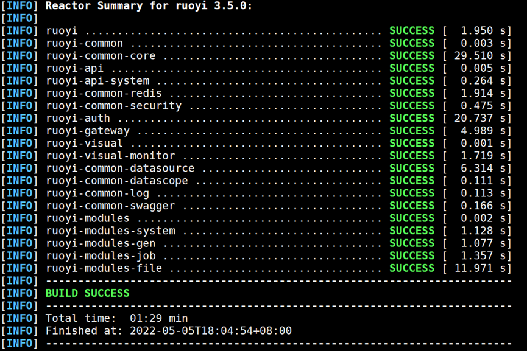


#### （3）使用npm打包ruoyi-ui前端项目

```shell
进入ruoyi-ui目录下：
[root@master ~]# cd RuoYi-Cloud/ruoyi-ui/
安装项目需要的包：
[root@master ruoyi-ui]# npm install --registry=https://registry.npmmirror.com
使用如下命令打包前端项目：
[root@master ruoyi-ui]# npm run build:prod
...
DONE Build complete. The dist directory is ready to be deployed.
INFO Check out deployment instructions at https://cli.vuejs.org/guide/deployment.html
显示如上信息，表示打包成功
如下生成了dist目录
```

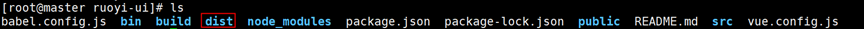


### 5.项目镜像制作

修改docker/nacos/conf/application.properties配置文件中mysql数据库地址及密码，然后修改docker/nginx/conf/nginx.conf配置文件中代理服务器地址为master节点地址。然后将提供的images.tar镜像包导入master节点并在docker目录下编写shell脚本文件，使用各目录下的Dokcerfile文件制作镜像并上传至Harbor镜像仓库ruoyi项目下。


#### （1）修改nacos配置：

 ```shell
 [root@master docker]# vim nacos/conf/application.properties
 如下图将数据库连接地址修改为master节点地址
 ```

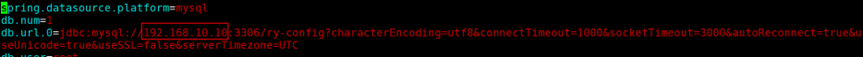

#### 2）修改nginx配置：

```shell
[root@master docker]# cd nginx/conf/
[root@master conf]# pwd
/root/RuoYi-Cloud/docker/nginx/conf
[root@master conf]# vim nginx.conf
#在第28行将代理地址修改为master节点地址
28                         proxy_pass http://192.168.10.10:8080/;  
```

#### (3)编写脚本制作docker镜像：

```shell
[root@master docker]# bash copy.sh
[root@master docker]# docker load -i images.tar
[root@master docker]# vim build_img.sh
#!/bin/bash
#如果存在删除镜像
docker rmi -f 192.168.10.10/ruoyi/redis:latest
docker rmi -f 192.168.10.10/ruoyi/nacos/nacos-server:latest
docker rmi -f 192.168.10.10/ruoyi/nginx:latest
docker rmi -f 192.168.10.10/ruoyi/ruoyi-auth:latest
docker rmi -f 192.168.10.10/ruoyi/ruoyi-gateway:latest
docker rmi -f 192.168.10.10/ruoyi/ruoyi-modules-gen:latest
docker rmi -f 192.168.10.10/ruoyi/ruoyi-modules-file:latest
docker rmi -f 192.168.10.10/ruoyi/ruoyi-modules-job:latest
docker rmi -f 192.168.10.10/ruoyi/ruoyi-modules-system:latest
docker rmi -f 192.168.10.10/ruoyi/ruoyi-visual-monitor:latest
#制作镜像
docker build -t 192.168.10.10/ruoyi/redis:latest ./redis
docker build -t 192.168.10.10/ruoyi/nacos/nacos-server:latest ./nacos
docker build -t 192.168.10.10/ruoyi/nginx:latest ./nginx
docker build -t 192.168.10.10/ruoyi/ruoyi-auth:latest ./ruoyi/auth
docker build -t 192.168.10.10/ruoyi/ruoyi-gateway:latest ./ruoyi/gateway
docker build -t 192.168.10.10/ruoyi/ruoyi-modules-gen:latest ./ruoyi/modules/gen
docker build -t 192.168.10.10/ruoyi/ruoyi-modules-file:latest ./ruoyi/modules/file
docker build -t 192.168.10.10/ruoyi/ruoyi-modules-job:latest ./ruoyi/modules/job
docker build -t 192.168.10.10/ruoyi/ruoyi-modules-system:latest ./ruoyi/modules/system
docker build -t 192.168.10.10/ruoyi/ruoyi-visual-monitor:latest ./ruoyi/visual/monitor
docker push 192.168.10.10/ruoyi/redis:latest 
docker push 192.168.10.10/ruoyi/nacos/nacos-server:latest
docker push 192.168.10.10/ruoyi/nginx:latest
docker push 192.168.10.10/ruoyi/ruoyi-auth:latest
docker push 192.168.10.10/ruoyi/ruoyi-gateway:latest
docker push 192.168.10.10/ruoyi/ruoyi-modules-gen:latest
docker push 192.168.10.10/ruoyi/ruoyi-modules-file:latest 
docker push 192.168.10.10/ruoyi/ruoyi-modules-job:latest
docker push 192.168.10.10/ruoyi/ruoyi-modules-system:latest
docker push 192.168.10.10/ruoyi/ruoyi-visual-monitor:latest
[root@master docker]# bash build_img.sh
```


 

## 任务四： 项目部署（7 分）


### 1. 基础服务部署

创建一个命名空间ruoyi，后续的项目资源都部署在该命名空间下，编写一个ruoyi-base.yaml文件，通过该文件创建redis和nacos注册中心的deployment资源，其中两个服务的pod资源都固定创建在master节点并且使用主机网络，完成后在浏览器通过master节点ip:8848/nacos访问nacos注册中心页面,用户名密码均为nacos。


#### （1）脚本部署

```shell
# vim ruoyi-base.yaml
apiVersion: v1
kind: Namespace
metadata:
  name: ruoyi
---
# redis deployment配置
apiVersion: apps/v1
kind: Deployment
metadata:
  name: ruoyi-redis-deploy
  namespace: ruoyi
spec:
  selector:
    matchLabels:
      run: ruoyi-redis
  template:
    metadata:
      name: ruoyi-redis
      namespace: ruoyi
      labels:
        run: ruoyi-redis
    spec:
      nodeName: master
      hostNetwork: true
      containers:
      - image: 192.168.10.10/ruoyi/redis:latest
        imagePullPolicy: IfNotPresent
        name: ruoyi-redis
        command: ['redis-server',
        '/home/ruoyi/redis/redis.conf'
        ]
---
# nacos deployment配置
apiVersion: apps/v1
kind: Deployment
metadata:
  name: ruoyi-nacos-deploy
  namespace: ruoyi
spec:
  selector:
    matchLabels:
      run: ruoyi-nacos
  template:
    metadata:
      labels:
        run: ruoyi-nacos
      name: ruoyi-nacos
      namespace: ruoyi
    spec:
      nodeName: master
      hostNetwork: true
      containers:
      - image: 192.168.10.10/ruoyi/nacos/nacos-server:latest
        imagePullPolicy: IfNotPresent
        name: ruoyi-nacos
        env:
        - name: MODE
          value: standalone
          
```

#### （2）创建基础服务资源

```shell
使用yaml文件创建所有基础服务资源：
[root@master docker]# kubectl apply -f ruoyi-base.yaml
查看所有创建的资源信息：
[root@master docker]# kubectl get pod -n ruoyi 
NAME                                      READY   STATUS    RESTARTS   AGE
pod/ruoyi-nacos-deploy-84d9d94ccc-bmhms   1/1     Running   0          77s
pod/ruoyi-redis-deploy-77bf864db7-92tmj   1/1     Running   0          77s
```


#### （3）基础服务访问测试

在浏览器输入192.168.10.10:8848/nacos


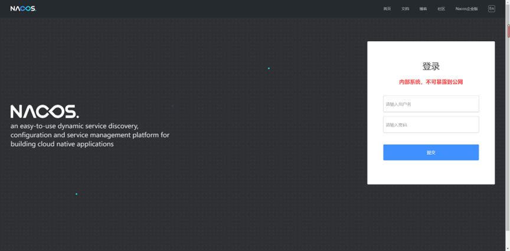


 


### 2. 服务模块部署

登录nacos页面，将各个服务模块配置文件的redis地址、nacos地址及mysql地址进行修改，然后编写ruoyi-service.yaml文件，基于项目各模块镜像创建deployment资源，其中gateway模块固定创建在master节点并且使用主机网络，通过该yaml文件创建资源。


####  （1）在nacos页面修改相关配置  点击下图编辑，修改gateway配置：

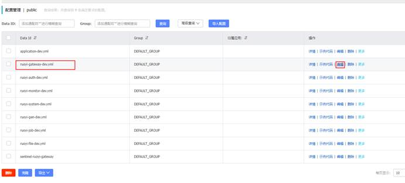  


修改下图中redis的host地址为master节点地址并点击发布  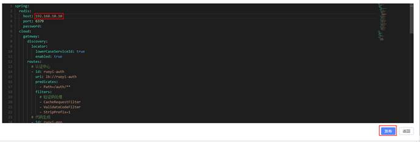  


点击下图确认发布，成功修改配置 

 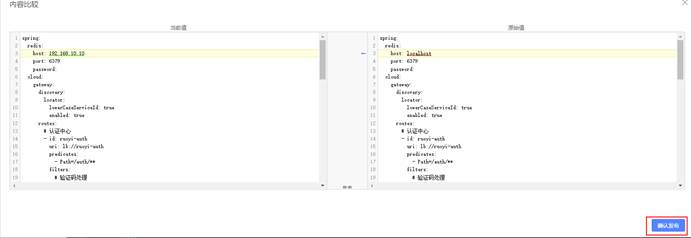  


点击下图编辑，修改auth配置： 

  

 

修改下图中redis的host地址为master节点地址并点击发布  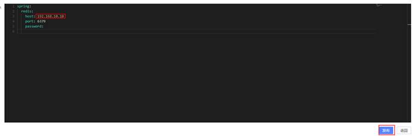  


点击下图确认发布，成功修改配置 

 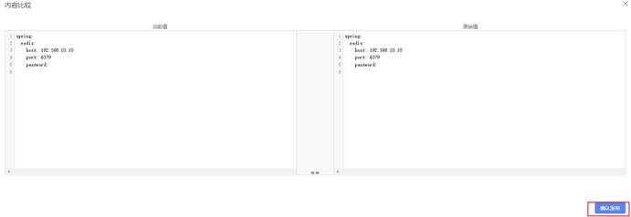     


点击下图编辑，修改system配置：

  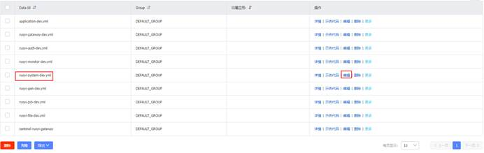  


修改下图中redis的host地址、mysql数据库连接地址以及nacos服务地址为master节点地址并点击发布  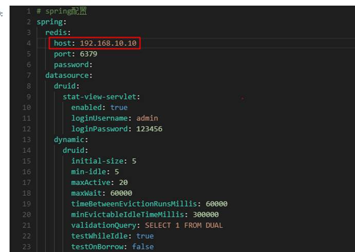  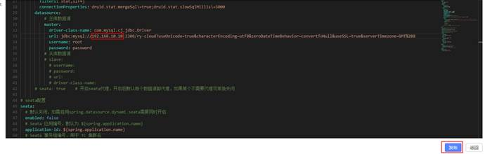   

 

点击下图确认发布，成功修改配置 

 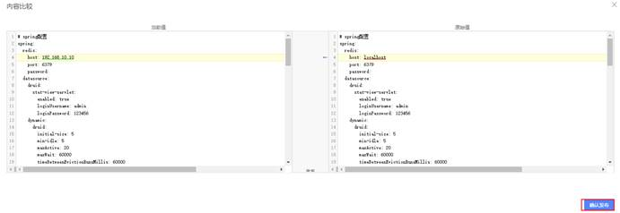 

 

点击下图编辑，修改gen模块配置：

  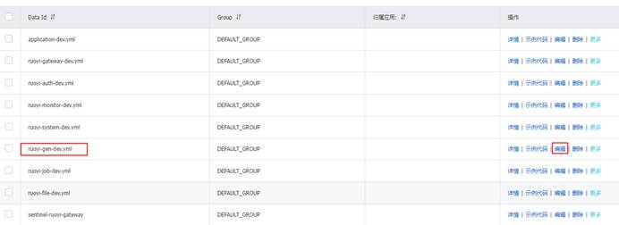  


修改下图中redis的host地址及mysql数据库连接地址为master节点地址并点击发布  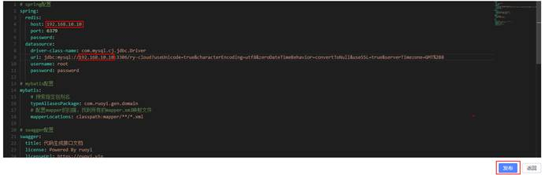  


点击下图确认发布，成功修改配置  

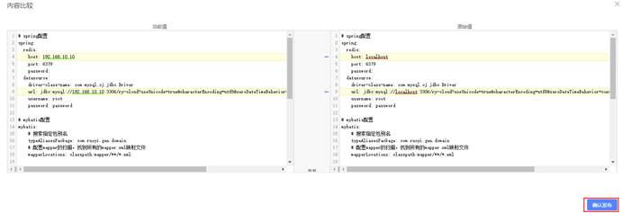 


 点击下图编辑，修改job模块配置： 

 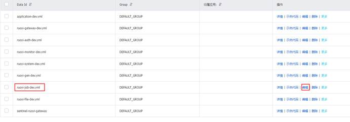 


 修改下图中redis的host地址及mysql数据库连接地址为master节点地址并点击发布  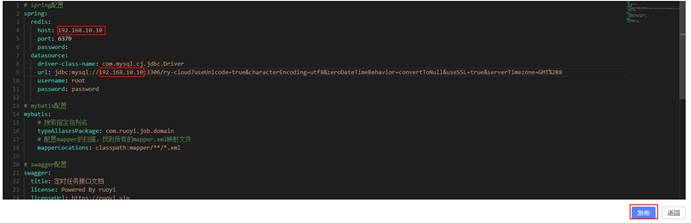  


点击下图确认发布，成功修改配置 

   


编写系统其它服务组件yaml文件  

```yaml
[root@master docker]# vim ruoyi-service.yaml
apiVersion: apps/v1
kind: Deployment
metadata:
  name: ruoyi-gateway-deploy
  namespace: ruoyi
spec:
  selector:
    matchLabels:
      run: ruoyi-gateway
  template:
    metadata:
      labels:
        run: ruoyi-gateway
      name: ruoyi-gateway
      namespace: ruoyi
    spec:
      nodeName: master
      containers:
      - image: 192.168.10.10/ruoyi/ruoyi-gateway:latest
        imagePullPolicy: Always
        name: ruoyi-gateway
        ports:
        
        
        
        - containerPort: 8080
          hostPort: 8080
---
apiVersion: apps/v1
kind: Deployment
metadata:
  name: ruoyi-nginx-deploy
  namespace: ruoyi
spec:
  selector:
    matchLabels:
      run: ruoyi-nginx
  template:
    metadata:
      labels:
        run: ruoyi-nginx
      name: ruoyi-nginx
      namespace: ruoyi
    spec:
      containers:
      - image: 192.168.10.10/ruoyi/nginx:latest
        imagePullPolicy: Always
        name: ruoyi-nginx
        ports:
        - containerPort: 80
---
apiVersion: apps/v1
kind: Deployment
metadata:
  name: ruoyi-auth-deploy
  namespace: ruoyi
spec:
  selector:
    matchLabels:
      run: ruoyi-auth
  template:
    metadata:
      labels:
        run: ruoyi-auth
      name: ruoyi-auth
      namespace: ruoyi
    spec:
      containers:
      - image: 192.168.10.10/ruoyi/ruoyi-auth:latest
        imagePullPolicy: Always
        name: ruoyi-auth
        ports:
        - containerPort: 9200
---
apiVersion: apps/v1
kind: Deployment
metadata:
  name: ruoyi-system-deploy
  namespace: ruoyi
spec:
  selector:
    matchLabels:
      run: ruoyi-system
  template:
    metadata:
      labels:
        run: ruoyi-system
      name: ruoyi-system
      namespace: ruoyi
    spec:
      containers:
      - image: 192.168.10.10/ruoyi/ruoyi-modules-system:latest
        imagePullPolicy: Always
        name: ruoyi-system
        ports:
        - containerPort: 9201
---
apiVersion: apps/v1
kind: Deployment
metadata:
  name: ruoyi-gen-deploy
  namespace: ruoyi
spec:
  selector:
    matchLabels:
      run: ruoyi-gen
  template:
    metadata:
      labels:
        run: ruoyi-gen
      name: ruoyi-gen
      namespace: ruoyi
    spec:
      containers:
      - image: 192.168.10.10/ruoyi/ruoyi-modules-gen:latest
        imagePullPolicy: Always
        name: ruoyi-gen
        ports:
        - containerPort: 9202
---
apiVersion: apps/v1
kind: Deployment
metadata:
  name: ruoyi-job-deploy
  namespace: ruoyi
spec:
  selector:
    matchLabels:
      run: ruoyi-job
  template:
    metadata:
      labels:
        run: ruoyi-job
      name: ruoyi-job
      namespace: ruoyi
    spec:
      containers:
      - image: 192.168.10.10/ruoyi/ruoyi-modules-job:latest
        imagePullPolicy: Always
        name: ruoyi-job
        ports:
        - containerPort: 9203
---
apiVersion: apps/v1
kind: Deployment
metadata:
  name: ruoyi-file-deploy
  namespace: ruoyi
spec:
  selector:
    matchLabels:
      run: ruoyi-file
  template:
    metadata:
      labels:
        run: ruoyi-file
      name: ruoyi-file
      namespace: ruoyi
    spec:
      containers:
      - image: 192.168.10.10/ruoyi/ruoyi-modules-file:latest
        imagePullPolicy: Always
        name: ruoyi-file
        ports:
        - containerPort: 9300
---
apiVersion: apps/v1
kind: Deployment
metadata:
  name: ruoyi-monitor-deploy
  namespace: ruoyi
spec:
  selector:
    matchLabels:
      run: ruoyi-monitor
  template:
    metadata:
      labels:
        run: ruoyi-monitor
      name: ruoyi-monitor
      namespace: ruoyi
    spec:
      containers:
      - image: 192.168.10.10/ruoyi/ruoyi-visual-monitor:latest
        imagePullPolicy: Always
        name: ruoyi-monitor
        ports:
        - containerPort: 9100

（3）基于yaml文件创建其它服务
[root@master docker]# kubectl apply -f ruoyi-service.yaml
查看pods状态：
[root@master docker]# kubectl get pods -n ruoyi
NAME                                    READY   STATUS    RESTARTS   AGE
ruoyi-auth-deploy-656f596cc8-s9vl4      1/1     Running   0          13m
ruoyi-file-deploy-64fdbf9d47-8vmxb      1/1     Running   0          13m
ruoyi-gateway-deploy-76fff9c697-pr88s   1/1     Running   0          13m
ruoyi-gen-deploy-5c864cc5d4-n6jkp       1/1     Running   0          13m
ruoyi-job-deploy-5d4cffb68c-hlbgs       1/1     Running   0          13m
ruoyi-monitor-deploy-5c68964954-gzhlp   1/1     Running   0          13m
ruoyi-nacos-deploy-84d9d94ccc-qxzvn     1/1     Running   0          58m
ruoyi-nginx-deploy-6f89c64d7-mnhpw      1/1     Running   0          13m
ruoyi-redis-deploy-77bf864db7-85vkf     1/1     Running   0          58m
ruoyi-system-deploy-77cb7d6585-vpnjd    1/1     Running   0          13m
显示如上信息，所有pod都启动成功

```


### 3. 访问Service配置

编写ruoyi-svc.yaml，为nginx服务创建service，service类型为NodePort。创建成功后，在浏览器使用NodePort端口访问系统。

  ```shell
  #（1）编写service配置yaml
  [root@master docker]# vim ruoyi-svc.yaml
  apiVersion: v1
  kind: Service
  metadata:
    name: ruoyi-nginx
    namespace: ruoyi
  spec:
    type: NodePort
    selector:
      run: ruoyi-nginx
    ports:
    - name: http
      targetPort: 80
      port: 80
  #（2）创建service
  [root@master docker]# kubectl apply -f ruoyi-svc.yaml
  查看创建内容
  [root@master docker]# kubectl get svc -n ruoyi 
  NAME          TYPE        CLUSTER-IP      EXTERNAL-IP   PORT(S)   AGE
  ruoyi-nginx   ClusterIP   10.100.175.51   <none>        80/TCP    5m56s
  ```

 