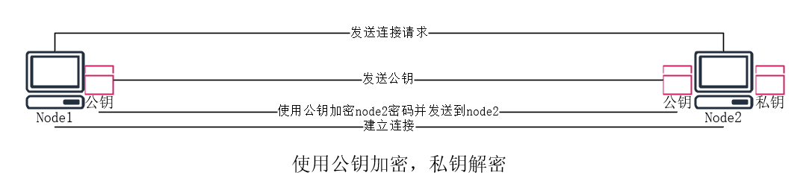

[toc]


# 网络客户端


## curl

curl 支持文件上传和下载
curl -i 网址 可以获得网址的报头信息


## wget


## Telnet

明文传输数据包，安全性低


## OpenSSH


安全的套接字，用来管理远程Linux服务器，使用ssh协议进行远程管理

标准端口号是22号端口

为了安全起见，需要改为非标准端口


### 软件架构：

是一个C/S架构的软件

需要服务端和客户端提供

*   S：服务端，server 

*   C：客户端，client 

安装Linux系统的时候，会默认安装openssh的套件（安装服务端和客户端） 


### 使用方式：

使用ssh的前提条件是能够和目标主机实现访问，即能ping通


#### 远程连接

ssh 用户名@对方IP地址或者主机名(如果是主机名需要能够被解析) 

第一次链接会要求信任对方的主机密钥，主机密钥不是以机器为单位，而是以用户为单位 

*   如果直接ssh加上对方IP地址或者主机名，默认使用当前正在登录的用户进行连接


#### 远程执行命令

```shell
ssh 用户名@对方IP地址或者主机名 'rm -rf /tmp' 
ssh -p 指定端口
```


#### 远程调用图形化

ssh -X 用户名@对方IP地址或者主机名 

远程工具只要支持传递X11就可以调用图形化


#### 本地解析

/etc/hosts本地解析文件，可以将IP和域名进行手动绑定，但只限本机访问


#### Windows上使用ssh连接：

*   Windows 10 以上的版本：cmd、powershell、第三方ssh客户端工具
*   Windows 10 一下的版本： 第三方ssh客户端工具
*   使用Xshell可以打开图形化（cmd、powershell等不支持图形化）
*   Xshell支持图形化是因为有XManager做X11图形协议转发


### 远程传输文件

同样是基于ssh协议，客户端和服务端之间的文件传输


#### SCP远程传输文件


##### 使用方法

```shell
#本地的文件传输到远程的主机
scp 传输文件 用户名@对端IP或者主机名:对端路径

scp -r 拷贝远程目录
scp -p 保留时间戳和权限
scp -P 指定端口 

#远程的文件拷贝到本地
scp 用户名@对端IP或者主机名:对端路径 本地路径 
```


## 远程同步工具


### rsync增量备份

rsync用法：用法跟scp基本一样


#### 作用域：

本地---->本地 

本地---->远程

远程---->本地


#### 命令：

```shell
#本地使用
rsync [选项] SRC DEST 

#通过ssh访问
pull:
	rsync [选项] [user@]host:src dest 
push: 
	rsync [选项] src [user@]host:/dest 
	
#注意： 
#使用rsync需要注意，如果源路径是一个目录的话，带上尾随斜线和不带尾随斜线是不一样的，不带尾数斜线表示整个目录包括目录本身，带上尾随斜线表示的是该目录下的文件，不包含目录本身


-r 传输目录 

-t 保留时间戳 增量备份

-v 查看传输过程

-o 保留拥有人信息

-g 保留拥有组信息

-a 保留全部属性

-z 压缩文件

--delete 本地删掉的文件远程端也删掉

--existing 只更新目标端已经存在的文件

--ignore-existing 只更新目标端不存在的文件 

--remove-source-files 要求删除远端已经成功传输的文件
```


## SSH免密


### 原理

ssh加密采用了非对称加密

*   对称加密
    *   只有一把钥匙，使用该钥匙加密和解密，一旦钥匙被偷走，安全性降低
*   非对称加密
    *   两把钥匙（公钥和私钥），一把钥匙加密，一把钥匙解密
    *   在自己的端口生成公私钥，永远是公钥发给别人
    *   ssh用公钥加密，私钥解密


### 流程




### 步骤


1.  生成公私钥

```shell
[root@localhost ~]# ssh-keygen  
Generating public/private rsa key pair.
Enter file in which to save the key (/root/.ssh/id_rsa): 
Enter passphrase (empty for no passphrase):   #输入私钥密码
Enter same passphrase again: #再次确认密钥密码
Your identification has been saved in /root/.ssh/id_rsa.
Your public key has been saved in /root/.ssh/id_rsa.pub.
The key fingerprint is:
SHA256:qqvu7CeLtiu+S+dJq3PkXz/EdDTjl/uV81+OoGTHzDg root@localhost
The key's randomart image is:
+---[RSA 3072]----+
|                 |
|           +     |
|          o o .  |
|         . o o   |
|        S . . . .|
|   .   . o = . o.|
| .oo  ... E * . =|
|o==o+.. .+ + . +o|
|=@/O+o   .o   . +|
+----[SHA256]-----+
```


2.  发送公钥到对端

```shell
[root@localhost ~]# ssh-copy-id  root@192.168.1.25 
/usr/bin/ssh-copy-id: INFO: Source of key(s) to be installed: "/root/.ssh/id_rsa.pub"
The authenticity of host '192.168.1.25 (192.168.1.25)' can't be established.
ECDSA key fingerprint is SHA256:qVhWtJEGKKQun4PYXXKSUM/kpD4dY4j59ctfBpn7GEQ.
Are you sure you want to continue connecting (yes/no/[fingerprint])? yes
/usr/bin/ssh-copy-id: INFO: attempting to log in with the new key(s), to filter out any that are already installed
/usr/bin/ssh-copy-id: INFO: 1 key(s) remain to be installed -- if you are prompted now it is to install the new keys
root@192.168.1.25's password: 

Number of key(s) added: 1

Now try logging into the machine, with:   "ssh 'root@192.168.1.25'"
and check to make sure that only the key(s) you wanted were added.

##选项
-i 指定公钥
```


3.  免密登录

```shell
[root@localhost ~]# ssh root@192.168.1.25 
Activate the web console with: systemctl enable --now cockpit.socket

This system is not registered to Red Hat Insights. See https://cloud.redhat.com/
To register this system, run: insights-client --register

Last login: Sun May 22 22:31:38 2022 from 192.168.1.1
```


#### 对端公钥存放路径：

```shell
[root@localhost ~]# cd .ssh/ 
[root@localhost .ssh]# ls 
authorized_keys
[root@localhost .ssh]# cat authorized_keys  
ssh-rsa AAAAB3NzaC1yc2EAAAADAQABAAABgQDcgpystePAyOFcq0SoVNszP3K57oYbdbaMoLZp+oGZ+9ChP3n9PndQ1JlidYbGJIWQG6g8iiHceN6PZFYConz3SDOMa0SYpdmg2lsTqo72H0MiVvKTbTC0/td29LhnaNYw+Gmobnxfo13OHvWqKY2ELphWcZX1mFjBuJ0BxAkwK3stXgL4gLPdb65d7G6eh5amNrdm83oHtsvQy7enmy0rc6kYRJkonZgQ+kw/PMuPwslJbZqriZCcSFaUIyFTDDQDg4mxGyvCyIe+cyYcjvme0OMn/3BzETeo/Y8pDCRvuSRFbRxo8wxYRo97xs1Ce6L3rEtm7qkk2ahBeINJMR5lpH4fsX6z4vSMOm2X2CEBnzbTi3ugGRfRW/EtopETFx8jM4zhS5bu23jiZ1ldSmmjk8PMLY5+lIQ6ZIt4DyxwPwPj20nJAM1BibSXWMWQPffPnPG7K0MIe4u5ARhBsq2wY1/jOr5flFwVVj812032vdb6ng2ZzBV/iGVBrsEfVmk= root@localhost
```


### 私钥加密托管代理

当私钥有密码加密，并且需要免密登录的时候，需要做密钥加密托管代理


1.  生成公私钥、给私钥加密并发送公钥给客户端

```shell
[root@localhost .ssh]# ssh-keygen  
Generating public/private rsa key pair.
Enter file in which to save the key (/root/.ssh/id_rsa): 
Enter passphrase (empty for no passphrase): 
Enter same passphrase again: 
Your identification has been saved in /root/.ssh/id_rsa.
Your public key has been saved in /root/.ssh/id_rsa.pub.
The key fingerprint is:
SHA256:/UJs2jf0uGCS1CP2nfYgkL0XXySu5mMGGvDIuwyqV6E root@localhost
The key's randomart image is:
+---[RSA 3072]----+
|                 |
|                 |
|              . .|
|    . .  *   . o |
|   . o +S O o . .|
|  E . oooX.* B . |
|   ..  .+oO.& o  |
|  .. o. .o X+=   |
|.o.   o.   oo..  |
+----[SHA256]-----+

[root@localhost .ssh]# ssh-copy-id  root@192.168.1.25 
/usr/bin/ssh-copy-id: INFO: Source of key(s) to be installed: "/root/.ssh/id_rsa.pub"
The authenticity of host '192.168.1.25 (192.168.1.25)' can't be established.
ECDSA key fingerprint is SHA256:qVhWtJEGKKQun4PYXXKSUM/kpD4dY4j59ctfBpn7GEQ.
Are you sure you want to continue connecting (yes/no/[fingerprint])? yes
/usr/bin/ssh-copy-id: INFO: attempting to log in with the new key(s), to filter out any that are already installed
/usr/bin/ssh-copy-id: INFO: 1 key(s) remain to be installed -- if you are prompted now it is to install the new keys
root@192.168.1.25's password: 

Number of key(s) added: 1

Now try logging into the machine, with:   "ssh 'root@192.168.1.25'"
and check to make sure that only the key(s) you wanted were added.

[root@localhost .ssh]# 
```


2.  直接使用登录的私钥进行ssh需要验证私钥密码

```shell
[root@localhost .ssh]# ssh root@192.168.1.25 
Enter passphrase for key '/root/.ssh/id_rsa': 
Activate the web console with: systemctl enable --now cockpit.socket

This system is not registered to Red Hat Insights. See https://cloud.redhat.com/
To register this system, run: insights-client --register

Last login: Sun May 22 22:32:38 2022 from 192.168.1.26
```


3.  开启认证代理并将私钥密码添加到认证代理

```shell
[root@localhost .ssh]# ssh-agent  bash 
[root@localhost .ssh]# ssh-add  
Enter passphrase for /root/.ssh/id_rsa: 
Identity added: /root/.ssh/id_rsa (root@localhost)
```


### SSH服务配置文件常用配置

*   配置文件保存在/etc/ssh/sshd_config中

```shell
port 22                    	#默认的sshd服务端口
ListenAddress 0.0.0.0		#设置sshd服务器监听地址
PermitRootLogin yes 		#是否允许root管理员登录
MaxAuthTries 6 				#最大密码尝试次数
MaxSessions 10 				#最大连接会话数
PasswordAuthentication yes 	#是否允许密码验证
PermitEmptyPasswords no 	#是否允许空密码登录
```


