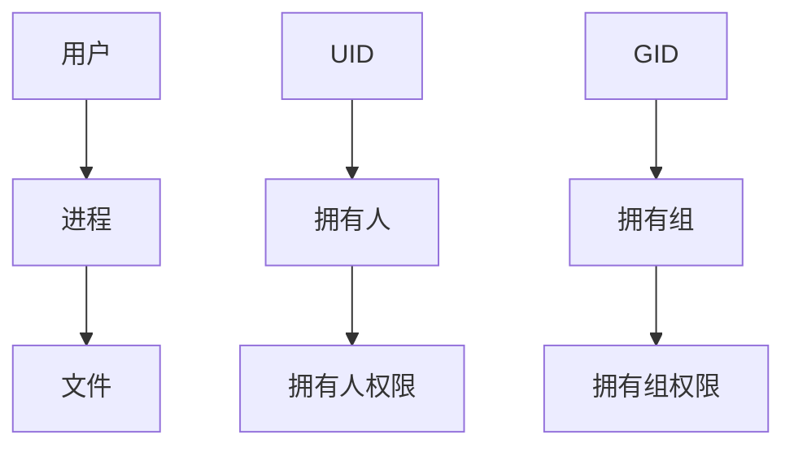

[toc]


# 文件系统组成和基本操作：


## 权限管理：


### 匹配访问的身份：

访问文件有三种访问身份：user，group，other

实际上访问文件是通过进程来访问文件，通过进程来辨别文件的权限是属于拥有人还是用有组还是其他人


### 如何查看文件的权限

ls -l 查看文件的权限

ls -ld 查看目录的权限

```shell
 -rw-------. 1 root  root 1794 Dec 13 2020 anaconda-ks.cfg  
```

#### 第一个字符串：

-表示普通文件 

d：目录

c：字符设备 鼠标键盘等设备

l：链接文件

b：块设备  block 存数据的设备成为块设备

#### 第二个字符串

rw-------. 权限

- 例：rwxrw-rw-  第一个rwx为拥有人的权限，第二个rw-为拥有组的权限，第三个rw-为其他人的权限

#### 第三个字符串

1：链接数 ：

​	针对文件而言指的是文件最多可以被删几次

​	目录而言目录里面有多少子目录

#### 第四个字符串

root：拥有人

#### 第五个字符串

root：拥有组

#### 第六个字符串

1794：文件大小单位默认字节

#### 第七个字符串

Dec 13 2020 文件最后一次修改的时间 M time

#### 第八个字符串

anaconda-ks.cfg文件名


### 文件的权限：


| 权限分配 |      | 拥有人 |      |      | 拥有组 |      |      | 其他人 |      |
| -------- | ---: | :----: | ---- | ---: | :----: | :--- | ---: | :----: | ---- |
| 字符表示 |    r |   w    | x    |    r |   w    | x    |    r |   w    | x    |
| 权限项   |   读 |   写   | 执行 |   读 |   写   | 执行 |   读 |   写   | 执行 |
| 数字表示 |    4 |   2    | 1    |    4 |   2    | 1    |    4 |   2    | 1    |


### 文件匹配优先级：

一个用户访问文件的时候，匹配哪个权限：

1. 当前用户为文件的拥有人，则匹配拥有人的权限 
2. 当前用户不是文件的拥有人，则查看该用户所在的组是否匹配文件的拥有组，如果是，则匹配拥有组的权限
3. 当前用户既不是文件的拥有人，也不是文件的拥有组，则匹配文件的其他人权限 


### 文件权限和目录权限的影响：

| 权限      | 对文件的影响         | 对目录的影响                                |
| --------- | -------------------- | ------------------------------------------- |
| r（读）   | 可以读取文件的内容   | 可以列出目录的内容                          |
| w（写）   | 可以更改文件的内容   | 可以创建或删除目录中的任意文件              |
| x（执行） | 可以作为命令执行文件 | 可以进入目录（还需要r权限才可以读目录内容） |


### 命令的本质：

能够执行命令的本质其实是执行一个文件，每个命令都是以一个文件的形式去存放在目录中 

which 查看命令所在的文件 

查看文件状态的两个命令：  ls -l 、stat 

执行文件的脚本时要使用绝对路径，不能使用相对路径，或者使用./来指定脚本路径 


### CP是否能够复制一个文件，需要什么样的权限（最小权限）

cp 源文件 目标文件 

对源文件本身的权限 需要r权限 

对源文件所在目录所在的权限 需要x权限

删除文件跟文件本身没有关系，跟所在的目录的权限有关


### 修改文件拥有人和拥有组基础命令：

```shell
chmod -R o+rw               /data/ 修改目录及其目录下所有文件的权限

chown user1                 /data 把/data的拥有人修改为user1 

chown -R user1 /data        把/data以及/data下的所有文件的拥有人修改为user1 

chown user1:user1 /data    把/data 下的拥有人以及拥有组修改为user1 

chgrp admin /data           只把/data 的拥有组修改为admin
```


### 修改文件的权限：


#### 权限类型：

| 权限分配 |      | 拥有人 |      |      | 拥有组 |      |      | 其他人 |      |
| -------- | ---: | :----: | ---- | ---: | :----: | :--- | ---: | :----: | ---- |
| 字符表示 |    r |   w    | x    |    r |   w    | x    |    r |   w    | x    |
| 权限项   |   读 |   写   | 执行 |   读 |   写   | 执行 |   读 |   写   | 执行 |
| 数字表示 |    4 |   2    | 1    |    4 |   2    | 1    |    4 |   2    | 1    |

#### 权限身份：

- u：拥有人
- g：拥有组
- o：其他人
- a：代表全部 

#### 权限执行动作：

- +：增加权限
- -：减少权限
- =：重新赋予权限 


### 打开的文件权限匹配的本质

用户在打开文件的时候 会开启一个进程，用户的UID会匹配进程的UID 用户的GID匹配进程的GID，文件的权限匹配的UID不是来自用户的UID，而是匹配进程的UID



当自己手动创建一个组时在删除用户的时候该组不会被自动删除，但是如果时创建用户的时候自动创建出来的，在删除用户的时候会自动把组删除


## 标准IO和管道：


### IO：input and output

输入和输出

stdout:标准输出：默认输出，就是输出到屏幕上的内容 

stdin:标准输入：输入设备：默认一般就是键盘和鼠标

stderr:错误输出


0代表输入

1代表正确的输出

2代表错误的输出


### 重定向：

#### 输出重定向：

\>正确输出重定向，如果文件不存在，则会自动创建，如果文件存在，则会覆盖文件之前的内容 

\>> 追加输出重定向，如果文件不存在，则会自动创建，如果文件存在，则会在文件末尾追加 

2>错误输出重定向

&>全部输出重定向

2>&1 把错误的输出作为正确的输出

例：

```shell
find /etc -name passwd 查找/etc 下名字叫passwd的文件

find /etc/ -name passwd > find.out 2> find.err 正确的输出到find.out，错误的输出到find.err 可以连用
例：find /etc/ -name passwd > find.out 2>&1 把正确的输出到find.out并且把错误的的当作正确的输出到find.out
一般用root用户和普通用户进行测试 
```

#### 输入重定向：


< 输入重定向

<<多行输入


##### cat 多行重定向输入

```shell
[root@dcncloud yum.repos.d]# cat > /etc/yum.repos.d/local.repo << EOF  
> [local]
> name=local
> enabled=1 
> baseurl=file:///CentOS
> gpgcheck=0 
> EOF

把cat输入的内容重定向到1.txt里面 EOF是结束位 
<< EOF指定结束的位置
>> 输出
将输入内容打印出来并重定向到1.txt中 然后用<<EOF输入
```


##### 标准输入的三种方法：

1. 来自键盘 
2. 来自文件 
3. 来自管道

 

#### 扩充

##### 完全清空历史记录有两步：

1. history -c 

2. echo  > .bash_history

   

/dev/null 特殊的文件 可以作为接收任何输出的设备，并且不会保存，可以作为垃圾回收站使用

echo $? 用来查看上一条命令是不是执行成功 如果为0 则成功

tee 用来将标准输入的内容输出到标准输出并可以保存为文件


### 管道


- ”|“ 管道符

- 通过管道的都是正确的结果
- 重定向后的内容 不会经过管道 
- 命令1 | 命令2 | 命令3    把命令1 处理的结果交给命令2 作为命令2的输入信息 然后以此传递


#### tr 转换

从标准输入中替换、缩减和/或删除字符，并将结果写到标准输出

tr 'a-z' 'A-Z'

cat aaa.txt|tr 'a' 'c'  字母c替换字母a

tr a c < test   将test文件中的a变成c 

默认输入是键盘，<文件名 可以默认输入改为文件内容，输入可以来自文件， 也可以来自管道 


例：

```shell
echo y | rm -i 1.txt 
#把y这个结果写进rm -i里面

echo 111 |passwd --stdin user1 
#设置密码

df -h |tee df.out| grep /dev/mapper/rhel-root|tee df.err| awk '{print $5}' 
#将命令1的结果保存到df.out里面 并且当作命令2的输入 以此类推  三通管道 
```


## vim文本编辑器：


gvim：图形化的vim

vi ：vim的缩减版

由vim-enhanced软件包提供


### 用vim打开一个文件

运行vim： 

- vim filename 
  - 如果文件存在，则显示被打开文件的内容
  - 如果文件不存在，则在第一次编辑完成保存退出的时候创建此文件
- vim
  - 直接打开vim程序
  - 需要另存为


### 三种工作模式：

1. 命令模式 
2. 插入模式
3. 退出模式


#### 插入模式

| 操作键 | 功能                           |
| ------ | ------------------------------ |
| i      | 在光标左边插入文本             |
| a      | 在光标右边插入文本             |
| o      | 在光标所在行的下一行插入文本   |
| I      | 在行首插入文本                 |
| A      | 在一行的结尾添加文本           |
| O      | 在光标的所在行的上一行插入新行 |


#### 命令模式

| 操作键               | 功能                                                        |
| -------------------- | ----------------------------------------------------------- |
| ↑↓→←                 | 上下左右                                                    |
| page Down或Ctrl+F    | 向下翻动一整页内容                                          |
| Page UP 或Ctrl+B     | 向上翻动一整页内容                                          |
| Home键或"^"、数字"0" | 跳转至行首                                                  |
| End键或”$“键         | 跳转至行尾                                                  |
| 1G或者gg             | 跳转到文件的首行                                            |
| G                    | 跳转到文件的末尾行                                          |
| #G                   | 跳转到文件的第#行                                           |
| :set nu              | 在编辑器中显示行号                                          |
| :set nonu            | 取消编辑器中的行号显示                                      |
| x或del               | 删除光标处的单个字符                                        |
| dd                   | 剪切当前光标所在行                                          |
| Ndd                  | 剪切前光标所在行以及下面N-1行                               |
| cc                   | 替换改行，并进入插入模式                                    |
| d^                   | 删除当前光标之前到行首的所有字符                            |
| d$                   | 删除当前光标处到行尾的所有字符                              |
| dw                   | 删除当前光标处到词尾的所有字符                              |
| Nyy                  | 复制当前N行整行内容到剪切板                                 |
| :start,end copy dest | 将start到end行的内容复制到dest行以下                        |
| :start,end m dest    | 将start到end行的内容移动到dest行以下                        |
| p                    | 将缓冲区的内容粘贴到光标位置处之后                          |
| P（大写）            | 粘贴到光标位置处之前                                        |
| /word                | 从上而下在文件中找字符串"word"                              |
| ?word                | 从下而上在文件中找字符串"word"                              |
| n                    | 定位下一个匹配的被查找字符串                                |
| N                    | 定位上一个匹配的被查找字符串                                |
| u                    | 按一次取消最近的一次操作多次重复按u键，恢复已进行的多步操作 |
| U                    | 撤销光标所在行的更改                                        |
| Ctrl-r               | 取消最后一次”撤销“                                          |
| .                    | 重复操作                                                    |


#### 退出模式

| 命令             | 功能                                                       |
| ---------------- | ---------------------------------------------------------- |
| :w               | 保存当前文件                                               |
| :w /root/newfile | 另存为其他文件                                             |
| :m,n  w 文件名   | 把m到n行内容另存到指定文件中                               |
| :q               | 未修改退出                                                 |
| :q!              | 放弃对文章内容的修改，并退出                               |
| :wq              | 保存文件并退出                                             |
| :wq!             | 强制保存文件并退出                                         |
| :s /old/new      | 将当前行中查找到的第一个字符串”old“替换为”new“             |
| :s /old/new/g    | 将当前行中查找到的所有的字符串”old“替换为”new“             |
| :m,n s/old/new/g | 在行号”m,n“范围内替换所有的字符串"old"为”new“              |
| :% s/old/new/gi  | 在整个文件范围内替换所有的字符串"old"为"new"，并忽略大小写 |
| :s/old/new/c     | 在替换命令末尾加入c命令，将对每个替换动作提示用户进行确认  |


##### 多行注释方法：

1. ctrl+v

2. 把注释的开头全部标记

3. 输入大写的I

4. 输入注释符

5. esc 

 

### 文本处理工具：


```shell
1：cat 查看文件内容

-n ：显示行号

  cat /etc/passwd /etc/prou 可以接两个文件

 

2：more 分页工具（一次性从头查看然后结束）

  回车键：向下移动 

  翻页：空格键

 

3：less（分页查看，多次查看）

  /关键词 搜索关键词

  g/G :查看第一页和最后一页

  man帮助的分页工具用的就是less分页工具

  v：进入vi编辑模式

  less passwd 可以对文件进行编辑

  cat passwd | less 不能对文件进行编辑

 （more/less可以直接加文件）

 

4：head （显示前n行，默认查看十行）

  -n 5 从头开始数五行 指定查看行数

  heat -n -6 passwd 除去末尾六行，看前面内容

  cat -n passwd | heat 显示前十行并显示行号，默认前十行

 

5：tail从末尾开始看  

  -n 6 查看末尾六行

  -n +6 从文件的第六行开始看，一直到末尾

 

6：grep 过滤文本内容（默认模糊查询）

  grep -w 精准查找

  grep -i 忽略大小写

  grep -n 显示匹配行的行号

  grep -v root 除了root以外的内容打印输出

  grep -c 匹配行数 例：cat /tmp/passwd | grep -c root 的结果是2 那么一共有两行匹配结果

  grep -q 静默输出  可以与echo $? 连接在一起使用来查看命令是否执行成功

  grep -A5 除了显示匹配的选项以外还显示以下五行 atfer（下）

  grep -B5 除了显示匹配的选项以外还显示以上五行 before（前）

  grep -o 只显示匹配的内容

  grep -C5 除了显示匹配的选项以外还显示以上以下各五行

  grep -r 根据字符串查找 可以快速定位字符串的位置（模糊搜索）

  grep -l 根据字符串查找 查找文件的文件名，只打印文件名

统计词频常用公式： cat /etc/profile |cut -d' ' -f1 |sort |uniq -c 

显示特定的行数：cat -n passwd | head -n -10 |tail -n+10 查看从第十行到第20行
```


 ## 排错思路


当系统出现异常的时候可以查看日志

系统日志：实时记录

tail -f passwd 实时监控文件

systemcal restart  httpd 重启httpd服务

systemctl enable --now httpd 开启httpd服务

日志路径：/var/log/

tail -f * 可以接收所有的日志 来查看具体的日志内容所在的文件名

日志:实时记录

提前日志（数据保护）


 