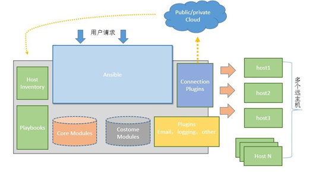

Ansible自动化

前置内容：

1.   为什么需要自动化 ？？？？ 

当人不想重复的时候 ——> 需要考虑自动化

帮助企业高效运行业务，节省人力成本 

devops（开发运维）的语言 

2.   自动化的优势 ？？？ 

IT行业来分析: 配置的下发和应用的部署，以及滚动更新

滚动更新:在零停机场景下实现业务系统的更新，操作系统软件的更新；升级、打补丁、修bug 

​     案例：  10台服务器 需要升级nginx；

人工的方式： 先升级一台，我再升级其他的节点或者每一次升级两台

​                  自动化方式： 天生支持滚动更新（按批执行）

3.   Ansible学习路线

ansible 自动化    引擎  ——> RH294 RHCE 

ansible 高级自动化  平台  ——> DO447 RHCA

ansible 开发自动化   开发  ——> DO374 ? 

ansible 网络自动化  rs 

ansible windows自动化

ansible 混合云自动化  

## Ansible 介绍与部署

1.   什么是ansible

 ansible是一个自动化的工具，因此ansible没有任何的服务需要管理；可以批量部署或者批量下发配置，来实现企业级的自动化

 通过案例来了解ansible

​     企业网站的自建案例： 一个传统公司从零开始部署一个企业官网

a.   基础的硬件设施（域名、机房、宽带、空调、机柜、服务器、网络设备…）

b.   服务器安装操作系统（ansible不能安装操作系统）

c.   调试服务器（配置防火墙、配置网络、用户设置…）

d.   安装web应用（LNMP Nginx Mariadb PHP）

e.   调试web的应用（设置nginx并发数量、php文件最大下载大小…）

f.    安装中间件（lvs、redis）

g.   调试中间件 （配置lvs）

h.   发布源码

i.    访问测试到官网

 

2.   ansible优势与特点

为什么选择ansible，而不选择其他的自动化工具？？？ 

ansible 上管天（云） 下管地（基础设施）中间还可以管windows

a.   几乎可以实现所有基础设施自动化（网络设备、服务器、存储、公私有云）

b.   是一个无代理架构

有代理架构： 指的是在被管理节点上需要安装客户端软件（agent也就是代理）  客户端本身有缺陷，如果集群的数量过多，则安装客户端很麻烦；还需要为不同的管理对象开发不同的agent

无代理架构：通过应用（ansible管理的对象将其统称为应用）自身的能力来管理应用本身（ansible从来不开发agent，也不需要开发agent）

​         管理网络设备： 通过snmp（简单的网络管理协议）协议来管理

​         管理windows： 通过windows的powershell进行管理 winrm

​         管理Linux：  通过ssh来管理Linux

​         管理公私云：  通过云平台的API接口

​     c．是人工可读的自动化

​             使用yaml作为配置语言，yaml的使用者无需掌握特殊的编码技能，就可以快速掌握

\- name: create user

 user:

​    name： zhangsan

​    state： present 

特点：

l   Agentless：不需要在被管理节点上安装客户端，只要有sshd即可

l Serverless：在服务端不需要启动任何服务，只需要执行命令就行

l Modules in any language：基于模块工作，可以使用任意语言开发ansible模块

ansible是通过python进行开发的，但是ansible的模块可以使用任意语言开发，甚至是shell也支持

l   YAML, not code：使用yaml语言定制playbook（剧本）

l SSH by default：默认使用ssh控制各节点

l Strong multi-tier solution：可实现多级控制

 

3.   ansible架构

ansible执行任务的方式：

ad-hoc临时命令 ——> 用来执行简单的任务

playbook 剧本  ——> 用来执行复杂的任务

l 核心：ansible 主程序

l 核心模块（Core Modules）：这些都是ansible自带的模块

l 扩展模块（Custom Modules）：如果核心模块不足以完成某种功能，可以添加扩展模块

l 插件（Plugins）：完成模块功能的补充

l 剧本（Playbooks）：把需要完成的多个任务定义在剧本中

l 连接插件（Connectior Plugins）：ansible基于连接插件连接到各个主机上，虽然ansible是使用ssh连接到各个主机的，但是它还支持其他的连接方法，所以需要有连接插件

l 主机清单（Host Inventory）：ansible在管理多台主机时，可以选择只对其中的一部分执行某些操作

 

4.   ansible工作原理

a.   用户下发请求给到ansible的主程序，ansible收到用户请求后

b.   根据用户请求在清单中找到被管理的主机，使用链接插件管理到被控

c.   连接到被控后根据用户请求的任务或者是playbook中定义的任务找到相应的模块

d.   将模块推送到被控端执行，然后在被控端删除推送的模块

e.   ansible关闭被控端的连接

5.   ansible安装部署

a.   使用yum源来进行安装（redhat推荐）

centos 使用默认的yum源装 ——> ansible-core 

rhel  yum 源   ——> ansible 

 ansible的安装文件 https://releases.ansible.com/ansible/

 需要依赖于python，ansible是通过python进行开发的

b.   使用源码包编译安装

ansible社区:  https://github.com/ansible/ansible

下载地址：https://github.com/ansible/ansible/tree/v2.9.0

wget [https://ghproxy.com/https://github.com/ansible/ansible/archive/refs/tags/v2.9.0.zip](https://ghproxy.com/https:/github.com/ansible/ansible/archive/refs/tags/v2.9.0.zip)

unzip v2.9.0.zip

cd ansible-2.9.0 

python3 setup.py build  构建包

yum install rust python3-jinja2 python3-cryptography -y 安装依赖包

python3 setup.py install 安装包

 

c.   使用python的pip包管理器安装

https://pypi.org/project/ansible/2.9.0/ 官方pypi的仓库

yum install python3-cryptography -y 安装依赖包

pip3 install ansible==2.9.0 -i https://pypi.tuna.tsinghua.edu.cn/simple

使用python的pypi的源安装ansible

ansible==2.9.0 ==指定版本，如果不指定则是源中的最新版

-i https://pypi.tuna.tsinghua.edu.cn/simple 指定清华大学的加速镜像站

 

注意： 使用源码包和pypi的源进行安装，所安装的ansible缺少ansible.cfg的配置文件，该配置文件可以在github上下载

## Ansible的主机清单

ansible 所有被管理的对象都将其称为主机（网络设备、存储、服务器…）

ansible 只能管理清单中的主机，如果执行任务的主机不在清单中则ansible无法执行任务

将所有记录主机的文件称为主机清单（inventory）

默认的主机清单路径 /etc/ansible/hosts 

1.   在清单文件中定义主机的方式

a.   使用主机名来定义主机 eg. host1.example.com 

约束：该主机名一定要可以解析到IP

b.   使用IP地址来定义主机 eg. 192.168.10.100

c.   使用中括号来定义主机的范围 eg. 192.168.0.[1:100] 或 node[a:z]

d.   主机还支持分组（ansible通过主机组来简化对主机的管理）

2.   定义主机组的方式

[webserver] 组的名字

web01.example.com

web02.example.com

web03.example.com

[dbserver]

server[a:c]

[allserver:children] 嵌套组  children 将组设置为嵌套组，组成的成员是其他的组

webserver         

dbserver

注意点： 如果在清单中同时出现了主机和主机组，则主机要定义到主机组的前面

3.   选择主机

每一次执行任务并非所有的主机都要参与，可能一次任务只需要在部分主机上执行

ansible all --list-host        查询所有的主机

ansible web01.example.com --list-hosts 查询单台主机

ansible webserver --list-hosts      查询主机组内的主机

ansible webserver,dbserver --list-hosts  查询多个主机组内的主机 使用逗号分隔

ansible servera,serverc --list-hosts   查询多台主机  使用逗号分隔

ansible 'all,!172.16.0.50' --list-hosts    查询所有的主机但是排除50这台！表示取反

ansible 'group1,group2,!group3,&group4' --list-hosts 查询在group1中或者在group2，但是不能在group3，且同时必须在group4的主机 & 表示 且的意思，也就是同时存在

  ansible web* --list-hosts         查询所有以web开头的主机 支持通配符

  ansible ungrouped --list-hosts     查询不属于任何组的主机

  ansible '~^172' --list-hosts      查询以172开头的主机 ~ 表示使用正则表达式 

  ansible all --limit test.example.com --list-hosts  通过limit限制查询主机

ansible all --limit @ip.txt --list-hosts  将主机定义到文件之中，然后通过limit来读取

  

## Ansible的配置文件

1.   ansible配置文件的位置

 /etc/ansible/ansible.cfg 主配置文件（如果这个配置文件不存在则使用默认配置）

/etc/ansible/hosts    inventory 主机清单

/etc/ansible/roles    ansible角色的存放目录

2.   ansible.cfg的配置文件

[defaults] 通用配置项

[inventory] 主机清单配置项

[privilege_escalation] 提取配置项

[paramiko_connection] paramiko 远程连接被控适用rhel6之前

[ssh_connection]   ssh的连接配置项

[persistent_connection] 保持长连接 的配置项

[accelerate]  连接加速的配置项

[selinux]  selinux配置项

[colors]  颜色配置项

[diff]   前后两次执行是否进行对比

3.   比较重要的配置项

[defaults] 

inventory   = /etc/ansible/iplist  主机清单的路径

forks     = 5  主机的并发数量 表示一次在五台主机上执行任务

sudo_user   = root  提权到root

ask_sudo_pass = True  提权时 需要验证密码

ask_pass   = True  连接时需要验证密码false时表示秘钥认证 true密码认证

remote_port = 22   ssh远程的端口

remote_user = root    远程连接的用户

host_key_checking = False 第一次连接时忽略主机公钥

command_warnings = False 执行命令时忽略警告信息

module_name = command  执行任务时默认使用的模块

[privilege_escalation]

become=True 开启提权

become_method=sudo 提权的方式为sudo

become_user=root   提权到的用户

become_ask_pass=False 提权时是否验证密码

[ssh_connection] ssh的连接配置项

ssh_args = -C -o ControlMaster=auto -o ControlPersist=60s

 

u  inventory：定义默认使用的主机清单

u  remote_user： ansible在操作远程主机时，使用远程主机上的哪个用户身份，默认是root

u  ask_pass：ansible在操作远程主机时，获取远程主机上的用户身份，是否交互提示密码验证，默认为true。如果使用密钥认证的话，建议将其设置为false

u  log_path：默认ansible 执行的时候，并不会输出日志到文件，打开该配置项，所有的命令执行后，都会将日志输出到/var/log/ansible.log文件。

u  become：如果ansible在操作远程主机时，使用的是远程主机上的普通用户，该普通用户是否允许提权

u  become_method：如果允许提权，使用何种提权方式，默认是sudo

u  become_user：提权到哪个用户身份，默认是root

u  become_ask_pass：提权时，是否交互提示密码验证，默认为False

u  ssh_args：ansible通过ssh连接远程被管理机，这里用于定义一些ssh连接时的参数，如-C启用压缩传输，ControlPersist用于提升性能。

u  host_key_checking：通过ssh首次连接远程主机时，由于在本机的~/.ssh/known_hosts文件中并有fingerprint key串，ssh第一次连接的时候一般会提示输入yes/no进行确认将key字符串加入到~/.ssh/known_hosts文件中。将此项设置为False将跳过该确认过程。或者在ssh_args中添加参数-o StrictHostKeyChecking=no，也可以实现该功能。

4.   配置文件的优先级

ansible的配置文件出现的地方：

​                           ANSIBLE_CONFIG 环境变量  优先级最高

​                           ./ansible.cfg  当前的工作目录 优先级较高

​                           ~/.ansible.cfg  当前用户的家目录下 优先级较低

​                           /etc/ansible/ansible.cfg 默认的配置文件 优先级最低

​             优先级从高到低

5.   配置案例
6.   在/opt/ansible/ansible.cfg 中创建远程的用户devops，并为devops配置连接的方式，提权的方式，以及指定主机清单的位置
7.   在被控节点上创建远程的用户并配置提权且做好免密
8.   测试连通性 ansible all -m ping 测试主控端能否管理到被控

## Ansible AD-HOC临时命令

1.   什么是ad-hoc ？？？

ad-hoc 点对点  指的是在主控节点上对被控下发命令 

因此将ad-hoc称为ansible的临时指令

每一次只能执行一个任务，对于复杂的需求ad-hoc会使用起来很困难，可能需要使用多条ad-hoc才能完成一个复杂的需求

2.   ad-hoc的结构

ansible 主机/主机组 -m 模块名 -a ‘模块的参数’ ansible的参数

 

ansible  all  -m shell -a ‘useradd alice’ -u root -k 

​     all：选择所有的主机

shell: 模块

useradd alice: 模块的参数

-u root –k: ansible的参数

3.   模块的管理

​         

​         ansible-doc -l 查询当前所有的模块

​         ansible-doc -s  模块名   查询模块的参数

​         ansible-doc   模块名  查询模块的详细用法

4.命令执行模块

​         command   shell  raw  script  ——> ansible的命令执行模块

​         因为以上四个模块都可以使用ansible在Linux上执行命令

​         差异： command模块 出现 <、>、|、& 以上特殊符号时无法识别

​               shell模块 就相当于在本机上执行bash shell的指令,支持所有的特殊符号

​               raw模块 但是它仅仅只能执行命令，缺乏一些高级参数；比如切换目录，判断文件是否存在等等

​               script模块 它不执行单条命令，也不是将脚本复制到被控上去执行，它是将主控端的shell复制到被控端执行，而在主控端的shell文件不需要有执行权限

 

​         command、shell支持的参数：

​                  chdir 切换目录，如果没有指定目录则是在远程用户的家目录执行

​        creates 文件存在则命令不执行

​                  removes 文件不存在则命令不执行

​                  raw模块不支持以上参数

## Ansible Playbook使用

1.   为什么需要playbook（剧本）？？？

playbook 解决了任务之间的逻辑关系，以及将任务的执行结果作为其他任务的执行依据，并且在playbook中，还可以使用变量、循环、判断等一系列高级操作而这一切ad-hoc都无法实现

2.   playbook的语言

playbook 使用yaml作为配置语言

​              yaml 非标记型语言

​              约束:

​                  大小写敏感

​                  使用缩进表示层级关系

​                  缩进时不允许使用Tab键，只允许使用空格

​                  缩进的空格数目不重要，只要相同层级的元素左侧对齐即可

​                  \# 表示注释，从这个字符一直到行尾  注释一整行

​            数据类型：

​                       纯量: 单个变量，不可再分的值

​                       数组: 一组有次序的值（列表 序列）  短横线

​                           表示方式: - vsftpd

​                  \- nginx

​                                      使用短横线 加 空格来表示

​                       对象： 键值对  key： value、字典、哈希、映射

​                           表示方式:

通过冒号进行区分 冒号的后面也就是值的前面有空格key: value

name: Tom

age: 27

wife:

  name: Jerry

  age: 25

children:

 \- name: Jack

  age: 15

 \- name: Bob

  age: 14

 

3.   编写一个play

  vim /opt/ansible_test/create_user.yml 通常playbook的文件以.yml结尾

\- name: create user play的名称

 hosts: node2   工作的主机

 remote_user: alice 远程的用户

 gather_facts: false  事实变量开关 false为不收集事实变量

 vars:  定义变量的关键字

​     mysql_user: lisi  定义一个变量mysql_user的值为lisi

 tasks:  任务列表

​     \- name: create group  任务名称

​      group:  任务的模块

​          name: mysql_test 模块参数

​          state: present   模块参数

​     \- name: create user for lisi

​      user:

​          name: "{{ mysql_user }}"

​            state: present

ansible-playbook create_user.yml

4.   playbook的执行

a.在执行时查看详细信息

ansible-playbook create_user.yml  -v v越多信息越详细

u  -v：打印任务运行结果

u  -vv：打印任务运行结果以及任务的配置信息

u  -vvv：包含了远程连接的一些信息

u  -vvvv：Adds extra verbosity options to the connection plug-ins,including the users being used in the managed hosts to execute scripts, and what scripts have been executed

b. 检查playbook的语法

​     ansible-playbook --syntax-check  create_user.yml 检查yaml的语法是否有错误

​     cat -A create_user.yml 查看到底是空格还是tab

c. 测试运行playbook

​     ansible-playbook -C create_user.yml 不会在被控端造成任何影响，只是测试playbook能否运行

5.   palybook的结构

playbook由至少一个play或者多个play组成，play之间也可以在逻辑上联系在一起，因此将playbook称为对play的编排；在play中，任务就是对模块的调用；play作用就是在一组主机上去应用模块完成任务

​     结构:

​          Target section： 用于定义将要执行playbook的远程主机组及远程主机组上的用户，还包括定义通过什么样的方式连接远程主机（默认ssh）

​                       **Target****：** **会指定远程的主机、用户、提取配置等参数；如果没有指定，则使用ansible.cfg****中的默认配置**

​          Variable section： 定义playbook运行时需要使用的变量

​                       **Variable: vars****段落定义的变量** **供当前play****使用**

​          Task section： 定义将要在远程主机上执行的任务列表

​                       **Tasks****： tasks****是一个任务列表，在该列表中的任务都会在主机上**

**执行**

​          Handler section： 定义task执行完成以后需要调用的任务

​                       **Handler: playbook****的处理程序，当handlers****监控的任务发生改变时（changed****）才会执行对应handler****的任务，因此handler****是一个特殊的任务列表；只有被触发时才会执行**

 

6.   playbook的技巧

a.   处理任务的报错

playbook中的任务从上向下执行，如果某个任务失败会导致整个剧本失败

模块出错如何解决：

命令执行模块出错如何解决：

​          shell: ls -l /opt/demo.txt || /bin/true 

​          通过逻辑或返回true的返回值永远为零，则剧本继续执行

普通模块出错如何解决：

​     \- name: get file

​      file:

​          path: /opt/demo.txt

​          state: file

​      ignore_errors: yes

​          使用ignore_errors: true/yes 忽略任务的错误

b.   handlers的使用

 

在Ansible Playbook中，handler事实上也是个task，只不过这个task默认并不执行，只有在被触发时才执行。

 

handler通过notify来监视某个或者某几个task，一旦task执行结果发生变化，则触发handler，执行相应操作。

 

handler会在所有的play都执行完毕之后才会执行，这样可以避免当handler监视的多个task执行结果都发生了变化之后而导致handler的重复执行（handler只需要在最后执行一次即可）。

 

使用notify 来监控一个任务的状态，只要notify被触发，即使用force_handlers: true 来在剧本退出之前强制执行Handlers

## Ansible变量

一、 变量的命名规则

1.   变量名应该由字母、数字和下划线组成
2.   变量名必须以字母开头
3.   ansible的内置关键字不能作为变量名（防止冲突）

因此建议用户定义的变量，不要以ansible开头；因为ansible的内置变量都是以ansible开头

二、 调试变量

通过debug模块来调试变量

​         debug模块参数：

​                  msg: 打印字符串内容

​                          msg: "{{ 变量名 }}"

​                  var: 输出变量的值

​                          var: 变量名

​                  msg和var不能共用，只能选一个使用

三、 定义变量的方式

1.   在inventory（主机清单） 中定义变量

内置变量:

​         **用于一般连接的变量:**

​             ansible_host 指定主机的IP地址

​             ansible_port 指定主机的端口

​             ansible_user 指定连接的用户

​         **用于主机提权的变量:**

​             ansible_become 是否开启提权

​             ansible_become_user 提权到的指定用户

​             ansible_become_pass 指定提权的密码

​             ansible_sudo_exec sudo的程序路径

​         **用于ssh****连接的变量**

​     ansible_connection  #SSH连接的类型：local, ssh, paramiko，默认是ssh

ansible_ssh_pass     #ssh连接时的密码

ansible_ssh_private_key_file   #秘钥文件路径，如果不想使用ssh-agent管理秘钥文件时可以使用此选项

ansible_ssh_executable      #如果ssh指令不在默认路径当中，可以使用该变量来定义其路径

 

用户变量（自定义变量）:

主机  ——> webserver=nginx

​         主机组 ——> [主机组名:vars] 

​                       db=mysql

2.   在playbook中通过vars的关键字定义变量

 \- name: test demo

 hosts: node1

 vars:

​     web_pkgs: nginx

​     web_conf: /etc/nginx/nginx.conf

​     web_port: 8080

 tasks:

​     \- name: create file

​      shell: echo "{{ web_pkgs }}-{{ web_conf }}-{{ web_port}}" >> /opt/web.txt

3.   在playbook中通过vars_files引入外部的文件（文件必须为yaml或者是json格式）作为变量

vim userlist.yml

users:

   dev:

​    name: bob

​    uid: 2000

​    shell: /bin/bash

​    home: /home/bob

   opc:

​    name: alice

​    uid: 2001

​    shell: /sbin/nologin

​      home: /home/alice

vim vars.yml

 \- name: test demo

 hosts: node1

 vars_files:

​      \- userlist.yml当外部文件和剧本在同一路径下时直接写文件名

 tasks:

​     \- name: debug info

​      debug:

​          msg: "{{ users.dev.name }}" 如果要取值到指定的变量层级结构，使用点. 来区分

4.   可以通过host_vars和group_vars目录来定义主机或主机组变量，以主机名或者主机组名在该目录下命名文件，并写入变量

  host_vars和group_vars 发生变量冲突时，主机的变量优先级更高

5.   将一个任务的执行结果注册成为变量

\- name: test demo

 hosts: node2

 tasks:

​     \- name: debug info

​      shell: ls /opt

​      register: get_file 将任务的执行结果注册到变量get_file中

​     \- name: debug info

​      debug:

​          msg: "{{ get_file.stdout_lines }}"

​     注册变量的应用场景： 

1.   在一台远端的服务器获取一个目录下的一列表的文件，然后下载这些文件
2.   在一台远端的服务器获取一个目录下的一列表的文件，然后下载这些文件
3.   在一台远端的服务器获取一个目录下的一列表的文件，然后下载这些文件
4.   在命令行设置变量

ansible-playbook vars.yml -e  'hello=redhat' 

ansible-playbook vars.yml -e  '{"hello":"redhat","ansible":"2.9"}'

 

四、 ansible的事实变量

​         ansible在管理被控端时，需要收集被控端的主机信息（eg.主机名、操作系统的版本、磁盘、网络…）,将收集到的信息注册到ansible_facts中，我们将其称为事实变量（facts变量），facts变量通过一个setup的模块使用facts方法收集被控端信息

1.   手动收集被控端信息

ansible node2 -m setup --tree /tmp/node1.facts 将被控端的信息保存到指定的目录

ansible node2 -m setup > /tmp/node2.facts  将被控端的信息写入到指定的文件

2.   手动过滤被控端的信息

ansible node2 –m setup -a ‘filter=过滤的内容’

 过滤的内容:过滤的内容必须是ansible_facts的下一个层级，也只能是下一个层级

 过滤不到该变量不代表无法使用，仅仅只是filter无法过滤到

使用facts变量时，无需以ansible_facts开头，原因是因为ansible自动将ansible_facts中的内容注册成为了变量

3.   在剧本中关闭和开启facts

\- name: test demo

 hosts: all

 gather_facts: false  false是禁止剧本收集facts信息，默认为true

   tasks:

4.   通过facts生成新的变量

使用set_fact将多个facts变量组合在一起生成一个新的变量

\- name: create vars

​      set_fact:

​        rhel: "{{ ansible_distribution }} - {{ ansible_distribution_version}}"

5.   facts支持预定义变量

所谓的预定义变量也就是提前在不同的主机上存储不同的facts值，来进行调用；所有预定义的变量都会被facts注册到ansible_local 这个变量名中

 举例: node1 和 node2 两台主机

​              node1 webserver： nginx

​              node2 webserver: tomcat 

​     预定义的方式:

a.   在被控端创建/etc/ansible/facts.d 的目录

b.   在facts.d中编写预定义变量的配置文件 weblocal.fact（文件必须以.fact结尾）

c.   配置文件的方式使用ini的格式

[websever]

pkgs=nginx

ver=1.5

server_name=nginx.service

server_conf=/etc/nginx/nginx.conf

server_port=8080

d.   查询预配置变量

ansible node1 -m setup -a 'filter=ansible_local' 

五、 通过lookup插件生成变量

​    1. 格式

​      lookup(‘方法’，’内容’)

2.   使用文件的内容作为变量

lookup('file','/root/.ssh/id_rsa.pub')

3.   将命令的执行结果作为变量

{{ lookup('pipe','date +%F') }}

4.   将主控端的环境变量生成作为变量

"{{ lookup('env','PATH') }}"

注意: lookup获取的数据源都来自于本地（也就是主控端）

六、 Ansible的魔法变量

​         所谓的魔法的变量也是ansible的内置变量，这一类变量之所以称为魔法变量是因为有其特殊的用途，一般用在主机上可以很轻易的实现复杂的功能

1.   hostvars 引用指定主机的facts信息，但是该主机必须提权获取facts信息

"{{ hostvars['node1'].ansible_ens160.ipv4.address }}" 

 [‘主机名’] 该主机名必须和清单一致，只能是主机名不能是ip地址

2.   inventory_hostname 获取当前执行任务节点的主机名

{{ hostvars[inventory_hostname].ansible_ens160.ipv4.address }}" 

3.   groups 获取清单中的主机组

 {{ groups.all }} 获取清单中所有的主机

 {{ groups  }} 获取清单中的所有主机组

 {{ groups.group1 }} 获取指定主机组的主机

 {{ group_names }} 获取当前正在执行任务的主机所在主机组

## Ansible的条件语句

一、 ansible为什么需要进行判断

 

1.   根据目标主机的硬件信息来判断是否适合执行指定的任务
2.   捕获一个命令的输出，根据命令输出结果的不同以触发不同的task
3.   根据不同目标主机的facts，以定义不同的task
4.   根据目标机的cpu的大小，以调优相关应用性能
5.   根据目标机的cpu的大小，以调优相关应用性能

 

在ansible中使用when 来进行判断，也就是作为条件语句

​     格式: when 条件语句

二、 条件表达式

1.   数值的条件测试

条件判断时 需要注意数据类型要一致

变量不能随便加引号，加引号的区别，导致变量的数据类型发生变化

查看变量的数据类型，可以使用debug模块通过type_debug过滤器查看

== 判断两个条件是否相等

!=：比较两个对象是否不等，不等则为真。

\>：比较两个对象的大小，左边的值大于右边的值，则为真

<：比较两个对象的大小，左边的值小于右边的值，则为真

\>=：比较两个对象的大小，左边的值大于等于右边的值，则为真

<=：比较两个对象的大小，左边的值小于等于右边的值，则为真

2.   逻辑运算符

and：逻辑与，当左边和右边两个表达式同时为真，则返回真

or：逻辑或，当左右和右边两个表达式任意一个为真，则返回真

not：逻辑否/非，对表达式取反

()：当一组表达式组合在一起，形成一个更大的表达式，组合内的所有表达式都是逻辑与的关系

(ansible_hostname == 'node1' and ansible_distribution == "RedHat") or (ansible_hostname == 'node2' and ansible_ens160.ipv4.address == "192.168.10.140")

3.   判断任务的执行结果

案例: 查看node2 /opt/demo 目录下的文件,如果该目录存在则输出目录内的内容，如果该目录不存在则报错 dir errors

\- hosts: node2

 gather_facts: yes

 tasks:

​     \- name: get file directory

​      shell: ls /opt/demo

​      register: get_file

​      ignore_errors: yes

​     \- name: file use

​      debug:

​          msg: "{{ get_file.stdout_lines }}"

​      when: get_file.rc == 0

​     \- name: file errors

​      debug:

​          msg: "dir errors"

​        when: get_file.rc != 0

4.   判断变量是否被定义

defined：判断变量是否已定义，已定义则返回真

undefined：判断变量是否未定义，未定义则返回真

none：判断变量的值是否为空，如果变量已定义且值为空，则返回真

5.   判断任务的执行结果

ok：目标状态与期望值一致，没有发生变更

change或changed：目标发生变更，与期望值一样

sucess或succeeded：目标状态与期望值一致，或者任务执行成功

failure或failed：任务执行失败

skip或skipped：任务被跳过

6.   判断路径

file：判断指定路径是否为一个文件，是则为真

directory：判断指定路径是否为一个目录，是则为真

link：判断指定路径是否为一个软链接，是则为真

mount：判断指定路径是否为一个挂载点，是则为真

exists：判断指定路径是否存在，存在则为真

特别注意：关于路径的所有判断均是判断主控端上的路径，而非被控端上的路径

\- hosts: node2

 gather_facts: yes

 vars:

​     file_path: /mnt

 tasks:

​     \- debug:

​         msg: hello ansible

​        when: file_path is exists

7.   判断字符串

lower：判断字符串中的所有字母是否都是小写，是则为真

upper：判断字符串中的所有字母是否都是大写，是则为真

\- hosts: node2

 gather_facts: yes

 vars:

​     var1: hello

​     var2: ANSIBLE

 tasks:

​     \- debug:

​         msg: hello ansible

​        when: var2 is upper

8.   判断整除

even：判断数值是否为偶数，是则为真

odd：判断数值是否为奇数，是则为真

divisibleby(num)：判断是否可以整除指定的数值，是则为真

\- hosts: node2

 gather_facts: no

 vars:

  num1: 6

  num2: 8

  num3: 15

 tasks:

  \- debug:

​    msg: "num1 is an even number"

   when: num1 is even

  \- debug:

​    msg: "num2 is an odd number"

   when: num2 is odd

  \- debug:

​    msg: "num3 can be divided exactly by"

​     when: num3 is divisibleby(3)

9.   判断集合

subset 判断一个list是不是另一个list的子集：when: a is subset(b)

superset 判断一个list是不是另一个list的父集：when: b is superset(a)

\- hosts: node2

 gather_facts: no

 vars:

​     rhel_os:

​         \- centos

​         \- rhel

​         \- fedora

​         \- oracle

​         \- openeuler

​     other_os:

​         \- rhel

​         \- centos

​         \- openeuler

 tasks:

​     \- debug:

​         msg: hello ansible

​      when: other_os is subset(rhel_os)

​     \- debug:

​         msg: hello rhce

​      when: rhel_os is superset(other_os)

10.   判断字符串是否包含在另一个字符串中 使用in

\- hosts: node2

 gather_facts: no

 vars:

​     rhel_os:

​         \- centos

​         \- rhel

​         \- fedora

​         \- oracle

​         \- openeuler

​     os: fedora

 tasks:

​     \- debug:

​         msg: hello rhce

​      when: "'fedora' in rhel_os" 直接写字符串

​              when: os in rhel_os 直接写变量

11.   判断对象是否为字符串或者是数字

string 判断对象是否为一个字符串，是则为真 when: var1 is string

number 判断对象是否为一个数字，是则为真 when: var3 is number

\- hosts: node2

 gather_facts: no

 vars:

​     os: fedora

​     num1: 12345

 tasks:

​     \- debug:

​         msg: hello rhce

​      when: os is string

​     \- debug:

​         msg: num1 is number

​      when: num1 is string

12.   多个任务使用同一个条件如何判断

通过block 区块来实现使用同一个条件判断多个任务

\- hosts: node*

 gather_facts: yes

 vars:

​     os: fedora

​     num1: 12345

 tasks:

​    \- name: use block

​     block:

​      \- debug:

​         msg: hello1

​      \- debug:

​         msg: hello2

​      \- debug:

​         msg: hello3

​      \- debug:

​         msg: hello4

​     when: ansible_hostname == 'node2'

13.   block 区块可以通过rescue实现错误处理（也就是修复出错的任务）

\- hosts: node*

 gather_facts: yes

 vars:

​     os: fedora

​     num1: 12345

 tasks:

​    \- name: use block

​     block:

​      \- debug:

​         msg: hello1

​      \- shell: ls /opt/abc

​      \- debug:

​         msg: hello2

​      \- debug:

​         msg: hello3

​     rescue: 当block中有任务报错时触发

​      \- name: create dir

​       file:

​           path: /opt/abc

​           state: directory

​     when: ansible_hostname == 'node2'

​    \- debug:

​        msg: hello4

14.   block区块中一定要执行的任务使用always来执行

always无论block中的任务是否报错，在always中的任务始终都会执行

 

block联合使用案例：

  为/dev/sdb创建一个分区/dev/sdb1，该分区的大小为30G;如果创建30G的分区失败，则创建10G的分区；不管创建的分区是10G还是30G最终都需要格式为xfs的文件系统并且开机自动挂载到/media且当前立即挂载到media目录

\- name: create disk part

 hosts: all

 tasks:

​     \- name: create disk part for /dev/sdb

​      block:

​          \- name: create disk for 30G

​           parted:

​               device: /dev/sdb

​               number: 1

​               part_end: 30GiB

​               state: present

​      rescue:

​          \- name: create disk for 10G

​           parted:

​               device: /dev/sdb

​               number: 1

​               part_end: 10GiB

​               state: present

​      always:

​          \- name: make filesystem for xfs

​           filesystem:

​               fstype: xfs

​                 dev: /dev/sdb1

​                    \- name: mount filesystem

​           mount:

​               path: /media

​               src: /dev/sdb1

​               fstype: xfs

​               opts: defaults

​               state: mounted

​        when: "'sdb' in ansible_devices"

15.   fail模块当条件满足时退出剧本的执行

\- hosts: node2

 gather_facts: yes

 vars:

​     os: fedora

​     num1: 12345

 tasks:

​      \- shell: ls /opt/aabb

​       register: get_status

​       ignore_errors: yes

​      \- name: exit playbook

​       fail:

​           msg: exit playbook 

​       when: get_status.rc != 0

​      \- debug:

​         msg: hello2

​      \- debug:

​         msg: hello3

\- hosts: node2

 gather_facts: yes

 vars:

​     os: fedora

​     num1: 12345

 tasks:

​      \- shell: ls /opt/aabb

​       register: get_status

​       ignore_errors: yes

​      \- file:

​          path: /opt/123.txt

​          state: touch

​       failed_when: get_status.rc != 0  达到条件时立即退出剧本

​      \- debug:

​         msg: hello3

## Ansible循环语句

1.   with_items 的列表循环

格式1:

\- name: create group

 hosts: node2

 vars:

​      create_group:

​         \- group01

​         \- group02

​         \- group03

​         \- group04

 tasks:

​     \- name: create group

​      group:

​          name: "{{ item }}"

​          state: present

​       with_items: "{{ create_group }}"

格式2:

​          \- name: create group

 hosts: node2

 tasks:

​     \- name: create group

​      group:

​          name: "{{ item }}"

​          state: present

​      with_items: 直接定义循环的列表

​             \- group01

​             \- group02

​             \- group03

​               \- group04

格式3:

​     

\- hosts: node2

 gather_facts: no

 tasks:

  \- name:

   group:

​    name: "{{ item }}"

​    state: present

   with_items: 将列表写成一个行内的对象

​     ["group01","group02","group03"]

案例: 使用with_items循环列表来创建用户

\- name: create group

 hosts: node2

 vars:

  users:

   \- name: alice01

​    home_dirs: /home/alice01

​    uid: 3000

   \- name: bob01

​    home_dirs: /home/bob01

​    uid: 3001

 tasks:

​     \- name: create user

​      user:

​          name: "{{ item.name }}"

​          home: "{{ item.home_dirs }}"

​          uid: "{{ item.uid }}"

​          state: present

​      with_items: "{{ users }}"

2.   基于字典的循环

ansible通过with_dict 来循环字典结构，将字典结构拆分为key:value的键值对进行循环

\- name: create group

 hosts: node2

 vars:

  users:

​      john:

​          uid: 4000

​          home: /john

​      tom:

​          uid: 4001

​          home: /tom

 tasks:

​     \- name: create user

​      user:

​          name: "{{ item.key }}"

​          uid: "{{ item.value.uid }}"

​          home: "{{ item.value.home }}"

​          create_home: yes

​          state: present

​      with_dict: "{{ users }}"

3.   通过loop来进行循环——> 既可以循环字典又可以循环列表

loop天生就是用来循环列表的

loop如果需要循环字典 则需要使用dict2items过滤器，所谓的过滤器就是对ansible中的数据或者是变量进行处理，dict2items就是将一个字典结构转换成loop所支持的列表结构

注意点: 在ansible中不应该随便循环，循环的次数会影响ansible的性能

## 文件管理模块

一、 lineinfile 修改文件的单行内容

lineinfile的参数：

path：要修改的文件

regexp：正则表达式匹配要修改的行

line：修改或者插入行的内容

insertbefore：在匹配的行前面插入

insertafter：在匹配的行后面插入

backup：是否备份文件

create：文件不存在则创建文件

validate：验证文件修改的有效性，需要文件自带验证机制

backerfs: 该值为no时，如果文件中找不到匹配的行则新增，该值为yes，则不会新增内容；默认为no

\- name: lineinfile demo

 hosts: node2

 tasks:

​     \- name: disable selinux modify

​      lineinfile:

​          path: /etc/httpd/conf/httpd.conf

​          regexp: "^DocumentRoot"

​          line: "DocumentRoot /var/www/aaa"

​            validate: /usr/sbin/httpd -tf %s

二、 blockinfile 修改文件的多行内容

block：要插入的文本内容

marker：指定块标记，"# {mark} ANSIBLE MANAGED BLOCK"

​             标记的符号可以是任意配置文件中的注释符号

​             block 插入多行内容时需要使用| 管道

  \- name: blockinfile demo

 hosts: node2

 tasks:

​     \- name: conent text modify

​      blockinfile:

​          path: /opt/abc.txt

​          marker: "# {mark} ANSIBLE MANAGED BLOCK "

​          state: absent

​          block: |

​              hello ansible

​              rhce8

​              redhat

​              centos

​                fedora

## jinja模板管理

​     在生产环境中，各个主机的配置文件会存在差异性，对于不同的服务配置，可能监听的端口、IP地址等一些参数不一样，但是同一个服务，大部分配置都是相同的；因此如果只是部分参数有差异，可以使用变量来替换，如果使用变量来替换，我们将这个包含变量的文件称为jinja2的模板，jinja2的模板在使用的过程中需要将变量渲染成具体的值，因此要通过template模块来完成

​     在ansible中使用jinja2的模板文件来作为服务的通用配置文件，一般用来批量下发配置

关于template模块的更多参数说明：

src：源模板文件路径

dest：目标文件路径

group：目标文件属组

mode：目标文件的权限

owner：目标文件属主

force：是否强制覆盖，默认为yes

backup：如果原目标文件存在，则先备份目标文件

template模块与copy的用法是一致的，最大的不同之处在于template在复制文件到被控端时会将变量渲染成具体的值，而copy是原封不动的将变量拷贝到对方主机

1.   jinja2的条件语句

jinja2中也可以实现条件判断

格式：



执行语句



执行语句



执行语句



案例: 

判断httpd服务所在的机器是否有ens33的网卡，如果没有ens33则判断是否有bond0、如果也没有bond0判断主机名是否为node2，以上条件均不满足则监听所有IP地址

 使用ansible when中的条件来进行判断

Listen {{ ansible_ens33.ipv4.address }}:80



Listen {{ ansible_bind0.ipv4.address }}:80



Listen {{ ansible_ens160.ipv4.address }}:80



Listen 0.0.0.0:80



2.   jinja2的循环语句

jinja2 循环的对象只能是列表

格式：



执行的内容



案例： 将ansible的主机清单中的主机批量生成主机名和IP的映射关系，类似于如下格式,将生成的主机和IP的映射关系文件保存在/opt/host_ip.txt的文件中，每个主机占一行

​         192.168.10.138 node1.example.com node1

​         192.168.10.139 node2.exmaple.com node2

 \- name: modify hostname

 hosts: node*

 tasks:

​     \- name: modify /etc/hostname

​      template:

​          src: host_ip.j2

​          dest: /opt/host_ip.txt

jinja2的模板：

 循环清单中的所有主机

{{ hostvars[host].ansible_ens160.ipv4.address }} {{ hostvars[host].ansible_fqdn }} {{ hostvars[host].ansible_hostname }}  获取指定主机也就是循环主机的facts变量



3.   jinja2的过滤器

jinja2的过滤器就是为了来处理变量或者是jinja2模板中的数据

default(‘默认的值’) 默认过滤器

{{ ansible_hostname1|default('NONE') }} 当ansible_hostname1变量不存在时给其默认赋值

password_hash(‘算法’)  用户的密码过滤器

{{ 'redhat'|password_hash('sha512') }}  使用hash512算法来为用户设置密码

## roles角色管理

roles的出现就是为了更好地移植playbook；角色就是将一个playbook拆分成多个文件；通过执行文件的目的来达到执行playbook的效果；因此一般roles用来大型项目管理中

创建role的步骤如下：

创建以roles命名的目录

在roles目录中分别创建角色名称命名的目录，如webservers等

在每个角色命名的目录中分别创建files、handlers、meta、tasks、teamplates和vars目录，用不到的目录可以创建为空目录，也可以不创建。

在playbook文件中，调用各角色

 

通过ansible-galaxy init rolesname 将在当前目录下初始化一个角色的目录结构

​     roles的结构：

​             files：用于存放一些非模板文件的文件，如https证书等

​         tempaltes：用于存放角色相关的Jinja2模板文件，当使用角色相关的模板时，如未明确指定模板路径，则默认使用此目录中的模板

​         tasks：角色所要执行的所有任务文件都存放于此，包含一个主文件main.yml，可以在主文件中通过include的方式引入其他任务文件

​    handlers：用于定义角色中需要调用 的handlers，包含一个主配置文件main.yml，可通过include引入其他的handlers文件

   vars：用于定义此角色用到的变量，包含一个主文件main.yml

   meta：用于存储角色的元数据信息，这些元数据用于描述角色的相关属性，包括作者，角色的主要作用，角色的依赖关系等。默认这些信息会写入到当前目录下的main.yml文件中

  defaults：除了vars目录，defaults目录也用于定义此角色用到的变量，与vars不同的是，defaults中定义的变量的优先级最低。

  tests: 测试的例子 案例

 

apache的角色案例：

​     创建一个apache的角色，该角色在被控端安装httpd，如果安装成功则启动服务并且开机自启；不管apache的服务是否安装成功都需要关闭防火墙，apache的目录来自于 /website的目录，在该目录下有一个index.html的文件，文件的内容为hello apache for 被控端的IP地址

 

注意：roles的角色无法直接使用，必须通过playbook来进行调用

## Ansible Vault配置加密

1、创建加密文件

ansible-vault create file 

2、编辑加密文件

ansible-vault edit file

3、重置密码

ansible-vault rekey file

4、加密已有文件

ansible-vault encrypt file

5、解密文件

ansible-vault decrypt file 

6、查看文件

ansible-vault view file

案例： 创建一个用户的配置文件userinfo.yml 该文件中包含一个名为wangwu的用户，且该用户的密码为huawei，使用文件中提供的用户信息在被控端创建用户，userinfo.yml是一个加密文件，文件的密码为redhat123

 

执行加密后的playbook：

ansible-playbook create_user.yml --ask-vault-pass 手动输入密码

ansible-playbook create_myuser.yml --vault-password-file=password.txt 密码来自于password的文件

 

 

 

 