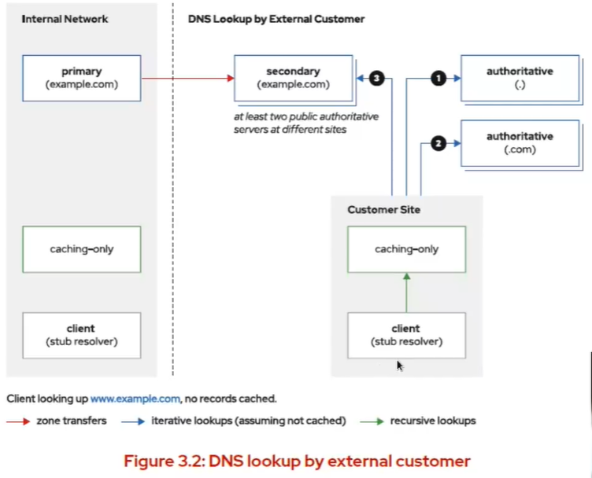
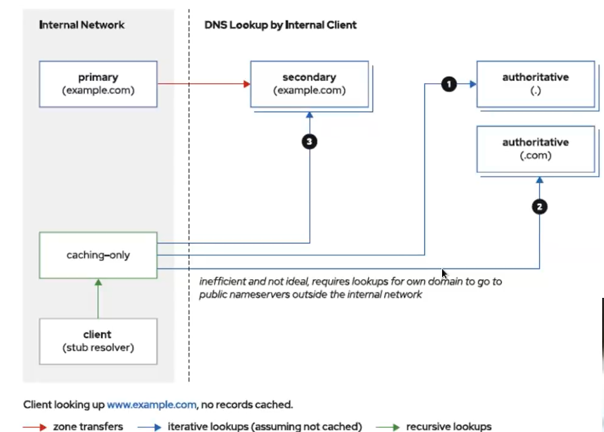

[toc] 


# Domain Name System Service Manager


114.114.114.114

202.103.44.150

## Domain Name System:

*   域名系统(DNS)是一个分层命名系统，充当联网主机的目录。目录中存放网络名称映射到数据的信息，在称为 resource records(RR条目) 的逻辑条目中维护

servera.lab.example.com. --> /com/example/lab/servera --> .com

*   DNS层次结构从顶层的root 域(.) 开始再向下划分为多个下级域

* 	DNS层次结构的每个级别在域名中用.表示

*   .com、.net 和.org 之类的域占据层次结构的第二级example.com 和redhat.com 之类的域占据第三级，以此类推DNS 有一些常见术语，如域 domain、子域 subdomain 、区域 zone


### Domain 域:

*   domain 是resource records 的集合，该集合以通用名结尾且表示 DNS命名空间的整个子树，如example.com

*   最大域是 root 域，即(.)，它包括整个 DNS 命名空间

*   顶级域top-leveldomain(TLD)是仅有一个组成部分的域。IANA (InternetAssigned Numbers Authority) 管理DNS root 并负责指派 TLD


#### TLD 有几种类型

*   gTLD (通用 TLD) : .com、.edu、.net 等- ccTLD (国家TLD) : .us、.uk、.cn、.ru

*   TLD 列表可在 https://www.iana.org/domains/root/db 中找


### Subdomain 子域

子域是作为另一个域的完整子树的域在讨论两个域之间的相互关系时使用该术语。例如lab.example.com 是example.com 的子域example.com 是.com 的子域也可以将 example.com称为第二级域，lab.example.com为第三级域


### Zone 区域

特定名称服务器直接负责 (directly responsible) 或权威(authoritative)对某个 domain (zone)进行解析例如，root 名称服务器对 root zone 具有权威，但它们将对.com 域的责任委派给其他名称服务器。这些服务器也可以将责任委派给其他名称服务器


### DNS查询

当系统需要从 DNS 获取信息时，它首先会使用其 stubresolver (根解析器)将查询发送到其 /etc/resolv.conf 文件中列出的其中一个名称服务器
stub resolver 向 DNS 服务器发出DNS 查询的 DNS 客端软件
如果该名称服务器不响应，stub resolver 将按顺序尝试其他服务器，直到它获得应答或尝试完所有服务器为止


## DNS资源记录（RR）

```shell
owner-name			TTL 		class 		type 		data 
www.example.com. 	300			IN 			A 			192.168.1.10 
```


| 字段名称   | 内容                                            |
| ---------- | ----------------------------------------------- |
| owner-name | 资源记录的名称                                  |
| TTL        | RR记录的生存时间                                |
| class      | 记录的类，基本上都是IN                          |
| type       | 记录存储的信息类型，例如：A记录是映射到IPv4地址 |
| data       | 记录存储的数据                                  |


### 重要的记录类型： 

#### A记录

IPv4记录

```shell
hosts.example.com. 			86400 		IN 		A		172.25.250.254  
```


#### AAAA记录

IPv6记录

```shell
a.hosts.example.com. 			86400 		IN 		A		2001:503:ba3e::2:30   
```


#### CNAME记录

也被称为别名记录

```shell
www-dev.example.com. 	30 		IN 		CNAME 		lab.example.com 
www.example.com. 		30 		IN 		CNAME 		www.redhat.com 
```


#### PTR记录

将IPv4或者IPv6地址映射到主机名，用于反向解析，也就是反向DNS 

```shell
4.0.41.198.in-addr.arpa. 		785 		IN 			PTR 		a.root-server.net. 
0.3.0.0.2.0.0.0.0.0.0.0.0.0.0.0.0.0.0.0.e.3.a.b.3.0.5.0.1.0.0.2.ip6.arpa. 86400 IN PTR a.root-servers.net. 
```


#### NS记录

将域名映射到对其DNS zone 具有权威的DNS服务器。zone的每个公开权威名称服务器必须拥有NS记录

```shell
example.com. 						86400 		 IN	 		NS 			classroom.example.com. 
168.192.ip-addr.arpa. 				86400 		 IN 		NS 			classroom.example.com.
9.0.e.1.4.8.4.6.2.e.d.f.ip6.arpa. 	86400 		 IN 		NS 			classroom.example.com. 
```

NS记录必须映射到A或者AAAA记录


#### SOA记录

提供关于DNS zone 如何运作的信息，包括主名称服务器，管理员邮件，序列号，超时时间等，每个zone必须正好有一个SOA记录

```shell
example.com. 	86400 	IN 	SOA   classroom.example.com. 	root.classroom.example.com. 	2015071700 3600 300 60400 60 
```


#### MX记录

将域名映射到接受该域的电子邮件的邮箱服务器，记录带有优先级编号，编号越低，优先级越高

```shell
example.com. 		86400 		 IN 		 MX 		 10 		 classroom.example.com. 
example.com. 		86400 		 IN 		 MX 		 10 		 mail.example.com. 
example.com. 		86400 		 IN 		 MX 		 100 		 mailbackup.example.com. 
```


#### SRV记录

帮助客户端查找支持域的服务器

```shell
_ldap._tcp.example.com. 		86400 		IN 		 SRV 	0 		100 		389 		 server0.example.com. 
```


## Unbound 缓存服务器

就是通过缓存服务器来进行外部的DNS访问，以后进行DNS解析的时候可以直接找缓存服务器进行解析

局域网中搭建缓存服务器，局域网内所有的机器都指向这个缓存服务器，由缓存服务器代替其他机器向外部进行DNS查询，查询的内容会存放在缓存服务器中，当TTL到期后会从缓存中删除。通过本地查询降低internal上的流量负担

bind unbound dnsmasq 都可以配置缓存名称服务器


### 安装unbound

```shell
yum install unbound 
```


### 修改配置文件

都是通过修改/etc/unbound/unbound.conf来控制

#### 修改监听地址

```shell
vim /etc/unbound/unbound.conf 
interface: 192.168.2.100 
interface: 2001:db8:1001::f0
```

其中libvirtd服务和unbound服务不可以共存，因为libvirtd是通过dnsmasq来监听53端口来管理DNS 


#### 访问控制

在 server 子句中，使用 access-control 进行访问控制，还能 防范 DDOS 攻击

```shell
access-control: 172.25.0.0/24 allow 
access-control: 20012:db8:1001::/32 allow 
access-control: 10.0.0.0/8 rufuse 
```


#### 定义DNS服务器转发

在 unbound.conf 中定义将 DNS 查询转发到指定名称服务器

```shell
forward-zone: 
  name: "." 
  forward-addr: 172.25.254.254 
```


#### 开启 DNS ssec 验证

```shell
domain-insecure: example.com 
```


#### 生成unbound服务私钥和证书 

```shell
[root@workstation ~]# unbound-control-setup 
setup in directory /etc/unbound
generating unbound_server.key
Generating RSA private key, 3072 bit long modulus (2 primes)
...........................................++++
.............................................................++++
e is 65537 (0x010001)
generating unbound_control.key
Generating RSA private key, 3072 bit long modulus (2 primes)
..................................................++++
.............++++
e is 65537 (0x010001)
create unbound_server.pem (self signed certificate)
create unbound_control.pem (signed client certificate)
Signature ok
subject=CN = unbound-control
Getting CA Private Key
Setup success. Certificates created. Enable in unbound.conf file to use
```


#### 验证unbound语法错误

```shell
[root@workstation ~]# unbound-checkconf  
unbound-checkconf: no errors in /etc/unbound/unbound.conf
```


### 启动缓存名称服务器：

```shell
firewall-cmd --permanent --add-service=dns #放行防火墙dns服务
firewall-cmd --reload 
systemctl enable --now unbound
```


### unbound常用命令

```shell
unbound-control dump_cache # 导出unbound配置信息
unbound-control load_cache < dump.out # 加载unbound信息 
unbound-control flush www.example.com # 清除缓存记录 
unbound-control flush_zone example.com # 清除zone记录 
```


## BIND 9

权威名称服务器存储 DNS 资源记录，并为其管理的 zone 提供 官⽅应答

RHEL8 中包含 Berkeley Internet Name Domain (BIND) 软件

通过 BIND，可将权威服务器配置为 zone 的主要（primary） 或次要（secondary）服务器

可在 primary 服务器上的 zone 的配置⽂件中编辑和管理 该 zone 的资源记录。⼀个 zone 正好有⼀个 primary 服务器

secondary 服务器定期从 primary 服务器下载最新版本 的 zone 信息。zone 信息传送的频率以及数据是否过期都 由 zone 的 SOA 资源记录控制

当注册新的 DNS zone 时，必须提供该 zone 的所有公共权威 名称服务器的名称和 IP 地址。注册商将这些信息放置在⽗域 的 zone ⽂件中（作为 NS、A 和 AAAA 记录），为了确保可 靠性，应⾄少具有两个公共 DNS 服务器，且位于不同的站 点，避免由于⽹络故障⽽造成的停机

并⾮所有权威服务器都必须是公共服务器。例如，可能仅使⽤ primary 服务器来管理 zone ⽂件，并将 zone 信息发布到 secondary 服务器

primary 服务器可以是私有服务器，但 secondary 服务器将是 ⾯向公共的，为外部客⼾端提供权威应答。这可以保 护 primary 服务器免受攻击


下图显⽰了外部主机如何使⽤其缓存名称服务器和权威名称服 务器对 example.com 中的记录执⾏DNS 查找，假设尚未缓存 任何记录：





客⼾的仅缓存名称服务器⾸先查询其中⼀个 root 名称服务器。 它被定向到负责 .com domain 的名称服务器池。其中⼀个服务器在响应中提供 example.com domain 的 NS 记录，因此 仅缓存名称服务器会查询其中⼀个⾯向公共的 secondary 名称 服务器。在本⽰例中，primary 名称服务器实际上不是公共 的，⽽是可以从 primary 服务器执⾏ zone 传送的 secondary 名称服务器，以便它们拥有关于 example.com zone 的最新数据


 


更好的⽅法提供内部名称服务器可以查询的内部权 威 secondary 服务器，这将消除外部查询，因此更安全


### 安装BIND

```shell
yum install bind 
## 文档参考 /usr/share/doc/bind/ 
```

bind默认为递归缓存名称服务器，提供本地解析，默认监听127.0.0.1：53端口


### 配置BIND

主要的配置文件是/etc/named.conf 

zone的配置文件主要放在/var/named/中 

配置DNS服务器步骤： 

*   定义地址匹配列表
*   配置named服务监听的IP地址 
*   配置客户端的访问控制
*   声明权威 Zones
*   在 zone 文件中写⼊条目


#### 定义地址匹配列表：

在 /etc/named.conf ⽂件的开头，可使⽤ acl 指令来定义地址 

匹配列表 条⽬可以是由尾部点 (192.168.0.) 或 CIDR 表示法 （192.168.0/24 或 2001:db8::/32）表示法

考虑以下 ACL 定义：

```shell
acl trusted {192.168.1.21; }
acl classroom {192.168.0.0/24; trusted ; } ; 
```

其值中使⽤ classroom 的任何指令都将匹配 192.168.0.0/24 ⽹络和 192.168.1.21 中的主机


#### named 中内置有四个预定义的 ACL：

| ACL       | 描述                                |
| --------- | ----------------------------------- |
| none      | 无匹配主机                          |
| any       | 匹配全部主机                        |
| localhost | 匹配DNS服务器的全部IP地址           |
| localnets | 匹配DNS服务器所在本地子网的全部主机 |


#### 配置服务器接口： 

可在 /etc/named.conf ⽂件的 options 指令中指定多个全局 设置 

listen-on 和 listen-on-v6，⽤于指示 named 侦听的 IPv4/IPv6 接⼝和端⼝

```shell
listen-on port 53 { 127.0.0.1; 192.0.2.1 ; } ; 
listen-on-v6 port 53 { ::1; 2001:db8:2020::5300; } ; 
```


#### 限制访问： 

*   /etc/named.conf 中的三个附加 options 指令对于控制访问⾮常重要： 

    -   allow-query 控制所有查询，默认是 localhost，需要对外提供 服务时，设置为 allow-query { any; }; 

    -   allow-recursion 控制递归查询

    -   allow-transfer 控制 zone transfer 

-   权威服务器不应允许递归查询。可防⽌被 DDOS 攻击 
-   如果必须允许受信任的客⼾端执⾏递归，可以打开递归

```shell
recursion yes; 
allow-recursion {trusted-nets ; } ; 
```


-   zone transfer 允许客⼾端获取 zone 内所有数据的转储。应受 到限制，以便潜在的攻击者更难以快速获取 zone 中的所有资 源记录 
-   但是 primary 服务器需要开启 zone transfer，允 许 secondary 服务器执行 zone transfer。但应禁止其他主机 执行 zone transfer


### 声明权威 zone：

```shell
zone "example.com" IN {
	type master ; 
	file "example.com.zone" ; 
} ; 
zone "2.0.192.in-addr.arpa" IN {
	type master ; 
	file "2.0.192.zone" ; 
}; 
zone "example.net" IN {
	type slave ; 
	file "slaves/example.net.zone"  ; 
	masters { examplenet; } ; 
}; 
```

始终将 secondary zone ⽂件保存在 slaves/ ⼦⽬录中， 其 SELinux 类型为 named_cache_t。SELinux 会阻⽌ named 在其他位置创建⽂件


### zone 文件格式： 

*   zone ⽂件是⼀种⽂本⽂件，每⾏包含⼀个指令或资源记录 
*   如果资源记录的数据中包含圆括号，它可以跨越多⾏。在同⼀ 物理⾏上分号 (;) 右侧的所有内容都将被注释掉 
*   zone ⽂件可能以 $TTL 指令开头，该指令可为没有列出 TTL 的 任何资源记录设置默认 TTL，默认以秒为计量单位

```shell
$TTL 3600
```


*   数字后可以跟⼀个字⺟，以指定更⻓的时间段： 
    *   M 表⽰分钟（1M 为 60）
    *   H 表⽰⼩时（1H 为 3600）
    *   D 表⽰天（1D 为 86400）
    *   W 表⽰周 （1W 为 604800）


每个 zone ⽂件包含⼀个 SOA 资源记录

```shell
example.com. IN SOA primary.example.com. root.example.com. (
	42 	; 	serial 序列号
	3H 	; 	secondary refresh 主辅同步时间 
	15M ; 	secondary retry 如果不成功同步的时间 
	1W 	; 	secondary timeout 当主服务器挂了之后，最长保留缓存时间 
	15M ; 	minimum cache TTL for negative answers 一次查询之后，如果查不到，则在多长时间之内禁止查询
)
```


1.   所定义的 zone 的名称（在此⽰例中为 example.com），后跟 IN SOA，⽤于标识记录类和类型（互联⽹ SOA 记录） 
2.   此 zone 的 primary 名称服务器 (primary.example.com) 的 名称 
3.   zone 管理员的电⼦邮件地址。地址中的第⼀个点 (.) 被视为 @，因此 root.example.com 表⽰ root@example.com

4.   代表⽂件版本的序列号。每次⽂件发⽣更改时，该序列号都必 须增加 
5.   secondary 服务器应多久查询⼀次 primary 服务器，以查看是 否需要进⾏ zone 刷新
6.   如果刷新失败，secondary 服务器应多久尝试⼀次重新连接 
7.   在放弃之前，secondary 服务器应尝试重新连接到不响应 的 primary 服务器的时⻓。如果发⽣超时，secondary 服务器 将假设该区域不再存在，并停⽌对其查询的应答 
8.   其他名称服务器应缓存该区域负响应的时⻓


每次在 primary 服务器上更新 zone ⽂件时，必须增加序列 号，并重新加载 named


将记录添加到 zone 文件： 

zone ⽂件必须具有： 

-  ⼀条 SOA 记录      
-  每个公共名称服务器的 NS 记录 
-  区域的其他 A、AAAA、CNAME、MX、SRV 和 TXT 记录

```shell
$TTL 36000 
@  IN SOA primary.example.com. root.example.com. (
	42 ; 
	3H ; 
	15M  ; 
	1W ; 
	15M ; 
) 
				IN NS 	ns1.example.com. 
				IN NS 	ns2.example.com. 

primary 		IN A 	192.0.2.1 
				IN AAAA 2001:db8:2020::5300 
				
host 			IN A 	192.0.2.2 
				IN AAAA 2001:db8:2020::2 
				
@ 				IN MX 	10 mail.example.com. 
mail 			IN A 	192.0.2.253 
				IN AAAA 2001:db8:2020::5301 
				
ns1 			IN A 	192.0.2.100 
				IN AAAA 2001:db8:2020::5301 
				
ns2 			IN A 192.0.2.101 
				IN AAAA 2001:db8:2020::5302 
				
www 		30 	IN A 	192.0.2.200 
			30	IN A 	192.0.2.201 

student 		IN CNAME host.example.com. 
				
```

*   @ 字符缩写了 zone 的名称，可帮助避免重复键⼊，在某些情 况下允许重复使⽤。zone ⽂件和前⾯⽰例中的 SOA 记录是等 效的 

*   如果记录的名称为空，它的值将与前⾯的记录相同。在上⽰例 中，第⼀条记录是 example.com. 的 SOA 记录，接下来的两 条记录是 example.com 的 NS 记录。然后，有⼀条 primary 的 A 记录，后跟⼀条 primary 的 AAAA 记录 

*   名称 www 有两条 A 记录。与所有其他记录（使⽤⽂件顶部的 默认 TTL）不同，它会在这些记录上设置 30 秒的⾮默认 TTL 

*   任何不以点结尾的名称都被视为部分主机名。primary 等效于 前⾯⽰例中的 primary.example.com.


*   将 IP 地址映射到名称的“反向”zone ⽂件中⾮常有⽤。这些 区域⽂件通常包含 SOA 记录、NS 记录和 PTR 记录

```shell
$TTL 36000 
@  IN SOA primary.example.com. root.example.com. (
	42 ; 
	3H ; 
	15M  ; 
	1W ; 
	15M ; 
) 
				IN NS 	ns1.example.com. 
				IN NS 	ns2.example.com. 
1				IN PTR	primary.example.com. 
2				IN PTR 	host.example.com. 
100 			IN PTR 	ns1.example.com.
101				IN PTR 	ns2.example.com.
200 			IN PTR 	www.example.com. 
201 			IN PTR 	www.example.com. 
253 			IN PTR 	mail.example.com. 
```


## 子域委派 

子域委派是在zone文件中定义的

可能想要将 lab.example.com ⼦域委派为其他名称服务器上的 zone
例如，要将 support.example.com ⼦域的责任委派给其他名称服务器。可以将该⼦域的相应 NS 记录添加到的example.com zone ⽂件中：


## Ansible 自动化配置DNS

