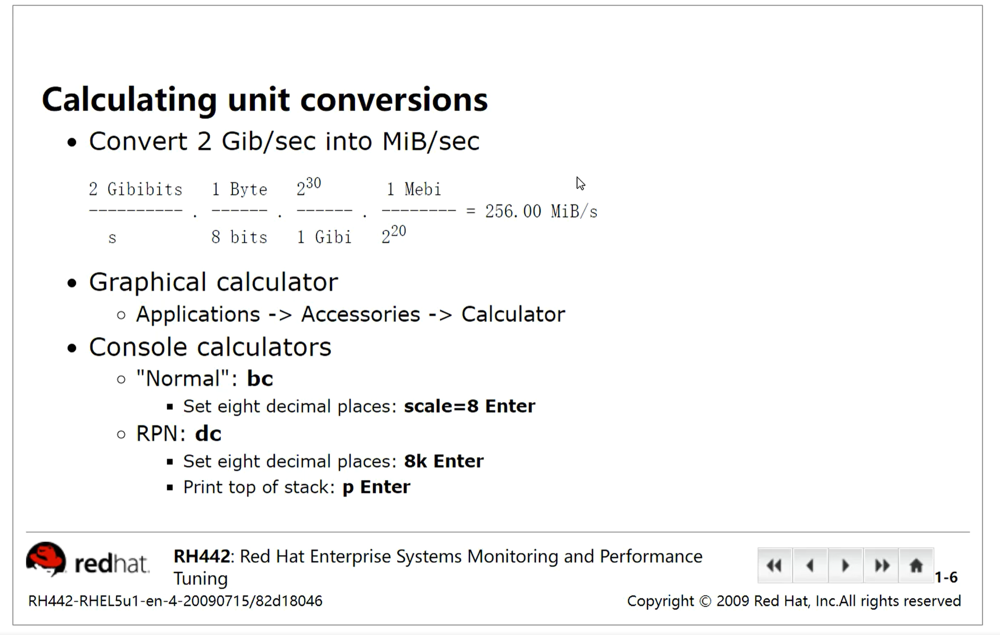
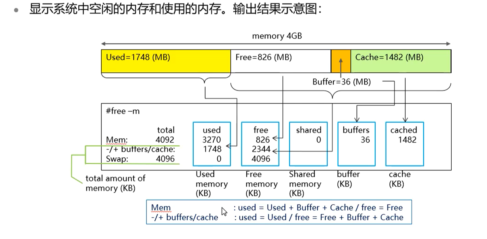

[toc]


# Elements of Monitoring and Tuning（监控和调整要素）


## 调优按照成本和性能：

*   从调优效果和成本成正比
*   bc 计算机工具 

1.  架构级调优：

通过利用CDN流量分担的方法来解决架构上的问题


2.  代码级调优：

调整代码中的逻辑来对速度进行加速


3.  配置类调优：

*   磁盘三种调度算法： 
    *   cfq： 完全公平原则 平均分摊
    *   deadine： 最终期限 适合小IO算法
    *   noop： 无调优
    *   as： 适合大IO算法


## 单位算换

KB： 1000位换算单位

KiBi： 1024位换算单位

kb： 一般是表示bit位 需要除以8 

B是字节 b是bit位

1bit=8B 




## 常用的调优文件

*   /boot/config-4.18.0-80.el8.x86_64 文件中的调优功能 需要在/boot/default/grub 文件中修改 并且使用grub2

*   /sys

*   /proc

*   /proc/sys

*   /etc/default/grub 

*   /boot/config-4.18.0-80.el8.x86_64     

*   /etc/sysctl.conf  

*   /etc/rc.d/rc.local  将命令开机自启的文件，在最后加上命令需求 


sysctl.conf中的修改参数 实际上就是修改了/proc/sys/下的调优参数的文件内容 

kernel-doc 软件包可以用来查看内核调优参数的帮助文档 

find /proc/ /sys/ -perm /200 -type f > /tmp/tuning   将所有可调优的东西全部打入到一个文件中 


## 服务模板

```shell
[Unit]
Description=OpenSSH server daemon
Documentation=man:sshd(8) man:sshd_config(5)
After=network.target sshd-keygen.target
Wants=sshd-keygen.target

[Service]
Type=notify
EnvironmentFile=-/etc/crypto-policies/back-ends/opensshserver.config
EnvironmentFile=-/etc/sysconfig/sshd
ExecStart=/usr/sbin/sshd -D $OPTIONS $CRYPTO_POLICY
ExecReload=/bin/kill -HUP $MAINPID
KillMode=process
Restart=on-failure
RestartSec=42s

[Install]
WantedBy=multi-user.target
```


## 监控

通过监控来发现性能的瓶颈 


### 监控系统的目标：

*   保障业务的正常运行


### 如何判断业务是否正常运行：

*   能否打开业务（只能作为一个标准）


### 衡量业务是否正常运行的指标：

*   能否打开 
*   打开速度（并不是越快越好，而是取一个合适值）


#### 从两个方面衡量业务运行

*   基础设施

    *   USE方法
        *   U：utilization 使用率
        *   S：Saturation 饱和度
        *   E： Error 错误
            *   CPU 
                *   使用率 
                *   饱和度 负载 
            *   磁盘
                *   使用率 磁盘空间使用率 
                *   饱和度 IO
            *   网卡
                *   使用率 
                *   饱和度 负载 
                *   错误数 数据交换错误数 
            *   内存
                *   使用率 
                *   饱和度 

*   业务系统 

    *   四大黄金指标
        *   延迟 请求速度 
        *   流量 qps 上行 下行  
        *   错误 请求失败率
        *   饱和度 

    

## 监控时使用的工具


### iostat

#### 命令安装

```shell
## 用于查看iostat命令是哪个软件包体提供的 
[root@servera kernel]# yum provides "*/iostat"
Last metadata expiration check: 0:10:20 ago on Tue 21 Jun 2022 11:17:44 AM CST.
sysstat-11.7.3-2.el8.x86_64 : Collection of performance monitoring tools for Linux
Repo        : rhel-8.0-for-x86_64-appstream-rpms
Matched from:
Filename    : /usr/bin/iostat
[root@servera kernel]# yum install sysstat-11.7.3-2.el8.x86_64 
```

#### 命令使用方法

记录了电脑cpu、磁盘的使用率

iostat命令不是实时监控硬件的信息，而是记录了电脑从开机到现在监控的时候的平均值 

##### 每秒实时监控信息 

```shell
[root@servera ~]# iostat  1 
Linux 4.18.0-80.el8.x86_64 (servera.lab.example.com)    06/21/2022      _x86_64_        (2 CPU)

avg-cpu:  %user   %nice %system %iowait  %steal   %idle
           0.01    0.01    0.07    0.00    0.02   99.89

Device             tps    kB_read/s    kB_wrtn/s    kB_read    kB_wrtn
vda               0.26         4.96         4.08     280619     231060
vdb               0.00         0.04         0.00       2224          0
vdc               0.00         0.04         0.00       2224          0
vdd               0.00         0.04         0.00       2224          0
```

##### 针对某一个磁盘实时查看信息,显示五次自动退出

 ```shell
[root@servera ~]# iostat  1 5 /dev/vda 
Linux 4.18.0-80.el8.x86_64 (servera.lab.example.com)    06/21/2022      _x86_64_        (2 CPU)

avg-cpu:  %user   %nice %system %iowait  %steal   %idle
           0.01    0.01    0.07    0.00    0.02   99.89

Device             tps    kB_read/s    kB_wrtn/s    kB_read    kB_wrtn
vda               0.31         5.17         4.31     293051     244499
 ```


##### 命令结果详解

###### CPU

```shell
## iostat查看cpu信息
avg-cpu:  %user   %nice %system %iowait  %steal   %idle
           0.01    0.01    0.07    0.00    0.02   99.89

# %user 查看用户级别的cpu的利用率百分比  说明应用程序消耗的cpu

# %nice 查看cpu使用的nice值 

# %system 查看内核级别的cpu利用率使用百分比

# %iowait 查看io使用百分比 如果值过高 则说明是磁盘造成的瓶颈 

# %steal 因为虚拟机而造成的使用率  

# %idle cpu空闲率 
```

###### 磁盘

```shell
#查看磁盘详细信息
[root@servera ~]# iostat -x 
Linux 4.18.0-80.el8.x86_64 (servera.lab.example.com)    06/21/2022      _x86_64_        (2 CPU)

avg-cpu:  %user   %nice %system %iowait  %steal   %idle
           0.01    0.01    0.07    0.00    0.02   99.89

Device   r/s     w/s     rkB/s     wkB/s   rrqm/s   wrqm/s  %rrqm  %wrqm r_await w_await aqu-sz rareq-sz wareq-sz  svctm  %util
vda     0.21    0.11      5.12      4.28     0.00     0.16   0.19  60.01    0.86    2.14   0.00    24.86    40.67   0.74   0.02
vdb     0.00    0.00      0.04      0.00     0.00     0.00   0.00   0.00    0.88    0.00   0.00    22.46     0.00   0.38   0.00
vdc     0.00    0.00      0.04      0.00     0.00     0.00   0.00   0.00    0.60    0.00   0.00    22.46     0.00   0.43   0.00
vdd     0.00    0.00      0.04      0.00     0.00     0.00   0.00   0.00    0.48    0.00   0.00    22.46     0.00   0.38   0.00


Device             tps    kB_read/s    kB_wrtn/s    kB_read    kB_wrtn
vda               0.31         5.11         4.26     293051     244600
vdb               0.00         0.04         0.00       2224          0
vdc               0.00         0.04         0.00       2224          0
vdd               0.00         0.04         0.00       2224          0

# device 设备名称 

# tps 每秒传输的IO请求数量 

# KB_read/s 每秒读的数据量 

# KB_wrtn/s 每秒写的数量 

# kB_read 磁盘一共读了多少     

# kB_wrtn 磁盘一共写了多少

```


### sar 

```shell
# 每秒查看磁盘设备的详细信息
[root@servera ~]# sar -d 1
-p 使用设备名来表示 不使用设备编号 
-C 显示cpu的信息 
-d 显示磁盘的信息 

#默认计时是12小时计时，在/root/.bashrc 中加上一个 alias sar="LANG=C sar" 就能变成24小时计时 

Linux 4.18.0-80.el8.x86_64 (servera.lab.example.com)    06/21/2022      _x86_64_        (2 CPU)

07:05:40 PM       DEV       tps     rkB/s     wkB/s   areq-sz    aqu-sz     await     svctm     %util
07:05:41 PM  dev252-0     10.00      0.00   1572.00    157.20      0.01      1.40      0.50      0.50
07:05:41 PM dev252-16      0.00      0.00      0.00      0.00      0.00      0.00      0.00      0.00
07:05:41 PM dev252-32      0.00      0.00      0.00      0.00      0.00      0.00      0.00      0.00
07:05:41 PM dev252-48      0.00      0.00      0.00      0.00      0.00      0.00      0.00      0.00

# DEV 设备编号 在/dev/中可以查看到设备编号，计算机查看设备是通过设备编号查看的 /dev/sda 这样的一个总的设备 默认会分给16个分区 
```


```shell
mknod /tmp/test b 8 16 # 创建一个块设备，在/tmp/test 主编号是8 次编号为16 
# 默认8是一个块设备 
# 光驱主编号为11 
# 虚拟磁盘默认主编号为252 
```


```shell
cat /root/sar.data | awk '{print $1,($4 + $5)/1024 }' | sort -rn # 计算出sar中磁盘使用量的大小 并排序
```


系统在/var/log/sa目录中存放系统磁盘 CPU等信息的记录方式 

可以通过sar命令对其中的信息进行查找和过滤 

这个目录中的记录是在/usr/lib/systemd/system/sysstat-collect.timer 文件中配置的，默认每十分钟记录一次，可以通过修改这个配置文件来修改记录时间间隔

当修改这个配置了之后 需要先daemon-reload才能使用restart 


### free



#### 作用： 查看内存信息

```shell
[root@servera ~]# free -m 
              total        used        free      shared  buff/cache   available
Mem:           1829         189        1306          16         332        1474
Swap:             0           0           0

# buff inode的缓存 
# cache block的缓存 
```


#### buffer/cache缓存：

buffer： 索引缓存缓存

cache： 数据缓存 

##### 读cache提升读性能：

当用户读取数据的时，系统会将硬盘中的数据读取到内存中，当数据处理完成后该数据继续保留在缓存中，供下次读取调用，这样硬盘会提升读性能。

缓存中的数据在内存不紧张的时候会一直保存，在内存紧张的时候会自动释放。在做基线测试的时候，需要清空缓存，这时需要手动清空，测出来的结果更准确


##### 写cache提升写性能

当写数据的时候，先将数据写入到内存中，再内存中将不连续的IO整合为连续的IO，再一次性写入硬盘，使用了电梯算法，前提是缓存要比主存快，否则写入内存就没有意义


vm.swappiness = 30 内存溢出的权限，=0的时候不管内存再紧张也不会清除 

 ```shell
sysctl -w vm.drop_caches=3 # 临时清空buffer和cache
echo 3 > /proc/sys/vm/drop_caches # 临时清空buffer和cache
 ```


#### dirty page脏页：

写缓存

数据已经在内存中修改，但是还没有写入到硬盘中，一旦非正常关机，数据会丢失

执行sync命令可以让脏页中的数据立即落盘，但是风险会很高

```shell
watch -m 1 ’cat /proc/meminfo‘| grep Dirty # 实时查看脏页中的数据量 
sync #将数据强制刷回
```

默认写入一条数据是写入到内存中，脏页老化时间为30s，写入数据30s后才会把脏数据写入到硬盘中，虚拟机可能有更激进的内存回收机制 

在性能方面，小IO在脏页中保留更长的时间会更好，在突然断电的情况，会有BBU模块来进行供电，会单独给缓存和装系统的保险箱供电，会将缓存中的数据临时卸载安装系统的保险箱盘中，等下一次开机的时候再将缓存数据调出写入内存，整合结束后再写入硬盘


#### 为什么不直接将数据写入硬盘？

因为内存中可以进行IO聚合，写入的数据可能是随机的，再内存中经过一段时间，会将多个随机的数据聚合成连续的IO，一并下发，提升写性能，使用sync命令罗盘会让数据变得不连续，内存缓存、硬盘缓存、cpu缓存都是为了将数据进行IO聚合


#### 存储故障案例

突然有一天 存储性能变差，原因是BBU故障，导致存储性能下降，请问是为什么？ 

默认存储缓存机制是回写

*   回写： 先写入缓存，再写入硬盘 

*   透写： 直接写入硬盘  dd命令的oflag=direct选项就是透写 

*   强制回写： 可以人工设置为强制回写，来保障性能

BBU故障意味着没有后备电池，如果数据写入存储，一旦掉电，数据丢失，为了数据的完整性，牺牲了性能，自动将回写改为透写，从而存储自动缓存机制页改为透写 


#### 分布式存储如何实现缓存

分布式存储的数据不会放在内存中，会有一个专门的缓存盘，用来进行缓存使用

分布式存储在创建存储池的时候必须要创建缓存，当存储池是ssd的时候，存储缓存必须是SSD或者更高

vm.dirty_ratio=30 缓存的水位值，当达到水位值的时候，就会将缓存盘中的数据刷回硬盘 


### top

```shell
[root@WANGZHENDONG-2 ~]# 
top - 12:59:44 up 0 min,  0 users,  load average: 0.00, 0.00, 0.00  # 查看当前计算机负载情况，如果load average超过                                                                                           CPU数量 则说明 负载过高  
# 0 user 就是查看当前有几个用户在使用 
# load average 平均负载，分别代表一分钟、五分钟、十五分钟的负载率
#一般情况会增长到2，到2了之后就会增长变慢。这个数值的增长和虚拟cpu的数量有关，虚拟cpu的数量就是这个值的衡量标准，这个值可以超出cpu数量的值。可以反映这台服务器需要的cpu的标准是多少，如果2个cpu但是值达到了4，则说明这个服务器上的业务需要4个cpu来支持运行

Tasks:   7 total,   1 running,   6 sleeping,   0 stopped,   0 zombie 
# total: 任务总数
# running：正在运行的任务
# sleeping: 已经睡眠的任务
# stopped: 丢到后台运行的任务 (fg %1)
# zombie: 僵尸任务 父进程死掉，子进程就会变成僵尸进程
%Cpu(s):  0.0 us,  0.1 sy,  0.0 ni, 99.9 id,  0.0 wa,  0.0 hi,  0.0 si,  0.0 st
# 数字1会把所有的cpu全部列出 
# hi: 硬中断 和硬件有关 hardware interrupts 
# si: 软中断 和软件优先级有关 soft interrupts
MiB Mem :   3764.5 total,   3639.3 free,     81.7 used,     43.4 buff/cache
MiB Swap:   1024.0 total,   1024.0 free,      0.0 used.   3580.7 avail Mem

  PID USER      PR  NI    VIRT    RES    SHR S  %CPU  %MEM     TIME+ COMMAND                                                                   
    1 root      20   0    1744   1084   1016 S   0.0   0.0   0:00.01 init
    7 root      20   0    1752     72      0 S   0.0   0.0   0:00.00 init
    8 root      20   0    1752     80      0 S   0.0   0.0   0:00.02 init
    9 wang      20   0   11304   4372   3160 S   0.0   0.1   0:00.02 bash
   48 root      20   0   16840   5528   4672 S   0.0   0.1   0:00.03 su
   49 root      20   0   11416   4512   3248 S   0.0   0.1   0:00.04 bash
   89 root      20   0   12832   3708   3268 R   0.0   0.1   0:00.00 top  
```


### mpstat

```shell
mpstat -P 1 1 5  <1：第一个cpu，1：一秒显示一次，5：连续显示5次> # 可以显示cpu相关更详细的信息 
```


### vmstat

可以看见运行中的任务的状态 

```shell
vmstat 1 
```


### 系统迁移原理：

rsync+tar 

使用tar的优势是可以将目录内的所有的文件打包，并且由rsync一并同步，但是在迁移的时候又需要有一个操作系统，于是迁移产品中会自带一个LiveCD的自启操作系统 来完成对网络 等操作的配置 从而进行迁移

#### 删根修复原理：

通过集群的另一台主机，tar打包数据在救援模式下复制过去 


### uptime

显示服务器运行时间 有几个用户登录  服务器负载


### pcp：

依赖pcp-gui这个包实现 

能监控更加丰富的参数，做更详细的监控

```shell
pmcd服务 # pcp依赖于pmcd服务
pminfo # 显示有哪些参数可以监控 

pmval -s 5  disk.dev.write_byts # 监控五次写操作 
pmval -v disk.dev.write_byts 

pminfo -dt # 查看监控参数的解释 

pmchart # 监控图形工具
		# 监控的文件会自动监控放在家目录下的.pcp目录中 
		# 查看.folio可以看到查看到的监控的文件是哪个
		# 查看.view可以查看到监控的是哪个参数 

pmval -a 文件名 监控参数 # 可以查看被监控的内容 

# 监控保存的信息默认存放在.pcp文件夹中，config文件中存放的是监控的参数 

pmval -a 20230927.20.03.48.0 disk.all.write_bytes | tail -m +13 | head -n -3 | awk '{print $2}' | awk '{printf(%f\n),$0}' | sort -rn | head -n 5 ## 监控磁盘读的数据指标，将科学计数法转化为十进制排序列出 
```


## swap的应用

swap分区，交换分区，虚拟内存 

当物理内存不足的时候，将一些暂时不用的内存资源临时存放到swap中，当我们又需要使用这些内存资源的时候，重新从swap中读取到内存中，swap只做数据暂存，不做处理，当需要数据的时候需要将数据调用到内存中再处理 


bigmem：专门用来做内存测试的工具

bigmem 1200 申请1200M内存，用来模拟内存紧张 

dd可以用来做cpu的压力测试 

系统会尽可能将核心资源保留在buffer中 

swap中的内容是之前用过的一部分内存数据，被临时丢在了swap中，swap中的内容并不是占用的大容量的数据，而是内存中比较老的数据内容 


swap数据清空的两种情况： 

正常关掉swap的时候，会将swap中的数据刷进内存中 

需要使用swap中的数据的时候，会将swap中的数据再次读取到内存中 


##### swap使用多大比较合理？ 

在运行一个非常消耗内存的业务的时候，推荐swap大小为内存空间的2倍。swap大小最好不要超过32G，跟内存空间需要相匹配


OOM killer （out-of-memory） 在系统过于消耗内存的时候，OOM机制会自动杀死进程 


## 系统启动流程： 

将系统内核启动参数的rhgb和quit参数去掉，就可以显示出系统启动的流程

