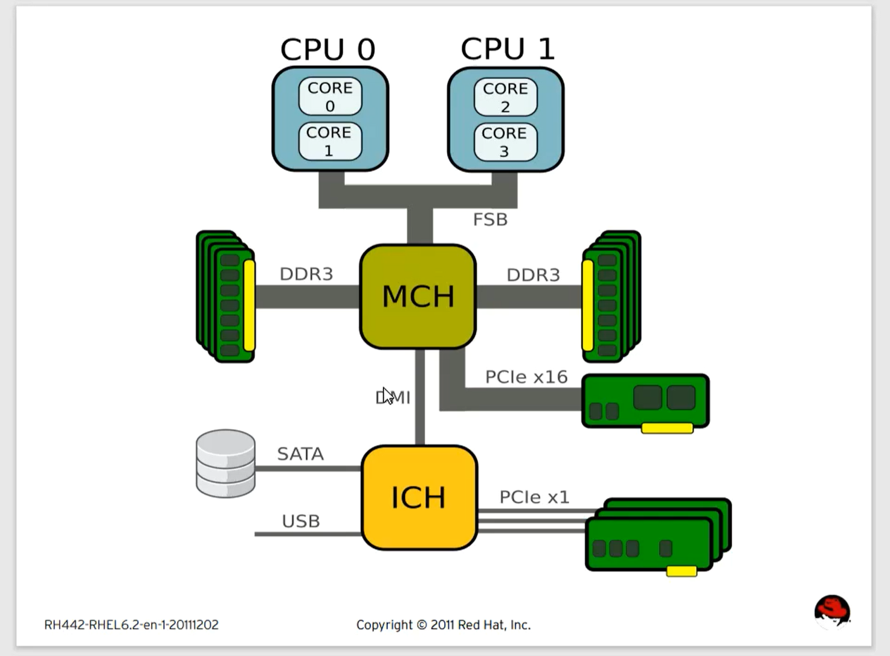
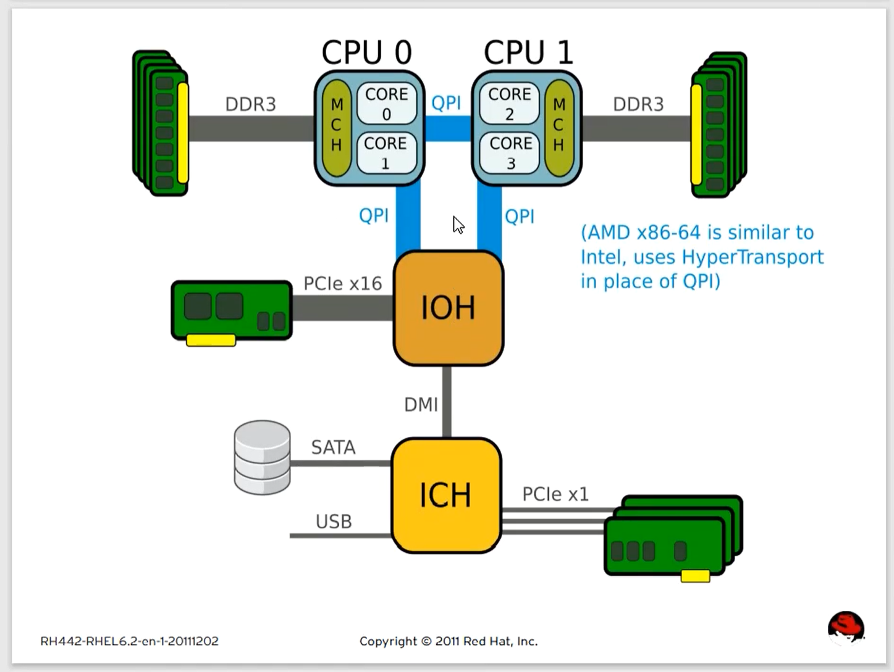
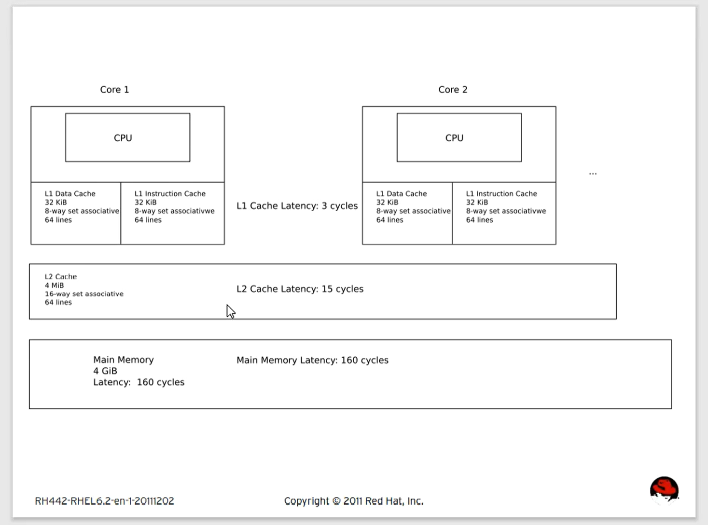
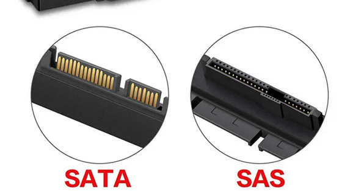

[toc]


# Viewing Hardware Resources （查看硬件资源）


# 硬件资源类型：


## CPU

```shell
[root@servera ~]# lscpu  
Architecture:        x86_64                                            
CPU op-mode(s):      32-bit, 64-bit                                     
Byte Order:          Little Endian
CPU(s):              2
On-line CPU(s) list: 0,1 #一共几个处理器
Thread(s) per core:  1 # 
Core(s) per socket:  1 # 
Socket(s):           2 # 插槽数量 
NUMA node(s):        1 # numa node 数量 
Vendor ID:           GenuineIntel
CPU family:          6 # 第六代处理器 
Model:               165 
Model name:          Intel(R) Core(TM) i7-10875H CPU @ 2.30GHz
Stepping:            2 
CPU MHz:             2304.002 # 外频赫兹
BogoMIPS:            4608.00 #每秒钟处理指令集的数据 单位百万 
Virtualization:      VT-x # 支持虚拟化类型  
Hypervisor vendor:   KVM # 虚拟化类型 
Virtualization type: full 
L1d cache:           32K #一级缓存数据区
L1i cache:           32K # 一级缓存指令区
L2 cache:            4096K # 二级缓存
L3 cache:            16384K # 三级缓存 
NUMA node0 CPU(s):   0,1 # 当所有的cpu都在同一个numa node的时候 说明不支持numa架构 
Flags:               fpu vme de pse tsc msr pae mce cx8 apic sep mtrr pge mca cmov pat pse36 clflush mmx fxsr sse sse2 ss syscall nx rdtscp lm constant_tsc arch_perfmon rep_good nopl xtopology cpuid tsc_known_freq pni pclmulqdq vmx ssse3 fma cx16 pcid sse4_1 sse4_2 x2apic movbe popcnt tsc_deadline_timer aes xsave avx f16c rdrand hypervisor lahf_lm abm 3dnowprefetch cpuid_fault invpcid_single pti ssbd ibrs ibpb stibp tpr_shadow vnmi ept vpid fsgsbase tsc_adjust bmi1 avx2 smep bmi2 invpcid rdseed adx smap clflushopt xsaveopt xsavec xgetbv1 xsaves arat umip pku ospke # CPU指令集 vmx指令集说明支持虚拟化 
```


### NUMA架构


#### UMA （一致性内存访问）




#### NUMA（非一致性内存访问）




#### NUMA架构原理

CPU和内存交换数据通过FSB（前端总线）必须通过这个地方

结果这个FSB成为了技术瓶颈

现在的CPU和内存交换数据先在NUMA node中交换 当资源不够用的时候

会通过一个叫QPI(数据快速通道互联)的地方来交换资源 

支不支持NUMA看主板生产的时候是不是支持 

lscpu这条命令可以在Linux中看见是不是支持NUMA结构 

FSB被QPI取代 NUMA 使用的顺序是按照算法来均衡的 


##### NUMA亲和性： 

在计算机分配资源的时候 CPU和内存磁盘网卡等硬件交换资源的时候会将这些资源整合到同一个NUMA中 来保证业务性能 


### 核：

为了提高单个CPU的性能 ，但是又不能额外多一个物理插槽，所以就为单个CPU多核，一个核就相当于一个大脑

x86架构不能做到64核，复杂性指令集很难做到64核，但是ARM架构的精简型指令集 可以支持更高的核数 并且功耗更低 


### 线程：

线程不是真正的处理器，只是在同一时间内处理多个任务，两个线程就在同一时间内运行两个任务，正常情况 一个处理器一次只能运行一个任务，CPU会按照时间分片为任务分配时间 ，对于多线程处理器而言，可以一次处理多个任务，处理单一简单的任务的时候，线程的概念会凸显出来，当单一任务不够简单的时候 线程的意义不大 。线程从单一简单任务的场景下 可以提升性能 


### 插槽：

能安装多少个物理CPU 


### 缓存



L1d cache:     一级缓存数据区 私有
L1i cache:      一级缓存指令区 私有
L2 cache:       二级缓存 私有 
L3 cache:       三级缓存  共享 

在CPU缓存中 三级缓存越大 性能越好，处理逻辑的时候，首先调用一级缓存，当一级缓存中没有会调用二级缓存，当二级缓存中没有，则调用三级缓存，当三级缓存也没有的时候，会读取内存中的数据。 

如果CPU有三级缓存，则L1核L2的缓存是私有的，如果CPU没有三级缓存，则L1私有，L2共享，私有则代表每个核都有自己的L1核或者L2缓存，共享则代表一个CPU共享同一个L3缓存 


## Memory

从技术上讲 只有内存大小的区别，本质上的技术迭代不是太快，目前单条内存最大32G


## Storage


### 硬盘类型：


#### 机械硬盘（HDD）

##### 功能类型：

*   企业级 
*   桌面级 

##### 盘径：

*   5.25 
*   3.5 
*   2.5 
*   1.8 

##### 接口类型：

*   ATA/IDE  
*   SATA  
*   SCSI  
*   SAS  
*   FC  

##### 接口介绍：

###### 串行接口：

 串行接口是指数据一位位地顺序传送，其特点是通信线路简单，只要一对传输线就可以实现双向通信，并可以利用电话线，从而大大降低了成本，特别适用于远距离通信，但传送速度较慢(115kbps~230kbps)；


###### 并行接口：

当频率过大时，容易产生干扰
并行接口是指数据的各位同时进行传送，其特点是传输速度快(1Mbps)，但当传输距离较远、位数又多时，导致了通信线路复杂且成本提高；

接口的类型会限制硬盘的传输速率 


###### SATA：串行

 ATA的升级，SATA 6G（3.0），6G的速率需要除以10，从1.0时代到现在的3.0时代 ，SATA接口的前身是ATA接口 

MSATA接口：笔记本电脑接口 

并行： 传输速率慢 会出现传输的瓶颈 


###### SAS： 串行

SAS接口：传输更快 最高达到12Gb/s （前身是SCSI接口）

SAS是串行的SCSI接口

SAS接口可以兼容SATA接口


###### SCSI：并行

早期打印机是SCSI接口 

SCSI传输也比较慢 传输带宽是300MB/s 


##### SAS和SATA的区别

SATA：便宜 容易坏 对于企业而言 性能差 

转速：7200RPM 

SAS：构造不同 转速：10000RPM 15000RPM 

 优点：可靠性好 不容易损坏 

 缺点：性能一般




#### 固态硬盘（SSD）


##### SSD的特点：

*   使用闪存的技术存储信息，数据传输速度比HDD块 
*   内部没有机器结构，耗电量少，散热小，噪音小 
*   SSD的使用寿命长


##### 接口类型：

*   SAS
*   m.2
*   SATA

##### 接口介绍：

*   m.2接口：SSD的出现 需要m.2接口来支持 速率为3.5GB/s，现存m.2的SSD是最快的


### RAID

>   跳转[RAID笔记详情](../../华为系列/HCIE-Storage/2.RAID.md)


## Network


# 管理工具


### sysctl.conf规则：

使用`sysctl -p` 立即生效 


net.ipv4.ip_forward 路由转发 

net.ipv4.icmp_echo_ignore_all = 1 禁止icmp请求 

net.drop_cache 临时清空baffer/cache的内容

### dmesg

系统内核提供的硬件自检工具，系统启动的时候进行的自检内容会被记录在这个命令中，纯粹的buffer， 重启之后，这些数据就会丢失，重新记录新一次启动的信息

提供的demsg文件被称为dmesg buffer，从RHEL8开始，被demsg这个命令取代 

```shell
# dmesg
[    9.516700] random: crng init done   
[    9.516700]   # 系统启动的时间 
random # 执行的动作 
crng init done  # 对动作的描述
dmesg -T 显示时间 时间为BIOS时间，不是系统时间 
```


### lscpu 

```shell
[root@servera ~]# lscpu  
Architecture:        x86_64                                            
CPU op-mode(s):      32-bit, 64-bit                                     
Byte Order:          Little Endian
CPU(s):              2
On-line CPU(s) list: 0,1 #一共几个处理器
Thread(s) per core:  1 # 
Core(s) per socket:  1 # 
Socket(s):           2 # 插槽数量 
NUMA node(s):        1 # numa node 数量 
Vendor ID:           GenuineIntel
CPU family:          6 # 第六代处理器 
Model:               165 
Model name:          Intel(R) Core(TM) i7-10875H CPU @ 2.30GHz
Stepping:            2 
CPU MHz:             2304.002 # 外频赫兹
BogoMIPS:            4608.00 #每秒钟处理指令集的数据 单位百万 
Virtualization:      VT-x # 支持虚拟化类型  
Hypervisor vendor:   KVM # 虚拟化类型 
Virtualization type: full 
L1d cache:           32K #一级缓存数据区
L1i cache:           32K # 一级缓存指令区
L2 cache:            4096K # 二级缓存
L3 cache:            16384K # 三级缓存 
NUMA node0 CPU(s):   0,1 # 当所有的cpu都在同一个numa node的时候 说明不支持numa架构 
Flags:               fpu vme de pse tsc msr pae mce cx8 apic sep mtrr pge mca cmov pat pse36 clflush mmx fxsr sse sse2 ss syscall nx rdtscp lm constant_tsc arch_perfmon rep_good nopl xtopology cpuid tsc_known_freq pni pclmulqdq vmx ssse3 fma cx16 pcid sse4_1 sse4_2 x2apic movbe popcnt tsc_deadline_timer aes xsave avx f16c rdrand hypervisor lahf_lm abm 3dnowprefetch cpuid_fault invpcid_single pti ssbd ibrs ibpb stibp tpr_shadow vnmi ept vpid fsgsbase tsc_adjust bmi1 avx2 smep bmi2 invpcid rdseed adx smap clflushopt xsaveopt xsavec xgetbv1 xsaves arat umip pku ospke # CPU指令集 vmx指令集说明支持虚拟化 

[root@foundation0 ~]# lscpu  -p 
# The following is the parsable format, which can be fed to other
# programs. Each different item in every column has an unique ID
# starting from zero.
# CPU,Core,Socket,Node,,L1d,L1i,L2,L3
0,0,0,0,,0,0,0,0
1,1,0,0,,1,1,1,0
2,2,1,0,,2,2,2,1
3,3,1,0,,3,3,3,1

#如果数量唯一 则出现单个数字 
第一列是CPU 逻辑CPU数量 多一个线程，逻辑CPU*2 
第二列是Core 核的标号 
第三列是Socket 插槽的标号
第四列是numa Node node标号  
第五列开始是缓存 数字唯一 代表共享缓存 
```

### dmidecode


#### dmidecode日志案例：

>   **附件**：[[dmidecode日志内容-非二进制](./附件1：dmidecode_log.md)]


#### 作用：

显示机器上的所有硬件信息

```shell
## 将dmidecode命令结果导入到一个文件中 ## 
[root@foundation0 ~]# dmidecode > dmidecode.log  
------------------------------------------------------------------------------------------------------------
## 将导出的文件保存为二进制文件 ## 
[root@foundation0 ~]# dmidecode --dump-bin dmidecode.log  
# dmidecode 3.2
Getting SMBIOS data from sysfs.
SMBIOS 2.7 present.
620 structures occupying 29188 bytes.
Table at 0x000E0010.

# Writing 29188 bytes to dmidecode.log.
# Writing 31 bytes to dmidecode.log.
------------------------------------------------------------------------------------------------------------
## 打开文件会出现乱码 ##
[root@foundation0 ~]# vim dmidecode.log  
------------------------------------------------------------------------------------------------------------
## 将二进制dmidecode日志文件转化为正常的文件 
[root@foundation0 ~]# dmidecode  --from-dump dmidecode.log  
```


### sosreport

求救 当机器出故障了之后 会将机器中的所有数据进行打包 生成一个文件 在/var/tmp中生成文件 

```shell
md5sum #计算文件的md5值

xz -d  #解压xz压缩的文件 
```

通过解压sos文件 可以查看到机器的所有的信息 


### tuned

系统自带的一个调优工具，用于简化调优的一个工具，在系统自带的内容中有一些默认的调优选项，使用tuned可以设置也可以自定义一些调优选项，对系统的优化能够更加方便掌控 


#### 常见命令 

```shell
tuned-adm  list       			# 查看所有的调优模式 
tuned-adm profile 模式 		   # 更改调优的模式 
tuned-adm recommend    		   	# 查看推荐的模式 
tuned-adm active 				# 查看当前调优的模式 
```

大部分的调优文件可以写在tuned的自定义调优中 

/usr/lib/tuned目录中可以存放自定义的调优文件 

#### 常见调优方式

可以通过引入一个脚本的方式调优 
在自定义的调优模式中可以自己写一个脚本 

在调优配置文件中加上
[调优名称] 
type=sprice 
sprice=脚本名称 

日志存放在/var/log/tuned/tuned.log 


当需要对服务进行调优的时候，可以直接对service文件进行调优，将调优内容写进service配置文件 


