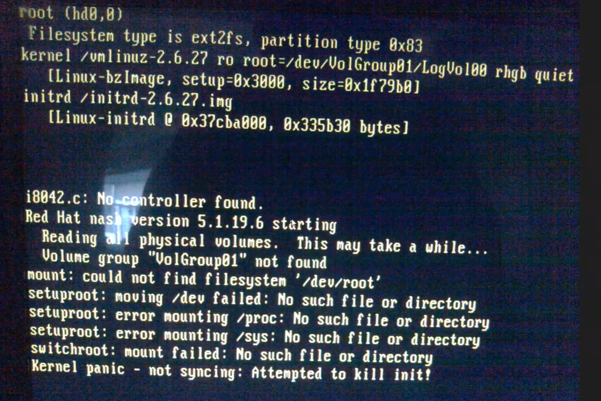

[toc] 

# RHEL5.4-RHEL6场景

## 案例现象

## 案例背景：

因某种实验需求，环境版本为RHEL5.4，内核版本为2.6.18-164.e15，需要在线升级内核为2.6.27，但是内核升级结束之后，开启不能正常启动，启动过程中进入了这个界面。 

根据上图分析，图中报错i8042.c: No controller found 可得，控制器未找到，一般情况下为RAID卡控制器驱动丢失

## 解决方案：

根据图中分析可以得出，原始系统和原内核中拥有该型号RAID卡驱动，但是因为是手动升级内核，所以在升级结束之后新版本内核出现了RAID卡驱动丢失的场景，因此需要搜出该厂商RAID卡驱动并下载。 

在自己笔记本电脑中模拟RHEL5.4内核升级的场景，升级结束之后可以正常开机，在2.6.27内核版本中编译安装RAID卡驱动，(不可以在DELL服务器原内核版本中安装，因为会造成驱动和内核版本不一致的场景)，自己笔记本安装完RAID卡驱动之后，对DELL服务器原内核进行开机，找到新内核模块配置目录/lib/modules/2.6.27-164.el5/，在目录中创建对应驱动模块目录，将自己笔记本电脑中下载好的驱动模块拷贝至DELL服务器中刚刚创建的目录中，创建完成之后，进入/boot/找到initrd-2.6.27.img文件，将编译好的模块通过mkinitrd  --with=e1000 -f /boot/initrd-\$(uname -r)img  \$(uname -r) 命令将刚刚拷贝并且编译好的模块封装到img文件中，至此在系统2.6.27内核版本中开启启动时可以自动加载到RAID卡驱动，问题解决

在系统内核中所有的驱动放在/boot/initrd-2.6.18-164.el5.img镜像中，通过zcat  initrd-2.6.18-164.el5.img  | cpio -id  命令可以解压该镜像，通过解压镜像查看驱动是否被封装进入镜像中 。 

## 扩展：

### 为什么不将网卡驱动等封装进initrd-2.6.27.img文件中

因为在系统启动根的时候才会读取到initrd-2.6.27.img文件，但是在系统启动根的过程中不需要使用到网卡驱动，在系统启动根的过程中只会用到RAID卡驱动和硬盘驱动，一旦根分区被加载起来之后，才会去读取其他驱动。 因为其他驱动都被存放在根分区中。 

# RHEL7以上版本解决方案： 

使用dracut --add-driver e1000 -f /boot/initrd-\$(uname -r).img   \$(uname -r) 来封装img镜像 前面的操作和RHEL5.4操作一样 

