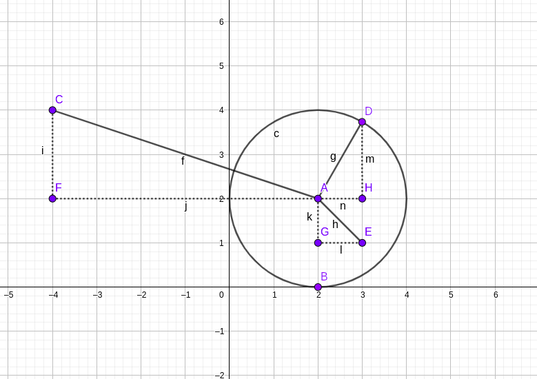

[toc]


# 经典数学问题集锦


## 数学公式 

### 圆的面积公式

$$
S=\pi r^2\\
S=\pi (\frac{d}{2})^2 \\
r表示半径
$$


### 圆的周长

$$
C=\pi d  \\ 
C=2\pi r \\
d为直径，r为半径 \\
$$


### 圆的标准方程

在平面直角坐标系中，以点O（a，shu zib）为圆心，以r为半径的圆的标准方程是$（x-a）^2+（y-b）^2=r^2。$

[圆三点关系](../../.GeoGebra_File/圆三点关系.ggb )




### 圆的一般方程


## 水仙花数/阿姆斯特朗数(阿姆斯壮数)/超完全数字不变数/自幂数


水仙花数是指一个三位数，其各个数字的立方和等于该数本身。换句话说，如果一个三位数的百位数字为a，十位数字为b，个位数字为c，那么当且仅当$a^3+b^3+c^3$等于这个三位数本身时，这个数就被称为水仙花数。

最小的水仙花数是153，因为$1^3+5^3+3^3=153$。另外的水仙花数还有370、371、407等等。

```c
#include<stdio.h> 
int f(int n) 
{
    int i,j,k; 
    i=n/100 ; 
    j=n/10-i*10 ; 
    k=n%10 ; 
    if(i*100+j*10+k=i*i*i+j*j*j+k*k*k) 
        return n ; 
    else return 0 ; 
}
int main() 
{
    int n,k;
    printf("output\n") ; 
    for(n=100;n<1000;n++) 
    {
        k=f(n) ; 
        if(k!=0) 
            printf("%d",k) ; 
    }
    printf("\n") ; 
}
```


## 完全数（完数）

完全数是指一个数等于其所有因子（不包括本身）之和的正整数。换句话说，一个数如果可以表示成若干个不同的因子之和，那么这个数就是完全数。例如，6是一个完全数，因为它的因子是1、2、3，且 $1+2+3=6$。


## 质数

质数，也称素数，指的是一个大于1的正整数，除了1和本身之外没有其他因子（除1和本身外不能被其他正整数整除）的数。例如，2、3、5、7、11等都是质数，而4、6、8、9、12等则不是质数，因为它们都可以被大于1且小于它自身的整数整除。


## 斐波那契数列

一个数列，第一个和第二个数为1，从第三个数开始，每个数都是前两个数之和。例如，斐波那契数列的前10个数为1、1、2、3、5、8、13、21、34、55。

```c
#include <stdio.h>
int main() {
    int n, i, t1 = 0, t2 = 1, nextTerm;
    printf("请输入斐波那契数列的项数：");
    scanf("%d", &n);
    printf("斐波那契数列：");
    for (i = 1; i <= n; ++i) {
        printf("%d, ", t1);
        nextTerm = t1 + t2;
        t1 = t2;
        t2 = nextTerm;
    }
    return 0;
}
```


## 杨辉三角形

杨辉三角形，又称为帕斯卡三角形，是一个由数字排成的三角形，在计算组合数学问题中经常用到。

在杨辉三角形中，每个数都等于上方两数之和。最上面一行只有一个数字1，下面一行有两个数字1。从第三行开始，每行数字都是上方两个数字之和。每行数字左右对称，由于这个性质，杨辉三角形在排列组合中有大量的应用，如二项式定理的展开等。


### 不带空格

杨辉三角形的前几行如下所示：

```
1 
1 1 
1 2 1 
1 3 3 1 
1 4 6 4 1 
1 5 10 10 5 1 
1 6 15 20 15 6 1 
1 7 21 35 35 21 7 1 
1 8 28 56 70 56 28 8 1 
1 9 36 84 126 126 84 36 9 1 
```

杨辉三角形的每个数字可以通过组合数公式计算得出，即第 $n$ 行第 $m$ 个数的值为：$C_{n-1}^{m-1}$，其中 $C_{n-1}^{m-1} = \frac{(n-1)!}{(m-1)!(n-m)!}$ 表示从 $n-1$ 个不同元素中取 $m-1$ 个元素的组合数。

```c
#include "stdio.h"
int main() {

    int a[10][10] ;
    int i,j ;

    for ( i = 0; i < 10 ; i++) {
        for ( j = 0; j < 10 ; j++) {
            a[i][j] = 1 ;
        }
    }


    for ( i = 1; i < 10 ; i++) {
        for ( j = 1; j < i; j++) {
            a[i][j] = a[i-1][j] + a[i-1][j-1] ;
        }
    }

    for ( i = 0; i < 10; i++) {
        for ( j = 0; j < i+1 ; j++) {
            printf("%d ",a[i][j]) ;
        }
        printf("\n") ;
    }
    
}
```


### 带空格

```c
             1 
            1 1 
           1 2 1 
          1 3 3 1 
         1 4 6 4 1 
        1 5 10 10 5 1 
       1 6 15 20 15 6 1 
      1 7 21 35 35 21 7 1 
     1 8 28 56 70 56 28 8 1 
    1 9 36 84 126 126 84 36 9 1 
```


```c
#include "stdio.h"
int main() {

    int n ;
    printf("请输入需要打印的行数：") ;
    scanf("%d",&n) ;
    int a[n][n] ;
    int i,j ;

    for ( i = 0; i < n ; i++) {
        for ( j = 0; j < n ; j++) {
            a[i][j] = 1 ;
        }
    }


    for ( i = 1; i < n ; i++) {
        for ( j = 1; j < i; j++) {
            a[i][j] = a[i-1][j] + a[i-1][j-1] ;
        }
    }

    for ( i = 0; i < n; i++) {

        for (int j = 0; j < (n-1)-i ; j++)
            printf(" ");

        for ( j = 0; j < i+1 ; j++) {
            printf("%d ",a[i][j]) ;
        }
        printf("\n") ;
    }

}
```


## 前n项求和


$$
F(n)=1+\frac{1}{2}+\frac{1}{3}+\frac{1}{4}+\frac{1}{5}……\frac{1}{n}
$$


```c
//全为正数加法求和
#include<stdio.h>
int main()
{
    int i,n ;
    double sum=0.0 ;
    scanf("%d",&n) ;
    for (i=1 ; i<=n ; i++)
        sum+=1.0/i ;
    printf("f(%d)=%f",n,sum) ;
}
```


$$
F(n)=1+\frac{1}{2}-\frac{1}{3}+\frac{1}{4}-\frac{1}{5}……\frac{1}{n}
$$


```c
//一正一负
#include<stdio.h>
int main()
{
    int i,n ;
    double sum=0.0,sin=1.0 ;
    scanf("%d",&n) ;
    for (i=1 ; i<=n ; i++)
        sum+=sin/i ;
    	sin = -sin ; 
    printf("f(%d)=%f",n,sum) ;
}
```


## 整数分解

### 逆序输出一个数字

```c
#include<stdio.h>
int main() 
{
    int x ; 
    scanf("%d",&x) ; 
	do {
        int d=x%10 ; // 取出一个数字的个位数 
        printf("%d\n",d) ; //打印这个数字的个位数
        x/=10 ; //抛弃这个数字的个位数 
    }while (x>0) ; 
    return 0 ; 
}
```


### 正序分解输出一个数字

```c
#include<stdio.h>
int main()
{
    int x,t ;
    int mask=1  ;
    scanf("%d",&x) ; //输入一个数字x 
    t=x; 			// 将x的值给t,由t去计算出输入数字的位数 
    while (t>9) {	//计算数字位数的过程……
        t /= 10;
        mask *= 10;
    }
    
    do {
        int d ;
        d = x/mask ;			// 将输入的数字x除以mask的位数，得到最高位所在的数字 
        printf("%d",d ) ; 		//输出最高位所在数字 
        x%=mask ; 				// 将输入数字x最高位去掉 
        mask /= 10  ;			//将x的位数mask随着x的位数减小而减小 
    } while(mask>0) ;

}
```


## 最大公约数

两个或多个整数共有约数中最大的一个

比如： 12和18的最大公约数为6 

最大公约数（Greatest Common Divisor，简称GCD），也称为最大公因数，指的是两个或多个数的公共因子中最大的那个数。例如，12和18的公因数有1、2、3和6，其中最大的是6，因此12和18的最大公约数为6。


最小公倍数（Least Common Multiple，简称LCM），指的是两个或多个数中，能够被所有这些数整除的最小正整数。例如，4和6的倍数分别为4、8、12、16、20、24……和6、12、18、24……，它们的公共倍数为12，因此4和6的最小公倍数为12。


### 枚举：

```c
#include<stdio.h>
int main()
{
    int a,b ;
    int min ;
    scanf("%d,%d",&a,&b) ;
    if (a>b)
        min = b;
    else
        min = a;
    int rat =0 ;
    int i =1 ;
    for ( i =1 ;i<min ; i++)
        if (a%i==0)
            if (b%i==0)
                rat=i ;
    printf("最大公约数=%d",rat) ;
}
# 思路： 
# 1. 首先相找出两个数字中的最小的一个数字 
# 2. 取一个变量i,让i<这个最小的数字
# 3. 判断a和b两个数字是否能够被i整除，并且把i的值保留下来 
# 4. 让for循环一直寻找被a同时也被b整除的数字，并且保留下来这个数字

```


### 辗转相除法

如果b=0则计算结束,如果b！=0 则计算a%b,让a=b,b=余数，然后继续计算a%b,循环往复，直到b=0跳出循环


$$
\begin{matrix}
a & b & t  \\ 
12 & 18 & 12 \\ 
18 & 12 & 6 \\ 
12 & 6 & 0 \\ 
6 & 0       \\
\end{matrix}
$$


```c
#include<stdio.h> 
int zhanzhuan(int x, int y) 
{
    int t; 
	while (b!=0) {
        t=x%y ;
        a=b ; 
        b=t ;
    }
    return a ; 
    
}
int main() 
{
    int a, b , c ; 
    scanf ("%d %d",&a,&b) ;   
    int zhanzhuan(int x, int y) ;
    c=zhanzhuan(a,b) ;  
    printf("%d和%d的最大公约数为%d",a,b,c) ; 
}
```


## n! 求n的阶乘

输入一个数字n ，求n的阶乘


```c
#include<stdio.h>
int main()
{
    int n,i ,sum=1;
    scanf("%d",&n) ;
    for ( i = 1 ; i <= n ; i++)
        sum*=i ;
    printf("%d",sum );
}
```


### 把阶乘作为一个函数

```c
#include<stdio.h> 
int jiecheng(int x)  
{
  int i,sum=1 ; 
  for(i=1;i<=x;i++) 
      sum*=i ; 
   return sum ; 
}

int main() 
{
  int  n,sum ; 
  scanf("%d",&n) ; 
  int jiecheng(int x) ;  
  sum=jiecheng(n) ; 
  printf("%d",sum) ; 
  
}
```


## 素数

只能被1和自己整除的数字，1除外

```c
#include<stdio.h>
int main()
{
    int a ;
    int b=1,i ;
    scanf("%d",&a) ;
    for(i=2;i<a;i++)
        if (a%i==0)
            b=0 ;
    if (b==0)
        printf("不是素数");
    else
        printf("是素数") ;
}
```


