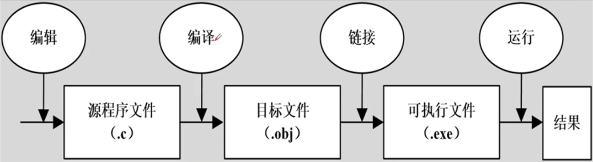

[toc]


# 简单C语言程序和算法


## 什么是计算机程序

程序就是一组计算机能识别和执行的指令

指令可以理解为命令命令

把一堆指令堆在一起，实现了特定的功能，组合起来就是一个程序


## 什么是计算机语言

*   机器语言（二进制语言）
*   汇编语言（符号化语言，把二进制语言转化为符号）
*   高级语言
    *   结构化语言
    *   非结构化语言
    *   面向对象语言

## C语言的特点

*   语言简洁、紧凑、灵活（32个关键字）
*   运算符和数据类型丰富
*   程序设计结构化（顺序结构、循环结构、选择结构）、模块化
*   生成目标代码质量高
*   可移植性好


### C语言32个关键字（系统定义，不能用作其他定义）

auto、break、case、char、const、continue、default、do 、double、else、enum、extern、float、for、goto 、if、int、long、register、return、short、signed、sizeof、static、struct、switch、typedef、unsigned、union、void、volatile、while


### 标识符

#### 用户标识符：

由数字，字母。下划线祖成，不能用数字开头，有大小写区分


## 最简单的C语言程序

```c
#include<stdio.h> //编译预处理
int main()        //主函数
{
    printf("this is my first C program!\n"); 
    return 0 
}
```


## C语言程序的结构


### 结构特点：


#### 程序和主函数：

*   程序由一个或者多个函数组成
*   必须有且仅有一个主函数main() 
*   程序执行从main()开始在main()中结束

#### 程序语句

*   C程序由语句构成
*   用；作为语句中止符

#### 注释： 

*   //为单行注释
*   /* */为多行注释


## 运行C语言程序的步骤




## 算法


### 程序的两大要素：


#### 数据结构+算法=程序

#### 1. 数据结构

对数据组织的描述（顺序存储和链式存储）

#### 2. 算法

对操作步骤的描述，为解决问题而采取的方法和步骤


### 算法的特性

*   有穷性：包含有限的操作步骤
*   确定性：算法中的每个步骤都应该是确定的
*   有零个或者多个输入：输入是之在执行算法的时候需要从外界取得必要的信息
*   有一个或者多个输出：算法的目的是为了求解，“解”就是输出
*   有效性：算法中的每一个步骤都应该被有效地执行，并且得到确定的结果


