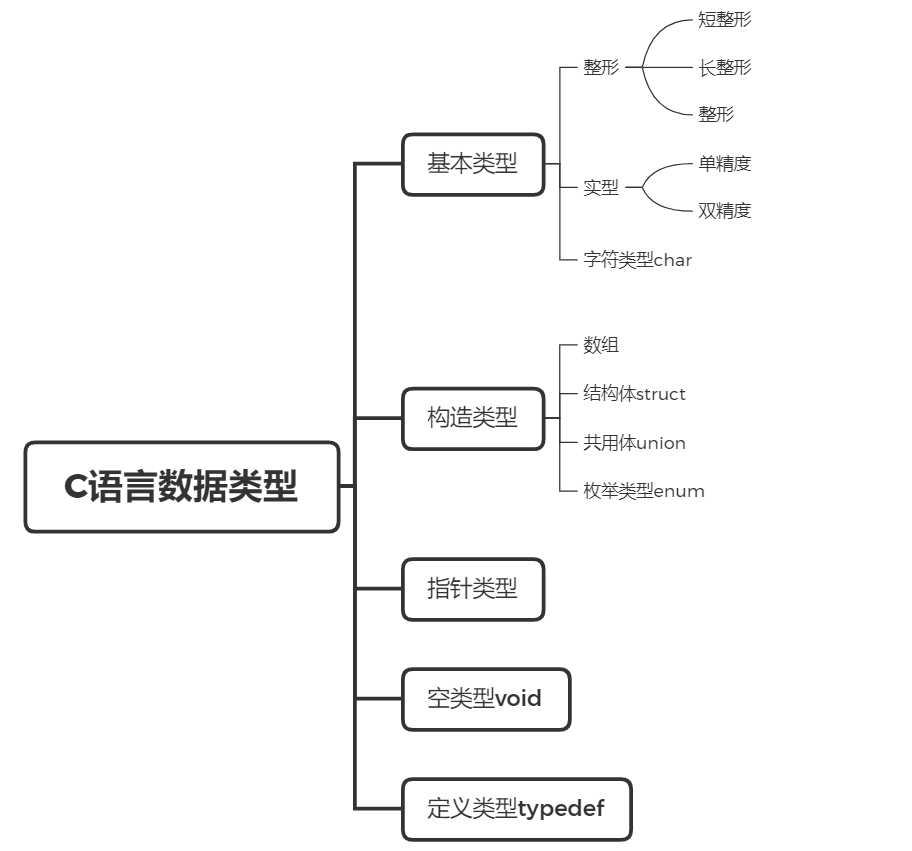
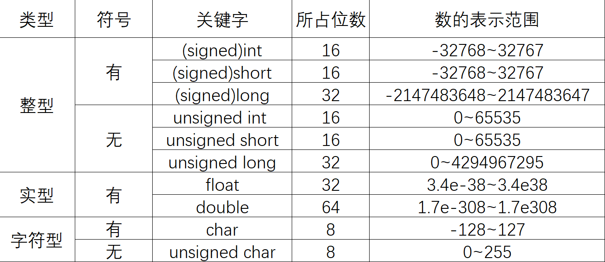
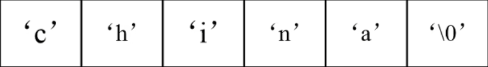
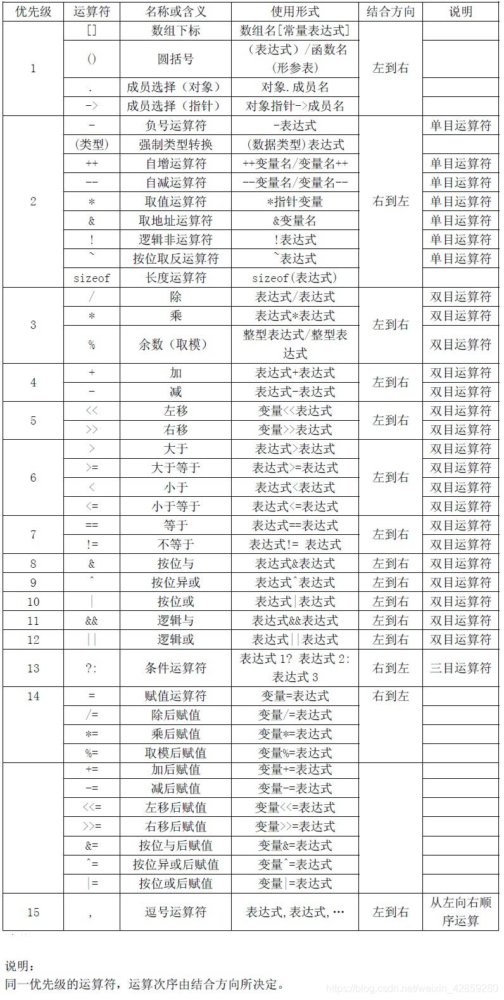

[toc]


# 数据类型


## C语言数据类型




### 基本数据结构




# 常量和变量


## 进制转化


### 二进制转十进制：

$$
\overbrace{11011001}^{8个}
$$

$$
1\times2^7+1\times2^6+1\times2^4+1\times2^3+1\times2^0=217
$$

$$
\therefore\quad11011001\longrightarrow217
$$


### 十进制转二进制：

$$
304
$$

$$
304\div2=152……0 \\
152\div2=76……0\\
76\div2=38……0\\
38\div2=19……0\\
19\div2=9……1\\
9\div2=4……1\\
4\div2=2……0\\
2\div2=1……0\\
1\div2=0……1
$$

$$
\therefore\quad304\longrightarrow10011000
$$

### 八进制转十进制：

$$
\overbrace{27647}^{5个}
$$

$$
2\times8^4+7\times8^3+6\times8^2+4\times8^1+7\times8^0=12199
$$

$$
\therefore\quad27647\longrightarrow12199
$$


### 十进制转八进制：
$$
59
$$

$$
59\div8=7……3 \\
7\div8=0……7\\
$$

$$
\therefore\quad59\longrightarrow73
$$


### 十六进制转十进制：

$$
\overbrace{45FB}^{5个}
$$

$$
4\times16^3+5\times16^2+F\times16^1+B\times16^0 \\
=4\times16^3+5\times16^2+15\times16^1+11\times16^0 \\
=17915
$$

$$
\therefore\quad45FB\longrightarrow17915
$$


### 十进制转十六进制：

$$
79
$$

$$
79\div16=4……15 \\
4\div16=0……4\\
$$

$$
\therefore\quad79\longrightarrow4/15\longrightarrow4F \\
\therefore\quad79\longrightarrow4F
$$


## 常量


### 定义：

程序运行时其值不能发生改变的量（即常数） 


### 分类：

#### 符号常量：

用标识符代表常量 

##### 定义格式：

#define 符号常量 常量 （定义常量不是一条语句）

#### 直接常量：

*   整型常量
*   实型常量
*   字符常量
*   字符串常量


### 整形常量：


#### 三种形式：

* 十进制整数： 由数字0-9组成
    * 12,100,0

* 八进制整数： 以数字0开头，范围0-7 
    * 012=10 

* 十六进制整数： 以0x开头，范围0-9，A-F，a-f 不区分大小写
    * 0x12=18 


### 实型常量

一般为实数或者浮点数也就是通常的小数

浮点型单精度为7位(含小数点7位)

#### 表示形式：

*   十进制小数： 0.125  2.  .2 
    *   要有点
    *   至少一边有数字
*   指数形式： 1.2E-3（1.2*10-3）
    *   E两边都要有数字，没有必须需要大写
    *   右边必须是十进制整数


### 字符常量：

用单引号括起来的单个普通字符或者转义字符

#### 常规字符：

*   'A'
*   '2'
*   '#'

#### 转义字符：

由一个反斜杠‘\’后跟规定字符构成

 

| 转义字符 | 含义               | 转义字符 | 含义                          |
| -------- | ------------------ | -------- | ----------------------------- |
| \n       | 换行               | \t       | 水平制表（和原有字符凑够8位） |
| \v       | 垂直制表           | \b       | 退格                          |
| \r       | 回车               | \f       | 换页                          |
| \a       | 响铃               | \\\      | 反斜线                        |
| \‘       | 单引号             | \”       | 双引号                        |
| \ddd     | 3位8进制代表的字符 | \xhh     | 2位16进制数字代表的字符       |


#### 注意： 

字符常量可以参与运算： 

'a'+1 字符'a'的ASCII码值+1 

'a'-32 字符'a'的ASCII码值-32，可以用于大小写字母转换

'a'<'b' 比较两个字符的ASCII码值

ASCII码值代表的是十进制数字


#### ASCII码表：


### 字符串常量

用双引号引起来的字符序列

#### 存储： 



每个字符串的结尾都有一个\0作为结束标识，五个字符需要占用6B  


## 变量：


### 概念： 

指程序运行期间可以发生变化的量  

### 作用： 

变量是一个存储数据的容器，即存储单元，他的功能就是用来存放程序中需要处理的数据

### 变量的基本操作： 

*   赋值 
*   取值

### 变量的命名： 

遵守C语言标识符的命名规则

### 变量的使用规则： 

先定义后使用

### 定义变量的规则： 

类型标识符 变量名，变量名 ; 

```C
int a,b; 
float f; 
double d; 
char ch; 
int sum=0; //变量的初始化 
long l; 
float e=2.718; //变量的初始化 
char ch='a';  //变量的初始化 
```


### 整型变量

占字节数随机器不同而不同，一般占一个机器字

short (2B)≤int≤ long (4B)

可用sizeof (类型标识符)测量

### 实型变量

float: 占4字节

double: 占8字节

### 字符型变量

字符变量存放字符ASCII码

char与int数据间可进行算术运算


```c
char c1='A',c2='100'; 
printf("%d,%c",c1,c2);
//65,d
c1=c1+32; 
c2=c2-32;
printf("%c,%d",c1,c2); 
//a,68
```


```C
%C	// 打印字符格式的数据
%d	// 打印整型十进制数据 
%f	// 打印6位单精度浮点型数据 
%p	// 以地址的形式进行打印 
%x	// 打印十六进制 
%lf	// 打印双精度浮点型
```

```c
#define PRICE 12.5 
main() 
{
    int num=3; 
    float toral; 
	char ch1,ch2='D'; 
    total=num*PRICE; 
    ch1=ch2-'A'+'a';
    printf("total=%f,ch1=%c\n",total,ch1);
}
//total=37.500000,ch1=d
```


## 数据类型转换


### 强制类型转换

（类型名）表达式

```c
(int)2.2 --> 2 
(int)5.5/(int)2.5 --> 2 
```

### 自动转换

设char w;int x;float y;double z 则w*x+z-y的值的类型是double 

取最大的类型 


```C
int a=2,b=5 ; 
float x=4.4 ; 
b/a // 2 
(float)b/a // 2.500000
(float)(b/a) // 2.000000
```


# 运算符和表达式


## 算数运算符：

*   基本运算符： + - * / %(求余) 
*   结合方向：从左到右
*   优先级：先乘除 后加减 
*   做浮点型和整形计算的时候，出现一个浮点型，则数据结果为浮点型
*   做取余运算，必须是整形运算


### 运算符优先级





## 赋值运算符及其表达式

*   赋值运算符： =

*   赋值表达式：变量=表达式


### 复合赋值运算符

*   += 
*   -+
*   *=
*   /=
*   %= 

优先级：仅高于逗号运算符

结合性：自右向左

a+=2 ---> a=a+2 

a-=2 ---> a=a-2 

a*=2 --->a=a\*2


## 自增自减运算符

*   运算符： 
    *   自增（++）、自减（--） 
*   作用： 
    *   自增运算使单个变量的值增1，自减运算使单个变量值-1 
*   用法和运算规则： 
    *   前置运算： ++i 、--i （先增减，后运算）
    *   后置运算i++、i-- （先运算，后增减） 

```C
//i++ 
int i=3,j ; 
j=i++ ; 
printf("%d,%d",i,j); 
// i=4 j=3 ; 

//i-- 
int i=3,j ; 
i=i-- ; 
printf("%d,%d",i,j); 
// i=2,j=3 ; 

//++i 
int i=3,j;
j=++i ; 
printf("%d,%d"i,i); 
// i=4,j=4 ; 

//--i
int i=3,j ; 
i=--i ; 
printf("%d,%d",i,j); 
// i=2,j=2 ; 
```


```c
# 逻辑与和逻辑或的运算优化 
a=0,b=1 ; 
c=a++ && (b=3); 
//a=1 b=1 c=0 ; 
/*

*/

a=1,b=1,c=0 ;
d = --a || b-- || (c=b+3) ; 
//a=0,b=0,c=0,d=1 
/*

*/
```


## 逗号运算符和表达式

*   形式： 
    *   表达式1，表达式2，……表达式n 
*   结合性： 
    *   从左向右
*   优先级： 
    *   最低
*   逗号表达式的值： 
    *   等于表达式n的值

```;
a=3*5,a*4
a=3*5,a*4,a+5

x=(a=3,6*3)
x=a=3,6*a

a=1;b=2;c=3
printf("%d,%d,%d",a,b,c);
printf("%d,%d,%d","(a,b,c),b,c")
```


## 关系运算符和表达式

*   种类： 
    *   < <= == >= > != 
*   结合方向： 
    *   自左向右
*   关系表达式的值： 
    *   是逻辑值”真“或”假“，用1和0表示


## 逻辑运算符和表达式

*   种类： ！ && || 

### 逻辑运算真值表

| a    | b    | !a   | !b   | a&&b | a\|\|b |
| ---- | ---- | ---- | ---- | ---- | ------ |
| 真   | 真   | 假   | 假   | 真   | 真     |
| 真   | 假   | 假   | 真   | 假   | 真     |
| 假   | 真   | 真   | 假   | 假   | 真     |
| 假   | 假   | 真   | 真   | 假   | 假     |

#### 注意： 

C语言中： 

*   运算量： 0表示假，非0表示真
*   运算结果：0表示假，1表示真


#### 短路特性：

*   逻辑与： 一假全假
*   逻辑或：一真全真


## 条件运算符和表达式

*   一般形式： 
    *   expr1 ？ expr2 ： expr3
        *   expr1为真，则执行expr2，否则则执行expr3

*   条件运算符可以嵌套


## 函数： 

fabs(-5) --> 5 

fabs() 取绝对值


sizeof() 输出所需要的字节数

 

## 数据类型转换

C语言允许整形，浮点型，字符型数据进行混合运算 

有3种转换方式： 自动转换，赋值转换，强制转换


