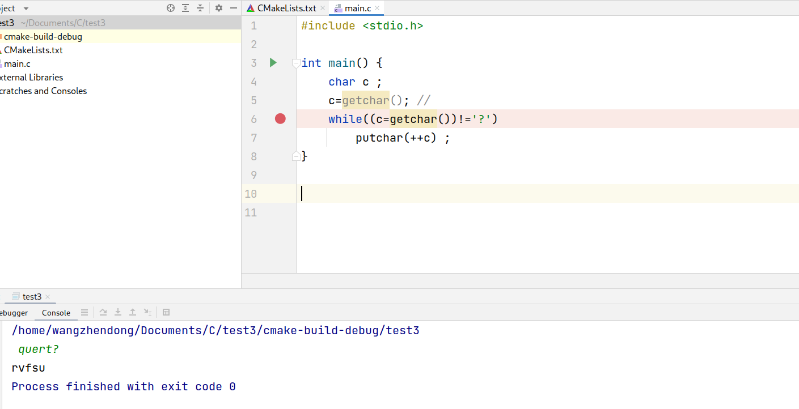
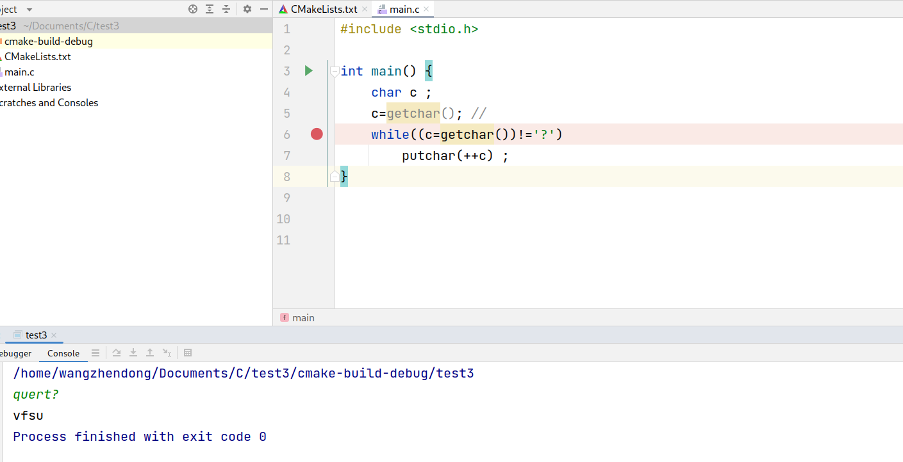

[toc]


# 数据输入和输出

C语言没有IO语句，IO操作全部用函数实现

#include<stdio.h> 引入标准输入输出


## putchar

*   格式
    *   `putchar(c)`

### 例： 

```c
#include<stdio.h> 
main() 
{
    int c; 
    char a; 
    c=65;a="B" 
    putchar(c);putchar('\n');putchar(a);
}

/*
运行结果：
A
B
*/
```


## printf

*   格式： 
    *   `printf("格式控制串"，输出表)`
*   按照指定格式向显示器输出数据
*   输出表： 
    *   要输出的数据，可以没有，多个的时候用逗号隔开 
*   格式控制串： 
    *   格式说明： %[修饰符]格式字符，用于指定输出格式 
    *   普通字符或转义序列，原样输出


### 格式字符： 

| 格式字符 | 含义               | 代码                              | 输出结果    |
| -------- | ------------------ | --------------------------------- | ----------- |
| %d       | 十进制整数         | `int a=567;printf("%d",a);`       | 567         |
| %x       | 十六进制无符号整数 | `int a=255;printf("%x",a);`       | ff          |
| %o       | 八进制无符号整数   | `int a=65;printf("%o",a);`        | 101         |
| %u       | 十进制无符号整数   | `int a=567;printf("%u",a);`       | 567         |
| %c       | 单一字符           | `char a=65;printf("%c",a);`       | A           |
| %s       | 字符串             | `printf("%s","ABC");`             | ABC         |
| %f       | 六位浮点型         | `float a=567.789;printf("%f",a);` | 567.789.000 |
| ％e      | 以指数形式输出实数 |                                   |             |


```c
main() 
{
    unsigned int u=65535 
    printf("u=%d",u) 
}
// u=-1 
//无符号的65535是有符号的-1 

int a=234;
printf("a=%4d\n",a); // 1. 输出四位整数，输出右对其,左补空格 
printf("a=%2d\n",a); // 2. 输出两位整数，指定小于实际，原样输出
// a= 234
// a=234 

float f=24.3567;        //%m.nf 
printf("f=%7.2f\n",f);  // m数据总长，n小数位
printf("f=%10.5f\n",f); // 实际>n则四舍五入 实际<n则补零
// f=  24.36 
// f=  24.35670 

int a=1,b=2;           
printf("%d\n",(a,b));  // 输出格式少于输出项，多余的输出项不输出
printf("%d\n",a,b);
// 2 
// 1 

```


## getchar

*   功能： 
    *   从键盘读取一个字符

*   格式： 
    *   `getchar()` 

```c
#include<stdio.h>
int main() 
{
    int c; 
    printf("Enter a character: "); 
    c=getchar(); 
    printf("%c---->hex%x\n",c,c); 
}
```


### getchar经典案例（缓存清除）

```c
#include <stdio.h>

int main() {
    char c ;
    c=getchar(); 
    while((c=getchar())!='?')
        putchar(++c) ;
}
/*
条件：输入以？结尾的任意字符，输出结果会不会输出第一个字符和问号字符
*/
//例如： 输入quert? 得出的结果为vfsu 
//例如： 输入_(这是一个空格)quert? 得出的结果为rvfsu
//详细看图一以及图二
```


#### 图一：




#### 图二



产生这样的原因是因为在使用getchar()函数的时候，getchar函数本身只能接收一个字符，而不可以去直接接受字符串，因此，在getchar中，如果直接给他输入一个字符串，那么他也只会将第一个输入的字符读取进变量中，剩下的字符串被存放在缓冲区域中，我们输入的时候的命令行就是一个缓冲区域，putchar的本质和getchar一样，一次性只能读取输出一个字符，如果有多于的字符，会直接在缓冲区中进行读取。因此在我们输入quert？的时候，第一个字符q会被直接存放，但是后续的内容会经过缓冲区进行到下一个步骤，也就是进入到putchar,而putchar也将在缓冲区中读取我们的字符并且参与计算，因此第一位的q不会进行打印，结束的时候进行了条件判断，当不等于？的时候，会进行循环，如果输入的内容等于了？，则会跳出循环。 如果我们第一个输入的就是？，那么这个就会直接填满getchar本身的空间，后续的内容会全部放在缓冲区中，因此如果我们第一个输入了？那么后续无论怎么输入并且回车，他都会第一时间计算出结果，直到遇到下一个？。

getchar():

当程序调用getchar时.程序就等着用户按键.用户输入的字符被存放在键盘缓冲区中.直到用户按回车为止(回车字符也放在缓冲区中).

当用户键入回车之后,getchar才开始从stdin流中每次读入一个字符.

getchar函数的返回值是用户输入的第一个字符的ASCII码,如出错返回-1,且将用户输入的字符回显到屏幕.

如用户在按回车之前输入了不止一个字符,其他字符会保留在键盘缓存区中,等待后续getchar调用读取.也就是说：后续的getchar调用不会等

待用户按键,而直接读取缓冲区中的字符,直到缓冲区中的字符读完为后,才等待用户按键.

#### 文章参考：

[getchar函数更深层的原理](./附录文件/getchar函数更深层的原理.md)

[getchar()原理及易错点解析](https://blog.csdn.net/weixin_44551646/article/details/98076863)

[scanf陷阱--缓冲区引起的跳过输入问题](https://blog.csdn.net/n_s_x14/article/details/83023798)


## scanf

*   格式： 
    *   `scanf("格式控制串"，地址表)`
*   功能： 
    *   按照指定格式从键盘读入数据，存入地址表指定的存储单元中，并且按回车键结束
*   地址表： 
    *   变量的地址，常用取地址符& 

*   输入分隔符的指定： 
    *   一般以空格或者回车作为分隔符
    *   其他字符做分隔符需要格式串中两个格式符中间的字符

*   注意： 在赋予char的时候 空格也是字符


