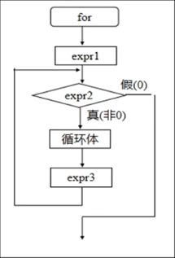
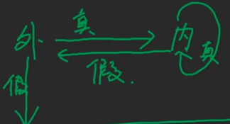

[toc]


# 循环结构


## while

while 语法格式和if语法格式一样，只是if使用判断，while是循环

```c
//先判断后执行
while(表达式)
    循环体语句; 
```

当满足表达式的时候，则执行循环体语句，如果不满足表达式，则直接跳出

```c
#include<stdio.h>
void main() 
{
    int i=1,sum=0 
    while (i<=5)
    {
        sum=sum+i; 
        i++; 
    }
    printf("%d\n",sum); 
}
```

```c
#include<stdio.h>
int main() 
{
	int i=1; 
	while (i<=10) 
	{
		printf("%d*%d=%d\n",i,i,i*i); 
		i++; 
	}
}
```


## do~while

```c
//先执行后判断,判断满足，则执行do内循环语句
#include<stdio.h>
int main() 
{
	int i=1,sum=0 
    do 
    {
        sum=sum+i; 
        i++; 
    }
    while (i<=5); 
    printf("%d\n",sum);
}
```


## for

++) 
          s+=i++; 

for循环开始之后，先执行语句1，然后执行语句2，语句2为真则执行循环体，循环体执行结束执行语句3，然后执行语句2，直到语句2为假，跳出循环体

```c
/* for (for循环变量初始值；循环条件；循环变量值变化)
        循环体                                */

for(ex1;ex2;ex3)  //ex1为初始值，ex2为条件判断，ex3是当一次循环执行结束之后的一个自增自减
    
#include<stdio.h> 
int main()
{
    int i,s=0 
    for (i=1;i<=5;i++) 
         s+=i; 
    printf("%d,%d\n",s,i); 
}
//连续数字加减
```


```c
//偶数合
#include<stdio.h>
int main() 
{
    int i,s=0 
     for (i=1;i<6;i++) 
          s+=++i; 
     printf("%d\n",s); 
}
```

```c
//奇数合
#include<stdio.h>
int main() 
{
    int i,s=0 
     for (i=1;i<6;i++) 
          s+=i++; 
     printf("%d\n",s); 
}
```


## break

强行结束循环体 

```c
#include<stdio.h>
int main() 
{
    int i,s=0;
    for (i=1;i<=10;i++)
    {
        s+=i;
            if (s>5) break; 
    }
    printf("%d\n",s); 
}
```


## continue 

结束本次循环，执行下一次循环条件判定 

```c
#include<stdio.h>
int main()
{
        int i=0,j=4;
        while (i<j)
        {
               i++;
                  if (i%3!=0) continue;
                  j--;
        }
        printf("%d,%d\n",i,j);
}
```


## 循环嵌套



当外部条件为真，则进入内部循环，当内部循环为假的时候，跳出内部循环，进入外部循环，当外部循环为假的时候则结束所有循环。

``` c
#include<stdio.h> 
int main() 
{
    int i,j; 
    for (i=1;i<=2;i++) 
        for (j=1;j<=3;j++) 
            printf("*"); 
}
```

```c
// 最大公约数
#include<stdio.h> 
int main() 
{
    int a=18,b=11; 
    while(a!=b)
    {
        while (a>b) a-=b; 
        while (b>a) b-=a;
    }
    printf("%d,%d\n",a,b);
}
```

```c

#include<stdio.h>
int main() 
{
    int i,j,x=0 ;
    x++;
    for (j=0;j<3;j++)
    {
        if (j%2) continue; 
        x++;
    }
    x++;
    printf("x=%d\n",x);
}
```


## 斐波那契数列

1 1 2 3 5 8 

```c
#include<stdio.h> 
int main() 
{
    int i,a=1,b=1,s,c; 
    for(i=1;i<=20;i++) 
    s=a+b; 
    c=a; 
    a=b;
    b=c; 
}
```


