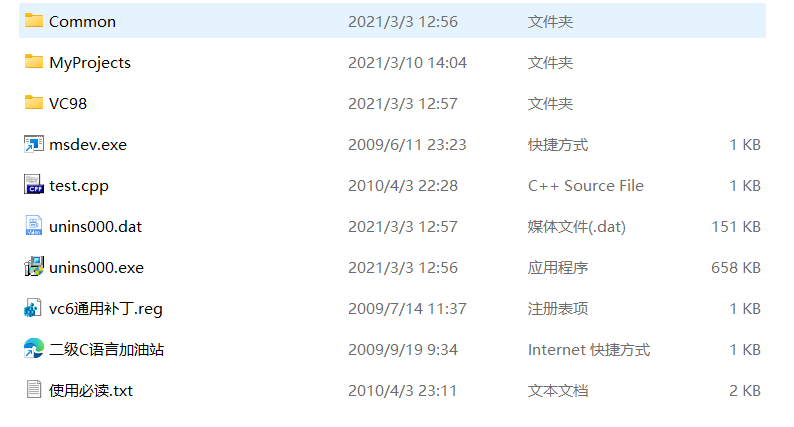
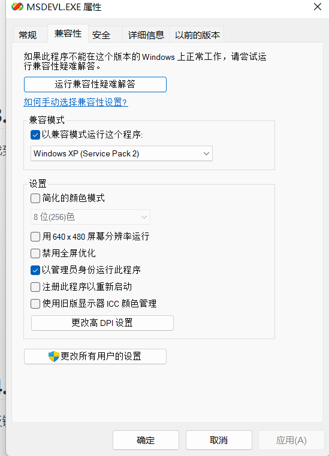
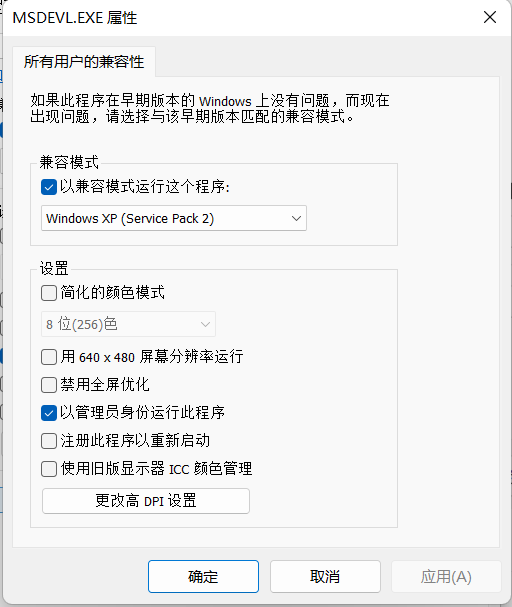

[toc]

# Win11下VC6.0无法正常运行解决方案

## 1.

解压结束了之后会有Microsoft Visual Studio文件  进入Microsoft Visual Studio文件夹

## 2. 

找到Common 进入Common 找到MSDev98进入MSDev98 找到bin 进入bin

## 3. 

找到MSDEV.EXE，将MSDEV.EXE改为MSDEVL.EXE

## 4. 

反键进入属性找到兼容性，以兼容模式运行这个程序 选择windows xp (service pack 2) , 以勾选以管理员身份运行此程序 

## 5. 

选择更改所有用户的兼容性，以兼容模式运行这个程序 选择windows xp (service pack 2) , 以勾选以管理员身份运行此程序。全部无脑确定，然后运行程序

## 6.

运行成功

