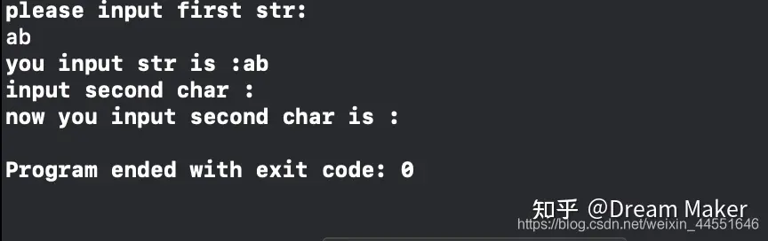
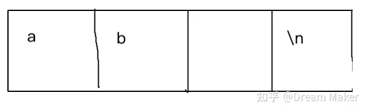
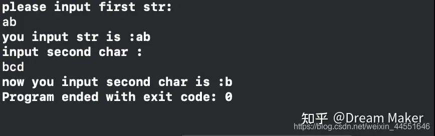
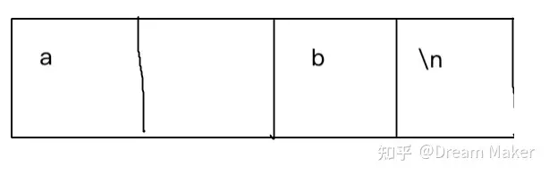
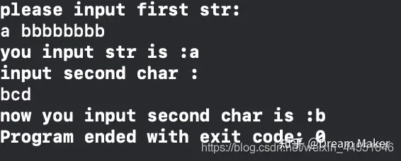
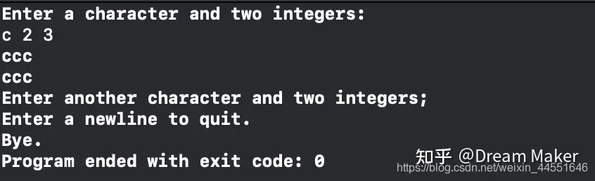
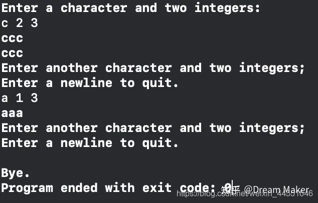
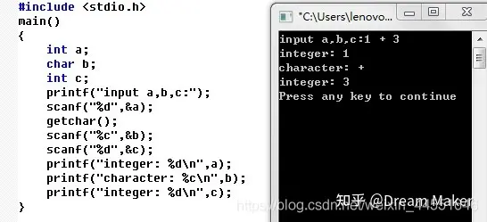
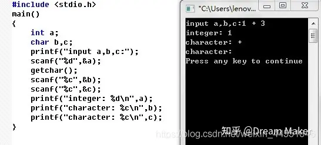

[toc]


# getchar()系列


## 1.getchar()工作原理及作用

工作原理：getchar()是stdio.h中的库函数，它的作用是从stdin流中读入一个字符，也就是说，如果stdin有数据的话不用输入它就可以直接读取了，第一次getchar()时，确实需要人工的输入，但是如果你输了多个字符，以后的getchar()再执行时就会直接从缓冲区中读取了。

实际上是 输入设备->内存缓冲区->getchar()

你按的键是放进缓冲区了,然后供程序getchar()

你有没有试过按住很多键然后等一会儿会滴滴滴滴响,就是缓冲区满了,你后头按的键没有存进缓冲区.

键盘输入的字符都存到缓冲区内,一旦键入回车,getchar就进入缓冲区读取字符,一次只返回第一个字符作为getchar函数的值,如果有循环或足够多的getchar语句,就会依次读出缓冲区内的所有字符直到’\n’.要理解这一点,之所以你输入的一系列字符被依次读出来,是因为循环的作用使得反复利用getchar在缓冲区里读取字符,而不是getchar可以读取多个字符,事实上getchar每次只能读取一个字符.如果需要取消’\n’的影响,可以用getchar();来清除,这里getchar();只是取得了’\n’但是并没有赋给任何字符变量,所以不会有影响,相当于清除了这个字符.

**作用1:** 从缓冲区读走一个字符，相当于清除缓冲区。

**作用2:** 前面的scanf()在读取输入时会在缓冲区中留下一个字符’\n’（输入完按回车键所致），所以如果不在此加一个getchar()把这个回车符取走的话，接下来的scanf()就不会等待从键盘键入字符，而是会直接取走这个“无用的”回车符，从而导致读取有误。

## 2.使用getchar()清理回车\n

**这个问题转载自[n_s_X14](https://link.zhihu.com/?target=https%3A//blog.csdn.net/n_s_x14/article/details/83023798),但是作者在文章最后留了一个问题，现在在这里给大家解释一下原因。**

```c
#include <stdio.h>

int main(void){
    char m[40];
    char n;
    printf("please input first str:\n");    //提示用户输入第一个字符串
    scanf("%s",m);                         //获取用户第一个输入字符串
    printf("you input str is :%s\n",m);    //输出用户的输入的第一个字符串
    printf("input second char :\n");        //提示用户输入第二个字符
    scanf("%c",&n);                         //获取用户的第二个字符
    printf("now you input second char is :%c\n",n);//输出用户输入的第二个字符
    return 0;
    
}
```

输出：

```csharp
please input first str:
abc
you input str is :abc
input second char :
now you input second char is :

Program ended with exit code: 0
```

**问题：**我们第一次输入abc后成功打印出来了you input str is :abc，但是执行到printf("input second char :\n");时，还没等到第二次输入就打印出来了。这是为什么？？

**原因：**

其实在我们第一次输入并按下回车的时候，控制台一共获得了四个字符,分别是:a、b、c、回车(enter)。但是因为scanf()方法遇到非字符的时候会结束从控制台的获取，所以在输入’abc’后，按下 ‘回车（enter）’ 的同时，将’abc’这个值以字符串的形式赋值给了类型为 ‘char’ 的 ‘m’ 数组，将使用过后的字符串: ‘回车(enter)’ 保存在控制台输入的缓冲区，然后继续执行下一段输出代码，然后又要求用户输入。此时，因为上一次被使用过后的字符串被保存在缓冲区，现在scanf()方法从控制台的缓冲区获取上一次被使用过后的字符串，并只截取第一个字符: ‘回车（enter）’ ,此时控制台缓冲区才算使用完了。所以在看似被跳过的输入，其实已经scanf()方法已经获取了我们的输入了，这个输入就是一个 ‘回车（enter）’ 。


解决问题：

使用getchar（）方法，清除掉abc后面的缓存（回车enter）。

```c
#include <stdio.h>

int main(void){
    char m[40];
    char n;
    printf("please input first str:\n");    //提示用户输入第一个字符串
    scanf("%s",&m);                         //获取用户第一个输入字符串
    printf("you input str is :%s\n",m);    //输出用户的输入的第一个字符串
    getchar();
    printf("input second char :\n");        //提示用户输入第二个字符
    scanf("%c",&n);                         //获取用户的第二个字符
    printf("now you input second char is :%c\n",n);//输出用户输入的第二个字符
    return 0;
    
}
```

输出：

```c
please input first str:
abc
you input str is :abc
input second char :
de
now you input second char is :d
Program ended with exit code: 0
```

## 3.使用getchar()清理缓存

**文章结束时留了一个问题：如果在第一次输入ab后加一个空格再回车，又会出现原来的问题,即程序只输出了ab后就自动跳过下一次的输入之间退出了，控制台输出如下图所示。**



原因：

1.在获取用户第一个输入字符串时，scanf("%s",&m);，我们用%s作为转换说明，%s的作用是“把输入解释成字符串。从第一个非空白字符开始，到下一个空白字符之前的所有字符都是输入。”所以scanf把输入的ab空格+回车就理解为ab+回车(ab后面没有空格)，但是依然以ab空格+回车的形式存储在缓存区。



2.我们输入ab空格+回车，在缓存区是这样存放的:

其中，第三格存放的为空格键。

当程序运行完 getchar();后，只清除了第三格中的空格键，因为一次执行getchar();只清除一个缓存，留下了第四格中的回车键，因此再次出现了同样的问题。

解决问题：那么就是说只要运行两次getchar();，清除掉第三格和第四格就可以正常了。

```c
#include <stdio.h>

int main(void){
    char m[40];
    char n;
    printf("please input first str:\n");    //提示用户输入第一个字符串
    scanf("%s",m);                         //获取用户第一个输入字符串
    printf("you input str is :%s\n",m);    //输出用户的输入的第一个字符串
    
    getchar();                              //第一次清除缓存
    getchar(); 								//第二次清除缓存
    
    printf("input second char :\n");        //提示用户输入第二个字符
    scanf("%c",&n);                         //获取用户的第二个字符
    printf("now you input second char is :%c\n",n);//输出用户输入的第二个字符
    return 0;
    
}
```

输出：



由此可见，当我们第一次输入ab空格+回车后，程序正常运行。

**进一步**：如果我们输入的是`a空格b+回车`，`scanf("%s",m);` 这一步只能读取到a，因为a后面有空格。但是`a空格b+回车`在缓冲区这样存放：



因此，如果想要程序正常运行则需要在输出用户的输入的第一个字符串后加入三次`getchar();`操作，即删除掉第二，第三，第四格的内容。

**问题：如果我们输入`a空格bbbbbbbb+回车`，那可能需要无数个`getchar();`来清除缓存，这时应该怎么办？？**

**解决方法**：加入while循环`while(getchar()!='\n') continue;`

```c
#include <stdio.h>

int main(void){
    char m[40];
    char n;
    printf("please input first str:\n");    //提示用户输入第一个字符串
    scanf("%s",m);                         //获取用户第一个输入字符串
    printf("you input str is :%s\n",m);    //输出用户的输入的第一个字符串
    
    while(getchar()!='\n')					//通过while循环删除缓存
        continue;
        
    printf("input second char :\n");        //提示用户输入第二个字符
    scanf("%c",&n);                         //获取用户的第二个字符
    printf("now you input second char is :%c\n",n);//输出用户输入的第二个字符
    return 0;
    
}
 
```

这时，我们输入`a空格bbbbbbbb+回车`,程序正常运行。



```c
 while(getchar()!='\n')
        continue;
```

可以看出这段代码代替了无数个getchar()，他的作用是**跳过剩余的输入行**


第一次while循环消除第二格缓存，第二次while循环消除第三格缓存……直到第八次。最后一次同样，getchar()也消除了回车。

while(getchar()!='\n'）可以拆分成两步，

- 第一步调用getchar()方法（这里getchar();只是取得了’\n’但是并没有赋给任何字符变量,所以不会有影响,相当于清除了这个字符）。
- 第二步判断获取到的缓存是否等于’\n’。

## 4.混合scanf()与getchar()

假设程序要求用getchar()处理字符输入，用scanf()处理数值输入，这两个函数都能很好的完成任务，但是不能混合使用。 因为getchar()读取每个字符，包括空格、制表符和换行符；而scanf()在读取数字时则会跳过空格、制表符和换行符。

例：

要求用户输入一个字母和两个数字，输出以第一个数字为行数，第二个数字为列数，以字母为内容的数列，要求可以不断输入直至键入回车退出程序：

```c
#include <stdio.h>
void display(char cr,int lines,int width);
int main(int argc, const char * argv[]) {
   
    int ch;
    int rows,cols;
    printf("Enter a character and two integers:\n");
    while((ch=getchar())!= '\n'){
        scanf("%d %d", &rows,&cols);
        display(ch, rows, cols);
        printf("Enter another character and two integers;\n");
        printf("Enter a newline to quit.\n");
    }
    printf("Bye.\n");
    return 0;
    
    }
void display(char cr,int lines,int width){
    int row,col;
    
    for(row=1; row<= lines; row++){
        for(col =1; col<=width; col++){
            putchar(cr);
        }
        putchar('\n');
            }
}
```



我们发现，在第一次输入成功打印后，程序自动退出。这明显不符合我们的题目要求。

原因是，输入的c23其实是c23+换行符，scanf()函数把这个换行符留在了缓存中。getchar()不会跳过换行符，所以在进入下一轮迭代时，还没来得及输入字符，它就读取了换行符，然后将其赋值给了ch。而ch是换行符正式终止循环的条件。

如何改进？？

1. 我们需要删除scanf()函数留在缓存中的换行符即可。
2. 在if语句中使用一个break语句，可以在scanf（）的返回值不等于2时终止程序，即如果一个或两个输入值不是整数或者遇到文件结尾就终止程序。

```c
#include <stdio.h>
void display(char cr,int lines,int width);
int main(int argc, const char * argv[]) {
   
    int ch;
    int rows,cols;
    printf("Enter a character and two integers:\n");
    while((ch=getchar())!= '\n'){
        if( scanf("%d %d", &rows,&cols)!=2 ){
            break;
        }
        display(ch, rows, cols);
        
        while(getchar()!='\n'){
            continue;
        }
        printf("Enter another character and two integers;\n");
        printf("Enter a newline to quit.\n");
    }
    printf("Bye.\n");
    return 0;
    
    }
void display(char cr,int lines,int width){
    int row,col;
    
    for(row=1; row<= lines; row++){
        for(col =1; col<=width; col++){
            putchar(cr);
        }
        putchar('\n');
            }
}
```



题外话：

scanf()中转化符的问题





**问题：**从上面两张图片中可以看出，当scanf("%d",&c);改为scanf("%c",&c);时，控制台中出现了图二的问题。character为什么为空白？？


**原因：**

如果格式是%c，那么任何字符都是它想要的，所以第二个程序中的第二个scanf("%c")会得到‘+’后面的空格’ '。如果格式是%d，则会忽略任何空白字符（空格、回车、制表符等），忽略的意思是，从缓冲区里删除，但并不保存；如果遇到数字，则拿出并保存给后面的整数，也就是说%d的时候，scanf想要的字符是数字和空白符。所以第一个程序里的第二个scanf("%d")忽略掉了空格，正确输入了数字。

------